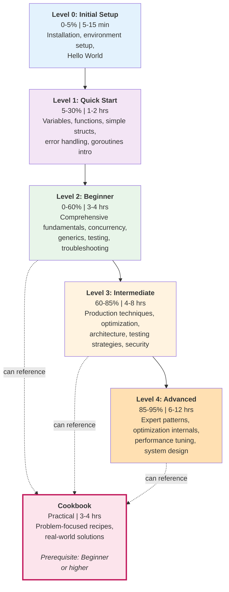

# Technical Documentation: Golang Full Set Tutorial Series

## Architecture Overview

The Golang Full Set tutorial series follows a hierarchical learning architecture with 6 distinct levels organized into two tracks:

**Sequential Track (Full Set - 5 levels)**:

```
Initial Setup (0-5%) → Quick Start (5-30%) → Beginner (0-60%) → Intermediate (60-85%) → Advanced (85-95%)
```

**Parallel Track**:

```
Cookbook (Practical, any level)
```

### Learning Path Flow



**Key Architectural Principles**:

1. **Progressive Disclosure**: Each level reveals more complexity
2. **No Duplication**: Content is unique to each level, with cross-references
3. **Parallel Access**: Cookbook provides practical solutions at any stage
4. **Clear Boundaries**: Coverage percentages define scope precisely

## Technology Stack

**Documentation Format**:

- Markdown with YAML frontmatter
- LaTeX for mathematical notation (if needed)
- Mermaid for diagrams (Obsidian compatible)

**Go Version**:

- Recommended: **Go 1.23.4 or later** (latest stable as of December 2025)
- Minimum: Go 1.18+ (generics support)
- All code examples must be runnable on Go 1.23.4
- Version-specific features noted explicitly
- Note: Always install the latest patch version from https://go.dev/dl/ for security and bug fixes

**Tools**:

- `docs-tutorial-maker`: Creates tutorials following conventions
- `docs-tutorial-checker`: Validates tutorial quality
- Obsidian: Primary documentation viewer
- GitHub: Rendering compatibility required

## Design Decisions

### Decision 1: Multi-File vs Single-File Structure

**Context**: Need to determine whether each tutorial is a single file or split into multiple files.

**Decision**: Use single-file structure for all new tutorials (README.md only per tutorial).

**Rationale**:

- Estimated line counts (revised after discovering current Quick Start is actually Beginner):
  - Initial Setup: ~300-500 lines (installation + Hello World only) - CREATE NEW
  - Quick Start: ~500-800 lines (extract touchpoints from Beginner) - CREATE NEW
  - Beginner: 2,279 lines (EXISTS - rename current tu-soen-prla-gola\_\_quick-start.md)
  - Intermediate: ~2,500-3,500 lines (professional patterns 60-85%) - CREATE NEW
  - Advanced: ~2,500-3,500 lines (expert-level 85-95%, distributed systems) - CREATE NEW
- Single-file is simpler to navigate for tutorials
- All tutorials within the 5000 line upper limit
- Beginner already complete at 2,279 lines (comprehensive, proven content)

**Alternatives Considered**:

- Multi-file structure (README.md + sections): Too complex for these tutorial sizes
- Split Beginner into parts: Would violate single-focus principle and create confusion

**Consequences**:

- Each tutorial is self-contained in one file
- Easier cross-referencing between tutorials
- Simpler file structure in tutorials directory
- May need to be vigilant about Beginner tutorial length (if exceeds 1500 lines, consider splitting)

### Decision 2: Content Distribution Strategy

**Context**: After discovering the current "Quick Start" is actually Beginner-level content (2,279 lines, 0-60% coverage), need a strategy to create the missing tutorials without duplication.

**Decision**:

- **Initial Setup**: Installation and basic verification only (CREATE NEW)
- **Quick Start**: Extract touchpoints from Beginner (CREATE NEW by extraction)
- **Beginner**: Rename current "Quick Start" file (RENAME existing, update frontmatter only)
- **Intermediate**: Production focus (CREATE NEW, references Cookbook recipes)
- **Advanced**: Expert techniques (CREATE NEW, references Beginner and Cookbook)
- **Cookbook**: Update prerequisites (UPDATE existing)

**Rationale**:

- Current "Quick Start" is comprehensive Beginner content (proven, complete, works well)
- Don't rewrite what already exists - just rename it
- Extract a lighter Quick Start (500-800 lines) by pulling highlights from Beginner
- Cookbook has excellent patterns (reference them, don't rewrite)
- Each level adds unique value:
  - Initial Setup: Gets learner running fast (NEW)
  - Quick Start: Syntax touchpoints to explore independently (NEW - extracted)
  - Beginner: Comprehensive foundation (EXISTS - just rename)
  - Intermediate: Production techniques and architecture (NEW)
  - Advanced: Expert optimization and internals (NEW)
  - Cookbook: Practical recipes (EXISTS - update prerequisites)

**Alternatives Considered**:

- Rewrite Beginner from scratch: Wasteful, current content is excellent
- Keep current naming: Confuses learners (Quick Start implies 1-3 hrs, but takes 3-4 hrs)
- Split Beginner into parts: Would create confusion and break single-focus principle

**Consequences**:

- Fastest path to completion (only 3 truly new tutorials + 1 extraction + 1 rename)
- Beginner content already proven and comprehensive
- Quick Start extraction ensures consistency (comes from same source)
- Clear delineation of what each level covers
- May need minor updates to Beginner after extraction for cross-linking

### Decision 3: Tutorial Progression Model

**Context**: Need to define how learners progress and what "coverage percentage" means.

**Decision**: Coverage percentage = breadth of Go features and patterns, not depth.

**Coverage Breakdown**:

- **0-5% (Initial Setup)**: Installation + Hello World
- **5-30% (Quick Start)**: Core syntax, basic types, functions, simple concurrency, generics intro
- **0-60% (Beginner)**: All of 0-30% + comprehensive feature coverage, common patterns, testing, error handling
- **60-85% (Intermediate)**: Advanced features, production patterns, optimization, architecture, security
- **85-95% (Advanced)**: Expert techniques, complex patterns, internals, performance profiling, system design
- **95-100% (Not Covered)**: Specialized research topics, experimental features, academic-level content

**Rationale**:

- Coverage is about feature and pattern exposure, not expertise depth
- Learner can know 60% of features at beginner level vs expert level
- Percentage guides content scoping objectively
- Follows Tutorial Naming Convention definitions

**Alternatives Considered**:

- Coverage = depth of expertise: Too subjective, hard to measure
- Linear progression (each level adds same %): Doesn't match learning curve (more features at beginner, deeper at advanced)

**Consequences**:

- Clear content scoping for each tutorial
- Prevents scope creep
- Learners understand what to expect at each level
- Advanced tutorial doesn't try to cover everything (95% is mastery)

## Feature Coverage Matrix

This matrix documents which Go features and concepts are introduced in each tutorial level, preventing duplication and ensuring logical learning progression.

| Feature/Concept                  | IS  | QS  | BEG | INT | ADV | Complexity  | Notes                                                     |
| -------------------------------- | --- | --- | --- | --- | --- | ----------- | --------------------------------------------------------- |
| **Installation & Setup**         | ✓   |     |     |     |     | Low         | Download, install, verify only                            |
| **Hello World**                  | ✓   |     |     |     |     | Low         | package main, func main basics                            |
| **Variables & Types**            |     | ✓   | ✓   |     |     | Low         | var, :=, const, basic types (int, string, bool, float64)  |
| **Zero Values**                  |     | ✓   | ✓   |     |     | Low         | Mention in QS, explain in BEG                             |
| **Control Flow (if/for/switch)** |     | ✓   | ✓   |     |     | Low         | Basic syntax in QS, comprehensive in BEG                  |
| **Functions (basic)**            |     | ✓   | ✓   |     |     | Low         | Declaration, parameters, returns                          |
| **Multiple Return Values**       |     | ✓   | ✓   |     |     | Low         | Touch in QS, explain in BEG                               |
| **Error Handling (basic)**       |     | ✓   | ✓   | ✓   |     | Medium      | if err != nil pattern (QS/BEG), wrapping (INT)            |
| **Structs (basic)**              |     | ✓   | ✓   |     |     | Medium      | Definition, initialization in QS; methods in BEG          |
| **Slices (basic)**               |     | ✓   | ✓   |     |     | Medium      | Creation, access in QS; append, internals in BEG          |
| **Maps (basic)**                 |     | ✓   | ✓   |     |     | Medium      | Creation, access in QS; iteration in BEG                  |
| **Packages (import)**            |     | ✓   | ✓   |     |     | Medium      | Using standard library (QS), custom packages (BEG)        |
| **Goroutines (intro)**           |     | ✓   | ✓   |     |     | Medium      | What is, go keyword (QS); practical usage (BEG)           |
| **Channels (basic)**             |     |     | ✓   | ✓   |     | Medium      | Buffered/unbuffered (BEG), patterns (INT)                 |
| **Methods**                      |     |     | ✓   |     |     | Medium      | Pointer vs value receivers                                |
| **Interfaces**                   |     |     | ✓   | ✓   |     | Medium      | Definition, implementation (BEG); advanced patterns (INT) |
| **Pointers**                     |     |     | ✓   |     |     | Medium      | Basics, when to use                                       |
| **Type Embedding**               |     |     | ✓   |     |     | Medium      | Struct embedding                                          |
| **Generics (intro)**             |     |     | ✓   | ✓   | ✓   | Medium-High | Basics (BEG), type constraints (INT), advanced (ADV)      |
| **Testing (basic)**              |     |     | ✓   | ✓   |     | Medium      | Unit tests, table-driven (BEG); integration (INT)         |
| **Modules (go.mod)**             |     |     | ✓   |     |     | Medium      | Creating, managing dependencies                           |
| **Error Wrapping**               |     |     |     | ✓   |     | Medium      | errors.Is, errors.As, wrapping chains                     |
| **Context Package**              |     |     |     | ✓   | ✓   | Medium      | Timeout, cancellation, values                             |
| **Concurrency Patterns**         |     |     |     | ✓   | ✓   | High        | Worker pools (INT), advanced patterns (ADV)               |
| **Workspace Mode (go.work)**     |     |     |     | ✓   |     | Medium      | Multi-module development                                  |
| **Mocking & Interfaces**         |     |     |     | ✓   |     | Medium      | Test doubles, dependency injection                        |
| **Benchmarking**                 |     |     |     | ✓   | ✓   | Medium      | Basic benchmarks (INT), optimization (ADV)                |
| **Profiling (pprof intro)**      |     |     |     | ✓   | ✓   | High        | Basic profiling (INT), deep dive (ADV)                    |
| **Architecture Patterns**        |     |     |     | ✓   |     | High        | Hexagonal, Clean Architecture                             |
| **Security Best Practices**      |     |     |     | ✓   |     | Medium      | Validation, injection prevention, secrets                 |
| **Deployment & Observability**   |     |     |     | ✓   |     | Medium      | Build, health checks, logging, metrics                    |
| **Profiling (pprof advanced)**   |     |     |     |     | ✓   | High        | CPU, memory, block, mutex profiling                       |
| **Escape Analysis**              |     |     |     |     | ✓   | High        | Understanding allocations                                 |
| **Assembly Inspection**          |     |     |     |     | ✓   | High        | Reading Go assembly                                       |
| **Runtime Internals**            |     |     |     |     | ✓   | High        | Scheduler (M:N), GC, memory allocator                     |
| **Advanced Sync Primitives**     |     |     |     |     | ✓   | High        | Cond, Once, Map, atomic operations                        |
| **Lock-Free Data Structures**    |     |     |     |     | ✓   | High        | Memory models, happens-before                             |
| **Advanced Generics**            |     |     |     |     | ✓   | High        | Type constraints, inference, performance                  |
| **Reflection**                   |     |     |     |     | ✓   | High        | Use cases, pitfalls, serialization                        |
| **Unsafe Package**               |     |     |     |     | ✓   | High        | When and why to use                                       |
| **CGo**                          |     |     |     |     | ✓   | High        | Calling C from Go                                         |
| **Delve Debugger (advanced)**    |     |     |     |     | ✓   | High        | Complex debugging scenarios                               |
| **System Design Patterns**       |     |     |     |     | ✓   | High        | Circuit breaker, rate limiting, CQRS                      |
| **Go Tooling Mastery**           |     |     |     |     | ✓   | Medium-High | go generate, custom linters, code gen                     |

**Legend**:

- **IS** = Initial Setup (0-5%)
- **QS** = Quick Start (5-30%)
- **BEG** = Beginner (0-60%)
- **INT** = Intermediate (60-85%)
- **ADV** = Advanced (85-95%)

**Usage Rules**:

1. **If QS covers it**: BEG expands with depth; INT/ADV reference BEG
2. **If BEG covers it**: INT/ADV reference BEG and add advanced aspects
3. **If INT introduces it**: ADV can add expert-level depth
4. **No duplication**: Each level adds unique value, references earlier tutorials for foundations

**Content Relationship**:

- **QS is subset of BEG**: Every topic in QS is covered MORE comprehensively in BEG
- **BEG is foundation**: INT and ADV build on BEG's comprehensive coverage
- **INT adds production**: Professional techniques building on BEG fundamentals
- **ADV adds mastery**: Expert-level depth on INT/BEG topics + internals

## Content Outlines

### REQ-002: Rename Current Quick Start to Beginner

**Current File**: `tu-soen-prla-gola__quick-start.md` (2,279 lines)

**New File**: `tu-soen-prla-gola__beginner.md` (2,279 lines - content unchanged)

**Action**: RENAME existing file + UPDATE frontmatter only

**Why This Is Beginner, Not Quick Start**:

- ✅ Comprehensive coverage from zero (0-60%, not 5-30%)
- ✅ 2,279 lines (far exceeds Quick Start range of 500-800 lines)
- ✅ Time estimate: 3-4 hours (not 1-2 hours for Quick Start)
- ✅ Multiple examples and practice exercises (4 levels!)
- ✅ Common patterns (concurrency, generics, error handling)
- ✅ Testing fundamentals (basic + table-driven)
- ✅ Troubleshooting section
- ✅ Everything the convention defines as "Beginner"

**Frontmatter Changes Required**:

```yaml
OLD frontmatter:
---
title: "Golang Quick Start"
description: "Learn Go programming fundamentals quickly"
category: tutorial
tags:
  - golang
  - quick-start
  - programming-language
created: [date]
updated: [date]
estimated_time: "2-3 hours"
---
NEW frontmatter:
---
title: "Complete Beginner's Guide to Go"
description: "Comprehensive Go programming tutorial covering 0-60% of the language from scratch with hands-on exercises"
category: tutorial
tags:
  - golang
  - beginner
  - comprehensive
  - programming-language
created: [keep original date]
updated: [update to rename date]
estimated_time: "3-4 hours"
---
```

**Implementation Steps**:

1. Use git mv to rename file (preserves history)
2. Update frontmatter fields as shown above
3. Update first paragraph to reflect Beginner positioning
4. Add note explaining the rename (optional)
5. Update internal cross-references if any
6. Keep all 2,279 lines of content unchanged

**Cross-Reference Updates Needed**:

- Prerequisites: Add link to Quick Start (after extraction is complete)
- Next Steps: Update link to Intermediate (when created)

---

### REQ-003: Create NEW Quick Start by Extraction

**New File**: `tu-soen-prla-gola__quick-start.md`

**Source**: Extract highlights from Beginner (tu-soen-prla-gola\_\_beginner.md)

**Target Length**: 500-800 lines

**Coverage**: 5-30% (touchpoints, NOT comprehensive)

**Time Estimate**: 1-2 hours

**Action**: CREATE NEW by extracting key sections from Beginner

**Extraction Strategy**:

Extract and simplify the following sections from Beginner:

1. **Introduction** (60 lines)
   - Hook: "Learn enough Go to explore independently"
   - What you'll learn: Core syntax touchpoints
   - Prerequisites: Initial Setup completed
   - Goal: Read Go docs and try simple examples

2. **Variables and Types** (80 lines)
   - Extract basics only from Beginner section
   - var, :=, const
   - Basic types (int, string, bool, float64)
   - Zero values (mention only)
   - ONE simple example
   - NO deep dive into type conversions

3. **Functions** (70 lines)
   - Extract function basics from Beginner
   - Function declaration, parameters, return values
   - Multiple return values (brief)
   - ONE example
   - NO variadic functions, NO function types

4. **Control Flow** (60 lines)
   - Extract basics: if, for, switch
   - ONE example each
   - NO range details, NO labeled breaks

5. **Simple Structs** (70 lines)
   - Extract struct basics from Beginner
   - Struct definition and initialization
   - Accessing fields
   - ONE simple example
   - NO embedding, NO tags, NO methods yet

6. **Basic Error Handling** (60 lines)
   - Extract error basics from Beginner
   - The error type
   - if err != nil pattern
   - ONE example
   - NO custom errors, NO wrapping

7. **Goroutines Intro** (60 lines)
   - Extract concurrency intro from Beginner
   - What is a goroutine
   - The go keyword
   - ONE simple example
   - NO channels yet, NO sync details

8. **Slices and Maps (Brief)** (70 lines)
   - Extract basics only
   - Slice creation and access
   - Map creation and access
   - ONE example each
   - NO internals, NO append details

9. **Packages (Brief)** (40 lines)
   - Extract package basics
   - import statement
   - Using standard library
   - NO module system, NO custom packages

10. **Next Steps** (40 lines)
    - Link to Beginner for comprehensive learning
    - Link to Cookbook for patterns
    - Suggested practice: Read official Go Tour
    - Resources for exploring further

**Key Features**:

- Touchpoints only (exposure, not mastery)
- Every section references Beginner for depth
- Goal: "Enough to explore independently"
- Simplified from Beginner (remove details, keep highlights)

**Avoids**:

- Comprehensive explanations (that's Beginner)
- Multiple examples per concept
- Advanced features (generics, testing, channels)
- Deep dives

**Content Relationship to Beginner**:

- Quick Start is a SUBSET of Beginner
- Every topic in Quick Start is covered MORE in Beginner
- Quick Start gives confidence to explore
- Beginner gives confidence to build

---

### Tutorial 0: Initial Setup (0-5%, 5-15 min)

**File**: `tu-soen-prla-gola__initial-setup.md`

**Action**: CREATE NEW

**Estimated Length**: 300-500 lines

**Content Structure**:

1. **Introduction** (50 lines)
   - Hook: "Get Go running in 15 minutes"
   - What you'll achieve: Working Go installation + first program
   - Why Go is worth learning (brief)

2. **Prerequisites** (20 lines)
   - Basic command line familiarity
   - No programming experience required

3. **Installation** (100 lines)
   - Download from go.dev/dl
   - Platform-specific instructions (Windows/Mac/Linux)
   - Verification with `go version`
   - Troubleshooting common issues

4. **First Program** (80 lines)
   - Create hello.go
   - Understand package main and func main (brief)
   - Run with `go run`
   - Compile with `go build`
   - Expected output

5. **Verification** (30 lines)
   - Checklist: Can you run go version?
   - Can you run hello.go?
   - Can you build an executable?

6. **Next Steps** (20 lines)
   - Link to Quick Start for learning syntax
   - Link to Beginner for comprehensive learning
   - Resources for getting help

**Key Features**:

- Minimal content, maximum speed
- Platform-specific but concise
- Success-focused (immediate working program)
- Clear "you're done" signal

**Avoids**:

- Explaining Go syntax (that's Quick Start)
- Advanced configuration
- IDE setup (optional, not required)

---

### Tutorial 2: Beginner (0-60%, 3-4 hrs)

**File**: `tu-soen-prla-gola__beginner.md`

**Action**: RENAME existing `tu-soen-prla-gola__quick-start.md` + UPDATE frontmatter

**Current Length**: 2,279 lines (content remains unchanged)

**Current Content** (see REQ-002 above for details):

- This file ALREADY EXISTS as `tu-soen-prla-gola__quick-start.md`
- Contains 21 major sections, 47 subsections
- 4 levels of practice exercises
- Comprehensive coverage: fundamentals, concurrency, generics, testing
- Full troubleshooting section
- All content proven and working well

**Work Required**:

1. Rename file using git mv (preserves history)
2. Update frontmatter (title, description, tags, time estimate)
3. Update first paragraph to reflect Beginner positioning
4. Add cross-reference to Quick Start (after extraction complete)
5. Keep all 2,279 lines of content unchanged

**No Content Rewriting Needed**: This tutorial is complete and comprehensive as-is

---

### Tutorial 3: Intermediate (60-85%, 4-8 hrs)

**File**: `tu-soen-prla-gola__intermediate.md`

**Estimated Length**: 1100-1500 lines

**Content Structure**:

1. **Introduction** (100 lines)
   - Who this is for (developers building production systems)
   - What you'll learn (professional Go techniques)
   - Prerequisites: Beginner tutorial or equivalent experience
   - Learning objectives (8-10 production-focused objectives)

2. **Section 1: Advanced Concurrency Patterns** (200 lines)
   - Worker pools (references Cookbook recipe, adds explanation)
   - Pipeline patterns
   - Fan-out/fan-in
   - Context for cancellation
   - Race detection and debugging
   - Practice: Build scalable job processor

3. **Section 2: Production Error Handling** (180 lines)
   - Error wrapping chains
   - errors.Is and errors.As
   - Error types for different scenarios
   - Logging vs errors
   - Recovery strategies
   - Practice: Build resilient API client with retry logic

4. **Section 3: Testing Strategies** (200 lines)
   - Integration testing
   - Mocking and interfaces
   - Test fixtures and helpers
   - Fuzzing (Go 1.18+)
   - Performance benchmarking
   - Practice: Write comprehensive test suite

5. **Section 4: Code Organization and Architecture** (180 lines)
   - Project structure patterns
   - Dependency injection
   - Repository pattern
   - Hexagonal architecture
   - Clean architecture principles
   - Practice: Refactor project to layered architecture

6. **Section 5: Performance and Optimization** (180 lines)
   - Profiling with pprof (intro)
   - Memory allocation patterns
   - Reducing GC pressure
   - sync.Pool usage
   - Benchmarking techniques
   - Practice: Optimize slow functions using profiling

7. **Section 6: Security Best Practices** (150 lines)
   - Input validation
   - SQL injection prevention
   - Secrets management
   - Secure HTTP clients
   - Common vulnerabilities
   - Practice: Secure existing code

8. **Section 7: Deployment and Observability** (150 lines)
   - Building for production
   - Graceful shutdown
   - Health checks
   - Structured logging
   - Metrics and monitoring (intro)
   - Practice: Add production-ready features

9. **Challenges** (120 lines)
   - Build production-grade REST API
   - Implement worker pool with cancellation
   - Create observable service with metrics

10. **Summary and Next Steps** (80 lines)
    - Production skills mastered
    - Link to Advanced for expert mastery
    - Link to Cookbook for patterns
    - Suggested real-world projects

**Key Features**:

- Production-focused (real-world scenarios)
- References Cookbook recipes (teaches concepts vs copy-paste)
- Security and deployment emphasis
- Performance awareness
- Team collaboration patterns

**Avoids**:

- Beginner-level explanations (assumes mastery)
- Deep internals (that's Advanced)
- Framework tutorials (stays with core Go)

---

### Tutorial 4: Advanced (85-95%, 6-12 hrs)

**File**: `tu-soen-prla-gola__advanced.md`

**Estimated Length**: 1200-1800 lines

**Content Structure**:

1. **Introduction** (100 lines)
   - Who this is for (expert-level mastery seekers)
   - What you'll learn (advanced Go techniques and internals)
   - Prerequisites: Intermediate tutorial completed
   - Learning objectives (8-10 expert objectives)

2. **Section 1: Advanced Profiling and Optimization** (250 lines)
   - Deep dive into pprof (CPU, memory, block, mutex)
   - Escape analysis
   - Assembly inspection
   - Memory layout optimization
   - Cache-friendly code
   - Practice: Optimize performance-critical functions

3. **Section 2: Go Runtime Internals** (220 lines)
   - Goroutine scheduling (M:N model)
   - Stack management (growth, shrinking)
   - Garbage collector (tri-color, generational)
   - Memory allocator (spans, mcache, mcentral)
   - Practice: Understand GC behavior with GODEBUG

4. **Section 3: Advanced Concurrency** (240 lines)
   - Advanced sync primitives (Cond, Once, Map)
   - Lock-free data structures (atomic operations)
   - Memory models and happens-before
   - Deadlock detection and prevention
   - Complex synchronization patterns
   - Practice: Implement lock-free queue

5. **Section 4: Advanced Generics** (180 lines)
   - Type constraints (advanced)
   - Generic algorithms
   - Type inference rules
   - Performance considerations
   - When to use vs when to avoid generics
   - Practice: Build generic data structures

6. **Section 5: Advanced Testing and Debugging** (200 lines)
   - Delve debugger (advanced usage)
   - Race detector deep dive
   - Memory sanitizer
   - Test coverage analysis
   - Mutation testing
   - Practice: Debug complex race conditions

7. **Section 6: System Design Patterns** (200 lines)
   - Circuit breaker pattern
   - Rate limiting strategies
   - Backpressure handling
   - Saga pattern
   - CQRS basics
   - Practice: Implement resilient distributed system pattern

8. **Section 7: Advanced Language Features** (180 lines)
   - Reflection (use cases and pitfalls)
   - Unsafe package (when and why)
   - CGo (calling C from Go)
   - Build tags and conditional compilation
   - Practice: Use reflection for flexible serialization

9. **Section 8: Go Tooling Mastery** (150 lines)
   - go generate
   - Custom linters
   - Code generation
   - Build constraints
   - Dependency management (advanced)
   - Practice: Create custom code generator

10. **Challenges** (150 lines)
    - Optimize memory allocator for specific use case
    - Implement advanced distributed system pattern
    - Build custom profiler extension
    - Analyze and fix complex production issue

11. **Summary and Next Steps** (100 lines)
    - Expert mastery achieved
    - Continuing learning paths (contributing to Go, reading source)
    - Advanced resources
    - Research-level topics (not covered)

**Key Features**:

- Expert-level content (assumes Intermediate mastery)
- Internals and theory
- Complex patterns and trade-offs
- Performance-critical techniques
- Research and experimentation

**Avoids**:

- Beginner/intermediate explanations
- General patterns (covered in earlier tutorials)
- Framework specifics
- 95-100% specialized research topics

## Code Example Directory Structure

All runnable code examples for the tutorial series will be organized in the following structure within the `docs/tutorials/` directory:

```
docs/tutorials/golang-examples/
├── README.md                          # Overview of example repository
├── initial-setup/
│   └── hello-world/
│       ├── hello.go                   # Basic "Hello, World!" program
│       └── README.md                  # Instructions for running
├── quick-start/
│   ├── 01-variables/
│   │   ├── main.go                    # Variable declaration examples
│   │   └── README.md
│   ├── 02-control-flow/
│   │   ├── main.go                    # if, for, switch examples
│   │   └── README.md
│   ├── 03-functions/
│   │   ├── main.go                    # Function examples
│   │   └── README.md
│   ├── 04-structs/
│   │   ├── main.go                    # Simple struct examples
│   │   └── README.md
│   └── 05-goroutines/
│       ├── main.go                    # Basic goroutine example
│       └── README.md
├── beginner/
│   ├── 01-fundamentals/
│   │   ├── variables/
│   │   │   ├── main.go
│   │   │   └── README.md
│   │   ├── types/
│   │   │   ├── main.go
│   │   │   └── README.md
│   │   └── control-flow/
│   │       ├── main.go
│   │       └── README.md
│   ├── 02-structs-methods/
│   │   ├── main.go
│   │   ├── person.go                  # Example struct
│   │   └── README.md
│   ├── 03-interfaces/
│   │   ├── main.go
│   │   ├── shapes.go                  # Interface example
│   │   └── README.md
│   ├── 04-error-handling/
│   │   ├── main.go
│   │   └── README.md
│   ├── 05-concurrency/
│   │   ├── goroutines/
│   │   │   ├── main.go
│   │   │   └── README.md
│   │   └── channels/
│   │       ├── main.go
│   │       └── README.md
│   ├── 06-generics/
│   │   ├── main.go
│   │   ├── stack.go                   # Generic stack implementation
│   │   └── README.md
│   └── 07-testing/
│       ├── calculator.go
│       ├── calculator_test.go         # Test examples
│       └── README.md
├── intermediate/
│   ├── 01-concurrency-patterns/
│   │   ├── worker-pool/
│   │   │   ├── main.go
│   │   │   ├── pool.go
│   │   │   └── README.md
│   │   ├── pipeline/
│   │   │   ├── main.go
│   │   │   └── README.md
│   │   └── context-cancellation/
│   │       ├── main.go
│   │       └── README.md
│   ├── 02-error-handling/
│   │   ├── wrapping/
│   │   │   ├── main.go
│   │   │   └── README.md
│   │   └── custom-errors/
│   │       ├── main.go
│   │       ├── errors.go
│   │       └── README.md
│   ├── 03-testing/
│   │   ├── integration/
│   │   │   ├── main_test.go
│   │   │   └── README.md
│   │   └── mocking/
│   │       ├── service.go
│   │       ├── service_test.go
│   │       └── README.md
│   ├── 04-architecture/
│   │   ├── hexagonal/
│   │   │   ├── main.go
│   │   │   ├── domain/
│   │   │   ├── adapters/
│   │   │   └── README.md
│   │   └── repository-pattern/
│   │       ├── main.go
│   │       ├── repository.go
│   │       └── README.md
│   ├── 05-performance/
│   │   ├── profiling/
│   │   │   ├── main.go
│   │   │   └── README.md
│   │   └── optimization/
│   │       ├── main.go
│   │       └── README.md
│   └── 06-workspace/
│       ├── go.work                    # Workspace file
│       ├── module-a/
│       │   ├── go.mod
│       │   └── main.go
│       ├── module-b/
│       │   ├── go.mod
│       │   └── main.go
│       └── README.md
└── advanced/
    ├── 01-profiling/
    │   ├── cpu-profiling/
    │   │   ├── main.go
    │   │   └── README.md
    │   ├── memory-profiling/
    │   │   ├── main.go
    │   │   └── README.md
    │   └── escape-analysis/
    │       ├── main.go
    │       └── README.md
    ├── 02-runtime/
    │   ├── scheduler/
    │   │   ├── main.go
    │   │   └── README.md
    │   └── gc-tuning/
    │       ├── main.go
    │       └── README.md
    ├── 03-concurrency/
    │   ├── lock-free/
    │   │   ├── queue.go               # Lock-free queue
    │   │   ├── queue_test.go
    │   │   └── README.md
    │   └── atomic-operations/
    │       ├── main.go
    │       └── README.md
    ├── 04-generics/
    │   ├── constraints/
    │   │   ├── main.go
    │   │   └── README.md
    │   └── algorithms/
    │       ├── sort.go                # Generic sort
    │       ├── sort_test.go
    │       └── README.md
    ├── 05-reflection/
    │   ├── serialization/
    │   │   ├── main.go
    │   │   └── README.md
    │   └── struct-tags/
    │       ├── main.go
    │       └── README.md
    └── 06-system-design/
        ├── circuit-breaker/
        │   ├── breaker.go
        │   ├── breaker_test.go
        │   └── README.md
        └── rate-limiter/
            ├── limiter.go
            ├── limiter_test.go
            └── README.md
```

### Code Example Requirements

Each example must meet these standards:

**1. Completeness**:

- All code must be complete and runnable
- Include all necessary imports
- Provide clear main() entry point
- Include go.mod file where needed

**2. Documentation**:

- Each example has a README.md explaining:
  - What the example demonstrates
  - How to run it (commands)
  - Expected output
  - Key concepts highlighted
  - Links to relevant tutorial sections

**3. Testing**:

- All examples tested with Go 1.23.4
- Verified to compile without errors
- Verified to run with expected output
- Cross-platform compatibility (Windows/Mac/Linux) where applicable

**4. Quality**:

- Follow Go conventions (gofmt, naming)
- Include comments explaining non-obvious code
- Keep examples focused (one concept per example)
- No security vulnerabilities

**5. Progression**:

- Examples increase in complexity appropriately
- Earlier examples referenced by later tutorials
- Build on each other logically
- No circular dependencies

### Example README Template

Each example's README.md should follow this structure:

````markdown
# [Example Name]

## What This Demonstrates

Brief explanation of the concept/feature being demonstrated.

## Prerequisites

- Completed [Tutorial Name] up to [Section]
- Go 1.23.4 or later installed

## How to Run

```bash
cd golang-examples/[tutorial-level]/[example-name]
go run .
```
````

## Expected Output

```
[Expected console output]
```

## Key Concepts

- **Concept 1**: Explanation
- **Concept 2**: Explanation

## Related Tutorial Sections

- [Tutorial Section Link](../../../tu-soen-prla-gola__[level].md#section-anchor)

## Exercises

Optional: Suggested modifications or exercises to deepen understanding.

```

## Implementation Approach

### Phase 1: Rename Current Quick Start to Beginner

**Goals**: Correct the misalignment by renaming existing tutorial

**Tasks**:

1. Use `git mv` to rename `tu-soen-prla-gola__quick-start.md` → `tu-soen-prla-gola__beginner.md`
2. Update frontmatter fields:
   - title: "Golang Quick Start" → "Complete Beginner's Guide to Go"
   - description: Update to reflect 0-60% comprehensive coverage
   - tags: Replace "quick-start" with "beginner", add "comprehensive"
   - estimated_time: "2-3 hours" → "3-4 hours"
   - updated: Set to rename date
3. Update first paragraph to explain Beginner positioning
4. Optionally add note explaining the rename for existing users
5. Keep all 2,279 lines of content unchanged
6. Validate against Tutorial Convention checklist

**Dependencies**: None (standalone operation)

**Deliverable**: `tu-soen-prla-gola__beginner.md` (2,279 lines - renamed, frontmatter updated)

**PR**: Can be done immediately as PR #1

---

### Phase 2: Create NEW Quick Start by Extraction

**Goals**: Extract highlights from Beginner to create true Quick Start

**Tasks**:

1. Read through Beginner tutorial (tu-soen-prla-gola\_\_beginner.md)
2. Extract 10 key sections following extraction strategy (see REQ-003 above):
   - Introduction (60 lines)
   - Variables and Types (80 lines)
   - Functions (70 lines)
   - Control Flow (60 lines)
   - Simple Structs (70 lines)
   - Basic Error Handling (60 lines)
   - Goroutines Intro (60 lines)
   - Slices and Maps Brief (70 lines)
   - Packages Brief (40 lines)
   - Next Steps (40 lines)
3. Simplify each section (ONE example each, no deep dives)
4. Target 500-800 lines total
5. Add cross-references to Beginner for depth
6. Write frontmatter with Quick Start positioning
7. Test with target audience (verify 1-2 hour completion)
8. Validate against Tutorial Convention checklist

**Dependencies**: Phase 1 complete (need renamed Beginner as source)

**Deliverable**: `tu-soen-prla-gola__quick-start.md` (500-800 lines - NEW file)

**PR**: PR #2 (after Phase 1 merged)

---

### Phase 3: Create Initial Setup Tutorial

**Goals**: Create quickest path to running Go code

**Tasks**:

1. Write Initial Setup tutorial following single-file template (see Tutorial 0 above)
2. Focus on installation and basic verification only
3. Platform-specific instructions (Windows/Mac/Linux)
4. Target 300-500 lines
5. Test with complete beginners (verify 5-15 min completion)
6. Add cross-references to Quick Start and Beginner
7. Validate against Tutorial Convention checklist

**Dependencies**: Phase 2 complete (need Quick Start to reference)

**Deliverable**: `tu-soen-prla-gola__initial-setup.md` (300-500 lines - NEW file)

**PR**: PR #3 (after Phase 2 merged, or can be parallel with Phase 4)

---

### Phase 4: Create Intermediate Tutorial

**Goals**: Teach production-ready techniques and patterns

**Tasks**:

1. Review Cookbook to identify recipes to reference vs explain
2. Write Intermediate tutorial with production focus (see Tutorial 3 above)
3. Include security, deployment, testing strategies
4. Add realistic production scenarios
5. Target 2,500-3,500 lines
6. Cross-reference Cookbook recipes (teach concepts, reference implementations)
7. Add cross-references to Beginner (prerequisites) and Advanced (next steps)
8. Test with target audience (verify 4-8 hour completion)
9. Validate against Tutorial Convention checklist

**Dependencies**: Phase 1 complete (references Beginner), Cookbook exists

**Deliverable**: `tu-soen-prla-gola__intermediate.md` (2,500-3,500 lines - NEW file)

**PR**: PR #4 (can be parallel with Phase 3)

---

### Phase 5: Create Advanced Tutorial

**Goals**: Achieve expert-level mastery and understanding

**Tasks**:

1. Write Advanced tutorial covering internals and complex patterns (see Tutorial 4 above)
2. Include deep-dive content (runtime, profiling, optimization)
3. Expert-level challenges
4. Target 2,500-3,500 lines
5. Add cross-references throughout to earlier tutorials
6. Point to research-level resources for 95-100% topics (out of scope)
7. Test with target audience (verify 6-12 hour completion)
8. Validate against Tutorial Convention checklist

**Dependencies**: Phase 4 complete (references Intermediate)

**Deliverable**: `tu-soen-prla-gola__advanced.md` (2,500-3,500 lines - NEW file)

**PR**: PR #5 (after Phase 4 merged)

---

### Phase 6: Update Cookbook Prerequisites

**Goals**: Update Cookbook to reference Beginner instead of Quick Start

**Tasks**:

1. Read Cookbook frontmatter and prerequisites section
2. Change prerequisite from "Quick Start" to "Beginner" tutorial
3. Update explanation to clarify Beginner-level knowledge needed
4. No content changes to recipes (they remain the same)
5. Validate against Tutorial Convention checklist

**Dependencies**: Phase 1 complete (Beginner exists)

**Deliverable**: Updated `tu-soen-prla-gola__cookbook.md` (2,587 lines - frontmatter updated)

**PR**: Can be included in PR #1 (Phase 1), or PR #6 (final integration)

---

### Phase 7: Update README and Final Integration

**Goals**: Show Full Set progression and guide learners

**Tasks**:

1. Reorganize README to show 6-tutorial Full Set structure
2. Add coverage percentages and time estimates for each tutorial
3. Add learning path guidance (who should start where)
4. Update descriptions to match Tutorial Naming Convention
5. Add visual progression diagram (Mermaid)
6. Explain the rename (Quick Start → Beginner) to existing users
7. Validate all cross-references work correctly

**Dependencies**: All phases 1-6 complete (all tutorials exist)

**Deliverable**: Updated `docs/tutorials/software-engineering/programming-languages/golang/README.md`

**PR**: PR #6 (final integration PR after all tutorials complete)

## Cross-Reference Strategy

### Linking Between Tutorials

**From Initial Setup**:

- Next steps: Link to Quick Start for learning syntax
- Next steps: Link to Beginner for comprehensive learning

**From Quick Start** (minor update):

- Prerequisites: Link back to Initial Setup (optional)
- Next steps: Link to Beginner for depth
- Next steps: Link to Cookbook for practical patterns

**From Beginner**:

- Prerequisites: Link to Initial Setup and Quick Start
- Content: Reference Quick Start for syntax review
- Next steps: Link to Intermediate for production skills
- Next steps: Link to Cookbook for recipes

**From Intermediate**:

- Prerequisites: Link to Beginner
- Content: Reference Cookbook recipes (teach concepts)
- Next steps: Link to Advanced for mastery
- Next steps: Link to Cookbook for patterns

**From Advanced**:

- Prerequisites: Link to Intermediate
- Content: Reference earlier tutorials for foundational concepts
- Next steps: Link to Go source code, research papers
- Next steps: Link to Cookbook for production patterns

**From Cookbook** (minor update):

- Prerequisites: Varies by recipe (link to appropriate tutorial)
- Content: References tutorial concepts
- Can be used from any level (Beginner/Intermediate/Advanced)

### Content Deduplication Rules

1. **If Quick Start covers it well**: Reference it, don't duplicate
2. **If Cookbook has a recipe**: Reference recipe, teach the concept
3. **If earlier tutorial explained it**: Reference for review, add depth if needed
4. **If it's new to this level**: Teach it fully

## Testing Strategy

### Tutorial Quality Validation

**Automated Checks**:

- Run `docs-tutorial-checker` on each new tutorial
- Validate frontmatter completeness
- Check heading hierarchy
- Verify LaTeX rendering (if used)
- Validate Mermaid diagram syntax
- Check link validity (cross-references)

**Manual Review**:

- Structure review (all required sections present)
- Narrative flow (story arc, transitions)
- Visual completeness (diagrams for concepts)
- Hands-on elements (practice exercises, challenges)
- Accuracy (code runs, concepts correct)

### Time Estimate Validation

**Process**:

1. Test each tutorial with 3-5 target audience members
2. Measure completion time (reading + exercises)
3. Adjust content if estimates are off by >30%
4. Verify 80% of testers complete within time range

**Target Audience**:

- Initial Setup: Complete Go beginners
- Beginner: Developers with no Go experience
- Intermediate: Developers with Beginner knowledge
- Advanced: Developers with Intermediate knowledge

### Content Accuracy Testing

**Code Examples**:

- All code must be runnable
- All outputs must be accurate
- Test on Go 1.18+ versions
- Verify on multiple platforms (if platform-specific)

**Concept Validation**:

- Technical accuracy review by Go experts
- Check against official Go documentation
- Verify best practices are current
```
