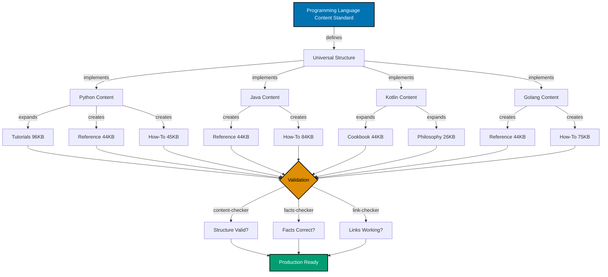
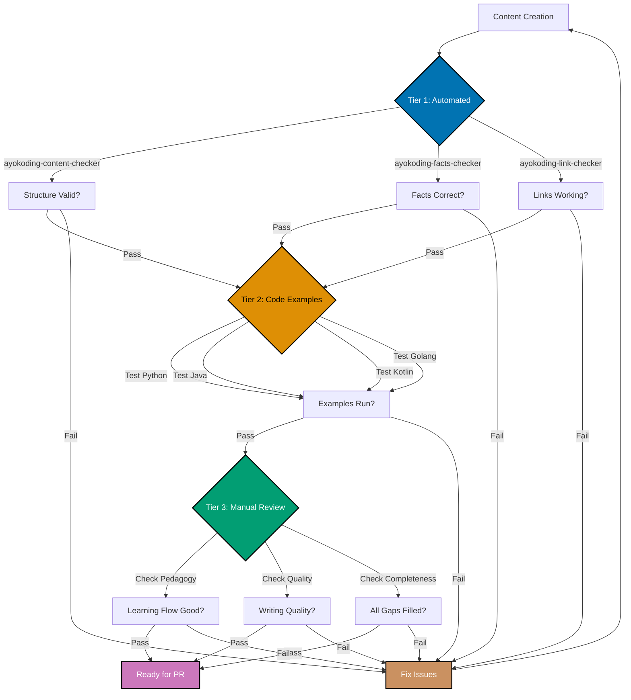

# Technical Documentation

## Architecture Overview

This project enhances existing programming language content following established conventions and patterns. No new architectural components are introduced - the work focuses on content expansion within the existing Hugo + Hextra framework.

### Content Architecture



**Color Palette**: Blue (#0173B2), Orange (#DE8F05), Teal (#029E73) - color-blind friendly per Color Accessibility Convention

### Priority-Based Approach

Work is prioritized by urgency and impact:


**Color Palette**: Purple (#CC78BC), Orange (#DE8F05), Teal (#029E73), Blue (#0173B2), Brown (#CA9161) - color-blind friendly per Color Accessibility Convention

**Rationale**:

1. **Python First**: Addresses critical tutorial gaps blocking complete learning paths
2. **Kotlin Second**: High-performing content needing focused cookbook expansion
3. **Java Third**: Mature content requiring reference completion
4. **Golang Fourth**: Strong foundation needing incremental improvements

## Technology Stack

### Content Management

- **Hugo**: Static site generator (v0.119.0+)
- **Hextra Theme**: Documentation theme for ayokoding-web
- **Markdown**: Content format with extended syntax
- **Mermaid**: Diagram rendering engine
- **Frontmatter**: YAML metadata for Hugo processing

### Validation Tools

- **ayokoding-content-checker**: Structural and quality validation
- **ayokoding-facts-checker**: Factual accuracy verification
- **ayokoding-link-checker**: Link integrity validation
- **Prettier**: JSON array format enforcement for tags

### Development Tools

- **VS Code**: Primary editor with Markdown extensions
- **Git**: Version control (Trunk Based Development)
- **Node.js + npm**: Development environment (via Volta)

## Design Decisions

### Decision 1: Multi-PR Delivery Strategy

**Context**: Plan covers 4 languages with ~390KB total content expansion

**Decision**: Deliver each language as a separate PR

**Rationale**:

- **Risk Management**: Isolates issues to single language
- **Review Quality**: Smaller PRs enable thorough reviews
- **Incremental Value**: Each PR delivers complete language improvement
- **Rollback Safety**: Can revert individual languages without affecting others

**Alternatives Considered**:

- Single mega-PR: Rejected (too large for effective review, high merge conflict risk)
- Feature-based PRs (all tutorials, then all cookbooks): Rejected (incomplete language states between PRs)

**Consequences**:

- ✅ Easier to review and merge
- ✅ Lower risk of introducing bugs
- ✅ Faster feedback cycles
- ⚠️ Requires careful PR ordering (Priority 1-4)

### Decision 2: Priority-Based Implementation Order

**Context**: Different languages have different gaps and urgency levels

**Decision**: Implement in priority order (Python → Kotlin → Java → Golang)

**Rationale**:

- **User Impact**: Python's tutorial gaps affect beginners most severely
- **Effort Efficiency**: Kotlin needs focused cookbook work (high impact, moderate effort)
- **Quality Baseline**: Complete highest-priority work first ensures best quality
- **Learning Curve**: Early work establishes patterns for later languages

**Alternatives Considered**:

- Alphabetical order: Rejected (ignores urgency)
- Easiest-first: Rejected (delays critical Python work)
- Parallel development: Rejected (context switching overhead)

**Consequences**:

- ✅ Highest user impact delivered first
- ✅ Quality improves as patterns solidify
- ✅ Clear completion milestones
- ⚠️ Golang (Priority 4) delivered last

### Decision 3: Reference Section Pattern

**Context**: All languages need cheat-sheet, glossary, and resources

**Decision**: Create identical 3-file reference structure for all languages

**Rationale**:

- **Consistency**: Learners expect same structure across languages
- **Completeness**: Three files cover all reference needs (syntax, terminology, learning paths)
- **Size Targets**: 12KB + 20KB + 12KB = 44KB matches benchmark analysis
- **Reusability**: Pattern proven in other content

**Alternatives Considered**:

- Single reference.md file: Rejected (too large, poor navigation)
- More granular files: Rejected (over-engineering, harder to find content)
- Language-specific structures: Rejected (violates consistency principle)

**Consequences**:

- ✅ Predictable navigation
- ✅ Clear content boundaries
- ✅ Easy to maintain
- ⚠️ Some duplication across languages (acceptable trade-off)

### Decision 4: Cookbook Position at Weight 603

**Context**: Cookbook placement affects learner engagement and discoverability

**Decision**: Always place cookbook at position 3 (weight: 603) in how-to/ section

**Rationale**:

- **Immediate Practical Value**: Learners see recipes right after overview
- **Example-Driven Learning**: Follows Hook (overview) → Engage (cookbook) → Teach (guides) model
- **Quick Wins**: Early access to working examples motivates continued learning
- **Ongoing Reference**: Cookbook remains visible while studying detailed guides

**Alternatives Considered**:

- Cookbook at end of how-to: Rejected (delays practical value)
- Cookbook in separate category: Rejected (breaks Diátaxis framework)

**Consequences**:

- ✅ Improved learner engagement
- ✅ Better content discovery
- ✅ Consistent across all languages
- ⚠️ Requires explicit weight management

### Decision 5: Category-Based Weight Allocation

**Context**: Hugo requires explicit weight values for content ordering

**Decision**: Use hundred-ranges for categories (500s tutorials, 600s how-to, 700s explanation, 800s reference)

**Rationale**:

- **Clear Separation**: Weight number immediately reveals category
- **Scalability**: Each category accommodates 99 items without conflicts
- **Consistency**: All languages follow identical pattern
- **Maintainability**: Easy to add new content without renumbering

**Alternatives Considered**:

- Sequential numbering: Rejected (no visual category separation)
- Ten-ranges per category: Rejected (insufficient room for growth)
- Alphabetical ordering: Rejected (not pedagogically sound)

**Consequences**:

- ✅ Eliminates weight conflicts
- ✅ Structural clarity at a glance
- ✅ Room for future expansion
- ⚠️ Requires understanding of pattern (documented in conventions)

### Decision 6: No Time Estimates in Content

**Context**: Educational content traditionally includes duration estimates

**Decision**: Never include time estimates in any content

**Rationale**:

- **Individual Variation**: Everyone learns at different speeds
- **Focus on Outcomes**: Coverage percentages define scope, not duration
- **Accessibility**: Avoids discouraging slower learners
- **Accuracy**: Impossible to predict individual learning time

**Alternatives Considered**:

- Range estimates ("1-3 hours"): Rejected (still problematic)
- Difficulty labels only: Already implemented (Level 1-4 exercises)

**Consequences**:

- ✅ Respects learner diversity
- ✅ Focus on value, not speed
- ✅ No false expectations
- ⚠️ May initially confuse users expecting time guidance (acceptable trade-off)

## Implementation Approach

### Phase Structure

Each language follows a 4-phase implementation pattern:


**Color Palette**: Blue (#0173B2), Orange (#DE8F05), Teal (#029E73), Purple (#CC78BC), Brown (#CA9161) - color-blind friendly per Color Accessibility Convention

#### Phase 1: Analysis

**Goal**: Understand current state and plan specific changes

**Activities**:

1. Read all existing content files
2. Measure current line counts
3. Identify specific gaps (which sections need expansion)
4. List new files to create
5. Plan cross-reference updates

**Output**: Detailed implementation checklist

#### Phase 2: Content Creation

**Goal**: Write all new and expanded content

**Activities**:

1. Create new files (reference section, new how-to guides)
2. Expand existing files (tutorials, cookbooks, philosophy)
3. Add Mermaid diagrams with color-blind friendly palette
4. Write runnable code examples
5. Create exercises and challenges
6. Add cross-references

**Output**: All content files ready for validation

#### Phase 3: Validation

**Goal**: Ensure quality and correctness

**Activities**:

1. Run ayokoding-content-checker (structural validation)
2. Run ayokoding-facts-checker (factual verification)
3. Run ayokoding-link-checker (link integrity)
4. Fix all identified issues
5. Manual quality review
6. Test all code examples

**Output**: Content passing all validation checks

#### Phase 4: Integration

**Goal**: Prepare for PR submission

**Activities**:

1. Verify all files in correct locations
2. Check frontmatter consistency
3. Verify weight numbering
4. Test Hugo build locally
5. Write commit message
6. Create PR with detailed description

**Output**: PR ready for review

### Python Implementation Details (Priority 1)

**Expansion targets**:

- `initial-setup.md`: 8KB → 16KB (+100%)
- `quick-start.md`: 12KB → 30KB (+150%)
- `beginner.md`: 32KB → 48KB (+50%)
- `intermediate.md`: 24KB → 41KB (+71%)
- `advanced.md`: 20KB → 27KB (+35%)
- Create `reference/cheat-sheet.md` (12KB)
- Create `reference/glossary.md` (20KB)
- Create `reference/resources.md` (12KB)
- Create 3 new how-to guides (~45KB total)

**Content approach**:

- Initial Setup: Add platform-specific installation (Windows, macOS, Linux), virtual environment setup
- Quick Start: Expand from 6 to 10 touchpoints, add learning path diagram
- Beginner: Add OOP deep-dive, comprehensive data structures coverage
- Intermediate: Add async/await patterns, testing strategies, database integration
- Advanced: Add GIL internals, C extensions, performance profiling
- Reference: Create quick syntax lookup, terminology glossary, curated resources

**Validation focus**:

- Python 3.11+ syntax accuracy
- Virtual environment commands across platforms
- Package manager usage (pip, poetry)
- Code example testing

### Kotlin Implementation Details (Priority 2)

**Expansion targets**:

- `cookbook.md`: 76KB → 120KB (+58%, add 15-20 recipes)
- `best-practices.md`: 12KB → 19KB (+58%)
- `anti-patterns.md`: 14KB → 23KB (+64%)
- `overview.md`: 93 lines → 150 lines (+61%)

**Note**: Reference section (cheat-sheet.md, glossary.md, resources.md) already complete (commit 4495e22). No reference creation work needed.

**Content approach**:

- Cookbook: Add recipes for coroutines, functional patterns, DSLs, multiplatform, testing
- Best Practices: Add null safety patterns, coroutine best practices, interop guidelines
- Anti-Patterns: Add common Java-to-Kotlin mistakes, coroutine pitfalls
- Overview: Add "What Makes Kotlin Special", "Kotlin in Practice" sections

**Validation focus**:

- Kotlin 1.9+ feature accuracy
- Coroutine patterns correctness
- Java interop examples
- Null safety demonstrations

### Java Implementation Details (Priority 3)

**Expansion targets**:

- Create `reference/cheat-sheet.md` (12KB)
- Create `reference/glossary.md` (20KB)
- Create `reference/resources.md` (12KB)
- Create 7 new how-to guides (~84KB total, ~12KB each)
- `overview.md`: 93 lines → 150 lines (+61%)
- `initial-setup.md`: 15KB → 18KB (+20%)
- `quick-start.md`: 26KB → 31KB (+19%)
- `intermediate.md`: 36KB → 43KB (+19%)

**Content approach**:

- Reference: Create JVM-specific cheat sheet, terminology for enterprise context
- How-To: Add guides for reactive programming, microservices, security, testing, performance
- Overview: Add "What Makes Java Special" (JVM, ecosystem), "Java in Practice"
- Tutorials: Deepen enterprise patterns, modern Java features (records, sealed classes)

**Validation focus**:

- Java 17 LTS syntax (modern baseline)
- JVM-specific concepts accuracy
- Enterprise framework patterns
- Migration from older Java versions

### Golang Implementation Details (Priority 4)

**Expansion targets**:

- Create `reference/cheat-sheet.md` (12KB)
- Create `reference/glossary.md` (20KB)
- Create `reference/resources.md` (12KB)
- Create 5 new how-to guides (~75KB total, ~15KB each)
- `best-practices.md`: 18KB → 20KB (+11%)

**Content approach**:

- Reference: Create Go-specific cheat sheet emphasizing simplicity
- How-To: Add guides for context patterns, middleware, gRPC, testing best practices, advanced error handling
- Best Practices: Add modern Go idioms (generics), module management

**Validation focus**:

- Go 1.21+ syntax (generics era)
- Concurrency patterns correctness
- Module system accuracy
- Standard library usage

## Data Models

### Content File Metadata

All content files use Hugo frontmatter:

```yaml
---
title: "Tutorial Title"
date: 2025-12-18
draft: false
description: "Brief description for SEO and navigation"
weight: 503
tags: ["python", "tutorial", "beginner"]
---
```

**Fields**:

- `title`: Human-readable page title
- `date`: Creation or last major update date
- `draft`: false for published content
- `description`: SEO-optimized summary (150-160 characters)
- `weight`: Position in navigation (category-based hundred-ranges)
- `tags`: JSON array format (Prettier-enforced)

### Weight Numbering Schema

```
tutorials/
  _index.md       → 501
  overview.md     → 502
  initial-setup.md → 503
  quick-start.md  → 504
  beginner.md     → 505
  intermediate.md → 506
  advanced.md     → 507

how-to/
  _index.md       → 601
  overview.md     → 602
  cookbook.md     → 603 (MUST be position 3)
  guide-1.md      → 604
  guide-2.md      → 605
  ...

explanation/
  _index.md       → 701
  overview.md     → 702
  best-practices.md → 703
  anti-patterns.md → 704

reference/
  _index.md       → 801
  overview.md     → 802
  cheat-sheet.md  → 803
  glossary.md     → 804
  resources.md    → 805
```

### Content Expansion Tracking

```typescript
interface LanguageStatus {
  name: string;
  priority: number;
  currentScore: number;
  targetScore: number;
  expansionRequired: {
    tutorials: number; // KB
    howTo: number; // KB
    cookbook: number; // KB
    reference: number; // KB
    philosophy: number; // KB
  };
  phase: "analysis" | "creation" | "validation" | "integration" | "complete";
  prStatus: "not_started" | "in_progress" | "review" | "merged";
}
```

## Testing Strategy

### Validation Approach

Three-tier validation ensures content quality:



**Color Palette**: Blue (#0173B2), Orange (#DE8F05), Teal (#029E73), Purple (#CC78BC), Brown (#CA9161) - color-blind friendly per Color Accessibility Convention

#### Tier 1: Automated Validation

**ayokoding-content-checker** validates:

- File naming conventions
- Frontmatter structure
- Weight numbering
- Directory organization
- Markdown formatting
- Heading hierarchy
- Cross-reference syntax
- Mermaid diagram syntax
- Color palette compliance

**ayokoding-facts-checker** verifies:

- Command syntax correctness
- Version number accuracy
- API signature correctness
- Standard library references
- Language feature accuracy

**ayokoding-link-checker** validates:

- Internal links point to existing files
- External links return 200 status
- Anchor links target valid headings
- No broken references

**Exit Criteria**: All three checkers report zero issues

#### Tier 2: Code Example Testing

Manual testing of all code examples:

**Python Examples**:

- Test with Python 3.11+ on macOS, Linux, Windows
- Verify virtual environment commands
- Test pip/poetry package management
- Run all example scripts

**Java Examples**:

- Test with Java 17 LTS on macOS, Linux, Windows
- Verify Maven/Gradle commands
- Compile and run all examples
- Test JUnit examples

**Kotlin Examples**:

- Test with Kotlin 1.9+ on macOS, Linux, Windows
- Verify Gradle Kotlin DSL
- Compile and run all examples
- Test coroutine examples

**Golang Examples**:

- Test with Go 1.21+ on macOS, Linux, Windows
- Verify go mod commands
- Build and run all examples
- Test concurrent examples

**Exit Criteria**: All code examples run successfully on all platforms

#### Tier 3: Manual Quality Review

Human review checklist:

**Pedagogical Review**:

- [ ] Learning flow is logical and progressive
- [ ] Concepts build on each other appropriately
- [ ] Examples are clear and relevant
- [ ] Exercises match stated difficulty levels
- [ ] Cross-references are helpful and accurate

**Writing Quality**:

- [ ] Active voice used consistently
- [ ] Language is clear and accessible
- [ ] Technical terminology is explained
- [ ] No jargon without context
- [ ] Tone is encouraging and inclusive

**Completeness Review**:

- [ ] All stated coverage achieved
- [ ] No placeholder content ("TODO", "TBD")
- [ ] All required sections present
- [ ] Cross-references are bidirectional where needed
- [ ] All learning objectives met

**Exit Criteria**: Reviewer approves content for PR

### Regression Prevention

**Pre-Commit Checks**:

- Prettier enforces Markdown formatting
- Git hooks validate frontmatter
- Local Hugo build confirms no rendering errors

**PR Review Checks**:

- CI/CD runs all validation agents
- Automated Hugo build test
- Link checker on full site
- Size impact assessment

## Deployment Strategy

### Trunk Based Development

All work happens on `main` branch with small, frequent commits:

**Commit Pattern**:

```bash
# Phase 1: Analysis (single commit)
git commit -m "docs(python): analyze current state and plan expansion"

# Phase 2: Content Creation (multiple commits by section)
git commit -m "docs(python): expand initial-setup tutorial to 14KB"
git commit -m "docs(python): expand quick-start tutorial to 28KB"
git commit -m "docs(python): expand beginner tutorial to 44KB"
git commit -m "docs(python): create reference section (cheat-sheet, glossary, resources)"

# Phase 3: Validation (single commit per fix round)
git commit -m "fix(python): address content-checker issues"
git commit -m "fix(python): address facts-checker issues"

# Phase 4: Integration (final commit)
git commit -m "docs(python): finalize Python content elevation to highest standard"
```

**Branch Strategy**:

- Work on `main` branch (no feature branches)
- Use feature flags if needed to hide incomplete work
- Commit frequently (end of each work session)
- Push to `main` regularly (daily if possible)

### PR Sequencing

Four PRs delivered in priority order:


**Color Palette**: Purple (#CC78BC), Orange (#DE8F05), Teal (#029E73), Blue (#0173B2), Brown (#CA9161) - color-blind friendly per Color Accessibility Convention

**PR Template**:

```markdown
## Summary

Elevate [Language] content to highest standard per Programming Language Content Standard.

## Changes

### Expanded Files

- `initial-setup.md`: XKB → YKB (+Z%)
- `quick-start.md`: XKB → YKB (+Z%)
- ...

### New Files

- `reference/cheat-sheet.md` (12KB)
- `reference/glossary.md` (20KB)
- ...

## Validation

- ✅ ayokoding-content-checker: PASS
- ✅ ayokoding-facts-checker: PASS
- ✅ ayokoding-link-checker: PASS
- ✅ Code examples tested on macOS/Linux/Windows
- ✅ Manual quality review complete

## Testing

All code examples tested with [Language] version X.Y on:

- macOS 14+ (Apple Silicon and Intel)
- Ubuntu 22.04 LTS
- Windows 11

## Checklist

- [ ] All content follows Programming Language Content Standard
- [ ] All line count targets met
- [ ] All diagrams use color-blind friendly palette
- [ ] All cross-references valid
- [ ] All code examples tested
- [ ] All validation agents pass
- [ ] Hugo builds without errors
```

**Review Process**:

1. Automated checks run on PR creation
2. Manual review by content expert
3. Address feedback in new commits
4. Re-run validation after changes
5. Merge when approved (squash commits)

### Deployment Frequency

**Target**: One language PR per completion cycle

- PR1 (Python): Submit after Phase 4 complete
- PR2 (Kotlin): Submit after PR1 merged
- PR3 (Java): Submit after PR2 merged
- PR4 (Golang): Submit after PR3 merged

**Rationale**: Sequential PRs prevent merge conflicts and enable focused reviews

## Monitoring and Observability

### Content Quality Metrics

Track these metrics per language:

```typescript
interface QualityMetrics {
  // Size Metrics
  totalLines: number;
  tutorialsLines: number;
  howToLines: number;
  cookbookLines: number;
  referenceLines: number;

  // Structural Metrics
  tutorialCount: number; // Target: 5
  howToGuideCount: number; // Target: 12-18
  cookbookRecipeCount: number; // Target: 30+
  mermaidDiagramCount: number; // Target: 5+

  // Quality Metrics
  codeExampleCount: number; // Target: 100+
  crossReferenceCount: number; // Target: 50+
  exerciseCount: number; // Target: 30+

  // Validation Metrics
  contentCheckerIssues: number; // Target: 0
  factsCheckerIssues: number; // Target: 0
  linkCheckerIssues: number; // Target: 0
  brokenCodeExamples: number; // Target: 0
}
```

### Progress Tracking

Track implementation progress:

```markdown
## Python (Priority 1)

- [x] Phase 1: Analysis
- [x] Phase 2: Content Creation
  - [x] Expand initial-setup.md
  - [x] Expand quick-start.md
  - [x] Expand beginner.md
  - [x] Expand intermediate.md
  - [x] Expand advanced.md
  - [x] Create reference section
- [x] Phase 3: Validation
  - [x] Content checker pass
  - [x] Facts checker pass
  - [x] Link checker pass
  - [x] Code examples tested
- [x] Phase 4: Integration
- [x] PR submitted
- [ ] PR merged

## Kotlin (Priority 2)

- [ ] Phase 1: Analysis
- [ ] Phase 2: Content Creation
- [ ] Phase 3: Validation
- [ ] Phase 4: Integration
- [ ] PR submitted
- [ ] PR merged

...
```

### Success Indicators

**Leading Indicators** (predict success):

- Validation agents pass on first try (indicates quality during creation)
- Code examples run without fixes (indicates testing discipline)
- Cross-references all valid (indicates attention to detail)

**Lagging Indicators** (confirm success):

- All PRs merged without major revisions
- All languages meet line count targets
- All content passes manual quality review
- Hugo builds successfully with all content

### Issue Tracking

Track and categorize issues found during validation:

**Issue Categories**:

- **Structural**: File naming, frontmatter, weight numbering
- **Factual**: Incorrect syntax, wrong versions, outdated information
- **Links**: Broken internal links, dead external links
- **Code**: Non-working examples, syntax errors
- **Quality**: Writing issues, pedagogical problems

**Resolution Tracking**:

```typescript
interface Issue {
  id: string;
  category: "structural" | "factual" | "links" | "code" | "quality";
  severity: "critical" | "high" | "medium" | "low";
  file: string;
  description: string;
  detectedBy: "content-checker" | "facts-checker" | "link-checker" | "manual";
  status: "open" | "fixed" | "verified";
}
```

**Critical Issues** (block PR):

- Content checker failures (structural problems)
- Facts checker failures (incorrect information)
- Link checker failures (broken links)
- Non-working code examples
- Missing required sections

**Non-Critical Issues** (can be addressed post-PR):

- Minor writing improvements
- Additional cross-references
- Enhanced diagrams
- Extra examples

## Related Documentation

### Conventions

- [Programming Language Content Standard](../../../docs/explanation/conventions/ex-co__programming-language-content.md) - Master reference
- [Hugo Content Convention - ayokoding](../../../docs/explanation/conventions/ex-co__hugo-content-ayokoding.md) - Hextra theme specifics
- [Hugo Content Convention - Shared](../../../docs/explanation/conventions/ex-co__hugo-content-shared.md) - Base Hugo rules
- [Content Quality Principles](../../../docs/explanation/conventions/ex-co__content-quality.md) - Quality standards
- [Tutorial Naming Convention](../../../docs/explanation/conventions/ex-co__tutorial-naming.md) - Tutorial level definitions
- [Color Accessibility Convention](../../../docs/explanation/conventions/ex-co__color-accessibility.md) - Approved color palette
- [Diagrams Convention](../../../docs/explanation/conventions/ex-co__diagrams.md) - Mermaid standards

### Development Practices

- [Trunk Based Development](../../../docs/explanation/development/ex-de__trunk-based-development.md) - Git workflow
- [Commit Messages](../../../docs/explanation/development/ex-de__commit-messages.md) - Commit format
- [Code Quality](../../../docs/explanation/development/ex-de__code-quality.md) - Automated checks

### AI Agents

- [ayokoding-content-maker](../../../.claude/agents/ayokoding-content-maker.md) - Content creation agent
- [ayokoding-content-checker](../../../.claude/agents/ayokoding-content-checker.md) - Validation agent
- [ayokoding-facts-checker](../../../.claude/agents/ayokoding-facts-checker.md) - Fact verification agent
- [ayokoding-link-checker](../../../.claude/agents/ayokoding-link-checker.md) - Link validation agent
