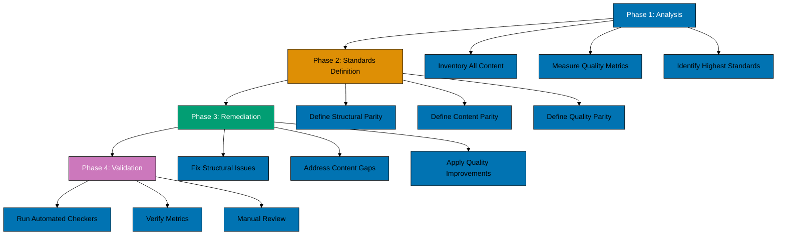

# Technical Documentation

## Architecture Overview

This parity initiative follows a **multi-phase analysis and remediation architecture**:



**Color Palette**: Mermaid diagrams use color-blind friendly palette - Blue (#0173B2), Orange (#DE8F05), Teal (#029E73), Purple (#CC78BC) per Color Accessibility Convention.

### Key Components

1. **Analysis Engine**: Scripts and manual review to inventory all content and measure against benchmarks
2. **Standards Repository**: Programming Language Content Standard convention as single source of truth
3. **Remediation Toolkit**: AI agents (content-maker, content-fixer) and manual editing
4. **Validation Pipeline**: Automated checkers (content, structure, facts, links) + manual QA

## Technology Stack

### Content Infrastructure

- **Hugo Static Site Generator**: 0.139.4 (ayokoding-web site engine)
- **Hextra Theme**: Custom fork with bilingual support and level-based weight system
- **Mermaid**: Diagram rendering in markdown

### Validation Tools

- **ayokoding-web-structure-checker**: Validates directory structure, file presence, weight ordering
- **ayokoding-web-general-checker**: Validates Hugo conventions, quality principles, pedagogical patterns
- **ayokoding-web-facts-checker**: Validates factual correctness (command syntax, versions, code examples)
- **ayokoding-web-link-checker**: Validates all internal and external links

### Content Tools

- **ayokoding-web-general-maker**: Creates new content following conventions
- **ayokoding-web-general-fixer**: Applies automated fixes from audit reports
- **Manual editing**: For content requiring human judgment

### Analysis Tools

- **Bash scripts**: File counting, line counting, grep patterns
- **Manual inventory**: Spreadsheet tracking for comprehensive analysis

## Design Decisions

### DD-1: Define "Parity" as Multi-Dimensional

**Context:** "Parity" could mean identical content (impossible due to language differences) or identical structure (too rigid).

**Decision:** Define parity across three dimensions:

1. **Structural Parity**: Identical directory structure, file naming, weight system
2. **Content Parity**: Equivalent coverage and completeness (not identical topics)
3. **Quality Parity**: Meeting or exceeding quantitative/qualitative benchmarks

**Rationale:**

- Preserves language-specific content uniqueness (e.g., Rust ownership vs Python GIL)
- Ensures learners get consistent experience across languages
- Provides objective measurement criteria

**Alternatives Considered:**

- **Full Identical Content**: Rejected - impossible and undesirable (languages differ fundamentally)
- **Structural Parity Only**: Rejected - could have correct structure but poor content
- **Quality Parity Only**: Rejected - inconsistent structure confuses learners

**Consequences:**

- ✅ Clear measurement criteria for each dimension
- ✅ Flexibility for language-specific excellence
- ⚠️ Requires three separate validation passes
- ⚠️ More complex definition to communicate

### DD-2: Use Existing Content as Baseline, Not Rewrite

**Context:** Some content may meet structural requirements but have pedagogical weaknesses.

**Decision:** For this parity plan, bring all content to minimum viable baseline from Programming Language Content Standard. Do NOT comprehensively rewrite content that already meets baseline.

**Rationale:**

- Scope control - comprehensive rewrites are separate projects
- Risk mitigation - rewrites introduce new errors
- Respect existing effort - much content is already good
- Focus on consistency first, optimization later

**Alternatives Considered:**

- **Comprehensive Rewrite**: Rejected - massive scope, high risk, diminishing returns
- **No Quality Improvements**: Rejected - defeats purpose of parity
- **Quality Improvements Only Where Obvious**: Accepted as compromise

**Consequences:**

- ✅ Manageable scope for single PR
- ✅ Lower risk of introducing new errors
- ⚠️ Some content may be "baseline adequate" not "excellent"
- 📋 Follow-up: Create separate plans for comprehensive quality improvements per language

### DD-3: Cookbook Position 3 is Non-Negotiable

**Context:** 5 languages (Python, Golang, Java, Kotlin, Rust) have cookbook at weight 1000030 (position 30+), violating Programming Language Content Standard requiring position 3. Only Elixir is currently compliant.

**Decision:** Cookbook MUST be at position 3 (weight 1000001) in all languages, immediately after overview.md (weight 1000000).

**Rationale:**

- Pedagogical requirement from Programming Language Content Standard
- Follows "Hook → Engage → Teach" model (overview hooks, cookbook engages, guides teach)
- Consistent learner experience across all languages
- Elixir serves as the reference implementation having already implemented position 3 correctly

**Alternatives Considered:**

- **Allow Flexibility**: Rejected - violates established standard
- **Cookbook at End**: Rejected - poor pedagogy (learners lose early motivation)
- **Cookbook as Separate Section**: Rejected - breaks established structure

**Consequences:**

- ✅ Consistent navigation experience
- ✅ Better learner engagement
- ⚠️ Requires reweighting all subsequent how-to guides in 5 languages (Python, Golang, Java, Kotlin, Rust)
- ⚠️ 5x reweighting work compared to initial assumption (only Rust affected)
- 📋 Update navigation for all 5 affected languages to match standard

### DD-4: Identify and Document "Highest Standards"

**Context:** Multiple reference implementations (Golang, Python, Java) may have different excellence areas.

**Decision:** For each content type (tutorial level, cookbook, how-to guide, explanation), identify the "highest standard" example across all 6 languages and document it as reference.

**Rationale:**

- Creates clear quality targets for future language additions
- Recognizes excellence wherever it exists
- Provides concrete examples beyond abstract metrics
- Enables continuous improvement

**Alternatives Considered:**

- **Single Reference Language**: Rejected - no single language is best at everything
- **Average Standards**: Rejected - averages down to mediocrity
- **No Documentation**: Rejected - loses knowledge, inconsistent future additions

**Consequences:**

- ✅ Clear quality targets
- ✅ Recognition of existing excellence
- ✅ Useful for future language additions
- ⚠️ Requires thorough analysis across all languages
- 📋 Add "Highest Standards" section to Programming Language Content Standard

### DD-5: Progressive Direct Commits on Main Branch

**Context:** Parity work spans 6 languages with multiple types of changes (structural, content, quality).

**Decision:** Deliver all parity work as progressive direct commits to main branch following Trunk Based Development workflow.

**Rationale:**

- Follows Trunk Based Development convention (work directly on main)
- Small, frequent commits reduce risk of large-batch integration issues
- Each commit can be independently validated by CI (Hugo build, checkers)
- Progressive commits allow incremental review and easier rollback (git revert specific commits)
- Aligns with repository's established TBD workflow

**Alternatives Considered:**

- **Feature Branch + Single PR**: Rejected - violates TBD, user request, and CLAUDE.md guidance
- **Multiple Small PRs**: Rejected - violates TBD workflow

**Consequences:**

- ✅ Follows established repository workflow
- ✅ Small commits easier to review and rollback
- ✅ Continuous integration validation per commit
- ⚠️ Requires discipline to make atomic, logical commits
- ⚠️ Requires running validators before each commit

## Implementation Approach

### Phase 1: Comprehensive Analysis

**Goal:** Establish complete baseline of current state and identify all gaps.

**Tasks:**

1. **Create Language Inventory Matrix**
   - Rows: Content types (tutorial levels, how-to guides, cookbook, explanations, references)
   - Columns: Languages (Python, Golang, Java, Kotlin, Rust, Elixir)
   - Data: File presence, line counts, weights, quality metrics

2. **Measure Quality Metrics**
   - Line counts for all files
   - Mermaid diagram counts
   - Cross-reference counts
   - Code example counts
   - Color palette compliance (grep for prohibited colors)
   - Pedagogical pattern presence (front hooks, learning paths, prerequisites)

3. **Identify Structural Issues**
   - Missing files (compare against Programming Language Content Standard structure)
   - Incorrect weights (compare against level-based weight system)
   - Incorrect naming (compare against naming conventions)

4. **Identify Content Gaps**
   - Missing tutorials (should be 5: initial-setup, quick-start, beginner, intermediate, advanced)
   - Missing how-to guides (minimum 12)
   - Missing explanations (should be 2: best-practices, anti-patterns)
   - Missing references (minimum: cheat-sheet, glossary, resources)
   - Cookbook completeness (should have 30+ recipes)

5. **Identify Quality Gaps**
   - Files below minimum line counts
   - Missing pedagogical patterns
   - Prohibited colors in diagrams
   - Time estimates in content
   - Non-runnable code examples
   - Broken links

**Deliverables:**

- `analysis-report.md` in plan folder with complete inventory
- Gap list by language and change type
- Highest standard identification for each content type

### Phase 2: Standards Definition

**Goal:** Define explicit parity standards based on highest examples found.

**Tasks:**

1. **Structural Parity Standard**
   - Document required directory structure
   - Document required files with exact naming
   - Document weight progression with formulas
   - Identify reference language for structure (likely Golang or Python)

2. **Content Parity Standard**
   - Define minimum content requirements (line counts, file counts)
   - Define cookbook recipe count minimum (30+)
   - Define how-to guide count minimum (12+)
   - Identify highest content examples (longest tutorials, most comprehensive cookbooks)

3. **Quality Parity Standard**
   - Define pedagogical pattern requirements
   - Define code quality requirements
   - Define diagram requirements (count and color palette)
   - Define cross-reference requirements (minimum per tutorial)
   - Identify highest quality examples (best front hooks, best learning paths, best code examples)

4. **Update Programming Language Content Standard**
   - Add "Highest Standards Reference" section
   - Link to specific files as examples
   - Add any new metrics discovered during analysis

**Deliverables:**

- `parity-standards.md` in plan folder
- Updated Programming Language Content Standard convention
- Highest standards reference table (content type → example file path)

### Phase 3: Remediation

**Goal:** Apply fixes to bring all languages to parity.

**Approach:** Language-by-language, issue-by-issue, using atomic commits.

**Workflow per Language:**

1. **Structural Fixes**
   - Add missing files (create from templates)
   - Fix weights (cookbook to 1000001, others sequential)
   - Fix file naming (if any violations)
   - Commit: `fix(ayokoding-web): [language] structural parity (files, weights, naming)`

2. **Content Additions**
   - Add missing tutorials (use ayokoding-web-general-maker)
   - Add missing how-to guides (use ayokoding-web-general-maker)
   - Add missing explanation content (best-practices, anti-patterns)
   - Add missing reference content (cheat-sheet, glossary, resources)
   - Expand short content to meet minimum line counts
   - Commit per content type: `feat(ayokoding-web): [language] add missing [content-type]`

3. **Quality Improvements**
   - Add missing pedagogical patterns (front hooks, learning paths, prerequisites)
   - Fix color palette violations (replace red/green/yellow with approved colors)
   - Add missing diagrams (tutorials should have learning path diagrams)
   - Add cross-references (minimum 10 per tutorial)
   - Make code examples runnable (add missing context, fix syntax)
   - Remove time estimates
   - Commit per quality type: `refactor(ayokoding-web): [language] quality parity ([pattern-name])`

**Language Order:**

Process in this order (easiest to hardest):

1. Python (likely smallest gap - reference implementation)
2. Golang (likely smallest gap - reference implementation)
3. Java (likely smallest gap - reference implementation)
4. Elixir (recently added, following standard)
5. Kotlin (JVM language, can reference Java)
6. Rust (known issues with cookbook position)

**Tools:**

- **ayokoding-web-general-maker**: Generate new content following conventions
- **ayokoding-web-general-fixer**: Apply automated fixes from checker audits
- **Manual editing**: For nuanced content requiring judgment
- **Template files**: Create templates for common structures (tutorial outline, cookbook recipe, how-to guide)

### Phase 4: Validation

**Goal:** Verify all languages meet parity standards with zero violations.

**Validation Steps:**

1. **Automated Structure Validation**

   ```bash
   # Run for each language
   ayokoding-web-structure-checker --language python
   ayokoding-web-structure-checker --language golang
   ayokoding-web-structure-checker --language java
   ayokoding-web-structure-checker --language kotlin
   ayokoding-web-structure-checker --language rust
   ayokoding-web-structure-checker --language elixir
   ```

   - Expected: Zero violations for all languages
   - Check: File presence, weight ordering, naming conventions

2. **Automated Content Validation**

   ```bash
   # Run for each language
   ayokoding-web-general-checker --language python
   ayokoding-web-general-checker --language golang
   ayokoding-web-general-checker --language java
   ayokoding-web-general-checker --language kotlin
   ayokoding-web-general-checker --language rust
   ayokoding-web-general-checker --language elixir
   ```

   - Expected: Zero violations for all languages
   - Check: Hugo conventions, quality principles, pedagogical patterns, color palette

3. **Automated Facts Validation**

   ```bash
   # Run for each language (focuses on code examples, commands, versions)
   ayokoding-web-facts-checker --language python --scope tutorials
   ayokoding-web-facts-checker --language golang --scope tutorials
   # ... etc for all languages
   ```

   - Expected: Zero factual errors, high confidence on all factual claims
   - Check: Command syntax, version accuracy, code example correctness

4. **Automated Link Validation**

   ```bash
   # Run for entire site
   ayokoding-web-link-checker --scope prog-lang
   ```

   - Expected: Zero broken links
   - Check: Internal links, external links (with cache)

5. **Manual Quality Review**
   - Read representative samples from each language:
     - One full tutorial (recommend Quick Start)
     - Cookbook introduction and 3 random recipes
     - One how-to guide
     - Best practices introduction
   - Verify:
     - Pedagogical effectiveness (hooks, flow, clarity)
     - Code examples run correctly
     - Cross-references accurate
     - Diagrams render correctly
     - Consistent voice and tone

6. **Metrics Verification**
   - Run line count verification script
   - Compare against parity standards minimum requirements
   - Generate metrics comparison table (all languages side-by-side)
   - Verify all languages meet or exceed minimums

**Deliverables:**

- Validation report with all checker results
- Metrics comparison table
- Manual QA checklist completion
- Sign-off for PR merge

## Data Models

### Language Inventory Matrix

```yaml
language_inventory:
  - language: python
    tutorials:
      initial_setup:
        present: true
        line_count: 412
        weight: 1000001
        has_front_hook: true
        has_learning_path: true
        diagram_count: 2
        code_example_count: 8
      quick_start:
        present: true
        line_count: 856
        # ... etc
    how_to:
      cookbook:
        present: true
        line_count: 4351
        weight: 1000001 # MUST be 1000001
        recipe_count: 35
      guide_count: 18
      total_line_count: 6200
    explanation:
      best_practices:
        present: true
        line_count: 687
      anti_patterns:
        present: true
        line_count: 623
    reference:
      cheat_sheet:
        present: true
        line_count: 345
      glossary:
        present: true
        line_count: 289
      resources:
        present: true
        line_count: 198

  - language: golang
    # ... similar structure

  # ... etc for all 6 languages
```

### Parity Gap Tracker

```yaml
parity_gaps:
  - language: rust
    gaps:
      - type: structural
        severity: high
        issue: "Cookbook at weight 1000030 instead of 1000001"
        remediation: "Change cookbook weight to 1000001, reweight all subsequent guides"

      - type: content
        severity: medium
        issue: "Beginner tutorial 1150 lines (below 1200 minimum)"
        remediation: "Expand Beginner tutorial with additional examples and exercises"

      - type: quality
        severity: low
        issue: "Missing learning path diagram in Quick Start"
        remediation: "Add Mermaid learning path diagram showing concept progression"

  # ... etc for all languages
```

### Highest Standards Reference

```yaml
highest_standards:
  tutorials:
    initial_setup:
      example: "apps/ayokoding-web/content/en/learn/swe/prog-lang/python/tutorials/initial-setup.md"
      line_count: 412
      highlights:
        - "Clear platform-specific installation instructions"
        - "Verification steps with expected output"
        - "Troubleshooting section"

    quick_start:
      example: "apps/ayokoding-web/content/en/learn/swe/prog-lang/golang/tutorials/quick-start.md"
      line_count: 892
      highlights:
        - "Excellent learning path diagram"
        - "12 well-chosen touchpoints"
        - "Progressive complexity"

    beginner:
      example: "apps/ayokoding-web/content/en/learn/swe/prog-lang/java/tutorials/beginner.md"
      line_count: 2156
      highlights:
        - "Comprehensive type system coverage"
        - "4-level exercise progression"
        - "Excellent cross-referencing"

    # ... etc for all content types

  cookbook:
    example: "apps/ayokoding-web/content/en/learn/swe/prog-lang/golang/how-to/cookbook.md"
    line_count: 5169
    recipe_count: 42
    highlights:
      - "Clear category organization"
      - "Consistent recipe structure"
      - "Use cases for each recipe"

  # ... etc
```

## Security Considerations

### Content Security

- **CS-1**: All code examples are educational and do not contain security vulnerabilities
- **CS-2**: External links verified for safety (ayokoding-web-link-checker validates against known-safe domains)
- **CS-3**: No personally identifiable information in examples

### Process Security

- **PS-1**: All changes validated before commit (run checkers on changed files)
- **PS-2**: No direct commits to environment deployment branches (prod-ayokoding-web, prod-ose-platform-web)
- **PS-3**: Validation checkers run in sandboxed environment (no execution of untrusted code)

## Testing Strategy

### Automated Testing

1. **Structure Tests**: ayokoding-web-structure-checker
   - File presence validation
   - Weight ordering validation
   - Naming convention validation

2. **Content Tests**: ayokoding-web-general-checker
   - Hugo convention compliance
   - Quality principle compliance
   - Pedagogical pattern presence
   - Color palette compliance

3. **Factual Tests**: ayokoding-web-facts-checker
   - Command syntax validation
   - Version accuracy validation
   - Code example syntax validation

4. **Link Tests**: ayokoding-web-link-checker
   - Internal link validation
   - External link validation (with cache)

### Manual Testing

1. **Pedagogical Testing**
   - Read-through of representative samples
   - Verify learning flow and clarity
   - Check exercise difficulty progression

2. **Code Testing**
   - Run code examples in actual environments
   - Verify platform-specific instructions
   - Test edge cases mentioned in content

3. **Cross-Reference Testing**
   - Click through all cross-references
   - Verify referenced content matches link description
   - Check for dead ends (links to placeholder content)

4. **Accessibility Testing**
   - Verify color contrast ratios (diagrams)
   - Test with color-blindness simulators
   - Check reading level (where applicable)

## Deployment Strategy

### Pre-Commit Checklist

- [ ] All automated checkers pass with zero violations for changed files
- [ ] All manual QA checkpoints complete for affected languages
- [ ] Metrics comparison table shows all languages meet minimums
- [ ] Highest standards documented in Programming Language Content Standard
- [ ] Commit message follows Conventional Commits format
- [ ] Hugo build succeeds without errors or warnings

### Deployment Process

1. **Validation Before Commit**: Run relevant checkers (structure, content, facts, links) on changed files
2. **Progressive Commits**: Make atomic commits directly to main branch by language and change type
3. **CI Validation**: Each commit triggers automated Hugo build and checker validation
4. **Continuous Monitoring**: Monitor CI results, fix issues immediately if any failures
5. **Rollback if Needed**: Use git revert for specific commits if critical issues discovered

### Rollback Plan

If issues discovered after commits:

1. **Minor issues**: Create follow-up commit with fixes
2. **Major issues**: Use git revert on specific problematic commits, fix in new commits
3. **Critical issues**: Emergency revert of all parity commits, full regression testing before retry

## Monitoring and Observability

### Build Monitoring

- Hugo build logs (watch for warnings/errors)
- Link checker periodic runs (weekly)
- Fact checker periodic runs (monthly - versions may change)

### Content Monitoring

- User feedback (comments, contact forms)
- Analytics (high bounce rates may indicate poor content)
- Search queries (what are users looking for?)

### Quality Monitoring

- Periodic manual reviews (quarterly)
- Checklist re-runs (monthly)
- Comparison against Programming Language Content Standard updates

---

**This technical documentation provides the blueprint for achieving complete parity across all 6 programming languages while preserving language-specific excellence and establishing reusable quality standards.**
