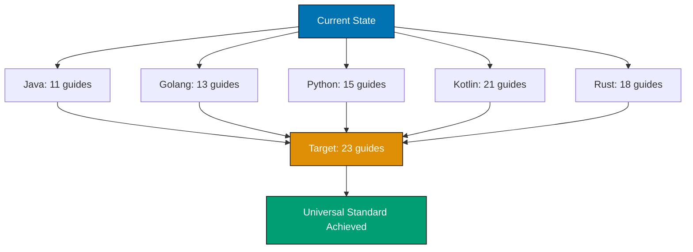
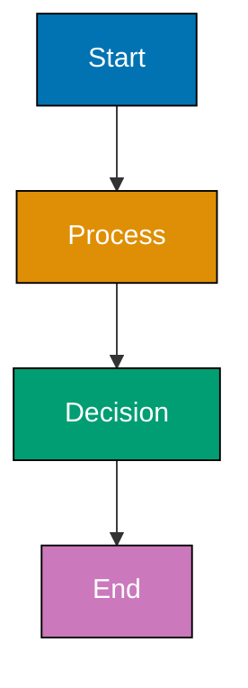

# Technical Documentation: Standardize Programming Language Content Quality

## Architecture Overview

This plan follows a **standardized content architecture** pattern established by the [Programming Language Content Standard](../../rules/conventions/tutorial/ex-ru-co-tu__programming-language-content.md).

### Content Structure Pattern

All programming language content follows this universal structure:

```
[language]/                                    # e.g., golang/, java/, python/, kotlin/, rust/
├── _index.md                                  # Folder representation (weight: 10002, level 5)
├── overview.md                                # Language overview (weight: 100000, level 6)
├── tutorials/                                 # Folder (weight: 100002, level 6)
│   ├── _index.md                             # Folder representation
│   ├── overview.md                           # Tutorials overview (weight: 1000000, level 7)
│   ├── initial-setup.md                      # 0-5% coverage
│   ├── quick-start.md                        # 5-30% coverage
│   ├── beginner.md                           # 0-60% coverage
│   ├── intermediate.md                       # 60-85% coverage
│   └── advanced.md                           # 85-95% coverage
├── how-to/                                    # Folder (weight: 100003, level 6)
│   ├── _index.md                             # Folder representation
│   ├── overview.md                           # How-to overview (weight: 1000000, level 7)
│   ├── cookbook.md                           # Position 3 (weight: 1000001, level 7)
│   └── [23 problem-solving guides]           # Guides (weight: 1000002+, level 7)
├── explanation/                               # Folder (weight: 100004, level 6)
│   ├── _index.md                             # Folder representation
│   ├── overview.md                           # Explanation overview (weight: 1000000, level 7)
│   ├── best-practices.md                     # Best practices
│   └── anti-patterns.md                      # Anti-patterns
└── reference/                                 # Folder (weight: 100005, level 6)
    ├── _index.md                             # Folder representation
    └── overview.md                           # Reference overview (weight: 1000000, level 7)
```

**Key Architectural Principles**:

1. **Universal Structure**: Same folder/file organization across all 5 languages
2. **Level-Based Weights**: Hugo navigation weights based on directory depth
3. **Cookbook Position Rule**: cookbook.md always at position 3 (weight: 1000001) for pedagogical reasons
4. **Weight Resets**: Weights reset per parent folder (siblings compared independently)
5. **Flat Hierarchy**: No nested subfolders beyond this structure

### Gap Analysis Architecture

Current implementation has **37 missing how-to guides** and **~5,740 lines missing cookbook content**:



## Technology Stack

### Content Creation

**Primary Tools**:

- **Markdown**: CommonMark standard for all content
- **Hugo**: Static site generator (Hextra theme)
- **Mermaid**: Diagram generation (color-blind friendly palette)
- **YAML**: Frontmatter metadata

**AI Agents**:

- **ayokoding-web-general-maker**: Create how-to guides and cookbook recipes
- **ayokoding-web-general-checker**: Validate Hugo conventions and quality
- **ayokoding-web-facts-checker**: Verify technical accuracy
- **ayokoding-web-link-checker**: Validate internal/external links
- **ayokoding-web-general-fixer**: Apply validated fixes from audit reports

### Validation Stack

**Quality Gates**:

1. **Hugo Build**: Verify content builds without errors
2. **Content Checker**: Validate Hugo conventions, frontmatter, weights, structure
3. **Facts Checker**: Verify command syntax, versions, code examples
4. **Link Checker**: Validate all markdown links (internal and external)
5. **Manual Review**: Pedagogical effectiveness, clarity, completeness

**Testing**:

- Code examples tested in development environments (Java, Golang, Python, Kotlin, Rust)
- Mermaid diagrams verified in GitHub markdown preview
- Color accessibility tested using color blindness simulators
- Cross-platform verification (Windows, macOS, Linux) where applicable

## Design Decisions

### Decision 1: Multi-PR Plan (5 PRs)

**Context**: 37 new guides + 5,740 lines of cookbook content across 5 languages is too large for single PR review.

**Decision**: Create 5 separate PRs, one per language, in priority order.

**Rationale**:

- Each language is independently reviewable unit
- Earlier feedback improves later languages
- Reduces review complexity and cognitive overhead
- Allows incremental value delivery
- Sequential priority addresses biggest gaps first

**Alternatives Considered**:

- ❌ Single massive PR: Too large to review effectively, delays all value
- ❌ Per-guide PRs (32 PRs): Too granular, excessive overhead, fragments context
- ❌ Content-type PRs (all how-to guides, then all cookbooks): Splits related content

**Consequences**:

- ✅ Manageable review size (7-10 guides + cookbook per PR)
- ✅ Earlier feedback incorporated into later languages
- ✅ Incremental value delivery
- ⚠️ Requires coordination to maintain consistency across PRs
- ⚠️ Each PR must independently validate and merge

### Decision 2: Priority Order (Java → Golang → Python → Kotlin → Rust)

**Context**: Need to decide which language to tackle first.

**Decision**: Prioritize by gap size (largest gaps first).

**Rationale**:

- Java has largest how-to guide gap (12 guides needed)
- Golang has second largest how-to guide gap (10 guides needed)
- Python has moderate gap (8 guides + cookbook)
- Kotlin has smallest how-to guide gap (2 guides) but large cookbook gap (2,330 lines)
- Rust has moderate combined gap (5 guides + 2,760 lines cookbook)

**Alternatives Considered**:

- ❌ Alphabetical: Ignores priority and strategic value
- ❌ Smallest first: Delays addressing biggest quality gaps
- ❌ Random: No strategic rationale

**Consequences**:

- ✅ Biggest quality improvements delivered first
- ✅ Java and Golang reach exceptional status earliest
- ✅ Learners see quality improvements sooner
- ✅ Earlier languages serve as templates for later ones

### Decision 3: Cookbook Recipe Count Target

**Context**: Need to determine how many new recipes to add to each cookbook.

**Decision**: Use line count targets (5,000+ lines) rather than fixed recipe counts.

**Rationale**:

- Recipe complexity varies by topic (some need 80 lines, others 150)
- Line count target (5,000+ lines) aligns with Programming Language Content Standard exceptional tier
- Flexibility allows appropriate depth per recipe
- Estimated recipes: ~100-120 lines per recipe average

**Alternatives Considered**:

- ❌ Fixed recipe count (e.g., "add exactly 20 recipes"): Ignores natural recipe size variation
- ❌ Category-based targets (e.g., "5 concurrency recipes"): Too rigid, may miss important topics

**Consequences**:

- ✅ Flexibility to adjust recipe depth based on complexity
- ✅ Alignment with established standard benchmarks
- ⚠️ Requires estimation: Kotlin ~15-20 recipes, Rust ~18-23 recipes, Python ~4-5 recipes

### Decision 4: No Modification of Existing Content

**Context**: Existing content may have minor quality issues, but this plan targets gap filling.

**Decision**: Add new content only. Do not modify existing how-to guides or cookbook recipes (except for validation fixes).

**Rationale**:

- Scope creep risk: Modifying existing content expands scope unpredictably
- Focus on standardization: Fill gaps to reach universal standard
- Validation fixes acceptable: Correct factual errors or accessibility issues
- Separate refactoring effort: Improving existing content is different goal

**Alternatives Considered**:

- ❌ Comprehensive refactoring: Massive scope expansion, delays completion
- ❌ Opportunistic improvements: Inconsistent quality, unpredictable scope

**Consequences**:

- ✅ Clear, bounded scope
- ✅ Predictable effort and timeline
- ⚠️ Some existing content remains at lower quality (acceptable tradeoff)

### Decision 5: How-To Guide Topic Selection

**Context**: Need to decide which 32 how-to guides to create.

**Decision**: Use gap analysis and common pattern identification to select topics.

**Rationale**:

- Identify missing topics by comparing existing guides across languages
- Prioritize common development patterns (performance, databases, APIs, testing)
- Cover language-specific features (e.g., Java records/sealed classes, Golang middleware)
- Ensure breadth across categories (foundation, web, testing, operations, advanced)

**Topics Selected** (see Delivery Plan for complete breakdown):

- Java (12): Performance, databases, REST APIs, Spring patterns, modern Java features
- Golang (10): Performance, databases, REST APIs, dependency injection, concurrency patterns
- Python (8): Performance, async patterns, databases, REST APIs, validation, security
- Kotlin (2): Multiplatform development, plus additional topic
- Rust (5): Debugging, configuration, documentation, async patterns, plus additional topic

**Alternatives Considered**:

- ❌ Copy all guides from one language to others: Ignores language-specific patterns
- ❌ User survey: Delays start, may miss objective gaps
- ❌ Random selection: No strategic coverage

**Consequences**:

- ✅ Comprehensive coverage of common development patterns
- ✅ Language-specific features highlighted appropriately
- ✅ Learners find solutions to real problems
- ⚠️ May miss niche topics (acceptable for initial standardization)

## Implementation Approach

### Phase-Based Implementation

Implementation follows 5 sequential phases (one per language, one PR each):

**Phase 1: Java** (PR 1)

- Create 12 new how-to guides
- Validate against Programming Language Content Standard
- Update cross-references
- Pass all validation gates

**Phase 2: Golang** (PR 2)

- Create 10 new how-to guides
- Validate against Programming Language Content Standard
- Update cross-references
- Pass all validation gates

**Phase 3: Python** (PR 3)

- Create 8 new how-to guides
- Add ~650 lines to cookbook (~4-5 new recipes)
- Validate against Programming Language Content Standard
- Update cross-references
- Pass all validation gates

**Phase 4: Kotlin** (PR 4)

- Create 2 new how-to guides
- Add ~2,330 lines to cookbook (~15-20 new recipes)
- Validate against Programming Language Content Standard
- Update cross-references
- Pass all validation gates

**Phase 5: Rust** (PR 5)

- Create 5 new how-to guides
- Add ~2,760 lines to cookbook (~18-23 new recipes)
- Validate against Programming Language Content Standard
- Update cross-references
- Pass all validation gates

See [Delivery Plan](./delivery.md) for detailed implementation steps per phase.

### Content Creation Workflow

For each how-to guide:

1. **Research**: Review language documentation, identify common patterns
2. **Draft**: Use ayokoding-web-general-maker to create initial content
3. **Code Testing**: Test all code examples in development environment
4. **Diagram Creation**: Create Mermaid diagrams with color-blind friendly palette
5. **Cross-Reference**: Add links to related tutorials and cookbook recipes
6. **Validation**: Run ayokoding-web-general-checker, ayokoding-web-facts-checker, ayokoding-web-link-checker
7. **Fix**: Use ayokoding-web-general-fixer to apply validated fixes
8. **Review**: Manual review for pedagogical effectiveness and clarity

For each cookbook recipe:

1. **Identify Problem**: Common development pattern or use case
2. **Draft Solution**: Complete, runnable code with comments
3. **Test Code**: Verify code works in development environment
4. **Explain Mechanism**: "How It Works" section explaining key concepts
5. **Document Use Cases**: When and why to use this pattern
6. **Cross-Reference**: Link to related how-to guides and tutorials
7. **Validation**: Run validation agents
8. **Fix**: Apply validated fixes

### Weight Calculation Pattern

Hugo frontmatter weights follow level-based system:

**Level 6 Content** (inside language folder):

- Base weight: 100000
- Position increment: +1, +2, +3...
- Example: overview.md (100000), tutorials/\_index.md (100002), how-to/\_index.md (100003)

**Level 7 Content** (inside category folders):

- Base weight: 1000000 (resets per parent)
- Position increment: +1, +2, +3...
- Example: how-to/overview.md (1000000), how-to/cookbook.md (1000001), how-to/guide-1.md (1000002)

**Critical Rule**: cookbook.md always at weight 1000001 (position 3, immediately after overview.md).

**Example Calculation for New How-To Guide**:

Suppose Java how-to/ currently has 12 guides. Last guide weight: 1000013 (overview.md=1000000, cookbook.md=1000001, guide-1 to guide-12=1000002 to 1000013).

New guide "optimize-performance.md" gets weight: 1000014 (next available position).

### Cross-Reference Strategy

**Minimum Cross-Reference Requirements**:

- Each how-to guide: ≥2 tutorial references, ≥1 cookbook reference
- Each cookbook recipe: ≥1 how-to guide reference, ≥1 tutorial reference

**Cross-Reference Pattern**:

```markdown
**Related Tutorial**: See [Beginner Tutorial - Error Handling](../tutorials/beginner.md#error-handling) for error handling fundamentals.

**Related How-To**: See [Handle Errors Gracefully](./handle-errors-gracefully.md) for advanced error patterns.

**Related Cookbook Recipe**: See Cookbook recipe "Error Wrapping Pattern" for copy-paste ready implementation.
```

**Implementation**:

1. Identify related concepts in tutorials (during content creation)
2. Identify related how-to guides (check existing guides in same language)
3. Identify related cookbook recipes (check cookbook categories)
4. Add markdown links with descriptive text
5. Validate links using ayokoding-web-link-checker

### Diagram Creation Guidelines

**Mermaid Diagram Requirements**:

- Use only approved color palette: Blue (#0173B2), Orange (#DE8F05), Teal (#029E73), Purple (#CC78BC), Brown (#CA9161)
- Include single color palette comment per diagram
- Use shape differentiation (not color alone)
- Add text labels to all elements
- Use black borders (#000000) for all shapes
- Prefer vertical orientation (top-down or bottom-top) for mobile

**Example Diagram Pattern**:



## Testing Strategy

### Code Example Testing

**Process**:

1. Copy code from documentation
2. Create test file in appropriate development environment
3. Run code without modifications
4. Verify output matches documentation
5. Test edge cases mentioned in documentation
6. Test on multiple platforms (Windows, macOS, Linux) where applicable

**Test Environments**:

- Java: OpenJDK 25 LTS (with Java 21 LTS compatibility testing where relevant), IntelliJ IDEA or VS Code
- Golang: Go 1.25+, VS Code with Go extension
- Python: Python 3.14+, VS Code with Python extension
- Kotlin: Kotlin 2.3+, IntelliJ IDEA
- Rust: Rust 1.92+, VS Code with Rust Analyzer

### Validation Testing

**Automated Validation**:

1. **ayokoding-web-general-checker**: Run on entire language directory
2. **ayokoding-web-facts-checker**: Verify factual accuracy of guides
3. **ayokoding-web-link-checker**: Validate all internal/external links
4. **Hugo Build**: Ensure content builds without errors

**Manual Validation**:

1. Review Mermaid diagrams in GitHub markdown preview
2. Test diagrams in color blindness simulator (Coblis or similar)
3. Review cross-references for logical flow
4. Check pedagogical effectiveness (problem-solution clarity)
5. Verify weight values are unique and correct

### Acceptance Testing

**Per-PR Acceptance Criteria**:

- [ ] All new how-to guides created with correct frontmatter
- [ ] All new cookbook recipes added with correct formatting
- [ ] All Mermaid diagrams use color-blind friendly palette
- [ ] All code examples tested and working
- [ ] All cross-references valid and logical
- [ ] All validation agents report zero critical issues
- [ ] Hugo build succeeds without errors
- [ ] Manual review completed and approved

## Deployment Strategy

### Build and Deployment

**Hugo Build Process**:

1. Nx build: `nx build ayokoding-web` (builds Hugo site)
2. Hugo generates static files in `apps/ayokoding-web/public/`
3. Validation: Check build logs for errors or warnings
4. Deploy: Push to production branch triggers Vercel deployment

**Deployment Branches**:

- `main`: Development branch (TBD workflow)
- `prod-ayokoding-web`: Production deployment branch (auto-deploys to ayokoding.com)

**Deployment Process**:

1. Merge PR to `main`
2. Verify Hugo build succeeds on `main`
3. Pull `main` changes to `prod-ayokoding-web`
4. Push to `prod-ayokoding-web` triggers Vercel deployment
5. Verify deployment in production

**Rollback Strategy**:

- Revert commit on `main` if issues discovered
- Rebuild and redeploy `prod-ayokoding-web` with reverted changes

### Incremental Deployment

**Per-Language Deployment**:

- PR 1 (Java): 11 guides → Deploy → Verify
- PR 2 (Golang): 9 guides → Deploy → Verify
- PR 3 (Python): 7 guides + cookbook → Deploy → Verify
- PR 4 (Kotlin): 1 guide + cookbook expansion → Deploy → Verify
- PR 5 (Rust): 4 guides + cookbook → Deploy → Verify

**Benefits**:

- Incremental value delivery (learners see improvements sooner)
- Earlier feedback (each deployment tested in production)
- Risk mitigation (issues caught early, limited to one language)
- Easier rollback (smaller changesets)

## Monitoring and Observability

### Content Quality Monitoring

**Validation Reports**:

- ayokoding-web-general-checker generates audit reports in `generated-reports/`
- ayokoding-web-facts-checker generates factual accuracy reports
- ayokoding-web-link-checker generates link validation reports

**Report Review Process**:

1. Run validation agents after content creation
2. Review audit reports for critical/high issues
3. Use ayokoding-web-general-fixer to apply validated fixes
4. Re-run validation to confirm fixes
5. Archive reports for future reference

### Build Monitoring

**Hugo Build Logs**:

- Monitor for errors during `nx build ayokoding-web`
- Check for warnings (broken links, invalid frontmatter)
- Verify build time remains reasonable (< 2 minutes)

**Deployment Monitoring**:

- Verify Vercel deployment succeeds
- Check deployed site for broken links or rendering issues
- Monitor Vercel analytics for 404 errors

## Security Considerations

### Code Example Safety

**Risk**: Malicious or insecure code examples in documentation.

**Mitigation**:

- Review all code examples for security best practices
- Avoid hardcoded credentials or sensitive data
- Highlight security considerations in relevant guides
- Include secure coding patterns (input validation, sanitization)

### External Link Safety

**Risk**: External links to malicious or compromised sites.

**Mitigation**:

- Validate all external links using ayokoding-web-link-checker
- Prefer official documentation sources
- Use HTTPS links where available
- Review external sites for trustworthiness

### Content Injection

**Risk**: Markdown or HTML injection in frontmatter or content.

**Mitigation**:

- Hugo escapes HTML by default
- Validate frontmatter structure (YAML syntax)
- Avoid user-generated content in documentation

## Related Documentation

- [Programming Language Content Standard](../../rules/conventions/tutorial/ex-ru-co-tu__programming-language-content.md) - Universal content architecture
- [Hugo Content Convention - ayokoding](../../rules/conventions/hugo/ex-ru-co-hu__ayokoding.md) - Hextra theme specifics
- [Color Accessibility Convention](../../rules/conventions/formatting/ex-ru-co-fo__color-accessibility.md) - Color palette requirements
- [Content Quality Principles](../../rules/conventions/content/ex-ru-co-co__quality.md) - Quality standards
- [Factual Validation Convention](../../rules/conventions/content/ex-ru-co-co__factual-validation.md) - Fact-checking methodology

---

**Next Steps**: See [Delivery Plan](./delivery.md) for detailed implementation phases and validation checklists.
