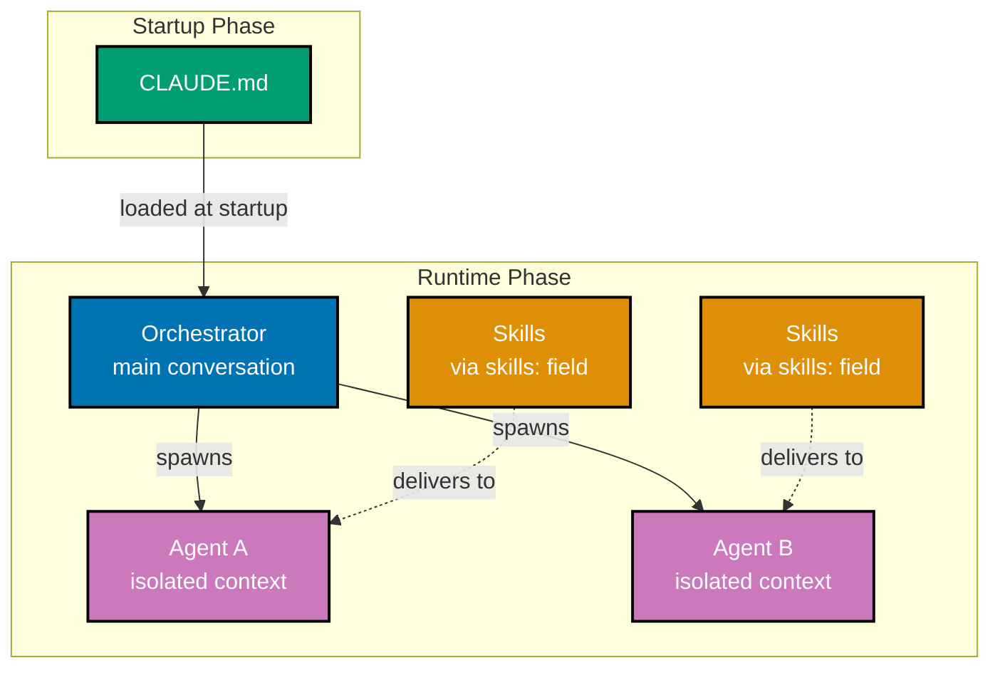

# Rules Consolidation

## Overview

This plan consolidates rules by fixing Skills naming convention, adding missing Skills references, creating new Skills for complete agent coverage, assigning skills to all agents, and fixing factual inaccuracies in delivery infrastructure documentation.

**Status**: Implementation Complete - Ready for Final Validation
**Created**: 2026-01-02
**Last Updated**: 2026-01-02
**Project Type**: Governance Enhancement
**Estimated Complexity**: Medium (~50 files across 8 phases)

## Pre-Plan Audit Results

A comprehensive audit was conducted before plan creation. Key findings:

| Category                          | Status                          | Details                                                    |
| --------------------------------- | ------------------------------- | ---------------------------------------------------------- |
| Convention Traceability           | ✅ Complete                     | All 24 conventions have "Principles Implemented/Respected" |
| Development Practice Traceability | ✅ Complete                     | All 15 practices have both traceability sections           |
| Skills Naming                     | ⚠️ 1 violation, 10 improvements | 1 uppercase, 10 could use gerund form                      |
| Skills References                 | ⚠️ 7 missing                    | 7 of 10 Skills need "References" section                   |
| Agent Skills Coverage             | ❌ 39 empty                     | 39 of 44 agents have empty `skills: []`                    |
| Missing Agents                    | ❌ 1 missing                    | `apps__ayokoding-web__link-fixer` needed for MCF pattern   |
| New Skills Needed                 | ❌ 7 needed                     | 7 new Skills to cover all agent domains                    |
| Factual Accuracy                  | ❌ 6 errors                     | 6 documents have incorrect delivery model                  |
| Tutorial Docs Consolidation       | ⚠️ 2 files overlap              | `programming-language-*` can be merged                     |
| CLAUDE.md Size                    | ✅ Under Limit                  | 28,473 characters (target: 30k)                            |

## Skills Naming Best Practices

Based on [official Anthropic documentation](https://platform.claude.com/docs/en/agents-and-tools/agent-skills/best-practices):

**Requirements:**

- Maximum 64 characters
- Lowercase letters, numbers, and hyphens only
- No XML tags, no "anthropic" or "claude"

**Preferred Pattern:** Gerund form (verb + -ing)

- `processing-pdfs`, `analyzing-spreadsheets`, `creating-by-example-tutorials`

## Concrete Work Items

Based on audit findings, the implementation work is:

### Phase 0: Fix Skills Naming Convention

**Required fix:**

- `MULTI-FILE-TEMPLATE` → `multi-file-template` (uppercase violates rules)

**Rename to gerund form (best practice):**

- `by-example-tutorial-creation` → `creating-by-example-tutorials`
- `criticality-confidence-system` → `assessing-criticality-confidence`
- `color-accessibility-diagrams` → `creating-accessible-diagrams`
- `hugo-ayokoding-development` → `developing-ayokoding-content`
- `factual-validation-methodology` → `validating-factual-accuracy`
- `gherkin-acceptance-criteria` → `writing-gherkin-criteria`
- `hugo-ose-development` → `developing-ose-content`
- `maker-checker-fixer-pattern` → `applying-maker-checker-fixer`
- `repository-architecture` → `understanding-repository-architecture`
- `trunk-based-development` → `practicing-trunk-based-development`

### Phase 1: Add References to 7 Existing Skills

- `creating-by-example-tutorials`
- `assessing-criticality-confidence`
- `developing-ayokoding-content`
- `validating-factual-accuracy`
- `writing-gherkin-criteria`
- `developing-ose-content`
- `practicing-trunk-based-development`

### Phase 2: Create 7 New Skills (gerund form)

- `applying-content-quality` → All content-creating agents
- `applying-diataxis-framework` → docs\_\_\* agents
- `creating-project-plans` → plan\_\_\* agents
- `writing-readme-files` → readme\_\_\* agents
- `defining-workflows` → wow**workflow**\* agents
- `developing-agents` → agent\_\_maker
- `validating-links` → Link-checker agents

### Phase 3: Assign Skills to 39 Agents

All agents must have non-empty `skills:` field (agents need skills like employees need skills).

### Phase 4: Fix 6 Factual Inaccuracies

Documents incorrectly state CLAUDE.md "delivers to" agents. Correct model:

- CLAUDE.md loads into Orchestrator at startup
- Orchestrator spawns Agents with isolated contexts
- Skills only deliver to Agents via explicit `skills:` field

### Phase 5: Enhance Validation

Add non-empty skills validation to wow\_\_rules-checker.

### Phase 6: Create Missing Link Fixer Agent

Create `apps__ayokoding-web__link-fixer` to complete the Maker-Checker-Fixer pattern for ayokoding-web link validation.

### Phase 7: Consolidate Tutorial Documentation

Merge overlapping tutorial convention documents:

- `programming-language-content.md` + `programming-language-structure.md` → single consolidated doc

## Implementation Constraint: Bash Tools for .claude/

**CRITICAL**: All file operations in `.claude/` folders MUST use Bash tools (heredoc, sed, awk), NOT Write/Edit tools. This enables autonomous agent operation without user approval prompts. See [AI Agents Convention](../../../governance/development/agents/ai-agents.md#writing-to-claude-folders).

## Correct Delivery Model

**Key insight**: Agents do NOT inherit CLAUDE.md. They only get Skills if declared in their `skills:` field.

## Key Principles

- **Conventions/Development docs are authoritative** - Skills and agents reference them, not duplicate
- **Skills deliver, not govern** - Skills encode knowledge for delivery, don't create new rules
- **Agents require Skills** - Every agent must have non-empty `skills:` field
- **Correct delivery model** - CLAUDE.md → Orchestrator; Skills → Agents via `skills:` field
- **Gerund naming** - Skills use verb + -ing form for clarity and consistency

## Plan Structure

This plan uses **multi-file structure**:

1. **[README.md](./README.md)** (this file) - Overview and audit results
2. **[requirements.md](./requirements.md)** - Goals, success criteria, constraints
3. **[tech-docs.md](./tech-docs.md)** - Audit findings, Skills assignment matrix
4. **[delivery.md](./delivery.md)** - Concrete implementation steps

## Success Metrics

| Metric                      | Current            | Target         |
| --------------------------- | ------------------ | -------------- |
| Skills with lowercase names | 9 of 10            | 17 of 17 (all) |
| Skills with gerund form     | 0 of 10            | 17 of 17 (all) |
| Skills with References      | 3 of 10            | 17 of 17 (all) |
| Agents with Skills          | 5 of 44            | 44 of 44 (all) |
| Complete MCF Patterns       | Missing link-fixer | All complete   |
| Factual Errors              | 6                  | 0              |
| Total Skills                | 10                 | 17             |
| Total Agents                | 44                 | 45             |
| Tutorial Convention Docs    | 2 overlapping      | 1 consolidated |

## Related Documentation

- [Repository Governance Architecture](../../../docs/explanation/ex-ru__repository-governance-architecture.md)
- [Skills Directory](../../../.claude/skills/README.md)
- [Agents Index](../../../.claude/agents/README.md)
- [AI Agents Convention](../../../governance/development/agents/ai-agents.md)

## Git Workflow

**Branch**: main (Trunk Based Development)
**Delivery**: Direct commits to main (no PR required)

## Documents Requiring Factual Corrections

| Document                                       | Issue                                           |
| ---------------------------------------------- | ----------------------------------------------- |
| `ex-ru__repository-governance-architecture.md` | Diagram shows `CM --> delivers to --> L4`       |
| `ex-ru__repository-governance-architecture.md` | ASCII shows `CLAUDE.md ──delivers to──> Agents` |
| `CLAUDE.md`                                    | "delivery to agents through auto-loading"       |
| `.claude/skills/README.md`                     | ASCII shows all mechanisms → Agents             |
| `ai-agents.md`                                 | "Inheritance Pattern" shows CLAUDE.md inherited |

## Next Steps

1. Review audit findings in [tech-docs.md](./tech-docs.md)
2. Review implementation steps in [delivery.md](./delivery.md)
3. Move to `in-progress/` when ready to begin
4. Execute phases sequentially (0 → 6)
