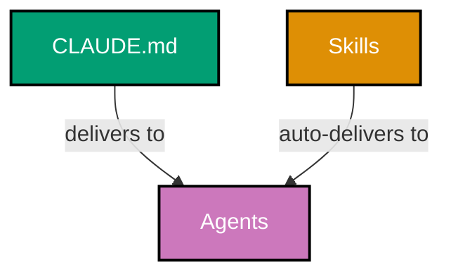
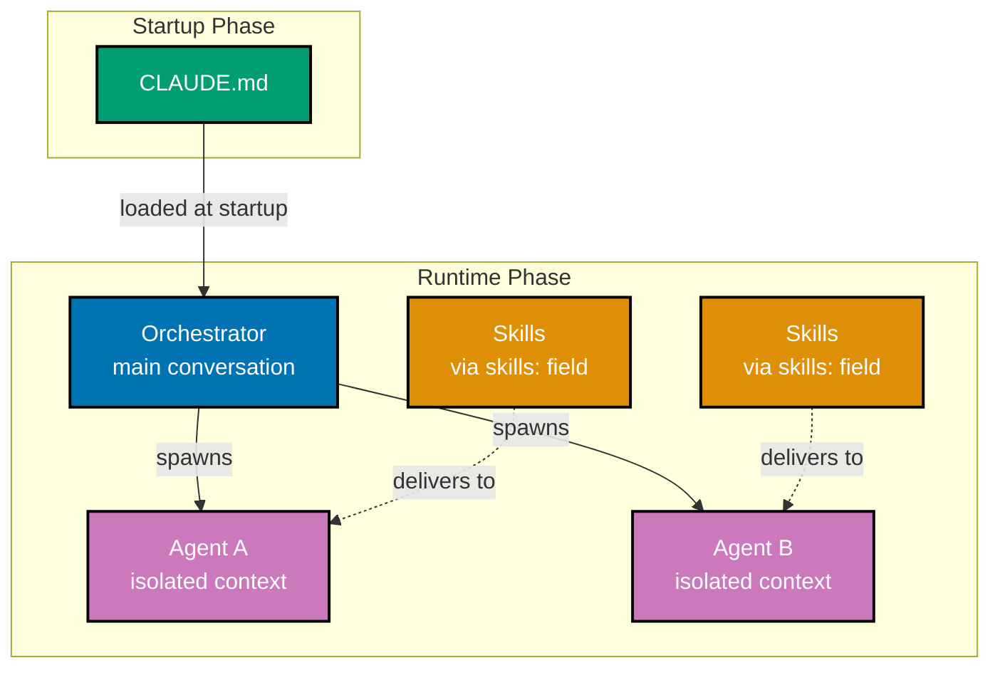

# Technical Documentation - Rules Consolidation

## Audit Results (Pre-Plan Analysis)

This section documents the findings from the comprehensive audit conducted before plan creation.

### Summary

| Category                          | Status            | Details                                                    |
| --------------------------------- | ----------------- | ---------------------------------------------------------- |
| Convention Traceability           | ✅ Complete       | All 24 conventions have "Principles Implemented/Respected" |
| Development Practice Traceability | ✅ Complete       | All 15 practices have both traceability sections           |
| Skills References                 | ⚠️ Incomplete     | 7 of 10 Skills missing "References" section                |
| Skills Naming                     | ⚠️ Improvements   | 1 violation (uppercase), 10 could use gerund form          |
| Agent Skills Coverage             | ❌ Incomplete     | 39 of 44 agents have empty `skills: []`                    |
| Missing Agents                    | ❌ Incomplete MCF | `apps__ayokoding-web__link-fixer` missing                  |
| CLAUDE.md Size                    | ✅ Under Limit    | 28,473 characters (target: 30k)                            |
| Factual Accuracy                  | ❌ Issues Found   | 6 documents have incorrect delivery model                  |

### Skills Naming Best Practices

Based on official Anthropic documentation:

**Requirements:**

- Maximum 64 characters
- Lowercase letters, numbers, and hyphens only
- No XML tags, no "anthropic" or "claude"

**Preferred Pattern:** Gerund form (verb + -ing)

- Good: `processing-pdfs`, `analyzing-spreadsheets`, `creating-accessible-diagrams`
- Acceptable but not preferred: `pdf-processing`, `color-accessibility-diagrams`

**Current Violations:**

- `MULTI-FILE-TEMPLATE` uses uppercase (MUST fix)

**Recommended Renames (gerund form):**

| Current Name                     | New Name (Gerund)                       |
| -------------------------------- | --------------------------------------- |
| `by-example-tutorial-creation`   | `creating-by-example-tutorials`         |
| `criticality-confidence-system`  | `assessing-criticality-confidence`      |
| `color-accessibility-diagrams`   | `creating-accessible-diagrams`          |
| `hugo-ayokoding-development`     | `developing-ayokoding-content`          |
| `factual-validation-methodology` | `validating-factual-accuracy`           |
| `gherkin-acceptance-criteria`    | `writing-gherkin-criteria`              |
| `hugo-ose-development`           | `developing-ose-content`                |
| `maker-checker-fixer-pattern`    | `applying-maker-checker-fixer`          |
| `repository-architecture`        | `understanding-repository-architecture` |
| `trunk-based-development`        | `practicing-trunk-based-development`    |

### Skills Missing References Section

The following 7 Skills need "References" sections added (using new gerund names):

| Skill (New Name)                     | Authoritative Source                                                                                                |
| ------------------------------------ | ------------------------------------------------------------------------------------------------------------------- |
| `creating-by-example-tutorials`      | `governance/conventions/tutorials/by-example.md`                                                                    |
| `assessing-criticality-confidence`   | `governance/development/quality/criticality-levels.md`, `governance/development/quality/fixer-confidence-levels.md` |
| `developing-ayokoding-content`       | `governance/conventions/hugo/ayokoding.md`                                                                          |
| `validating-factual-accuracy`        | `governance/conventions/writing/factual-validation.md`                                                              |
| `writing-gherkin-criteria`           | `governance/development/infra/acceptance-criteria.md`                                                               |
| `developing-ose-content`             | `governance/conventions/hugo/ose-platform.md`                                                                       |
| `practicing-trunk-based-development` | `governance/development/workflow/trunk-based-development.md`                                                        |

Skills with References (3, will be renamed): `creating-accessible-diagrams`, `applying-maker-checker-fixer`, `understanding-repository-architecture`

### Agents with Empty Skills

The following 39 agents have `skills: []` and need appropriate skills assigned:

**Content Makers (7 agents):**

- `apps__ayokoding-web__title-maker`
- `apps__ose-platform-web__content-maker`
- `docs__tutorial-maker`
- `readme__maker`
- `social__linkedin__post-maker`
- `wow__workflow-maker`
- `wow__rules-maker`

**Content Checkers (12 agents):**

- `apps__ayokoding-web__by-example-checker`
- `apps__ayokoding-web__facts-checker`
- `apps__ayokoding-web__general-checker`
- `apps__ayokoding-web__link-checker`
- `apps__ayokoding-web__structure-checker`
- `apps__ose-platform-web__content-checker`
- `docs__link-general-checker`
- `docs__tutorial-checker`
- `plan__checker`
- `plan__execution-checker`
- `readme__checker`
- `wow__rules-checker`
- `wow__workflow-checker`

**Content Fixers (11 agents):**

- `apps__ayokoding-web__by-example-fixer`
- `apps__ayokoding-web__facts-fixer`
- `apps__ayokoding-web__general-fixer`
- `apps__ayokoding-web__structure-fixer`
- `apps__ose-platform-web__content-fixer`
- `docs__fixer`
- `docs__tutorial-fixer`
- `plan__fixer`
- `readme__fixer`
- `wow__rules-fixer`
- `wow__workflow-fixer`

**Operations/Other (9 agents):**

- `agent__maker`
- `apps__ayokoding-web__deployer`
- `apps__ayokoding-web__navigation-maker`
- `apps__ayokoding-web__structure-maker`
- `apps__ose-platform-web__deployer`
- `docs__file-manager`
- `plan__executor`
- `swe__hugo__developer`

**Agents with Skills (5 agents, will be updated to new names):**

- `apps__ayokoding-web__by-example-maker`: `[creating-by-example-tutorials, developing-ayokoding-content]`
- `apps__ayokoding-web__general-maker`: `[developing-ayokoding-content, creating-accessible-diagrams]`
- `docs__checker`: `[applying-maker-checker-fixer, assessing-criticality-confidence]`
- `docs__maker`: `[creating-accessible-diagrams, applying-maker-checker-fixer]`
- `plan__maker`: `[writing-gherkin-criteria, practicing-trunk-based-development]`

### New Skills to Create

7 new Skills needed to cover all agent domains (using gerund form):

| New Skill                     | Convention Source       | Target Agents               |
| ----------------------------- | ----------------------- | --------------------------- |
| `applying-content-quality`    | `quality.md`            | All content-creating agents |
| `applying-diataxis-framework` | `diataxis-framework.md` | `docs__*` agents            |
| `creating-project-plans`      | `plans-organization.md` | `plan__*` agents            |
| `writing-readme-files`        | `readme-quality.md`     | `readme__*` agents          |
| `defining-workflows`          | `workflow-pattern.md`   | `wow__workflow__*` agents   |
| `developing-agents`           | `ai-agents.md`          | `agent__maker`              |
| `validating-links`            | `linking.md`            | Link-checker agents         |

### Factual Inaccuracies Found

6 documents incorrectly describe the delivery infrastructure:

| Document                                                   | Issue                                           | Fix Required                                  |
| ---------------------------------------------------------- | ----------------------------------------------- | --------------------------------------------- |
| `ex-ru__repository-governance-architecture.md` (line 62)   | Diagram: `CM --> delivers to L4`                | Change to `CM --> loaded at startup`          |
| `ex-ru__repository-governance-architecture.md` (line 63)   | Diagram: `SK --> auto-delivers to L4`           | Change to `SK --> delivers via skills: field` |
| `ex-ru__repository-governance-architecture.md` (line ~358) | ASCII: `CLAUDE.md ──delivers to──> Agents`      | Update to show Orchestrator                   |
| `CLAUDE.md` (line 249)                                     | "delivery to agents through auto-loading"       | Clarify Skills only load via `skills:` field  |
| `.claude/skills/README.md` (lines 21-26)                   | ASCII shows all mechanisms → Agents             | Add Orchestrator to flow                      |
| `ai-agents.md` (lines 1518-1519)                           | "Inheritance Pattern" shows CLAUDE.md inherited | Remove/fix inheritance claim                  |

### Missing Agent Found

Analysis of the 44 agents revealed one incomplete Maker-Checker-Fixer pattern:

| Agent Family        | Maker | Checker                             | Fixer      | Issue                              |
| ------------------- | ----- | ----------------------------------- | ---------- | ---------------------------------- |
| ayokoding-web links | N/A   | `apps__ayokoding-web__link-checker` | ❌ Missing | No fixer to apply link audit fixes |

**Action Required**: Create `apps__ayokoding-web__link-fixer` agent to complete the MCF pattern.

**Skills Assignment**: `[validating-links, assessing-criticality-confidence]`

## Architecture Diagrams

### Current State (Incorrect Model in Docs)

### Target State (Correct Model)

**Key insight**: Agents do NOT inherit CLAUDE.md. They only get Skills if declared in their `skills:` field.

## Skills Assignment Matrix

Recommended skills for each agent based on domain (using new gerund-form names):

### Ayokoding-Web Agents

| Agent                                     | Recommended Skills                                                                |
| ----------------------------------------- | --------------------------------------------------------------------------------- |
| `apps__ayokoding-web__by-example-maker`   | `creating-by-example-tutorials`, `developing-ayokoding-content` (update existing) |
| `apps__ayokoding-web__by-example-checker` | `creating-by-example-tutorials`, `assessing-criticality-confidence`               |
| `apps__ayokoding-web__by-example-fixer`   | `creating-by-example-tutorials`, `assessing-criticality-confidence`               |
| `apps__ayokoding-web__general-maker`      | `developing-ayokoding-content`, `creating-accessible-diagrams` (update existing)  |
| `apps__ayokoding-web__general-checker`    | `developing-ayokoding-content`, `assessing-criticality-confidence`                |
| `apps__ayokoding-web__general-fixer`      | `developing-ayokoding-content`, `assessing-criticality-confidence`                |
| `apps__ayokoding-web__facts-checker`      | `validating-factual-accuracy`, `assessing-criticality-confidence`                 |
| `apps__ayokoding-web__facts-fixer`        | `validating-factual-accuracy`, `assessing-criticality-confidence`                 |
| `apps__ayokoding-web__link-checker`       | `validating-links`, `assessing-criticality-confidence`                            |
| `apps__ayokoding-web__structure-checker`  | `developing-ayokoding-content`, `assessing-criticality-confidence`                |
| `apps__ayokoding-web__structure-fixer`    | `developing-ayokoding-content`, `assessing-criticality-confidence`                |
| `apps__ayokoding-web__structure-maker`    | `developing-ayokoding-content`                                                    |
| `apps__ayokoding-web__navigation-maker`   | `developing-ayokoding-content`                                                    |
| `apps__ayokoding-web__title-maker`        | `developing-ayokoding-content`                                                    |
| `apps__ayokoding-web__deployer`           | `practicing-trunk-based-development`                                              |

### OSE-Platform-Web Agents

| Agent                                     | Recommended Skills                                           |
| ----------------------------------------- | ------------------------------------------------------------ |
| `apps__ose-platform-web__content-maker`   | `developing-ose-content`, `applying-content-quality`         |
| `apps__ose-platform-web__content-checker` | `developing-ose-content`, `assessing-criticality-confidence` |
| `apps__ose-platform-web__content-fixer`   | `developing-ose-content`, `assessing-criticality-confidence` |
| `apps__ose-platform-web__deployer`        | `practicing-trunk-based-development`                         |

### Docs Agents

| Agent                        | Recommended Skills                                                                   |
| ---------------------------- | ------------------------------------------------------------------------------------ |
| `docs__maker`                | `creating-accessible-diagrams`, `applying-maker-checker-fixer` (update existing)     |
| `docs__checker`              | `applying-maker-checker-fixer`, `assessing-criticality-confidence` (update existing) |
| `docs__fixer`                | `applying-maker-checker-fixer`, `assessing-criticality-confidence`                   |
| `docs__tutorial-maker`       | `applying-diataxis-framework`, `applying-content-quality`                            |
| `docs__tutorial-checker`     | `applying-diataxis-framework`, `assessing-criticality-confidence`                    |
| `docs__tutorial-fixer`       | `applying-diataxis-framework`, `assessing-criticality-confidence`                    |
| `docs__link-general-checker` | `validating-links`, `assessing-criticality-confidence`                               |
| `docs__file-manager`         | `applying-diataxis-framework`                                                        |

### Plan Agents

| Agent                     | Recommended Skills                                                                 |
| ------------------------- | ---------------------------------------------------------------------------------- |
| `plan__maker`             | `writing-gherkin-criteria`, `practicing-trunk-based-development` (update existing) |
| `plan__checker`           | `creating-project-plans`, `assessing-criticality-confidence`                       |
| `plan__executor`          | `creating-project-plans`, `practicing-trunk-based-development`                     |
| `plan__execution-checker` | `creating-project-plans`, `assessing-criticality-confidence`                       |
| `plan__fixer`             | `creating-project-plans`, `assessing-criticality-confidence`                       |

### Readme Agents

| Agent             | Recommended Skills                                         |
| ----------------- | ---------------------------------------------------------- |
| `readme__maker`   | `writing-readme-files`, `applying-content-quality`         |
| `readme__checker` | `writing-readme-files`, `assessing-criticality-confidence` |
| `readme__fixer`   | `writing-readme-files`, `assessing-criticality-confidence` |

### Workflow/Rules Agents

| Agent                   | Recommended Skills                                                          |
| ----------------------- | --------------------------------------------------------------------------- |
| `wow__workflow-maker`   | `defining-workflows`, `writing-gherkin-criteria`                            |
| `wow__workflow-checker` | `defining-workflows`, `assessing-criticality-confidence`                    |
| `wow__workflow-fixer`   | `defining-workflows`, `assessing-criticality-confidence`                    |
| `wow__rules-maker`      | `understanding-repository-architecture`, `applying-maker-checker-fixer`     |
| `wow__rules-checker`    | `understanding-repository-architecture`, `assessing-criticality-confidence` |
| `wow__rules-fixer`      | `understanding-repository-architecture`, `assessing-criticality-confidence` |

### Other Agents

| Agent                          | Recommended Skills                                           |
| ------------------------------ | ------------------------------------------------------------ |
| `agent__maker`                 | `developing-agents`, `understanding-repository-architecture` |
| `swe__hugo__developer`         | `developing-ayokoding-content`, `developing-ose-content`     |
| `social__linkedin__post-maker` | `applying-content-quality`                                   |

## Complete Change Impact Table

### Layer 1: Principles (10 files) - NO CHANGES

| File                            | Change    |
| ------------------------------- | --------- |
| `accessibility-first.md`        | No change |
| `documentation-first.md`        | No change |
| `no-time-estimates.md`          | No change |
| `progressive-disclosure.md`     | No change |
| `simplicity-over-complexity.md` | No change |
| `automation-over-manual.md`     | No change |
| `explicit-over-implicit.md`     | No change |
| `immutability.md`               | No change |
| `pure-functions.md`             | No change |
| `reproducibility.md`            | No change |

### Layer 2: Conventions (24 files) - NO CHANGES

| File                                | Change    |
| ----------------------------------- | --------- |
| `convention-writing.md`             | No change |
| `factual-validation.md`             | No change |
| `oss-documentation.md`              | No change |
| `quality.md`                        | No change |
| `readme-quality.md`                 | No change |
| `color-accessibility.md`            | No change |
| `diagrams.md`                       | No change |
| `emoji.md`                          | No change |
| `indentation.md`                    | No change |
| `linking.md`                        | No change |
| `mathematical-notation.md`          | No change |
| `nested-code-fences.md`             | No change |
| `timestamp.md`                      | No change |
| `ayokoding.md`                      | No change |
| `ose-platform.md`                   | No change |
| `shared.md`                         | No change |
| `diataxis-framework.md`             | No change |
| `file-naming.md`                    | No change |
| `plans-organization.md`             | No change |
| `by-example.md`                     | No change |
| `general.md`                        | No change |
| `naming.md`                         | No change |
| `programming-language-content.md`   | No change |
| `programming-language-structure.md` | No change |

### Layer 3: Development (15 files) - 1 CHANGE

| File                           | Change                                                  |
| ------------------------------ | ------------------------------------------------------- |
| `ai-agents.md`                 | ⚠️ **Phase 4**: Fix "Inheritance Pattern" factual error |
| `development.md`               | No change                                               |
| `acceptance-criteria.md`       | No change                                               |
| `temporary-files.md`           | No change                                               |
| `functional-programming.md`    | No change                                               |
| `maker-checker-fixer.md`       | No change                                               |
| `code.md`                      | No change                                               |
| `content-preservation.md`      | No change                                               |
| `criticality-levels.md`        | No change                                               |
| `fixer-confidence-levels.md`   | No change                                               |
| `repository-validation.md`     | No change                                               |
| `commit-messages.md`           | No change                                               |
| `implementation.md`            | No change                                               |
| `reproducible-environments.md` | No change                                               |
| `trunk-based-development.md`   | No change                                               |

### Layer 4: Skills (10 existing → 17 total) - ALL RENAMED + 7 NEW + allowed-tools

| Current Skill                    | New Name (Gerund)                       | allowed-tools                                              | Additional Changes            |
| -------------------------------- | --------------------------------------- | ---------------------------------------------------------- | ----------------------------- |
| `by-example-tutorial-creation`   | `creating-by-example-tutorials`         | `Read, Write, Edit, Glob, Grep, WebFetch, WebSearch, Bash` | + References + allowed-tools  |
| `color-accessibility-diagrams`   | `creating-accessible-diagrams`          | `Read, Write, Edit`                                        | + allowed-tools               |
| `criticality-confidence-system`  | `assessing-criticality-confidence`      | `Read, Glob, Grep, Write, Bash`                            | + References + allowed-tools  |
| `factual-validation-methodology` | `validating-factual-accuracy`           | `Read, Glob, Grep, WebFetch, WebSearch, Write, Bash`       | + References + allowed-tools  |
| `gherkin-acceptance-criteria`    | `writing-gherkin-criteria`              | `Read, Write, Edit, Glob, Grep`                            | + References + allowed-tools  |
| `hugo-ayokoding-development`     | `developing-ayokoding-content`          | `Read, Write, Edit, Glob, Grep, Bash`                      | + References + allowed-tools  |
| `hugo-ose-development`           | `developing-ose-content`                | `Read, Write, Edit, Glob, Grep, Bash`                      | + References + allowed-tools  |
| `maker-checker-fixer-pattern`    | `applying-maker-checker-fixer`          | `Read, Glob, Grep, Write, Edit, Bash`                      | + allowed-tools               |
| `MULTI-FILE-TEMPLATE`            | `multi-file-template`                   | `Read, Write, Edit, Glob, Grep`                            | Fix uppercase + allowed-tools |
| `repository-architecture`        | `understanding-repository-architecture` | `Read, Glob, Grep`                                         | + allowed-tools               |
| `trunk-based-development`        | `practicing-trunk-based-development`    | `Bash`                                                     | + References + allowed-tools  |
| —                                | `applying-content-quality`              | `Read, Write, Edit, Glob, Grep`                            | **NEW** - Phase 2             |
| —                                | `applying-diataxis-framework`           | `Read, Write, Edit, Glob, Grep`                            | **NEW** - Phase 2             |
| —                                | `creating-project-plans`                | `Read, Write, Edit, Glob, Grep`                            | **NEW** - Phase 2             |
| —                                | `defining-workflows`                    | `Read, Write, Edit, Glob, Grep`                            | **NEW** - Phase 2             |
| —                                | `developing-agents`                     | `Read, Glob, Grep, Bash`                                   | **NEW** - Phase 2             |
| —                                | `validating-links`                      | `Read, Glob, Grep, WebFetch, WebSearch, Write, Edit, Bash` | **NEW** - Phase 2             |
| —                                | `writing-readme-files`                  | `Read, Write, Edit, Glob, Grep`                            | **NEW** - Phase 2             |

**Note**: `allowed-tools` restricts which tools Claude can use when the Skill is active. This is a Claude Code-specific feature.

### Layer 4: Agents (44 existing → 45 total) - ALL GET SKILLS + 1 NEW

| Agent                                     | Current Skills                                                 | New Skills (Phase 3)                                                        |
| ----------------------------------------- | -------------------------------------------------------------- | --------------------------------------------------------------------------- |
| `agent__maker`                            | `[]`                                                           | `[developing-agents, understanding-repository-architecture]`                |
| `apps__ayokoding-web__by-example-checker` | `[]`                                                           | `[creating-by-example-tutorials, assessing-criticality-confidence]`         |
| `apps__ayokoding-web__by-example-fixer`   | `[]`                                                           | `[creating-by-example-tutorials, assessing-criticality-confidence]`         |
| `apps__ayokoding-web__by-example-maker`   | `[by-example-tutorial-creation, hugo-ayokoding-development]`   | `[creating-by-example-tutorials, developing-ayokoding-content]`             |
| `apps__ayokoding-web__deployer`           | `[]`                                                           | `[practicing-trunk-based-development]`                                      |
| `apps__ayokoding-web__facts-checker`      | `[]`                                                           | `[validating-factual-accuracy, assessing-criticality-confidence]`           |
| `apps__ayokoding-web__facts-fixer`        | `[]`                                                           | `[validating-factual-accuracy, assessing-criticality-confidence]`           |
| `apps__ayokoding-web__general-checker`    | `[]`                                                           | `[developing-ayokoding-content, assessing-criticality-confidence]`          |
| `apps__ayokoding-web__general-fixer`      | `[]`                                                           | `[developing-ayokoding-content, assessing-criticality-confidence]`          |
| `apps__ayokoding-web__general-maker`      | `[hugo-ayokoding-development, color-accessibility-diagrams]`   | `[developing-ayokoding-content, creating-accessible-diagrams]`              |
| `apps__ayokoding-web__link-checker`       | `[]`                                                           | `[validating-links, assessing-criticality-confidence]`                      |
| `apps__ayokoding-web__navigation-maker`   | `[]`                                                           | `[developing-ayokoding-content]`                                            |
| `apps__ayokoding-web__structure-checker`  | `[]`                                                           | `[developing-ayokoding-content, assessing-criticality-confidence]`          |
| `apps__ayokoding-web__structure-fixer`    | `[]`                                                           | `[developing-ayokoding-content, assessing-criticality-confidence]`          |
| `apps__ayokoding-web__structure-maker`    | `[]`                                                           | `[developing-ayokoding-content]`                                            |
| `apps__ayokoding-web__title-maker`        | `[]`                                                           | `[developing-ayokoding-content]`                                            |
| `apps__ose-platform-web__content-checker` | `[]`                                                           | `[developing-ose-content, assessing-criticality-confidence]`                |
| `apps__ose-platform-web__content-fixer`   | `[]`                                                           | `[developing-ose-content, assessing-criticality-confidence]`                |
| `apps__ose-platform-web__content-maker`   | `[]`                                                           | `[developing-ose-content, applying-content-quality]`                        |
| `apps__ose-platform-web__deployer`        | `[]`                                                           | `[practicing-trunk-based-development]`                                      |
| `docs__checker`                           | `[maker-checker-fixer-pattern, criticality-confidence-system]` | `[applying-maker-checker-fixer, assessing-criticality-confidence]`          |
| `docs__file-manager`                      | `[]`                                                           | `[applying-diataxis-framework]`                                             |
| `docs__fixer`                             | `[]`                                                           | `[applying-maker-checker-fixer, assessing-criticality-confidence]`          |
| `docs__link-general-checker`              | `[]`                                                           | `[validating-links, assessing-criticality-confidence]`                      |
| `docs__maker`                             | `[color-accessibility-diagrams, maker-checker-fixer-pattern]`  | `[creating-accessible-diagrams, applying-maker-checker-fixer]`              |
| `docs__tutorial-checker`                  | `[]`                                                           | `[applying-diataxis-framework, assessing-criticality-confidence]`           |
| `docs__tutorial-fixer`                    | `[]`                                                           | `[applying-diataxis-framework, assessing-criticality-confidence]`           |
| `docs__tutorial-maker`                    | `[]`                                                           | `[applying-diataxis-framework, applying-content-quality]`                   |
| `plan__checker`                           | `[]`                                                           | `[creating-project-plans, assessing-criticality-confidence]`                |
| `plan__execution-checker`                 | `[]`                                                           | `[creating-project-plans, assessing-criticality-confidence]`                |
| `plan__executor`                          | `[]`                                                           | `[creating-project-plans, practicing-trunk-based-development]`              |
| `plan__fixer`                             | `[]`                                                           | `[creating-project-plans, assessing-criticality-confidence]`                |
| `plan__maker`                             | `[gherkin-acceptance-criteria, trunk-based-development]`       | `[writing-gherkin-criteria, practicing-trunk-based-development]`            |
| `readme__checker`                         | `[]`                                                           | `[writing-readme-files, assessing-criticality-confidence]`                  |
| `readme__fixer`                           | `[]`                                                           | `[writing-readme-files, assessing-criticality-confidence]`                  |
| `readme__maker`                           | `[]`                                                           | `[writing-readme-files, applying-content-quality]`                          |
| `social__linkedin__post-maker`            | `[]`                                                           | `[applying-content-quality]`                                                |
| `swe__hugo__developer`                    | `[]`                                                           | `[developing-ayokoding-content, developing-ose-content]`                    |
| `wow__rules-checker`                      | `[]`                                                           | `[understanding-repository-architecture, assessing-criticality-confidence]` |
| `wow__rules-fixer`                        | `[]`                                                           | `[understanding-repository-architecture, assessing-criticality-confidence]` |
| `wow__rules-maker`                        | `[]`                                                           | `[understanding-repository-architecture, applying-maker-checker-fixer]`     |
| `wow__workflow-checker`                   | `[]`                                                           | `[defining-workflows, assessing-criticality-confidence]`                    |
| `wow__workflow-fixer`                     | `[]`                                                           | `[defining-workflows, assessing-criticality-confidence]`                    |
| `wow__workflow-maker`                     | `[]`                                                           | `[defining-workflows, writing-gherkin-criteria]`                            |
| —                                         | —                                                              | **NEW**: `apps__ayokoding-web__link-fixer` (Phase 6)                        |

### Layer 5: Workflows (8 files) - NO CHANGES

| File                                        | Change    |
| ------------------------------------------- | --------- |
| `ex-ru-wf-aywe__by-example-quality-gate.md` | No change |
| `ex-ru-wf-aywe__general-quality-gate.md`    | No change |
| `quality-gate.md`                           | No change |
| `workflow-pattern.md`                       | No change |
| `execution.md`                              | No change |
| `quality-gate.md`                           | No change |
| `repository-rules-validation.md`            | No change |

### CLAUDE.md Changes

| Section                | Change                                                        |
| ---------------------- | ------------------------------------------------------------- |
| Skills Infrastructure  | ⚠️ **Phase 4**: Fix "delivery to agents through auto-loading" |
| Skills Infrastructure  | Update skill names to gerund form                             |
| Available Agents       | Add `apps__ayokoding-web__link-fixer` to Fixing section       |
| Agent count references | Update 44 → 45                                                |

### Other Files Changed

| File                                           | Change                                                   |
| ---------------------------------------------- | -------------------------------------------------------- |
| `ex-ru__repository-governance-architecture.md` | ⚠️ **Phase 4**: Fix Mermaid diagram and ASCII diagram    |
| `.claude/skills/README.md`                     | ⚠️ **Phase 4**: Fix ASCII diagram showing delivery model |
| `.claude/agents/README.md`                     | Update with new agent and skill assignments              |

### Change Summary by Phase

| Phase   | Files Changed                                        | Type of Change               |
| ------- | ---------------------------------------------------- | ---------------------------- |
| Phase 0 | 10 skill directories + 5 agents + README + CLAUDE.md | Rename skills to gerund form |
| Phase 1 | 7 skill SKILL.md files                               | Add References sections      |
| Phase 2 | 7 new skill directories                              | Create new skills            |
| Phase 3 | 44 agent .md files                                   | Update `skills:` frontmatter |
| Phase 4 | 4 documentation files                                | Fix factual inaccuracies     |
| Phase 5 | 1 agent file                                         | Enhance validation logic     |
| Phase 6 | 1 new agent file + README + CLAUDE.md                | Create link-fixer agent      |

**Total Files Impacted**: ~70 files across all phases

## No New Dependencies

This plan uses only existing repository tools and patterns. No new npm packages, CLI tools, or external services are required.

## Related Documentation

- [Repository Governance Architecture](../../../../governance/repository-governance-architecture.md)
- [Convention Writing Convention](../../../../../../governance/conventions/writing/quality.md)
- [AI Agents Convention](../../../../governance/development/agents/ai-agents.md)
- [Skills Directory](../../.././.claude/skills/README.md)
