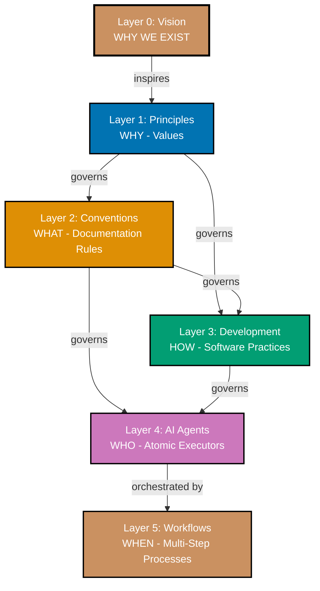
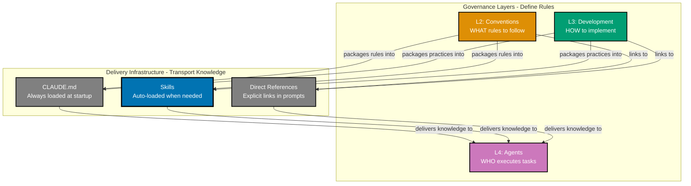
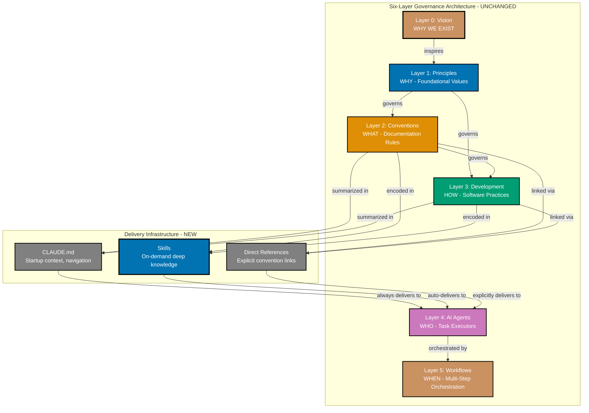
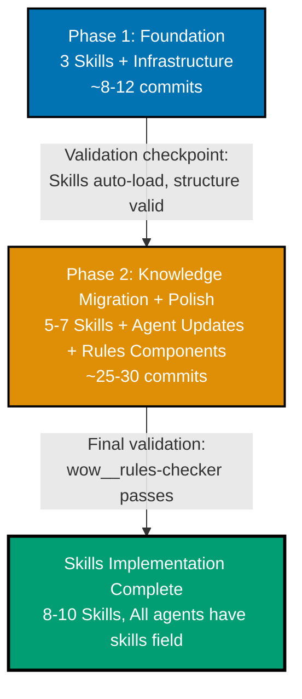

# Technical Documentation

## Architecture Overview

### Current Architecture (Six Layers - Unchanged)



**The six-layer governance hierarchy remains unchanged.** Skills are infrastructure that supports knowledge delivery, not a governance layer.

### Skills as Delivery Infrastructure



**Key insight**: Skills sit alongside CLAUDE.md and direct references as delivery mechanisms. All three transport knowledge from Conventions/Development to Agents. None of them are governance layers.

**What this diagram shows:**

1. **Three delivery mechanisms** - CLAUDE.md (always loaded), Skills (auto-loaded), Direct References (explicit)
2. **Knowledge flow direction** - From source (L2/L3) through delivery to consumer (L4)
3. **Skills highlighted** - Blue color and thicker border emphasizes the new component
4. **No governance arrows** - Delivery infrastructure doesn't govern agents, it serves them

### Complete Architecture with Skills Infrastructure

This diagram shows the full six-layer governance architecture with Skills as delivery infrastructure. This is the diagram that will be added to `governance/repository-governance-architecture.md`:



**Key points for this diagram:**

1. **Governance layers unchanged** - Six layers (L0-L5) remain exactly as they are (subgraph labeled "UNCHANGED")
2. **Delivery infrastructure added** - New subgraph labeled "NEW" showing three delivery mechanisms
3. **Skills highlighted** - Blue color and thicker border emphasizes the new component
4. **Distinct delivery modes** - "always delivers", "auto-delivers", "explicitly delivers" show different loading behaviors
5. **No governance arrows from Skills** - Skills don't govern anything, they serve agents
6. **Clear knowledge encoding** - "summarized in", "encoded in", "linked via" describe packaging methods

### Why Infrastructure, Not a Layer?

**Governance layers** have defining characteristics:

1. **Enforce rules** on the layer below
2. **Create obligations** and constraints
3. **Answer "what must be done"** at their level

**Testing the governance relationship:**

| Source                    | Target | Governance?                             | Evidence |
| ------------------------- | ------ | --------------------------------------- | -------- |
| Conventions → Development | Yes    | Conventions define HOW docs are written |
| Conventions → Agents      | Yes    | Agents MUST follow doc standards        |
| Development → Agents      | Yes    | Agents MUST follow coding patterns      |
| Skills → Agents           | **No** | Skills SERVE agents with knowledge      |

**Skills don't govern agents. Skills serve agents.**

**Infrastructure** has different characteristics:

1. **Transport or deliver** something
2. **No governance relationship** with consumers
3. **Multiple alternatives** can coexist

**Examples of infrastructure:**

- CLAUDE.md (delivers context summaries)
- Agent files (deliver prompts)
- Git hooks (deliver automation)
- Skills (deliver packaged knowledge)

### Skills Characteristics

**What Skills Are:**

- **Model-invoked knowledge packages** - Claude auto-loads based on description matching
- **Progressive disclosure implementation** - Name/description at startup, full content on-demand
- **Specialized knowledge encoding** - Conventions and practices packaged for efficient access
- **Composable building blocks** - Multiple Skills work together seamlessly
- **Portable standard** - agentskills.io format works across Claude ecosystem
- **Delivery infrastructure** - Transport mechanism like CLAUDE.md, not governance layer

**What Skills Are NOT:**

- **NOT a governance layer** - Skills don't enforce rules on agents
- **NOT replacing CLAUDE.md** - Skills complement existing delivery mechanisms
- **NOT mandatory** - Agents can use Skills, CLAUDE.md, or direct references
- **NOT conventions** - Conventions define rules; Skills deliver knowledge
- **NOT agents** - Agents execute tasks; Skills provide knowledge

**Distinction from Agents:**

| Aspect           | Skills               | Agents                 |
| ---------------- | -------------------- | ---------------------- |
| **Purpose**      | Deliver knowledge    | Execute tasks          |
| **Invocation**   | Model-invoked (auto) | User/Workflow-invoked  |
| **Output**       | Knowledge for Claude | Changed files, reports |
| **Relationship** | Serves agents        | Uses knowledge         |
| **Location**     | `.claude/skills/`    | `.claude/agents/`      |

## Technology Stack

### Core Technologies

**Claude Code Skills:**

- **Standard**: agentskills.io open specification
- **Format**: Markdown with YAML frontmatter
- **Storage**: `.claude/skills/` directory
- **Loading**: Automatic based on description matching

**Repository Stack (existing):**

- **Node.js**: 24.11.1 (Volta-managed)
- **Nx Monorepo**: Workspace organization
- **Git**: Version control with Trunk Based Development
- **Markdown**: Documentation format
- **YAML**: Frontmatter and configuration

### Skills File Structure

**Single-file Skill:**

```
.claude/skills/skill-name/
└── SKILL.md          # Frontmatter + content
```

**Multi-file Skill:**

```
.claude/skills/skill-name/
├── SKILL.md          # Frontmatter + overview
├── reference.md      # Detailed reference documentation
├── examples.md       # Code examples and usage patterns
└── scripts/          # Optional utility scripts
    └── helper.sh
```

**SKILL.md frontmatter:**

```yaml
---
name: skill-name
description: Clear description for auto-loading (CRITICAL)
allowed-tools: [Read, Grep] # Optional
model: sonnet # Optional
---
# Skill Content

Markdown instructions, examples, best practices...
```

## Design Decisions

### Decision 1: Skills as Infrastructure (Not a Layer)

**Context:**

The repository needs a way to package specialized knowledge for model consumption. Three architectural approaches were considered:

1. **Infrastructure** - Skills as delivery mechanism supporting existing layers (chosen)
2. **New Layer** - Insert Skills as Layer 4 between Development and Agents
3. **Layer subdivision** - Split Agents layer into Skills + Agents

**Decision:** Implement Skills as **delivery infrastructure**

**Rationale:**

**Why Infrastructure works:**

- **No governance relationship** - Skills serve agents, don't enforce rules
- **Parallel with existing patterns** - Like CLAUDE.md, agent files, git hooks
- **Simpler mental model** - Six layers unchanged, Skills are delivery mechanism
- **No layer renumbering** - Avoids renumbering L4→L5, L5→L6
- **Clear purpose** - Skills deliver knowledge from L2/L3 to L4
- **Coexistence** - Multiple delivery mechanisms (CLAUDE.md, Skills, direct refs) work together

**Why NOT a new Layer:**

- Skills don't GOVERN agents (governance layers enforce rules)
- Skills SERVE agents with knowledge (infrastructure relationship)
- Adding Layer 4 would imply Skills control agents (they don't)
- Layer renumbering adds complexity without governance benefit

**Why NOT Layer subdivision:**

- Skills and Agents have fundamentally different purposes
- Mixing them in same layer would be confusing
- Infrastructure is cleaner separation

**Consequences:**

- **Positive**: Six-layer architecture preserved (no renumbering)
- **Positive**: Simpler mental model (Skills = delivery like CLAUDE.md)
- **Positive**: Clear that Skills serve agents, not govern them
- **Positive**: Multiple delivery mechanisms naturally coexist
- **Negative**: Skills don't appear in architecture diagrams
- **Mitigation**: Document Skills in infrastructure section of architecture docs

### Decision 2: Description-Based Auto-Loading

**Context:**

Skills need a mechanism to automatically load when relevant to user tasks.

**Decision:** Use **description-based matching** (agentskills.io standard)

**Rationale:**

- **Standard compliance**: agentskills.io specifies description-based auto-loading
- **User simplicity**: Users describe tasks naturally; Claude handles Skill loading
- **Flexibility**: Description can encode multiple trigger patterns
- **Portability**: Works across Claude.ai, Code, and API

**Implementation:**

Skill descriptions must be:

- **Clear and specific** - Precisely describe when Skill applies
- **Action-oriented** - Include trigger verbs (e.g., "Use when creating diagrams...")
- **Comprehensive** - Cover all use cases for the Skill
- **Unique** - Avoid description overlap between Skills

**Example:**

```yaml
description: WCAG-compliant Mermaid diagrams using verified accessible color palette. Use when creating diagrams, flowcharts, or any color-dependent visualizations requiring accessibility compliance.
```

### Decision 3: Skills Reference Conventions (Not Replace)

**Context:**

Should Skills replace convention documents or reference them?

**Decision:** Skills **reference** conventions, **not replace** them

**Rationale:**

- **Documentation First principle**: Conventions in `docs/` are canonical documentation
- **Single source of truth**: Convention docs remain authoritative
- **Skills as encoding layer**: Skills package conventions for model consumption
- **Human-readable docs preserved**: Contributors read conventions, Claude reads Skills

**Implementation:**

- Skills include links to convention documents
- Skills summarize conventions but don't duplicate entire content
- Skills add model-specific guidance (e.g., Mermaid code examples)
- Conventions remain in `docs/`, Skills in `.claude/skills/`

### Decision 4: Multi-Phase Sequential Delivery

**Context:**

Skills implementation is moderate scope (8-10 Skills, infrastructure docs, agent updates). The repository uses Trunk Based Development.

**Decision:** **Multi-phase sequential delivery with direct commits to `main`**

**Phase Breakdown:**

1. **Phase 1: Foundation** (~3 Skills, infrastructure, ~8-12 commits)
2. **Phase 2: Knowledge Migration & Polish** (~5-7 Skills, agent updates, templates, final validation, ~25-30 commits)

**Rationale:**

- Aligns with Trunk Based Development convention
- Natural breakpoint for validation
- Small, frequent commits with validation gates

### Decision 5: Agent Skills Frontmatter (Required Field)

**Context:**

How should agents reference Skills? Initial consideration was making `skills:` optional for backward compatibility, but composability and consistency requirements suggest a different approach.

**Decision:** **Required `skills:` frontmatter field** (can be empty array `[]`)

**Rationale:**

- **Composability**: Explicit Skills declarations enable better component composition
- **Consistency**: All agents have same structure, no special cases
- **Discoverability**: Easy to see which agents use which Skills (or none)
- **Validation**: Checker can enforce field presence, not guess intent
- **Progressive migration**: Empty array `skills: []` valid during transition
- **Future-proofing**: As Skills grow, explicit declaration becomes essential

**Trade-offs:**

| Aspect           | Required Field                | Optional Field             |
| ---------------- | ----------------------------- | -------------------------- |
| Composability    | High (explicit declarations)  | Low (implicit assumptions) |
| Consistency      | All agents uniform            | Mixed structures           |
| Migration effort | Update all agents (one-time)  | None initially             |
| Validation       | Simple (field must exist)     | Complex (handle missing)   |
| Intent clarity   | Explicit (`[]` = intentional) | Ambiguous (missing = ?)    |

**Implementation:**

```yaml
---
name: docs__maker
description: Expert documentation writer
tools: [Read, Write, Edit, Grep, Glob]
model: sonnet
color: blue
skills:
  - color-accessibility-diagrams
  - maker-checker-fixer-pattern
---
```

**For agents not using Skills:**

```yaml
---
name: simple__helper
description: Simple helper agent
tools: [Read]
model: haiku
color: green
skills: []
---
```

**Migration Strategy:**

1. Phase 1: Document `skills:` as required field in AI Agents Convention
2. Phase 2: Add `skills: []` to all existing agents (batch update)
3. Phase 2: Update example agents with actual Skills references
4. Ongoing: New agents created with `skills:` field from start

## Implementation Approach

### Phase 1: Foundation

**Goal**: Establish Skills infrastructure with first 3 core Skills

**Tasks:**

1. **Create `.claude/skills/` directory structure**
   - README.md explaining Skills purpose
   - Template files for future Skill creation

2. **Create first 3 Skills:**

   **Skill 1: `maker-checker-fixer-pattern`**
   - Three-stage content quality workflow
   - Reference: Link to Maker-Checker-Fixer Pattern Convention

   **Skill 2: `color-accessibility-diagrams`**
   - WCAG-compliant Mermaid diagrams
   - Reference: Link to Color Accessibility Convention

   **Skill 3: `repository-architecture`**
   - Six-layer governance hierarchy
   - Reference: Link to Repository Architecture

3. **Update AI Agents Convention**
   - Add optional `skills:` frontmatter field documentation

4. **Add Skills section to CLAUDE.md**
   - Brief description of Skills as delivery infrastructure
   - Link to Skills directory README

**Success Criteria:**

- [ ] `.claude/skills/` directory created with proper structure
- [ ] 3 Skills created with valid SKILL.md frontmatter and content
- [ ] Skills auto-load when relevant tasks mentioned
- [ ] AI Agents Convention documents `skills:` field
- [ ] CLAUDE.md updated with Skills section

### Phase 2: Knowledge Migration & Polish

**Goal**: Create remaining 5-7 Skills, optimize CLAUDE.md, and finalize implementation

**Tasks:**

1. **Create additional Skills:**
   - `hugo-ayokoding-development` - Hextra theme, bilingual, weight system
   - `by-example-tutorial-creation` - 75-90 annotated examples, annotation density
   - `factual-validation-methodology` - WebSearch/WebFetch verification
   - `trunk-based-development` - Main branch workflow
   - `gherkin-acceptance-criteria` - Given-When-Then format
   - (Optional) `hugo-ose-development` - PaperMod theme
   - (Optional) `criticality-confidence-system` - Checker/Fixer levels

2. **CLAUDE.md Optimization**

   **Pattern:**
   - Replace detailed content with 2-5 line summary
   - Add link to convention document
   - Add note: "Skill: `skill-name` auto-loads when [context]"

   **Target**: Maintain ≤30k characters

3. **Update 5-10 Example Agents**

   Add optional `skills:` frontmatter to demonstrate pattern

4. **Templates and Best Practices**
   - Enhance Skill creation templates
   - Create Skills usage guide
   - Document best practices

5. **Final Validation**
   - Run `wow__rules-checker` on all Skills
   - Validate CLAUDE.md size
   - Test agent Skills references
   - Confirm backward compatibility

**Success Criteria:**

- [ ] 5-7 Skills created with valid structure
- [ ] CLAUDE.md character count ≤30,000
- [ ] 5-10 agents updated with optional Skills references
- [ ] All Skills auto-load when relevant
- [ ] Templates and guides available
- [ ] All validation passed
- [ ] Zero breaking changes

## Data Models

### Skill Frontmatter Schema

```yaml
name: string # Required - Skill identifier (matches folder name)
description: string # Required - Auto-load trigger description (CRITICAL)
allowed-tools: array<string> # Optional - Tool access restrictions
model: string # Optional - Model requirement (sonnet, opus)
```

### Agent Skills Reference Schema

```yaml
name: string
description: string
tools: array<string>
model: string
color: string
skills: array<string> # NEW - Required Skills references (can be empty [])
```

## Security Considerations

### Skills Tool Access Control

- Skills `allowed-tools` field restricts tool access (opt-in security)
- Skills with no `allowed-tools` get default read-only access

### Skills Content Validation

- `wow__rules-checker` validates Skills content against conventions
- Skills must reference authoritative convention documents

### Backward Compatibility

- Skills are additive (existing agents work without modification)
- `skills:` frontmatter field is optional
- Agent behavior unchanged if `skills:` field absent

## Testing Strategy

### Per-Skill Validation

1. Frontmatter validation (name, description, tools)
2. Content validation (markdown quality, links)
3. Auto-load testing (verify triggers correctly)

### Integration Testing

1. Skills reference validation
2. Composition testing (multiple Skills together)
3. Backward compatibility (agents without Skills work)

### System Testing

1. CLAUDE.md size verification (≤30k)
2. Agent execution with Skills
3. Cross-platform validation

## Deployment Strategy

### Trunk Based Development

All work happens on `main` branch with small, frequent commits.



**What each phase delivers:**

| Phase   | Skills Created | Agent Updates                  | Rules Components            | Validation                  |
| ------- | -------------- | ------------------------------ | --------------------------- | --------------------------- |
| Phase 1 | 3 core Skills  | AI Agents Convention update    | N/A                         | Skills auto-load test       |
| Phase 2 | 5-7 Skills     | All agents get `skills:` field | maker/checker/fixer updates | wow\_\_rules-checker passes |

### Rollback Strategy

- **Forward Fix** (preferred): New commit fixing issue
- **Revert Commit**: If breaking changes discovered
- **Hotfix**: For critical blocking issues

## Alternative Approaches (Not Chosen)

### Alternative A: Skills as Layer 4

**Structure:** Insert Skills as governance layer between Development and Agents

**Why NOT Chosen:**

- Skills don't GOVERN agents (governance test fails)
- Skills SERVE agents with knowledge (infrastructure relationship)
- Requires renumbering L4→L5, L5→L6 (unnecessary complexity)
- Implies Skills control agents (they don't)

### Alternative B: Layer Subdivision

**Structure:** Split Layer 4 into 4a (Skills) and 4b (Agents)

**Why NOT Chosen:**

- Skills and Agents have fundamentally different purposes
- Infrastructure is cleaner separation
- Subdivision adds confusion

### Alternative C: Skills Replace Convention Docs

**Structure:** Migrate conventions directly into Skills

**Why NOT Chosen:**

- Violates Documentation First principle
- Loses human-readable documentation
- Skills format not ideal for all documentation

### Alternative D: No Skills, Expand CLAUDE.md

**Structure:** Increase CLAUDE.md size limit

**Why NOT Chosen:**

- Hard 40k character limit exists
- Performance degradation with large files
- No progressive disclosure

## Rules Component Updates

This section documents how Skills implementation affects the repository rules system (maker, checker, fixer, and quality gate workflow). These updates ensure all rules components remain aligned, consistent, and without duplication.

### wow\_\_rules-maker Impact

**Current responsibilities:**

- Creates new conventions and agents
- Propagates rule changes across CLAUDE.md, convention docs, agents, and indices
- Enforces seven core rules (Vision existence, Principles traceability, etc.)
- Manages CLAUDE.md size limits (40k hard, 30k target, 35k warning)

**Skills-related updates required:**

1. **Skills Structure Validation** - When creating/updating Skills, validate:
   - SKILL.md frontmatter correctness (name, description, allowed-tools, model)
   - Skills folder naming (kebab-case, matches `name` field)
   - Skills content follows Content Quality Principles

2. **Skills References in Agents** - When updating agents:
   - Validate `skills:` frontmatter field syntax
   - Verify referenced Skills exist in `.claude/skills/`
   - Check for Skills description uniqueness (no overlapping triggers)

3. **CLAUDE.md Skills Section** - When propagating rules:
   - Include Skills Infrastructure section updates
   - Add Skills references notes to verbose sections
   - Maintain Skills link to `.claude/skills/README.md`

4. **Index Updates** - When modifying Skills:
   - Update `.claude/skills/README.md` Skills listing
   - Maintain Skills category organization

### wow\_\_rules-checker Impact

**Current responsibilities:**

- Validates six-layer hierarchy consistency
- Writes progressive audit reports to `generated-reports/`
- Uses criticality levels (CRITICAL/HIGH/MEDIUM/LOW)
- Extensive verification covering all document types

**Skills-related validation additions:**

1. **Skills Directory Validation** (NEW check category)
   - Verify `.claude/skills/` directory structure
   - Check each Skill folder has required SKILL.md
   - Validate SKILL.md frontmatter schema compliance

2. **Skills Frontmatter Validation**
   - `name:` field required, matches folder name
   - `description:` field required, non-empty, unique across all Skills
   - `allowed-tools:` field optional, valid tool names if present
   - `model:` field optional, valid model name if present

3. **Skills Content Validation**
   - Follows Content Quality Principles
   - Contains links to referenced convention documents
   - No duplicate content from CLAUDE.md (progressive disclosure)

4. **Skills References in Agents Validation**
   - Optional `skills:` frontmatter field syntax correct (required field when present)
   - All referenced Skills exist in `.claude/skills/`
   - Skills references don't create circular dependencies

5. **Skills Description Uniqueness**
   - No two Skills have overlapping auto-load triggers
   - Descriptions are action-oriented and specific
   - Description length appropriate (not too short, not excessive)

6. **Cross-Component Consistency**
   - CLAUDE.md Skills section matches `.claude/skills/README.md`
   - Agent Skills references point to existing Skills
   - Skills reference valid conventions (links work)

**Criticality levels for Skills findings:**

| Finding Type                     | Criticality |
| -------------------------------- | ----------- |
| Missing SKILL.md                 | CRITICAL    |
| Invalid frontmatter schema       | HIGH        |
| Missing description              | CRITICAL    |
| Duplicate description trigger    | HIGH        |
| Skills reference to non-existent | HIGH        |
| Content Quality violation        | MEDIUM      |
| Description too vague            | MEDIUM      |
| Missing convention link          | LOW         |

### wow\_\_rules-fixer Impact

**Current responsibilities:**

- Re-validates findings before applying fixes
- Uses confidence levels (HIGH/MEDIUM/FALSE_POSITIVE)
- Supports mode parameter for filtering findings
- Generates fix reports with same UUID chain

**Skills-related fix capabilities:**

1. **Frontmatter Corrections**
   - Fix `name:` field to match folder name (HIGH confidence)
   - Add missing required fields with templates (MEDIUM confidence)
   - Correct model/tool names to valid values (HIGH confidence)

2. **Skills Reference Fixes in Agents**
   - Remove references to non-existent Skills (HIGH confidence)
   - Correct Skills names to match existing Skills (HIGH confidence)
   - Add `skills: []` when field present but malformed (MEDIUM confidence)

3. **Content Quality Fixes**
   - Apply standard Content Quality fixes to Skills content
   - Add missing convention links (MEDIUM confidence)
   - Fix broken links to conventions (HIGH confidence)

4. **Cross-Component Synchronization**
   - Update CLAUDE.md Skills section to match actual Skills (MEDIUM confidence)
   - Update `.claude/skills/README.md` listing (MEDIUM confidence)

**Fix confidence for Skills findings:**

| Fix Type                    | Confidence |
| --------------------------- | ---------- |
| Name matches folder         | HIGH       |
| Remove invalid Skills ref   | HIGH       |
| Fix broken convention link  | HIGH       |
| Add missing description     | MEDIUM     |
| Sync Skills listing         | MEDIUM     |
| Suggest description improve | LOW        |

### Rules Quality Gate Workflow Impact

**Current workflow:**

- Iterative check-fix until zero findings
- Supports mode parameter (lax/normal/strict/ocd)
- Steps: Validate → Check → Fix → Re-validate → Iterate

**Skills-related workflow updates:**

1. **Scope Expansion**
   - Include `.claude/skills/` in validation scope
   - Skills validation runs as part of repository-wide checks
   - Skills findings included in audit reports

2. **Mode Parameter Behavior for Skills**
   - **lax**: Only CRITICAL Skills findings (missing SKILL.md, missing description)
   - **normal**: CRITICAL + HIGH (+ invalid refs, duplicate triggers)
   - **strict**: + MEDIUM (+ content quality, vague descriptions)
   - **ocd**: All levels (+ missing convention links)

3. **Iteration Behavior**
   - Skills findings can trigger additional iterations
   - Skills fixes may introduce new findings (requiring re-check)
   - Same termination criteria apply (zero threshold-level findings)

4. **Audit Report Format**
   - Add "Skills Validation" section to audit reports
   - Include Skills findings in finding counts per mode
   - Track Skills-related fix success rate

### Alignment Matrix

This matrix ensures all rules components handle Skills consistently:

| Aspect                  | wow\_\_rules-maker             | wow\_\_rules-checker        | wow\_\_rules-fixer      | Quality Gate          |
| ----------------------- | ------------------------------ | --------------------------- | ----------------------- | --------------------- |
| Skills structure        | Create/update Skills folders   | Validate structure          | N/A (structure only)    | Include in scope      |
| SKILL.md frontmatter    | Generate valid frontmatter     | Validate schema             | Fix invalid fields      | Report findings       |
| Skills descriptions     | Write unique descriptions      | Check uniqueness/clarity    | Suggest improvements    | Block on duplicates   |
| Agent Skills refs       | Add refs when creating agents  | Validate refs exist         | Remove invalid refs     | Report invalid refs   |
| Content Quality         | Follow principles when writing | Validate compliance         | Apply standard fixes    | Include in validation |
| CLAUDE.md Skills        | Update Skills section          | Verify section consistency  | Sync with actual Skills | Include in scope      |
| `.claude/skills/README` | Update Skills listing          | Verify listing completeness | Sync listing            | Include in scope      |

### No Contradictions Checklist

Ensure these statements remain consistent across all rules components:

- [ ] Skills are delivery infrastructure (not governance layer) - all components agree
- [ ] `skills:` frontmatter in agents is required when present - maker creates, checker validates, fixer corrects
- [ ] Skills descriptions must be unique - checker validates, fixer suggests improvements
- [ ] Skills reference conventions (not replace) - all components enforce this
- [ ] Six-layer architecture unchanged - all documentation reflects this
- [ ] SKILL.md frontmatter schema is consistent - same fields in maker templates, checker validation, fixer corrections

### No Duplication Checklist

Ensure knowledge lives in single authoritative location:

- [ ] Skills creation patterns - defined in `.claude/skills/README.md`, referenced elsewhere
- [ ] Skills frontmatter schema - defined in AI Agents Convention, used consistently
- [ ] Skills validation rules - defined in wow\_\_rules-checker, not duplicated in workflow
- [ ] Skills fix patterns - defined in wow\_\_rules-fixer, not duplicated in maker
- [ ] Skills purpose explanation - defined in Repository Architecture doc, summarized in CLAUDE.md

## Affected Components

This section provides comprehensive listing of ALL components affected by Skills implementation.

### Conventions Affected

| Convention Document                                                 | Impact Description                                    | Phase   |
| ------------------------------------------------------------------- | ----------------------------------------------------- | ------- |
| `governance/conventions/content/quality.md`                         | Skills content must follow (no changes to convention) | N/A     |
| `governance/conventions/formatting/linking.md`                      | Skills must follow linking conventions (no changes)   | N/A     |
| `governance/conventions/formatting/diagrams.md`                     | Referenced by color-accessibility-diagrams Skill      | Phase 1 |
| `governance/conventions/formatting/color-accessibility.md`          | Referenced by color-accessibility-diagrams Skill      | Phase 1 |
| `governance/conventions/hugo/ayokoding.md`                          | Referenced by hugo-ayokoding-development Skill        | Phase 2 |
| `governance/conventions/hugo/ose-platform.md`                       | Referenced by hugo-ose-development Skill (optional)   | Phase 2 |
| `governance/conventions/tutorial/programming-language-structure.md` | Referenced by by-example-tutorial-creation Skill      | Phase 2 |
| `governance/conventions/content/factual-validation.md`              | Referenced by factual-validation-methodology Skill    | Phase 2 |

### Development Documents Affected

| Development Document                                         | Impact Description                                | Phase            |
| ------------------------------------------------------------ | ------------------------------------------------- | ---------------- |
| `governance/development/agents/ai-agents.md`                 | Add `skills:` frontmatter field documentation     | Phase 1, Phase 2 |
| `governance/development/pattern/maker-checker-fixer.md`      | Referenced by maker-checker-fixer-pattern Skill   | Phase 1          |
| `governance/development/workflow/trunk-based-development.md` | Referenced by trunk-based-development Skill       | Phase 2          |
| `governance/development/quality/criticality-levels.md`       | Referenced by criticality-confidence-system Skill | Phase 2          |
| `governance/development/quality/fixer-confidence-levels.md`  | Referenced by criticality-confidence-system Skill | Phase 2          |
| `governance/development/infra/temporary-files.md`            | Skills not temporary (no changes needed)          | N/A              |

### Skills Created (New)

| Skill Name                                 | Phase   | Referenced Conventions/Development                                          |
| ------------------------------------------ | ------- | --------------------------------------------------------------------------- |
| `maker-checker-fixer-pattern`              | Phase 1 | ex-ru-de-pa\_\_maker-checker-fixer.md                                       |
| `color-accessibility-diagrams`             | Phase 1 | ex-ru-co-fo**color-accessibility.md, ex-ru-co-fo**diagrams.md               |
| `repository-architecture`                  | Phase 1 | ex\_\_repository-governance-architecture.md                                 |
| `hugo-ayokoding-development`               | Phase 2 | ex-ru-co-hu\_\_ayokoding.md                                                 |
| `by-example-tutorial-creation`             | Phase 2 | ex-ru-co-tu\_\_programming-language-structure.md                            |
| `factual-validation-methodology`           | Phase 2 | ex-ru-co-co\_\_factual-validation.md                                        |
| `trunk-based-development`                  | Phase 2 | ex-ru-de-wo\_\_trunk-based-development.md                                   |
| `gherkin-acceptance-criteria`              | Phase 2 | (best practices, no specific convention)                                    |
| `hugo-ose-development` (optional)          | Phase 2 | ex-ru-co-hu\_\_ose-platform.md                                              |
| `criticality-confidence-system` (optional) | Phase 2 | ex-ru-de-qu**criticality-levels.md, ex-ru-de-qu**fixer-confidence-levels.md |

### Agents Affected

**All agents require `skills:` frontmatter field** (required field, can be empty `[]`).

| Agent                                   | Impact Description                                            | Phase   |
| --------------------------------------- | ------------------------------------------------------------- | ------- |
| `wow__rules-maker`                      | Add Skills creation/validation capabilities + `skills:` field | Phase 2 |
| `wow__rules-checker`                    | Add Skills validation checks + `skills:` field                | Phase 2 |
| `wow__rules-fixer`                      | Add Skills fix capabilities + `skills:` field                 | Phase 2 |
| `docs__maker`                           | Add `skills:` with actual Skills references                   | Phase 2 |
| `docs__checker`                         | Add `skills:` with actual Skills references                   | Phase 2 |
| `apps__ayokoding-web__general-maker`    | Add `skills:` with actual Skills references                   | Phase 2 |
| `apps__ayokoding-web__by-example-maker` | Add `skills:` with actual Skills references                   | Phase 2 |
| `plan__maker`                           | Add `skills:` with actual Skills references                   | Phase 2 |
| `agent__maker`                          | Update templates to include required `skills:` field          | Phase 2 |
| **All other agents (~36)**              | Add `skills: []` to frontmatter (batch update)                | Phase 2 |

### Workflows Affected

| Workflow                         | Impact Description                                      | Phase   |
| -------------------------------- | ------------------------------------------------------- | ------- |
| `repository-rules-validation.md` | Scope expansion to include `.claude/skills/` validation | Phase 2 |
| `workflow-pattern.md`            | No changes (Skills don't affect workflow pattern)       | N/A     |

### Infrastructure Files Affected

| File                                               | Impact Description                                           | Phase   |
| -------------------------------------------------- | ------------------------------------------------------------ | ------- |
| `CLAUDE.md`                                        | Add Skills Infrastructure section, optimize with Skills refs | Phase 2 |
| `.claude/skills/README.md` (NEW)                   | Skills directory documentation                               | Phase 1 |
| `.claude/skills/TEMPLATE.md` (NEW)                 | Single-file Skill creation template                          | Phase 1 |
| `.claude/skills/MULTI-FILE-TEMPLATE/` (NEW)        | Multi-file Skill creation template directory                 | Phase 2 |
| `.claude/agents/README.md`                         | Add mention of Skills as complementary to agents             | Phase 2 |
| `governance/repository-governance-architecture.md` | Add Delivery Infrastructure section with Skills              | Phase 2 |
| `docs/how-to/hoto__create-new-skill.md` (NEW)      | How-to guide for creating new Skills                         | Phase 2 |

## Documentation Updates Required

This section lists all documentation that must be updated as part of Skills implementation.

### New Files to Create

| File                                    | Description                                                                | Phase   |
| --------------------------------------- | -------------------------------------------------------------------------- | ------- |
| `.claude/skills/README.md`              | Skills directory documentation, explains Skills as delivery infrastructure | Phase 1 |
| `.claude/skills/TEMPLATE.md`            | Single-file Skill creation template                                        | Phase 1 |
| `.claude/skills/MULTI-FILE-TEMPLATE/`   | Multi-file Skill creation template directory                               | Phase 2 |
| `docs/how-to/hoto__create-new-skill.md` | How-to guide for creating new Skills                                       | Phase 2 |

### Files to Update

| File                                               | Update Description                                                                                                      | Phase            |
| -------------------------------------------------- | ----------------------------------------------------------------------------------------------------------------------- | ---------------- |
| `governance/repository-governance-architecture.md` | Add "Delivery Infrastructure" section with Skills alongside CLAUDE.md, add complete architecture diagram showing Skills | Phase 2          |
| `governance/development/agents/ai-agents.md`       | Add optional `skills:` frontmatter field documentation, explain when to use Skills references                           | Phase 1, Phase 2 |
| `CLAUDE.md`                                        | Add Skills Infrastructure section, add Skills references to verbose sections                                            | Phase 2          |
| `.claude/agents/README.md`                         | Add mention of Skills as complementary to agents                                                                        | Phase 2          |

### Proposed Changes to Repository Architecture Document

**File**: `governance/repository-governance-architecture.md`

**Add new section** after "📊 The Six Layers" section:

```markdown
## 🔧 Delivery Infrastructure

In addition to the six governance layers, the repository uses **delivery infrastructure** to transport knowledge from Layers 2-3 to Layer 4 (Agents). These are NOT governance layers - they don't enforce rules, they deliver knowledge.

### Three Delivery Mechanisms

| Mechanism             | Purpose                        | When to Use                               |
| --------------------- | ------------------------------ | ----------------------------------------- |
| **CLAUDE.md**         | Context summaries, navigation  | Always loaded at startup                  |
| **Skills**            | Progressive knowledge packages | Auto-loaded when task matches description |
| **Direct References** | Links to convention docs       | When agent needs specific convention      |

### Skills as Infrastructure

**Skills** are model-invoked markdown knowledge packages that:

- Auto-load based on description matching
- Enable progressive disclosure (name/description first, full content on-demand)
- Complement CLAUDE.md and direct references
- Are stored in `.claude/skills/` directory

**Skills are NOT a layer** because they don't govern agents - they serve agents with knowledge. The governance relationship test:

- Conventions → Agents: Yes (agents MUST follow conventions)
- Development → Agents: Yes (agents MUST follow practices)
- Skills → Agents: No (Skills SERVE agents with knowledge)

See [Skills README](./.claude/skills/README.md) for creating and using Skills.
```

**Update the main diagram** to include Delivery Infrastructure box (as shown in "Complete Architecture with Skills Infrastructure" section above).

### Agent Files to Update with Skills References

These agents will be updated with optional `skills:` frontmatter in Phase 2:

| Agent                                   | Skills References                                              |
| --------------------------------------- | -------------------------------------------------------------- |
| `docs__maker`                           | `color-accessibility-diagrams`, `maker-checker-fixer-pattern`  |
| `docs__checker`                         | `maker-checker-fixer-pattern`, `criticality-confidence-system` |
| `apps__ayokoding-web__general-maker`    | `hugo-ayokoding-development`, `color-accessibility-diagrams`   |
| `apps__ayokoding-web__by-example-maker` | `by-example-tutorial-creation`, `hugo-ayokoding-development`   |
| `plan__maker`                           | `gherkin-acceptance-criteria`, `trunk-based-development`       |

---

**Note**: This technical documentation defines architecture, design decisions, and implementation approach for Skills Infrastructure. See [requirements.md](./requirements.md) for objectives and [delivery.md](./delivery.md) for implementation phases.
