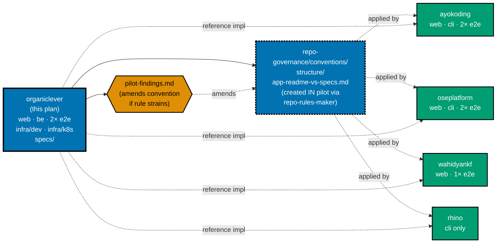

# OrganicLever — Standardize Specs Folder, Thin App READMEs, C4-Aware Spec Tree (Pilot)

**Status**: In Progress
**Owner**: Wahidyan Kresna Fridayoka
**Started**: 2026-05-09
**Scope**: `ose-public` only — `apps/organiclever-web/`, `apps/organiclever-be/`, `apps/organiclever-web-e2e/`, `apps/organiclever-be-e2e/`, `apps/rhino-cli/` (path-constant + test-fixture updates only), `infra/dev/organiclever/`, `infra/k8s/organiclever/` (incl. `staging/` and `production/`), and `specs/apps/organiclever/` (full reorg)
**Pilot**: This is the **pilot** for a repository-wide standardization. The pattern proven here (thin app READMEs + canonical `specs/apps/<app>/` docs) will be rolled out to `ayokoding`, `oseplatform`, `wahidyankf`, and `rhino` (CLI) in follow-up plans. See [§Pilot Outcome and Rollout](#pilot-outcome-and-rollout).
**Subrepo worktree**: REQUIRED — Scope A per the parent repo's Subrepo Worktree Workflow Convention. Run delivery from inside the existing `worktrees/ddd/` worktree (or another `ose-public` worktree). Publish path: **direct-to-main** (Trunk Based Development default for `ose-public`).

## Goal

Three coupled outcomes, all shipped in this pilot:

1. **Thin app/infra READMEs** — every `apps/organiclever-*/README.md` and `infra/{dev,k8s}/organiclever/**/README.md` reduced to dev-runtime essentials only
2. **Canonical, PM-readable `specs/apps/organiclever/`** — single home for behavior, architecture, domain, deployment, and contract narrative
3. **C4-aware spec tree shape** — `specs/apps/organiclever/` reorganized to a stable, long-run-defensible layout with five top-level folders: `product/` `system-context/` `containers/` `components/` `behavior/`. The tree honors Simon Brown's C4 model where C4 fits and adds top-levels for cross-cutting kinds that don't fit C4 (product narrative, behavioral Gherkin)

Cross-link such that any reader landing in an app README finds their way to `specs/` for the "what does this thing do?" answers without duplication.

**Audience for `specs/apps/organiclever/`** — engineers AND **Technical Product/Project Managers** (TPMs). Throughout this plan, "PM" / "TPM" always refers to a TPM with **software-engineering background** — concretely, the kind of TPM who would be embedded with a developer-tools team (e.g., a TPM for VS Code at Microsoft, a TPM for a database product, a TPM for a developer SDK). Such a reader has shipped software, reads code fluently, and recognizes mainstream tooling: TypeScript, Next.js, Postgres, Docker, REST APIs, OpenAPI, build pipelines, CI/CD, IndexedDB, finite state machines, Architecture Decision Records, lockfiles, and DDD as a concept. **Glossing is reserved for genuinely niche choices this product makes**: F# / Giraffe (uncommon backend stack), PGlite (very new in-browser Postgres), Effect TS (uncommon TypeScript effect library), XState (state-machine library — gloss for safety since not universal), and DDD-applied vocabulary (bounded context, aggregate, ubiquitous language). Mainstream SWE vocabulary is gloss-free. Concepts always lead with intent ("what user problem this solves") before mechanism ("how the code is shaped"). The audience constraint shapes the structure of every new specs/ file in this plan.

Treat this plan as a **pilot for the whole repo**. The split rule, target tree, content-mapping table, cross-link strategy, and PM-readability contract must generalize cleanly — anything that only works because OrganicLever is unusual (DDD-shaped, local-first) belongs in tech-docs as an "OrganicLever-specific note", not in the rule itself.

This is a documentation reorganization — no behavior change, no code change, no Nx target change. Tests are the safety net only for link integrity and DDD enforcement (which already runs in `test:quick`).

## Why now

The DDD adoption plan ([2026-05-03\_\_organiclever-adopt-ddd](../../done/2026-05-03__organiclever-adopt-ddd/README.md)) established `specs/apps/organiclever/ddd/` as the home of the bounded-context registry and ubiquitous-language glossaries. The ddd-namespace restructure plan finished moving the registry path. But:

- `apps/organiclever-web/README.md` (301 lines) duplicates routes/screens/architecture that already live (or should live) in `specs/`
- `apps/organiclever-web/docs/explanation/bounded-context-map.md` (287 lines) — the canonical BC map — is orphaned in the app's `docs/` tree, separated from the YAML registry and glossaries it pairs with
- `apps/organiclever-be/README.md` and the two e2e READMEs duplicate behavior/contract narrative that should live next to the Gherkin specs

Today is the cheapest moment to consolidate before further drift.

## Scope

**In scope:**

- **Reorganize `specs/apps/organiclever/`** to the five-folder C4-aware tree: `product/`, `system-context/`, `containers/`, `components/`, `behavior/`. All existing files (`be/`, `web/`, `ddd/`, `c4/`, `contracts/`) move into their new homes via `git mv`
- **Update specs validator agents + workflow** to enforce the new tree shape: `.claude/agents/specs-checker.md`, `specs-fixer.md`, `specs-maker.md`, `repo-governance/workflows/specs/specs-quality-gate.md` — all updated by `repo-rules-maker`. Adds spec-vs-app drift detection per FR-13 (e.g., routes spec vs Next.js routes). OpenCode mirrors synced
- **New rhino-cli `specs` subcommands** for deterministic offload (FR-14): `validate-tree`, `validate-counts`, `validate-links`, `validate-adoption`, `drift-routes`, `drift-endpoints`, `drift-contracts`. Implemented in Go for speed; agents shell out via Bash. Each subcommand has Gherkin specs + ≥90% coverage
- Move `apps/organiclever-web/docs/explanation/bounded-context-map.md` → `specs/apps/organiclever/components/web/ddd/bounded-context-map.md` (final tree position)
- Trim `apps/organiclever-web/README.md` to dev-runtime sections only
- Trim `apps/organiclever-be/README.md` to dev-runtime sections only
- Trim `apps/organiclever-web-e2e/README.md` and `apps/organiclever-be-e2e/README.md` to dev-runtime sections only
- Verify and minimally trim `infra/dev/organiclever/README.md` and `infra/k8s/organiclever/README.md` (and `staging/`, `production/` placeholders) — these are already short but must keep ONLY dev-runtime / Docker Compose / kubectl content; deployment topology narrative moves to specs/
- Create new `specs/apps/organiclever/` files at their final tree positions: `product/overview.md`, `containers/deployment.md`, `components/be/api.md`, `components/web/architecture.md`, `components/web/design-system.md`, `components/web/routes-and-screens.md`
- **Deepen ubiquitous-language glossary files (FR-16)**: replace the compact 1-line table cells in each `components/web/ddd/ubiquitous-language/<bc>.md` (9 files) with per-term `### Term: <name>` H3 sections containing definition paragraphs, why-this-term explanations, code-identifier paths, persisted-as info, used-in-features cross-links, forbidden-synonyms-with-reason, and related cross-links. Term names, code identifiers, and forbidden synonyms preserved byte-identical (the canonical contract does not change — only the depth of explanation grows). Append authoring rule 6 to the index README requiring per-term H3 detail. Lands as a separate commit in Phase 2.5
- **Mermaid diagrams in specs/ where appropriate (FR-17)**: add per-term Mermaid diagrams in ubiquitous-language glossaries for marquee terms (`JournalEvent` lifecycle, `Typed payload` hierarchy, `Routine` aggregate composition, `WorkoutSession` FSM, `Projection` data flow, `AppMachine` state machine) AND in NEW Phase 3 files where a diagram clarifies faster than prose. Color-blind-safe palette (Blue `#0173B2`, Teal `#029E73`, Orange `#DE8F05`, Gray `#808080`). Every diagram preceded by a one-sentence "what this shows" intro. Diagrams that mirror runtime artefacts (XState machines) MUST match the runtime — drift treated as a finding
- **Update tooling for new paths**: `apps/rhino-cli/internal/bcregistry/loader.go` path constant; `bcregistry/validator.go` and `glossary/validator.go` File: error-message paths; `apps/rhino-cli/cmd/ddd_bc_test.go`, `ddd_ul_test.go`, integration test fixtures; all 16 step files in `apps/organiclever-web/test/unit/steps/**/*.steps.tsx` (path.resolve calls); `apps/organiclever-web/project.json` Nx cache inputs; `apps/organiclever-be/project.json`, `apps/organiclever-web-e2e/project.json`, `apps/organiclever-be-e2e/project.json` cache inputs and `spec-coverage` commands
- Update every inbound cross-link to the moved/redirected content
- Delete the now-empty `apps/organiclever-web/docs/explanation/` folder if no other files remain
- Capture but do NOT fix the stale Spring/Java references in `infra/k8s/organiclever/{staging,production}/README.md` (organiclever-be is F#/Giraffe, not Spring) — log as a `pilot-findings.md` entry for a separate fix plan

**Out of scope:**

- New AI agents, new workflows
- Changes to `bounded-contexts.yaml` REGISTRY CONTENT or Gherkin feature CONTENT (file paths/locations DO change as part of the reorg, but the contents inside are unchanged). Glossary files are explicitly OUT of this restriction — the canonical vocabulary (term names, code identifiers, forbidden synonyms) is preserved byte-identical, but the per-term depth of explanation grows substantially per FR-16
- Behavior or feature changes to TS/F# application code
- Adding new Nx targets (existing targets get path updates only)
- Reorganizing other apps' specs folders (`ayokoding`, `oseplatform`, `wahidyankf`, `rhino`) — pattern is set but applied in follow-up rollout plans

## Pilot rollout sequence

The diagram below shows where this plan sits in a repo-wide standardization sequence. This pilot is the first node; the four follow-ups (one per remaining app family) inherit the pattern proven here. The final node promotes the pattern to a governance convention.

## Documents

- **[brd.md](./brd.md)** — Business rationale: why thin app READMEs + canonical specs/ docs reduce duplication and rot
- **[prd.md](./prd.md)** — Product requirements with Gherkin acceptance criteria
- **[tech-docs.md](./tech-docs.md)** — Content-split mapping table, target trees, cross-link strategy
- **[delivery.md](./delivery.md)** — Step-by-step delivery checklist with verification gates

## Acceptance criteria summary

1. Every `apps/organiclever-*/README.md` contains only dev-runtime sections (Quick Start, Nx commands, env vars, project layout, tech-stack pinning) and a "Behavior & Architecture" section that links to `specs/apps/organiclever/`
2. `specs/apps/organiclever/` is reorganized to the five-folder C4-aware tree (`product/`, `system-context/`, `containers/`, `components/`, `behavior/`); all existing content moved via `git mv`; no orphans
3. `apps/organiclever-web/docs/explanation/bounded-context-map.md` is removed and lives at `specs/apps/organiclever/components/web/ddd/bounded-context-map.md`; every inbound link rewritten
4. All four `apps/organiclever-*/README.md` files are ≤ 120 lines after the trim
5. All Nx targets pass against the new tree paths: `nx run organiclever-web:test:quick`, `nx run organiclever-be:test:quick`, `nx run organiclever-web-e2e:test:quick`, `nx run organiclever-be-e2e:test:quick`, `nx run rhino-cli:test:quick` (incl. integration), `npm run lint:md`
6. Every new file under `specs/apps/organiclever/` opens with an "Audience" line and a "Plain-language summary" paragraph; technical terms are glossed on first use within each file
7. `specs/apps/organiclever/README.md` includes a "For Product/Project Managers" reading-path section calibrated for SWE-background TPMs (and as a starting point any non-engineering reader can follow with help)
8. `infra/dev/organiclever/` and `infra/k8s/organiclever/` READMEs contain only dev-runtime / Docker Compose / kubectl content; deployment topology lives in `specs/apps/organiclever/containers/deployment.md`
9. `repo-governance/conventions/structure/app-readme-vs-specs.md` exists (single combined doc covering content-split rule + spec-tree-shape rule + PM-Readability Contract); created via `repo-rules-maker` delegation
10. `repo-governance/conventions/structure/specs-directory-structure.md` is REWRITTEN (not just cross-linked) to define the new C4-aware tree shape as the repo-wide spec organization standard; done via `repo-rules-maker`
11. `repo-rules-checker` reports zero violations of the new conventions against the pilot artifacts; rhino-cli compile+test pass against new spec paths
12. New rhino-cli `specs` subcommands exist (validate-tree, validate-counts, validate-links, validate-adoption, drift-routes, drift-endpoints, drift-contracts), each with Gherkin specs at `specs/apps/rhino/behavior/cli/gherkin/specs/` and ≥90% Go test coverage
13. Every per-bounded-context `components/web/ddd/ubiquitous-language/<bc>.md` file (9 files) carries a `## Term index` jump table and a `## Terms in detail` section with one `### Term: <name>` H3 per term, each containing a definition paragraph, a "why this term" line, code-identifier path(s), used-in-features cross-link, and per-term forbidden synonyms with reasons (FR-16). Term names, code identifiers, and forbidden synonyms remain byte-identical to pre-deepening; `rhino-cli ddd ul organiclever` passes against the deepened files
14. Marquee terms in the deepened ubiquitous-language files carry Mermaid diagrams (FR-17): `JournalEvent` lifecycle, `Typed payload` variant hierarchy, `Routine` aggregate composition, `WorkoutSession` FSM mirroring the XState machine, `Projection` cross-context sequence, `AppMachine` state diagram. Every Mermaid block is preceded by a one-sentence intro and uses the color-blind-safe palette. Diagrams that mirror runtime artefacts match the runtime
15. `specs-quality-gate` workflow enforces the new tree shape, BDD/DDD/Contracts adoption gaps, AND spec-vs-app drift detection — all using existing `lax/normal/strict/ocd` modes
16. Push to `origin main` happens only after the FR-15 gate matrix exits 0 across every related Nx target, and post-push GitHub Actions CI workflows complete with conclusion `success`

See [prd.md](./prd.md) for the full Gherkin acceptance scenarios.

## Pilot Outcome and Rollout

After this plan closes, three outputs feed the repo-wide rollout:

1. **New repo-wide convention** — `repo-governance/conventions/structure/app-readme-vs-specs.md`. Created IN this pilot (not deferred) by delegating to `repo-rules-maker`. The convention codifies the Content Split Rule + PM-Readability Contract from [tech-docs.md](./tech-docs.md). Marked `Status: Pilot — initial issue` in its own frontmatter so future readers know it was born from this plan and refined as the rollout progresses. See [§Governance Propagation](./tech-docs.md#governance-propagation) for the full file list.
2. **Updates to related governance docs** — `specs-directory-structure.md`, the structure-conventions index, and `readme-quality.md` cross-link to the new convention. Done via `repo-rules-maker`.
3. **Per-app follow-up plans** — separate plans under `plans/backlog/` for each remaining app family. Each follow-up plan APPLIES the new convention (no longer drafts it) and cites this pilot as the reference implementation:
   - `ayokoding` (web + cli + 2 e2e)
   - `oseplatform` (web + cli + 2 e2e)
   - `wahidyankf` (web + 1 e2e)
   - `rhino` (cli only)

**Pilot success signal**: a contributor unfamiliar with the repo can answer "what does organiclever-web do?" by reading `specs/apps/organiclever/README.md` alone, and "how do I run it locally?" by reading `apps/organiclever-web/README.md` alone — neither file should require the other to be useful. `repo-rules-checker` finds zero violations of the new convention against `apps/organiclever-*/` and `infra/{dev,k8s}/organiclever/`.

**Pilot failure signal**: if executing this plan reveals a section of content that fits in neither place cleanly, that finding is captured in a `pilot-findings.md` appended to this plan folder before archival; the new convention is amended in the same plan (not deferred), and the rollout plans inherit the amended rule.

## Related

- [Specs Directory Structure Convention](../../../repo-governance/conventions/structure/specs-directory-structure.md)
- [DDD adoption plan (done)](../../done/2026-05-03__organiclever-adopt-ddd/README.md)
- [organiclever-web developing-content skill](../../../.claude/skills/apps-organiclever-web-developing-content/SKILL.md)
- [Plans Organization Convention](../../../repo-governance/conventions/structure/plans.md)
