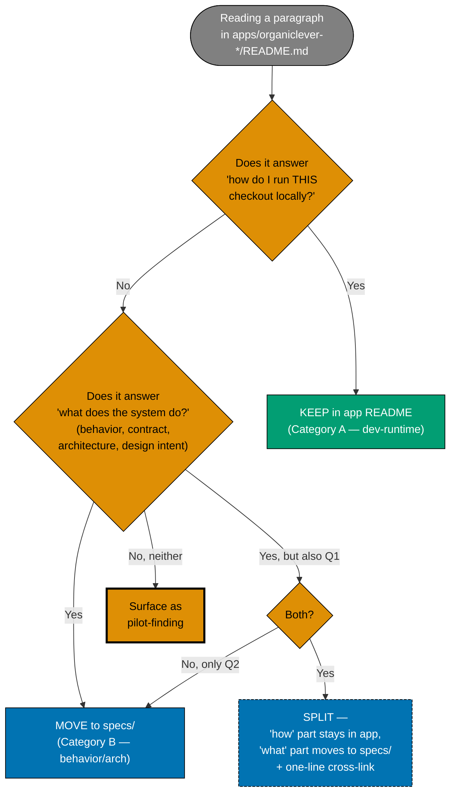

# Tech Docs — OrganicLever Specs Standardization (Pilot)

## Audience

Whoever executes this plan, and whoever runs the rollout for `ayokoding` / `oseplatform` / `wahidyankf` / `rhino` afterward. This document is the reference implementation.

The output of this plan — `specs/apps/organiclever/` — has a different audience: **engineers AND Technical Product/Project Managers (TPMs) with software-engineering background** — concretely, the kind of TPM embedded with a developer-tools team (a VS Code TPM, a database-product TPM, an SDK TPM). Has shipped software, reads code fluently, recognizes mainstream tooling (TypeScript, Next.js, Postgres, Docker, REST, OpenAPI, FSM, IndexedDB, ADR, DDD-as-concept). Does NOT necessarily know this product's niche stack (F#/Giraffe, PGlite, Effect TS, XState) or DDD-applied vocabulary (bounded context, aggregate, ubiquitous language). Throughout this tech-docs file (and the rest of the plan), the abbreviations "PM" and "TPM" both refer to this SWE-background TPM persona — never a non-technical PM. PM-readability is a hard constraint on every file written under `specs/`. See [§PM-Readability Contract](#pm-readability-contract) below.

## High-level shape (before / after)

```mermaid
%% Color palette: Blue #0173B2 | Orange #DE8F05 | Teal #029E73 | Gray #808080
%% Wong palette, WCAG AA contrast
flowchart LR
    subgraph Before["BEFORE — content drift + flat-root spec tree"]
        direction TB
        appWebBefore["apps/organiclever-web/README.md<br/>301 lines"]:::heavy
        appBeBefore["apps/organiclever-be/README.md<br/>110 lines"]:::heavy
        bcMapBefore["apps/organiclever-web/docs/<br/>explanation/bounded-context-map.md<br/>orphan"]:::heavy
        specsBefore["specs/apps/organiclever/<br/>flat root: be/ web/ ddd/ c4/ contracts/<br/>(mixed orgs axes)"]:::heavy
    end

    subgraph After["AFTER — thin app READMEs + C4-aware spec tree"]
        direction TB
        appWebAfter["apps/organiclever-web/README.md<br/>≤ 120 lines · dev-runtime only"]:::light
        appBeAfter["apps/organiclever-be/README.md<br/>≤ 120 lines · dev-runtime only"]:::light
        specsAfter["specs/apps/organiclever/<br/>──────────────────────<br/>product/         (PM-first)<br/>system-context/  (C4 L1)<br/>containers/      (C4 L2 + contracts/ + deployment.md)<br/>components/      (C4 L3 incl. ddd/)<br/>behavior/        (Gherkin, cross-cutting)"]:::canonical
    end

    Before -.->|"trim READMEs<br/>+ git mv specs/<br/>+ rhino-cli paths<br/>+ Nx cache inputs"| After

    classDef heavy fill:#DE8F05,stroke:#000,color:#000,stroke-width:2px
    classDef light fill:#029E73,stroke:#000,color:#FFF,stroke-width:2px
    classDef canonical fill:#0173B2,stroke:#000,color:#FFF,stroke-width:3px
```



## Decision flow — which side does this content belong on?



## Content Split Rule

The single rule that governs every move in this plan, and that must generalize to all other apps in the rollout.

### The rule

Each piece of content in an app's README belongs to exactly one of two categories:

**A. Dev-runtime (stays in `apps/<app>/README.md`)**

Content a developer needs to run, build, test, or lint THIS specific checkout on THEIR machine. It is intrinsically about the filesystem layout of the app folder and the Nx targets defined by its `project.json`.

**B. Behavior, contract, or architecture (moves to `specs/apps/<app-family>/`)**

Content that describes WHAT the system does — what URLs it exposes, what user flows exist, what API endpoints, what bounded contexts, what design decisions, what integration points. This content is platform-agnostic and survives even if the app were rewritten in a different framework.

### Mapping table — Category A (stays in app README)

| Content                                                    | Why it stays                                                                 |
| ---------------------------------------------------------- | ---------------------------------------------------------------------------- |
| One-paragraph "what is this" intro                         | Reader orientation                                                           |
| Status banner (pre-alpha, etc.)                            | Visible warning at app entry point                                           |
| Quick Start commands                                       | Setting up dev server is THIS-checkout-specific                              |
| Nx targets table (`nx dev`, `nx build`, `nx run X:test:Y`) | Targets are defined in `project.json` of THIS app                            |
| Environment variables consumed at runtime                  | Wire-level, depends on which env file the app reads                          |
| Project layout (top-level `src/`, `tests/`, configs)       | Filesystem of THIS checkout — but only top-level, not per-context recursion  |
| Tech-stack version pinning                                 | "I'm running Node 24.13.1, Next.js 16, F# .NET 10" — version source-of-truth |
| One paragraph + link to `specs/` for behavior              | The pointer that completes the split                                         |

### Mapping table — Category B (moves to specs/)

| Content                                                                 | Destination                                                                 |
| ----------------------------------------------------------------------- | --------------------------------------------------------------------------- |
| Routes table (URLs the app serves)                                      | `specs/apps/<app-family>/web/routes-and-screens.md`                         |
| Screens table (user-visible pages and what they do)                     | `specs/apps/<app-family>/web/routes-and-screens.md`                         |
| Entry-flow tables (FAB sub-flows etc.)                                  | `specs/apps/<app-family>/web/routes-and-screens.md`                         |
| Diagnostic page state table                                             | `specs/apps/<app-family>/web/routes-and-screens.md` (under "System status") |
| Bounded-context project layout (full `src/contexts/<bc>/...` recursion) | `specs/apps/<app-family>/web/architecture.md`                               |
| Layer rules (`domain` ← no imports, etc.)                               | `specs/apps/<app-family>/web/architecture.md`                               |
| Dormant code listing (`backend-client*.ts` etc.)                        | `specs/apps/<app-family>/web/architecture.md`                               |
| Bounded-context map narrative + diagram                                 | `specs/apps/<app-family>/ddd/bounded-context-map.md`                        |
| Design system palette / fonts / dark-mode / token import                | `specs/apps/<app-family>/web/design-system.md`                              |
| Component variant catalog (Button variants, Alert variants, etc.)       | `specs/apps/<app-family>/web/design-system.md`                              |
| API endpoints table                                                     | `specs/apps/<app-family>/be/api.md`                                         |
| Backend architecture diagram (DI, project tree)                         | `specs/apps/<app-family>/be/api.md`                                         |
| Backend testing strategy table (BDD/coverage tier mapping)              | `specs/apps/<app-family>/be/api.md`                                         |
| E2E architecture (bddgen pipeline, feature → spec → test flow)          | `specs/apps/<app-family>/{web,be}/gherkin/README.md` (already lives there)  |

### How to apply the rule

For each section in an existing app README, ask three questions in order:

1. **Does the section answer "how do I run THIS checkout?"** → Category A, keep
2. **Does the section answer "what does THIS app do (regardless of where the code lives)?"** → Category B, move
3. **Both?** → Split the section. The "what" part moves; a one-line "see specs/..." stays in the app README

The rule is unambiguous when applied paragraph-by-paragraph. If a paragraph genuinely fits both, the bias is **toward moving** — the app README must stay thin.

## PM-Readability Contract

Every NEW or MOVED file under `specs/apps/organiclever/` must be readable by a **SWE-background Technical Product/Project Manager** — concretely, the kind of TPM embedded with a developer-tools team (a VS Code TPM, a database-product TPM, an SDK TPM). The TPM has shipped software, reads code fluently, and recognizes mainstream tooling. The contract is calibrated to **gloss only the genuinely niche** — over-glossing mainstream SWE vocabulary is patronizing noise. Specifically:

- **No gloss needed** (the SWE-background TPM already knows): TypeScript, Next.js, React, Postgres, Docker, Kubernetes, REST, OpenAPI, IndexedDB, FSM (finite state machine), CI/CD, ADR, build pipelines, lockfiles, version pinning, Volta, npm, ESLint, Mermaid, Playwright, Vercel, DDD-as-concept
- **Gloss on first use within each file** (genuinely niche to this product): F#, Giraffe, PGlite, Effect TS, XState, and DDD-applied vocabulary (bounded context, aggregate, ubiquitous language)

The contract is NOT calibrated to a non-technical PM. Six rules apply:

### Required header block (first 10 lines after H1)

Every spec file starts with:

```markdown
# <Title>

> **Audience**: Engineers, Technical Product/Project Managers
>
> **Plain-language summary**: <one paragraph free of jargon for the niche
> stack choices (F#/Giraffe, PGlite, Effect TS, XState) and DDD-applied
> vocabulary (bounded context, aggregate, ubiquitous language); mainstream
> SWE vocabulary is fine. A SWE-background TPM should be able to form a
> working mental model on first read.>

## <First section heading>

...
```

### Rule 1 — Intent before mechanism

Every section leads with **what the feature/component enables for the user** (1-2 sentences) before describing **how the code is shaped**. A SWE-background TPM should be able to read the first paragraph of any section and walk away knowing the user-facing point.

```markdown
<!-- BAD — opens with mechanism -->

## Journal Context

The journal context owns the `JournalEvent` aggregate and exposes
`appendEvent`, `bumpEvent`, and `listEvents` use-cases via PGlite store.

<!-- GOOD — opens with intent -->

## Journal Context

The journal records every life-event the user logs (workouts, meals, reading,
focus sessions). It is OrganicLever's "system of record" — every other feature
either writes events here or reads from here. The user can review history,
re-log past activities, and see streak progress because this context exists.

Under the hood the context owns the `JournalEvent` aggregate and exposes
three use-cases (`appendEvent`, `bumpEvent`, `listEvents`) backed by an
in-browser PGlite (Postgres-WASM, IndexedDB-backed) store.
```

### Rule 2 — Glossary on first use, scoped narrowly

The first occurrence of each **niche project-specific framework name** or **DDD-applied term** in a file carries a parenthetical or footnote-style plain-language gloss. Subsequent uses in the same file are gloss-free. **Mainstream SWE vocabulary the SWE-background TPM already knows does NOT need glossing** — over-glossing is patronizing noise. The list below is exhaustive; do not gloss anything not on this list.

| Term                                                                     | Gloss to use on first occurrence                                                                                                     |
| ------------------------------------------------------------------------ | ------------------------------------------------------------------------------------------------------------------------------------ |
| DDD (when first introducing the OrganicLever-specific application of it) | Domain-Driven Design — here applied as one bounded context per UI screen domain                                                      |
| bounded context                                                          | a self-contained slice of the app with its own vocabulary, types, and rules; contexts communicate only through narrow published APIs |
| aggregate                                                                | a cluster of domain objects treated as one consistent unit by writes                                                                 |
| ubiquitous language                                                      | the shared vocabulary used by both the team and the code for one bounded context                                                     |
| PGlite                                                                   | Postgres-WASM — Postgres compiled to WebAssembly running directly in the browser, persisted via IndexedDB                            |
| XState                                                                   | a JavaScript/TypeScript state-machine library used here for UI flow orchestration                                                    |
| Effect TS                                                                | a TypeScript library for typed effect composition, used in the infrastructure layer                                                  |
| F#                                                                       | functional .NET language used for the OrganicLever backend                                                                           |
| Giraffe                                                                  | F# web framework on top of ASP.NET Core, used for the OrganicLever HTTP API                                                          |

**Do NOT gloss** (mainstream — the SWE-background TPM already knows): TypeScript, JavaScript, Next.js, React, Node.js, Postgres, Docker, Kubernetes, REST, HTTP, JSON, YAML, OpenAPI, IndexedDB, FSM, finite state machine, CI, CD, CI/CD, ADR, Architecture Decision Record, build pipeline, lockfile, version pinning, Volta, npm, ESLint, Prettier, Mermaid, Playwright, Vercel, monorepo, Nx.

### Rule 3 — Tables over prose where possible

Routes, screens, endpoints, environment variables, and feature lists are presented as tables. SWE-background TPMs scan tables faster than they parse prose.

### Rule 4 — Code blocks are introduced

Every code/Mermaid block is preceded by a one-sentence "what this shows" introduction. A SWE-background TPM can read the block, but the intro lets them decide whether to. (They can read TypeScript and Mermaid fluently; the intro is about scanning velocity, not comprehension.)

### Rule 5 — Plain language in summary lines

The H1-immediately-following summary paragraph contains zero un-glossed niche project-specific framework names (F#/Giraffe, PGlite, Effect TS, XState) and zero un-glossed DDD-applied vocabulary (bounded context, aggregate, ubiquitous language). Mainstream SWE vocabulary (TypeScript, Next.js, Postgres, REST, OpenAPI, etc.) is fine. Save the niche detail for later sections; the summary is for everyone in the dual audience.

### Rule 6 — Link forward to deep engineering depth

When a section necessarily needs hands-on engineering depth even for a SWE-background TPM (e.g., DDD layer rules with ESLint boundaries enforcement, Effect Layer composition with tagged errors, XState `fromPromise` actor wiring), the section opens with a one-line "TPMs can skim this section — it's about how engineers prevent code drift, and pre-supposes hands-on familiarity with the niche stack" cue and links forward to a deeper subsection or external doc.

## Ubiquitous Language file depth

The PM-Readability Contract above (Rule 2 in particular) governs in-prose glossing — brief parenthetical notes when a niche term first appears in a narrative file. The dedicated Ubiquitous Language glossary files (`specs/apps/organiclever/components/web/ddd/ubiquitous-language/<bc>.md`) are different — they are the **canonical contract of the bounded context** and are consulted as reference, not skimmed as narrative. They MUST go deeper.

**The current shape (pre-deepening)**: each per-bounded-context file uses a compact table — Term | Definition (1 line) | Code identifier(s) | Used in features. This is fine as a pointer index but does not explain the term's role, the distinction it draws, or the design intent.

**The required shape (post-deepening, FR-16)**:

```text
# Ubiquitous Language — <bc>

**Bounded context**: `<bc>`
**Maintainer**: <team>
**Last reviewed**: <YYYY-MM-DD>

## One-line summary

(retained from pre-deepening — single paragraph)

## Term index

(scannable jump table; Definition column REMOVED — moved to detailed sections)

| Term            | Code identifier(s)                  | Used in features                        |
| --------------- | ----------------------------------- | --------------------------------------- |
| `JournalEvent`  | `JournalEvent` (TS type)            | `journal/journal-mechanism.feature`     |
| ...             | ...                                 | ...                                     |

## Terms in detail

### Term: `JournalEvent`

A single, append-only record of something the user did. Carries a typed payload
(workout, reading, meal, focus, learning), a `createdAt` timestamp set at
insertion, and an `updatedAt` timestamp that starts equal to `createdAt` and
only changes on bump operations.

**Why this term exists**: distinguishes the persistent record from in-memory
views, queue messages, and UI list items. Users see "entries"; code persists
`JournalEvent`s. The `stats` context derives aggregate views from these events
but never mutates them in place.

**Code identifier(s)**: `JournalEvent` — `apps/organiclever-web/src/contexts/journal/domain/types.ts`

**Persisted as**: PGlite table `journal_events`, schema in
`apps/organiclever-web/src/contexts/journal/infrastructure/schema.sql`

**Used in features**: `journal/journal-mechanism.feature`

**Forbidden synonyms in this context**:
- `Aggregate` — owned by `stats` for derived rollups; using it for an event
  would mask the read-vs-write boundary
- `Entry` — UI label only; using it in code or specs would conflate
  presentation with persistence

**Related**:
- ADR `apps/organiclever-web/docs/explanation/bounded-context-map.md` § journal
- Schema `apps/organiclever-web/src/contexts/journal/infrastructure/schema.sql`
- Neighbouring context: `stats` (consumes events; never mutates)

### Term: `Typed payload`
...
```

**Required fields per H3 section** (from FR-16):

1. Definition paragraph — 1-3 sentences, what the term IS and what role it plays
2. **Why this term exists** — 1-2 sentences explaining the distinction the term draws
3. **Code identifier(s)** — fully-qualified path or type name
4. **Persisted as / produced by** — schema table, queue topic, etc. (omit if not applicable, do NOT carry as `N/A`)
5. **Used in features** — Gherkin feature paths
6. **Forbidden synonyms in this context** — per-term, with reason
7. **Related** — bullet list of cross-links (ADRs, schema files, neighbouring contexts)

**Constraint preservation**: term names, code identifiers, forbidden synonyms are byte-identical between pre-deepening and post-deepening. Only depth of explanation grows. `rhino-cli ddd ul organiclever` MUST keep parsing the term index table without modification.

**Length**: no upper cap. Lower bound: enough depth to disambiguate the term from its synonyms. Empty fields are omitted, not stubbed.

**README.md addendum**: the `ubiquitous-language/README.md` index gains a new authoring rule (rule 6, appended — existing 5 rules retained verbatim) requiring per-term H3 detail, with `journal.md` named as the canonical example.

### Per-term Mermaid diagrams (FR-17)

Some terms benefit from a diagram more than from extra prose. The H3 section gains an OPTIONAL `**Diagram**:` field between the definition paragraph and the `Code identifier(s):` line. The field is one-sentence intro + Mermaid block. Omit when prose is clearer (most nouns and value objects do not need a diagram). Empty stubs are forbidden.

**Worked example: `JournalEvent` lifecycle (`journal.md`)**:

````text
### Term: `JournalEvent`

A single, append-only record of something the user did. ...

**Diagram**: lifecycle of a `JournalEvent` from creation through optional bumps —
the payload and `createdAt` are immutable; only `updatedAt` changes on bump.

​```mermaid
%% Color palette: Blue #0173B2 | Teal #029E73 | Orange #DE8F05
stateDiagram-v2
    [*] --> Created: append(payload)
    Created: createdAt = updatedAt = now
    Created --> Bumped: bump()
    Bumped: updatedAt = now (payload, createdAt unchanged)
    Bumped --> Bumped: bump() (idempotent re-touch)
    Bumped --> [*]: (records never delete in v0)
    Created --> [*]
​```

**Code identifier(s)**: `JournalEvent` — `apps/organiclever-web/src/contexts/journal/domain/types.ts`

(... rest of H3 section ...)
````

**Worked example: `Typed payload` hierarchy (`journal.md`)**:

````text
### Term: `Typed payload`

The structured body of a `JournalEvent`. ...

**Diagram**: payload variants in v0 — extensible via the `typed-payloads` schema.

​```mermaid
classDiagram
    class EntryPayload {
        <<sealed union>>
        +type: "workout" | "reading" | "meal" | "focus" | "learning"
    }
    class WorkoutPayload {
        +type: "workout"
        +routineId: RoutineId
        +sets: SetEntry[]
    }
    class ReadingPayload {
        +type: "reading"
        +bookId: string
        +pages: number
    }
    EntryPayload <|-- WorkoutPayload
    EntryPayload <|-- ReadingPayload
​```

(... rest of H3 section ...)
````

**Worked example: `WorkoutSession` FSM (`workout-session.md`)**:

````text
### Term: `WorkoutSession`

The active workout in progress, modelled as an XState machine ...

**Diagram**: workout-session state machine — mirrors the actual XState definition
in `apps/organiclever-web/src/contexts/workout-session/application/workout-session-machine.ts`.
Drift between this diagram and the machine is treated as a finding (FR-17).

​```mermaid
stateDiagram-v2
    [*] --> idle
    idle --> running: START_SET
    running --> resting: COMPLETE_SET
    resting --> running: NEXT_SET
    running --> finishing: FINISH_REQUESTED
    resting --> finishing: FINISH_REQUESTED
    finishing --> finished: CONFIRM_FINISH
    finishing --> running: RESUME
    finished --> [*]: PERSIST_TO_JOURNAL
​```

(... rest of H3 section ...)
````

**Worked example: `Routine` aggregate composition (`routine.md`)**:

````text
### Term: `Routine`

A planned, ordered sequence of exercises ...

**Diagram**: aggregate composition — Routine is the aggregate root; ExerciseSlot
and Exercise are not addressed independently from outside the aggregate.

​```mermaid
classDiagram
    class Routine {
        <<aggregate root>>
        +id: RoutineId
        +name: string
        +slots: ExerciseSlot[]
    }
    class ExerciseSlot {
        +order: number
        +exerciseId: ExerciseId
        +sets: SetTarget[]
    }
    class Exercise {
        +id: ExerciseId
        +name: string
        +muscleGroup: string
    }
    Routine "1" *-- "1..N" ExerciseSlot : ordered
    ExerciseSlot "1" --> "1" Exercise : references
​```

(... rest of H3 section ...)
````

**Worked example: `Projection` data flow (`stats.md`)**:

````text
### Term: `Projection`

A read-only derived view ...

**Diagram**: append-then-project flow — `journal` is the system of record;
`stats` projections refresh on every event append, never write back.

​```mermaid
sequenceDiagram
    autonumber
    actor User
    participant UI as UI (presentation)
    participant Use as journal use-case
    participant DB as PGlite (journal_events)
    participant Stat as stats projection
    User->>UI: log workout
    UI->>Use: appendEntry(workoutPayload)
    Use->>DB: INSERT INTO journal_events
    DB-->>Use: row
    Use->>Stat: notify(append)
    Stat->>DB: SELECT aggregate
    DB-->>Stat: rows
    Stat-->>UI: refreshed projection
    UI-->>User: rendered StatCard
​```

(... rest of H3 section ...)
````

**Diagram type cheat-sheet**:

| Topic                         | Mermaid type      | Why this type                                                           |
| ----------------------------- | ----------------- | ----------------------------------------------------------------------- |
| Lifecycle / FSM               | `stateDiagram-v2` | States and transitions are first-class; reads cleanly                   |
| Variant family / sealed union | `classDiagram`    | Inheritance and field shape both visible                                |
| Aggregate composition         | `classDiagram`    | Composition (`*--`) and reference (`-->`) arrows are explicit           |
| Cross-context / async flow    | `sequenceDiagram` | Time axis makes the order of writes vs reads obvious                    |
| Hierarchy / tree              | `flowchart TD`    | Top-down with simple boxes; faster than classDiagram for pure structure |
| Network / relationship        | `flowchart LR`    | Left-right reads as "from → to"; good for context maps                  |

**Anti-patterns**:

- Diagram that restates a markdown table → either keep the table (preferred for scannable reference) or keep the diagram with strictly more information; never both
- Decorative state diagram on a term that has only one state → the prose "is always present" reads faster
- Diagram with red/green color pairs → fails color-blind accessibility; use the repo palette (Blue / Teal / Orange / Gray)
- Diagram with no preceding intro sentence → violates PM-Readability Rule 4 and FR-17

## OrganicLever-specific notes

These are observations specific to this pilot; they do NOT modify the rule, but flag context for the executor.

- **`organiclever-be` README is already short (110 lines).** Its trim mostly removes the inline architecture diagram and API endpoints table. The dev-runtime portion is already in good shape.
- **`organiclever-web` is the heavy case.** Its 301-line README is the main test of the rule.
- **The `Status: Pre-Alpha` banner** is a runtime-relevant warning to anyone running the app — it stays in the app README.
- **`organiclever-web/docs/explanation/`** has only one inhabitant (`bounded-context-map.md`). Once moved, the directory should be removed entirely.
- **The dormant BE integration code listing** (paths under `src/contexts/health/infrastructure/`) is architectural narrative — moves to `specs/apps/organiclever/components/web/architecture.md`. A reader trying to figure out "what does the health context contain in this codebase?" can find it via the `specs/` link.

## Target Tree

After delivery, the relevant trees look like this:

```
apps/organiclever-web/
├── README.md                       # ≤ 120 lines, thin
├── project.json
├── src/
│   └── ... (unchanged)
├── test/
│   └── ... (unchanged)
└── (apps/organiclever-web/docs/   ← REMOVED)

apps/organiclever-be/
├── README.md                       # ≤ 120 lines, thin
├── project.json
└── src/, tests/, ... (unchanged)

apps/organiclever-web-e2e/
└── README.md                       # ≤ 120 lines, thin

apps/organiclever-be-e2e/
└── README.md                       # ≤ 120 lines, thin

infra/dev/organiclever/
├── README.md                       # ≤ 60 lines — Docker Compose runtime only
├── docker-compose.yml              # unchanged
├── docker-compose.ci.yml           # unchanged
├── Dockerfile.be.dev               # unchanged
├── Dockerfile.fe.dev               # unchanged
├── .env.example                    # unchanged
└── .gitignore                      # unchanged

infra/k8s/organiclever/
├── README.md                       # ≤ 60 lines — kubectl runtime only
├── staging/
│   └── README.md                   # ≤ 30 lines — placeholder note + link to specs/
└── production/
    └── README.md                   # ≤ 30 lines — placeholder note + link to specs/

specs/apps/organiclever/
├── README.md                       # updated — adds For Product/Project Managers reading path
├── product/                        # NEW top-level (PM-first; not a C4 level)
│   ├── README.md
│   └── overview.md                 # plain-language v0 product summary, personas, primary flows
├── system-context/                 # C4 L1
│   ├── README.md
│   └── context.md                  # git mv from c4/context.md
├── containers/                     # C4 L2
│   ├── README.md
│   ├── container.md                # git mv from c4/container.md
│   ├── contracts/                  # git mv from contracts/ (entire subtree)
│   │   ├── README.md
│   │   ├── openapi.yaml
│   │   ├── project.json
│   │   ├── .spectral.yaml
│   │   ├── paths/
│   │   ├── schemas/
│   │   └── generated/
│   └── deployment.md               # NEW — envs, images, profile mapping
├── components/                     # C4 L3
│   ├── README.md
│   ├── be/
│   │   ├── README.md               # consolidates current be/README.md + be/gherkin/README.md narrative
│   │   ├── component-be.md         # git mv from c4/component-be.md
│   │   └── api.md                  # NEW
│   └── web/
│       ├── README.md               # consolidates current web/README.md
│       ├── component-web.md        # git mv from c4/component-web.md (with link rewrites)
│       ├── architecture.md         # NEW
│       ├── design-system.md        # NEW
│       ├── routes-and-screens.md   # NEW
│       └── ddd/                    # bounded contexts ARE C4 L3 components — natural home
│           ├── README.md           # git mv from ddd/README.md (with link rewrites)
│           ├── bounded-contexts.yaml  # git mv (CONTENT unchanged; only path)
│           ├── bounded-context-map.md # git mv from apps/organiclever-web/docs/explanation/
│           └── ubiquitous-language/   # git mv from ddd/ubiquitous-language/
│               ├── README.md
│               └── *.md
└── behavior/                       # NEW top-level (cross-cutting Gherkin)
    ├── README.md
    ├── be/
    │   └── gherkin/                # git mv from be/gherkin/
    │       ├── README.md
    │       └── health/health-check.feature
    └── web/
        └── gherkin/                # git mv from web/gherkin/
            ├── README.md
            └── (all 16 features under their domain folders, unchanged)
```

## Spec Tree Shape Rationale

The five top-level folders aren't arbitrary; each maps to a specific reader question that other layouts confused.

| Folder            | Reader question it answers                                 | Why a top-level (not nested)                                                                                                         |
| ----------------- | ---------------------------------------------------------- | ------------------------------------------------------------------------------------------------------------------------------------ |
| `product/`        | "What does this product do for the user? What's in v0?"    | PM-first content. Not architecture (so not under `system-context/`). Not behavior (so not under `behavior/`). Deserves its own home. |
| `system-context/` | "What's the system boundary? Who/what interacts with it?"  | C4 L1 — Simon Brown's canonical L1                                                                                                   |
| `containers/`     | "What runtime processes exist? What are their boundaries?" | C4 L2 — naturally hosts API contracts (boundary specs) and deployment topology                                                       |
| `components/`     | "What's inside each container?"                            | C4 L3. Bounded contexts ARE components, so DDD lives here naturally                                                                  |
| `behavior/`       | "Does the system actually do what the specs say?"          | Gherkin tests behavior at every C4 level — orthogonal to zoom hierarchy. Forcing it under one C4 level would lie about its scope.    |

### Why no separate `architecture/` folder

The "architecture" of a system IS the C4 view across L1/L2/L3. A separate `architecture/` would either duplicate content or fragment it. The C4 levels collectively serve as the architecture documentation.

### Why bounded contexts under `components/web/ddd/`

A bounded context is, in C4 terms, exactly a Component (L3). The DDD registry, glossaries, and BC map are all describing components inside the web container. Placing `ddd/` flat at the root would either (a) force readers to jump between root `ddd/` and root `c4/component-web.md` to understand the same thing, or (b) misleadingly suggest that DDD is its own architecture-level concept on par with C4. Neither is desirable.

### Variants for non-OrganicLever apps

| App profile                  | What populates                                                                           | What's empty/omitted                               |
| ---------------------------- | ---------------------------------------------------------------------------------------- | -------------------------------------------------- |
| Web-only (e.g. `wahidyankf`) | `product/`, `system-context/`, `containers/`, `components/web/`, `behavior/web/gherkin/` | `containers/contracts/` (no API), `components/be/` |
| CLI-only (e.g. `rhino`)      | `product/`, `system-context/`, `containers/`, `components/cli/`, `behavior/cli/gherkin/` | `components/{be,web}/`, `containers/contracts/`    |
| Multi-CLI (e.g. `ayokoding`) | Adds `components/cli/` + `behavior/cli/gherkin/` alongside web/be                        | Nothing — same shape, more populated               |

### What the new convention says about creation

- New apps create only the folders they need (don't pre-create empty `behavior/` if there are no Gherkin specs yet)
- Once a folder exists, it carries a `README.md` index pointing at its children
- The order of folders in any README that lists them matches the canonical order: `product/`, `system-context/`, `containers/`, `components/`, `behavior/`

## Spec-vs-App Drift Detection (FR-13)

The `specs-quality-gate` workflow gains drift detection — comparing specs to current app code and either fixing or flagging mismatches. Drift is a category of finding inside the existing `lax|normal|strict|ocd` modes, NOT a separate workflow or mode.

### Drift inventory (organiclever pilot)

| Drift case                                                                       | Detection method                                 | Action                  |
| -------------------------------------------------------------------------------- | ------------------------------------------------ | ----------------------- |
| README count mismatch (claims N scenarios but file count differs)                | `rhino-cli specs validate-counts <folder>` (NEW) | Auto-fix the README     |
| Routes/screens spec out of sync with `apps/organiclever-web/src/app/**/page.tsx` | `rhino-cli specs drift-routes <app>` (NEW)       | Auto-fix the table      |
| Endpoint spec out of sync with F# handler attributes                             | `rhino-cli specs drift-endpoints <app>` (NEW)    | Auto-fix the table      |
| `containers/contracts/openapi.yaml` paths out of sync with handler attributes    | `rhino-cli specs drift-contracts <app>` (NEW)    | Flag only (intentional) |
| Adoption gap (FR-10): app missing BDD/DDD/Contracts where convention says SHOULD | `rhino-cli specs validate-adoption <app>` (NEW)  | Flag only (decision)    |
| Tree-shape violation (FR-9): top-level not the canonical 5                       | `rhino-cli specs validate-tree <app>` (NEW)      | Flag only (decision)    |
| Bounded-context registry out of sync with `src/contexts/`                        | `rhino-cli ddd bc <app>` (existing)              | Flag (existing)         |
| Glossary code-identifiers stale                                                  | `rhino-cli ddd ul <app>` (existing)              | Flag (existing)         |

### Reasoning split: deterministic vs LLM

| Type           | Owner          | Examples                                                                                                                   |
| -------------- | -------------- | -------------------------------------------------------------------------------------------------------------------------- |
| Deterministic  | rhino-cli (Go) | Counting `.feature` files, comparing string lists, walking the filesystem, parsing YAML/JSON, regex-matching F# attributes |
| LLM (semantic) | specs-checker  | "Does this scenario describe the same behavior?", terminology drift, narrative coherence, BC map prose accuracy            |

The split is documented in each Validation Category of the updated `specs-checker.md`. Categories tagged `[Deterministic]` shell out to `rhino-cli`; categories tagged `[LLM]` keep current LLM-driven reasoning.

### Why this is fast and cheap

- A typical specs-quality-gate run today reads dozens of files, parses Gherkin, counts scenarios, walks links — all in LLM context. That's tokens × file count.
- Same work in Go: filesystem walk + parse + diff in milliseconds. Zero LLM tokens.
- LLM stays focused on what only LLMs can do — semantic and narrative judgments.

Performance target (for executor sanity check): full specs-quality-gate run against `specs/apps/organiclever/` should complete deterministic checks in < 30 s and total wall time including LLM checks in < 2 min.

## rhino-cli Specs Subcommands (FR-14 — implementation detail)

New subcommands under `apps/rhino-cli/cmd/specs_*.go`. Pattern matches the existing `ddd bc` / `ddd ul` family.

```
rhino-cli specs validate-tree <app>          # Tree shape compliance (FR-9)
rhino-cli specs validate-counts <folder>     # README count audit
rhino-cli specs validate-links <folder>      # Markdown link integrity
rhino-cli specs validate-adoption <app>      # BDD/DDD/Contracts adoption gap (FR-10)
rhino-cli specs drift-routes <app>           # Next.js routes vs routes-and-screens.md
rhino-cli specs drift-endpoints <app>        # F# handlers vs api.md
rhino-cli specs drift-contracts <app>        # F# handlers vs openapi.yaml paths
```

### Output format (JSONL)

One JSON object per line:

```json
{"category": "tree-shape", "criticality": "HIGH", "file": "specs/apps/foo", "evidence": "Top-level folder 'be' exists; expected one of {product,system-context,containers,components,behavior}", "expected": "Migrate to C4-aware tree per app-readme-vs-specs.md"}
{"category": "count", "criticality": "MEDIUM", "file": "specs/apps/foo/behavior/web/gherkin/README.md", "evidence": "Claims 3 scenarios; actual count 5", "expected": "Update count to 5 OR add scenarios to match"}
```

Both specs-checker and specs-fixer parse JSONL via standard Go `encoding/json` line-decoder.

### Test strategy

- Each subcommand has a Gherkin spec at `specs/apps/rhino/behavior/cli/gherkin/specs/<subcmd>.feature`
- Step implementations (godog) at both `test:unit` (mocked I/O) and `test:integration` (real fixtures) levels
- Coverage threshold ≥90% per Go CLI standard

### Phase ordering (delivery)

`rhino-cli` subcommands are implemented in a NEW Phase 6.5 (between governance and skill mirror sync), AFTER the new convention exists (so the rules being checked are codified) but BEFORE the final verification (so the new commands run as part of FR-15 gate).

## rhino-cli Path Strategy

`bcregistry/loader.go` currently has the path constant:

```go
path := filepath.Join(repoRoot, "specs", "apps", app, "ddd", "bounded-contexts.yaml")
```

Two strategies considered:

**Strategy A — hard-code the new path** (chosen)

```go
path := filepath.Join(repoRoot, "specs", "apps", app, "components", "web", "ddd", "bounded-contexts.yaml")
```

Pros: simplest change, single line. Cons: assumes web is the only container hosting DDD. For future apps with backend DDD (multiple containers), this breaks.

**Strategy B — discover by walking** (deferred)

```go
// Walk specs/apps/<app>/components/*/ddd/bounded-contexts.yaml
// Collect all matches; warn if multiple, error if zero
```

Pros: scales to multi-container DDD apps. Cons: more code, more tests.

**Decision**: ship Strategy A in this plan. Strategy B becomes a separate plan when a second container needs DDD (currently only `organiclever-web` has DDD adoption; `organiclever-be` does not; future BE adoption is a separate plan that introduces Strategy B).

This decision goes into `pilot-findings.md` so the rollouts know the constraint.

## Cross-Link Update Strategy

The reorg produces TWO classes of link updates:

**Class A — BC map references** (8 known inbound; relative paths recompute under the new tree):

| Source file (after reorg, with new path)                                   | Old target ref                                                  | New target (relative)                                                                    |
| -------------------------------------------------------------------------- | --------------------------------------------------------------- | ---------------------------------------------------------------------------------------- |
| `specs/apps/organiclever/components/web/ddd/ubiquitous-language/README.md` | `apps/organiclever-web/docs/explanation/bounded-context-map.md` | `../bounded-context-map.md`                                                              |
| `specs/apps/organiclever/components/web/ddd/README.md`                     | same                                                            | `./bounded-context-map.md`                                                               |
| `specs/apps/organiclever/behavior/web/gherkin/README.md`                   | same                                                            | `../../../components/web/ddd/bounded-context-map.md`                                     |
| `specs/apps/organiclever/components/web/README.md`                         | same                                                            | `./ddd/bounded-context-map.md`                                                           |
| `specs/apps/organiclever/components/web/component-web.md`                  | same                                                            | `./ddd/bounded-context-map.md`                                                           |
| `.claude/skills/apps-organiclever-web-developing-content/SKILL.md`         | same                                                            | `../../specs/apps/organiclever/components/web/ddd/bounded-context-map.md` (verify depth) |

**Class B — old subfolder path references** (much larger; touches code, configs, step files):

| Old path pattern                                                                                 | New path pattern                                                              |
| ------------------------------------------------------------------------------------------------ | ----------------------------------------------------------------------------- |
| `specs/apps/organiclever/be/gherkin/`                                                            | `specs/apps/organiclever/behavior/be/gherkin/`                                |
| `specs/apps/organiclever/web/gherkin/`                                                           | `specs/apps/organiclever/behavior/web/gherkin/`                               |
| `specs/apps/organiclever/ddd/bounded-contexts.yaml`                                              | `specs/apps/organiclever/components/web/ddd/bounded-contexts.yaml`            |
| `specs/apps/organiclever/ddd/ubiquitous-language/`                                               | `specs/apps/organiclever/components/web/ddd/ubiquitous-language/`             |
| `specs/apps/organiclever/contracts/generated/openapi-bundled.yaml`                               | `specs/apps/organiclever/containers/contracts/generated/openapi-bundled.yaml` |
| `specs/apps/organiclever/c4/{context,container,component-be,component-web}.md`                   | new tree positions per Target Tree                                            |
| `specs/apps/organiclever/web/`, `/be/`, `/ddd/`, `/c4/`, `/contracts/` (any flat-root reference) | corresponding new path                                                        |

Files known to need Class B updates (full list in [PRD FR-3b](./prd.md#fr-3b-tooling-and-code-path-updates)). Targeted `sed` per file is safest; broad sed across the worktree risks false matches in plans/done/ (frozen).

### Verification

After each commit, run all relevant probes:

```bash
# Confirm zero BC-map stragglers
rg "apps/organiclever-web/docs/explanation/bounded-context-map" \
  --glob '!plans/done/**' --glob '!generated-reports/**' --glob '!node_modules/**'

# Confirm zero old-spec-path stragglers (Class B)
rg "specs/apps/organiclever/(be|web|ddd|c4|contracts)/" \
  --glob '!plans/done/**' --glob '!generated-reports/**' --glob '!node_modules/**'
# Note: SOME hits are expected during in-progress phases — final commit MUST show zero

# Confirm the link checker is happy
npm run lint:md

# Confirm tests pass at every level after path-update commit
nx run organiclever-web:test:quick --skip-nx-cache
nx run organiclever-be:test:quick --skip-nx-cache
nx run rhino-cli:test:quick --skip-nx-cache
nx run rhino-cli:test:integration --skip-nx-cache
```

## Governance Propagation

The plan creates one new governance convention and updates three existing files. All four edits are delegated to the `repo-rules-maker` agent so the convention follows the repo's governance standards (Diátaxis structure, Convention Writing Convention, Documentation First principle).

### Files in scope

| Path                                                                    | Operation | Owner agent                     | Purpose                                                                                                                                         |
| ----------------------------------------------------------------------- | --------- | ------------------------------- | ----------------------------------------------------------------------------------------------------------------------------------------------- |
| `governance/conventions/structure/app-readme-vs-specs.md`               | CREATE    | repo-rules-maker                | ONE combined convention: Content Split Rule + Spec Tree Shape + PM-Readability Contract + BDD/DDD/Contracts Adoption                            |
| `governance/conventions/structure/specs-directory-structure.md`         | REWRITE   | repo-rules-maker                | Replace the current flat-root be/web/cli/build-tools layout with the new C4-aware five-folder tree                                              |
| `governance/conventions/structure/README.md`                            | UPDATE    | repo-rules-maker                | Add new convention to "Documents" list; update the description of `specs-directory-structure.md`                                                |
| `governance/conventions/writing/readme-quality.md`                      | UPDATE    | repo-rules-maker                | Cross-link statement: app/infra READMEs governed by `app-readme-vs-specs.md`                                                                    |
| `.claude/agents/specs-checker.md`                                       | UPDATE    | repo-rules-maker                | Amend Cat 1 (READMEs at all 5 top-level folders + per-surface). Replace Cat 8 (flat-root → C4-aware). Add Cat 9 (Adoption Gaps) per FR-10       |
| `.claude/agents/specs-fixer.md`                                         | UPDATE    | repo-rules-maker                | Auto-fix list gains: scaffold missing top-level / per-surface READMEs from template. Adoption gaps go to Requires Review (not auto-fix)         |
| `.claude/agents/specs-maker.md`                                         | UPDATE    | repo-rules-maker                | Scaffolding template REPLACED — emit canonical 5-folder tree (per-surface variants) when caller targets `specs/apps/<new-app>/`                 |
| `governance/workflows/specs/specs-quality-gate.md`                      | UPDATE    | repo-rules-maker                | Validation Dimensions table gains Spec Tree Shape (amended Cat 8) and Adoption Gaps (Cat 9) rows. Update Iteration Example to show new findings |
| `.opencode/agents/specs-checker.md`, `specs-fixer.md`, `specs-maker.md` | SYNC      | npm run sync:claude-to-opencode | Mirror `.claude/` updates after `repo-rules-maker` finishes                                                                                     |

### Skeleton for `app-readme-vs-specs.md` (combined convention)

```markdown
---
title: "App README vs Specs Convention"
description: Defines what content lives in app/infra READMEs vs specs/, the C4-aware five-folder spec tree shape, and the PM-readability contract for specs/.
category: explanation
subcategory: conventions
status: "Pilot — initial issue"
tags:
  - conventions
  - readme
  - specs
  - spec-tree-shape
  - pm-readability
  - c4
created: 2026-05-09
---

# App README vs Specs Convention

## Purpose

…why the split exists, why dual-audience matters, why C4-aware tree shape is the long-run choice…

## Standards

### Standard 1 — Content Split Rule (Category A vs Category B)

…Category A (stays in app/infra README) vs Category B (moves to specs/)…
(reproduces the Mapping Tables from tech-docs.md)

### Standard 2 — Forbidden / Required sections in app READMEs

…allow-list of `## ` headings, forbidden content list…

### Standard 3 — Length budget

…app/infra README line-count caps…

### Standard 4 — Spec Tree Shape (C4-aware five-folder layout)

…the five top-level folders (`product/`, `system-context/`, `containers/`, `components/`, `behavior/`)
with their purposes and rationale. Includes the per-surface variant table for full-stack /
web-only / CLI-only / multi-CLI apps. Includes "what populates" guidance — apps create only
folders they need…

### Standard 5 — PM-Readability Contract for specs/

…six rules: header block, intent-before-mechanism, glossary on first use,
tables-over-prose, code-block intros, link-forward-to-engineering-depth…

### Standard 6 — BDD/DDD/Contracts Adoption (FR-10)

…non-CLI apps SHOULD adopt all three. CLI: BDD required, DDD optional/deferred, Contracts NOT APPLICABLE.
…validation hooks at HIGH/MEDIUM levels per FR-10.
…rollout mapping table for organiclever / ayokoding / oseplatform / wahidyankf / rhino.

### Standard 7 — Cross-link integrity

…app README points at specs/, specs/ files point back at related specs/ siblings…

## Examples

### Before/after — app README trim

(annotated diff fragments)

### Before/after — PM-readable specs/ file header

(audience block + glossary on first use)

### Before/after — spec tree migration

(flat-root → C4-aware tree mapping table; for migrating existing specs/apps/<app>/)

## Validation

…how `repo-rules-checker` enforces this convention; specifies the regex/heuristics
for forbidden headings, the line-count cap rule, the glossary-on-first-use audit,
and the spec-tree-shape audit (top-level folder names)…

## Refinement log

(empty on initial issue; reserved for amendments surfaced by rollouts)

## Related

- [Specs Directory Structure Convention](./specs-directory-structure.md) — describes the canonical five-folder tree in detail
- [README Quality Convention](../writing/readme-quality.md) — README writing quality complement
- [DDD adoption plan (done)](../../../plans/done/2026-05-03__organiclever-adopt-ddd/README.md)
- [organiclever-specs-standardization plan (pilot)](…)
```

### Update specifications

**`specs-directory-structure.md`** — REWRITE. The current doc prescribes the flat-root `be/`/`web/`/`cli/`/`build-tools/` pattern. After rewrite it MUST:

- Define the canonical five-folder C4-aware tree (`product/`, `system-context/`, `containers/`, `components/`, `behavior/`) as the only valid layout for new apps under `specs/apps/`
- Document the per-surface variants (web-only, CLI-only, multi-CLI, full-stack) — same shape, different folders populated
- Document the migration path (flat-root → C4-aware) for any existing specs subtree
- Cross-link to `app-readme-vs-specs.md` as the source-of-truth combined convention
- Include the dual-audience (eng + PM/PdM) note carried over from `app-readme-vs-specs.md`'s PM-Readability Contract

**`governance/conventions/structure/README.md`** — insert the new convention into the alphabetical-by-link-text "Documents" list with a single-line description: `[App README vs Specs Convention](./app-readme-vs-specs.md) - …`.

**`governance/conventions/writing/readme-quality.md`** — add a `### Scope vs structural conventions` subsection clarifying: "this convention governs README quality (clarity, voice, scannability); structural placement of content (what belongs in app README vs specs/) is governed by [App README vs Specs Convention](../structure/app-readme-vs-specs.md)."

### Why repo-rules-maker, not direct edits

- The Convention Writing Convention prescribes specific section ordering (Purpose / Standards / Examples / Validation / Related) — the agent is the source of truth for that template
- Cross-link symmetry — when a new convention adds a link to an existing doc, the existing doc gets a return link. repo-rules-maker handles both sides; humans tend to forget the return link
- Frontmatter and tags follow the same template across all conventions; the agent enforces consistency
- The maker-checker-fixer pattern: making this rule via repo-rules-maker means `repo-rules-checker` can validate it against pilot artifacts in the same plan, closing the loop

### Validation gate after governance propagation

After repo-rules-maker completes its delegation, the executor MUST run:

```bash
# Confirm convention well-formed
nx run rhino-cli:test:quick   # rhino-cli has linting checks for governance docs

# Confirm no governance contradictions / orphan links
# (delegate to repo-rules-checker — output to generated-reports/)
```

If `repo-rules-checker` finds violations in the pilot artifacts that the new convention does not yet describe, two paths:

1. The violation is genuine — fix the pilot artifact
2. The convention's description is incomplete — amend the convention via repo-rules-maker, log the amendment in the convention's `## Refinement log`, write `pilot-findings.md` summarising the amendment

## Risk and Mitigation

| Risk                                                                       | Likelihood | Mitigation                                                                                                                                              |
| -------------------------------------------------------------------------- | ---------- | ------------------------------------------------------------------------------------------------------------------------------------------------------- |
| Broken link inside the moved BC map (its own internal `../../../` paths)   | Medium     | After `git mv`, deliberately walk every link in the moved file; the file goes one level deeper into `specs/` than it was, so adjustments are systematic |
| Discovery pass missed an inbound link                                      | Low        | After-the-fact rg with `--glob '!plans/done/**'` is the safety net; failure mode is "stale link" not "broken behavior"                                  |
| Markdown table extracted to specs loses formatting                         | Low        | `git mv` + edit preserves text; tables are simple                                                                                                       |
| Rule does not generalize to bilingual `ayokoding-web` or CLI-only `rhino`  | Medium     | Pilot success signal explicitly tests the rule on those shapes via §Pilot Outcome; if it fails, we capture in `pilot-findings.md`                       |
| `apps-organiclever-web-developing-content` skill embeds duplicated content | Low        | Skill body is checked separately; expected to need only the BC map path update                                                                          |

## Commit Strategy

The plan is split into ~22 commits. Critical ordering: **rhino-cli code path constants update + spec tree `git mv` ship in ONE commit** so tests don't break in between.

1. `docs(specs): create five-folder tree top-level READMEs (no content move)`
2. `refactor(specs+rhino-cli): git mv old subfolders into new tree + update rhino-cli + Nx + step file paths in one shot`
3. `docs(specs): create components/web/architecture.md`
4. `docs(specs): create components/web/routes-and-screens.md`
5. `docs(specs): create components/web/design-system.md`
6. `docs(specs): move bounded-context-map.md into components/web/ddd/`
7. `docs(specs): create components/be/api.md`
8. `docs(specs): create containers/deployment.md`
9. `docs(specs): create product/overview.md`
10. `docs(apps): trim organiclever-web README to dev-runtime`
11. `docs(apps): trim organiclever-be README to dev-runtime`
12. `docs(apps): trim organiclever-web-e2e README to dev-runtime`
13. `docs(apps): trim organiclever-be-e2e README to dev-runtime`
14. `docs(infra): trim organiclever infra READMEs to runtime-only`
15. `docs(governance): create app-readme-vs-specs + rewrite specs-directory-structure via repo-rules-maker`
16. `docs(governance): update specs-checker/fixer/maker agents + specs-quality-gate workflow via repo-rules-maker`
17. `feat(rhino-cli): add specs validate-tree/validate-counts/validate-links/validate-adoption + Gherkin specs`
18. `feat(rhino-cli): add specs drift-routes/drift-endpoints/drift-contracts + Gherkin specs`
19. `chore(sync): npm run sync:claude-to-opencode (mirrors specs agents + skill updates)`
20. `docs(plans): pilot-findings.md (Spring/Java references, Strategy A choice, any §8.6 amendments)`
21. (CI verification gate — no commit; gh run list confirmation)
22. `docs(plans): archive organiclever-specs-standardization to plans/done/`

Each commit independently leaves the repo passing `npm run lint:md` + relevant `test:quick`. Commit 2 is the atomic reorg. Commits 15-16 are governance via repo-rules-maker. Commits 17-18 are new rhino-cli subcommands (TDD: Gherkin spec → step impl → command). Commit 19 syncs OpenCode mirrors. Commit 20 captures pilot findings. Commit 22 archives. The push to origin main happens AFTER commit 22, only when the FR-15 gate matrix is fully green.

If any commit needs to be split further during execution, that is acceptable — but the order must be preserved (specs additions before app trims).
