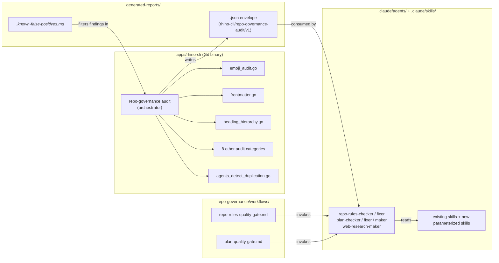
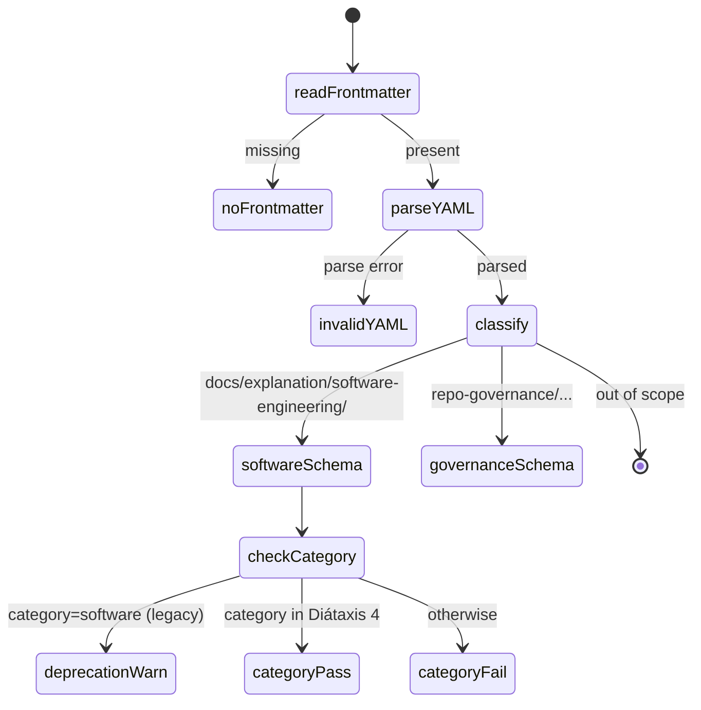
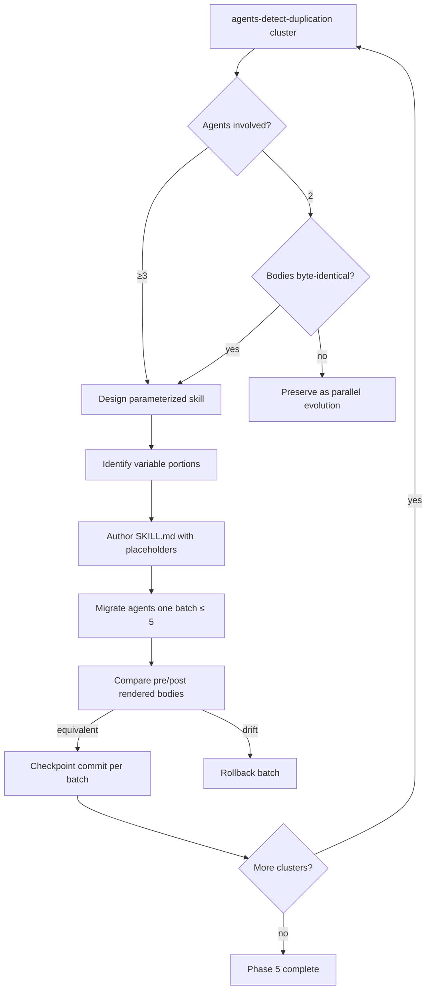

# Technical Documentation — Complete Repo-Rules Zero Findings

## Architecture Overview

This plan does not introduce new architecture — it calibrates and hardens the existing rhino-cli + workflow + agent + skill system. The system shape after this plan is identical to before; the noise floor drops to zero.



[Repo-grounded] Diagram nodes verified against `apps/rhino-cli/internal/repo-governance/`, `apps/rhino-cli/cmd/`, `.claude/agents/`, and `.claude/skills/`.

## Phase 0 — Worktree Provisioning + Baseline Capture

### Design

User has waived runtime worktree provisioning ("do it in this current branch, no need in separate worktree"). The plan declares the worktree per the Plans Organization Convention (so `plan-checker`'s worktree gate passes) with an explicit N/A note in `delivery.md` documenting the waiver.

Baseline capture pins `RHINO_AUDIT_NOW=2026-05-12T12:00:00Z` to enable hash-reuse verification later. The captured JSON is parsed for per-category counts and recorded in `delivery.md` as a structured note.

### Files Impacted

| File                                                              | Type       | Change                                                                         |
| ----------------------------------------------------------------- | ---------- | ------------------------------------------------------------------------------ |
| `plans/in-progress/complete-repo-rules-zero-findings/delivery.md` | edit       | Phase 0 baseline notes block populated with actual per-category finding counts |
| `/tmp/baseline.json`                                              | new (temp) | Baseline `AuditEnvelope` JSON, retained for Phase 6 comparison                 |

### Rollback

Phase 0 produces no source-tree changes; rollback is a no-op.

## Phase 1 — Calibrate rhino-cli Audits

### Design

#### Phase 1.1 — emoji-audit skip-dirs

The `emojiSkipDirs` map at `apps/rhino-cli/internal/repo-governance/emoji_audit.go:56-68` [Repo-grounded] currently lists 11 entries (`.next` is already present at line 59 and must not be added again). Phase 1.1 adds `archived`, `test-results`, `playwright-report`, `coverage`, `.venv`, `.dart_tool`, `out`, `.cache`, `__pycache__`, `.pytest_cache` (10 new entries) plus any `generated*` variants discovered via `Glob`. Each addition has a one-line rationale comment in the source.

Unit-test coverage (in `emoji_audit_test.go`) gains assertions that each new entry is skipped during the walk. Integration coverage (in `governance_emoji_audit.integration_test.go`) gains a synthetic `archived/test.py` fixture producing zero findings.

#### Phase 1.2 — Diátaxis frontmatter schema

The current `validateSoftwareSchema` at `apps/rhino-cli/internal/docs/frontmatter.go:240-290` [Repo-grounded] hardcodes the rule `category must equal "software"`. The replacement accepts the four Diátaxis values (`tutorial`, `how-to`, `reference`, `explanation`) and emits a `warn` severity deprecation finding for the legacy `software` value.

Implementation: introduce a `validCategories` set (4 strings); change the equality check to set membership; if the value is `software`, emit a new `kindCategoryDeprecated` warn finding instead of a `kindWrongCategoryValue` fail finding. Add a feature scenario covering each of the four Diátaxis values plus the legacy-deprecation case.



[Repo-grounded] State derived from current `frontmatter.go` flow.

#### Phase 1.3 — N-fence support in heading hierarchy

The current `isFenceLine` / `fenceMarkerOf` at `apps/rhino-cli/internal/docs/heading_hierarchy.go:182-199` [Repo-grounded] checks only `HasPrefix(s, "```")` or `HasPrefix(s, "~~~")` — fence length is ignored. A 4-backtick fence opening containing 3-backtick samples is incorrectly closed by the first inner 3-backtick line.

Replacement implementation tracks fence length:

```text
fenceState := { open: bool, char: rune, length: int }
on fence-like line:
  count leading consecutive fence chars (` or ~)
  if not open:
    require count >= 3; set open=true; record char + length
  else:
    require same char AND count >= length to close
```

Scenarios in `docs_validate_heading_hierarchy_test.go` cover 3-fence (existing), 4-fence (new), 5-fence (new), and mixed-char (3-backtick inside 4-tilde) cases.

#### Phase 1.4 — Orchestrator `--exclude` propagation

`apps/rhino-cli/cmd/governance_audit.go` [Repo-grounded — file confirmed via Read above] currently exposes `--skip` and `--include-category`. Phase 1.4 adds a repeatable `--exclude <glob>` flag.

`AuditOptions` (defined at `apps/rhino-cli/internal/repo-governance/audit_orchestrator.go:58-90` [Repo-grounded]) gains a new field:

```go
type AuditOptions struct {
    // ... existing fields ...
    // ExcludeGlobs are filepath.Match patterns applied per-category to omit
    // matching paths from the scan. Each entry is matched against paths
    // relative to RepoRoot.
    ExcludeGlobs []string
}
```

Categories that support path scanning (emoji, frontmatter, heading-hierarchy, readme-index, license, traceability) consult the glob list before recording a finding. Categories that operate on fixed schemas (agents-md-size, agents-detect-duplication, layer-coherence) ignore the field.

#### Phase 1.5 — `RHINO_AUDIT_NOW` documentation

Already-implemented behavior (see `governance_audit.go:88-93` [Repo-grounded — the env var is consumed via `os.Getenv("RHINO_AUDIT_NOW")`]). Phase 1.5 surfaces it in `apps/rhino-cli/README.md` Command section (under `repo-governance audit`) and in the v0.16.1 Version History entry.

#### Phase 1.6 — Version bump

`apps/rhino-cli/cmd/root.go:27` [Repo-grounded] currently reads `Version: "0.16.0"`. Phase 1.6 changes to `Version: "0.16.1"` and adds a v0.16.1 entry to the Version History block in `apps/rhino-cli/README.md` summarizing FR-1 through FR-5.

#### Phase 1.7 — Re-capture baseline

Re-run the preflight after Phase 1 lands. Document new per-category counts in `delivery.md` Phase 1 notes block. Target: ≤1000 findings total; if higher, investigate before proceeding.

#### Phase 1.8 — Checkpoint commit

Commit subject: `fix(rhino-cli): calibrate governance audits for production signal`. Push to `origin/main`. Verify CI green before Phase 2.

### Files Impacted

| File                                                                            | Type | Change                                                          |
| ------------------------------------------------------------------------------- | ---- | --------------------------------------------------------------- |
| `apps/rhino-cli/internal/repo-governance/emoji_audit.go`                        | edit | Expand `emojiSkipDirs` map                                      |
| `apps/rhino-cli/internal/repo-governance/emoji_audit_test.go`                   | edit | Add unit assertions                                             |
| `apps/rhino-cli/cmd/governance_emoji_audit.integration_test.go`                 | edit | Add archived-fixture scenarios                                  |
| `apps/rhino-cli/internal/docs/frontmatter.go`                                   | edit | Diátaxis schema + deprecation warn                              |
| `apps/rhino-cli/internal/docs/frontmatter_test.go`                              | edit | Cover four Diátaxis values + deprecation                        |
| `apps/rhino-cli/cmd/docs_validate_frontmatter.integration_test.go`              | edit | Integration scenarios                                           |
| `apps/rhino-cli/internal/docs/heading_hierarchy.go`                             | edit | N-fence tracking                                                |
| `apps/rhino-cli/internal/docs/heading_hierarchy_test.go`                        | edit | 3/4/5-fence + mixed-char scenarios                              |
| `apps/rhino-cli/cmd/docs_validate_heading_hierarchy.integration_test.go`        | edit | Integration scenarios                                           |
| `apps/rhino-cli/cmd/governance_audit.go`                                        | edit | Add `--exclude` flag                                            |
| `apps/rhino-cli/cmd/governance_audit_test.go`                                   | edit | Flag-parsing unit tests                                         |
| `apps/rhino-cli/cmd/governance_audit.integration_test.go`                       | edit | End-to-end exclusion behavior                                   |
| `apps/rhino-cli/internal/repo-governance/audit_orchestrator.go`                 | edit | `ExcludeGlobs []string` field + per-category plumbing           |
| `apps/rhino-cli/internal/repo-governance/audit_orchestrator_test.go`            | edit | Unit tests for the new field                                    |
| `apps/rhino-cli/cmd/root.go`                                                    | edit | `Version: "0.16.1"`                                             |
| `apps/rhino-cli/README.md`                                                      | edit | v0.16.1 Version History + `RHINO_AUDIT_NOW` Command-section doc |
| `specs/apps/rhino/behavior/cli/gherkin/repo-governance-emoji-audit.feature`     | edit | New scenarios for skip-dirs                                     |
| `specs/apps/rhino/behavior/cli/gherkin/docs-validate-frontmatter.feature`       | edit | New scenarios for Diátaxis                                      |
| `specs/apps/rhino/behavior/cli/gherkin/docs-validate-heading-hierarchy.feature` | edit | New scenarios for N-fence                                       |
| `specs/apps/rhino/behavior/cli/gherkin/repo-governance-audit.feature`           | edit | New scenarios for `--exclude`                                   |

Spec file paths use the flat kebab-case naming convention confirmed in the repo. [Repo-grounded — all four files verified at `specs/apps/rhino/behavior/cli/gherkin/`]

### Rollback

Phase 1 lands as one checkpoint commit. Rollback: `git revert <sha>`. The rhino-cli binary returns to the v0.16.0 behavior; no schema or wire-format changes.

## Phase 2 — Harden `repo-rules-quality-gate.md`

### Design

Twenty-four edits to the workflow file, each targeting an issue observed in production use. The first 11 (2.1-2.11) catalogue the originally-named gaps; the additional 13 (2.12-2.24) catalogue gaps surfaced by a second-pass ultra-hard review of the workflow doc end-to-end:

| ID   | Issue                                                                                                                | Edit                                                                                                                                |
| ---- | -------------------------------------------------------------------------------------------------------------------- | ----------------------------------------------------------------------------------------------------------------------------------- |
| 2.1  | Broken nx command produces malformed JSON envelope                                                                   | Replace nx-wrapped form with direct-binary form: `./apps/rhino-cli/dist/rhino-cli repo-governance audit -o json > <path>`           |
| 2.2  | Step 2 ambiguity makes thousands of HIGH preflight findings count against threshold                                  | Add explicit rule: deterministic findings are visibility-only; managed via skip-list; do not count toward mode threshold            |
| 2.3  | Hash-reuse never fires because `time.Now()` differs each run                                                         | Document `RHINO_AUDIT_NOW=<RFC3339>` recommendation in Step 0.5                                                                     |
| 2.4  | Arg-name inconsistency between Step 1 (`step0_5.outputs.preflight-report`) and Step 4 (`step4_preflight.outputs...`) | Unify: Step 1 keeps `{step0_5.outputs.preflight-report}`; Step 4 uses `{step4.preflight.outputs.preflight-report}` (dot-namespaced) |
| 2.5  | Exit-2 has no debugging hint                                                                                         | Add 2-line hint: run `dist/rhino-cli repo-governance audit -o text`; common causes (missing binary; broken category)                |
| 2.6  | Skip-list curation rules undocumented                                                                                | New H2 "Skip-list Curation Rules" — defines maintainer, entry-vs-fix decision, per-entry schema, triage priority                    |
| 2.7  | Observability metrics generic                                                                                        | New H2 "Observability Metrics" replacing the generic Success Metrics — names 5 explicit metrics                                     |
| 2.8  | "What changed" footer absent                                                                                         | Add footer noting Step 0.5 added 2026-05-12 + this hardening referencing this plan                                                  |
| 2.9  | Step 0.5 numbering not explained                                                                                     | One-paragraph rationale citing the Workflow Identifier Convention                                                                   |
| 2.10 | Operators may need to bypass legacy emoji scans transiently                                                          | Callout in Step 0.5 — `--skip emoji-audit` is an acceptable backup hatch                                                            |
| 2.11 | Deterministic-vs-AI-Validation-Split Convention reference                                                            | Verify the `Conventions Implemented/Respected` entry added in commit `efe87aba2` is present; no-op if so                            |
| 2.12 | "How to Execute" list omits preflight                                                                                | Prepend step 0 to the "The AI will:" list invoking preflight before the checker                                                     |
| 2.13 | Iteration Example pre-preflight                                                                                      | Rewrite the code block to a 4-iteration post-preflight example with visibility findings + AI-only findings + double-zero            |
| 2.14 | Step 5 stale arg `{step4.outputs.audit-report-N}`                                                                    | Rename to `{step4.checker.outputs.audit-report-N}` for parity with the Step 4 sub-step renaming in 2.4                              |
| 2.15 | Scope section partial-coverage statement stale post-Phase 1.2                                                        | Update Scope to cover Diátaxis tree; AI checker focused on principle-alignment + README-index + version-docs                        |
| 2.16 | Below-threshold rules ambiguous (apply to AI-only? deterministic? both?)                                             | Add lead-in clarifying the rules apply to AI-only; deterministic follows the Step 2 visibility-only rule                            |
| 2.17 | Preflight-unavailable fallback not surfaced (workflow doc says "fail" but checker degrades gracefully)               | Add a clarifying note under Step 1 + Step 4 — preflight-missing is NOT a workflow failure                                           |
| 2.18 | Termination Criteria doesn't cross-reference Step 2's visibility-only rule                                           | Add a "Note on deterministic findings" sentence                                                                                     |
| 2.19 | Skip-list update loop unspecified                                                                                    | Extend Skip-list Curation Rules with the deterministic-findings → skip-list pipeline                                                |
| 2.20 | Convergence Safeguards omits hash-reuse bullet                                                                       | Add a bullet describing SHA-256 hash reuse + RHINO_AUDIT_NOW pinning                                                                |
| 2.21 | Orphan "Backlog" reference (line 56 cites a Backlog section that doesn't exist)                                      | Add a `## Backlog` section listing the docs/ tree consolidation candidate                                                           |
| 2.22 | Idempotent note ignores RHINO_AUDIT_NOW caveat                                                                       | Append a clarifying clause about byte-determinism vs logical idempotency                                                            |
| 2.23 | max-concurrency note stale w.r.t. preflight                                                                          | Note that preflight is intrinsically parallel-safe                                                                                  |
| 2.24 | AI-only-to-deterministic ratio target missing                                                                        | Add an explicit ≥80%-deterministic target in Observability Metrics                                                                  |

`workflow-identifier.md` cited above exists at `repo-governance/workflows/meta/workflow-identifier.md` [Repo-grounded — verified via `ls` of `repo-governance/workflows/meta/`].

### Files Impacted

| File                                                        | Type | Change                                     |
| ----------------------------------------------------------- | ---- | ------------------------------------------ |
| `repo-governance/workflows/repo/repo-rules-quality-gate.md` | edit | All 24 hardening edits per the table above |

### Rollback

`git revert <sha>` restores the pre-Phase-2 workflow doc. No code changes; no migration needed.

## Phase 3 — Fix `plan-quality-gate.md` Mode Bug + Observability

### Design

| ID  | Issue                                                   | Edit                                                                                                                                              |
| --- | ------------------------------------------------------- | ------------------------------------------------------------------------------------------------------------------------------------------------- |
| 3.1 | Step 2 counts ALL findings, ignoring `mode` input       | Apply same threshold semantics as `repo-rules-quality-gate.md` Step 2 (lax/normal/strict/ocd → CRITICAL / +HIGH / +MEDIUM / +LOW). Mirror Step 5. |
| 3.2 | `Conventions Implemented/Respected` missing key entries | Add entries for Plans Organization Convention + Plan Anti-Hallucination Convention                                                                |
| 3.3 | Observability section absent                            | New H2 "Observability Metrics" — iterations-to-convergence, AP-1 through AP-10 violation breakdown, web-research delegation rate, AI tokens spent |
| 3.4 | Research-delegation cost unstated                       | Add note: multi-page research delegation reduces plan-checker context usage (qualitative benefit); cross-link to Observability Metrics            |
| 3.5 | Final audit report structure undocumented               | Add Final Audit Report Structure H2 mirroring `repo-rules-checker.md` pattern                                                                     |
| 3.6 | Checkpoint commit                                       | Commit subject `docs(workflows): fix plan-quality-gate mode bug and add observability`; push to `origin/main`; verify CI green                    |

### Files Impacted

| File                                                  | Type | Change                          |
| ----------------------------------------------------- | ---- | ------------------------------- |
| `repo-governance/workflows/plan/plan-quality-gate.md` | edit | Edits 3.1-3.5 above; commit 3.6 |

### Rollback

`git revert <sha>`. Default mode is `strict`, which after the fix counts CRITICAL+HIGH+MEDIUM (not LOW). Operators relying on previous all-levels behavior either pass `mode=ocd` explicitly or revert.

## Phase 4 — Apply Calibrated Governance Findings

### Design

After Phase 1 calibration, residual findings (target ~700) [Judgment call — estimate from the brief] are genuine. Fix each. Sub-design per category:

#### 4.1 — Footer-marker violations (~29)

[Repo-grounded — `grep -rn "\*\*Last Updated\*\*" repo-governance/ | wc -l` returns 20 matches as of 2026-05-12.]

Sweep `repo-governance/` for `**Last Updated**` blocks per the No-Manual-Date-Metadata + No "Last Updated" conventions [Repo-grounded — both convention files exist]. Mechanical removal; one sweep commit subject: `docs(governance): remove Last Updated footer markers`. Per-file review in `git diff` before commit.

#### 4.2 — Workflow agent refs (~9)

The 9 flagged workflows (e.g., `workflows/meta/execution-modes.md` [Repo-grounded — file exists in `repo-governance/workflows/meta/`]) need at least one `.claude/agents/<name>.md` reference.

Two paths:

- **Add real refs** — for workflows that legitimately invoke an agent, add the reference.
- **Extend audit exemption list** — for meta workflows that legitimately have no agent (e.g., naming conventions), extend the audit's exemption logic.

Decision: exempt `workflows/meta/` by audit rule (these are convention-shaped); add real refs to non-meta workflows missing them.

#### 4.3 — README index gaps (~200 post-calibration)

Sweep `repo-governance/workflows/`, `.claude/agents/`, `.claude/skills/`. Per dir:

1. List actual sibling `.md` files via `Glob`.
2. Read the dir's `README.md` link list.
3. Add missing entries for present files.
4. Remove ghost references for absent files.

Mechanical edits; one commit per affected README.

#### 4.4 — Frontmatter residuals

After Phase 1.2 lands, frontmatter residuals drop to near-zero. Fix any remaining genuine cases (missing required fields, malformed YAML).

#### 4.5 — Heading-hierarchy residuals

After Phase 1.3 lands, N-fence false-positives disappear. Fix any remaining genuine cases (missing H1, skipped levels).

#### 4.6 — `.known-false-positives.md` curation

For findings that are intentional (test fixtures, archived legacy, third-party content), add explicit entries to `generated-reports/.known-false-positives.md` [Repo-grounded — file exists and format is documented]. Per entry:

- Key (category | path | finding)
- Rationale
- Date accepted (`YYYY-MM-DD--HH-MM`)
- Approver (maintainer)

#### 4.7 — Checkpoint commit

Commit subject: `fix(governance): apply all calibrated audit findings`. Push to `origin/main`. Verify CI green.

### Files Impacted

| Category                                      | Type | Notes                                                                              |
| --------------------------------------------- | ---- | ---------------------------------------------------------------------------------- |
| `repo-governance/**/*.md`                     | edit | Footer markers + workflow agent refs + heading/frontmatter residuals               |
| `repo-governance/workflows/meta/*.md`         | edit | If audit exemption is the chosen path, audit code change is in Phase 4 not Phase 1 |
| `.claude/agents/README.md`                    | edit | README index reconciliation                                                        |
| `.claude/skills/README.md`                    | edit | README index reconciliation                                                        |
| `repo-governance/workflows/*/README.md`       | edit | README index reconciliation                                                        |
| `generated-reports/.known-false-positives.md` | edit | Curated entries per FR-12 rules                                                    |

### Rollback

Per category. Footer-marker sweep is a single revertable commit. Workflow-ref additions are a single revertable commit. README reconciliations are per-dir commits. `.known-false-positives.md` entries are reverted by removing the appended block.

## Phase 5 — Conservative Skill Extraction

### Design

Most surgical phase. CONSERVATIVE PARAMETERIZATION: skills accept variation as args, never normalize per-agent phrasing.

#### Decision Tree (per cluster)



#### Step 5.1 — Cluster identification

Run `dist/rhino-cli agents detect-duplication -o json > /tmp/clusters.json`. Parse into a per-pattern map (cluster id → agents involved + identical/variant body portions).

#### Step 5.2 — Skill design (per pattern with ≥3 agents)

For each pattern, design a skill with front-matter args or in-body placeholders for variable portions. Examples from the brief:

- "Validation Process structure" → skill that accepts `<steps>` list arg
- "UUID chain initialization" → skill that accepts `<scope>` arg
- "Skip-list loading" → skill that accepts `<skip-list-path>` arg
- "Criticality/Confidence classification" → skill with no args (truly identical across all checkers)

Skill file path pattern: `.claude/skills/<gerund-named-skill>/SKILL.md` following the existing repo convention [Repo-grounded — gerund pattern visible in existing skill list: `repo-applying-maker-checker-fixer`, `repo-assessing-criticality-confidence`, etc.].

#### Step 5.3 — Behavioral-equivalence golden tests

Pick 3 canonical agents pre-extraction (1 maker, 1 checker, 1 fixer — `plan-maker`, `plan-checker`, `plan-fixer` are good defaults [Repo-grounded — all three exist in `.claude/agents/`]). Capture full rendered body of each into `/tmp/golden__<name>__pre.md`.

After each extraction batch, render the migrated agent + skill content together. Compare to the pre-capture. Diff must be empty modulo the extracted skill content being inlined.

Implementation: a Go-side test in `apps/rhino-cli/cmd/` OR a bash `diff` invocation in a new helper script under `apps/rhino-cli/scripts/` (path follows the existing `validate-cross-vendor-parity.sh` sibling pattern [Repo-grounded — script exists per `project.json` reference]). The executor picks one approach in Phase 5 design.

#### Step 5.4 — Per-batch migration (≤5 agents per batch)

For each batch:

1. Inline the skill content via `<!-- skill: <name> -->` reference markers (preserves view-in-Markdown semantics).
2. `npm run sync:claude-to-opencode` to refresh `.opencode/agents/`.
3. `dist/rhino-cli agents detect-duplication` — cluster count drops monotonically.
4. `dist/rhino-cli agents validate-claude --agents-only` — PASS.
5. `dist/rhino-cli agents validate-sync` — PASS.
6. `nx run rhino-cli:validate:cross-vendor-parity` — PASS.
7. `nx run rhino-cli:test:quick` — coverage threshold preserved.

Halt-on-any-failure: revert the batch and investigate before proceeding.

#### Step 5.5 — Final cluster count

After all batches: `dist/rhino-cli agents detect-duplication` exits 0 (zero clusters).

#### Step 5.6 — Checkpoint commit per batch

Commit subject pattern: `refactor(agents): extract <skill-name> from <N> agents (batch X/Y)`. Push after each batch. Allows revert per batch.

### Files Impacted

| Category                                                      | Type     | Change                                                              |
| ------------------------------------------------------------- | -------- | ------------------------------------------------------------------- |
| `.claude/skills/<new-skills>/SKILL.md`                        | new      | Parameterized shared skills (one per cluster pattern ≥3 agents)     |
| `.claude/agents/*.md`                                         | edit     | Inline `<!-- skill: <name> -->` markers replacing extracted content |
| `.opencode/agents/*.md`                                       | auto-gen | Re-synced after every batch via `npm run sync:claude-to-opencode`   |
| `apps/rhino-cli/scripts/<golden-equivalence>.sh` (or Go test) | new      | Pre/post rendered-body diff gate                                    |

### Rollback

Per batch: `git revert <batch-commit-sha>`. The skill file remains if used by other batches; the offending batch's agent edits are undone. If a skill file becomes unused after revert, remove via follow-up commit.

## Phase 6 — Final Convergence + Archive

### Design

#### Step 6.1 — Re-run strict mode

Invoke `repo-rules-quality-gate` in strict mode (via natural-language prompt or direct workflow execution per the workflow's "How to Execute" section [Repo-grounded — section exists in the workflow]). Expected: `final-status=pass`, `iterations-completed` recorded, both preflight and AI-only sections show zero findings.

#### Step 6.2 — Document final baseline

Record in `apps/rhino-cli/README.md` v0.16.1 Version History block:

- Post-plan total finding count (target 0)
- AI-tokens-spent vs baseline (qualitative — "deterministic preflight diverts >X% of categories from the AI checker"; X derived from category-count ratio)
- Iterations-to-convergence

Record same in `delivery.md` Phase 6 notes.

#### Step 6.3 — Archive

```bash
git mv plans/in-progress/complete-repo-rules-zero-findings \
       plans/done/$(date +%Y-%m-%d)__complete-repo-rules-zero-findings
```

Update `plans/in-progress/README.md` (remove entry) and `plans/done/README.md` (add entry with completion date). Final commit subject: `chore(plans): archive complete-repo-rules-zero-findings`. Push to `origin/main`.

### Files Impacted

| File                                                   | Type | Change                                                        |
| ------------------------------------------------------ | ---- | ------------------------------------------------------------- |
| `apps/rhino-cli/README.md`                             | edit | v0.16.1 notes appended with final-baseline metrics            |
| `plans/in-progress/README.md`                          | edit | Remove this plan's entry                                      |
| `plans/done/README.md`                                 | edit | Add this plan's entry with completion date                    |
| `plans/in-progress/complete-repo-rules-zero-findings/` | mv   | → `plans/done/YYYY-MM-DD__complete-repo-rules-zero-findings/` |

### Rollback

`git revert <archive-sha>` puts the plan back into `plans/in-progress/`. Not expected to be needed; archival is final.

## JSON Schemas

### `rhino-cli/repo-governance-audit/v1` (existing — for reference)

[Repo-grounded — schema name verified in `repo-rules-quality-gate.md` line 116 and rhino-cli v0.16.0 release notes.]

```json
{
  "schema": "rhino-cli/repo-governance-audit/v1",
  "ran_at": "<RFC3339>",
  "repo_sha": "<git rev-parse HEAD>",
  "result": {
    "total_findings": 0,
    "categories": [
      {
        "name": "emoji-audit",
        "exit_code": 0,
        "findings": []
      }
    ]
  }
}
```

The orchestrator preserves byte-determinism when `RHINO_AUDIT_NOW` is pinned (verified by the 10-run SHA-256 gate added in v0.16.0 [Repo-grounded]).

### `AuditOptions` Go struct (post-Phase-1.4)

```go
type AuditOptions struct {
    RepoRoot          string
    Skip              []string
    IncludeOnly       []string
    Now               func() time.Time
    SkipListPath      string
    ExcludeGlobs      []string  // NEW (Phase 1.4)
}
```

The new field is additive; existing callers continue to work.

## Dual-Mode Compatibility (Claude Code + OpenCode)

[Repo-grounded — `CLAUDE.md` "Dual-mode configuration (Claude Code + OpenCode)" section explicitly documents the policy.]

- `.claude/` is source-of-truth (PRIMARY). All Phase 5 edits land here first.
- `.opencode/agents/` is auto-generated (SECONDARY). Re-synced via `npm run sync:claude-to-opencode` after every Phase 5 batch.
- `.claude/skills/<name>/SKILL.md` is read natively by both Claude Code and OpenCode per the dual-mode rules [Repo-grounded — `CLAUDE.md` notes "OpenCode reads `.claude/skills/{name}/SKILL.md` natively"]. No mirror under `.opencode/skill/` is created.
- `validate:sync` "No Synced Skill Mirror" check fails if a stale `.opencode/skill/` reappears [Repo-grounded — documented in `CLAUDE.md`]. Phase 5 does not create such a mirror.

## Cross-Cutting Validation Plan

Every Phase 1-5 checkpoint runs the same pre-push gate:

```bash
npx nx affected -t typecheck
npx nx affected -t lint
npx nx affected -t test:quick
npx nx affected -t spec-coverage
```

After push:

```bash
# Monitor CI per the ci-monitoring convention
gh run list --limit 5
gh run view <id>
```

[Repo-grounded — `apps/rhino-cli/project.json` defines `typecheck`, `lint`, `test:quick`, `spec-coverage`; `ci-monitoring.md` documents the gh command pattern.]

## Open Questions

None tracked. The brief is explicit on every decision point. If the executor encounters ambiguity during Phase 0 baseline capture (e.g., the actual finding count diverges sharply from the 4479 estimate), they re-confirm scope before continuing to Phase 1.
