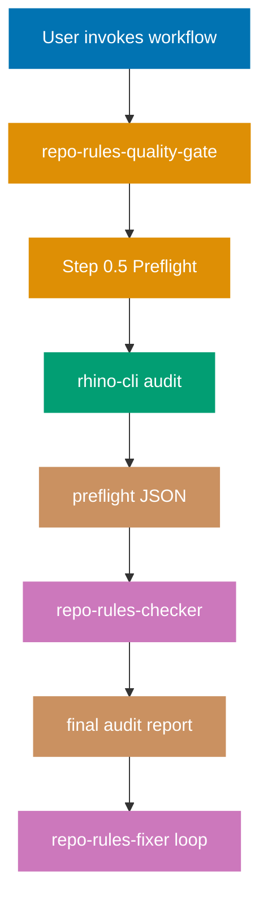

# Technical Documentation — Optimize repo-rules-quality-gate with rhino-cli

## Architecture



The preflight phase runs first, produces a JSON envelope of all deterministic findings, and the AI checker consumes it as input. The AI checker skips categories already covered by preflight and runs only AI-only categories (paraphrased duplication, contradictions, terminology alignment, semantic principle-appropriateness). On re-validation iterations the preflight runs again (fast, Nx-cached); if the JSON hash is identical, the AI checker reuses deterministic findings without re-evaluation.

## Code layout (new files)

```
apps/rhino-cli/
├── cmd/
│   ├── governance_agents_md_size.go            (+ _test.go, .integration_test.go)
│   ├── governance_frontmatter_audit.go         (+ _test.go, .integration_test.go)
│   ├── governance_traceability_audit.go        (+ _test.go, .integration_test.go)
│   ├── governance_license_audit.go             (+ _test.go, .integration_test.go)
│   ├── governance_readme_index_audit.go        (+ _test.go, .integration_test.go)
│   ├── governance_emoji_audit.go               (+ _test.go, .integration_test.go)
│   ├── governance_layer_coherence.go           (+ _test.go, .integration_test.go)
│   ├── governance_audit.go                     (orchestrator) (+ _test.go, .integration_test.go)
│   ├── docs_validate_naming.go                 (+ _test.go, .integration_test.go)
│   ├── docs_validate_frontmatter.go            (+ _test.go, .integration_test.go)
│   ├── docs_validate_heading_hierarchy.go      (+ _test.go, .integration_test.go)
│   └── agents_detect_duplication.go            (+ _test.go, .integration_test.go)
└── internal/
    ├── repo-governance/
    │   ├── agents_md_size.go (+ _test.go)
    │   ├── frontmatter_audit.go (+ _test.go)
    │   ├── traceability_audit.go (+ _test.go)
    │   ├── license_audit.go (+ _test.go)
    │   ├── readme_index_audit.go (+ _test.go)
    │   ├── emoji_audit.go (+ _test.go)
    │   ├── layer_coherence.go (+ _test.go)
    │   ├── audit_envelope.go (+ _test.go)   # shared JSON envelope shape
    │   └── audit_orchestrator.go (+ _test.go)
    ├── docs/
    │   ├── naming.go (+ _test.go)
    │   ├── frontmatter.go (+ _test.go)
    │   └── heading_hierarchy.go (+ _test.go)
    └── agents/
        └── detect_duplication.go (+ _test.go)
```

Existing rhino-cli packages (e.g., `governance_vendor_audit.go`, `agents_validate_naming.go`, `docs_validate_links.go`) are NOT modified except for one new helper consumption point — see Phase 6 §Refactor.

## JSON envelope schema

All new commands share a single envelope shape, encoded once in `internal/repo-governance/audit_envelope.go`:

```go
package repogovernance

type AuditEnvelope struct {
    Schema string       `json:"schema"`
    Status string       `json:"status"`
    Result AuditResult  `json:"result"`
}

type AuditResult struct {
    GitSHA        string                  `json:"git_sha"`
    RanAt         string                  `json:"ran_at"`
    TotalFindings int                     `json:"total_findings"`
    BySeverity    map[string]int          `json:"by_severity"`
    ByCategory    map[string]int          `json:"by_category"`
    Categories    []AuditCategoryResult   `json:"categories"`
    SkippedFalsePositives []AuditFinding  `json:"skipped_false_positives"`
}

type AuditCategoryResult struct {
    Name     string         `json:"name"`
    Command  string         `json:"command"`
    Passed   bool           `json:"passed"`
    Findings []AuditFinding `json:"findings"`
}

type AuditFinding struct {
    Key         string `json:"key"`           // stable: category|file|brief-description
    Severity    string `json:"severity"`      // critical | high | medium | low
    Criticality string `json:"criticality"`   // CRITICAL | HIGH | MEDIUM | LOW (matches AI checker)
    File        string `json:"file,omitempty"`
    Line        int    `json:"line,omitempty"`
    Message     string `json:"message"`
}
```

The envelope reuses `internal/cliout.Envelope[T]` for canonical key ordering at encode time.

## Command specifications

### 1. `repo-governance agents-md-size`

- **Logic**: Open `<git-root>/AGENTS.md`, count bytes, classify against thresholds (30k/35k/40k).
- **Inputs**: `AGENTS.md` only.
- **Flags**: standard global flags (`-o`, `-v`, `-q`).
- **Exit**: 0 if ≤30k, 1 if >30k.
- **Finding keys**: `agents-md-size|AGENTS.md|over-target`, `over-warning`, `over-hard-limit`.

### 2. `repo-governance frontmatter-audit [path]`

- **Logic**: Walk `.md` files under `[path]` (default: `repo-governance/`, `docs/explanation/software-engineering/`, `.claude/agents/`, `.claude/skills/`, `plans/`); for each, parse YAML frontmatter and (a) flag forbidden `updated:` field, (b) flag `**Last Updated**` footer block via regex, (c) flag standalone body `- **Created**: YYYY-MM-DD` / `- **Last Updated**: YYYY-MM-DD` annotations per [No Manual Date Metadata Convention](../../../repo-governance/conventions/structure/no-date-metadata.md).
- **Exemptions**: Files under `apps/ayokoding-web/`, `apps/oseplatform-web/`, `apps/organiclever-web/`, `apps/wahidyankf-web/` (website content carve-out).
- **Flags**: `--path` repeatable, standard globals.
- **Exit**: 0 clean, 1 findings, 2 invocation error.

### 3. `repo-governance traceability-audit`

- **Logic**: Walk `repo-governance/principles/**.md` and verify `## Vision Supported` heading exists; walk `repo-governance/conventions/**.md` and verify `## Principles Implemented/Respected` heading exists; walk `repo-governance/development/**.md` and verify both `## Principles Implemented/Respected` AND `## Conventions Implemented/Respected` headings exist; walk `repo-governance/workflows/**.md` and verify each references at least one agent name from `.claude/agents/`.
- **Index README exemptions**: `README.md` files in each governance subdir are not required to have these sections.
- **Exit**: 0 clean, 1 findings.

### 4. `repo-governance license-audit`

- **Logic**: Per [Per-Directory Licensing Convention](../../../repo-governance/conventions/structure/licensing.md), verify each of: every product app dir (`apps/ayokoding-web/`, `apps/oseplatform-web/`, `apps/organiclever-web/`, `apps/wahidyankf-web/`, `apps/organiclever-be/`, etc.), every `libs/*/`, and `specs/` has a `LICENSE` file. Parse `LICENSING-NOTICE.md` table and verify each row's license matches the SPDX identifier in the corresponding LICENSE file's first line.
- **Exit**: 0 clean, 1 findings.

### 5. `repo-governance readme-index-audit [path]`

- **Logic**: For each subdir under `[path]` containing `README.md`, parse the README's link listings (markdown link to `*.md` files in same dir / subdirs) and compare to the actual `ls *.md` and `ls */README.md` result. Report orphans (file exists, not in README) and ghosts (in README, file absent).
- **Default path**: `repo-governance/`, `.claude/agents/`, `.claude/skills/`, `docs/explanation/software-engineering/`.
- **Flags**: `--exclude <glob>` repeatable.
- **Exit**: 0 clean, 1 findings.

### 6. `repo-governance emoji-audit [path]`

- **Logic**: Walk forbidden file types per [Emoji Convention](../../../repo-governance/conventions/formatting/emoji.md). Forbidden file globs: `*.json`, `*.yaml`, `*.yml`, `*.toml`, `*.go`, `*.ts`, `*.tsx`, `*.js`, `*.jsx`, `*.py`, `*.java`, `*.kt`, `*.rs`, `*.fs`, `*.cs`, `*.dart`, `*.exs`, `*.ex`, `*.clj`. Use Go unicode tables (`unicode.So`, `unicode.Sk`, range `U+1F000..U+1FFFF`, etc.) to detect emoji codepoints.
- **Allowed dirs (skip)**: `node_modules`, `.git`, `.next`, `dist`, `build`, `target`.
- **Exit**: 0 clean, 1 findings.

### 7. `repo-governance layer-coherence`

- **Logic**: Read `repo-governance/repository-governance-architecture.md` and `repo-governance/README.md`. Extract layer numbering pattern (e.g., "Layer 0", "Layer 1") via regex `\*\*Layer (\d+):\s*([A-Z][a-z]+)\*\*`. Verify same layer numbers appear consistently across both documents and that the numbering is gap-free (0 through 5 inclusive).
- **Exit**: 0 clean, 1 findings.

### 8. `docs validate-naming [path]`

- **Logic**: Walk `.md` files under `[path]` and verify basename matches `^[a-z0-9-]+\.md$` (plus exemption `README.md`). Configurable exemptions via `--exempt <glob>` repeatable.
- **Default path**: `docs/`, `repo-governance/`.
- **Exit**: 0 clean, 1 findings.

### 9. `docs validate-frontmatter [path]`

- **Logic**: For `.md` files under `[path]`, parse YAML frontmatter and verify required fields per area:
  - Under `docs/explanation/software-engineering/`: `title`, `description`, `category` (must equal "software"), `subcategory`, `tags` (non-empty list).
  - Under `repo-governance/conventions/`, `repo-governance/principles/`, `repo-governance/development/`, `repo-governance/workflows/`: lighter schema — `title` required, `description` recommended.
- **Exit**: 0 clean, 1 findings.

### 10. `docs validate-heading-hierarchy [path]`

- **Logic**: For each `.md` file under `[path]`, parse headings (lines starting `#+`) and verify: exactly one H1, no skipped levels (H2 cannot be followed by H4 without an intervening H3 at same outline level).
- **Exit**: 0 clean, 1 findings.

### 11. `agents detect-duplication`

- **Logic**: Read all `.claude/agents/*.md` and `.claude/skills/*/SKILL.md`. For each file, strip frontmatter, normalize whitespace, split into 10-line sliding windows. SHA-256 each window into a hash. Group hashes appearing in 2+ files (cross-agent or agent-skill). Report clusters with `≥10` consecutive line matches (verbatim only). Excludes whitespace-only and heading-only windows.
- **Exit**: 0 clean, 1 findings.

### 12. `repo-governance audit` (orchestrator)

- **Logic**: Invoke commands 1-11 in fixed deterministic order, capture each command's JSON, aggregate into `AuditEnvelope`. Load `generated-reports/.known-false-positives.md` skip list once; for each finding, if `key` matches a skip entry, move to `result.skipped_false_positives` array instead of `categories[].findings`.
- **Flags**: standard globals; `--skip <category>` repeatable; `--include-category <name>` repeatable (run only listed categories).
- **Exit**: 0 if all included categories passed, 1 if any failed, 2 on error.

## Workflow flow change

Insert in `repo-governance/workflows/repo/repo-rules-quality-gate.md` between current Step 1 lead-in and the agent invocation:

```markdown
### 0.5 Deterministic Preflight (Sequential)

Run rhino-cli orchestrator to harvest all deterministic findings before invoking the AI checker.

**Command**: `nx run rhino-cli:validate:repo-governance-audit -o json > generated-reports/repo-governance-audit__{uuid}__{timestamp}.json`

- **Output**: `{preflight-report}` — JSON envelope at the captured path
- **Exit handling**:
  - Exit 0 (clean): All deterministic categories pass; pass JSON path to checker
  - Exit 1 (findings): Deterministic findings present; pass JSON path to checker (checker incorporates verbatim into final audit)
  - Exit 2 (invocation error): Terminate workflow with `fail` status

**Success criteria**: Preflight completes; JSON file exists at expected path; JSON parses as valid `AuditEnvelope` with `schema` field set.

**Depends on**: None (first step in iteration).
```

And update Step 1's agent invocation block to pass the preflight report:

```diff
- **Args**: `scope: all, EXECUTION_SCOPE: repo-rules`
+ **Args**: `scope: all, EXECUTION_SCOPE: repo-rules, preflight-report: {step0_5.outputs.preflight-report}`
```

## Checker agent change

In `.claude/agents/repo-rules-checker.md` Validation Process, add new Step 0.5 before Step 1:

```markdown
### Step 0.5: Consume Deterministic Preflight

**Input**: `preflight-report` argument — path to `generated-reports/repo-governance-audit__*.json`

1. Read preflight JSON.
2. Validate schema field equals `rhino-cli/repo-governance-audit/v1`.
3. Extract `result.categories` and `result.skipped_false_positives`.
4. For each category in preflight, ADD to skip set:
   - `agents-md-size` (skip step 6)
   - `frontmatter-audit` (skip frontmatter portion of step 1)
   - `traceability-audit` (skip traceability portion of step 7)
   - `license-audit` (skip licensing portion of step 7)
   - `readme-index-audit` (skip README portion of step 8.7)
   - `emoji-audit` (skip emoji portion of step 1)
   - `layer-coherence` (skip layer-coherence portion of step 7)
   - `docs-naming` (skip naming portion of step 8.3)
   - `docs-frontmatter` (skip frontmatter portion of step 8.4)
   - `docs-heading-hierarchy` (skip heading hierarchy portion of step 8.4)
   - `agents-detect-duplication` (skip verbatim portion of step 2 and step 3)
5. In final audit, embed preflight findings verbatim under section "## Deterministic Findings (rhino-cli preflight)", followed by "## AI-Only Findings".

**On re-validation iteration**: compute SHA-256 of preflight JSON. If identical to prior iteration's preflight hash, reuse the deterministic findings section unchanged and only re-run AI-only categories.
```

## Dual-Mode Compatibility (primary + secondary platform binding)

This plan keeps the `repo-rules-quality-gate` workflow fully functional under both supported coding-agent platform bindings (primary: `.claude/`; secondary: `.opencode/`) per the dual-mode convention. Three properties make this work:

1. **rhino-cli is platform-agnostic.** The 12 new commands (Phase 1-3) are Go binaries invoked via `nx run …` / `go run …`. Neither the workflow nor the agent shells out to vendor-specific tooling; both bindings invoke the identical preflight target (`nx run rhino-cli:validate:repo-governance-audit`). No vendor lock-in is introduced.
2. **Agent edits go to the primary binding only; sync propagates them.** The Phase 6 modification to the checker agent lands in `.claude/agents/repo-rules-checker.md` (single source of truth). `rhino-cli agents sync` (`npm run sync:claude-to-opencode`) auto-regenerates `.opencode/agents/repo-rules-checker.md` with the standard frontmatter transforms: tools array → boolean map, model `sonnet` → `opencode-go/minimax-m2.7` (or `haiku` → `opencode-go/glm-5`), named colors → OpenCode theme tokens. The body content stays byte-identical between the two bindings.
3. **Skill packages stay native to the primary binding directory.** OpenCode reads `.claude/skills/<name>/SKILL.md` natively per its documented behavior (no mirror copy). This plan adds zero skills, so the existing native-read path is unchanged.

### Validation gates that guarantee dual-mode parity

| Gate                       | Command                                                   | Purpose                                                                                                                                                                                                           |
| -------------------------- | --------------------------------------------------------- | ----------------------------------------------------------------------------------------------------------------------------------------------------------------------------------------------------------------- |
| Primary binding format     | `rhino-cli agents validate-claude --agents-only`          | YAML frontmatter, required fields, valid tool names, valid model name, valid color, skills references resolve, no YAML comments                                                                                   |
| Sync semantic equivalence  | `rhino-cli agents validate-sync`                          | Description identical; model correctly mapped; tools correctly converted; skills array identical; body content identical between primary and secondary bindings                                                   |
| Cross-vendor parity        | `nx run rhino-cli:validate:cross-vendor-parity`           | Full repository-level drift gate (governance docs, AGENTS.md, CLAUDE.md, both agent dirs)                                                                                                                         |
| Vendor-neutral governance  | `rhino-cli repo-governance vendor-audit repo-governance/` | New convention page + edited workflow doc contain no forbidden vendor terms per the [Governance Vendor-Independence Convention](../../../repo-governance/conventions/structure/governance-vendor-independence.md) |
| Cached preflight Nx target | `nx run rhino-cli:validate:repo-governance-audit`         | Same input → same output regardless of invoking platform; cache hits on unchanged repo state                                                                                                                      |

### Scope-of-edit invariants

- Governance prose (under `repo-governance/`) is vendor-neutral — uses "primary binding directory" / "secondary binding directory" / "the AI checker" / "the coding agent" — never the vendor product names.
- Platform-binding artifacts (under `.claude/agents/` and `.opencode/agents/`) are intentionally vendor-specific.
- `.opencode/` is never hand-edited; only `rhino-cli agents sync` writes there.
- Plan documents themselves (this directory) may reference vendor specifics when describing implementation details (per the [Governance Vendor-Independence Convention §Out of scope](../../../repo-governance/conventions/structure/governance-vendor-independence.md)). The new convention page authored in Phase 7 is held to the stricter governance standard.

## Caching strategy

Each new Nx target declares `inputs` as the union of:

- `{projectRoot}/**/*.go` (rhino-cli source — rebuild trigger)
- Specific governance / agent / skill / doc paths relevant to that command

Example (`validate:repo-governance-audit`):

```json
"validate:repo-governance-audit": {
  "command": "CGO_ENABLED=0 go run -C apps/rhino-cli main.go repo-governance audit -o json",
  "cache": true,
  "inputs": [
    "{projectRoot}/**/*.go",
    "{workspaceRoot}/AGENTS.md",
    "{workspaceRoot}/CLAUDE.md",
    "{workspaceRoot}/repo-governance/**/*.md",
    "{workspaceRoot}/.claude/agents/**/*.md",
    "{workspaceRoot}/.claude/skills/**/*.md",
    "{workspaceRoot}/docs/explanation/software-engineering/**/*.md",
    "{workspaceRoot}/LICENSING-NOTICE.md",
    "{workspaceRoot}/apps/*/LICENSE",
    "{workspaceRoot}/libs/*/LICENSE",
    "{workspaceRoot}/specs/LICENSE"
  ],
  "outputs": []
}
```

## Specs (`specs/apps/rhino/`)

Per the [BDD Spec-to-Test Mapping Convention](../../../repo-governance/development/infra/bdd-spec-test-mapping.md), every new rhino-cli command MUST get a sibling Gherkin feature file under `specs/apps/rhino/behavior/cli/gherkin/`. Feature file naming follows the existing pattern: `<command>-<subcommand>.feature` with a single `@<command>-<subcommand>` tag at the top, consumed by both unit (mocked I/O) and integration (real fixtures) godog suites.

### New feature files (12)

| File (under `specs/apps/rhino/behavior/cli/gherkin/`) | Command tag                           | Min scenarios                                                                                                                        |
| ----------------------------------------------------- | ------------------------------------- | ------------------------------------------------------------------------------------------------------------------------------------ |
| `repo-governance-agents-md-size.feature`              | `@repo-governance-agents-md-size`     | 3 (within target / over target / over hard limit)                                                                                    |
| `repo-governance-frontmatter-audit.feature`           | `@repo-governance-frontmatter-audit`  | 5 (clean / forbidden `updated:` / forbidden footer / body annotation / website exemption)                                            |
| `repo-governance-traceability-audit.feature`          | `@repo-governance-traceability-audit` | 5 (clean / missing Vision Supported / missing Principles Implemented / missing Conventions Implemented / workflow without agent ref) |
| `repo-governance-license-audit.feature`               | `@repo-governance-license-audit`      | 4 (clean / missing LICENSE in app / missing LICENSE in lib / LICENSING-NOTICE mismatch)                                              |
| `repo-governance-readme-index-audit.feature`          | `@repo-governance-readme-index-audit` | 4 (clean / orphan file / ghost reference / nested subdir)                                                                            |
| `repo-governance-emoji-audit.feature`                 | `@repo-governance-emoji-audit`        | 4 (clean / emoji in JSON / emoji in Go source / multibyte non-emoji exempt)                                                          |
| `repo-governance-layer-coherence.feature`             | `@repo-governance-layer-coherence`    | 3 (clean / numbering gap / numbering disagreement across docs)                                                                       |
| `repo-governance-audit.feature` (orchestrator)        | `@repo-governance-audit`              | 5 (clean repo / mixed findings / byte-determinism across 10 runs / skip-list honored / `--include-category` filter)                  |
| `docs-validate-naming.feature`                        | `@docs-validate-naming`               | 3 (clean / non-kebab basename / README.md exempt)                                                                                    |
| `docs-validate-frontmatter.feature`                   | `@docs-validate-frontmatter`          | 5 (software-doc clean / missing title / missing category / wrong category value / governance-doc lighter schema)                     |
| `docs-validate-heading-hierarchy.feature`             | `@docs-validate-heading-hierarchy`    | 4 (clean / two H1s / H2→H4 skipped level / single-line file ignored)                                                                 |
| `agents-detect-duplication.feature`                   | `@agents-detect-duplication`          | 4 (clean / 12-line verbatim across two agents / agent-skill duplication / heading-only window excluded)                              |

### Specs README update

`specs/apps/rhino/behavior/cli/gherkin/README.md` MUST be updated to list each new feature file (existing pattern shows a file inventory with one-line summaries).

### Spec coverage gate

The existing `nx run rhino-cli:spec-coverage` target invokes `rhino-cli spec-coverage validate specs/apps/rhino/behavior/cli/gherkin apps/rhino-cli --shared-steps`. After adding the new feature files, this target MUST pass — every scenario must have a corresponding `// Scenario:` comment in either `<command>_test.go` (unit) or `<command>.integration_test.go` (integration), and every step line must resolve to a `sc.Step(` regex in the cmd package. Lack of matching steps fails the target.

### Specs adoption/tree gates

Existing `nx run rhino-cli:validate:specs-adoption`, `validate:specs-tree`, `validate:specs-counts`, `validate:specs-links` targets sweep `specs/apps/**`. New feature files MUST satisfy these mechanical checks (they validate feature-file presence, tree layout, link integrity).

## Testing

- **Unit tests**: per-command, mocked filesystem via package-level function variables, ≥90% line coverage.
- **Integration tests**: godog scenarios with `//go:build integration` tag, drive each command in-process via `cmd.RunE()` against `/tmp` fixtures.
- **Feature files**: live under `specs/apps/rhino/behavior/cli/gherkin/` per the existing flat layout (NOT subdirectories — match existing pattern: `agents-validate-naming.feature`, `docs-validate-mermaid.feature`, `repo-governance-vendor-audit.feature`, etc.).
- **Golden test**: assert `repo-governance audit` byte-determinism via the existing `golden_test.go` pattern.
- **Coverage gate**: existing `test:quick` already enforces 90% via `rhino-cli test-coverage validate apps/rhino-cli/cover.out 90`.
- **Spec coverage gate**: existing `spec-coverage` Nx target verifies 1:1 scenario-to-test mapping.

## Design decisions

1. **Why orchestrator command, not just N independent commands?** Single JSON envelope simplifies workflow-side capture, gives one cache key for Nx, and provides the deterministic-vs-AI handoff point. Individual commands remain callable for local debugging.
2. **Why 10-line window for duplication?** Matches the existing AI checker's `>10 lines` threshold for LOW severity duplication and `>20 lines` for HIGH. Smaller windows produce too many fragmentary matches; larger windows miss real duplication.
3. **Why SHA-256 over MurmurHash?** Standard library; deterministic; collision-resistant for the small content space we hash; performance is non-bottleneck (~hundreds of files).
4. **Why keep AI checker steps numbered the same?** Backward compatibility — the agent still runs Steps 1-8 conceptually; preflight adds Step 0.5 and skip-set logic. Minimal cognitive overhead for the agent.
5. **Why not just run rhino-cli inside the checker via Bash tool?** Workflow-level invocation keeps the agent stateless w.r.t. binary path, leverages Nx caching, and produces an artifact (`generated-reports/repo-governance-audit__*.json`) that the fixer can also consume.

## File Impact

### New files (created by this plan)

**`apps/rhino-cli/cmd/`** (12 command files + 24 test files):

- `governance_agents_md_size.go` (+ `_test.go`, `.integration_test.go`)
- `governance_frontmatter_audit.go` (+ `_test.go`, `.integration_test.go`)
- `governance_traceability_audit.go` (+ `_test.go`, `.integration_test.go`)
- `governance_license_audit.go` (+ `_test.go`, `.integration_test.go`)
- `governance_readme_index_audit.go` (+ `_test.go`, `.integration_test.go`)
- `governance_emoji_audit.go` (+ `_test.go`, `.integration_test.go`)
- `governance_layer_coherence.go` (+ `_test.go`, `.integration_test.go`)
- `governance_audit.go` orchestrator (+ `_test.go`, `.integration_test.go`, `_golden_test.go`)
- `docs_validate_naming.go` (+ `_test.go`, `.integration_test.go`)
- `docs_validate_frontmatter.go` (+ `_test.go`, `.integration_test.go`)
- `docs_validate_heading_hierarchy.go` (+ `_test.go`, `.integration_test.go`)
- `agents_detect_duplication.go` (+ `_test.go`, `.integration_test.go`)

**`apps/rhino-cli/internal/`** (12 logic files + 12 test files):

- `repo-governance/agents_md_size.go` (+ `_test.go`)
- `repo-governance/frontmatter_audit.go` (+ `_test.go`)
- `repo-governance/traceability_audit.go` (+ `_test.go`)
- `repo-governance/license_audit.go` (+ `_test.go`)
- `repo-governance/readme_index_audit.go` (+ `_test.go`)
- `repo-governance/emoji_audit.go` (+ `_test.go`)
- `repo-governance/layer_coherence.go` (+ `_test.go`)
- `repo-governance/audit_envelope.go` (+ `_test.go`)
- `repo-governance/audit_orchestrator.go` (+ `_test.go`)
- `docs/naming.go` (+ `_test.go`)
- `docs/frontmatter.go` (+ `_test.go`)
- `docs/heading_hierarchy.go` (+ `_test.go`)
- `agents/detect_duplication.go` (+ `_test.go`)

**`specs/apps/rhino/behavior/cli/gherkin/`** (12 feature files):

- `repo-governance-agents-md-size.feature`
- `repo-governance-frontmatter-audit.feature`
- `repo-governance-traceability-audit.feature`
- `repo-governance-license-audit.feature`
- `repo-governance-readme-index-audit.feature`
- `repo-governance-emoji-audit.feature`
- `repo-governance-layer-coherence.feature`
- `repo-governance-audit.feature`
- `docs-validate-naming.feature`
- `docs-validate-frontmatter.feature`
- `docs-validate-heading-hierarchy.feature`
- `agents-detect-duplication.feature`

**`repo-governance/conventions/structure/`** (1 new convention page):

- `deterministic-vs-ai-validation-split.md`

### Modified files

| File                                                        | Change                                                                                                      |
| ----------------------------------------------------------- | ----------------------------------------------------------------------------------------------------------- |
| `apps/rhino-cli/project.json`                               | Add 12 new `validate:*` cached Nx targets                                                                   |
| `apps/rhino-cli/README.md`                                  | Add 12 new commands to Commands section; add version history entry                                          |
| `repo-governance/workflows/repo/repo-rules-quality-gate.md` | Insert Step 0.5 Deterministic Preflight; update Step 1 and Step 4 args                                      |
| `.claude/agents/repo-rules-checker.md`                      | Add Step 0.5 consumption logic; update Steps 1-8 skip annotations; add Final Audit Report Structure section |
| `.opencode/agents/repo-rules-checker.md`                    | Auto-synced from `.claude/agents/repo-rules-checker.md` via `npm run sync:claude-to-opencode`               |
| `repo-governance/conventions/README.md`                     | Add link to new `deterministic-vs-ai-validation-split.md` convention                                        |
| `specs/apps/rhino/behavior/cli/gherkin/README.md`           | Add entries for all 12 new feature files                                                                    |
| `plans/in-progress/README.md`                               | Updated when plan moves to `done/`                                                                          |

### No-change files

- `repo-rules-fixer.md` — explicitly out of scope
- `.opencode/` sync pipeline — no manual changes; only auto-synced artifacts
- Existing `validate:naming-agents`, `validate:naming-workflows`, `validate:mermaid`, `validate:repo-governance-vendor-audit` targets — backward-compatible, unchanged

## Rollback

If a regression is detected after merging, roll back the cutover (the workflow doc edit) via:

```bash
# Identify the commit that modified repo-rules-quality-gate.md
git log --oneline -- repo-governance/workflows/repo/repo-rules-quality-gate.md

# Revert the workflow cutover commit
git revert <workflow-commit-sha>

# If the checker agent doc edit is also causing issues, revert that commit too
git revert <agent-doc-commit-sha>
```

The workflow doc edit (`repo-governance/workflows/repo/repo-rules-quality-gate.md`) is the
cutover point — reverting that file restores the LLM-only behavior without requiring the
`rhino-cli` binary changes to be removed. The new `validate:*` Nx targets and `rhino-cli`
commands remain in the codebase but are no longer invoked by the workflow.

If the checker agent doc edit also needs reverting, it is a separate commit (per the thematic
commit guidance in `delivery.md`), so it can be reverted independently.

## Migration / rollout

Phased delivery (see `delivery.md`):

1. Build commands 1-11 + tests (Phase 1-2)
2. Build orchestrator (Phase 3)
3. Wire Nx targets (Phase 4)
4. Update workflow doc (Phase 5)
5. Update checker agent doc (Phase 6)
6. Add convention page + cross-links (Phase 7)
7. Validate by running quality gate against repo (Phase 8)

No feature flag needed — the workflow doc edit is the cutover. Old behavior (LLM-only checker) is git-revertable in one commit if a regression appears.
