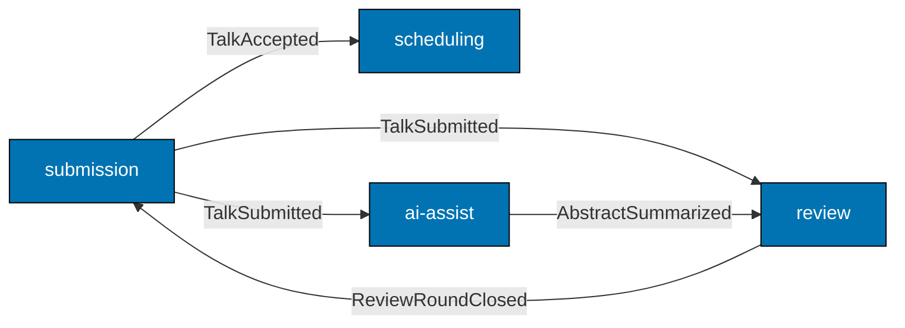

# Locked Hypothetical Domain — Conference Talk Submission Platform

## Service identity

- **Service name (FP track)**: `talks-platform-be` — F# / Giraffe / Npgsql REST API
- **Service name (OOP track)**: `talks-platform-be` — Java 25 / Spring Boot 4 REST API
- Both tracks teach wiring against the same hypothetical service. The reader compares F# vs Java wiring of the identical domain.

## Bounded contexts

| Context      | Purpose                                                                                     | Aggregate root | Key lifecycle states                                         |
| ------------ | ------------------------------------------------------------------------------------------- | -------------- | ------------------------------------------------------------ | -------- | ----------- |
| `submission` | Accepts conference talk submissions from speakers, manages talk lifecycle until scheduling  | `Talk`         | `Draft → Submitted → UnderReview → Accepted                  | Rejected | Waitlisted` |
| `review`     | Coordinates blind peer review with a rubric (clarity, novelty, fit) and per-reviewer scores | `ReviewRound`  | `Open → Closed`; each `Review` inside: `Assigned → Submitted | Recused` |
| `scheduling` | Allocates accepted talks to time slots within tracks across days                            | `Session`      | `Unallocated → Tentative → Confirmed → Cancelled`            |
| `ai-assist`  | Wraps AI provider calls for auto-tagging on submit and abstract summarization for reviewers | none (service) | n/a — stateless port consumer                                |

## Value objects (shared vocabulary)

- `TalkId` — UUID v7
- `SpeakerId` — UUID v7
- `ReviewerId` — UUID v7
- `Track` — `Backend | Frontend | InfraSecurity | AI | Leadership`
- `Format` — `Lightning(10min) | Standard(30min) | Workshop(90min)`
- `RubricScore` — three integers in `1..5` for clarity, novelty, fit
- `TimeSlot` — value object pairing `Day` and `HourOfDay(0..23)`
- `Abstract` — non-empty string `<= 2000` chars
- `TagSet` — set of normalized tag slugs

## Domain events (cross-context contracts)

| Event                | Source context | Carried payload                             | Consumers                                     |
| -------------------- | -------------- | ------------------------------------------- | --------------------------------------------- |
| `TalkSubmitted`      | submission     | `TalkId`, `SpeakerId`, `Abstract`, `Format` | review (opens review round), ai-assist (tags) |
| `ReviewRoundClosed`  | review         | `TalkId`, average `RubricScore`             | submission (transitions to Accepted/Rejected) |
| `TalkAccepted`       | submission     | `TalkId`, `Format`, suggested `Track`       | scheduling (creates Unallocated Session)      |
| `TalkRejected`       | submission     | `TalkId`, reason                            | speaker notifier (email)                      |
| `SessionConfirmed`   | scheduling     | `TalkId`, `Day`, `TimeSlot`                 | speaker notifier (email)                      |
| `AbstractSummarized` | ai-assist      | `TalkId`, summary text                      | review (attaches to reviewer pack)            |

## Output ports (used across both tracks)

| Port                | Purpose                                          | Production adapter                             | Test adapter            |
| ------------------- | ------------------------------------------------ | ---------------------------------------------- | ----------------------- |
| `TalkRepository`    | Persist + load `Talk` aggregates                 | Postgres (Npgsql / Spring Data JDBC)           | In-memory ConcurrentMap |
| `ReviewRepository`  | Persist + load `ReviewRound` aggregates          | Postgres                                       | In-memory               |
| `SessionRepository` | Persist + load `Session` aggregates              | Postgres                                       | In-memory               |
| `EventPublisher`    | Publish domain events to an outbox / message bus | Postgres outbox table + relay                  | In-memory list          |
| `AiProvider`        | Auto-tag and summarize via LLM                   | OpenRouter HTTP (FP) / Spring RestClient (OOP) | Deterministic stub      |
| `EmailNotifier`     | Send transactional emails to speakers            | SMTP (MailKit / JavaMail)                      | In-memory captured list |
| `ObjectStorage`     | Store uploaded slide decks                       | S3-compatible HTTP                             | Local temp dir          |
| `Clock`             | Current timestamp                                | System.UtcNow / Clock.systemUTC()              | Frozen test clock       |
| `ConfigurationPort` | Read typed configuration                         | `IOptions<T>` / `@ConfigurationProperties`     | In-test constants       |
| `Observability`     | Spans + metrics around port calls                | OpenTelemetry exporter                         | No-op recorder          |

## Primary adapter shape

- **FP track**: Giraffe `HttpHandler` chained from a `webApp` choose. Routes mapped per context (e.g., `POST /api/v1/talks`).
- **OOP track**: Spring `@RestController` classes per context, constructor-injected.

## Persistence shape

- One Postgres schema per bounded context: `submission`, `review`, `scheduling`. `ai-assist` is stateless.
- Outbox table lives in each writing context's schema for transactional event emit.

## API surface (illustrative)

```
POST   /api/v1/talks                       # submit a talk
GET    /api/v1/talks/{talkId}              # read talk + current state
POST   /api/v1/talks/{talkId}/withdraw     # speaker withdrawal
POST   /api/v1/review-rounds/{talkId}/reviews   # reviewer submits a review
POST   /api/v1/sessions/{talkId}/allocate  # scheduler allocates a slot
POST   /api/v1/sessions/{talkId}/confirm   # scheduler confirms the slot
GET    /api/v1/sessions?day=...            # public schedule listing
GET    /api/v1/health                      # liveness probe
GET    /api/v1/readiness                   # readiness probe (DB + AI dependency check)
```

## Cross-context wiring summary (mermaid)



# Per-Guide Catalog

## FP track (27 guides)

| #   | Title                                                                          | Wiring seam taught                                             | Primary hypothetical context |
| --- | ------------------------------------------------------------------------------ | -------------------------------------------------------------- | ---------------------------- |
| 1   | One Context, One Hexagon                                                       | Introduces the four-context layout for `talks-platform-be`     | submission (example)         |
| 2   | Reading the Per-Context Layout (was: Reading the Existing Flat Layout)         | Per-context folder shape; before/after of flat vs per-context  | submission                   |
| 3   | Domain Types Stay Free of Framework Imports                                    | `Talk.fs` has zero Giraffe / Npgsql imports                    | submission                   |
| 4   | Application Service Signatures Take and Return Aggregates, Not DTOs            | `SubmitTalk` application service signature                     | submission                   |
| 5   | Output Port as F# Function Type Alias                                          | `TalkRepository` = `TalkId -> Async<Talk option>`              | submission                   |
| 6   | Giraffe Handler as Primary Adapter                                             | `POST /api/v1/talks` handler routes to app service             | submission                   |
| 7   | Repository Port as F# Function Type Alias + Npgsql Adapter Behind It           | Concrete Npgsql adapter implementing the port                  | submission                   |
| 8   | In-Memory Repository Adapter for Integration Tests                             | ConcurrentDictionary-backed adapter, same signature            | submission                   |
| 9   | Domain Event Publisher Port: Record-of-Functions Style                         | `EventPublisher` record-of-functions                           | submission → review          |
| 10  | In-Memory Event Publisher Adapter and Outbox Adapter                           | Two adapters behind one port                                   | submission                   |
| 11  | Giraffe Handler: Full DTO → Command → Aggregate → Response Pipeline            | End-to-end pipe through the hexagon                            | submission                   |
| 12  | Handler Consuming Generated Contract Types                                     | OpenAPI codegen → Giraffe binding                              | submission                   |
| 13  | Cross-Context Integration via Anti-Corruption Layer                            | submission ↔ scheduling ACL                                    | submission, scheduling       |
| 14  | Composition Root `Program.fs`: Wiring All Ports                                | Single root wires every adapter                                | all four contexts            |
| 15  | Database Integration Test via docker-compose Harness                           | Real Postgres in CI                                            | submission                   |
| 16  | Schema Migration Adapter with DbUp                                             | Versioned SQL migrations behind a port                         | submission                   |
| 17  | AI Orchestration Port + OpenRouter HTTP Adapter                                | `AiProvider` for auto-tag + summarize                          | ai-assist                    |
| 18  | Retry and Circuit-Breaker in Adapters                                          | Polly-style decorator pattern around the AI adapter            | ai-assist                    |
| 19  | Domain Event Flow End-to-End                                                   | `TalkSubmitted → review opens round → ai tags → reviewer pack` | submission → review → ai     |
| 20  | Observability Adapter: OpenTelemetry Spans Wrapping Port Calls                 | Decorator port wrapping for spans                              | all                          |
| 21  | Multi-Tenancy Adapter Pattern                                                  | Per-tenant Postgres schema selection                           | submission                   |
| 22  | Hexagonal Anti-Patterns: Leaky Hexagon, God Adapter, Anemic Domain             | Three concrete anti-pattern walkthroughs                       | all                          |
| 23  | Kubernetes Deployment Topology for `talks-platform-be` (was: for `ose-app-be`) | Deployment + Service + Ingress shape                           | service-level                |
| 24  | OpenTelemetry Observability Wiring at the Deployment Seam                      | OTLP exporter wiring at deploy time                            | service-level                |
| 25  | Failure-Mode Degraded Adapters                                                 | Stub AI adapter when provider down                             | ai-assist                    |
| 26  | Configuration Adapter at the Deploy Seam: Secrets to Typed `IOptions<T>`       | K8s Secret → typed config                                      | service-level                |
| 27  | Background Job Adapter                                                         | Outbox relay as Hangfire-style background job                  | submission                   |

## OOP track (27 guides)

| #   | Title                                                                                       | Wiring seam taught                                             | Primary hypothetical context |
| --- | ------------------------------------------------------------------------------------------- | -------------------------------------------------------------- | ---------------------------- |
| 1   | One Context, One Hexagon                                                                    | Java package layout per context                                | submission                   |
| 2   | Reading the Per-Context Package Layout (was: Reading the Existing Flat Layout)              | `com.talksplatform.submission.{domain,application,...}`        | submission                   |
| 3   | Domain Types Stay Free of Framework Annotations                                             | `Talk` is a record with zero Spring annotations                | submission                   |
| 4   | Application Service Signatures Take and Return Aggregates, Not DTOs                         | `SubmitTalkService.submit(SubmitTalkCommand)`                  | submission                   |
| 5   | Output Port as Java Interface                                                               | `TalkRepository` interface                                     | submission                   |
| 6   | Spring `@RestController` as Primary Adapter                                                 | `TalkController` constructor-injected                          | submission                   |
| 7   | Spring `@Configuration` as Composition Root                                                 | Bean definitions wire ports                                    | all                          |
| 8   | Repository Port as Java Interface + Spring Data JDBC Adapter Behind It                      | Spring Data JDBC implementing the port                         | submission                   |
| 9   | In-Memory Repository Adapter for Integration Tests                                          | `ConcurrentHashMap`-backed adapter                             | submission                   |
| 10  | Domain Event Publisher Port                                                                 | `EventPublisher` interface; ApplicationEventPublisher adapter  | submission                   |
| 11  | In-Memory Event Adapter and Outbox Event Adapter                                            | Two adapters behind one port                                   | submission                   |
| 12  | `@RestController` Full Pipeline: DTO → Command → Aggregate → Response                       | End-to-end pipe through the hexagon                            | submission                   |
| 13  | Handler Consuming Generated Contract Types                                                  | OpenAPI codegen → Spring binding                               | submission                   |
| 14  | Cross-Context Integration via Anti-Corruption Layer                                         | submission ↔ scheduling ACL                                    | submission, scheduling       |
| 15  | Composition Root `@Configuration`: Wiring All Ports                                         | One root @Configuration wires everything                       | all                          |
| 16  | Database Integration Test via Testcontainers                                                | Postgres Testcontainer in CI                                   | submission                   |
| 17  | Schema Migration Adapter with Flyway                                                        | Versioned SQL migrations behind a port                         | submission                   |
| 18  | AI Orchestration Port + Spring `RestClient` Adapter                                         | `AiProvider` for auto-tag + summarize                          | ai-assist                    |
| 19  | Retry + Circuit-Breaker via Resilience4j                                                    | `@Retry` + `@CircuitBreaker` around the AI adapter             | ai-assist                    |
| 20  | Observability Adapter via Micrometer Tracing                                                | Micrometer + OTel bridge                                       | all                          |
| 21  | Domain Event Flow End-to-End                                                                | `TalkSubmitted → review opens round → ai tags → reviewer pack` | submission → review → ai     |
| 22  | Hexagonal Anti-Patterns                                                                     | Three concrete anti-pattern walkthroughs                       | all                          |
| 23  | Kubernetes Deployment Topology for `talks-platform-be` (was: for `organiclever-be`)         | Deployment + Service + Ingress shape                           | service-level                |
| 24  | Observability Stack at the Deploy Seam: Micrometer Tracing + OTLP + Prometheus              | OTLP exporter + Prometheus scrape                              | service-level                |
| 25  | Failure-Mode Wiring: Degraded Adapters and `HealthIndicator`                                | Custom `HealthIndicator` per adapter                           | service-level                |
| 26  | Flyway Migration at Deploy Time: Kubernetes Job vs `ApplicationRunner`                      | Migration strategy comparison                                  | service-level                |
| 27  | Configuration Adapter at the Deploy Seam: Secret to Typed `@ConfigurationProperties` Record | K8s Secret → typed Java record                                 | service-level                |

# Snippet conventions for both tracks

1. **No `Source:` line** anywhere. Snippets stand alone.
2. **No "intended layout" / "illustrative" callouts.** A code block is just a code block.
3. **Production-grade**: full error handling, observability hooks where the seam being taught calls for them, no "simplified for clarity" omissions.
4. **Cross-snippet consistency**: a port defined in Guide 5 keeps the same signature in Guide 11. A bounded-context folder shape introduced in Guide 2 stays consistent through Guide 22.
5. **Mermaid diagrams** use the WCAG color palette per the accessible-diagrams skill (Blue `#0173B2`, Orange `#DE8F05`, Teal `#029E73`, Purple `#CC78BC`, Brown `#CA9161`).
6. **Annotation density**: every guide section hits 1.0-2.25 comment-to-code-line ratio inside its code blocks (the in-the-field checker hard requirement).
