# Elixir Documentation Technical Approach

## Architecture Overview

The Elixir documentation follows the established pattern from Java and Golang documentation while adapting for Elixir's unique characteristics:

- **Functional paradigm**: No classes, emphasis on functions and data transformations
- **Concurrent by default**: BEAM VM's actor model (processes, not threads)
- **OTP framework**: GenServer, Supervisor, Application patterns
- **Metaprogramming**: Macros for DSLs (though used sparingly in documentation)
- **Phoenix ecosystem**: Modern web framework with LiveView

```mermaid
graph TD
    A[Elixir Documentation] --> B[Core Topics - 17 files]
    A --> C[Release Docs - 5-7 files]
    A --> D[OTP Patterns - 3 files]
    A --> E[DDD Templates - 7 files]
    A --> F[README.md]

    B --> B1[Idioms]
    B --> B2[Best Practices]
    B --> B3[Anti-Patterns]
    B --> B4[Concurrency]
    B --> B5[Error Handling]
    B --> B6[Type Safety]
    B --> B7[Functional Programming]
    B --> B8[DDD]
    B --> B9[Security]
    B --> B10[Performance]
    B --> B11[Protocols & Behaviours]
    B --> B12[Memory Management]
    B --> B13[Dependencies]
    B --> B14[Web Services]
    B --> B15[Linting & Formatting]
    B --> B16[TDD]
    B --> B17[BDD]

    C --> C1[1.12 Release]
    C --> C2[1.13 Release]
    C --> C3[1.14 Release]
    C --> C4[1.15 Release]
    C --> C5[1.16 Release]
    C --> C6[1.17/1.18 Releases]

    D --> D1[GenServer Patterns]
    D --> D2[Supervisor Patterns]
    D --> D3[Application Architecture]

    E --> E1[Entity Template]
    E --> E2[Value Object Template]
    E --> E3[Aggregate Template]
    E --> E4[Domain Event Template]
    E --> E5[Repository Template]
    E --> E6[Service Layer Template]
    E --> E7[Build Config Template]

    style A fill:#e1f5ff
    style B fill:#fff4e1
    style C fill:#f0e1ff
    style D fill:#e1ffe1
    style E fill:#ffe1f0
```



## Design Decisions

### Decision 1: Functional DDD Approach

**Context**: Java and Golang DDD documentation uses classes/structs. Elixir has no classes.

**Decision**: Adapt DDD patterns to functional paradigm using:

- **Entities**: Ecto schemas with identity (primary key)
- **Value Objects**: Elixir structs with validation functions
- **Aggregates**: Context modules (Phoenix contexts) with Ecto schemas
- **Domain Events**: Structs with GenServer/GenStage for handling
- **Repositories**: Ecto Repo abstraction with query functions
- **Services**: Context modules orchestrating domain logic

**Rationale**:

- Ecto provides excellent database integration
- Phoenix contexts align with DDD bounded contexts
- Functional approach emphasizes data transformations over state mutations
- Immutability by default prevents many common DDD pitfalls

**Trade-offs**:

- Less direct translation from classic DDD literature (which assumes OOP)
- More emphasis on pure functions and data pipelines
- Process-based state management (GenServer) instead of in-memory objects

### Decision 2: OTP as Primary Concurrency Model

**Context**: Java uses threads/virtual threads, Golang uses goroutines. Elixir uses BEAM processes.

**Decision**: Dedicate 3 files to OTP patterns (GenServer, Supervisor, Application) as core Elixir documentation.

**Rationale**:

- OTP is fundamental to Elixir's value proposition
- Supervision trees are the primary error handling mechanism
- GenServer is the standard for stateful processes
- No equivalent in Java/Golang documentation (unique to Elixir)

**Trade-offs**:

- More files than Java/Golang (20 total vs Java 18, Golang 24)
- OTP learning curve requires dedicated documentation
- Financial domain examples need to demonstrate process-based architecture

### Decision 3: Phoenix as Primary Web Framework

**Context**: Java uses Spring Boot, Golang uses standard library + Gin/Echo. Elixir ecosystem centers on Phoenix.

**Decision**: Web Services documentation focuses on Phoenix 1.7+ with emphasis on:

- Phoenix controllers and REST APIs
- Phoenix LiveView for real-time features
- Absinthe for GraphQL
- Guardian/Pow for authentication
- Ecto for database persistence

**Rationale**:

- Phoenix is de facto standard for Elixir web development
- LiveView provides unique real-time capabilities
- Ecto integration is seamless
- Guardian/Pow are established authentication solutions

### Decision 4: Dialyzer for Type Safety

**Context**: Java has compile-time type checking. Golang has static types. Elixir is dynamically typed.

**Decision**: Type Safety documentation emphasizes:

- Typespecs (@spec, @type) for function signatures
- Dialyzer for static analysis
- Compile-time warnings (not errors)
- Runtime pattern matching as type guard

**Rationale**:

- Elixir's dynamic typing requires different approach than Java/Golang
- Dialyzer provides success typing (what will NOT fail)
- Typespecs serve as documentation and enable Dialyzer analysis
- Pattern matching provides runtime type safety

**Trade-offs**:

- Less compile-time safety than Java/Golang
- Dialyzer warnings require interpretation
- Pattern matching moves some type checking to runtime

### Decision 5: Property-Based Testing Emphasis

**Context**: Java uses JUnit, Golang uses table-driven tests. Elixir has ExUnit and StreamData.

**Decision**: TDD documentation includes:

- ExUnit for traditional unit tests
- Doctests for documentation examples
- StreamData for property-based testing
- Mox for mocking protocols/behaviours

**Rationale**:

- Property-based testing particularly valuable for functional code
- Doctests align with Elixir community best practices
- Mox follows "test behaviour, not implementation" principle
- ExUnit's builtin features (async tests, tags, fixtures) are powerful

## Implementation Approach

### Research Strategy

**Phase 1: Version Verification** (WebSearch/WebFetch)

Research current Elixir ecosystem state:

1. **Elixir Version**:
   - Query: "Elixir current stable version January 2026"
   - Verify: Is 1.17 released? Is 1.18 released and stable?
   - Source: <https://elixir-lang.org/>, <https://github.com/elixir-lang/elixir/releases>

2. **BEAM VM**:
   - Query: "Erlang/OTP current version January 2026"
   - Verify: OTP 26, OTP 27 features
   - Source: <https://www.erlang.org/>

3. **Phoenix Framework**:
   - Query: "Phoenix framework current version 2026"
   - Verify: Phoenix 1.7+ features (verified HTML, LiveView updates)
   - Source: <https://phoenixframework.org/>

4. **Ecto**:
   - Query: "Ecto current version 2026"
   - Verify: Ecto 3.11+ features
   - Source: <https://hexdocs.pm/ecto/>

5. **Community Best Practices**:
   - Review: Elixir Forum, ElixirConf talks, HexDocs
   - Query: "Elixir best practices 2025", "Elixir anti-patterns 2025"
   - Source: <https://elixirforum.com/>, <https://blog.appsignal.com/>, <https://dashbit.co/blog>

**Phase 2: Content Research** (Per File)

For each documentation file:

1. Review official Elixir documentation (hexdocs.pm)
2. Review Phoenix guides for web services
3. Review Ecto documentation for database patterns
4. Review community resources (blogs, conference talks)
5. Verify code examples compile and run
6. Cross-reference with Java/Golang equivalents

### Content Structure

Each core documentation file follows this structure:

````markdown
# Title

**Quick Reference**: Jump links to all major sections

## Overview

2-3 paragraph introduction to the topic.

## [Topic Name]

### Concept Explanation

Text explaining the concept with 2-3 paragraphs.

### Code Example

```elixir
# Complete, runnable example
defmodule FinancialDomain.Example do
  # Financial domain code
end
```
````

### Best Practices

- Bullet list of best practices
- Each with brief explanation

### Common Mistakes

Examples of anti-patterns to avoid.

## Integration with Financial Domain

Specific examples showing topic applied to:

- Zakat calculation
- Donation processing
- Islamic finance operations
- Sharia compliance validation

## Related Topics

Cross-references to related documentation.

## Sources

References to official docs, community resources.

---

**Last Updated**: 2026-01-22

````

### File Naming Convention

All files follow the pattern: `ex-so-stla-el__[identifier].md`

**Breakdown**:

- `ex` - Explanation (Diátaxis category)
- `so` - Software
- `stla` - Stack-Lang
- `el` - Elixir
- `__` - Double underscore separator
- `[identifier]` - Topic identifier (kebab-case)

**Examples**:

- `ex-so-stla-el__idioms.md`
- `ex-so-stla-el__otp-genserver.md`
- `ex-so-stla-el__release-1.17.md`

**Templates** (in templates/ directory):

- `entity-template.md` (no prefix for templates)
- `value-object-template.md`
- `aggregate-template.md`

### Code Example Standards

All code examples must:

1. **Be complete**: Include module definition, function signatures
2. **Be runnable**: Compile without errors
3. **Use financial domain**: Zakat, Donation, Money, TaxId, etc.
4. **Follow conventions**:
   - Module names: `FinancialDomain.SubDomain.Module`
   - Function names: snake_case
   - Variables: snake_case
   - Constants: @uppercase_with_underscores
5. **Include typespecs**: @spec for all public functions
6. **Include tests**: Show ExUnit tests where appropriate
7. **Use modern Elixir**: Elixir 1.12+ features

**Example**:

```elixir
defmodule FinancialDomain.Zakat.Calculator do
  @moduledoc """
  Calculates Zakat obligations based on wealth and nisab threshold.
  """

  alias FinancialDomain.Money

  @type result :: {:ok, Money.t()} | {:error, String.t()}

  @doc """
  Calculates Zakat (2.5%) on wealth exceeding nisab threshold.

  ## Examples

      iex> wealth = Money.new(10000, :USD)
      iex> nisab = Money.new(5000, :USD)
      iex> Calculator.calculate(wealth, nisab)
      {:ok, %Money{amount: Decimal.new("250.00"), currency: :USD}}

  """
  @spec calculate(Money.t(), Money.t()) :: result()
  def calculate(%Money{} = wealth, %Money{} = nisab) do
    if Money.greater_than?(wealth, nisab) do
      zakat_amount = Money.multiply(wealth, Decimal.new("0.025"))
      {:ok, zakat_amount}
    else
      {:ok, Money.new(0, wealth.currency)}
    end
  end
end
````

### Diagram Standards

Use Mermaid diagrams with color-blind friendly palette:

**Approved Colors** (from convention):

- Blue: `#0066CC` (primary)
- Orange: `#E69F00` (secondary)
- Green: `#009E73` (success)
- Yellow: `#F0E442` (warning)
- Purple: `#9370DB` (info)
- Red: `#CC3311` (error)
- Gray: `#666666` (neutral)

**Example**:


## Testing Strategy

### Documentation Validation

Each file must pass:

1. **Markdown linting**: `npm run lint:md`
2. **Link validation**: All cross-references resolve
3. **Code compilation**: All Elixir examples compile
4. **Accessibility**: WCAG AA compliance
5. **Manual review**: Content accuracy, completeness

### Code Example Validation

Create test project to validate all code examples:

```bash
# Create test project
mix new elixir_docs_validation
cd elixir_docs_validation

# Add all code examples as modules
# Run tests
mix test

# Run Dialyzer
mix dialyzer

# Run Credo
mix credo
```

### Quality Checklist Per File

- [ ] File naming convention correct (`ex-so-stla-el__*.md`)
- [ ] Exactly one H1 heading
- [ ] Proper heading nesting (no skipped levels)
- [ ] Quick Reference section with jump links
- [ ] Code examples complete and compilable
- [ ] Financial domain examples present
- [ ] Mermaid diagrams use color-blind palette
- [ ] Sources/References section present
- [ ] Last Updated date current
- [ ] Cross-references use absolute paths
- [ ] No time-based estimates
- [ ] Active voice throughout
- [ ] WCAG AA compliance

## Dependencies and Tools

### Documentation Creation

- **Editor**: VS Code with Markdown extensions
- **Linting**: markdownlint-cli2 (v0.20.0)
- **Formatting**: Prettier (v3.6.2)
- **Link validation**: markdown-link-check
- **Diagrams**: Mermaid CLI

### Code Validation

- **Elixir**: 1.17+ (to be verified)
- **Mix**: Elixir's build tool
- **Dialyzer**: Static analysis
- **Credo**: Code quality linting
- **ExUnit**: Testing framework
- **StreamData**: Property-based testing

### Research Tools

- **WebSearch**: For current version information
- **WebFetch**: For official documentation
- **GitHub**: For release notes and changelogs

## Risk Mitigation

### Risk 1: Version Information Accuracy

**Risk**: Documenting wrong Elixir/Phoenix/Ecto versions.

**Mitigation**:

- Use WebSearch to verify current stable versions
- Reference official release notes
- Include "as of [date]" for version claims
- Update Last Updated date on every file

### Risk 2: Code Example Errors

**Risk**: Non-compilable or incorrect code examples.

**Mitigation**:

- Create validation project with all examples
- Run `mix compile` to verify compilation
- Run `mix test` to verify correctness
- Run `mix dialyzer` to check typespecs
- Include ExUnit tests with examples

### Risk 3: Incomplete OTP Coverage

**Risk**: OTP patterns too complex for comprehensive documentation.

**Mitigation**:

- Focus on most common patterns (GenServer, Supervisor)
- Provide complete working examples
- Reference official OTP documentation
- Include troubleshooting section
- Show financial domain use cases

### Risk 4: DDD Functional Mismatch

**Risk**: DDD patterns don't translate well to functional paradigm.

**Mitigation**:

- Adapt patterns to Elixir's strengths (pure functions, processes)
- Show where Elixir excels (immutability, event handling)
- Acknowledge where patterns differ from OOP
- Provide "When to use" and "When not to use" sections
- Include complete working examples

### Risk 5: Maintainability

**Risk**: Documentation becomes outdated as Elixir evolves.

**Mitigation**:

- Include Last Updated date on every file
- Reference official documentation
- Use current stable versions (not pre-release)
- Include version constraints in examples
- Plan for periodic reviews

## Performance Considerations

### Documentation Generation

Not applicable - static markdown files.

### Code Example Performance

Financial domain examples should demonstrate:

- Efficient Decimal arithmetic (avoid float for money)
- Proper use of ETS for caching
- BEAM VM optimization (tail call recursion)
- Process pool patterns for concurrent work
- Database query optimization with Ecto

## Security Considerations

### Documentation Security

- No credentials in examples
- Input validation patterns emphasized
- SQL injection prevention with Ecto
- XSS prevention in Phoenix
- Authentication/authorization best practices

### Code Example Security

All examples must:

- Validate input data
- Use parameterized queries (Ecto)
- Escape output (Phoenix.HTML)
- Handle errors securely (no sensitive info leakage)
- Follow OWASP guidelines

## Alternative Approaches Considered

### Alternative 1: Combine OTP Patterns into Single File

**Considered**: Merge GenServer, Supervisor, Application into one OTP file.

**Rejected**: Each pattern is substantial enough for dedicated file. GenServer alone requires extensive coverage.

### Alternative 2: Omit BDD Documentation

**Considered**: Skip BDD since White Bread is less mature than Cucumber JVM.

**Rejected**: Maintaining parity with Java/Golang requires BDD coverage. White Bread is functional and community-supported.

### Alternative 3: Use LiveBook for Examples

**Considered**: Provide interactive LiveBook notebooks instead of markdown.

**Rejected**: Markdown maintains consistency with Java/Golang docs. LiveBook could be future enhancement.

### Alternative 4: Separate Ecto Documentation

**Considered**: Create dedicated Ecto documentation file.

**Rejected**: Ecto is covered within relevant topics (DDD, Web Services, Performance, Repositories). No need for duplication.

---

**Last Updated**: 2025-01-22
