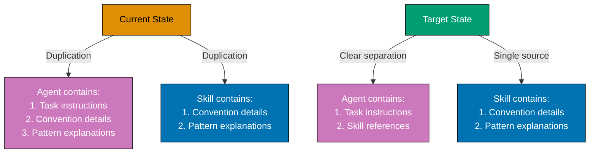

# Agent Simplification via Skills Infrastructure

## Overview

### Problem Statement

We have successfully implemented Skills infrastructure with 17 Skills and 45 agents. However, agents may contain duplicated content that already exists in Skills. This creates several issues:

1. **Content Duplication** - Convention details, pattern explanations, and standards may be duplicated between agents and Skills
2. **Maintenance Burden** - Updates to conventions require changes in multiple locations (Skills AND agents)
3. **Agent File Size Pressure** - Duplication contributes to agent file sizes approaching tier limits (Simple <800, Standard <1,200, Complex <1,800 lines)
4. **Inconsistency Risk** - Duplicated content can drift out of sync over time
5. **Unclear Boundaries** - Without clear separation, it's uncertain when to use Skills vs agent content

### Proposed Solution: Skills as Single Source of Truth

Systematically simplify agents by leveraging Skills as the single source of truth for patterns, conventions, and standards. Skills provide the knowledge; agents apply it to specific tasks.

**Key Principle**: Skills are delivery infrastructure. Agents reference Skills for shared knowledge, contain only task-specific instructions.

### Goals

**Primary Objectives:**

1. **Eliminate Agent-Skill Duplication** - Identify and remove content duplicated between agents and Skills
2. **Reduce Agent File Sizes** - Achieve 20-40% average size reduction through Skills references
3. **Improve Maintainability** - Single source of truth for conventions, patterns, and standards
4. **Validate Effectiveness** - Ensure simplified agents remain effective (no regressions)
5. **Document Patterns** - Establish clear guidelines for agent-Skill separation

**Secondary Objectives:**

1. **Identify Skill Gaps** - Create new Skills if needed to cover agent knowledge
2. **Improve Skill Coverage** - Enhance existing Skills to support agent simplification
3. **Measure Impact** - Quantify size reduction and effectiveness across all 45 agents

### Context

**Current State**: 45 agents, 17 Skills, Skills infrastructure implemented in Phase 2

**Architecture**: Six-layer governance with Skills as delivery infrastructure (established)

**Quality Gates**: wow**rules-checker validates consistency, wow**rules-fixer applies fixes

**Alignment**: Implements Simplicity Over Complexity, Documentation First, Automation Over Manual principles

## Git Workflow

**Trunk Based Development**: All work happens on `main` branch with small, frequent commits. No feature branches unless absolutely necessary.

See [Trunk Based Development Convention](../../docs/explanation/development/workflow/ex-de-wo__trunk-based-development.md) for complete details.

## Delivery Type

**Trunk Based Development (Direct Commits to Main)**

This plan delivers agent simplification through direct commits to main branch:

**Approach:**

- ✅ **COMPLETED**: Agent-Skill duplication audit (6,000-8,000 lines reduction potential)
- ✅ **COMPLETED**: Skills coverage gap analysis (~5,600 lines reduction potential)
- **NEXT**: Pilot simplification on one agent family (Phase 1)
- **THEN**: Apply learnings to remaining agents systematically (Phase 2)
- **FINALLY**: Final validation with quality gates (Phase 3)

**Rationale for Trunk Based Development**:

- All work on main branch with small, frequent commits
- Validation checkpoints between phases
- Clear audit trail through progressive commits
- Aligns with repository git workflow convention

## Quick Links

- [Requirements](./requirements.md) - Detailed objectives, user stories, acceptance criteria
- [Technical Documentation](./tech-docs.md) - Architecture, design decisions, background research results, implementation approach
- [Delivery Plan](./delivery.md) - Background research results (duplication audit + gap analysis), implementation phases (1-3), validation checklist, completion status

## Success Metrics

**Quantitative Metrics:**

1. **Agent Size Reduction**: Average 20-40% reduction across all 45 agents
2. **Duplication Elimination**: Zero verbatim/paraphrased duplication between agents and Skills
3. **Skill Coverage**: All agent knowledge either in Skills or clearly task-specific
4. **Quality Gate Pass**: Zero CRITICAL/HIGH findings from wow**rules**quality-gate workflow

**Qualitative Metrics:**

1. **Agent Effectiveness**: No regressions in checker/fixer validation accuracy
2. **Maintainability**: Convention updates require changes in Skills only (not agents)
3. **Clarity**: Clear separation between Skills (knowledge) and agents (tasks)

## Context Documents

**Core Principles Implemented:**

- [Simplicity Over Complexity](../../docs/explanation/principles/general/ex-pr-ge__simplicity-over-complexity.md) - Remove duplication, favor single source of truth
- [Documentation First](../../docs/explanation/principles/content/ex-pr-co__documentation-first.md) - Skills encode knowledge systematically
- [Explicit Over Implicit](../../docs/explanation/principles/software-engineering/ex-pr-se__explicit-over-implicit.md) - Clear Skill references instead of embedded knowledge

**Key Conventions:**

- [AI Agents Convention](../../docs/explanation/development/agents/ex-de-ag__ai-agents.md) - Agent structure, size limits, Skills integration
- [Repository Architecture](../../docs/explanation/ex__repository-governance-architecture.md) - Six-layer hierarchy with Skills as infrastructure

**Skills Infrastructure:**

- [Skills Directory README](./.claude/skills/README.md) - Skills catalog and creation patterns
- [Create New Skill How-To](../../docs/how-to/hoto__create-new-skill.md) - Skill creation guide

## Related Plans

**Builds On:**

- [2026-01-02: Skills Infrastructure Implementation](../../plans/done/2026-01-02__skills-layer-implementation/) - Skills infrastructure foundation

**Enables:**

- Future: Easier maintenance through single source of truth
- Future: Faster agent creation (reference Skills, don't duplicate)
