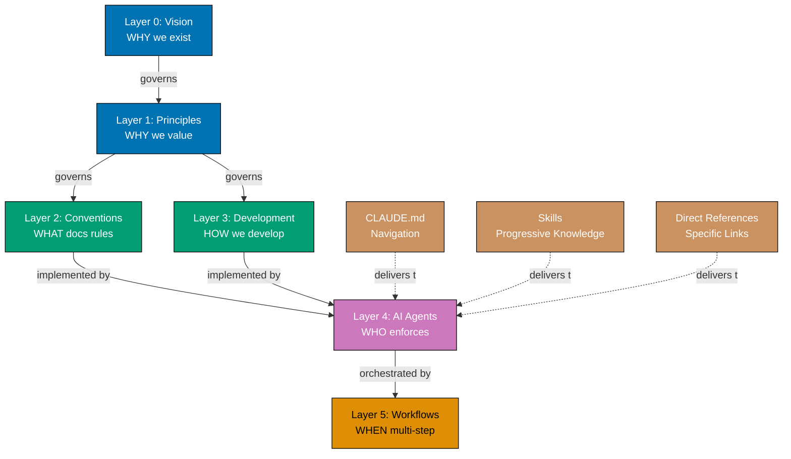
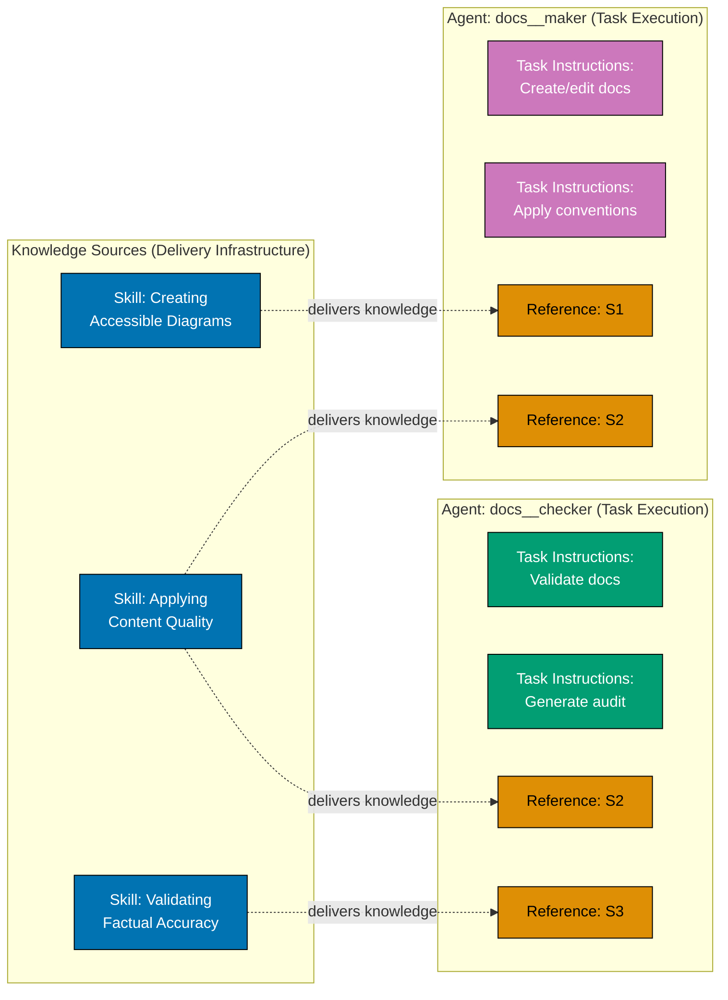
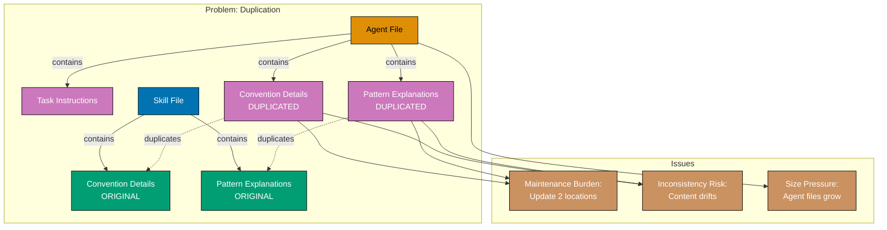
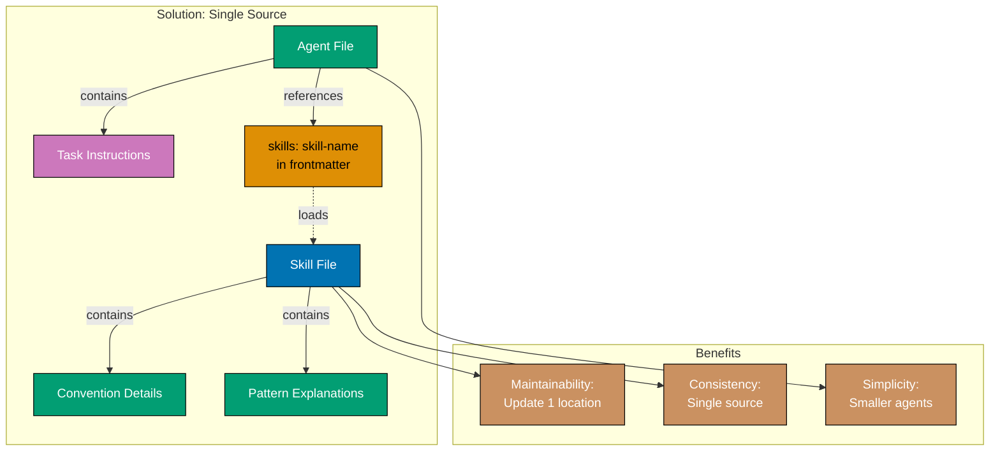

# Technical Documentation

## Architecture Overview

### Current Architecture: Skills as Delivery Infrastructure

The repository follows a six-layer governance architecture with Skills as delivery infrastructure (not a governance layer):



**Key Insight**: Skills don't GOVERN agents (like Conventions do). Skills DELIVER knowledge to agents. Governance flows down (L0→L1→L2/L3→L4→L5). Delivery flows sideways (CLAUDE.md/Skills/Direct Refs → L4).

### Agent-Skill Relationship Model



**Principle**: Agents contain task-specific instructions only. Skills contain reusable knowledge (conventions, patterns, standards).

### Duplication Problem: Current State

Before simplification, some agents may duplicate Skill content:



### Solution: Single Source of Truth

After simplification, agents reference Skills instead of duplicating:



## Technology Stack

### Existing Infrastructure

**Skills (18 total):**

- Content Creation: applying-content-quality, creating-by-example-tutorials, developing-ayokoding-content, developing-ose-content, writing-readme-files
- Quality Assurance: applying-maker-checker-fixer, assessing-criticality-confidence, validating-factual-accuracy, validating-links
- Standards Application: applying-diataxis-framework, creating-accessible-diagrams, writing-gherkin-criteria
- Process Execution: creating-project-plans, defining-workflows, practicing-trunk-based-development
- Technical Knowledge: developing-agents, understanding-repository-architecture

**Agents (48 total):**

- Content: 9 makers
- Validation: 13 checkers
- Fixing: 11 fixers
- Planning: 4 plan-related
- Operations: 3 deployers
- Workflows: 3 workflow-related
- Meta: 5 infrastructure

**Quality Gates:**

- wow\_\_rules-checker: Consistency validation
- wow\_\_rules-fixer: Automated fix application
- wow**rules**quality-gate workflow: Comprehensive validation

### Tools and Techniques

**Duplication Detection:**

- Grep-based text matching (verbatim duplication)
- Semantic similarity analysis (paraphrased duplication)
- Conceptual mapping (same convention, different explanation)

**Validation:**

- Before/after comparison testing
- Regression testing with test cases
- Quality gate execution (OCD mode)

**Metrics Collection:**

- Line count analysis (wc -l)
- Character count analysis (wc -c)
- Duplication instance counting
- Validation accuracy comparison

## Design Decisions

### Decision 1: Duplication Categorization

**Context**: Need to classify duplication types for prioritization and remediation.

**Decision**: Use three duplication categories: Verbatim, Paraphrased, Conceptual.

**Rationale**:

- **Verbatim** (exact text) is CRITICAL - clear violation, easy to detect, must be eliminated
- **Paraphrased** (same meaning, different words) is HIGH - subtle violation, needs semantic analysis, should be eliminated
- **Conceptual** (same convention, different explanation) is MEDIUM - may be legitimate (task-specific context), needs human judgment

**Alternatives Considered**:

- Single "duplication detected" category → Too coarse, doesn't guide remediation
- Fine-grained subcategories → Too complex, analysis overhead not justified

**Consequences**:

- Clear prioritization for remediation (CRITICAL → HIGH → MEDIUM)
- Enables both automated and manual remediation strategies
- Aligns with existing criticality levels (CRITICAL/HIGH/MEDIUM/LOW)

### Decision 2: Pilot-First Rollout Strategy

**Context**: Need to validate simplification approach before applying to all 48 agents.

**Decision**: Pilot simplification on one agent family (maker-checker-fixer trio), measure effectiveness, then rollout to remaining agents.

**Rationale**:

- **Risk Reduction**: Catch issues early in pilot, not across all agents
- **Learning**: Document lessons learned, improve approach for rollout
- **Validation**: Prove effectiveness with real workflow execution
- **Confidence**: Build confidence before large-scale changes

**Alternatives Considered**:

- Simplify all agents at once → High risk, no learning opportunity, harder rollback
- Simplify agents one-by-one → Too slow, no efficiency from batch processing

**Consequences**:

- Pilot phase adds checkpoint before major work
- Rollout benefits from pilot learnings
- Clear go/no-go decision point after pilot

### Decision 3: Skills as Single Source of Truth

**Context**: Need clear boundary between agent content and Skill content.

**Decision**: Skills contain all reusable knowledge (conventions, patterns, standards). Agents contain only task-specific instructions and Skill references.

**Rationale**:

- **Maintainability**: Update conventions in one place (Skills), not many (agents)
- **Consistency**: Single source prevents drift and contradictions
- **Simplicity**: Clear separation, easy to decide where content belongs
- **Composability**: Multiple agents can reference same Skill

**Alternatives Considered**:

- Allow duplication with sync mechanism → Complex, error-prone, defeats purpose
- Put all knowledge in agents, Skills as summaries → Inverts relationship, loses single source benefit

**Consequences**:

- Agents become focused on task instructions
- Skills become comprehensive knowledge repositories
- Convention updates require Skill changes only
- Need clear guidelines for edge cases

### Decision 4: Progressive Audit Report Writing

**Context**: Comprehensive duplication audit may exceed context limits, risking data loss during compaction.

**Decision**: Write audit report progressively to generated-reports/ as findings are discovered, not buffered and written at end.

**Rationale**:

- **Context Survival**: Progressive writing ensures audit survives compaction
- **Long Runs**: Duplication detection across 48 agents may be lengthy
- **Best Practice**: Aligns with Temporary Files Convention requirement for checker agents
- **Transparency**: Report available immediately, not waiting for completion

**Alternatives Considered**:

- Buffer all findings, write once → Risks data loss if context compaction occurs
- Write to conversation only → Violates checker agent requirement for persistent reports

**Consequences**:

- Audit report persists even with context compaction
- Report file initialized at execution start
- Findings written incrementally throughout audit
- Aligns with existing checker agent patterns

### Decision 5: Effectiveness Validation via Workflow Execution

**Context**: Need to prove simplified agents maintain effectiveness, not just file size reduction.

**Decision**: Run complete maker-checker-fixer workflows on test cases before/after simplification, comparing validation accuracy.

**Rationale**:

- **Real-World Test**: Workflows are how agents are actually used
- **Comprehensive**: Tests full cycle, not just individual agents
- **Objective**: Comparison metrics are quantitative (same issues found/fixed)
- **Confidence**: Passing workflows prove effectiveness maintained

**Alternatives Considered**:

- Manual testing only → Subjective, incomplete coverage, not repeatable
- Unit test agents individually → Misses integration issues between agents

**Consequences**:

- Need test cases for workflow validation
- Validation metrics are objective (detection/fix accuracy)
- High confidence in simplified agents
- Clear success criteria for pilot and rollout

## Implementation Approach

### Phase 1: Audit (Agent-Skill Duplication Analysis)

**Goal**: Comprehensive audit identifying all duplication between agents and Skills.

**Approach**:

1. **Duplication Detection**
   - Run wow\_\_rules-checker with Agent-Skill duplication detection enabled
   - Check all 48 agents against all 18 Skills
   - Categorize findings: Verbatim, Paraphrased, Conceptual
   - Assign severity: CRITICAL (verbatim), HIGH (paraphrased), MEDIUM (conceptual)

2. **Report Generation**
   - Write findings progressively to `generated-reports/agent-skill-duplication__{uuid-chain}__{timestamp}__audit.md`
   - Include: Agent file, Skill file, duplicated content, duplication category, severity, location (line numbers)
   - Generate summary: Total instances, breakdown by category, agents with most duplication

3. **Analysis**
   - Identify patterns in duplication (which Skills, which agent families)
   - Estimate size reduction potential per agent
   - Prioritize agents for simplification (most duplication first)

**Deliverable**: Comprehensive duplication audit report

### Phase 2: Skill Gap Analysis

**Goal**: Verify Skills cover all agent knowledge; identify gaps.

**Approach**:

1. **Knowledge Extraction**
   - Extract knowledge domains from all agents (conventions, patterns, standards)
   - Map knowledge domains to existing 18 Skills
   - Identify uncovered domains (gaps)

2. **Coverage Matrix**
   - Create matrix: Agents (rows) × Skills (columns)
   - Mark which Skills cover which agent knowledge
   - Highlight gaps (agent knowledge not in any Skill)

3. **Gap Remediation**
   - For critical gaps: Create new Skills
   - For minor gaps: Enhance existing Skills
   - For task-specific knowledge: Document as legitimate agent content (not a gap)

**Deliverable**: Skill coverage matrix, new/enhanced Skills (if needed)

### Phase 3: Pilot (One Agent Family)

**Goal**: Validate simplification approach on pilot agent family before full rollout.

**Approach**:

1. **Pilot Selection**
   - Select pilot family: docs family (docs**maker, docs**checker, docs\_\_fixer)
   - Rationale: Well-defined responsibilities, established workflows, representative of other families

2. **Simplification**
   - Remove duplicated content from agents (identified in Phase 1 audit)
   - Add/update skills: field in frontmatter with referenced Skills
   - Ensure task-specific instructions remain
   - Verify agent file size within tier limits

3. **Validation**
   - Before metrics: Measure agent sizes, collect test cases
   - Simplify agents
   - After metrics: Measure agent sizes, calculate reduction percentage
   - Workflow execution: Run docs**maker → docs**checker → docs\_\_fixer workflow on test cases
   - Comparison: Verify same validation accuracy (same issues detected/fixed)

4. **Documentation**
   - Document lessons learned
   - Document agent-Skill separation patterns observed
   - Note any challenges or edge cases
   - Update approach for rollout based on pilot findings

**Deliverable**: Pilot results report with metrics, lessons learned, go/no-go recommendation

### Phase 4: Rollout (Remaining Agents)

**Goal**: Apply pilot learnings to simplify remaining 40+ agents systematically.

**Approach**:

1. **Batch Processing**
   - Group agents by family (ayokoding-web, ose-platform-web, readme, plan, workflow, etc.)
   - Apply simplification family-by-family
   - Enables focused validation per family

2. **Systematic Simplification**
   - For each agent:
     - Review Phase 1 audit findings for that agent
     - Remove duplicated content
     - Add/update skills: field with referenced Skills
     - Verify task-specific instructions intact
     - Confirm agent size within tier limits
   - Progressive commits: Commit after each family completed

3. **Per-Family Validation**
   - After simplifying family, run family workflows if applicable
   - Verify no regressions (same validation accuracy)
   - Measure size reduction for family
   - Document any issues or patterns

4. **Metrics Tracking**
   - Track size reduction per agent
   - Calculate average size reduction
   - Count duplication instances eliminated
   - Verify all agents within tier limits

**Deliverable**: Simplified agents (all 48), metrics report showing impact

### Phase 5: Verification

**Goal**: Comprehensive final validation ensuring quality and no regressions.

**Approach**:

1. **Quality Gate Execution**
   - Run wow**rules**quality-gate workflow in OCD mode
   - Verify zero CRITICAL/HIGH findings
   - Address any MEDIUM/LOW findings if critical

2. **Regression Testing**
   - Run representative workflows for each agent family
   - Verify validation accuracy matches baseline (before simplification)
   - Confirm fix application accuracy maintained

3. **Size Verification**
   - Verify all 48 agents within tier limits
   - Calculate final average size reduction
   - Confirm 20-40% target met

4. **Documentation Update**
   - Add agent-Skill separation guidelines to AI Agents Convention
   - Include examples of good separation
   - Add decision tree for knowledge placement
   - Update Skills README with any new Skills

5. **Final Report**
   - Summarize simplification impact (size reduction, duplication eliminated)
   - Effectiveness validation results (zero regressions)
   - Lessons learned and best practices
   - Recommendations for future agent creation

**Deliverable**: Final verification report, updated documentation

## Data Models

### Duplication Finding

```yaml
agent_file: .claude/agents/docs__maker.md
skill_file: .claude/skills/applying-content-quality/SKILL.md
duplication_category: Paraphrased
severity: HIGH
agent_content: |
  All documentation must follow quality standards: active voice,
  single H1, proper heading nesting, alt text for images...
skill_content: |
  Universal markdown content quality standards for active voice,
  heading hierarchy, accessibility compliance (alt text, WCAG AA
  contrast, screen reader support)...
agent_location:
  start_line: 45
  end_line: 48
skill_location:
  start_line: 12
  end_line: 16
recommendation: |
  Remove detailed quality standards from agent. Reference Skill
  'applying-content-quality' in frontmatter skills: field.
```

### Skill Coverage Matrix

```
Agent                          | Skills Referenced                               | Gaps
-------------------------------|------------------------------------------------|------
docs__maker                    | applying-content-quality,                      | None
                               | creating-accessible-diagrams                   |
docs__checker                  | applying-content-quality,                      | None
                               | validating-factual-accuracy                    |
ayokoding-web-general-maker    | developing-ayokoding-content,                  | None
                               | applying-content-quality,                      |
                               | creating-by-example-tutorials                  |
```

### Size Metrics

```yaml
agent: docs__maker.md
before:
  lines: 645
  characters: 28340
after:
  lines: 512
  characters: 22150
reduction:
  lines: 133 (20.6%)
  characters: 6190 (21.8%)
tier: Standard (<1200 lines)
within_limit: true
```

## Security Considerations

### Tool Access Unchanged

Agent simplification does NOT change tool permissions. Each agent maintains current tool whitelist for security.

**Rationale**: Simplification removes duplication, doesn't change agent responsibilities or security model.

### Validation Accuracy

Simplified checker agents must maintain same validation accuracy to prevent security issues from missed findings.

**Mitigation**: Comprehensive regression testing with before/after comparison ensures detection accuracy maintained.

### No Privilege Escalation

Skills don't grant agents additional tool access. Skill references are knowledge delivery only, not permission grants.

**Enforcement**: wow\_\_rules-checker validates agent tool permissions unchanged during simplification.

## Testing Strategy

### Unit Testing: Individual Agents

**Approach**: Test each simplified agent in isolation.

**Test Cases**:

- Agent file size within tier limits
- skills: frontmatter field present and valid
- Task-specific instructions intact
- No duplicated Skill content remains

### Integration Testing: Agent Families

**Approach**: Test agent families (maker-checker-fixer trios) together.

**Test Cases**:

- Maker creates content correctly
- Checker validates content with same accuracy as before
- Fixer applies fixes with same accuracy as before
- Family workflow completes end-to-end successfully

### System Testing: Workflows

**Approach**: Execute complete workflows spanning multiple agent families.

**Test Cases**:

- wow**rules**quality-gate workflow passes
- Documentation workflows (make → check → fix) execute successfully
- Content workflows (ayokoding-web, ose-platform-web) execute successfully
- Planning workflows (plan creation, execution, validation) execute successfully

### Regression Testing: Effectiveness

**Approach**: Compare validation accuracy before/after simplification.

**Test Cases**:

- Checker agents detect same issues as before (100% detection accuracy)
- Fixer agents apply same fixes as before (100% fix accuracy)
- Quality gates pass with same results as before
- No new false positives or false negatives introduced

### Performance Testing: Execution Time

**Approach**: Measure workflow execution time before/after simplification.

**Test Cases**:

- Workflow execution time within ±10% of baseline
- Agent load time similar (Skills auto-load on-demand)
- Audit report generation time acceptable (< 30 minutes)

## Deployment Strategy

### Deployment Approach

**Strategy**: Direct commits to main branch (Trunk Based Development) with validation checkpoints.

**Phases**:

1. Phase 1 (Audit): Commit audit report to generated-reports/
2. Phase 2 (Gap Analysis): Commit new/enhanced Skills, coverage matrix
3. Phase 3 (Pilot): Commit simplified pilot family agents, pilot report
4. Validation Checkpoint: Verify pilot passed, decide go/no-go for rollout
5. Phase 4 (Rollout): Commit simplified agents family-by-family
6. Phase 5 (Verification): Commit final report, documentation updates

**Rollback**: If issues found, git revert commits for affected family, investigate, re-apply with fixes.

### Monitoring and Observability

**Monitoring**:

- wow\_\_rules-checker detects any duplication creeping back
- Quality gate failures indicate regressions
- Agent file size monitoring (warn if approaching tier limits)

**Observability**:

- Audit reports in generated-reports/ provide history
- Metrics reports show simplification impact
- Git history shows simplification progression

## Traceability

### Principles Implemented

This plan implements the following core principles:

- **[Simplicity Over Complexity](../../docs/explanation/principles/general/ex-pr-ge__simplicity-over-complexity.md)**: Single source of truth (Skills) instead of duplication. Simpler agents focusing on tasks only.

- **[Documentation First](../../docs/explanation/principles/content/ex-pr-co__documentation-first.md)**: Skills encode conventions systematically. Agent-Skill separation guidelines documented.

- **[Explicit Over Implicit](../../docs/explanation/principles/software-engineering/ex-pr-se__explicit-over-implicit.md)**: Clear Skill references in frontmatter. Explicit separation between agent content and Skill content.

- **[Automation Over Manual](../../docs/explanation/principles/software-engineering/ex-pr-se__automation-over-manual.md)**: Automated duplication detection. Automated validation (quality gates, regression testing).

### Conventions Respected

This plan respects the following conventions:

- **[AI Agents Convention](../../docs/explanation/development/agents/ex-de-ag__ai-agents.md)**: Agent structure, size limits, Skills integration, frontmatter requirements

- **[Repository Architecture](../../docs/explanation/ex__repository-governance-architecture.md)**: Six-layer hierarchy with Skills as delivery infrastructure (not governance)

- **[Temporary Files Convention](../../docs/explanation/development/infra/ex-de-in__temporary-files.md)**: Progressive writing of audit reports to generated-reports/

- **[Color Accessibility Convention](../../docs/explanation/conventions/formatting/ex-co-fo__color-accessibility.md)**: All Mermaid diagrams use accessible palette
