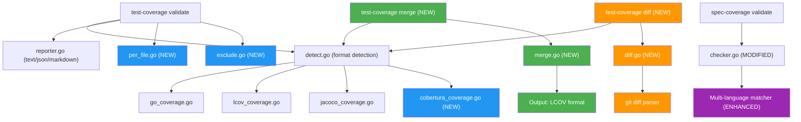

# Technical Documentation

## Architecture Overview

All changes extend the existing rhino-cli architecture without breaking backward compatibility.
New features follow the established patterns: cmd/ for CLI parsing, internal/ for logic,
dependency injection for testability.



## Design Decisions

### D1: Cobertura XML Parser

**Approach**: XML struct parsing using `encoding/xml` (same as JaCoCo parser).

**Format Detection Priority Update** (`detect.go`):

```
1. Filename-based:
   - .info → LCOV
   - .xml + "jacoco" → JaCoCo
   - .xml + "cobertura" → Cobertura
   - "lcov" in name → LCOV
   - "jacoco" in name → JaCoCo
   - "cobertura" in name → Cobertura

2. Content-based (read first ~10 lines to find root element):
   - "mode:" on first line → Go
   - "SF:" or "TN:" on first line → LCOV
   - XML with <report> root element → JaCoCo
   - XML with <coverage> root element → Cobertura   ← NEW LOGIC
   - Note: both JaCoCo and Cobertura start with "<?xml", so we must
     scan past the declaration to find the root element name

3. Fallback: Go
```

**Key distinction from JaCoCo**: Cobertura uses `<coverage>` root element with `line-rate`
attribute; JaCoCo uses `<report>` root element. Content-based detection reads the first few
lines to find the root element name.

**XML struct mapping**:

```go
type CoberturaReport struct {
    XMLName  xml.Name          `xml:"coverage"`
    Packages []CoberturaPackage `xml:"packages>package"`
}

type CoberturaPackage struct {
    Name    string            `xml:"name,attr"`
    Classes []CoberturaClass  `xml:"classes>class"`
}

type CoberturaClass struct {
    Name     string          `xml:"name,attr"`
    Filename string          `xml:"filename,attr"`
    Lines    []CoberturaLine `xml:"lines>line"`
}

type CoberturaLine struct {
    Number            int    `xml:"number,attr"`
    Hits              int    `xml:"hits,attr"`
    Branch            bool   `xml:"branch,attr"`
    ConditionCoverage string `xml:"condition-coverage,attr"`
}
```

**Branch classification**: Parse `condition-coverage` attribute (format: `"50% (1/2)"`) to
determine partial vs covered status. If `branch="true"` and coverage < 100%, classify as partial.

### D2: Per-File Reporting

**Implementation**: Add file-level aggregation to existing `Result` type.

**New types**:

```go
type FileResult struct {
    Path    string  `json:"path"`
    Covered int     `json:"covered"`
    Partial int     `json:"partial"`
    Missed  int     `json:"missed"`
    Total   int     `json:"total"`
    Pct     float64 `json:"pct"`
}

// Extended Result (backward compatible - Files is omitted when nil)
type Result struct {
    // ... existing fields ...
    Files []FileResult `json:"files,omitempty"`
}
```

**Approach**: Each parser already processes coverage per-file internally. Surface this data in the
result when `--per-file` is requested. The parsers need minimal changes -- they already group by
file, just need to return the intermediate per-file data.

**Sorting**: Files sorted ascending by coverage percentage (worst first) to draw attention to
weakest files.

**`--below-threshold` flag**: When combined with `--per-file`, filter output to show only files
below the specified threshold.

### D3: Coverage Merging

**New command**: `test-coverage merge [flags] <file1> <file2> [file3...]`

**Flags**:

- `--out-file <path>`: Output file path (LCOV format). If omitted, print summary only.
- `--validate <threshold>`: Optionally validate merged coverage against threshold.
- `--exclude <pattern>`: Exclude files matching glob (repeatable).
- `-o, --output <format>`: Uses global output format flag (text/json/markdown) for summary display.

**Internal representation** for merging:

```go
// Normalized per-line coverage data (format-agnostic)
type LineCoverage struct {
    HitCount int
    Branches []BranchCoverage
}

type BranchCoverage struct {
    BlockID  int
    BranchID int
    HitCount int
}

// Map: filepath → line_number → LineCoverage
type CoverageMap map[string]map[int]LineCoverage
```

**Merge algorithm**:

1. Parse each input file into `CoverageMap`
2. For each file+line pair that appears in multiple inputs: `max(hit_count_a, hit_count_b)`
3. For branch data: union by (blockID, branchID), take max hit count per branch
4. Write merged result as LCOV (most universal output format)

**Why LCOV output**: LCOV is the most portable format and can be consumed by virtually every
coverage tool and CI platform. Other formats lose information (Go cover.out has no branch data)
or are more complex to generate (JaCoCo XML requires class/method structure).

### D4: Diff Coverage

**New command**: `test-coverage diff <coverage-file> [flags]`

**Flags**:

- `--base <ref>`: Git ref to diff against (default: `main`)
- `--threshold <pct>`: Fail if diff coverage below threshold
- `--staged`: Diff staged changes instead of branch diff
- `--per-file`: Show per-file diff coverage breakdown
- `--exclude <pattern>`: Exclude files matching glob
- `-o, --output <format>`: Output format

**Implementation approach**:

1. Run `git diff --unified=0 <base>...HEAD` (or `git diff --staged --unified=0`)
2. Parse diff hunks to extract changed line numbers per file
3. Cross-reference with coverage data to classify each changed line
4. Calculate diff coverage: `covered_changed / total_changed`

**Git diff parsing**: Parse unified diff output to extract file paths and line ranges from
`@@ -a,b +c,d @@` hunk headers. Only count added/modified lines (+ lines), not deleted lines.

**Edge cases**:

- Renamed files: Match by new filename
- Binary files: Skip (no coverage data)
- Files not in coverage report: Count as 0% coverage for those changed lines
- No changed lines: Exit 0 with "No changed lines to evaluate"

### D5: File Exclusion

**Flag**: `--exclude <glob>` (repeatable) on `validate`, `merge`, and `diff` commands.

**Implementation**: Apply `filepath.Match` after parsing coverage data, before aggregation.
Filter out files whose path matches any exclude pattern.

**Pattern matching**: Use Go's `filepath.Match` which supports `*`, `?`, and `[...]` patterns.
Note: `filepath.Match` does not support `**` recursive matching. For v0.13.0, limit to
single-segment globs. Recursive `**` support can be added later via `doublestar` library
if needed.

**Application order**: Exclusion is applied post-parse, pre-aggregate. This means:

1. Parse full coverage file
2. Filter out excluded files
3. Aggregate remaining files for percentage calculation
4. Report only non-excluded files in per-file output

### D6: spec-coverage Multi-Language Matching

**Current `findMatchingTestFile` logic** (simplified):

```go
// Current: only matches {stem}_test.go, {stem}.test.ts, etc.
if strings.HasPrefix(base, stem+".") || strings.HasPrefix(base, stem+"_") {
    return true
}
```

**Enhanced matching strategy**: Build a list of candidate patterns per feature stem, check all.

```go
func candidatePatterns(stem string) []string {
    snake := toSnakeCase(stem)  // "health-check" → "health_check"
    pascal := toPascalCase(stem) // "health-check" → "HealthCheck"

    return []string{
        // Existing patterns (CLI apps)
        stem,                        // health-check (prefix match)
        snake,                       // health_check (prefix match)

        // Go BDD steps
        snake + "_steps",            // health_check_steps_test.go

        // TypeScript/JS steps
        stem + ".steps",             // health-check.steps.ts
        "steps/" + stem,             // steps/health-check.steps.ts

        // Java/Kotlin (PascalCase)
        pascal + "Steps",            // HealthCheckSteps.java
        pascal + "Test",             // HealthCheckTest.java

        // Elixir
        snake + "_steps",            // health_check_steps.exs

        // Python (test_ prefix)
        "test_" + snake,             // test_health_check.py

        // Rust
        snake + "_test",             // health_check_test.rs

        // F#/C#
        pascal + "Tests",            // HealthCheckTests.fs
        pascal + "Steps",            // HealthCheckSteps.cs

        // Clojure
        snake + "_test",             // health_check_test.clj
        snake + "_steps",            // health_check_steps.clj
    }
}
```

**Backward compatibility**: All existing patterns remain. New patterns are additive.

**Test file indicators** (already in checker.go, may need expansion):

- Go: `_test.go` suffix
- TS/JS: `.test.`, `.spec.`, `.steps.`, `.integration.`, `_test.`
- Java/Kotlin: files in `test/` directory
- Elixir: `_test.exs`, `_steps.exs`
- Python: `test_` prefix or `_test.py` suffix
- Rust: `_test.rs` or in `tests/` directory
- F#/C#: files in `Tests` project or `_test` suffix
- Clojure: `_test.clj` suffix

## File Changes Summary

### New Files

| File                                               | Purpose                    |
| -------------------------------------------------- | -------------------------- |
| `internal/testcoverage/cobertura_coverage.go`      | Cobertura XML parser       |
| `internal/testcoverage/cobertura_coverage_test.go` | Unit tests                 |
| `internal/testcoverage/per_file.go`                | Per-file aggregation logic |
| `internal/testcoverage/per_file_test.go`           | Unit tests                 |
| `internal/testcoverage/merge.go`                   | Coverage merging logic     |
| `internal/testcoverage/merge_test.go`              | Unit tests                 |
| `internal/testcoverage/diff.go`                    | Diff coverage logic        |
| `internal/testcoverage/diff_test.go`               | Unit tests                 |
| `internal/testcoverage/exclude.go`                 | File exclusion logic       |
| `internal/testcoverage/exclude_test.go`            | Unit tests                 |
| `internal/testcoverage/gitdiff.go`                 | Git diff parser            |
| `internal/testcoverage/gitdiff_test.go`            | Unit tests                 |
| `cmd/test_coverage_merge.go`                       | Merge subcommand           |
| `cmd/test_coverage_merge_test.go`                  | Unit tests                 |
| `cmd/test_coverage_merge.integration_test.go`      | BDD integration tests      |
| `cmd/test_coverage_diff.go`                        | Diff subcommand            |
| `cmd/test_coverage_diff_test.go`                   | Unit tests                 |
| `cmd/test_coverage_diff.integration_test.go`       | BDD integration tests      |

### Modified Files

| File                                             | Change                                                   |
| ------------------------------------------------ | -------------------------------------------------------- |
| `internal/testcoverage/detect.go`                | Add Cobertura detection                                  |
| `internal/testcoverage/detect_test.go`           | Add Cobertura detection tests                            |
| `internal/testcoverage/reporter.go`              | Add per-file rendering, Cobertura format name            |
| `internal/testcoverage/types.go`                 | Add `FileResult`, extend `Result`                        |
| `cmd/test_coverage_validate.go`                  | Add `--per-file`, `--below-threshold`, `--exclude` flags |
| `cmd/test_coverage_validate_test.go`             | Tests for new flags                                      |
| `cmd/test_coverage_validate.integration_test.go` | BDD scenarios for new flags                              |
| `internal/speccoverage/checker.go`               | Enhanced multi-language matching                         |
| `internal/speccoverage/checker_test.go`          | Tests for new patterns                                   |
| `cmd/root.go`                                    | Version bump to 0.13.0                                   |
| `README.md`                                      | Document all new features                                |

## Testing Strategy

### Unit Tests

Every new file gets a companion `_test.go` with:

- Happy path for each scenario
- Edge cases (empty files, malformed input, no matches)
- Codecov algorithm verification with known inputs/outputs

### Integration Tests (godog BDD)

New `.feature` files in `specs/apps/rhino-cli/`:

- `test-coverage-validate-cobertura.feature`
- `test-coverage-validate-per-file.feature`
- `test-coverage-merge.feature`
- `test-coverage-diff.feature`
- `spec-coverage-validate-multilang.feature`

### Coverage Target

Maintain >=90% line coverage across all new and modified code.

## Dependencies

No new external dependencies required. All implementations use Go stdlib:

- `encoding/xml` for Cobertura parsing (already used for JaCoCo)
- `os/exec` for `git diff` (already used in other commands)
- `path/filepath` for glob matching (stdlib)
- `strings`, `regexp`, `strconv` for pattern matching (already imported)
