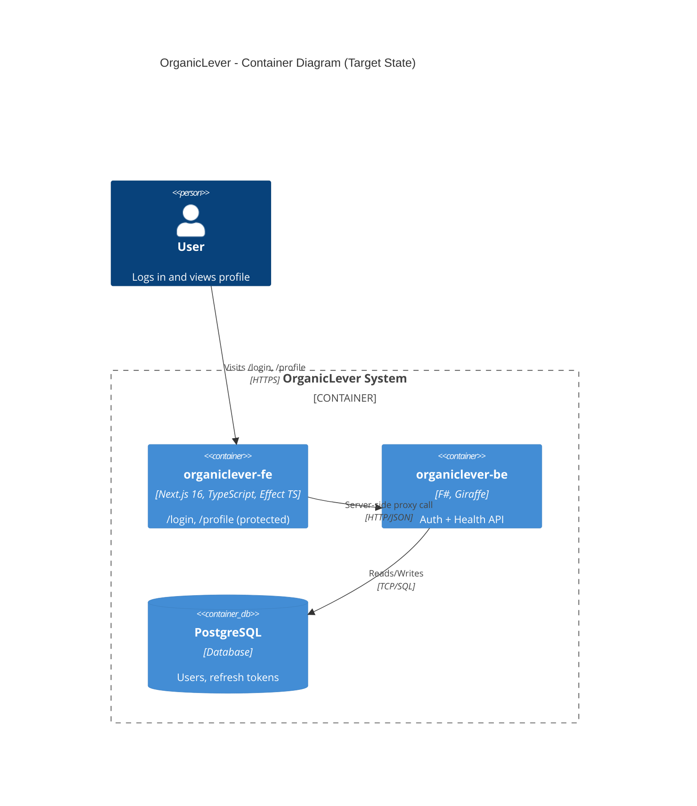

# Technical Documentation: OrganicLever Fullstack Evolution

## Architecture Overview



## Spec Structure (`specs/apps/organiclever/`)

```
specs/apps/organiclever/
├── README.md
├── c4/
│   ├── README.md
│   ├── context.md              # L1: system + user actor
│   ├── container.md            # L2: SPA, API, DB
│   ├── component-be.md         # L3: REST API internals
│   └── component-fe.md         # L3: SPA internals
├── be/
│   ├── README.md
│   └── gherkin/
│       ├── README.md
│       ├── health/
│       │   └── health-check.feature
│       └── authentication/
│           ├── google-login.feature
│           └── me.feature
├── fe/
│   ├── README.md
│   └── gherkin/
│       ├── README.md
│       ├── authentication/
│       │   ├── google-login.feature
│       │   ├── profile.feature
│       │   └── route-protection.feature
│       └── layout/
│           └── accessibility.feature
└── contracts/
    ├── README.md
    ├── openapi.yaml
    ├── .spectral.yaml
    ├── project.json             # Nx project: organiclever-contracts
    ├── paths/
    │   ├── health.yaml
    │   └── auth.yaml
    ├── schemas/
    │   ├── health.yaml
    │   ├── auth.yaml
    │   ├── user.yaml
    │   └── error.yaml
    └── examples/
        └── auth-login.yaml
```

### Domain Table

| Domain         | BE Features | FE Features | Description                                   |
| -------------- | ----------- | ----------- | --------------------------------------------- |
| health         | 1           | --          | Service health status                         |
| authentication | 2           | 3           | Google OAuth login, profile (protected), route protection |
| layout         | --          | 1           | Accessibility (WCAG AA compliance)            |

### Spec Migration Map

| Existing File                                        | Action                                               |
| ---------------------------------------------------- | ---------------------------------------------------- |
| `specs/apps/organiclever-be/health/health-check.feature`    | Move to `be/gherkin/health/health-check.feature`     |
| `specs/apps/organiclever-be/hello/hello-endpoint.feature`   | Remove (replaced by auth/profile flow)               |
| `specs/apps/organiclever-be/auth/*.feature`                 | Rewrite as `be/gherkin/authentication/` (Google OAuth only) |
| `specs/apps/organiclever-web/landing/*.feature`             | Remove (out of scope)                                |
| `specs/apps/organiclever-web/auth/*.feature`                | Rewrite as `fe/gherkin/authentication/` (Google OAuth + profile) |
| `specs/apps/organiclever-web/dashboard/*.feature`           | Remove (out of scope)                                |
| `specs/apps/organiclever-web/members/*.feature`             | Remove (out of scope)                                |
| (new)                                                       | Create `fe/gherkin/authentication/profile.feature`   |
| (new)                                                       | Create `fe/gherkin/authentication/route-protection.feature` |

## Backend Architecture (`apps/organiclever-be`)

### Directory Structure

```
apps/organiclever-be/
├── src/
│   └── OrganicLeverBe/
│       ├── OrganicLeverBe.fsproj         # Project file (inside src/, matching demo pattern)
│       ├── Program.fs                    # Entry point, routing, DI
│       ├── Domain/
│       │   └── Types.fs                  # Core types (User, HealthResponse, DomainError)
│       ├── Auth/
│       │   ├── JwtService.fs             # JWT token generation/validation
│       │   ├── JwtMiddleware.fs          # Bearer token auth middleware
│       │   └── GoogleAuthService.fs      # Google ID token verification
│       ├── Handlers/
│       │   ├── HealthHandler.fs          # GET /api/v1/health -> {"status":"UP"}
│       │   ├── AuthHandler.fs            # POST /auth/google, POST /auth/refresh, GET /auth/me
│       │   └── TestHandler.fs            # Test-only utilities (reset-db)
│       ├── Infrastructure/
│       │   ├── AppDbContext.fs            # EF Core DbContext (PostgreSQL + SQLite for tests)
│       │   ├── Migrator.fs               # DbUp migration runner
│       │   └── Repositories/
│       │       ├── RepositoryTypes.fs    # Repository interfaces as function records
│       │       └── EfRepositories.fs     # EF Core implementations
│       ├── Contracts/
│       │   └── ContractWrappers.fs       # CLIMutable request DTOs from codegen
│       └── db/
│           └── migrations/
│               └── 001-initial-schema.sql  # Minimal schema (embedded resource)
├── tests/
│   └── OrganicLeverBe.Tests/
│       ├── Unit/                         # Mocked repositories, same Gherkin specs
│       │   ├── HealthHandlerTests.fs
│       │   └── AuthHandlerTests.fs
│       └── Integration/                  # Real PostgreSQL, same Gherkin specs
│           ├── HealthIntegrationTests.fs
│           └── AuthIntegrationTests.fs
├── generated-contracts/                  # From OpenAPI codegen (gitignored)
├── project.json
├── global.json
├── docker-compose.integration.yml  # PostgreSQL 17 for integration tests
├── Dockerfile.integration           # Test runner image
├── fsharplint.json
├── dotnet-tools.json
└── README.md
```

### Routing

```fsharp
let webApp : HttpHandler =
    choose [
        subRoute "/api/v1" (choose [
            GET >=> route "/health" >=> HealthHandler.check
            subRoute "/auth" (choose [
                POST >=> route "/google" >=> AuthHandler.googleLogin
                POST >=> route "/refresh" >=> AuthHandler.refresh
                GET >=> route "/me" >=> requireAuth >=> AuthHandler.me
            ])
        ])
    ]
```

### Repository Pattern (Function Records)

Following `demo-be-fsharp-giraffe` pattern: repositories are defined as F# function records
(interfaces) and implemented using EF Core. Handlers receive repositories via DI, making them
easily mockable for unit tests.

`UserRepository` follows the demo exactly. `RefreshTokenRepository` intentionally diverges
from the demo: this app uses single-use refresh token rotation (delete old token, create new
one), which requires `Delete` and `DeleteByUserId` operations rather than the demo's
`Update`/`ListActiveByUser` model. The member names (`FindByTokenHash` vs `FindActiveByHash`)
also reflect this different auth model (Google OAuth vs email/password in the demo).

```fsharp
// Infrastructure/Repositories/RepositoryTypes.fs
type UserRepository = {
    FindById: Guid -> Task<UserEntity option>
    FindByGoogleId: string -> Task<UserEntity option>
    Create: UserEntity -> Task<UserEntity>
    Update: UserEntity -> Task<UserEntity>
}

type RefreshTokenRepository = {
    Create: RefreshTokenEntity -> Task<RefreshTokenEntity>
    FindByTokenHash: string -> Task<RefreshTokenEntity option>
    DeleteByUserId: Guid -> Task<unit>
    Delete: Guid -> Task<unit>
}

```

```fsharp
// Infrastructure/Repositories/EfRepositories.fs
let createUserRepo (db: AppDbContext) : UserRepository = {
    FindById =
        fun id ->
            task {
                let! entity = db.Users.AsNoTracking().FirstOrDefaultAsync(fun u -> u.Id = id)
                if obj.ReferenceEquals(entity, null) then
                    return None
                else
                    return Some entity
            }
    FindByGoogleId =
        fun googleId ->
            task {
                let! entity = db.Users.AsNoTracking().FirstOrDefaultAsync(fun u -> u.GoogleId = googleId)
                if obj.ReferenceEquals(entity, null) then
                    return None
                else
                    return Some entity
            }
    // ...
}
```

**DI registration** in `Program.fs`:

```fsharp
services.AddScoped<UserRepository>(fun sp ->
    createUserRepo (sp.GetRequiredService<AppDbContext>()))
services.AddScoped<RefreshTokenRepository>(fun sp ->
    createRefreshTokenRepo (sp.GetRequiredService<AppDbContext>()))
```

### Three-Level Testing (Same Gherkin Specs)

All three test levels consume the **same Gherkin specs** from `specs/apps/organiclever/be/gherkin/`.
Only the step implementations differ:

| Level       | Target             | DB                   | Repositories          | HTTP       | Gherkin Specs                  |
| ----------- | ------------------ | -------------------- | --------------------- | ---------- | ------------------------------ |
| Unit        | `test:unit`        | SQLite in-memory     | Mocked function records | No HTTP  | `specs/apps/organiclever/be/gherkin/` |
| Integration | `test:integration` | PostgreSQL (Docker)  | Real EF Core           | No HTTP  | `specs/apps/organiclever/be/gherkin/` |
| E2E         | `test:e2e`         | PostgreSQL (Docker)  | Real EF Core           | Playwright | `specs/apps/organiclever/be/gherkin/` |

- **Unit**: Steps call handler/service functions directly with mocked repositories (function
  records with test values). Coverage measured here (90%).
- **Integration**: Steps call handler/service functions with real EF Core repositories against
  PostgreSQL via Docker Compose. No HTTP layer.
- **E2E**: Playwright sends real HTTP requests against a running `organiclever-be` instance.
  Separate project (`organiclever-be-e2e`).

### Contract Types in All Layers

Generated contract types from OpenAPI codegen (`generated-contracts/`) are used throughout:

- **Handlers**: Return contract response types (e.g., `AuthTokenResponse`, `UserProfile`)
- **Tests**: Assert against contract types (unit, integration, E2E all validate same shapes)
- **Frontend**: Consumes the same contract types via `@hey-api/openapi-ts` codegen
- **No hand-written DTOs**: All API request/response types derive from the OpenAPI spec

### Database & Migrations

Following `demo-be-fsharp-giraffe` exactly:

- **ORM**: EF Core 10.x with `Npgsql.EntityFrameworkCore.PostgreSQL`
- **Migrations**: [DbUp](https://dbup.readthedocs.io/) (MIT license) with `dbup-postgresql`
- **Migration files**: `src/OrganicLeverBe/db/migrations/*.sql` (embedded resources)
- **Naming convention**: `NNN-description.sql` (e.g., `001-initial-schema.sql`)
- **Startup behavior**: `Program.fs` runs DbUp against `DATABASE_URL` on startup; idempotent
  (skips already-applied scripts)
- **Test strategy**: Unit tests use SQLite in-memory via `EnsureCreated()` (DbUp does not support
  SQLite); integration tests use real PostgreSQL via Docker Compose and run DbUp normally
- **Google OAuth in integration tests**: `GoogleAuthService.fs` must be injectable/mockable.
  Integration tests inject a stub `GoogleAuthService` that bypasses actual Google token
  verification, accepting a pre-configured test token. `docker-compose.integration.yml`
  sets `GOOGLE_CLIENT_ID=test` and `GOOGLE_CLIENT_SECRET=test`; the stub verifier accepts
  any well-formed token when running in test mode (detected via an `APP_ENV=test` env var).

```fsharp
// Infrastructure/Migrator.fs (simplified)
// Note: The demo (demo-be-fsharp-giraffe) inlines the DbUp call directly in Program.fs
// rather than using a separate Migrator.fs file. This plan deliberately extracts it into
// a dedicated module for clarity and testability — an intentional divergence from the demo.
let runMigrations (connectionString: string) =
    DeployChanges.To
        .PostgresqlDatabase(connectionString)
        .WithScriptsEmbeddedInAssembly(Assembly.GetExecutingAssembly())
        .LogToConsole()
        .Build()
        .PerformUpgrade()
```

```sql
-- db/migrations/001-initial-schema.sql
CREATE TABLE IF NOT EXISTS users (
    id UUID PRIMARY KEY DEFAULT gen_random_uuid(),
    email VARCHAR(255) NOT NULL UNIQUE,
    name VARCHAR(200) NOT NULL,
    avatar_url VARCHAR(500),
    google_id VARCHAR(100) NOT NULL UNIQUE,
    created_at TIMESTAMPTZ NOT NULL DEFAULT NOW(),
    updated_at TIMESTAMPTZ NOT NULL DEFAULT NOW()
);

CREATE TABLE IF NOT EXISTS refresh_tokens (
    id UUID PRIMARY KEY DEFAULT gen_random_uuid(),
    user_id UUID NOT NULL REFERENCES users(id) ON DELETE CASCADE,
    token_hash VARCHAR(255) NOT NULL,
    expires_at TIMESTAMPTZ NOT NULL,
    created_at TIMESTAMPTZ NOT NULL DEFAULT NOW()
);

```

**NuGet packages** (in `OrganicLeverBe.fsproj`):

```xml
<PackageReference Include="Npgsql.EntityFrameworkCore.PostgreSQL" Version="10.*" />
<PackageReference Include="EFCore.NamingConventions" Version="10.*" />
<PackageReference Include="dbup-core" Version="5.*" />
<PackageReference Include="dbup-postgresql" Version="5.*" />
```

**Environment variables**:

| Variable                | Required       | Description                                        |
| ----------------------- | -------------- | -------------------------------------------------- |
| `DATABASE_URL`          | Yes (non-test) | PostgreSQL connection string                       |
| `APP_JWT_SECRET`        | No             | JWT signing secret (dev default provided)          |
| `GOOGLE_CLIENT_ID`      | Yes            | Google OAuth Client ID (from Cloud Console)        |
| `GOOGLE_CLIENT_SECRET`  | Yes            | Google OAuth Client Secret (from Cloud Console)    |

### Nx Targets (project.json)

Following `demo-be-fsharp-giraffe` pattern exactly:

| Target              | Command                                    | Cacheable | Depends On          |
| ------------------- | ------------------------------------------ | --------- | ------------------- |
| `codegen`           | openapi-generator-cli generate             | Yes       | organiclever-contracts:bundle |
| `typecheck`         | dotnet build (warnings as errors)          | Yes       | codegen             |
| `lint`              | fantomas + fsharplint + fsharp-analyzers   | Yes       | --                  |
| `build`             | dotnet publish -c Release                  | Yes       | codegen             |
| `test:unit`         | dotnet test --filter Category=Unit         | Yes       | --                  |
| `test:quick`        | altcover + rhino-cli validate (90%)        | Yes       | --                  |
| `test:integration`  | docker-compose up (real PostgreSQL)        | No        | --                  |
| `dev`               | dotnet watch run (port 8202)               | No        | --                  |
| `start`             | dotnet run (port 8202)                     | No        | --                  |

## Frontend Architecture (`apps/organiclever-fe`)

### BFF Proxy Pattern

All calls from `organiclever-fe` to `organiclever-be` go through Next.js server-side code (Route
Handlers), never directly from the browser. The browser only talks to Next.js; Next.js talks to the
F# backend on the server side.

```
Browser ──GET /profile──▶ Next.js Server Component
                              │
                              ▼ (server-side fetch)
                        Route Handler / Server Action
                              │
                              ▼ (HTTP, server-to-server)
                        organiclever-be:8202
                              │
                              ▼
                        {"name":"Alice","email":"alice@example.com","avatarUrl":"..."}
```

**Why**: Keeps the backend URL private (not exposed to browser), enables server-side caching,
simplifies CORS (no cross-origin from browser), and allows the frontend to add middleware logic
(auth header injection, error normalization) in one place.

### Directory Structure

```
apps/organiclever-fe/
├── src/
│   ├── app/
│   │   ├── api/
│   │   │   └── auth/
│   │   │       ├── google/
│   │   │       │   └── route.ts          # Proxies Google token to backend
│   │   │       ├── refresh/
│   │   │       │   └── route.ts          # Proxies refresh to backend
│   │   │       └── me/
│   │   │           └── route.ts          # Proxies /auth/me to backend
│   │   ├── login/
│   │   │   └── page.tsx                  # /login page (Google OAuth only)
│   │   ├── profile/
│   │   │   └── page.tsx                  # /profile page (protected)
│   │   ├── layout.tsx
│   │   ├── page.tsx                      # Root: redirect to /profile or /login
│   │   ├── globals.css
│   │   └── metadata.ts
│   ├── services/
│   │   ├── errors.ts                     # Effect TS error types
│   │   ├── backend-client.ts             # Server-side HTTP client to organiclever-be (Effect)
│   │   └── auth-service.ts              # Auth service (Google login, refresh, me/profile)
│   ├── layers/
│   │   ├── backend-client-live.ts        # Live HTTP layer (server-side only)
│   │   └── backend-client-test.ts        # Mock layer for tests
│   ├── components/
│   │   └── ui/                           # shadcn/ui components (with .stories.tsx)
│   └── generated-contracts/              # From OpenAPI codegen (gitignored)
├── .storybook/
│   ├── main.ts                           # Storybook config (@storybook/nextjs-vite)
│   └── preview.ts                        # Global decorators, theme
├── test/
│   ├── setup.ts
│   ├── unit/
│   │   ├── auth-service.unit.test.ts
│   │   └── steps/
│   │       └── layout/
│   │           └── accessibility.steps.tsx  # Gherkin accessibility tests
│   └── integration/
│       └── profile-page.integration.test.tsx
├── project.json
├── package.json
├── next.config.ts
├── tsconfig.json
├── vitest.config.ts
└── README.md
```

### Effect TS Service Layer (Server-Side)

The Effect TS service layer runs on the Next.js server, not in the browser. It handles all
communication with `organiclever-be`.

```typescript
// services/errors.ts
import { Data } from "effect"

export class NetworkError extends Data.TaggedError("NetworkError")<{
  readonly status: number
  readonly message: string
}> {}

export class ApiError extends Data.TaggedError("ApiError")<{
  readonly code: string
  readonly message: string
}> {}

// services/backend-client.ts
import { Effect, Context } from "effect"
import type { NetworkError } from "./errors"

// Server-side only: calls organiclever-be using ORGANICLEVER_BE_URL env var
export class BackendClient extends Context.Tag("BackendClient")<
  BackendClient,
  {
    readonly get: (path: string) => Effect.Effect<unknown, NetworkError>
  }
>() {}

// services/auth-service.ts
import { Effect, Context } from "effect"
import { BackendClient } from "./backend-client"
import type { NetworkError } from "./errors"
import type { UserProfile } from "@/generated-contracts"  // from OpenAPI codegen

export class AuthService extends Context.Tag("AuthService")<
  AuthService,
  {
    readonly googleLogin: (idToken: string) => Effect.Effect<AuthTokenResponse, NetworkError>
    readonly refresh: (refreshToken: string) => Effect.Effect<AuthTokenResponse, NetworkError>
    readonly getProfile: () => Effect.Effect<UserProfile, NetworkError>
  }
>() {}

// Implementation uses BackendClient to call organiclever-be auth endpoints
```

### Profile Page (Server Component, Protected)

The `/profile` page is a **Server Component** -- it calls `GET /api/v1/auth/me` via the Effect
service layer on the server side. If the user is not authenticated, it redirects to `/login`.

```tsx
// app/profile/page.tsx
import { redirect } from "next/navigation"
import { Effect, Exit } from "effect"
import { AuthService } from "@/services/auth-service"
import { BackendClientLive } from "@/layers/backend-client-live"

export default async function ProfilePage() {
  const program = Effect.gen(function* () {
    const authService = yield* AuthService
    return yield* authService.getProfile()
  }).pipe(Effect.provide(BackendClientLive))

  const exit = await Effect.runPromiseExit(program)

  if (!Exit.isSuccess(exit)) {
    redirect("/login")
  }

  const profile = exit.value
  return (
    <div>
      
      <h1>{profile.name}</h1>
      <p>{profile.email}</p>
    </div>
  )
}
```

### Route Handler (API Proxy)

For any client-side code that needs backend data, Route Handlers act as the proxy layer:

```typescript
// app/api/auth/me/route.ts
import { NextResponse } from "next/server"
import { Effect, Exit } from "effect"
import { AuthService } from "@/services/auth-service"
import { BackendClientLive } from "@/layers/backend-client-live"

export async function GET() {
  const program = Effect.gen(function* () {
    const authService = yield* AuthService
    return yield* authService.getProfile()
  }).pipe(Effect.provide(BackendClientLive))

  const exit = await Effect.runPromiseExit(program)

  if (!Exit.isSuccess(exit)) {
    return NextResponse.json({ error: "Unauthorized" }, { status: 401 })
  }

  return NextResponse.json(exit.value)
}
```

### Environment Variables

| Variable               | Scope       | Description                                    |
| ---------------------- | ----------- | ---------------------------------------------- |
| `ORGANICLEVER_BE_URL`  | Server-only | Backend base URL (e.g., `http://localhost:8202`) |

This variable is **not** prefixed with `NEXT_PUBLIC_` -- it is only available on the server side,
keeping the backend URL private from the browser.

### Nx Targets (project.json)

Following `demo-fe-ts-nextjs` pattern:

| Target              | Command                                    | Cacheable | Depends On          |
| ------------------- | ------------------------------------------ | --------- | ------------------- |
| `codegen`           | @hey-api/openapi-ts                        | Yes       | organiclever-contracts:bundle |
| `typecheck`         | tsc --noEmit                               | Yes       | codegen             |
| `lint`              | oxlint --jsx-a11y-plugin                   | Yes       | --                  |
| `build`             | next build                                 | Yes       | codegen             |
| `test:unit`         | vitest run --project unit                  | Yes       | --                  |
| `test:quick`        | vitest coverage + rhino-cli validate (70%) | Yes       | --                  |
| `test:integration`  | vitest run --project integration (MSW)     | Yes       | --                  |
| `storybook`         | storybook dev (port 6006)                  | No        | --                  |
| `build-storybook`   | storybook build                            | Yes       | --                  |
| `dev`               | next dev --port 3200                       | No        | --                  |
| `start`             | next start --port 3200                     | No        | --                  |

## E2E Test Apps

### `apps/organiclever-be-e2e/`

```
apps/organiclever-be-e2e/
├── features/                     # Generated by bddgen from specs
├── steps/                        # Step definitions
│   ├── health.steps.ts
│   ├── google-login.steps.ts
│   └── me.steps.ts
├── playwright.config.ts
├── project.json
├── package.json
├── tsconfig.json
└── README.md
```

Targets: `install`, `lint`, `typecheck`, `test:quick`, `test:e2e`, `test:e2e:ui`

Tags: `type:e2e`, `platform:playwright`, `lang:ts`, `domain:organiclever-be`

### `apps/organiclever-fe-e2e/`

```
apps/organiclever-fe-e2e/
├── features/                     # Generated by bddgen from specs
├── steps/                        # Step definitions
│   ├── google-login.steps.ts
│   ├── profile.steps.ts
│   ├── route-protection.steps.ts
│   └── accessibility.steps.ts
├── playwright.config.ts
├── project.json
├── package.json
├── tsconfig.json
└── README.md
```

Targets: `install`, `lint`, `typecheck`, `test:quick`, `test:e2e`, `test:e2e:ui`

Tags: `type:e2e`, `platform:playwright`, `lang:ts`, `domain:organiclever-fe`

## CI/CD Pipelines

### GitHub Actions Workflows

#### `test-organiclever-be.yml` (new)

Follows `test-demo-be-fsharp-giraffe.yml` pattern:

- **Trigger**: Cron 2x daily (06:00 WIB, 18:00 WIB) + workflow_dispatch
- **Job 1 -- Integration**: Docker Compose PostgreSQL, `nx run organiclever-be:test:integration`
- **Job 2 -- E2E**: Start backend, wait for readiness, `nx run organiclever-be-e2e:test:e2e`
- **Runtimes**: .NET 10, Node.js 24

#### `test-organiclever-fe.yml` (new, replaces `test-organiclever-web.yml`)

Follows `test-demo-fe-*.yml` pattern:

- **Trigger**: Cron 2x daily + workflow_dispatch
- **Job 1 -- Integration**: `nx run organiclever-fe:test:integration`
- **Job 2 -- E2E**: Start backend + frontend, wait for readiness,
  `nx run organiclever-fe-e2e:test:e2e`
- **Runtimes**: .NET 10, Node.js 24

#### Updates to Existing Workflows

- **`main-ci.yml`**: No changes needed (`nx affected` picks up new projects automatically)
- **`pr-quality-gate.yml`**: No changes needed (same reason)
- **`test-organiclever-web.yml`**: Delete (replaced by `test-organiclever-fe.yml`)

### Vercel Deployment

**Out of scope** for this plan. organiclever.com is expected to break during this transition.
Deployment (production branches, Vercel project settings, deployer agents) will be addressed in a
follow-up plan.

## OpenAPI Contract

```yaml
# specs/apps/organiclever/contracts/openapi.yaml
openapi: "3.1.0"
info:
  title: OrganicLever API
  version: "1.0.0"
  description: REST API for OrganicLever productivity platform
servers:
  - url: http://localhost:8202
    description: Local development
paths:
  /api/v1/health:
    $ref: "./paths/health.yaml#/~1api~1v1~1health"
  /api/v1/auth/google:
    $ref: "./paths/auth.yaml#/~1api~1v1~1auth~1google"
  /api/v1/auth/refresh:
    $ref: "./paths/auth.yaml#/~1api~1v1~1auth~1refresh"
  /api/v1/auth/me:
    $ref: "./paths/auth.yaml#/~1api~1v1~1auth~1me"
```

The `$ref` fragments use JSON Pointer URL-encoding (`~1` = `/`), matching the demo pattern.
Path files use the full path as the top-level key:

```yaml
# specs/apps/organiclever/contracts/paths/health.yaml
/api/v1/health:
  get:
    summary: Health check
    # ...
```

```yaml
# specs/apps/organiclever/contracts/paths/auth.yaml
/api/v1/auth/google:
  post:
    summary: Google OAuth login
    # ...
/api/v1/auth/refresh:
  post:
    summary: Refresh access token
    # ...
/api/v1/auth/me:
  get:
    summary: Get authenticated user profile
    # ...
```

This follows the same pattern used in `specs/apps/demo/contracts/paths/`.

## Technology Stack

| Component          | Technology                   | Version | Notes                        |
| ------------------ | ---------------------------- | ------- | ---------------------------- |
| Backend runtime    | .NET                         | 10.0    | LTS                          |
| Backend web        | Giraffe                      | 7.x     | Functional HttpHandler       |
| Backend ORM        | EF Core (Npgsql)             | 10.x    | PostgreSQL provider          |
| Backend migrations | DbUp (dbup-postgresql)       | 5.x     | SQL file migrations (matches demo-be-fsharp-giraffe) |
| Backend JSON       | FSharp.SystemTextJson         | 1.*     | F# type serialization (matches demo-be-fsharp-giraffe) |
| Backend lint       | Fantomas, FSharpLint         | Latest  | Formatting + style           |
| Backend coverage   | AltCover                     | Latest  | 90% line coverage            |
| Frontend runtime   | Node.js                      | 24.x    | LTS via Volta                |
| Frontend web       | Next.js                      | 16.x    | App Router, RSC              |
| Frontend lang      | TypeScript                   | 5.x     | Strict mode                  |
| Frontend effects   | Effect TS                    | Latest  | Error handling, DI           |
| Frontend UI        | shadcn/ui, Tailwind v4       | Latest  | Component library            |
| Frontend testing   | Vitest, MSW                  | Latest  | Unit + integration           |
| Database           | PostgreSQL                   | 17.x    | Initially minimal            |
| Contract           | OpenAPI                      | 3.1     | API-first design             |
| Codegen (BE)       | openapi-generator-cli        | Latest  | fsharp-giraffe-server        |
| Codegen (FE)       | @hey-api/openapi-ts          | Latest  | TypeScript fetch client      |
| E2E                | Playwright + bddgen          | Latest  | Gherkin-driven browser tests |

## Local Development Infrastructure (`infra/dev/organiclever/`)

Replaces `infra/dev/organiclever-web/`. The new setup runs both backend and frontend together
with PostgreSQL for local development.

```
infra/dev/organiclever/
├── README.md
├── .env.example
├── .gitignore
├── docker-compose.yml           # Full stack: BE + FE + PostgreSQL
├── docker-compose.ci.yml        # CI variant (integration + E2E tests)
├── Dockerfile.be.dev            # F# backend dev image
└── Dockerfile.fe.dev            # Next.js frontend dev image
```

### Docker Compose Services

```yaml
# docker-compose.yml
services:
  organiclever-db:
    image: postgres:17-alpine
    ports: ["5432:5432"]
    environment:
      POSTGRES_USER: organiclever
      POSTGRES_PASSWORD: organiclever
      POSTGRES_DB: organiclever

  organiclever-be:
    build:
      context: .
      dockerfile: Dockerfile.be.dev
    ports: ["8202:8202"]
    environment:
      DATABASE_URL: "Host=organiclever-db;Port=5432;Database=organiclever;Username=organiclever;Password=organiclever"
    depends_on: [organiclever-db]
    volumes:
      - ../../../apps/organiclever-be:/workspace:rw

  organiclever-fe:
    build:
      context: .
      dockerfile: Dockerfile.fe.dev
    ports: ["3200:3200"]
    environment:
      ORGANICLEVER_BE_URL: "http://organiclever-be:8202"
    depends_on: [organiclever-be]
    volumes:
      - ../../../apps/organiclever-fe:/workspace:rw
```

### npm Scripts (package.json root)

| Script                        | Command                                                  |
| ----------------------------- | -------------------------------------------------------- |
| `organiclever:dev`            | `docker compose -f infra/dev/organiclever/docker-compose.yml up --build` |
| `organiclever:dev:restart`    | `docker compose -f ... down -v && docker compose -f ... up --build` |

### Port Assignments

| Service          | Port |
| ---------------- | ---- |
| organiclever-db  | 5432 |
| organiclever-be  | 8202 |
| organiclever-fe  | 3200 |

## Files to Update (Complete Inventory)

### Agents (`.claude/agents/`)

| File                                    | Action                                      |
| --------------------------------------- | ------------------------------------------- |
| `apps-organiclever-web-deployer.md`     | Rename to `apps-organiclever-fe-deployer.md`, update content |
| `README.md`                             | Update agent listings                       |
| `specs-maker.md`                        | Update example references                   |

### Skills (`.claude/skills/`)

| File/Directory                                      | Action                                      |
| --------------------------------------------------- | ------------------------------------------- |
| `apps-organiclever-web-developing-content/`         | Rename to `apps-organiclever-fe-developing-content/`, rewrite SKILL.md |

### CLAUDE.md

| Section                | Change                                              |
| ---------------------- | --------------------------------------------------- |
| Current Apps list      | Replace `organiclever-web` with `organiclever-fe` + `organiclever-be` |
| Project Structure      | Add `organiclever-be`, rename `organiclever-web`    |
| Coverage sections      | Update F# and TypeScript sections                   |
| Caching sections       | Add `organiclever-fe` MSW caching note              |
| Git Workflow           | Update production branch name                       |
| Hugo Sites section     | Rename organiclever-web section                     |
| AI Agents section      | Update deployer agent name                          |

### Governance (`governance/`)

14+ files referencing `organiclever-web` -- all need `organiclever-web` -> `organiclever-fe`
replacement and addition of `organiclever-be` where backend apps are listed.

### Docs (`docs/`)

14+ files referencing `organiclever-web` -- same replacement needed.

### GitHub Workflows (`.github/workflows/`)

| File                           | Action                                        |
| ------------------------------ | --------------------------------------------- |
| `test-organiclever-web.yml`    | Delete                                        |
| `test-organiclever-be.yml`     | Create (backend integration + E2E)            |
| `test-organiclever-fe.yml`     | Create (frontend integration + E2E)           |

### Apps

| Directory                | Action                               |
| ------------------------ | ------------------------------------ |
| `apps/organiclever-web/` | Archive to `archived/organiclever-web/` |
| `apps/organiclever-web-e2e/` | Remove (replaced by `organiclever-fe-e2e`) |
| `apps/organiclever-fe/`  | Create new                           |
| `apps/organiclever-be/`  | Create new                           |
| `apps/organiclever-fe-e2e/` | Create new                        |
| `apps/organiclever-be-e2e/` | Create new                        |

### Infra

| Directory                           | Action                                        |
| ----------------------------------- | --------------------------------------------- |
| `infra/dev/organiclever-web/`       | Remove (replaced by `infra/dev/organiclever/`) |
| `infra/dev/organiclever/`           | Create new (BE + FE + PostgreSQL)             |

### Specs

| Directory                        | Action                             |
| -------------------------------- | ---------------------------------- |
| `specs/apps/organiclever-be/`    | Delete after migration             |
| `specs/apps/organiclever-web/`   | Delete after migration             |
| `specs/apps/organiclever/`       | Create new unified structure       |

### npm Scripts (package.json root)

| Script                                      | Action                                      |
| ------------------------------------------- | ------------------------------------------- |
| `organiclever-web:dev`                      | Remove                                      |
| `organiclever-web:dev:restart`              | Remove                                      |
| `organiclever:dev`                          | Create (docker compose for full stack)      |
| `organiclever:dev:restart`                  | Create (down -v + up --build)               |
