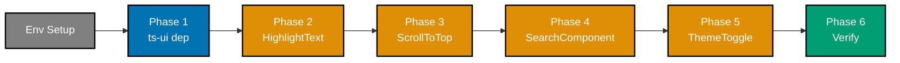

# Delivery Checklist — wahidyankf-web Component Migration to ts-ui

## Delivery Overview

**Migration phases** — each phase must complete and typecheck clean before the next starts:

<!-- Uses colors: Orange #DE8F05 (migration), Blue #0173B2 (dep/verify), Gray #808080 (setup), Teal #029E73 (verify) -->



**Quality gates and deployment** — all local gates pass before push; CI triggered manually
after push; deploy runs automatically when CI is green and changes detected:

```mermaid
graph LR
    lqa["Local QA"]:::blue
    commit["Atomic Commit<br/>Phases 2-5"]:::blue
    ui["Manual UI<br/>Verify"]:::blue
    push["Push to main"]:::purple
    ci["GitHub Actions<br/>CI trigger"]:::purple
    deploy["Deploy<br/>prod branch"]:::teal
    smoke["Prod Smoke<br/>Test"]:::teal
    archive["Plan Archival"]:::brown

    lqa --> commit --> ui --> push --> ci --> deploy --> smoke --> archive

    classDef blue fill:#0173B2,stroke:#000000,color:#FFFFFF,stroke-width:2px
    classDef purple fill:#CC78BC,stroke:#000000,color:#FFFFFF,stroke-width:2px
    classDef teal fill:#029E73,stroke:#000000,color:#FFFFFF,stroke-width:2px
    classDef brown fill:#CA9161,stroke:#000000,color:#FFFFFF,stroke-width:2px
```

<!-- Uses colors: Blue #0173B2 (local), Purple #CC78BC (CI/push), Teal #029E73 (prod), Brown #CA9161 (archive) -->



---

## Environment Setup

- [ ] Confirm working directory is `ose-public` subrepo root
- [ ] Run `npm install` in `ose-public/` to install dependencies
- [ ] Run `npm run doctor -- --fix` to converge the full polyglot toolchain (required — the
      `postinstall` hook runs `doctor || true` and silently tolerates drift; see
      [Worktree Toolchain Initialization](../../../governance/development/workflow/worktree-setup.md))
- [ ] Verify dev server starts: `nx dev wahidyankf-web`
- [ ] Run existing tests to establish baseline:
  - [ ] `npx nx run wahidyankf-web:test:quick`
  - [ ] `npx nx run ts-ui:test:quick`
- [ ] Note any preexisting failures before touching any files

---

## Phase 1 — Add ts-ui Workspace Dependency to wahidyankf-web

- [ ] Open `apps/wahidyankf-web/package.json`
- [ ] Add `"@open-sharia-enterprise/ts-ui": "*"` to the `dependencies` block, inserted
      alphabetically between `@next/third-parties` and `class-variance-authority`:

  ```json
  "@open-sharia-enterprise/ts-ui": "*",
  ```

- [ ] Verify no duplicate entries exist in `dependencies` after the edit
- [ ] Commit: `chore(wahidyankf-web): add @open-sharia-enterprise/ts-ui workspace dependency`

---

## Phase 2 — Migrate HighlightText

- [ ] Create directory `libs/ts-ui/src/components/highlight-text/`
- [ ] Copy `apps/wahidyankf-web/src/components/HighlightText.tsx` to
      `libs/ts-ui/src/components/highlight-text/highlight-text.tsx` and refactor to accept
      flexible props (e.g. `highlightClassName` for the mark element styles) with current
      hardcoded values as defaults
- [ ] Copy `apps/wahidyankf-web/src/components/HighlightText.unit.test.tsx` to
      `libs/ts-ui/src/components/highlight-text/highlight-text.unit.test.tsx`
- [ ] In `libs/ts-ui/src/components/highlight-text/highlight-text.unit.test.tsx`, update line 4:

  Before:

  ```ts
  import { HighlightText, highlightText } from "./HighlightText";
  ```

  After:

  ```ts
  import { HighlightText, highlightText } from "./highlight-text";
  ```

- [ ] Append to `libs/ts-ui/src/index.ts`:

  ```ts
  export { HighlightText, highlightText } from "./components/highlight-text/highlight-text";
  ```

- [ ] Update `apps/wahidyankf-web/src/app/page.tsx` — add a new import for `HighlightText`
      from ts-ui and retain the existing `SearchComponent` local import (the `SearchComponent`
      import line stays unchanged in this phase and will be consolidated in Phase 4). Replace
      lines 16–17:

  Before:

  ```ts
  import { SearchComponent } from "@/components/SearchComponent";
  import { HighlightText } from "@/components/HighlightText";
  ```

  After (intermediate state — `HighlightText` now comes from ts-ui; `SearchComponent` keeps
  its local import path until Phase 4):

  ```ts
  import { HighlightText } from "@open-sharia-enterprise/ts-ui";
  import { SearchComponent } from "@/components/SearchComponent";
  ```

  > **Multi-phase note:** Only the `HighlightText` import changes in this phase. Keep the local
  > `SearchComponent` import on its own line — do not remove or consolidate it here.
  > `SearchComponent` will be resolved in Phase 4. The important constraint is that by the end
  > of Phase 4, `page.tsx` reads:
  >
  > ```ts
  > import { SearchComponent, HighlightText } from "@open-sharia-enterprise/ts-ui";
  > ```

- [ ] Update `apps/wahidyankf-web/src/app/cv/page.tsx` — replace lines 35–36:

  Before:

  ```ts
  import { SearchComponent } from "@/components/SearchComponent";
  import { HighlightText } from "@/components/HighlightText";
  ```

  After (intermediate state — `HighlightText` now comes from ts-ui; `SearchComponent` keeps
  its local import path until Phase 4):

  ```ts
  import { HighlightText } from "@open-sharia-enterprise/ts-ui";
  import { SearchComponent } from "@/components/SearchComponent";
  ```

  > **Multi-phase note:** Only the `HighlightText` import changes in this phase. Keep the local
  > `SearchComponent` import on its own line — do not remove or consolidate it here.
  > `SearchComponent` will be resolved in Phase 4. The important constraint is that by the end
  > of Phase 4, `cv/page.tsx` reads:
  >
  > ```ts
  > import { SearchComponent, HighlightText } from "@open-sharia-enterprise/ts-ui";
  > ```

- [ ] Update `apps/wahidyankf-web/src/app/personal-projects/page.tsx` — replace lines 8–9:

  Before:

  ```ts
  import { SearchComponent } from "@/components/SearchComponent";
  import { HighlightText } from "@/components/HighlightText";
  ```

  After (intermediate state — `HighlightText` now comes from ts-ui; `SearchComponent` keeps
  its local import path until Phase 4):

  ```ts
  import { HighlightText } from "@open-sharia-enterprise/ts-ui";
  import { SearchComponent } from "@/components/SearchComponent";
  ```

  > **Multi-phase note:** Only the `HighlightText` import changes in this phase. Keep the local
  > `SearchComponent` import on its own line — do not remove or consolidate it here.
  > `SearchComponent` will be resolved in Phase 4. The important constraint is that by the end
  > of Phase 4, `personal-projects/page.tsx` reads:
  >
  > ```ts
  > import { SearchComponent, HighlightText } from "@open-sharia-enterprise/ts-ui";
  > ```

- [ ] Update `apps/wahidyankf-web/src/utils/markdown.tsx` — replace line 2:

  Before:

  ```ts
  import { HighlightText } from "@/components/HighlightText";
  ```

  After:

  ```ts
  import { HighlightText } from "@open-sharia-enterprise/ts-ui";
  ```

- [ ] Verify the new ts-ui file compiles before deleting the source:

  ```bash
  npx nx run ts-ui:typecheck
  ```

  Confirm zero type errors before proceeding to the delete steps.

- [ ] Delete `apps/wahidyankf-web/src/components/HighlightText.tsx`
- [ ] Delete `apps/wahidyankf-web/src/components/HighlightText.unit.test.tsx`

- [ ] Run affected typecheck to catch any type errors introduced in this phase before
      proceeding:

  ```bash
  npx nx affected -t typecheck
  ```

  Fix ALL failures before moving on to Phase 3.

---

## Phase 3 — Migrate ScrollToTop

- [ ] Create directory `libs/ts-ui/src/components/scroll-to-top/`
- [ ] Copy `apps/wahidyankf-web/src/components/ScrollToTop.tsx` to
      `libs/ts-ui/src/components/scroll-to-top/scroll-to-top.tsx` and refactor to accept
      flexible props (e.g. `threshold`, `className`, `buttonClassName`) with current hardcoded
      values as defaults
      (the `"use client";` directive at line 1 remains in place)
- [ ] Copy `apps/wahidyankf-web/src/components/ScrollToTop.unit.test.tsx` to
      `libs/ts-ui/src/components/scroll-to-top/scroll-to-top.unit.test.tsx`
- [ ] In `libs/ts-ui/src/components/scroll-to-top/scroll-to-top.unit.test.tsx`, update line 4:

  Before:

  ```ts
  import ScrollToTop from "./ScrollToTop";
  ```

  After:

  ```ts
  import ScrollToTop from "./scroll-to-top";
  ```

- [ ] Append to `libs/ts-ui/src/index.ts`:

  ```ts
  export { default as ScrollToTop } from "./components/scroll-to-top/scroll-to-top";
  ```

- [ ] Update `apps/wahidyankf-web/src/app/layout.tsx` — replace lines 4–5:

  Before:

  ```ts
  import ScrollToTop from "@/components/ScrollToTop";
  import ThemeToggle from "@/components/ThemeToggle";
  ```

  After (add `ScrollToTop` from ts-ui; `ThemeToggle` still references local path and will be
  resolved in Phase 5 — it is acceptable to update both on this file in Phase 5 in one pass):

  ```ts
  import { ScrollToTop } from "@open-sharia-enterprise/ts-ui";
  import ThemeToggle from "@/components/ThemeToggle";
  ```

  > **Multi-phase note:** By end of Phase 5, `layout.tsx` must read:
  >
  > ```ts
  > import { ScrollToTop, ThemeToggle } from "@open-sharia-enterprise/ts-ui";
  > ```

- [ ] Verify the new ts-ui file compiles before deleting the source:

  ```bash
  npx nx run ts-ui:typecheck
  ```

  Confirm zero type errors before proceeding to the delete steps.

- [ ] Delete `apps/wahidyankf-web/src/components/ScrollToTop.tsx`
- [ ] Delete `apps/wahidyankf-web/src/components/ScrollToTop.unit.test.tsx`

- [ ] Run affected typecheck to catch any type errors introduced in this phase before
      proceeding:

  ```bash
  npx nx affected -t typecheck
  ```

  Fix ALL failures before moving on to Phase 4.

---

## Phase 4 — Migrate SearchComponent

- [ ] Create directory `libs/ts-ui/src/components/search-component/`
- [ ] Copy `apps/wahidyankf-web/src/components/SearchComponent.tsx` to
      `libs/ts-ui/src/components/search-component/search-component.tsx` and refactor to accept
      flexible props (e.g. `className`, `inputClassName`, `clearButtonClassName`) with current
      hardcoded values as defaults
- [ ] Copy `apps/wahidyankf-web/src/components/SearchComponent.unit.test.tsx` to
      `libs/ts-ui/src/components/search-component/search-component.unit.test.tsx`
- [ ] In `libs/ts-ui/src/components/search-component/search-component.unit.test.tsx`, update
      line 4:

  Before:

  ```ts
  import { SearchComponent } from "./SearchComponent";
  ```

  After:

  ```ts
  import { SearchComponent } from "./search-component";
  ```

- [ ] Append to `libs/ts-ui/src/index.ts`:

  ```ts
  export { SearchComponent } from "./components/search-component/search-component";
  ```

- [ ] Update `apps/wahidyankf-web/src/app/page.tsx` — consolidate to single ts-ui import:

  Final state of the two import lines:

  ```ts
  import { SearchComponent, HighlightText } from "@open-sharia-enterprise/ts-ui";
  ```

  (Remove the temporary split from Phase 2 if done in two passes, or apply directly if doing
  both components in one edit.)

- [ ] Update `apps/wahidyankf-web/src/app/cv/page.tsx` — same consolidation:

  ```ts
  import { SearchComponent, HighlightText } from "@open-sharia-enterprise/ts-ui";
  ```

- [ ] Update `apps/wahidyankf-web/src/app/personal-projects/page.tsx` — same consolidation:

  ```ts
  import { SearchComponent, HighlightText } from "@open-sharia-enterprise/ts-ui";
  ```

- [ ] Verify the new ts-ui file compiles before deleting the source:

  ```bash
  npx nx run ts-ui:typecheck
  ```

  Confirm zero type errors before proceeding to the delete steps.

- [ ] Delete `apps/wahidyankf-web/src/components/SearchComponent.tsx`
- [ ] Delete `apps/wahidyankf-web/src/components/SearchComponent.unit.test.tsx`

- [ ] Run affected typecheck to catch any type errors introduced in this phase before
      proceeding:

  ```bash
  npx nx affected -t typecheck
  ```

  Fix ALL failures before moving on to Phase 5.

---

## Phase 5 — Migrate ThemeToggle

- [ ] Create directory `libs/ts-ui/src/components/theme-toggle/`
- [ ] Copy `apps/wahidyankf-web/src/components/ThemeToggle.tsx` to
      `libs/ts-ui/src/components/theme-toggle/theme-toggle.tsx` and refactor to accept
      flexible props (e.g. `className`) with current hardcoded values as defaults
      (the `"use client";` directive at line 1 remains in place)
- [ ] Copy `apps/wahidyankf-web/src/components/ThemeToggle.unit.test.tsx` to
      `libs/ts-ui/src/components/theme-toggle/theme-toggle.unit.test.tsx`
- [ ] In `libs/ts-ui/src/components/theme-toggle/theme-toggle.unit.test.tsx`, update line 3:

  Before:

  ```ts
  import ThemeToggle from "./ThemeToggle";
  ```

  After:

  ```ts
  import ThemeToggle from "./theme-toggle";
  ```

- [ ] Append to `libs/ts-ui/src/index.ts`:

  ```ts
  export { default as ThemeToggle } from "./components/theme-toggle/theme-toggle";
  ```

- [ ] Update `apps/wahidyankf-web/src/app/layout.tsx` — consolidate to single ts-ui import:

  Final state:

  ```ts
  import { ScrollToTop, ThemeToggle } from "@open-sharia-enterprise/ts-ui";
  ```

- [ ] Verify the new ts-ui file compiles before deleting the source:

  ```bash
  npx nx run ts-ui:typecheck
  ```

  Confirm zero type errors before proceeding to the delete steps.

- [ ] Delete `apps/wahidyankf-web/src/components/ThemeToggle.tsx`
- [ ] Delete `apps/wahidyankf-web/src/components/ThemeToggle.unit.test.tsx`

- [ ] Run affected typecheck to catch any type errors introduced in this phase before
      committing:

  ```bash
  npx nx affected -t typecheck
  ```

  Fix ALL failures before committing.

---

## Phase 6 — Verify Remaining components/

- [ ] Confirm `lucide-react` is present in `libs/ts-ui/package.json` dependencies (required by
      `SearchComponent` and `ScrollToTop` — pre-verified during plan authoring, but a
      defensive check prevents silent breakage):

  ```bash
  grep "lucide-react" libs/ts-ui/package.json
  ```

  Expected: one line showing `"lucide-react": "^0.447.0"` (or similar semver).

- [ ] Confirm `apps/wahidyankf-web/src/components/` contains exactly two files:
  - `Navigation.tsx`
  - `Navigation.unit.test.tsx`
- [ ] Confirm no stale imports to deleted files remain:

  ```bash
  grep -r "@/components/HighlightText\|@/components/ScrollToTop\|@/components/SearchComponent\|@/components/ThemeToggle" apps/wahidyankf-web/src/
  ```

  Expected output: zero matches.

- [ ] Confirm ts-ui index.ts now contains all four new export lines:

  ```bash
  grep -E "highlight-text|scroll-to-top|search-component|theme-toggle" libs/ts-ui/src/index.ts
  ```

  Expected: four lines, one per component.

- [ ] Confirm ts-ui index.ts exports all four components by name:

  ```bash
  grep -E "HighlightText|ScrollToTop|SearchComponent|ThemeToggle" libs/ts-ui/src/index.ts
  ```

  Expected: four lines, one per export name.

---

## Local Quality Gates (Before Push)

- [ ] Run typecheck for affected projects:

  ```bash
  npx nx affected -t typecheck
  ```

- [ ] Run linting for affected projects:

  ```bash
  npx nx affected -t lint
  ```

- [ ] Run quick tests for affected projects:

  ```bash
  npx nx affected -t test:quick
  ```

- [ ] Run spec-coverage for affected projects:

  ```bash
  npx nx affected -t spec-coverage
  ```

- [ ] Fix ALL failures — including preexisting issues not caused by your changes
- [ ] Re-run failing checks to confirm resolution
- [ ] Verify zero failures before pushing

> **Important**: Fix ALL failures found during quality gates, not just those caused by your
> changes. This follows the root cause orientation principle — proactively fix preexisting errors
> encountered during work. Do not defer or skip existing issues. Commit preexisting fixes
> separately with appropriate conventional commit messages.

---

## Commit Guidelines

- [ ] Commit changes thematically — group related changes into logically cohesive commits
- [ ] Follow Conventional Commits format: `<type>(<scope>): <description>`
- [ ] Split different domains/concerns into separate commits
- [ ] Preexisting fixes get their own commits, separate from plan work
- [ ] Do NOT bundle unrelated changes into a single commit

Suggested commit sequence:

1. `chore(wahidyankf-web): add @open-sharia-enterprise/ts-ui workspace dependency`
2. `feat(ts-ui): migrate HighlightText, ScrollToTop, SearchComponent, ThemeToggle from wahidyankf-web`
   (All four component migrations — Phases 2–5 — are bundled into one atomic commit. This is
   intentional: intermediate states leave ts-ui exports incomplete and wahidyankf-web still
   referencing deleted files, which would break typecheck between phases. The single commit
   avoids shipping a broken intermediate state to `main`.)
3. Any preexisting fix commits (separate, labelled accordingly)

- [ ] After completing Phase 5 quality checks above, make the Phase 2–5 atomic commit:
      `feat(ts-ui): migrate HighlightText, ScrollToTop, SearchComponent, ThemeToggle from wahidyankf-web`

---

## Manual UI Verification (Playwright MCP)

- [ ] Start dev server: `nx dev wahidyankf-web`
- [ ] Navigate to the home page via `browser_navigate` (`http://localhost:3201`)
- [ ] Inspect DOM via `browser_snapshot` — verify search bar and highlight functionality render
- [ ] Navigate to the CV page (`http://localhost:3201/cv`) — verify search bar renders and
      highlight text works on all CV entries
- [ ] Navigate to the personal-projects page (`http://localhost:3201/personal-projects`) —
      verify search bar renders and highlight text works on project entries
- [ ] Interact with `ThemeToggle` via `browser_click` — verify dark/light toggle switches
      correctly
- [ ] Scroll down on any page and verify the `ScrollToTop` button appears; click it and verify
      scroll-to-top behaviour
- [ ] Enter text in the search bar on any listing page — verify highlighted matches appear
      using `HighlightText`
- [ ] Check for JS errors via `browser_console_messages` — must be zero errors (this is a pure
      UI migration with no API changes, so no network-request verification is needed)
- [ ] Take screenshots via `browser_take_screenshot` for visual reference
- [ ] Document verification results in this checklist

---

## Post-Push: Trigger GitHub Actions CI

`test-and-deploy-wahidyankf-web.yml` triggers on schedule (6 AM/6 PM WIB) and
`workflow_dispatch` — it does **not** auto-trigger on push to `main`. Trigger it manually
immediately after the final migration commit lands on `main`.

> **Critical timing constraint:** The `detect-changes` job inspects only the `HEAD~1 → HEAD`
> diff for `apps/wahidyankf-web/`. If any commit that does not touch `apps/wahidyankf-web/`
> lands on `main` between the migration push and the workflow trigger, the `deploy` job will
> be skipped (`has-changes: false`). Trigger the workflow immediately — before pushing any
> unrelated commits.

- [ ] Confirm migration commits are at `HEAD` on `main`:

  ```bash
  rtk git log --oneline -3
  ```

  The most recent commit must be one of the migration commits (Phase 1 or Phase 2–5).

- [ ] Push the migration commits to `origin/main` if not already done:

  ```bash
  rtk git push origin main
  ```

- [ ] Trigger the workflow via GitHub CLI:

  ```bash
  gh workflow run test-and-deploy-wahidyankf-web.yml
  ```

- [ ] Monitor the run (poll until all jobs complete):

  ```bash
  gh run list --workflow=test-and-deploy-wahidyankf-web.yml --limit 3
  ```

  Or watch interactively until completion:

  ```bash
  gh run watch
  ```

- [ ] Verify each CI job passes green:
  - [ ] **Lint** — `npx nx run wahidyankf-web:lint` — zero violations
  - [ ] **Unit tests** — `npx nx run wahidyankf-web:test:quick` — zero failures
  - [ ] **Spec coverage** — `npx nx run wahidyankf-web:spec-coverage` — threshold met (runs
        in parallel; not a `deploy` dependency but must be green for full CI pass)
  - [ ] **Integration tests** — `npx nx run wahidyankf-web:test:integration` — zero failures
  - [ ] **E2E tests** — Playwright FE E2E against Docker-built app; zero failures
        (`be-e2e` runs with `|| true`, so FE E2E is the gate)
  - [ ] **Detect changes** — output `has-changes: true` (migration touches `apps/wahidyankf-web/`)
  - [ ] **Deploy to production** — force-pushes `main` HEAD to `prod-wahidyankf-web`; job
        must complete with exit 0

- [ ] If any CI job fails, diagnose root cause, push a follow-up fix commit, re-trigger:

  ```bash
  gh workflow run test-and-deploy-wahidyankf-web.yml
  ```

- [ ] Repeat until ALL GitHub Actions jobs are green (including `spec-coverage`)
- [ ] Do NOT proceed to production verification or plan archival until all jobs pass

---

## Production Deployment Verification

The `deploy` job force-pushes `main` to `prod-wahidyankf-web`; Vercel listens to
`prod-wahidyankf-web` and auto-builds the new version.

- [ ] Confirm `prod-wahidyankf-web` tip matches `main` HEAD:

  ```bash
  rtk git fetch origin
  rtk git log --oneline origin/prod-wahidyankf-web -1
  rtk git log --oneline origin/main -1
  ```

  Both lines must show the same commit SHA.

- [ ] Monitor the Vercel deployment for `www.wahidyankf.com` until it reports success
- [ ] Once Vercel deployment is complete, run production smoke test via browser:
  - [ ] Navigate to `https://www.wahidyankf.com` — home page loads without errors
  - [ ] Type a query in the search bar — verify highlighted matches appear
  - [ ] Navigate to `https://www.wahidyankf.com/cv` — search bar renders; highlight works on
        CV entries
  - [ ] Navigate to `https://www.wahidyankf.com/personal-projects` — search bar renders;
        highlight works on project entries
  - [ ] Click ThemeToggle — dark/light mode switches correctly
  - [ ] Scroll down — ScrollToTop button appears; click — page scrolls to top
  - [ ] Check browser console for JS errors — must be zero errors

- [ ] Document any production issues found; fix and re-trigger workflow if needed
- [ ] Do NOT proceed to plan archival until production smoke test passes

---

## Plan Archival

- [ ] Verify ALL delivery checklist items are ticked
- [ ] Verify ALL quality gates pass (local + CI)
- [ ] Verify ALL manual assertions pass (Playwright MCP)
- [ ] Move plan folder from `plans/in-progress/` to `plans/done/` via `git mv`
- [ ] Update `plans/in-progress/README.md` — remove this plan entry
- [ ] Update `plans/done/README.md` — add this plan entry with completion date
- [ ] Update any other READMEs that reference this plan
- [ ] Commit the archival: `chore(plans): move wahidyankf-web-ts-ui-migration to done`
