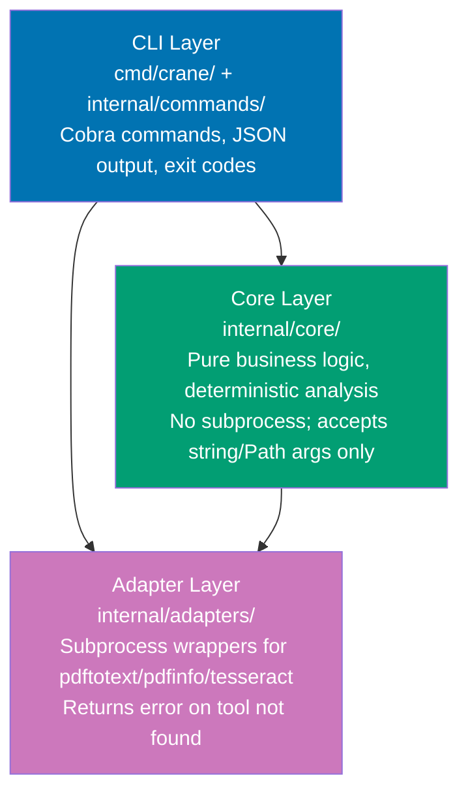

# crane-cli — Technical Design

## Architecture

Three-layer design: thin CLI commands delegate to pure-Go core logic; adapters isolate
subprocess calls to system tools.



## Project Structure

```
apps/crane-cli/
├── cmd/
│   └── crane/
│       └── main.go              # cobra root command + subgroup registration
├── internal/
│   ├── commands/
│   │   ├── pdf.go               # crane pdf *
│   │   ├── text.go              # crane text *
│   │   ├── heading.go           # crane heading *
│   │   ├── nesting.go           # crane nesting *
│   │   ├── table.go             # crane table *
│   │   ├── figure.go            # crane figure *
│   │   ├── mermaid.go           # crane mermaid *
│   │   ├── ocr.go               # crane ocr *
│   │   ├── report.go            # crane report *
│   │   └── skiplist.go          # crane skiplist *
│   ├── core/
│   │   ├── text_checker.go      # Completeness + accuracy analysis
│   │   ├── heading_checker.go   # Heading depth inference + comparison
│   │   ├── nesting_checker.go   # List nesting column-offset analysis
│   │   ├── table_checker.go     # Columnar table detection + comparison
│   │   ├── figure_checker.go    # Figure reference detection + coverage
│   │   ├── mermaid_validator.go # Mermaid syntax validation
│   │   ├── ocr_assessor.go      # OCR confusion-character error rate
│   │   ├── report_manager.go    # UUID chain, UTC+7 timestamp, report init
│   │   └── skiplist_manager.go  # Skip list CRUD with dedup
│   ├── adapters/
│   │   ├── pdftotext.go         # pdftotext -layout subprocess wrapper
│   │   ├── pdfinfo.go           # pdfinfo subprocess wrapper
│   │   └── tesseract.go         # tesseract subprocess wrapper
│   └── models/
│       ├── finding.go           # Finding, Criticality, Confidence, Category types
│       ├── pdf_metadata.go      # PDFMetadata struct
│       └── report.go            # SkipListEntry struct
├── tests/
│   ├── unit/
│   │   ├── suite_test.go        # godog runner with fake adapters (no pdftotext needed)
│   │   ├── steps/
│   │   │   ├── init.go          # InitializeScenario: wires all step packages
│   │   │   ├── pdf_steps.go     # uses FakePDFAdapter (mocked exec.Command)
│   │   │   ├── text_steps.go
│   │   │   ├── heading_steps.go
│   │   │   ├── nesting_steps.go
│   │   │   ├── table_steps.go
│   │   │   ├── figure_steps.go
│   │   │   ├── mermaid_steps.go
│   │   │   ├── ocr_steps.go
│   │   │   ├── report_steps.go
│   │   │   └── skiplist_steps.go
│   │   ├── text_checker_test.go     # pure function unit tests (no godog)
│   │   ├── heading_checker_test.go
│   │   ├── nesting_checker_test.go
│   │   ├── table_checker_test.go
│   │   ├── figure_checker_test.go
│   │   ├── mermaid_validator_test.go
│   │   ├── ocr_assessor_test.go
│   │   ├── report_manager_test.go
│   │   └── skiplist_manager_test.go
│   ├── integration/
│   │   ├── suite_test.go        # godog runner with real adapters (pdftotext on PATH)
│   │   └── steps/
│   │       ├── init.go          # InitializeScenario: wires all step packages
│   │       └── pdf_steps.go     # uses real exec.Command("pdftotext", ...)
│   └── fixtures/
│       ├── sample-text.pdf          # Small text-based PDF (public domain)
│       ├── sample-text.md           # Complete Markdown conversion of above
│       ├── sample-text-missing.md   # MD with one section removed
│       └── sample-text-headings-wrong.md
├── go.mod
├── go.sum
├── project.json
└── README.md
```

## Tech Stack

| Component      | Choice                                                                                                                                                        | Reason                                          |
| -------------- | ------------------------------------------------------------------------------------------------------------------------------------------------------------- | ----------------------------------------------- |
| CLI framework  | cobra v1.10.2 [Repo-grounded: apps/rhino-cli]                                                                                                                 | Platform standard for ose-public Go CLIs        |
| Output         | encoding/json (stdlib)                                                                                                                                        | Zero external dependency                        |
| Data models    | Go structs + json tags                                                                                                                                        | No runtime dependency                           |
| Build          | Go modules                                                                                                                                                    | Platform standard                               |
| Linter         | golangci-lint [Repo-grounded: apps/rhino-cli]                                                                                                                 | Platform standard for Go apps                   |
| Type safety    | Native (Go is statically typed)                                                                                                                               | No extra tool needed                            |
| BDD framework  | godog v0.15.1 [Repo-grounded: apps/rhino-cli]                                                                                                                 | Platform standard (rhino-cli pattern)           |
| Unit tests     | testing + testify/assert v1.9+ [Web-cited: pkg.go.dev/github.com/stretchr/testify — "Thou shalt write tests." Rich assertion lib for Go, accessed 2026-05-15] | Platform standard                               |
| Coverage       | go test -coverprofile; 95% threshold enforced by rhino-cli                                                                                                    | Native Go; rhino-cli validates threshold        |
| Nx executor    | nx:run-commands with `go build`/`go test`                                                                                                                     | Same as rhino-cli/ayokoding-cli [Repo-grounded] |
| Fuzzy matching | go-diff (sergi/go-diff) [Web-cited: pkg.go.dev/github.com/sergi/go-diff — Levenshtein/diff library for Go, accessed 2026-05-15]                               | Levenshtein + LCS; no NLP runtime needed        |

## go.mod

```go
module github.com/wahidyankf/ose-public/apps/crane-cli

go 1.26 // [Judgment call] matches installed toolchain (go1.26.1) and all sibling CLIs (rhino-cli, ayokoding-cli, ose-cli)

require (
    github.com/spf13/cobra v1.10.2              // [Repo-grounded: apps/rhino-cli/go.mod, apps/ayokoding-cli/go.mod]
    github.com/cucumber/godog v0.15.1           // [Repo-grounded: apps/rhino-cli/go.mod, apps/ayokoding-cli/go.mod]
    github.com/stretchr/testify v1.9.0
    github.com/google/uuid v1.6.0              // [Web-cited: https://github.com/google/uuid/releases/tag/v1.6.0 — "Pure Go implementation of UUIDs", accessed 2026-05-15]
    github.com/sergi/go-diff v1.3.1
)
```

## project.json

```json
{
  "name": "crane-cli",
  "$schema": "../../node_modules/nx/schemas/project-schema.json",
  "projectType": "application",
  "targets": {
    "build": {
      "executor": "nx:run-commands",
      "options": {
        "command": "CGO_ENABLED=0 go build -o dist/crane ./cmd/crane/...",
        "cwd": "apps/crane-cli"
      },
      "outputs": ["{projectRoot}/dist"]
    },
    "dev": {
      "executor": "nx:run-commands",
      "options": {
        "command": "go run ./cmd/crane/... --help",
        "cwd": "apps/crane-cli"
      }
    },
    "test:quick": {
      "executor": "nx:run-commands",
      "options": {
        "commands": [
          "CGO_ENABLED=0 go test -v ./tests/unit/... -coverprofile=coverage/coverage.out -covermode=atomic",
          "go tool cover -func=coverage/coverage.out",
          "(cd ../../apps/rhino-cli && CGO_ENABLED=0 go run main.go test-coverage validate apps/crane-cli/coverage/coverage.out 95)"
        ],
        "parallel": false,
        "cwd": "apps/crane-cli"
      },
      "cache": true,
      "inputs": ["{projectRoot}/**/*.go", "{workspaceRoot}/specs/apps/crane/gherkin/**/*.feature"],
      "outputs": ["{projectRoot}/coverage/coverage.out"]
    },
    "test:unit": {
      "executor": "nx:run-commands",
      "options": {
        "command": "CGO_ENABLED=0 go test -v ./tests/unit/...",
        "cwd": "apps/crane-cli"
      },
      "cache": true,
      "inputs": ["{projectRoot}/**/*.go", "{workspaceRoot}/specs/apps/crane/gherkin/**/*.feature"]
    },
    "test:integration": {
      "executor": "nx:run-commands",
      "options": {
        "command": "CGO_ENABLED=0 go test -v ./tests/integration/...",
        "cwd": "apps/crane-cli"
      },
      "cache": false
    },
    "typecheck": {
      "executor": "nx:run-commands",
      "options": {
        "command": "CGO_ENABLED=0 go vet ./...",
        "cwd": "apps/crane-cli"
      }
    },
    "lint": {
      "executor": "nx:run-commands",
      "options": {
        "command": "golangci-lint run ./...",
        "cwd": "apps/crane-cli"
      }
    },
    "spec-coverage": {
      "executor": "nx:run-commands",
      "options": {
        "command": "CGO_ENABLED=0 go run -C apps/rhino-cli main.go spec-coverage validate --shared-steps specs/apps/crane/gherkin apps/crane-cli"
      },
      "cache": true,
      "inputs": ["{workspaceRoot}/specs/apps/crane/gherkin/**/*.feature", "{projectRoot}/**/*.go"]
    }
  },
  "tags": ["type:app", "platform:cli", "lang:golang", "domain:crane"],
  "implicitDependencies": ["rhino-cli"]
}
```

## Data Models

```go
// internal/models/finding.go
package models

type Criticality string

const (
    CriticalityCRITICAL Criticality = "CRITICAL"
    CriticalityHIGH     Criticality = "HIGH"
    CriticalityMEDIUM   Criticality = "MEDIUM"
    CriticalityLOW      Criticality = "LOW"
)

type Confidence string

const (
    ConfidenceHIGH          Confidence = "HIGH"
    ConfidenceMEDIUM        Confidence = "MEDIUM"
    ConfidenceFALSEPOSITIVE Confidence = "FALSE_POSITIVE"
)

type Category string

const (
    CategoryTextCompleteness Category = "text-completeness"
    CategoryTextAccuracy     Category = "text-accuracy"
    CategoryHeadingLevel     Category = "heading-level-accuracy"
    CategoryContentNesting   Category = "content-nesting-accuracy"
    CategoryTableIntegrity   Category = "table-integrity"
    CategoryFigureCoverage   Category = "figure-coverage"
    CategoryMermaidSyntax    Category = "mermaid-syntax"
    CategoryOCRQuality       Category = "ocr-quality"
    CategoryStructure        Category = "structure"
)

type Finding struct {
    Category      Category    `json:"category"`
    Criticality   Criticality `json:"criticality"`
    Confidence    Confidence  `json:"confidence"`
    LocationPDF   string      `json:"location_pdf,omitempty"`
    LocationMD    string      `json:"location_md,omitempty"`
    Description   string      `json:"description"`
    PDFText       string      `json:"pdf_text,omitempty"`
    FixSuggestion string      `json:"fix_suggestion,omitempty"`
    AutoFixable   bool        `json:"auto_fixable"`
}
```

## Key Algorithms

### Text Normalization and Fuzzy Matching

```go
// internal/core/text_checker.go
package core

import (
    "strings"
    "regexp"

    "github.com/sergi/go-diff/diffmatchpatch"
)

const FuzzyThreshold = 0.85

var wsPattern = regexp.MustCompile(`\s+`)

func Normalize(text string) string {
    return strings.TrimSpace(wsPattern.ReplaceAllString(text, " "))
}

func Similarity(a, b string) float64 {
    na := strings.ToLower(Normalize(a))
    nb := strings.ToLower(Normalize(b))
    if na == nb {
        return 1.0
    }
    dmp := diffmatchpatch.New()
    diffs := dmp.DiffMain(na, nb, false)
    levenshtein := dmp.DiffLevenshtein(diffs)
    maxLen := len([]rune(na))
    if lb := len([]rune(nb)); lb > maxLen {
        maxLen = lb
    }
    if maxLen == 0 {
        return 1.0
    }
    return 1.0 - float64(levenshtein)/float64(maxLen)
}
```

### Heading Depth Inference

```go
// internal/core/heading_checker.go
package core

import (
    "regexp"
    "strings"
)

var sectionNumPattern = regexp.MustCompile(`^(\d+|\w)(\.\d+|\.\w)*\.?\s`)

// InferDepthFromNumbering returns (depth 1-5, confidence "HIGH", ok=true)
// or (0, "", false) when no section numbering detected.
// "1. Title" → 2, "2.3 Title" → 3, "2.3.1 Title" → 4
func InferDepthFromNumbering(heading string) (depth int, confidence string, ok bool) {
    heading = strings.TrimSpace(heading)
    match := sectionNumPattern.FindString(heading)
    if match == "" {
        return 0, "", false
    }
    numPart := strings.TrimRight(match, " \t")
    dots := strings.Count(numPart, ".")
    if strings.HasSuffix(numPart, ".") {
        depth = dots + 1
    } else {
        depth = dots + 2
    }
    if depth > 5 {
        depth = 5
    }
    return depth, "HIGH", true
}
```

### Mermaid Validation

```go
// internal/core/mermaid_validator.go
package core

import (
    "fmt"
    "strings"
)

var validMermaidTypes = map[string]bool{
    "graph": true, "flowchart": true, "sequenceDiagram": true,
    "stateDiagram": true, "stateDiagram-v2": true, "classDiagram": true,
    "gantt": true, "pie": true, "erDiagram": true, "journey": true,
    "gitGraph": true, "mindmap": true, "timeline": true,
    "quadrantChart": true, "xychart-beta": true, "sankey-beta": true,
    "block-beta": true, "architecture-beta": true,
}

func ValidateMermaidBlock(content string) (valid bool, errMsg string) {
    lines := strings.Split(strings.TrimSpace(content), "\n")
    if len(lines) == 0 || strings.TrimSpace(lines[0]) == "" {
        return false, "empty Mermaid block"
    }
    diagramType := strings.Fields(lines[0])[0]
    if !validMermaidTypes[diagramType] {
        return false, fmt.Sprintf("unknown diagram type: %q", diagramType)
    }
    if strings.Count(content, "[") != strings.Count(content, "]") {
        return false, "unmatched brackets"
    }
    if strings.Count(content, "(") != strings.Count(content, ")") {
        return false, "unmatched parentheses"
    }
    return true, ""
}
```

### OCR Quality Assessment

```go
// internal/core/ocr_assessor.go
package core

import (
    "regexp"
    "strings"
)

var ocrErrorPatterns = []*regexp.Regexp{
    regexp.MustCompile(`[^\x00-\x7F]{3,}`),
    regexp.MustCompile(`\b[lI1]{5,}\b`),
    regexp.MustCompile(`\b[0Oo]{5,}\b`),
    regexp.MustCompile(`[a-zA-Z]{30,}`),
}

func EstimateOCRErrorRate(text string) float64 {
    clean := strings.ReplaceAll(strings.ReplaceAll(text, " ", ""), "\n", "")
    total := len([]rune(clean))
    if total == 0 {
        return 0.0
    }
    errorChars := 0
    for _, p := range ocrErrorPatterns {
        for _, m := range p.FindAllString(text, -1) {
            errorChars += len([]rune(m))
        }
    }
    rate := float64(errorChars) / float64(total)
    if rate > 1.0 {
        return 1.0
    }
    return rate
}
```

### UUID Chain + UTC+7 Timestamp

```go
// internal/core/report_manager.go
package core

import (
    "fmt"
    "os"
    "strconv"
    "strings"
    "time"

    "github.com/google/uuid"
)

const chainWindowSeconds = 30

var utc7 = time.FixedZone("UTC+7", 7*60*60)

func GetOrExtendChain(scope string) string {
    chainFile := fmt.Sprintf(".execution-chain-%s", scope)
    newID := strings.ReplaceAll(uuid.New().String(), "-", "")[:6]

    if data, err := os.ReadFile(chainFile); err == nil {
        parts := strings.SplitN(strings.TrimSpace(string(data)), " ", 2)
        if len(parts) == 2 {
            if ts, err2 := strconv.ParseInt(parts[0], 10, 64); err2 == nil {
                if time.Now().Unix()-ts < chainWindowSeconds {
                    chain := parts[1] + "__" + newID
                    _ = os.WriteFile(chainFile, []byte(fmt.Sprintf("%d %s", time.Now().Unix(), chain)), 0o644)
                    return chain
                }
            }
        }
    }
    _ = os.WriteFile(chainFile, []byte(fmt.Sprintf("%d %s", time.Now().Unix(), newID)), 0o644)
    return newID
}

func UTC7Timestamp() string {
    return time.Now().In(utc7).Format("2006-01-02--15-04")
}
```

## godog Feature Loader Pattern

Both suites load the same `specs/apps/crane/gherkin/` feature files. The difference is the
adapter layer: unit steps use `FakePDFAdapter` (mocked `exec.Command`); integration steps
use the real adapter (actual `pdftotext` subprocess).

### Unit Suite (fake adapters — no system tools needed)

```go
// tests/unit/suite_test.go
package unit_test

import (
    "os"
    "testing"

    "github.com/cucumber/godog"
    "github.com/wahidyankf/ose-public/apps/crane-cli/tests/unit/steps"
)

func gherkinRoot() string {
    if root := os.Getenv("GHERKIN_ROOT"); root != "" {
        return root
    }
    return "../../specs/apps/crane/gherkin"
}

func TestMain(m *testing.M) {
    opts := godog.Options{
        Format:   "pretty",
        Paths:    []string{gherkinRoot()},
        TestingT: m,
    }
    suite := godog.TestSuite{
        Name:                "crane-cli-unit",
        Options:             &opts,
        ScenarioInitializer: steps.InitializeScenario,
    }
    os.Exit(suite.Run())
}
```

```go
// tests/unit/steps/pdf_steps.go
package steps

import (
    "github.com/cucumber/godog"
    "github.com/wahidyankf/ose-public/apps/crane-cli/internal/adapters"
)

// FakePDFAdapter returns canned text without calling pdftotext
type FakePDFAdapter struct{ Text string }

func (f *FakePDFAdapter) Sample(_ string, _ int) (string, error) { return f.Text, nil }
func (f *FakePDFAdapter) Extract(_ string, _, _ int) (string, error) { return f.Text, nil }

func InitializePDFSteps(sc *godog.ScenarioContext) {
    sc.Step(`^a text-based PDF fixture exists$`, aTextBasedPDFFixtureExists)
    sc.Step(`^I run "crane pdf type" on the fixture$`, iRunCranePDFTypeWithFakeAdapter)
    sc.Step(`^the JSON output contains type "([^"]*)"$`, jsonOutputContainsType)
    sc.Step(`^the exit code is (\d+)$`, exitCodeIs)
}
```

```go
// tests/unit/steps/init.go
package steps

import "github.com/cucumber/godog"

func InitializeScenario(sc *godog.ScenarioContext) {
    InitializePDFSteps(sc)
    InitializeTextSteps(sc)
    InitializeHeadingSteps(sc)
    InitializeNestingSteps(sc)
    InitializeTableSteps(sc)
    InitializeFigureSteps(sc)
    InitializeMermaidSteps(sc)
    InitializeOCRSteps(sc)
    InitializeReportSteps(sc)
    InitializeSkiplistSteps(sc)
}
```

### Integration Suite (real adapters — requires pdftotext on PATH)

```go
// tests/integration/suite_test.go
package integration_test

import (
    "os"
    "testing"

    "github.com/cucumber/godog"
    "github.com/wahidyankf/ose-public/apps/crane-cli/tests/integration/steps"
)

func gherkinRoot() string {
    if root := os.Getenv("GHERKIN_ROOT"); root != "" {
        return root
    }
    return "../../specs/apps/crane/gherkin"
}

func TestMain(m *testing.M) {
    opts := godog.Options{
        Format:   "pretty",
        Paths:    []string{gherkinRoot()},
        TestingT: m,
    }
    suite := godog.TestSuite{
        Name:                "crane-cli-integration",
        Options:             &opts,
        ScenarioInitializer: steps.InitializeScenario,
    }
    os.Exit(suite.Run())
}
```

```go
// tests/integration/steps/pdf_steps.go — uses real pdftotext subprocess
package steps

import (
    "github.com/cucumber/godog"
    "github.com/wahidyankf/ose-public/apps/crane-cli/internal/adapters"
)

func InitializePDFSteps(sc *godog.ScenarioContext) {
    sc.Step(`^a text-based PDF fixture exists$`, aTextBasedPDFFixtureExists)
    sc.Step(`^I run "crane pdf type" on the fixture$`, iRunCranePDFTypeWithRealAdapter)
    sc.Step(`^the JSON output contains type "([^"]*)"$`, jsonOutputContainsType)
    sc.Step(`^the exit code is (\d+)$`, exitCodeIs)
}
```

## CI Workflow

crane-cli follows the **rhino-cli pattern** [Repo-grounded: `.github/workflows/pr-quality-gate.yml`]:

**Quality gate (typecheck + lint + test:quick + spec-coverage)** — handled automatically by the
existing `.github/workflows/pr-quality-gate.yml` workflow. It detects affected `tag:lang:golang`
projects via `npx nx run-many -t typecheck lint test:quick spec-coverage --projects='tag:lang:golang'`
and uses `.github/actions/setup-golang` (Go 1.26.0, golangci-lint v2.10.1, no `poppler-utils`
needed). No new workflow file required for the quality gate — crane-cli's `lang:golang` tag is
sufficient.

**Integration tests (real pdftotext)** — separate workflow file because `poppler-utils` is not
installed in the standard `setup-golang` action:

Workflow file: `.github/workflows/crane-cli-integration.yml`

```yaml
name: crane-cli integration

on:
  push:
    branches: [main]
    paths:
      - "apps/crane-cli/**"
      - "specs/apps/crane/**"
  pull_request:
    branches: [main]
    paths:
      - "apps/crane-cli/**"
      - "specs/apps/crane/**"

permissions:
  contents: read

jobs:
  integration:
    runs-on: ubuntu-latest
    steps:
      - uses: actions/checkout@v4
        with:
          fetch-depth: 0
      - uses: ./.github/actions/setup-node
      - uses: ./.github/actions/setup-golang
      - name: Install poppler-utils (pdftotext + pdfinfo)
        run: sudo apt-get update && sudo apt-get install -y poppler-utils
      - run: npx nx run crane-cli:test:integration
```

**Unit/quality job** — `pr-quality-gate.yml` golang job; no `poppler-utils` needed (all adapters
mocked). **Integration job** — `crane-cli-integration.yml`; installs `poppler-utils` and runs
real pdftotext against `apps/crane-cli/tests/fixtures/sample-text.pdf`.

## File Impact

### New Files

- `apps/crane-cli/` — entire new Go module (cmd/, internal/, tests/, go.mod, project.json)
- `specs/apps/crane/gherkin/*.feature` — 10 Gherkin feature files (written during Phase 0)
- `.github/workflows/crane-cli-integration.yml` — integration CI job (poppler-utils + real pdftotext)
- Note: quality gate (typecheck/lint/test:quick/spec-coverage) runs via existing `pr-quality-gate.yml`
  automatically — no new workflow file needed for quality

### Modified Files (Phase 5)

- `.claude/agents/pdf-to-md-maker.md` — replace bash analysis with crane commands
- `.claude/agents/pdf-to-md-checker.md` — replace all 8 bash validation stubs with crane commands
- `.claude/agents/pdf-to-md-fixer.md` — replace grep re-validation and echo-append skiplist
- `repo-governance/workflows/content/pdf-to-md-quality-gate.md` — add crane as tool dependency

### Unmodified

All other apps, libs, specs, and governance files are untouched.

## Rollback

If crane-cli causes regressions in the pdf-to-md pipeline:

1. `git revert <Phase 5 commit SHA>` — reverts agent + workflow changes back to bash one-liners
2. `apps/crane-cli/` can remain on disk; it has no runtime coupling to the agents until Phase 5
   commits are applied
3. Gherkin feature files in `specs/apps/crane/gherkin/` are additive and safe to leave

## Agent Integration Pattern

After Phase 5, agents call crane instead of writing bash analysis.

**pdf-to-md-checker Step 0 — Report Init**:

```bash
# Before (racy bash)
UUID=$(openssl rand -hex 3)
TIMESTAMP=$(TZ='Asia/Jakarta' date '+%Y-%m-%d--%H-%M')
REPORT="generated-reports/pdf-to-md__${UUID}__${TIMESTAMP}__audit.md"

# After (crane)
REPORT=$(crane report init --scope pdf-to-md --pdf "$PDF_FILE" --md "$MD_FILE" | jq -r .path)
```

**pdf-to-md-checker Step 2 — Text Completeness**:

```bash
# Before (fragile grep)
grep -F "$SEGMENT" "$MD_FILE" >/dev/null 2>&1 || echo "MISSING: $SEGMENT"

# After (crane, structured findings)
crane text check "$PDF_FILE" "$MD_FILE" --chunk-size 50 > /tmp/text-findings.json
```

**pdf-to-md-fixer — False Positive Persistence**:

```bash
# Before (undeduped append)
echo "- [text-completeness] | $MD_FILE | $DESC" >> "$SKIPLIST"

# After (deduplicating)
crane skiplist add "$MD_BASENAME" text-completeness "$DESC"
```
