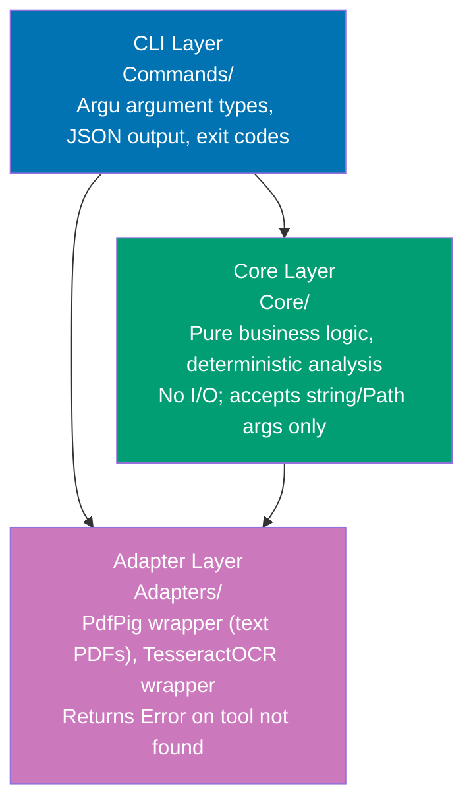

# crane-cli — Technical Design

## Architecture

Three-layer design: thin CLI commands delegate to pure-F# core logic; adapters isolate
library calls to PDF/OCR tools.



## Project Structure

```
apps/crane-cli/
├── crane-cli.fsproj
├── Program.fs               # Argu root command + subgroup dispatch
├── Commands/
│   ├── PdfCommands.fs       # crane pdf *
│   ├── TextCommands.fs      # crane text *
│   ├── HeadingCommands.fs   # crane heading *
│   ├── NestingCommands.fs   # crane nesting *
│   ├── TableCommands.fs     # crane table *
│   ├── FigureCommands.fs    # crane figure *
│   ├── MermaidCommands.fs   # crane mermaid *
│   ├── OcrCommands.fs       # crane ocr *
│   ├── ReportCommands.fs    # crane report *
│   └── SkiplistCommands.fs  # crane skiplist *
├── Core/
│   ├── TextChecker.fs       # Completeness + accuracy analysis
│   ├── HeadingChecker.fs    # Heading depth inference + comparison
│   ├── NestingChecker.fs    # List nesting column-offset analysis
│   ├── TableChecker.fs      # Columnar table detection + comparison
│   ├── FigureChecker.fs     # Figure reference detection + coverage
│   ├── MermaidValidator.fs  # Mermaid syntax validation
│   ├── OcrAssessor.fs       # OCR confusion-character error rate
│   ├── ReportManager.fs     # UUID chain, UTC+7 timestamp, report init
│   └── SkiplistManager.fs   # Skip list CRUD with dedup
├── Adapters/
│   ├── PdfAdapter.fs        # PdfPig wrapper (text extraction + metadata)
│   └── OcrAdapter.fs        # TesseractOCR wrapper (returns Error on missing engine)
├── Models/
│   ├── Finding.fs           # Criticality/Confidence/Category DUs + Finding record
│   ├── PdfMetadata.fs       # PdfMetadata record
│   └── Report.fs            # SkipListEntry record
├── tests/
│   ├── unit/
│   │   ├── crane-cli-unit-tests.fsproj
│   │   ├── Suite.fs         # TickSpec xUnit runner (fake PdfPig adapter)
│   │   └── Steps/
│   │       ├── PdfSteps.fs
│   │       ├── TextSteps.fs
│   │       ├── HeadingSteps.fs
│   │       ├── NestingSteps.fs
│   │       ├── TableSteps.fs
│   │       ├── FigureSteps.fs
│   │       ├── MermaidSteps.fs
│   │       ├── OcrSteps.fs
│   │       ├── ReportSteps.fs
│   │       └── SkiplistSteps.fs
│   └── integration/
│       ├── crane-cli-integration-tests.fsproj
│       ├── Suite.fs         # TickSpec xUnit runner (real PdfPig + real tesseract)
│       ├── Steps/
│       │   ├── PdfSteps.fs  # uses real PdfPig (no subprocess needed)
│       │   └── OcrSteps.fs  # uses real TesseractOCR (requires tesseract engine on PATH)
│       └── fixtures/
│           ├── sample-text.pdf          # Small text-based PDF (public domain)
│           ├── sample-text.md           # Complete Markdown conversion of above
│           ├── sample-text-missing.md   # MD with one section removed
│           └── sample-text-headings-wrong.md
├── project.json
└── README.md
```

## Tech Stack

| Component      | Choice                                                                                                                                                                              | Reason                                                    |
| -------------- | ----------------------------------------------------------------------------------------------------------------------------------------------------------------------------------- | --------------------------------------------------------- |
| Language       | F# (.NET 8+) [Repo-grounded: apps/ose-app-be]                                                                                                                                      | Shared library use with ose-app-be; team is F# fluent     |
| CLI framework  | Argu 6.2.5 [Web-cited: github.com/fsprojects/Argu — MIT, 3M downloads, Dec 2024]                                                                                                   | Idiomatic F# declarative CLI via discriminated unions     |
| PDF library    | PdfPig 0.1.14 [Web-cited: github.com/UglyToad/PdfPig — Apache-2.0, 22M downloads, Mar 2026]                                                                                        | Pure managed .NET; eliminates pdftotext/pdfinfo subprocs  |
| OCR            | TesseractOCR 5.5.2 [Web-cited: nuget.org/packages/TesseractOCR — Apache-2.0, Mar 2026]                                                                                             | .NET wrapper for tesseract engine; active fork            |
| JSON output    | System.Text.Json (stdlib) + FSharp.SystemTextJson 1.4.36 [Web-cited: github.com/Tarmil/FSharp.SystemTextJson — MIT, ~674K downloads]                                               | stdlib JSON + F# DU/option/list serialization             |
| Fuzzy matching | F23.StringSimilarity 7.0.1 [Web-cited: github.com/feature23/StringSimilarity.NET — MIT, Dec 2025]                                                                                  | Returns `double` 0.0–1.0 directly; no int conversion      |
| UUID           | System.Guid.NewGuid() (stdlib)                                                                                                                                                      | Zero dependency; direct drop-in for uuid.New()            |
| BDD framework  | TickSpec 2.0.4 [Web-cited: github.com/fsprojects/TickSpec — Apache-2.0, Jan 2026]                                                                                                  | F#-native Gherkin; backtick step methods; active          |
| Test runner    | xUnit 2.x (with TickSpec step definitions)                                                                                                                                          | Standard .NET test runner; TickSpec integration           |
| Coverage       | altcover (MIT) + `rhino-cli test-coverage validate 95` [Repo-grounded: apps/ose-app-be]                                                                                             | Matches ose-app-be F# backend pattern; threshold enforced by rhino-cli |
| Linter         | Fantomas [Web-cited: fsprojects.github.io/fantomas — MIT, official F# formatter]                                                                                                   | F# standard formatter; `dotnet fantomas --check`          |
| Type safety    | Native (F# is statically typed)                                                                                                                                                     | No extra tool needed                                      |
| Nx executor    | nx:run-commands with `dotnet build`/`dotnet test`                                                                                                                                   | Same pattern as ose-app-be [Repo-grounded: apps/ose-app-be] |
| Distribution   | `PublishSingleFile + SelfContained` (~60 MB); AOT optional future step                                                                                                              | Zero .NET runtime on target; no F# AOT friction risk now  |

## crane-cli.fsproj

```xml
<Project Sdk="Microsoft.NET.Sdk">
  <PropertyGroup>
    <OutputType>Exe</OutputType>
    <TargetFramework>net8.0</TargetFramework>
    <RootNamespace>CraneCli</RootNamespace>
    <AssemblyName>crane</AssemblyName>
    <Nullable>enable</Nullable>
    <!-- Standalone publish (CI): dotnet publish -r <RID> --self-contained true -o dist/
         RID examples: linux-x64, osx-arm64, win-x64
         The Nx build target uses dotnet build; CI runs dotnet publish with the target RID. -->
  </PropertyGroup>

  <ItemGroup>
    <!-- Models first (no dependencies) -->
    <Compile Include="Models/Finding.fs" />
    <Compile Include="Models/PdfMetadata.fs" />
    <Compile Include="Models/Report.fs" />
    <!-- Adapters before Core (Core may call adapters via interface) -->
    <Compile Include="Adapters/PdfAdapter.fs" />
    <Compile Include="Adapters/OcrAdapter.fs" />
    <!-- Core modules (pure logic, depend on Models + Adapters) -->
    <Compile Include="Core/TextChecker.fs" />
    <Compile Include="Core/HeadingChecker.fs" />
    <Compile Include="Core/NestingChecker.fs" />
    <Compile Include="Core/TableChecker.fs" />
    <Compile Include="Core/FigureChecker.fs" />
    <Compile Include="Core/MermaidValidator.fs" />
    <Compile Include="Core/OcrAssessor.fs" />
    <Compile Include="Core/ReportManager.fs" />
    <Compile Include="Core/SkiplistManager.fs" />
    <!-- Commands (depend on Core + Adapters) -->
    <Compile Include="Commands/PdfCommands.fs" />
    <Compile Include="Commands/TextCommands.fs" />
    <Compile Include="Commands/HeadingCommands.fs" />
    <Compile Include="Commands/NestingCommands.fs" />
    <Compile Include="Commands/TableCommands.fs" />
    <Compile Include="Commands/FigureCommands.fs" />
    <Compile Include="Commands/MermaidCommands.fs" />
    <Compile Include="Commands/OcrCommands.fs" />
    <Compile Include="Commands/ReportCommands.fs" />
    <Compile Include="Commands/SkiplistCommands.fs" />
    <Compile Include="Program.fs" />
  </ItemGroup>

  <ItemGroup>
    <PackageReference Include="Argu" Version="6.2.5" />
    <PackageReference Include="PdfPig" Version="0.1.14" />
    <PackageReference Include="TesseractOCR" Version="5.5.2" />
    <PackageReference Include="FSharp.SystemTextJson" Version="1.4.36" />
    <PackageReference Include="F23.StringSimilarity" Version="7.0.1" />
  </ItemGroup>
</Project>
```

## Unit Test Project (crane-cli-unit-tests.fsproj)

```xml
<Project Sdk="Microsoft.NET.Sdk">
  <PropertyGroup>
    <TargetFramework>net8.0</TargetFramework>
    <RootNamespace>CraneCli.Tests.Unit</RootNamespace>
    <IsPackable>false</IsPackable>
  </PropertyGroup>

  <ItemGroup>
    <Compile Include="Steps/PdfSteps.fs" />
    <Compile Include="Steps/TextSteps.fs" />
    <Compile Include="Steps/HeadingSteps.fs" />
    <Compile Include="Steps/NestingSteps.fs" />
    <Compile Include="Steps/TableSteps.fs" />
    <Compile Include="Steps/FigureSteps.fs" />
    <Compile Include="Steps/MermaidSteps.fs" />
    <Compile Include="Steps/OcrSteps.fs" />
    <Compile Include="Steps/ReportSteps.fs" />
    <Compile Include="Steps/SkiplistSteps.fs" />
    <Compile Include="Suite.fs" />
  </ItemGroup>

  <ItemGroup>
    <PackageReference Include="Microsoft.NET.Test.Sdk" Version="17.11.1" />
    <PackageReference Include="xunit" Version="2.9.2" />
    <PackageReference Include="xunit.runner.visualstudio" Version="2.8.2">
      <IncludeAssets>runtime; build; native; contentfiles; analyzers</IncludeAssets>
      <PrivateAssets>all</PrivateAssets>
    </PackageReference>
    <PackageReference Include="TickSpec" Version="2.0.4" />
    <PackageReference Include="altcover" Version="*">
      <IncludeAssets>runtime; build; native; contentfiles; analyzers</IncludeAssets>
      <PrivateAssets>all</PrivateAssets>
    </PackageReference>
  </ItemGroup>

  <ItemGroup>
    <ProjectReference Include="../../crane-cli.fsproj" />
  </ItemGroup>
</Project>
```

## project.json

```json
{
  "name": "crane-cli",
  "$schema": "../../node_modules/nx/schemas/project-schema.json",
  "projectType": "application",
  "targets": {
    "build": {
      "executor": "nx:run-commands",
      "options": {
        "command": "dotnet build crane-cli.fsproj -c Release",
        "cwd": "apps/crane-cli"
      },
      "outputs": ["{projectRoot}/bin"]
    },
    "dev": {
      "executor": "nx:run-commands",
      "options": {
        "command": "dotnet run --project crane-cli.fsproj -- --help",
        "cwd": "apps/crane-cli"
      }
    },
    "test:quick": {
      "executor": "nx:run-commands",
      "options": {
        "commands": [
          "dotnet tool restore",
          "dotnet build tests/unit/crane-cli-unit-tests.fsproj",
          "dotnet altcover --inputDirectory tests/unit/bin/Debug/net8.0 --outputDirectory tests/unit/bin/Debug/net8.0/__Instrumented --assemblyExcludeFilter=crane-cli-unit-tests '--assemblyFilter=xunit|TickSpec|Microsoft|FSharp|testhost|AltCover' --linecover --reportFormat=lcov --report=coverage/altcov.info --save",
          "dotnet altcover Runner --recorderDirectory tests/unit/bin/Debug/net8.0/__Instrumented --lcovReport coverage/altcov.info --executable dotnet -- test tests/unit/bin/Debug/net8.0/__Instrumented/crane-cli-unit-tests.dll",
          "(cd ../../apps/rhino-cli && CGO_ENABLED=0 go run main.go test-coverage validate apps/crane-cli/coverage/altcov.info 95)"
        ],
        "parallel": false,
        "cwd": "apps/crane-cli"
      },
      "cache": true,
      "inputs": [
        "{projectRoot}/**/*.fs",
        "{projectRoot}/**/*.fsproj",
        "{workspaceRoot}/specs/apps/crane/gherkin/**/*.feature"
      ],
      "outputs": ["{projectRoot}/coverage/"]
    },
    "test:unit": {
      "executor": "nx:run-commands",
      "options": {
        "command": "dotnet test tests/unit/crane-cli-unit-tests.fsproj",
        "cwd": "apps/crane-cli"
      },
      "cache": true,
      "inputs": [
        "{projectRoot}/**/*.fs",
        "{projectRoot}/**/*.fsproj",
        "{workspaceRoot}/specs/apps/crane/gherkin/**/*.feature"
      ]
    },
    "test:integration": {
      "executor": "nx:run-commands",
      "options": {
        "command": "dotnet test tests/integration/crane-cli-integration-tests.fsproj",
        "cwd": "apps/crane-cli"
      },
      "cache": false
    },
    "typecheck": {
      "executor": "nx:run-commands",
      "options": {
        "command": "dotnet build crane-cli.fsproj --no-restore -c Debug",
        "cwd": "apps/crane-cli"
      }
    },
    "lint": {
      "executor": "nx:run-commands",
      "options": {
        "command": "dotnet fantomas --check .",
        "cwd": "apps/crane-cli"
      }
    },
    "spec-coverage": {
      "executor": "nx:run-commands",
      "options": {
        "command": "CGO_ENABLED=0 go run main.go spec-coverage validate --shared-steps ../../specs/apps/crane/gherkin ../../apps/crane-cli",
        "cwd": "apps/rhino-cli"
      },
      "cache": true,
      "inputs": [
        "{workspaceRoot}/specs/apps/crane/gherkin/**/*.feature",
        "{projectRoot}/**/*.fs"
      ]
    }
  },
  "tags": ["type:app", "platform:cli", "lang:fsharp", "domain:crane"],
  "implicitDependencies": ["rhino-cli"]
}
```

Note: `lang:fsharp` tag triggers the .NET quality gate job in `pr-quality-gate.yml` — verify
this tag against existing F# projects (`ose-app-be`) before committing.
`spec-coverage` via rhino-cli must be verified to support `.fs` step files; if not, a
custom coverage script is needed as a substitute.

## Data Models

```fsharp
// Models/Finding.fs
module CraneCli.Models.Finding

open System.Text.Json.Serialization

type Criticality =
    | CRITICAL
    | HIGH
    | MEDIUM
    | LOW

type Confidence =
    | HIGH
    | MEDIUM
    | FALSE_POSITIVE

type Category =
    | TextCompleteness
    | TextAccuracy
    | HeadingLevelAccuracy
    | ContentNestingAccuracy
    | TableIntegrity
    | FigureCoverage
    | MermaidSyntax
    | OcrQuality
    | Structure

type Finding = {
    [<JsonPropertyName("category")>]      Category:      string
    [<JsonPropertyName("criticality")>]   Criticality:   string
    [<JsonPropertyName("confidence")>]    Confidence:    string
    [<JsonPropertyName("location_pdf")>]  LocationPdf:   string option
    [<JsonPropertyName("location_md")>]   LocationMd:    string option
    [<JsonPropertyName("description")>]   Description:   string
    [<JsonPropertyName("pdf_text")>]      PdfText:       string option
    [<JsonPropertyName("fix_suggestion")>] FixSuggestion: string option
    [<JsonPropertyName("auto_fixable")>]  AutoFixable:   bool
}
```

## Key Algorithms

### Text Normalization and Fuzzy Matching

```fsharp
// Core/TextChecker.fs
module CraneCli.Core.TextChecker

open System
open System.Text.RegularExpressions
open F23.StringSimilarity

let private fuzzyThreshold = 0.85
let private wsPattern = Regex(@"\s+", RegexOptions.Compiled)
let private levenshtein = NormalizedLevenshtein() // [Web-cited: github.com/feature23/StringSimilarity.NET/blob/main/src/F23.StringSimilarity/NormalizedLevenshtein.cs — implements INormalizedStringSimilarity with Similarity(s1, s2) : double in [0.0, 1.0]]

let normalize (text: string) =
    wsPattern.Replace(text.Trim(), " ")

let computeSimilarity (a: string) (b: string) =
    let na = (normalize a).ToLowerInvariant()
    let nb = (normalize b).ToLowerInvariant()
    if na = nb then 1.0
    else levenshtein.Similarity(na, nb)

let segmentIsPresent (segment: string) (mdText: string) =
    computeSimilarity segment mdText >= fuzzyThreshold
```

### Heading Depth Inference

```fsharp
// Core/HeadingChecker.fs
module CraneCli.Core.HeadingChecker

open System.Text.RegularExpressions

let private sectionNumPattern =
    Regex(@"^(\d+|\w)(\.\d+|\.\w)*\.?\s", RegexOptions.Compiled)

// Returns Some (depth 1-5, confidence "HIGH") or None when no section numbering detected.
// "1. Title" → 2, "2.3 Title" → 3, "2.3.1 Title" → 4
let inferDepthFromNumbering (heading: string) =
    let heading = heading.Trim()
    let m = sectionNumPattern.Match(heading)
    if not m.Success then None
    else
        let numPart = m.Value.TrimEnd(' ', '\t')
        let dots = numPart |> Seq.filter ((=) '.') |> Seq.length
        let depth =
            if numPart.EndsWith('.') then dots + 1
            else dots + 2
        Some (min 5 depth, "HIGH")
```

### Mermaid Validation

```fsharp
// Core/MermaidValidator.fs
module CraneCli.Core.MermaidValidator

open System

let private validTypes =
    Set.ofList [
        "graph"; "flowchart"; "sequenceDiagram"; "stateDiagram"
        "stateDiagram-v2"; "classDiagram"; "gantt"; "pie"; "erDiagram"
        "journey"; "gitGraph"; "mindmap"; "timeline"; "quadrantChart"
        "xychart-beta"; "sankey-beta"; "block-beta"; "architecture-beta"
    ]

let validateBlock (content: string) =
    let lines = content.Trim().Split('\n')
    if lines.Length = 0 || lines[0].Trim() = "" then
        Error "empty Mermaid block"
    else
        let diagramType = lines[0].Trim().Split(' ')[0]
        if not (Set.contains diagramType validTypes) then
            Error (sprintf "unknown diagram type: %s" diagramType)
        elif (content |> Seq.filter ((=) '[') |> Seq.length) <>
             (content |> Seq.filter ((=) ']') |> Seq.length) then
            Error "unmatched brackets"
        elif (content |> Seq.filter ((=) '(') |> Seq.length) <>
             (content |> Seq.filter ((=) ')') |> Seq.length) then
            Error "unmatched parentheses"
        else
            Ok ()
```

### OCR Quality Assessment

```fsharp
// Core/OcrAssessor.fs
module CraneCli.Core.OcrAssessor

open System.Text.RegularExpressions

let private ocrErrorPatterns =
    [|
        Regex(@"[^\x00-\x7F]{3,}", RegexOptions.Compiled)
        Regex(@"\b[lI1]{5,}\b", RegexOptions.Compiled)
        Regex(@"\b[0Oo]{5,}\b", RegexOptions.Compiled)
        Regex(@"[a-zA-Z]{30,}", RegexOptions.Compiled)
    |]

let estimateOCRErrorRate (text: string) =
    let clean = text.Replace(" ", "").Replace("\n", "")
    let total = clean |> Seq.length
    if total = 0 then 0.0
    else
        let errorChars =
            ocrErrorPatterns
            |> Array.sumBy (fun p ->
                p.Matches(text)
                |> Seq.cast<System.Text.RegularExpressions.Match>
                |> Seq.sumBy (fun m -> m.Length))
        let rate = float errorChars / float total
        min 1.0 rate
```

### UUID Chain + UTC+7 Timestamp

```fsharp
// Core/ReportManager.fs
module CraneCli.Core.ReportManager

open System
open System.IO

let private chainWindowSeconds = 30L
let private utc7Offset = TimeSpan.FromHours(7.0)

let getOrExtendChain (scope: string) =
    let chainFile = sprintf ".execution-chain-%s" scope
    let newId = Guid.NewGuid().ToString("N").Substring(0, 6)

    let existingChain =
        if File.Exists(chainFile) then
            let parts = File.ReadAllText(chainFile).Trim().Split(' ', 2)
            if parts.Length = 2 then
                match Int64.TryParse(parts[0]) with
                | true, ts when DateTimeOffset.UtcNow.ToUnixTimeSeconds() - ts < chainWindowSeconds ->
                    Some (parts[1] + "__" + newId)
                | _ -> None
            else None
        else None

    let chain = existingChain |> Option.defaultValue newId
    File.WriteAllText(chainFile, sprintf "%d %s" (DateTimeOffset.UtcNow.ToUnixTimeSeconds()) chain)
    chain

let utc7Timestamp () =
    DateTimeOffset.UtcNow.ToOffset(utc7Offset).ToString("yyyy-MM-dd--HH-mm")
```

## TickSpec Feature Loader Pattern

Both suites load the same `specs/apps/crane/gherkin/` feature files. The difference is the
adapter layer: unit steps use a `FakePdfAdapter` (in-memory text, no PdfPig I/O); integration
steps use real PdfPig and TesseractOCR against fixture PDFs.

### Unit Suite (fake adapter — no real PDF I/O needed)

```fsharp
// tests/unit/Suite.fs
module CraneCli.Tests.Unit.Suite

open System.IO
open System.Reflection
open TickSpec
open Xunit

let private assembly = Assembly.GetExecutingAssembly()

let private gherkinRoot =
    match System.Environment.GetEnvironmentVariable("GHERKIN_ROOT") with
    | null -> Path.Combine(__SOURCE_DIRECTORY__, "../../../../specs/apps/crane/gherkin")
    | root -> root

let private buildScenarioData () : seq<obj[]> =
    if Directory.Exists(gherkinRoot) then
        let files = Directory.GetFiles(gherkinRoot, "*.feature", SearchOption.AllDirectories)
        let defs = StepDefinitions(assembly)
        files
        |> Seq.collect (fun path ->
            let feature = defs.GenerateFeature(path)
            feature.Scenarios |> Seq.map (fun scenario -> [| scenario :> obj |]))
    else Seq.empty

type CraneCliUnitSuite() =
    static member Scenarios() : seq<obj[]> = buildScenarioData () |> Seq.toList :> seq<_>

    [<Theory>]
    [<MemberData("Scenarios")>]
    member _.``Crane unit scenarios``(scenario: Scenario) = scenario.Action.Invoke()
```

```fsharp
// tests/unit/Steps/PdfSteps.fs
module CraneCli.Tests.Unit.Steps.PdfSteps

open TickSpec
open Xunit

// Fake adapter — returns canned data without calling PdfPig
type FakePdfDoc = { Text: string; Pages: int; IsTextBased: bool }

let mutable private currentFixture: FakePdfDoc option = None
let mutable private lastPdfTypeResult: {| ``type``: string |} option = None

let [<Given>] ``a text-based PDF fixture exists`` () =
    currentFixture <- Some { Text = "Sample text content for testing"; Pages = 5; IsTextBased = true }

let [<When>] ``I run "crane pdf type" on the fixture`` () =
    match currentFixture with
    | Some doc ->
        // Call core type-detection logic with injected fake text
        let docType = if doc.IsTextBased then "text" else "image"
        lastPdfTypeResult <- Some {| ``type`` = docType |}
    | None -> failwith "No fixture configured"

let [<Then>] ``the JSON output contains type "([^"]*)"`` (expected: string) =
    match lastPdfTypeResult with
    | Some result -> Assert.Equal(expected, result.``type``)
    | None -> failwith "No result available"

let [<Then>] ``the exit code is (\d+)`` (_: int) = ()
```

### Integration Suite (real adapters — requires PdfPig + tesseract)

```fsharp
// tests/integration/Suite.fs
module CraneCli.Tests.Integration.Suite

open System.IO
open System.Reflection
open TickSpec
open Xunit

let private assembly = Assembly.GetExecutingAssembly()

let private gherkinRoot =
    match System.Environment.GetEnvironmentVariable("GHERKIN_ROOT") with
    | null -> Path.Combine(__SOURCE_DIRECTORY__, "../../../../specs/apps/crane/gherkin")
    | root -> root

let private buildScenarioData () : seq<obj[]> =
    if Directory.Exists(gherkinRoot) then
        let files = Directory.GetFiles(gherkinRoot, "*.feature", SearchOption.AllDirectories)
        let defs = StepDefinitions(assembly)
        files
        |> Seq.collect (fun path ->
            let feature = defs.GenerateFeature(path)
            feature.Scenarios |> Seq.map (fun scenario -> [| scenario :> obj |]))
    else Seq.empty

type CraneCliIntegrationSuite() =
    static member Scenarios() : seq<obj[]> = buildScenarioData () |> Seq.toList :> seq<_>

    [<Theory>]
    [<MemberData("Scenarios")>]
    member _.``Crane integration scenarios``(scenario: Scenario) = scenario.Action.Invoke()
```

```fsharp
// tests/integration/Steps/PdfSteps.fs
module CraneCli.Tests.Integration.Steps.PdfSteps

open System.IO
open TickSpec
open Xunit
open UglyToad.PdfPig

let private fixtureDir = Path.Combine(__SOURCE_DIRECTORY__, "../fixtures")

let mutable private testFixturePath: string option = None

let [<Given>] ``a text-based PDF fixture exists`` () =
    let path = Path.Combine(fixtureDir, "sample-text.pdf")
    Assert.True(File.Exists(path), sprintf "Fixture not found: %s" path)
    testFixturePath <- Some path

let [<When>] ``I run "crane pdf type" on the fixture`` () =
    match testFixturePath with
    | Some path ->
        use doc = PdfDocument.Open(path)
        let wordCount =
            doc.GetPages()
            |> Seq.truncate 3
            |> Seq.sumBy (fun page ->
                page.GetWords() |> Seq.length)
        // wordCount > 100 indicates text-based PDF
        ()
    | None -> failwith "No fixture path set"
```

## CI Workflow

crane-cli follows the **F# backend pattern** [Repo-grounded: `apps/ose-app-be`]:

**Quality gate (typecheck + lint + test:quick + spec-coverage)** — handled automatically by the
existing `.github/workflows/pr-quality-gate.yml` workflow. The `.NET quality gate` job detects
affected `tag:lang:fsharp` and `tag:lang:csharp` projects via
`npx nx run-many -t typecheck lint test:quick spec-coverage --projects='tag:lang:fsharp,tag:lang:csharp'`
and uses `.github/actions/setup-dotnet` (no tesseract needed — all PDF adapters are fake in unit
suite). No new workflow file required for the quality gate.

**Integration tests (real PdfPig + tesseract for OCR)** — separate workflow file because tesseract
is not installed in the standard `setup-dotnet` action:

Workflow file: `.github/workflows/crane-cli-integration.yml`

```yaml
name: crane-cli integration

on:
  push:
    branches: [main]
    paths:
      - "apps/crane-cli/**"
      - "specs/apps/crane/**"
  pull_request:
    branches: [main]
    paths:
      - "apps/crane-cli/**"
      - "specs/apps/crane/**"

permissions:
  contents: read

jobs:
  integration:
    runs-on: ubuntu-latest
    steps:
      - uses: actions/checkout@v4
        with:
          fetch-depth: 0
      - uses: ./.github/actions/setup-node
      - uses: ./.github/actions/setup-dotnet
      - name: Install tesseract (OCR integration tests)
        run: sudo apt-get update && sudo apt-get install -y tesseract-ocr libtesseract-dev
      - run: npx nx run crane-cli:test:integration
```

**Unit/quality job** — `pr-quality-gate.yml` fsharp job; no tesseract needed (PdfPig is a
library, always available; OCR adapter is a fake in unit tests). **Integration job** —
`crane-cli-integration.yml`; installs tesseract engine for real OCR tests against
`apps/crane-cli/tests/integration/fixtures/sample-text.pdf`.

Note: Verify `.github/actions/setup-dotnet` composite action exists and pins .NET 8 SDK
against existing F# project CI (ose-app-be). If a different action name is used, update
the workflow file accordingly.

## File Impact

### New Files

- `apps/crane-cli/` — entire new F# project (.fsproj, Commands/, Core/, Adapters/, Models/, tests/)
- `specs/apps/crane/gherkin/*.feature` — 10 Gherkin feature files (written during Phase 0)
- `.github/workflows/crane-cli-integration.yml` — integration CI job (tesseract + real OCR tests)
- Note: quality gate (typecheck/lint/test:quick/spec-coverage) runs via existing `pr-quality-gate.yml`
  automatically — no new workflow file needed for quality

### Modified Files (Phase 5)

- `.claude/agents/pdf-to-md-maker.md` — replace bash analysis with crane commands
- `.claude/agents/pdf-to-md-checker.md` — replace all 8 bash validation stubs with crane commands
- `.claude/agents/pdf-to-md-fixer.md` — replace grep re-validation and echo-append skiplist
- `repo-governance/workflows/content/pdf-to-md-quality-gate.md` — add crane as tool dependency

### Unmodified

All other apps, libs, specs, and governance files are untouched.

## Rollback

If crane-cli causes regressions in the pdf-to-md pipeline:

1. `git revert <Phase 5 commit SHA>` — reverts agent + workflow changes back to bash one-liners
2. `apps/crane-cli/` can remain on disk; it has no runtime coupling to the agents until Phase 5
   commits are applied
3. Gherkin feature files in `specs/apps/crane/gherkin/` are additive and safe to leave

## Agent Integration Pattern

After Phase 5, agents call crane instead of writing bash analysis.

Note: During development (before Phase 5 standalone binary is built), agents invoke crane via
`dotnet run` — no pre-built binary required:

```bash
dotnet run --project apps/crane-cli/crane-cli.fsproj -- report init --scope pdf-to-md --pdf "$PDF_FILE" --md "$MD_FILE"
```

In production/CI, the self-contained binary from `dotnet publish --self-contained` is used
instead (Phase 5 delivery step).

**pdf-to-md-checker Step 0 — Report Init**:

```bash
# Before (racy bash)
UUID=$(openssl rand -hex 3)
TIMESTAMP=$(TZ='Asia/Jakarta' date '+%Y-%m-%d--%H-%M')
REPORT="generated-reports/pdf-to-md__${UUID}__${TIMESTAMP}__audit.md"

# After (crane)
REPORT=$(crane report init --scope pdf-to-md --pdf "$PDF_FILE" --md "$MD_FILE" | jq -r .path)
```

**pdf-to-md-checker Step 2 — Text Completeness**:

```bash
# Before (fragile grep)
grep -F "$SEGMENT" "$MD_FILE" >/dev/null 2>&1 || echo "MISSING: $SEGMENT"

# After (crane, structured findings)
crane text check "$PDF_FILE" "$MD_FILE" --chunk-size 50 > /tmp/text-findings.json
```

**pdf-to-md-fixer — False Positive Persistence**:

```bash
# Before (undeduped append)
echo "- [text-completeness] | $MD_FILE | $DESC" >> "$SKIPLIST"

# After (deduplicating)
crane skiplist add "$MD_BASENAME" text-completeness "$DESC"
```
