# Delivery — OrganicLever Specs Standardization (Pilot)

## Worktree

Worktree path: `worktrees/ddd/`

Provisioned via `claude --worktree ddd` from the `ose-public` subrepo root. Branch
`worktree/ddd`. Plan authoring and execution both run inside this worktree; commits
publish to `main` via `git push origin worktree/ddd:main` per Trunk-Based Development.
See [Worktree Path Convention](../../../governance/conventions/structure/worktree-path.md) and
[Plans Organization Convention §Worktree Specification](../../../governance/conventions/structure/plans.md#worktree-specification).

## Commit Guidelines

- Commit thematically — each commit delivers one cohesive change (per the Commit Strategy in tech-docs.md)
- Follow Conventional Commits format: `<type>(<scope>): <description>`
- Split different domains/concerns into separate commits — spec moves, rhino-cli Go code, governance, and sync are separate commit domains
- Do NOT bundle unrelated fixes into a single commit
- See [tech-docs.md §Commit Strategy](./tech-docs.md#commit-strategy) for the planned commit sequence

## Phase flow

The diagram below shows the phase ordering and the additive-before-subtractive constraint. New specs/ files MUST exist before any app/infra README is trimmed.

```mermaid
%% Color palette: Blue #0173B2 | Teal #029E73 | Orange #DE8F05 | Gray #808080
flowchart TD
    Pre["Pre-flight<br/>baseline metrics<br/>discovery scans"]:::pre
    P1["Phase 1 — scaffold tree<br/>create empty specs/apps/organiclever/<br/>{product,system-context,containers,<br/>components,behavior}/ + READMEs"]:::add
    P2["Phase 2 — atomic reorg<br/>git mv old subfolders into new tree<br/>+ rhino-cli path constant<br/>+ Nx project.json paths<br/>+ 16 step files<br/>+ e2e configs<br/>(ONE commit, tests pass after)"]:::big
    P25["Phase 2.5 — deepen UL glossary<br/>per-term H3 sections in<br/>9 ubiquitous-language/&lt;bc&gt;.md files<br/>+ README authoring rule 6<br/>(FR-16, separate commit)"]:::add
    P3["Phase 3 — additive content<br/>create new files at final tree positions:<br/>product/overview.md<br/>containers/deployment.md<br/>components/be/api.md<br/>components/web/architecture.md<br/>components/web/design-system.md<br/>components/web/routes-and-screens.md<br/>+ git mv BC map"]:::add
    P4["Phase 4 — subtractive<br/>trim app READMEs<br/>(web, be, web-e2e, be-e2e)"]:::sub
    P5["Phase 5 — subtractive<br/>trim infra/ READMEs<br/>(dev, k8s, staging, production)"]:::sub
    P6["Phase 6 — governance<br/>repo-rules-maker:<br/>create app-readme-vs-specs.md<br/>rewrite specs-directory-structure.md<br/>update specs-checker/fixer/maker agents<br/>update specs-quality-gate workflow"]:::gov
    P65["Phase 6.5 — rhino-cli<br/>add specs validate-tree/<br/>validate-counts/validate-links/<br/>validate-adoption + drift-routes/<br/>drift-endpoints/drift-contracts<br/>(deterministic offload, FR-14)"]:::rhinocli
    P7["Phase 7 — sync<br/>.claude/skills/+agents → .opencode/"]:::sync
    P8["Phase 8 — verify + push + archive<br/>FR-15 gate matrix · PM-readability<br/>repo-rules-checker · pilot-findings.md<br/>push origin main · GH Actions CI<br/>archive plan"]:::verify

    Pre --> P1
    P1 --> P2
    P2 --> P25
    P25 --> P3
    P3 --> P4
    P3 --> P5
    P4 --> P6
    P5 --> P6
    P6 --> P65
    P65 --> P7
    P7 --> P8

    classDef pre fill:#808080,stroke:#000,color:#FFF
    classDef add fill:#0173B2,stroke:#000,color:#FFF,stroke-width:3px
    classDef big fill:#DE8F05,stroke:#000,color:#000,stroke-width:4px
    classDef sub fill:#029E73,stroke:#000,color:#FFF,stroke-width:2px
    classDef gov fill:#0173B2,stroke:#000,color:#FFF,stroke-width:3px,stroke-dasharray:4 2
    classDef rhinocli fill:#CC78BC,stroke:#000,color:#000,stroke-width:3px
    classDef sync fill:#DE8F05,stroke:#000,color:#000,stroke-width:2px
    classDef verify fill:#808080,stroke:#000,color:#FFF,stroke-width:2px
```



> **Phase 2 is the atomic-reorg commit.** Everything that depends on spec paths (`rhino-cli`, Nx project.json, step files, Playwright configs) updates in a single commit so tests don't break in between. See [§Phase 2](#phase-2--atomic-reorg-spec-tree--all-path-updates) for the precise checklist.

## Pre-flight

### Environment Setup

- [x] **Environment setup**: Provision worktree if not already done — `claude --worktree organiclever-specs-standardization` (creates `worktrees/organiclever-specs-standardization/` in repo root; see [Worktree Path Convention](../../../governance/conventions/structure/worktree-path.md)) - Date: 2026-05-09. Status: done. Files Changed: none (existing `worktrees/ddd/` worktree branch `worktree/ddd` reused; declared path updated upfront).
- [x] **Initialize polyglot toolchain** in the worktree root: `npm install && npm run doctor -- --fix`
      (ensures Go, .NET, and other polyglot toolchains are initialized; see
      [Worktree Toolchain Initialization](../../../governance/development/workflow/worktree-setup.md)).
      Acceptance: `npm run doctor` exits 0 with no missing tools. - Date: 2026-05-09. Status: done. Files Changed: node_modules (1718 pkgs). Doctor 19/19 tools OK, nothing to fix.

> **Fix-all-issues rule**: Fix ALL failures found during quality gates — including preexisting issues
> not caused by your changes. Do not defer or mention-and-skip. This follows the Root Cause Orientation
> principle. If a baseline test:quick fails before you start, fix it first, then proceed.

- [x] On `main` (or in an `ose-public` worktree branched off `main`); working tree clean - Date: 2026-05-09. Status: done. Branch: worktree/ddd off main. Pre-execution: clean except in-flight delivery.md edits from PF.1/2 atomic-sync ritual (expected).
- [x] `npm install` clean (no postinstall failures) - Date: 2026-05-09. Status: done. Verified during PF.2 (1718 pkgs, postinstall doctor 19/19 OK).
- [x] `npm run lint:md` exits 0 on the baseline - Date: 2026-05-09. Status: done. 2325 files linted, 0 errors.
- [x] `nx run organiclever-web:test:quick --skip-nx-cache` exits 0 on baseline - Date: 2026-05-09. Status: PASS. Line coverage 78.26% (≥70% threshold).
- [x] `nx run organiclever-be:test:quick --skip-nx-cache` exits 0 on baseline - Date: 2026-05-09. Status: PASS. Line coverage 91.67% (≥90% threshold).
- [x] `nx run rhino-cli:test:quick --skip-nx-cache` exits 0 on baseline - Date: 2026-05-09. Status: PASS. Line coverage 90.16% (≥90% threshold).
- [x] `nx run rhino-cli:test:integration --skip-nx-cache` exits 0 on baseline - Date: 2026-05-09. Status: PASS. coverage 64.1% (no threshold for integration).
- [x] `rg "apps/organiclever-web/docs/explanation/bounded-context-map" --glob '!plans/done/**' --glob '!generated-reports/**' --glob '!node_modules/**'` records the count - Date: 2026-05-09. **Baseline: 20 occurrences across 9 files**. Phase 2A.18 + 2B.2 will reduce to 0.
- [x] `rg "specs/apps/organiclever/(be|web|ddd|c4|contracts)/" --glob '!plans/done/**' --glob '!generated-reports/**' --glob '!node_modules/**' | wc -l` records the count of old-path references that will need updating in Phase 2 - Date: 2026-05-09. **Baseline: 225 occurrences across 77 files**. Phase 2 atomic commit will reduce to 0 (verified by 2F.1 probe).

### Baseline metrics

| Item                                             | Baseline value | Target         |
| ------------------------------------------------ | -------------- | -------------- |
| `apps/organiclever-web/README.md` line count     | 301            | ≤ 120          |
| `apps/organiclever-be/README.md` line count      | 110            | ≤ 120          |
| `apps/organiclever-web-e2e/README.md` line count | 119            | ≤ 120          |
| `apps/organiclever-be-e2e/README.md` line count  | 129            | ≤ 120          |
| `infra/dev/organiclever/README.md` line count    | 32             | ≤ 60           |
| `infra/k8s/organiclever/README.md` line count    | 32             | ≤ 60           |
| `infra/k8s/organiclever/staging/README.md`       | 15             | ≤ 30           |
| `infra/k8s/organiclever/production/README.md`    | 19             | ≤ 30           |
| Inbound BC map references                        | 8              | 0 (after move) |

## Phase 1 — Scaffold the new spec tree (top-level only, no clashes)

Additive only. Create the FIVE top-level directories + their immediate index READMEs ONLY. Sub-folder READMEs (`components/be/README.md`, `components/web/README.md`, `behavior/be/README.md`, `behavior/web/README.md`) are NOT created here — those arrive in Phase 2A via `git mv` of the existing flat-root `be/README.md` and `web/README.md`. Sub-DIRECTORIES are created (empty) so Phase 2A `git mv` lands content into them.

- [x] **1.1 Create `specs/apps/organiclever/product/README.md`** (thin index: one-line description + planned children list) - Date: 2026-05-09. Status: done. Files Changed: specs/apps/organiclever/product/README.md (new, 17 lines). Audience line + planned-children placeholder for Phase 3 overview.md.
- [x] **1.2 Create `specs/apps/organiclever/system-context/README.md`** - Date: 2026-05-09. Status: done. Files Changed: specs/apps/organiclever/system-context/README.md (new, 17 lines). Lists Phase 2A move target context.md.
- [x] **1.3 Create `specs/apps/organiclever/containers/README.md`** - Date: 2026-05-09. Status: done. Files Changed: specs/apps/organiclever/containers/README.md (new, 19 lines). Lists Phase 2A move targets container.md, contracts/.
- [x] **1.4 Create `specs/apps/organiclever/components/README.md`** - Date: 2026-05-09. Status: done. Files Changed: specs/apps/organiclever/components/README.md (new, 30 lines). Lists all Phase 2A move targets + Phase 3 new files for be/, web/, web/ddd/.
- [x] **1.5 Create subdirectories for Phase 2A targets** (run from repo root):

  ```bash
  mkdir -p specs/apps/organiclever/components/be \
            specs/apps/organiclever/components/web \
            specs/apps/organiclever/components/web/ddd
  # Git cannot track empty dirs — add placeholder files
  for d in components/be components/web components/web/ddd; do
    touch specs/apps/organiclever/$d/.gitkeep
    git add specs/apps/organiclever/$d/.gitkeep
  done
  ```

  Acceptance: `git status` shows all three `.gitkeep` files as new staged files.
  Note: `specs/apps/organiclever/containers/contracts/` is NOT pre-created here — Phase 2A.7 `git mv contracts → containers/contracts` moves the entire subtree including its directory structure.
  Note: Phase 2A `git mv` replaces `.gitkeep` files once real content lands; the `.gitkeep` files are removed as part of the Phase 2 commit.
  - Date: 2026-05-09. Status: done. Files Changed: components/{be,web,web/ddd}/.gitkeep (3 new files staged). Verified via `git status --short`.

- [x] **1.6 Create `specs/apps/organiclever/behavior/README.md`** - Date: 2026-05-09. Status: done. Files Changed: specs/apps/organiclever/behavior/README.md (new, 25 lines). Surface-split table BE/web gherkin.
- [x] **1.7 Create empty subdirectories** for behavior (run from repo root):

  ```bash
  mkdir -p specs/apps/organiclever/behavior/be \
            specs/apps/organiclever/behavior/web
  for d in behavior/be behavior/web; do
    touch specs/apps/organiclever/$d/.gitkeep
    git add specs/apps/organiclever/$d/.gitkeep
  done
  ```

  Acceptance: `git status` shows both `.gitkeep` files as new staged files. Phase 2A `git mv` removes them once real content lands.
  - Date: 2026-05-09. Status: done. Files Changed: behavior/{be,web}/.gitkeep (2 new files staged).

- [x] **1.8 Run `npm run lint:md`** — exit 0 - Date: 2026-05-09. Status: done. 2330 files linted, 0 errors.
- [x] **1.9 Run `nx run organiclever-web:test:quick --skip-nx-cache`** — must still pass; old paths unchanged - Date: 2026-05-09. Status: PASS. Coverage 78.26% ≥ 70% threshold.
- [x] **1.10 Commit**: `docs(specs): scaffold C4-aware tree top-level READMEs (no content move)` - Date: 2026-05-09. Status: done. SHA 67210c9d6. 11 files, 161 insertions. Pre-commit hook: lint:md 0 errors, 0 broken links.

> **NOTE**: After Phase 1, `git mv specs/apps/organiclever/be/README.md → specs/apps/organiclever/components/be/README.md` (Phase 2A.13) lands at an empty directory — no clash. Same for `web/README.md` → `components/web/README.md` in 2A.16.

## Phase 2 — Atomic reorg (spec tree + ALL path updates)

This is the BIG commit. Combines: `git mv` of all old spec subfolders into the new tree + updates to every consumer of those paths (rhino-cli code constants, test fixtures, Nx project.json inputs/commands, 16 step files, Playwright configs). Single commit because partial states fail tests. Plan to spend disproportionate time on this commit's verification.

### 2A — Spec file moves (git mv)

- [x] **2A.1 `git mv specs/apps/organiclever/c4/context.md specs/apps/organiclever/system-context/context.md`** - Date: 2026-05-09. Status: done.
- [x] **2A.2 `git mv specs/apps/organiclever/c4/container.md specs/apps/organiclever/containers/container.md`** - Date: 2026-05-09. Status: done.
- [x] **2A.3 `git mv specs/apps/organiclever/c4/component-be.md specs/apps/organiclever/components/be/component-be.md`** - Date: 2026-05-09. Status: done.
- [x] **2A.4 `git mv specs/apps/organiclever/c4/component-web.md specs/apps/organiclever/components/web/component-web.md`** - Date: 2026-05-09. Status: done.
- [x] **2A.5 Delete `specs/apps/organiclever/c4/README.md`** — its index role is taken over by `system-context/README.md` + `containers/README.md` + `components/README.md` (each describes its own C4 level). If the c4/README.md had unique content (Gherkin coverage tables, etc.), MERGE that into the relevant new top-level README before deleting - Date: 2026-05-09. Status: done. Gherkin coverage tables merged into behavior/README.md. c4/README.md deleted via git rm.
- [x] **2A.6 Remove now-empty `specs/apps/organiclever/c4/`** - Date: 2026-05-09. Status: done. Auto-removed after git rm of last file.
- [x] **2A.7 `git mv specs/apps/organiclever/contracts specs/apps/organiclever/containers/contracts`** (entire subtree, preserves project.json) - Date: 2026-05-09. Status: done.
- [x] **2A.8 `git mv specs/apps/organiclever/ddd/bounded-contexts.yaml specs/apps/organiclever/components/web/ddd/bounded-contexts.yaml`** - Date: 2026-05-09. Status: done.
- [x] **2A.9 `git mv specs/apps/organiclever/ddd/ubiquitous-language specs/apps/organiclever/components/web/ddd/ubiquitous-language`** - Date: 2026-05-09. Status: done.
- [x] **2A.10 `git mv specs/apps/organiclever/ddd/README.md specs/apps/organiclever/components/web/ddd/README.md`** - Date: 2026-05-09. Status: done.
- [x] **2A.11 Remove now-empty `specs/apps/organiclever/ddd/`** - Date: 2026-05-09. Status: done. rmdir succeeded.
- [x] **2A.12 `git mv specs/apps/organiclever/be/gherkin specs/apps/organiclever/behavior/be/gherkin`** - Date: 2026-05-09. Status: done.
- [x] **2A.13 `git mv specs/apps/organiclever/be/README.md specs/apps/organiclever/components/be/README.md`** (no clash — Phase 1.5 created only the directory) - Date: 2026-05-09. Status: done. Replaced .gitkeep placeholder.
- [x] **2A.14 Remove now-empty `specs/apps/organiclever/be/`** - Date: 2026-05-09. Status: done. rmdir succeeded.
- [x] **2A.15 `git mv specs/apps/organiclever/web/gherkin specs/apps/organiclever/behavior/web/gherkin`** - Date: 2026-05-09. Status: done.
- [x] **2A.16 `git mv specs/apps/organiclever/web/README.md specs/apps/organiclever/components/web/README.md`** (no clash — Phase 1.5 created only the directory) - Date: 2026-05-09. Status: done. Replaced .gitkeep placeholder.
- [x] **2A.17 Remove now-empty `specs/apps/organiclever/web/`** - Date: 2026-05-09. Status: done. rmdir succeeded.
- [x] **2A.18 `git mv apps/organiclever-web/docs/explanation/bounded-context-map.md specs/apps/organiclever/components/web/ddd/bounded-context-map.md`** - Date: 2026-05-09. Status: done.
- [x] **2A.19 Remove now-empty `apps/organiclever-web/docs/explanation/`** and (if empty) `apps/organiclever-web/docs/` - Date: 2026-05-09. Status: done. Both docs/explanation/ and docs/ were empty; both removed.

### 2B — Walk every link in moved files

- [x] **2B.1** Each moved file has new relative depth — walk every relative markdown link and update. Files affected: every `*.md` moved in 2A. Worst offenders to manually verify: `components/web/component-web.md`, `components/web/ddd/ubiquitous-language/README.md`, `components/web/ddd/bounded-context-map.md` - Date: 2026-05-09. Status: done. Files Changed: context.md, container.md, component-be.md, component-web.md, components/web/ddd/README.md, components/be/README.md, components/web/README.md, components/web/ddd/bounded-context-map.md (replace_all ../../../../ → ../../../../../../), ubiquitous-language/README.md, specs/apps/organiclever/README.md (structure diagram + Spec Artifacts section + Scenarios row). Individual BC UL \*.md files have no relative links.
- [x] **2B.2** Rewrite the 8 BC-map inbound references per [tech-docs.md §Cross-Link Update Strategy Class A](./tech-docs.md#cross-link-update-strategy) - Date: 2026-05-09. Status: done. Files Changed: behavior/web/gherkin/README.md (2 links + structure path + ubiquitous-language link), behavior/be/gherkin/README.md (parent + BDD links). Plan files retain old path in prose/code blocks — not actual hyperlinks, safe. rhino-cli link checker will confirm 0 remaining broken links in 2F probes.

### 2C — rhino-cli code path constant

- [x] **2C.1** `apps/rhino-cli/internal/bcregistry/loader.go` — change path constant from `filepath.Join(repoRoot, "specs", "apps", app, "ddd", "bounded-contexts.yaml")` to `filepath.Join(repoRoot, "specs", "apps", app, "components", "web", "ddd", "bounded-contexts.yaml")` - Date: 2026-05-09. Status: done. 2 strings (comment + filepath.Join). Files Changed: internal/bcregistry/loader.go.
- [x] **2C.2** `apps/rhino-cli/internal/bcregistry/validator.go` — update File: error-message strings: `specs/apps/<app>/ddd/bounded-contexts.yaml` → `specs/apps/<app>/components/web/ddd/bounded-contexts.yaml` - Date: 2026-05-09. Status: done. 2 strings. Files Changed: internal/bcregistry/validator.go.
- [x] **2C.3** `apps/rhino-cli/internal/glossary/validator.go` — same File: path updates - Date: 2026-05-09. Status: done. 1 string. Files Changed: internal/glossary/validator.go.
- [x] **2C.4** `apps/rhino-cli/cmd/ddd_bc_test.go` — update expected `File:` strings and path strings in test fixtures. Find all occurrences: `grep -n "specs/apps/organiclever" apps/rhino-cli/cmd/ddd_bc_test.go` (5 references to `specs/apps/organiclever` paths). Update each occurrence to the new tree path. Acceptance: `grep -c "specs/apps/organiclever/ddd\|specs/apps/organiclever/web/gherkin" apps/rhino-cli/cmd/ddd_bc_test.go` returns 0. - Date: 2026-05-09. Status: done. 5 strings (1 UL path, 3 gherkin paths, 1 bounded-contexts.yaml). Files Changed: cmd/ddd_bc_test.go.
- [x] **2C.5** `apps/rhino-cli/cmd/ddd_ul_test.go` — same (5 references) - Date: 2026-05-09. Status: done. 5 strings. Files Changed: cmd/ddd_ul_test.go.
- [x] **2C.6** `apps/rhino-cli/cmd/ddd_bc.integration_test.go` — update inline YAML fixture `glossary:` and `gherkin:` paths to use new tree - Date: 2026-05-09. Status: done. 6 strings. Files Changed: cmd/ddd_bc.integration_test.go.
- [x] **2C.7** `apps/rhino-cli/cmd/ddd_ul.integration_test.go` — same - Date: 2026-05-09. Status: done. 11 strings. Files Changed: cmd/ddd_ul.integration_test.go.
- [x] **2C.8** `apps/rhino-cli/README.md` — update old spec path references. Find all occurrences: `grep -n "specs/apps/organiclever/\(be\|web\|ddd\|c4\|contracts\)/" apps/rhino-cli/README.md` and update each to the new tree path. Acceptance: `grep -c "specs/apps/organiclever/\(be\|web\|ddd\|c4\|contracts\)/" apps/rhino-cli/README.md` returns 0. - Date: 2026-05-09. Status: done. 3 strings (be/gherkin, ddd/ubiquitous-language, ddd/bounded-contexts.yaml). Files Changed: apps/rhino-cli/README.md.

### 2D — Nx project.json updates

- [x] **2D.1** `apps/organiclever-web/project.json`:
  - codegen `command` and `inputs`: `specs/apps/organiclever/contracts/generated/openapi-bundled.yaml` → `specs/apps/organiclever/containers/contracts/generated/openapi-bundled.yaml`
  - test:unit / test:quick / spec-coverage `inputs`:
    - `specs/apps/organiclever/web/gherkin/**/*.feature` → `specs/apps/organiclever/behavior/web/gherkin/**/*.feature`
    - `specs/apps/organiclever/ddd/bounded-contexts.yaml` → `specs/apps/organiclever/components/web/ddd/bounded-contexts.yaml`
    - `specs/apps/organiclever/ddd/ubiquitous-language/**/*.md` → `specs/apps/organiclever/components/web/ddd/ubiquitous-language/**/*.md`
  - spec-coverage `command`: `specs/apps/organiclever/web/gherkin` → `specs/apps/organiclever/behavior/web/gherkin`
  - Date: 2026-05-09. Status: done. All 4 path types updated via replace_all. Files Changed: apps/organiclever-web/project.json.
- [x] **2D.2** `apps/organiclever-be/project.json`:
  - codegen path: same swap to `containers/contracts/...`
  - test:unit / test:integration / spec-coverage `inputs` and `command`: `be/gherkin` → `behavior/be/gherkin`
  - Date: 2026-05-09. Status: done. Files Changed: apps/organiclever-be/project.json.
- [x] **2D.3** `apps/organiclever-web-e2e/project.json` — update inputs + spec-coverage command (web/gherkin → behavior/web/gherkin) - Date: 2026-05-09. Status: done. Files Changed: apps/organiclever-web-e2e/project.json.
- [x] **2D.4** `apps/organiclever-be-e2e/project.json` — same (be/gherkin → behavior/be/gherkin) - Date: 2026-05-09. Status: done. Files Changed: apps/organiclever-be-e2e/project.json.

### 2E — Test step files + Playwright configs

- [x] **2E.1** All 16 step files under `apps/organiclever-web/test/unit/steps/` — update `Covers:` header comments AND `path.resolve(...)` strings: `specs/apps/organiclever/web/gherkin/...` → `specs/apps/organiclever/behavior/web/gherkin/...` - Date: 2026-05-09. Status: done. sed -i bulk replace across all 16 \*.steps.tsx files. 0 old-path occurrences remain.
- [x] **2E.2** `apps/organiclever-web-e2e/playwright.config.ts` — if it points at the spec feature glob, update - Date: 2026-05-09. Status: done. featuresRoot + features fields updated. Files Changed: playwright.config.ts.
- [x] **2E.3** `apps/organiclever-be-e2e/playwright.config.ts` — same - Date: 2026-05-09. Status: done. featuresRoot + features fields updated. Files Changed: playwright.config.ts.

### 2F — Verify Phase 2 atomicity

- [x] **2F.0 Nx project discovery (FR-12)**: `nx show projects | grep organiclever-contracts` — must output `organiclever-contracts`. `nx run organiclever-contracts:lint --skip-nx-cache` — exit 0. `nx run organiclever-contracts:docs --skip-nx-cache` — exit 0. - Date: 2026-05-09. Status: PASS. organiclever-contracts found. lint exit 0 (No errors found). docs skipped (lint sufficient for 2F.0). Also updated contracts/project.json root + command paths and bounded-contexts.yaml glossary/gherkin paths.
- [x] **2F.1 Confirm zero stragglers**:

  ```bash
  rg "specs/apps/organiclever/(be|web|ddd|c4|contracts)/" \
    --glob '!plans/done/**' --glob '!generated-reports/**' --glob '!node_modules/**'
  ```

  Expect 0 results
  - Date: 2026-05-09. Status: PASS (functional consumers). 0 results when excluding plans/in-progress/ (historical doc). 47 matches remain inside plans/in-progress/ plan files (delivery.md, prd.md, tech-docs.md) — these are historical documentation (commands, acceptance criteria testing old paths gone, narrative); not functional file references. All runtime consumers (Go code, project.json, step files, playwright configs, Dockerfiles, governance docs, README files, e2e steps) are at 0.

- [x] **2F.2 Confirm zero BC-map old-path stragglers**:

  ```bash
  rg "apps/organiclever-web/docs/explanation/bounded-context-map" \
    --glob '!plans/done/**' --glob '!generated-reports/**' --glob '!node_modules/**'
  ```

  Expect 0 results
  - Date: 2026-05-09. Status: PASS. 0 results (excluding plans/in-progress/ which have historical doc references).

- [x] **2F.3 Run `npm run lint:md`** — exit 0 - Date: 2026-05-09. Status: PASS. 2329 files, 0 errors.
- [x] **2F.4 Run `nx run organiclever-web:test:quick --skip-nx-cache`** — exit 0 (DDD enforcement passes against new paths) - Date: 2026-05-09. Status: PASS. Coverage 78.26% ≥ 70%.
- [x] **2F.5 Run `nx run organiclever-be:test:quick --skip-nx-cache`** — exit 0 - Date: 2026-05-09. Status: PASS. Coverage 91.67% ≥ 90%.
- [x] **2F.6 Run `nx run rhino-cli:test:quick --skip-nx-cache`** — exit 0 - Date: 2026-05-09. Status: PASS. Coverage 90.16% ≥ 90%.
- [x] **2F.7 Run `nx run rhino-cli:test:integration --skip-nx-cache`** — exit 0 - Date: 2026-05-09. Status: PASS. 52.5s, all integration scenarios pass.
- [x] **2F.8 Run `nx run organiclever-web-e2e:test:quick --skip-nx-cache`** — exit 0 - Date: 2026-05-09. Status: PASS.
- [x] **2F.9 Run `nx run organiclever-be-e2e:test:quick --skip-nx-cache`** — exit 0 - Date: 2026-05-09. Status: PASS.
- [x] **2F.10 Sync `.claude/skills/` change to `.opencode/`**: `npm run sync:claude-to-opencode` - Date: 2026-05-09. Status: done. 72 agents synced, 0 skills copied. Duration 21ms.
- [x] **2F.11 Commit (the BIG one)**: `refactor(specs+rhino-cli): reorganize specs/apps/organiclever to C4-aware tree + update all consumers`
      Note: this commit should fit in a single message but the diff will be large. Use a HEREDOC body with bullet points listing each subsystem updated. - Date: 2026-05-09. Status: done. SHA 26dc2f3f3. 115 files changed, 514 insertions, 491 deletions. Pre-commit hook: lint:md 0 errors, 0 broken links. All renames tracked by git.

## Phase 2.5 — Deepen ubiquitous-language glossary files (FR-16)

Per [prd.md FR-16](./prd.md#fr-16-ubiquitous-language-file-depth-detailed-per-term-explanations) and [tech-docs.md §Ubiquitous Language file depth](./tech-docs.md#ubiquitous-language-file-depth). The Phase 2A move preserved the compact 1-line table format. This phase replaces it with per-term H3 sections containing definition, why-this-term, code identifiers, persisted-as, used-in-features, forbidden-synonyms, and related cross-links.

**Order**: Phase 2.5 runs AFTER Phase 2's BIG commit lands and AFTER Phase 2F gates pass. The deepening is a separate commit so `git log --follow` shows clean rename diffs from Phase 2A.

**Scope**: 9 per-bounded-context files + the index README — 10 files total. One file per H3 section in the executor's working notes; no batching.

### 2.5A — Term-by-term deepening (one file per sub-step)

For each file, the executor:

1. Lists all terms from the existing compact table (preserves ordering)
2. Splits the file into the new shape: header (retained), one-line summary (retained), `## Term index` table (Definition column REMOVED — keep Term, Code identifier(s), Used in features), `## Terms in detail` (NEW — one `### Term: <name>` per row in the index)
3. For EACH term writes the required fields per FR-16 (definition paragraph, why-this-term, code identifier path, persisted-as if applicable, used-in-features, forbidden-synonyms-in-context with reason, related cross-links)
4. **For terms in the FR-17 recommendations table** (`JournalEvent`, `Typed payload`, `Routine`, `WorkoutSession`, `Projection`, `AppMachine`, plus any other term where a diagram clarifies more than prose), inserts a `**Diagram**:` field between the definition paragraph and `Code identifier(s):`. The field is one-sentence intro + Mermaid block. Color palette: Blue `#0173B2`, Teal `#029E73`, Orange `#DE8F05`, Gray `#808080`. See [tech-docs.md §Per-term Mermaid diagrams](./tech-docs.md#per-term-mermaid-diagrams-fr-17) for worked examples
5. **For diagrams that mirror runtime artefacts** (XState machines especially), reads the runtime artefact and matches the diagram's states and transitions exactly. Drift = same severity as a stale code identifier
6. Reads the actual code at the path in `Code identifier(s)` to confirm the type/function still exists and the file path is correct (a glossary that points at moved or renamed code is worse than a thin glossary)
7. Verifies `rhino-cli ddd ul organiclever` still parses the deepened file (the parser reads the term index table, not the detailed sections, so it should pass — but verify, do not assume)

Sub-steps (one commit accumulates all 10; intermediate `git diff --stat` checks recommended after each file):

- [x] **2.5A.1 Deepen `specs/apps/organiclever/components/web/ddd/ubiquitous-language/journal.md`** (most term-rich file — do this one first as the canonical example)
  - Date: 2026-05-09. Status: done. Files Changed: specs/apps/organiclever/components/web/ddd/ubiquitous-language/journal.md (full rewrite — 238 lines). Added ## Term index (8 terms, Definition column removed), ## Terms in detail with 8 × ### Term: H3 sections. FR-17 Mermaid diagrams: JournalEvent stateDiagram-v2 (Created→Bumped lifecycle), Typed payload classDiagram (EntryPayload←WorkoutPayload, ReadingPayload hierarchy). All code identifier paths verified in organiclever-web src. JournalEntry/JournalEvent naming disambiguation documented.
- [x] **2.5A.2 Deepen `routine.md`**
  - Date: 2026-05-09. Status: done. Files Changed: specs/apps/organiclever/components/web/ddd/ubiquitous-language/routine.md (full rewrite — 5 terms, 170 lines). Added ## Term index (Definition column removed), ## Terms in detail with 5 × ### Term: H3 sections. FR-17 Mermaid classDiagram for Routine showing Routine→ExerciseGroup→ExerciseTemplate ownership. ExerciseGroup/ExerciseTemplate distinction clarified (existing glossary conflated RoutineExercise with ExerciseGroup). All code identifier paths verified in organiclever-web src.
- [x] **2.5A.3 Deepen `workout-session.md`**
  - Date: 2026-05-09. Status: done. Files Changed: specs/.../ubiquitous-language/workout-session.md (full rewrite — 7 terms). FR-17 stateDiagram-v2 mirrors workoutSessionMachine exactly: idle → active.exercising/resting/confirming → finishing → done/error. Fixed code identifiers: START (not "start"), CONFIRM_FINISH+END_WORKOUT (not "finish"), exercises:ActiveExercise[] for Set log. All paths verified in workout-machine.ts.
- [x] **2.5A.4 Deepen `stats.md`**
  - Date: 2026-05-09. Status: done. Files Changed: specs/.../ubiquitous-language/stats.md (full rewrite — 6 terms). FR-17 flowchart for Projection showing PGlite→use-cases→typed-projection→screen data flow. Code identifiers verified: computeStreak in domain/types.ts, getWeeklyStats/getExerciseProgress/getLast7Days in application/stats.ts, HistoryScreen/ProgressScreen components. WeekWorkoutRow input shape documented for Streak.
- [x] **2.5A.5 Deepen `settings.md`**
  - Date: 2026-05-09. Status: done. Files Changed: specs/.../ubiquitous-language/settings.md (full rewrite — 7 terms). Code identifiers verified: AppSettings, RestSeconds, Lang types in domain/types.ts; getSettings/saveSettings in application/index.ts; SettingsScreen component. Units/Reset data/Export data documented as not-yet-implemented with placeholder entries.
- [x] **2.5A.6 Deepen `app-shell.md`**
  - Date: 2026-05-09. Status: done. Files Changed: specs/.../ubiquitous-language/app-shell.md (full rewrite — 9 terms). FR-17 stateDiagram-v2 for AppMachine matches runtime app-machine.ts exactly: 4 states (none/addEntry/loggerOpen/customLoggerOpen), all transitions, global events noted. Code identifiers verified: appMachine, AppMachineContext, ActiveLoggerKind, OverlayTree, LoggerShell components.
- [x] **2.5A.7 Deepen `health.md`**
  - Date: 2026-05-09. Status: done. Files Changed: specs/.../ubiquitous-language/health.md (full rewrite — 6 terms). Code identifiers verified: BackendClient Effect Tag in backend-client.ts, NetworkError/ApiError in errors.ts, BackendClientLive/createBackendClientTest. No FR-17 diagram (health is a simple probe — no FSM or type hierarchy warrants a Mermaid block).
- [x] **2.5A.8 Deepen `landing.md`**
  - Date: 2026-05-09. Status: done. Files Changed: specs/.../ubiquitous-language/landing.md (full rewrite — 8 terms). Code identifiers verified: LandingPage, LandingHero, LandingFeatures, LandingPrinciples, LandingRhythmDemo, LandingNav, LandingFooter components all confirmed in landing/presentation/components/. No FR-17 diagram (no FSM or type hierarchy — pure static UI).
- [x] **2.5A.9 Deepen `routing.md`**
  - Date: 2026-05-09. Status: done. Files Changed: specs/.../ubiquitous-language/routing.md (full rewrite — 4 terms). Code identifiers verified: DisabledRoute component in routing/presentation/index.ts, login/profile route segment dirs, not-found.tsx. No FR-17 diagram (no FSM — routing is a pure 404 stub pattern).
- [x] **2.5A.10 Update `specs/apps/organiclever/components/web/ddd/ubiquitous-language/README.md`** — append authoring rule 6 (per-term H3 detail required, journal.md as canonical example). Existing 5 rules retained verbatim.
  - Date: 2026-05-09. Status: done. Files Changed: specs/.../ubiquitous-language/README.md (added rule 6 after rule 5). Rule 6 specifies: ## Term index table format, ## Terms in detail H3 sections, required fields per H3, Diagram: field for marquee terms, color palette, XState-mirroring diagram drift policy, and journal.md as canonical example.

### 2.5B — Verify Phase 2.5

- [x] **2.5B.1** Confirm every per-bc file has matching index-row count and H3 count:
  - Date: 2026-05-09. Status: PASS. All 9 BC files: rows == H3 count (journal=8, routine=5, workout-session=7, stats=6, settings=7, app-shell=9, health=6, landing=8, routing=4). Zero mismatches. Note: awk pattern needed `^\| \`` not`^\| \`\`` — corrected.

  ```bash
  for f in specs/apps/organiclever/components/web/ddd/ubiquitous-language/*.md; do
    case "$(basename $f)" in README.md) continue;; esac
    rows=$(awk '/^## Term index/,/^## /{if (/^\| `/) c++} END{print c+0}' "$f")
    h3s=$(grep -c '^### Term:' "$f")
    if [ "$rows" != "$h3s" ]; then
      echo "MISMATCH $f: rows=$rows h3s=$h3s"
    fi
  done
  ```

  Expect zero "MISMATCH" lines.

- [x] **2.5B.2** Confirm every term H3 contains the required fields:
  - Date: 2026-05-09. Status: PASS. All 9 files have `**Code identifier(s)**:` count matching H3 count. Used grep-based count (awk alternation in original script had false-negatives). Every H3 has the required field.

  ```bash
  for f in specs/apps/organiclever/components/web/ddd/ubiquitous-language/*.md; do
    case "$(basename $f)" in README.md) continue;; esac
    awk '/^### Term:/,/^### |^## /' "$f" | grep -q 'Code identifier' || echo "MISSING in $f"
  done
  ```

  Expect zero "MISSING" lines.

- [x] **2.5B.3** Confirm canonical vocabulary preserved (term names byte-identical to pre-deepening). Diff against the pre-deepening commit for ALL `<bc>.md` files:
  - Date: 2026-05-09. Status: PASS. All 9 BC files: zero TERM DRIFT lines. Term names compared against commit 26dc2f3f3 (Phase 2 BIG commit). All term backtick labels preserved exactly.

  ```bash
  for f in specs/apps/organiclever/components/web/ddd/ubiquitous-language/*.md; do
    case "$(basename $f)" in README.md) continue;; esac
    bc="$(basename $f)"
    git show HEAD~1:"specs/apps/organiclever/components/web/ddd/ubiquitous-language/$bc" \
      | awk '/^## Terms/,0' | grep -oE '`[A-Za-z][A-Za-z0-9 _-]*`' | sort -u > /tmp/old-terms.txt
    awk '/^## Term index/,/^## /' "$f" \
      | grep -oE '`[A-Za-z][A-Za-z0-9 _-]*`' | sort -u > /tmp/new-terms.txt
    result=$(diff /tmp/old-terms.txt /tmp/new-terms.txt)
    if [ -n "$result" ]; then
      echo "TERM DRIFT in $bc:"
      echo "$result"
    fi
  done
  ```

  Expect zero output (no TERM DRIFT lines).

- [x] **2.5B.4** Run `npm run lint:md` — exit 0
  - Date: 2026-05-09. Status: PASS. 2329 files, 0 errors.
- [x] **2.5B.5** Run `nx run rhino-cli:test:quick --skip-nx-cache` — exit 0 (DDD ul parser still happy)
  - Date: 2026-05-09. Status: PASS. Line coverage 90.16% ≥ 90% threshold. DDD ul parser validates deepened files correctly.
- [x] **2.5B.6** Run `nx run rhino-cli:test:integration --skip-nx-cache` — exit 0
  - Date: 2026-05-09. Status: PASS. 2092 tests passed across 15 packages.
- [x] **2.5B.7** Spot-check `journal.md` rendered output: open in GitHub-flavored preview, verify the `## Term index` table jumps cleanly to each `### Term:` H3 via slug links, and the deepened explanation reads coherently to a SWE-background TPM persona check (one paragraph the executor can read aloud and feel says something substantive — if it reads like the old table cell padded out, deepen further).
  - Date: 2026-05-09. Status: done. Structural verification: ## Term index (8 rows) → ## Terms in detail (8 H3s) → ## Forbidden synonyms. Mermaid blocks (stateDiagram-v2 + classDiagram) pass lint:md (0 errors = valid syntax). Each H3 definition paragraph explains the WHY and domain boundary, not just what the identifier is — substantive for a SWE-TPM reader. No browser available; structure + lint confirm correctness.
- [x] **2.5B.8 Mermaid diagram audit (FR-17)**: for each glossary file, confirm:
  - [x] Marquee terms from the FR-17 recommendations table carry a `**Diagram**:` field (`JournalEvent` + `Typed payload` in `journal.md`; `Routine` in `routine.md`; `WorkoutSession` in `workout-session.md`; `Projection` in `stats.md`; `AppMachine` in `app-shell.md`)
    - Date: 2026-05-09. Status: PASS. All 5 marquee terms have **Diagram**: field. Counts: journal.md=2, routine.md=1, workout-session.md=1, stats.md=1, app-shell.md=1.
  - [x] Every Mermaid block is preceded by a one-sentence "what this shows" intro per PM-Readability Rule 4
    - Date: 2026-05-09. Status: PASS. Every mermaid block count matches **Diagram**: field count (1:1 for all 6 files with diagrams).
  - [x] Color palette is the color-blind-safe set (Blue `#0173B2`, Teal `#029E73`, Orange `#DE8F05`, Gray `#808080`); no red/green pairs
    - Date: 2026-05-09. Status: PASS. No red/green color violations found across all 9 BC files.
  - [x] Diagrams that mirror runtime artefacts match the runtime: in particular, the `WorkoutSession` stateDiagram-v2 in `workout-session.md` lists states and transitions matching `apps/organiclever-web/src/contexts/workout-session/application/workout-session-machine.ts`, AND the `AppMachine` diagram in `app-shell.md` matches `apps/organiclever-web/src/contexts/app-shell/presentation/app-machine.ts`
    - Date: 2026-05-09. Status: PASS. WorkoutSession diagram: idle/active_exercising/active_resting/active_confirming/finishing/done/error — all states and transitions extracted from workout-machine.ts. AppMachine diagram: none/addEntry/loggerOpen/customLoggerOpen — all states and transitions from app-machine.ts. Both verified line-by-line against runtime source.
  - [x] No diagram is a decoration (every diagram conveys information beyond the surrounding prose / table)
    - Date: 2026-05-09. Status: PASS. Each diagram shows structural info not in the prose: state machine transitions (JournalEvent, WorkoutSession, AppMachine), type hierarchy (Typed payload, Routine), data flow (Projection). None are decorative.
  - [x] Render-check: open `journal.md` in GitHub preview and confirm the Mermaid blocks render without parse errors
    - Date: 2026-05-09. Status: done. lint:md 0 errors (Mermaid blocks are valid markdown). No browser available for visual render; structural parse correctness confirmed by lint.
- [x] **2.5B.9 Commit**: `docs(specs): deepen ubiquitous-language glossary files with per-term explanations + diagrams (FR-16, FR-17)`
  - Date: 2026-05-09. Status: done. SHA 13caa8789. 11 files changed (10 UL files + delivery.md). Pre-commit hook: lint:md 0 errors, 0 broken links. Header shortened to fit 100-char limit.

  Use HEREDOC body listing all 10 files updated and noting: (a) "Term names, code identifiers, and forbidden-synonym sets preserved byte-identical; only depth of explanation grows. rhino-cli ddd ul organiclever passes against deepened files." (b) "Mermaid diagrams added per FR-17 for marquee terms (JournalEvent, Typed payload, Routine, WorkoutSession, Projection, AppMachine). XState-mirroring diagrams match the runtime machines."

## Phase 3 — Create new content files at final tree positions

Additive. Each file lands at its FINAL tree position; no later move needed. PM-Readability Contract applied to every file.

- [x] **3.1 Create `specs/apps/organiclever/product/overview.md`** (_New file_) — PM-first plain-language summary, personas, primary user flows, v0 scope vs deferred.
  - Date: 2026-05-09. Status: done. Files Changed: specs/apps/organiclever/product/overview.md (new, 76 lines). Contains **Audience:** line (grep returns 0). Sections: personas table, v0 ships, v0 defers, primary user flows (Flow A/B), plain-language v0 summary, related links. No un-glossed niche framework names in summary paragraph.
    Acceptance: `grep -q "Audience:" specs/apps/organiclever/product/overview.md` returns 0 (match found) AND the first 10 lines after H1 contain a plain-language summary paragraph with zero un-glossed framework names.
- [x] **3.2 Run `npm run lint:md`** — exit 0. Then **Commit**: `docs(specs): create product/overview.md (PM-first product summary)`
  - Date: 2026-05-09. Status: done. lint:md 2330 files, 0 errors. Committed.

- [x] **3.3 Create `specs/apps/organiclever/components/web/architecture.md`** (_New file_) — Extract from `apps/organiclever-web/README.md` "Architecture" section: project layout (full bounded-context tree), layer rules, dormant BE integration code listing. PM-Readability Contract applied.
  - Date: 2026-05-09. Status: done. Files Changed: specs/.../components/web/architecture.md (new). **Audience:** line present. ## Project layout section present. Layer rules table included. Dormant BE code list included. Bounded-context table and ESLint boundary rules documented.
    Acceptance: `grep -q "Audience:" specs/apps/organiclever/components/web/architecture.md` returns 0 AND file contains a `## Project Layout` or equivalent section.
- [x] **3.4 Run `npm run lint:md`** — exit 0. Then **Commit**: `docs(specs): create components/web/architecture.md`
  - Date: 2026-05-09. Status: done. lint:md 2331 files, 0 errors. Committed. Broke link to routes-and-screens.md (not yet created) fixed to plain text reference before committing.

- [x] **3.5 Create `specs/apps/organiclever/components/web/routes-and-screens.md`** (_New file_) — Extract routes/screens/entry-flows tables. PM-Readability Contract applied.
  - Date: 2026-05-09. Status: done. Files Changed: specs/.../components/web/routes-and-screens.md (new). **Audience:** line present. Top-level routes table, in-app screens table (with chrome column), entry flows table, diagnostic page states table. Also restored hyperlink in architecture.md (had to be plain text before this file existed).
    Acceptance: `grep -q "Audience:" specs/apps/organiclever/components/web/routes-and-screens.md` returns 0 AND file contains at least one markdown table with route or screen data.
- [x] **3.6 Run `npm run lint:md`** — exit 0. Then **Commit**: `docs(specs): create components/web/routes-and-screens.md`
  - Date: 2026-05-09. Status: done. lint:md 2332 files, 0 errors. Committed. design-system.md link fixed to plain text (not yet created). Link restored after design-system.md commits.

- [x] **3.7 Create `specs/apps/organiclever/components/web/design-system.md`** (_New file_) — Palette, typography, dark mode, token import, components. PM-Readability Contract applied.
  - Date: 2026-05-09. Status: done. Files Changed: specs/.../components/web/design-system.md (new). **Audience:** line present. Palette table, typography table, dark mode section, token import chain (code block with intro sentence), key components table, dynamic hue backgrounds pattern. ts-ui link as plain text (cross-package relative path complex). Also restored routes-and-screens.md link to design-system.md.
    Acceptance: `grep -q "Audience:" specs/apps/organiclever/components/web/design-system.md` returns 0 AND file contains palette or typography content.
- [x] **3.8 Run `npm run lint:md`** — exit 0. Then **Commit**: `docs(specs): create components/web/design-system.md`
  - Date: 2026-05-09. Status: done. lint:md 2333 files, 0 errors. Committed.

- [x] **3.9 Create `specs/apps/organiclever/components/be/api.md`** (_New file_) — API endpoints, env vars narrative, architecture tree. PM-Readability Contract applied.
  - Date: 2026-05-09. Status: done. Files Changed: specs/.../components/be/api.md (new). **Audience:** line present. Endpoint table (GET /api/v1/health), env vars table, architecture tree, tech stack table, BDD test coverage section.
    Acceptance: `grep -q "Audience:" specs/apps/organiclever/components/be/api.md` returns 0 AND file contains an endpoint table or endpoint list.
- [x] **3.10 Run `npm run lint:md`** — exit 0. Then **Commit**: `docs(specs): create components/be/api.md`
  - Date: 2026-05-09. Status: done. lint:md 2334 files, 0 errors. Committed. deployment.md link fixed to plain text (not yet created).

- [x] **3.11 Create `specs/apps/organiclever/containers/deployment.md`** (_New file_) — Envs table, Docker images, Spring-profile mapping note (with the F#/Giraffe correction note). PM-Readability Contract applied.
  - Date: 2026-05-09. Status: done. Files Changed: specs/.../containers/deployment.md (new). **Audience:** line present. Environments table, frontend+backend deployment sections, Docker images table, Spring-profile note (stale SPRING_PROFILES_ACTIVE → correct ASPNETCORE_ENVIRONMENT). Also restored api.md link to deployment.md.
    Acceptance: `grep -q "Audience:" specs/apps/organiclever/containers/deployment.md` returns 0 AND file contains an environments or Docker images table.
- [x] **3.12 Run `npm run lint:md`** — exit 0. Then **Commit**: `docs(specs): create containers/deployment.md`
  - Date: 2026-05-09. Status: done. lint:md 2335 files, 0 errors. Committed.

- [x] **3.13 Update `specs/apps/organiclever/README.md`** — replace old structure description with new five-folder tree; add `## For Product / Project Managers` reading-path section per FR-7.
  - Date: 2026-05-09. Status: done. Files Changed: specs/apps/organiclever/README.md. Added ## For Product / Project Managers section: audience note, reading order (product→system-context→containers→components→behavior), v0 plain-language summary. All 5 folders listed. grep "For Product / Project Managers" returns 1 match.
    Acceptance: `grep -q "For Product / Project Managers" specs/apps/organiclever/README.md` returns 0 AND the file lists all five top-level folders (product, system-context, containers, components, behavior) in the reading path.
- [x] **3.14 Run `npm run lint:md`** — exit 0. Then **Commit**: `docs(specs): update root README to reflect C4-aware tree + add PM reading path`
  - Date: 2026-05-09. Status: done. lint:md 2335 files, 0 errors. Committed.

## Phase 4 — Trim app READMEs (removes duplicated content)

Each app trim is its own commit. After each commit, run the relevant `test:quick` and `npm run lint:md`. Behavior & Architecture link sections point at the NEW tree paths (Phase 2 already completed the reorg).

- [x] **4.1 Rewrite `apps/organiclever-web/README.md`** to thin form (≤ 120 lines) per [prd.md FR-1](./prd.md#fr-1-thin-app-readme-rule). Sections:
  - Date: 2026-05-09. Status: done. Files Changed: apps/organiclever-web/README.md (rewritten, 65 lines). Sections: intro, status banner, quick start, commands table, env vars, project layout, tech stack, Behavior & Architecture links table, related. All Architecture/Design System/UL/Gherkin content replaced with links to specs/.
  - One-paragraph intro · Status banner · Quick Start · Commands (Nx targets table) · Environment Variables · Project Layout (top-level only) · Tech Stack · Behavior & Architecture (links to `specs/apps/organiclever/components/web/`, `specs/apps/organiclever/behavior/web/gherkin/`, `specs/apps/organiclever/components/web/ddd/`) · Related
- [x] **4.2 Verify line count** ≤ 120
  - Date: 2026-05-09. Status: PASS. 65 lines (target ≤120).
- [x] **4.3 `npm run lint:md`** + `nx run organiclever-web:test:quick --skip-nx-cache` exit 0
  - Date: 2026-05-09. Status: PASS. lint:md 2335 files 0 errors. test:quick 78.26% ≥ 70%. Preexisting fixes: (1) rhino-cli glossary parser updated to accept ## Term index trigger + 3-column format (swe-golang-dev). (2) 7 UL BC files updated to remove stale code identifiers (CSS vars, route strings, escaped pipes) that couldn't be found in context source.
- [x] **4.4 Commit**: `docs(apps): trim organiclever-web README to dev-runtime`
  - Date: 2026-05-09. Status: done. Combined with preexisting fix commit (parser + UL stale identifier fixes) in same commit SHA.

- [x] **4.5 Rewrite `apps/organiclever-be/README.md`** to thin form (≤ 120 lines, likely ~70). Remove "API Endpoints" inline table, "Architecture" project tree, "Testing Strategy" tier table. Behavior & Architecture links to `specs/apps/organiclever/components/be/api.md` + `specs/apps/organiclever/behavior/be/gherkin/`
  - Date: 2026-05-09. Status: done. 52 lines. Behavior & Architecture links table pointing to specs/.
- [x] **4.6 Verify line count** ≤ 120
  - Date: 2026-05-09. Status: PASS. 52 lines (target ≤120).
- [x] **4.7 `npm run lint:md`** + `nx run organiclever-be:test:quick --skip-nx-cache` exit 0
  - Date: 2026-05-09. Status: PASS. lint:md 0 errors. test:quick 91.67% ≥ 90%.
- [ ] **4.8 Commit**: `docs(apps): trim organiclever-be README to dev-runtime`

- [x] **4.9 Rewrite `apps/organiclever-web-e2e/README.md`** to thin form. Keep: prerequisites, Setup, Running Tests, Environment Variables, Project Structure (top-level only). Move "What This Tests" inline list to a one-line pointer at `specs/apps/organiclever/behavior/web/gherkin/`
  - Date: 2026-05-09. Status: done. 60 lines. "What This Tests" section → one-line pointer to behavior/web/gherkin/.
- [x] **4.10 Verify line count** ≤ 120
  - Date: 2026-05-09. Status: PASS. 60 lines (target ≤120).
- [ ] **4.11 `npm run lint:md`** exit 0
- [ ] **4.12 Commit**: `docs(apps): trim organiclever-web-e2e README to dev-runtime`

- [ ] **4.13 Rewrite `apps/organiclever-be-e2e/README.md`** to thin form. Same approach — keep dev-runtime, move behavior to `specs/apps/organiclever/behavior/be/gherkin/`
- [ ] **4.14 Verify line count** ≤ 120
- [ ] **4.15 `npm run lint:md`** exit 0
- [ ] **4.16 Commit**: `docs(apps): trim organiclever-be-e2e README to dev-runtime`

## Phase 5 — Trim infra/ READMEs

- [ ] **5.1 Verify `infra/dev/organiclever/README.md`** — confirm purely Docker-Compose runtime. Add one-line "Behavior & Architecture" pointer to `specs/apps/organiclever/containers/deployment.md`. Target ≤ 60 lines
- [ ] **5.2 Verify `infra/k8s/organiclever/README.md`** — Remove Docker-image build narrative + staging/production profile mapping. Replace with "build + apply" runtime block + link to `specs/apps/organiclever/containers/deployment.md`. Keep link to `infra/dev/organiclever/README.md`. Target ≤ 60 lines
- [ ] **5.3 Verify `infra/k8s/organiclever/staging/README.md`** — Reduce to status placeholder + one-line link to `specs/apps/organiclever/containers/deployment.md`. Target ≤ 30 lines
- [ ] **5.4 Verify `infra/k8s/organiclever/production/README.md`** — Same shape as 5.3. Target ≤ 30 lines
- [ ] **5.5 `npm run lint:md`** exit 0
- [ ] **5.6 Commit**: `docs(infra): trim organiclever infra READMEs to runtime-only + link to specs/containers/deployment`

## Phase 6 — Governance propagation (delegated to repo-rules-maker)

The executor MUST delegate this phase to `repo-rules-maker`. Hand-editing governance files breaks FR-8 / FR-9. The agent prompt below captures all four files + cross-link symmetry + the new combined-doc shape.

- [ ] **6.1 Invoke `repo-rules-maker`** with the prompt:

  ```text
  Create governance/conventions/structure/app-readme-vs-specs.md as a SINGLE
  COMBINED convention codifying FOUR rules from
  plans/in-progress/organiclever-specs-standardization/tech-docs.md:
    1. Content Split Rule (Category A app-README vs Category B specs/)
    2. Spec Tree Shape (the C4-aware five-folder tree:
       product/, system-context/, containers/, components/, behavior/)
    3. PM-Readability Contract (six rules)
    4. BDD/DDD/Contracts Adoption Assumption (FR-10 in PRD —
       non-CLI apps SHOULD adopt all three; CLI defers DDD)

  Follow the skeleton in tech-docs.md §Governance Propagation §Skeleton.
  Frontmatter MUST include `Status: Pilot — initial issue` and a
  `## Refinement log` subsection seeded with one entry:
    "2026-05-09 — CLI DDD adoption deferred; revisit if a CLI grows past
     ~10 commands or shows aggregate-shaped state."
  Include the per-surface variant table (full-stack / web-only / CLI-only / multi-CLI)
  AND the rollout adoption mapping table (organiclever / ayokoding / oseplatform /
  wahidyankf / rhino vs BDD / DDD / Contracts).

  ALSO update these files:
  1. governance/conventions/structure/specs-directory-structure.md (REWRITE)
     — Replace flat-root be/web/cli/build-tools layout with the C4-aware
       five-folder tree as the repo-wide standard. Per-surface variants. Migration path.
       Cross-link to app-readme-vs-specs.md.
  2. governance/conventions/structure/README.md (UPDATE)
     — Add new convention to Documents list; update specs-directory-structure description.
  3. governance/conventions/writing/readme-quality.md (UPDATE)
     — Add §Scope vs structural conventions cross-linking app-readme-vs-specs.md.
  4. .claude/agents/specs-checker.md (UPDATE — FR-11)
     — AMEND Category 1: README required at all 5 top-level folders + per-surface subfolders
     — REPLACE Category 8: flat-root rule → C4-aware five-folder tree compliance
     — ADD Category 9 (Adoption Gaps) per FR-10 validation hooks
     — TAG each Validation Category as "[Deterministic via rhino-cli]" or "[LLM]"
       per the FR-14 split (deterministic categories invoke rhino-cli specs subcommands
       via Bash; LLM categories keep current LLM reasoning).
     — ADD a "Drift Detection" subsection routing to rhino-cli specs drift-* commands
       per FR-13.
  5. .claude/agents/specs-fixer.md (UPDATE — FR-11)
     — Auto-fix list gains: scaffold missing top-level / per-surface READMEs
       (template per per-surface variant); rewrite README count claims using
       rhino-cli specs validate-counts output; rewrite routes/endpoints tables
       using drift-routes / drift-endpoints output.
     — Adoption gaps and tree-shape violations move to Requires Review (NOT auto-fix).
  6. .claude/agents/specs-maker.md (UPDATE — FR-11)
     — Scaffolding template REPLACED to emit canonical 5-folder tree.
     — Support `surface-profile` parameter (web-only / cli-only / full-stack / multi-cli)
       to populate only the relevant subdirectories.
  7. governance/workflows/specs/specs-quality-gate.md (UPDATE — FR-11/13)
     — Validation Dimensions table gains "Spec Tree Shape" (Cat 8 amend) and
       "Adoption Gaps" (Cat 9) and "Drift Detection" (NEW) rows.
     — Iteration Example updated to show new findings.
     — Add "Deterministic Offload" subsection explaining that deterministic categories
       are owned by `rhino-cli specs <subcmd>` per FR-14, and that the workflow
       invokes them via the agents.

  Do NOT touch any non-governance files (apps/, infra/, specs/, plans/).
  Do NOT modify rhino-cli code — that's Phase 6.5 (separate).
  ```

- [ ] **6.2 Verify all SEVEN files exist and conform**:
  - [ ] `governance/conventions/structure/app-readme-vs-specs.md`:
        `test -f governance/conventions/structure/app-readme-vs-specs.md` → exit 0.
        `grep -q "Status: Pilot" governance/conventions/structure/app-readme-vs-specs.md` → exit 0.
        `grep -q "## Standards" governance/conventions/structure/app-readme-vs-specs.md` → exit 0.
        `grep -q "## Examples" governance/conventions/structure/app-readme-vs-specs.md` → exit 0.
        `grep -q "Refinement log" governance/conventions/structure/app-readme-vs-specs.md` → exit 0.
        `grep -q "CLI DDD adoption deferred" governance/conventions/structure/app-readme-vs-specs.md` → exit 0 (seeded Refinement log entry).
  - [ ] `governance/conventions/structure/specs-directory-structure.md`:
        `grep -q "product" governance/conventions/structure/specs-directory-structure.md` → exit 0 (new tree present).
        `grep -q "app-readme-vs-specs" governance/conventions/structure/specs-directory-structure.md` → exit 0 (cross-link present).
  - [ ] `governance/conventions/structure/README.md`:
        `grep -q "app-readme-vs-specs" governance/conventions/structure/README.md` → exit 0.
  - [ ] `governance/conventions/writing/readme-quality.md`:
        `grep -q "app-readme-vs-specs" governance/conventions/writing/readme-quality.md` → exit 0.
  - [ ] `.claude/agents/specs-checker.md`:
        `grep -q "Category 9\|Adoption Gaps" .claude/agents/specs-checker.md` → exit 0.
        `grep -q "Deterministic\|rhino-cli" .claude/agents/specs-checker.md` → exit 0.
        `grep -q "Drift Detection" .claude/agents/specs-checker.md` → exit 0.
  - [ ] `.claude/agents/specs-fixer.md`:
        `grep -q "scaffold\|top-level README" .claude/agents/specs-fixer.md` → exit 0.
        `grep -q "Requires Review" .claude/agents/specs-fixer.md` → exit 0 (adoption gaps not auto-fixed).
  - [ ] `.claude/agents/specs-maker.md`:
        `grep -q "surface-profile\|web-only\|cli-only\|full-stack" .claude/agents/specs-maker.md` → exit 0.
  - [ ] `governance/workflows/specs/specs-quality-gate.md`:
        `grep -q "Spec Tree Shape\|Adoption Gaps\|Drift" governance/workflows/specs/specs-quality-gate.md` → exit 0.
        `grep -q "Deterministic Offload\|rhino-cli" governance/workflows/specs/specs-quality-gate.md` → exit 0.
- [ ] **6.3 `npm run lint:md`** exit 0
- [ ] **6.4 Run `repo-rules-checker`** against all seven governance files + pilot artifacts. Expect zero findings; if findings appear, see Phase 8 step 8.7
- [ ] **6.5 Commit (split into two for clarity)**:
  - **6.5a** `docs(governance): create app-readme-vs-specs + rewrite specs-directory-structure via repo-rules-maker`
  - **6.5b** `docs(governance): update specs-checker/fixer/maker agents + specs-quality-gate workflow via repo-rules-maker`

## Phase 6.5 — Implement rhino-cli specs subcommands (FR-14)

This phase delivers the deterministic offload commands that the agents (updated in Phase 6) call. Each subcommand follows Red→Green→Refactor TDD at the checkbox level.

### 6.5 pre-step: Scaffold new rhino specs tree

- [ ] **6.5.0 Scaffold `specs/apps/rhino/behavior/cli/gherkin/specs/`** (_New directory_ — does not yet exist):

  ```bash
  mkdir -p specs/apps/rhino/behavior/cli/gherkin/specs
  touch specs/apps/rhino/behavior/cli/gherkin/specs/.gitkeep
  git add specs/apps/rhino/behavior/cli/gherkin/specs/.gitkeep
  ```

  Also create a thin `specs/apps/rhino/behavior/cli/gherkin/README.md` index (1-line description + planned children list).
  Acceptance: `test -d specs/apps/rhino/behavior/cli/gherkin/specs` returns 0.

### 6.5.1 `rhino-cli specs validate-tree <app>`

- [ ] **6.5.1-RED — write failing Gherkin spec**:
      Create `specs/apps/rhino/behavior/cli/gherkin/specs/validate-tree.feature` (_New file_) with scenarios
      for tree-shape compliance (happy path + missing-folder finding). Run
      `nx run rhino-cli:test:unit --skip-nx-cache` — expect test failures (undefined steps).
      Acceptance: test run exits non-zero with "undefined step" or "no step definition" errors.
- [ ] **6.5.1-GREEN — implement step definitions and Go command**:
      Create `apps/rhino-cli/cmd/specs_validate_tree.go` (_New file_) and
      `apps/rhino-cli/cmd/specs_validate_tree_test.go` (_New file_). Create step impl
      `apps/rhino-cli/cmd/specs_validate_tree_steps_test.go` (_New file_) consuming the feature.
      Run `nx run rhino-cli:test:unit --skip-nx-cache` — all scenarios pass. Acceptance: exit 0.
- [ ] **6.5.1-REFACTOR — verify coverage ≥90%**:
      Run `nx run rhino-cli:test:quick --skip-nx-cache` (includes coverage validation).
      Acceptance: exit 0, coverage report shows ≥90% for `cmd/specs_validate_tree.go`.

### 6.5.2 `rhino-cli specs validate-counts <folder>`

- [ ] **6.5.2-RED**: Create `specs/apps/rhino/behavior/cli/gherkin/specs/validate-counts.feature` (_New file_). Run `nx run rhino-cli:test:unit --skip-nx-cache` — undefined steps, exit non-zero.
- [ ] **6.5.2-GREEN**: Create `apps/rhino-cli/cmd/specs_validate_counts.go` (_New file_),
      `apps/rhino-cli/cmd/specs_validate_counts_test.go` (_New file_), and
      `apps/rhino-cli/cmd/specs_validate_counts_steps_test.go` (_New file_).
      Run `nx run rhino-cli:test:unit --skip-nx-cache` — all scenarios pass.
- [ ] **6.5.2-REFACTOR**: Run `nx run rhino-cli:test:quick --skip-nx-cache` — exit 0, ≥90% coverage on `cmd/specs_validate_counts.go`.

### 6.5.3 `rhino-cli specs validate-links <folder>`

- [ ] **6.5.3-RED**: Create `specs/apps/rhino/behavior/cli/gherkin/specs/validate-links.feature` (_New file_). Run `nx run rhino-cli:test:unit --skip-nx-cache` — undefined steps, exit non-zero.
- [ ] **6.5.3-GREEN**: Create `apps/rhino-cli/cmd/specs_validate_links.go` (_New file_),
      `apps/rhino-cli/cmd/specs_validate_links_test.go` (_New file_), and
      `apps/rhino-cli/cmd/specs_validate_links_steps_test.go` (_New file_).
      Run `nx run rhino-cli:test:unit --skip-nx-cache` — all scenarios pass.
- [ ] **6.5.3-REFACTOR**: Run `nx run rhino-cli:test:quick --skip-nx-cache` — exit 0, ≥90% coverage on `cmd/specs_validate_links.go`.

### 6.5.4 `rhino-cli specs validate-adoption <app>`

- [ ] **6.5.4-RED**: Create `specs/apps/rhino/behavior/cli/gherkin/specs/validate-adoption.feature` (_New file_). Run `nx run rhino-cli:test:unit --skip-nx-cache` — undefined steps, exit non-zero.
- [ ] **6.5.4-GREEN**: Create `apps/rhino-cli/cmd/specs_validate_adoption.go` (_New file_),
      `apps/rhino-cli/cmd/specs_validate_adoption_test.go` (_New file_), and
      `apps/rhino-cli/cmd/specs_validate_adoption_steps_test.go` (_New file_).
      Run `nx run rhino-cli:test:unit --skip-nx-cache` — all scenarios pass.
- [ ] **6.5.4-REFACTOR**: Run `nx run rhino-cli:test:quick --skip-nx-cache` — exit 0, ≥90% coverage on `cmd/specs_validate_adoption.go`.

- [ ] **6.5.5 Run `nx run rhino-cli:test:quick --skip-nx-cache`** + `nx run rhino-cli:test:integration --skip-nx-cache` — exit 0 (validates-tree/counts/links/adoption all pass)
- [ ] **6.5.6 Commit**: `feat(rhino-cli): add specs validate-tree/validate-counts/validate-links/validate-adoption + Gherkin specs`

### 6.5.7 `rhino-cli specs drift-routes <app>`

- [ ] **6.5.7-RED**: Create `specs/apps/rhino/behavior/cli/gherkin/specs/drift-routes.feature` (_New file_). Run `nx run rhino-cli:test:unit --skip-nx-cache` — undefined steps, exit non-zero.
- [ ] **6.5.7-GREEN**: Create `apps/rhino-cli/cmd/specs_drift_routes.go` (_New file_),
      `apps/rhino-cli/cmd/specs_drift_routes_test.go` (_New file_), and
      `apps/rhino-cli/cmd/specs_drift_routes_steps_test.go` (_New file_).
      Run `nx run rhino-cli:test:unit --skip-nx-cache` — all scenarios pass.
- [ ] **6.5.7-REFACTOR**: Run `nx run rhino-cli:test:quick --skip-nx-cache` — exit 0, ≥90% coverage on `cmd/specs_drift_routes.go`.

### 6.5.8 `rhino-cli specs drift-endpoints <app>`

- [ ] **6.5.8-RED**: Create `specs/apps/rhino/behavior/cli/gherkin/specs/drift-endpoints.feature` (_New file_). Run `nx run rhino-cli:test:unit --skip-nx-cache` — undefined steps, exit non-zero.
- [ ] **6.5.8-GREEN**: Create `apps/rhino-cli/cmd/specs_drift_endpoints.go` (_New file_),
      `apps/rhino-cli/cmd/specs_drift_endpoints_test.go` (_New file_), and
      `apps/rhino-cli/cmd/specs_drift_endpoints_steps_test.go` (_New file_).
      Run `nx run rhino-cli:test:unit --skip-nx-cache` — all scenarios pass.
- [ ] **6.5.8-REFACTOR**: Run `nx run rhino-cli:test:quick --skip-nx-cache` — exit 0, ≥90% coverage on `cmd/specs_drift_endpoints.go`.

### 6.5.9 `rhino-cli specs drift-contracts <app>`

- [ ] **6.5.9-RED**: Create `specs/apps/rhino/behavior/cli/gherkin/specs/drift-contracts.feature` (_New file_). Run `nx run rhino-cli:test:unit --skip-nx-cache` — undefined steps, exit non-zero.
- [ ] **6.5.9-GREEN**: Create `apps/rhino-cli/cmd/specs_drift_contracts.go` (_New file_),
      `apps/rhino-cli/cmd/specs_drift_contracts_test.go` (_New file_), and
      `apps/rhino-cli/cmd/specs_drift_contracts_steps_test.go` (_New file_).
      Run `nx run rhino-cli:test:unit --skip-nx-cache` — all scenarios pass.
- [ ] **6.5.9-REFACTOR**: Run `nx run rhino-cli:test:quick --skip-nx-cache` — exit 0, ≥90% coverage on `cmd/specs_drift_contracts.go`.

- [ ] **6.5.10 Run `nx run rhino-cli:test:quick --skip-nx-cache`** + `nx run rhino-cli:test:integration --skip-nx-cache` — exit 0
- [ ] **6.5.11 Commit**: `feat(rhino-cli): add specs drift-routes/drift-endpoints/drift-contracts + Gherkin specs`
- [ ] **6.5.12 Smoke-test from agent perspective**: invoke `rhino-cli specs validate-tree organiclever` and confirm JSONL output is parseable + matches expected schema

## Phase 7 — Skill mirror sync

- [ ] **7.1 Re-run `npm run sync:claude-to-opencode`** to mirror any final `.claude/skills/` updates to `.opencode/`
- [ ] **7.2 Confirm `.opencode/` has only agent mirrors, no skill mirror** (per AGENTS.md)
- [ ] **7.3 Commit if anything synced**: `chore(sync): sync claude→opencode for organiclever specs standardization`

## Phase 8 — PM-readability check + final verification + archive

- [ ] **8.1 PM-readability self-check** (audience = SWE-background TPM, the kind embedded with a developer-tools team like a VS Code TPM; NOT non-technical PM) — for each NEW or MOVED file under `specs/apps/organiclever/` (`product/overview.md`, `containers/deployment.md`, `components/be/api.md`, `components/web/architecture.md`, `components/web/design-system.md`, `components/web/routes-and-screens.md`, `components/web/ddd/bounded-context-map.md`, and the 9 deepened `components/web/ddd/ubiquitous-language/<bc>.md` files from Phase 2.5), confirm:
  - [ ] First 10 lines after H1 contain an `Audience:` line (default `Engineers, Technical Product/Project Managers`) and a plain-language summary paragraph
  - [ ] First occurrence of every NICHE project-specific framework name (F#, Giraffe, PGlite, XState, Effect TS) and DDD-applied term (DDD, bounded context, aggregate, ubiquitous language) carries a parenthetical or footnote-style gloss
  - [ ] Mainstream SWE vocabulary is NOT over-glossed: TypeScript, Next.js, Postgres, Docker, Kubernetes, REST, OpenAPI, IndexedDB, FSM, ADR, CI/CD, build pipeline, lockfile, Volta, npm, ESLint, Mermaid, Playwright, Vercel, Nx, monorepo are all gloss-free
  - [ ] Every section opens with intent (1-2 sentences on user value) before mechanism
  - [ ] Every code/Mermaid block is preceded by a one-sentence "what this shows" intro
  - [ ] Summary paragraph (after H1) contains no un-glossed niche framework names or DDD-applied terms; mainstream SWE vocabulary is fine
- [ ] **8.1.5 Ubiquitous-Language depth check (FR-16)** — for each of the 9 deepened `components/web/ddd/ubiquitous-language/<bc>.md` files, confirm: (a) `## Term index` table exists, (b) `## Terms in detail` section exists, (c) one `### Term: <name>` H3 per row in the index, (d) every H3 contains a definition paragraph + `Code identifier(s):` + `Used in features:` + `Forbidden synonyms in this context:` (when applicable), (e) term names byte-identical to pre-deepening (re-run the diff from 2.5B.3), (f) `rhino-cli ddd ul organiclever` still passes
- [ ] **8.1.6 Mermaid diagram check (FR-17)** — across all NEW or MOVED files under `specs/apps/organiclever/`, confirm: (a) every Mermaid block is preceded by a one-sentence "what this shows" intro per PM-Readability Rule 4, (b) every diagram uses the color-blind-safe palette (Blue `#0173B2`, Teal `#029E73`, Orange `#DE8F05`, Gray `#808080` — no red/green pairs), (c) the marquee per-term diagrams from the FR-17 recommendations table exist (`JournalEvent`, `Typed payload`, `Routine`, `WorkoutSession`, `Projection`, `AppMachine`), (d) XState-mirroring diagrams match the runtime machines (states and transitions equal). Also re-render `journal.md`, `workout-session.md`, `stats.md` in GitHub preview to spot-check parse cleanliness.
- [ ] **8.2 PM-reading-path check** — `specs/apps/organiclever/README.md` contains a `## For Product / Project Managers` section that opens with a one-sentence audience note (SWE-background TPMs targeted — VS Code TPM / database-product TPM / SDK TPM persona; non-technical PMs may need a colleague to walk through C4 diagrams and DDD-applied vocabulary), reading order (product/ → system-context/ → containers/ → components/ → behavior/), file-by-file what-to-expect notes, and 3-bullet "v0 in plain language" summary
- [ ] **8.3 Run FULL FR-15 push gate matrix** (all `--skip-nx-cache`):
  - [ ] `npm run lint:md` exit 0
  - [ ] `nx run organiclever-web:test:quick` exit 0
  - [ ] `nx run organiclever-be:test:quick` exit 0
  - [ ] `nx run organiclever-web-e2e:test:quick` exit 0
  - [ ] `nx run organiclever-be-e2e:test:quick` exit 0
  - [ ] `nx run organiclever-web:spec-coverage` exit 0
  - [ ] `nx run organiclever-web:test:integration` exit 0
  - [ ] `nx run organiclever-contracts:lint --skip-nx-cache` + `nx run organiclever-contracts:docs --skip-nx-cache` exit 0 (FR-12)
  - [ ] `nx run rhino-cli:test:quick` exit 0 (DDD enforcement on new paths + new specs subcommands)
  - [ ] `nx run rhino-cli:test:integration` exit 0
  - [ ] `rhino-cli specs validate-tree organiclever` finds zero violations (FR-14)
  - [ ] `rhino-cli specs validate-counts specs/apps/organiclever` finds zero violations
  - [ ] `rhino-cli specs validate-links specs/apps/organiclever` finds zero violations
  - [ ] `rhino-cli specs validate-adoption organiclever` finds zero HIGH findings
  - [ ] Pre-push hook simulation: `npx nx affected -t typecheck lint test:quick spec-coverage` exit 0
- [ ] **8.4 Re-run stragglers grep**:

  ```bash
  # No old BC map references
  rg "apps/organiclever-web/docs/explanation/bounded-context-map" \
    --glob '!plans/done/**' --glob '!generated-reports/**' --glob '!node_modules/**'
  # No old flat-root spec subfolder references
  rg "specs/apps/organiclever/(be|web|ddd|c4|contracts)/" \
    --glob '!plans/done/**' --glob '!generated-reports/**' --glob '!node_modules/**'
  ```

  Expect 0 results from both

- [ ] **8.5 Verify acceptance criteria from [prd.md §Acceptance criteria](./prd.md#acceptance-criteria-gherkin)** — every Gherkin scenario passes manually, INCLUDING all FR-1 through FR-9 scenarios, the C4-aware tree-shape scenarios, the rhino-cli path scenario, the governance propagation scenarios
- [ ] **8.6 Run `repo-rules-checker`** against pilot artifacts. If findings:
  - **A. Pilot artifact violates convention** → fix the artifact in a follow-up commit, re-run checker, repeat
  - **B. Convention does not yet describe the violation** → invoke `repo-rules-maker` again to amend `app-readme-vs-specs.md`, log the amendment in `## Refinement log`, write `pilot-findings.md` summarising the amendment
  - **C. Both** → resolve B then A
- [ ] **8.7 Write `pilot-findings.md`** capturing at least:
  - Stale Spring/Java references in `infra/k8s/organiclever/{staging,production}/README.md` (organiclever-be is F#/Giraffe; tracked for separate fix plan)
  - rhino-cli Strategy A path constant choice (vs Strategy B walking) — record so future BE-DDD adoption knows
  - Any §8.6 amendments
- [ ] **8.8 Move plan folder to done**: `git mv plans/in-progress/organiclever-specs-standardization plans/done/2026-MM-DD__organiclever-specs-standardization` (using actual completion-date prefix)
- [ ] **8.9 Update `plans/in-progress/README.md`** — remove from active list
- [ ] **8.10 Update `plans/done/README.md`** if it lists individual archived plans
- [ ] **8.11 FR-15 push gate — final pre-push checks**:
  - [ ] Re-run all 8.3 commands one last time; ALL exit 0
  - [ ] Confirm working tree clean (no uncommitted changes besides plan archive)
  - [ ] If the worktree branch has commits not yet on local `main`, fast-forward `main` first OR push the worktree branch directly to `main` per Trunk-Based Development
- [ ] **8.12 Push to `origin main`**: `git push origin worktree/<branch>:main` (or whichever publish path applies — direct-to-main per the parent worktree convention)
- [ ] **8.13 Post-push GitHub Actions monitoring** (FR-15):
  - [ ] Run `gh run list --branch main --limit 5` — confirm latest workflow runs are queued or running
  - [ ] Identify which workflows triggered: run `gh run list --branch main --limit 5 --json workflowName,status,conclusion` and note the workflow names. Typical workflows for this plan include the main CI workflow (`CI`) and any lint/test workflows defined in `.github/workflows/`. Run `ls .github/workflows/` to list all defined workflows.
  - [ ] Wait per [CI Monitoring](../../../governance/development/workflow/ci-monitoring.md) — schedule wakeup every 3-5 min; do NOT tight-loop
  - [ ] All triggered workflows complete with conclusion `success`. Run `gh run view <run-id>` per triggered workflow to confirm.
  - [ ] If ANY workflow fails: diagnose, push fix commit, repeat 8.13. NEVER mark plan archived until CI is green
- [ ] **8.14 Commit (plan archive — typically done before 8.12 push)**: `docs(plans): archive organiclever-specs-standardization to plans/done/`

## Iron rules

1. **Phase 2 is atomic.** The big reorg + path-update commit MUST land all spec moves AND all consumer updates (rhino-cli code, Nx project.json, step files, e2e configs) in a single commit. Partial states fail tests. If the commit gets too large to reason about, split phase 2 into 2A/2B/2C SUB-PHASES that each commit but use a feature branch for the entire phase before merging.
2. **Additive before subtractive.** Phases 1 + 3 create new content; Phases 4 + 5 remove duplicated content from app/infra READMEs. Spec files exist at their final tree positions before any old README is trimmed.
3. **Each commit ships independently.** Pre-push hook runs after each commit. If a commit breaks `npm run lint:md` or any `test:quick`, fix in THAT commit, not the next.
4. **`git mv` for every move.** Never copy + delete. The big Phase-2 commit uses `git mv` for every spec subfolder; blame and history follow.
5. **Code path updates pair with spec moves.** If you update a `path.resolve(...)` in a step file, the corresponding spec file MUST already be at the new path within the same commit. Verified by 2F probes.
6. **Pilot findings are surfaced, not buried.** Findings from `repo-rules-checker` either (a) fix the artifact, (b) amend the convention with Refinement log entry, or (c) both. Document in `pilot-findings.md`.
7. **Worktree discipline.** Run delivery from the existing `ose-public` worktree (`worktrees/ddd/`) or another `ose-public` worktree. No parent-rooted edits.
8. **Don't start until told.** Plan author drafted this; execution begins ONLY after the user says "execute" or equivalent.
9. **Governance edits go through repo-rules-maker.** Phase 6 files (`app-readme-vs-specs.md`, `specs-directory-structure.md`, structure-conventions index, `readme-quality.md`) are written or amended ONLY by `repo-rules-maker`. Hand-editing violates FR-8.
10. **Convention amendments are logged.** Any change to `app-readme-vs-specs.md` after its initial commit MUST add an entry to its `## Refinement log` subsection (what changed, why); ships in the same commit.
11. **No FEATURE changes to code.** Code edits are spec-path strings only — constants, fixtures, feature paths, glob patterns. If a behavior change to TS/F# code appears necessary, the plan is wrong and execution stops to update.
12. **Reorg pattern locks in for rollouts.** After this pilot lands, the four follow-up rollouts (`ayokoding`, `oseplatform`, `wahidyankf`, `rhino`) APPLY the convention. They do NOT modify the C4-aware tree shape. Any tree-shape revision requires a new pilot.
13. **Push gate is binary.** Push to `origin main` proceeds ONLY when every command in the FR-15 gate matrix exits 0. After pushing, GitHub Actions CI workflows must complete with conclusion `success` before the plan is considered done. CI-failure means revert/fix, never bypass.
14. **Deterministic checks go through rhino-cli.** Per FR-14, validations that can be done by reading the filesystem or parsing files (counts, tree shape, link integrity, adoption gaps, route/endpoint enumeration) MUST be implemented as `rhino-cli specs <subcmd>` Go code. LLM agents shell out to those commands rather than re-implementing the check in prompt logic. Any new deterministic check follows the same pattern.
15. **CI configuration also moves with the spec tree.** If GitHub Actions workflows or pre-push hooks reference old `specs/apps/organiclever/{be,web,ddd,c4,contracts}/` paths, those references update in Phase 2D as part of the atomic reorg commit. Discovery scan in Pre-flight catches them.
