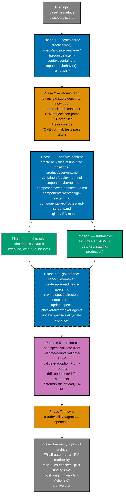

# Delivery — OrganicLever Specs Standardization (Pilot)

## Phase flow

The diagram below shows the phase ordering and the additive-before-subtractive constraint. New specs/ files MUST exist before any app/infra README is trimmed.



> **Phase 2 is the atomic-reorg commit.** Everything that depends on spec paths (`rhino-cli`, Nx project.json, step files, Playwright configs) updates in a single commit so tests don't break in between. See [§Phase 2](#phase-2--atomic-reorg-spec-tree--all-path-updates) for the precise checklist.

## Pre-flight

- [ ] On `main` (or in an `ose-public` worktree branched off `main`); working tree clean
- [ ] `npm install` clean (no postinstall failures)
- [ ] `npm run lint:md` exits 0 on the baseline
- [ ] `nx run organiclever-web:test:quick --skip-nx-cache` exits 0 on baseline
- [ ] `nx run organiclever-be:test:quick --skip-nx-cache` exits 0 on baseline
- [ ] `nx run rhino-cli:test:quick --skip-nx-cache` exits 0 on baseline
- [ ] `nx run rhino-cli:test:integration --skip-nx-cache` exits 0 on baseline
- [ ] `rg "apps/organiclever-web/docs/explanation/bounded-context-map" --glob '!plans/done/**' --glob '!generated-reports/**' --glob '!node_modules/**'` records the count
- [ ] `rg "specs/apps/organiclever/(be|web|ddd|c4|contracts)/" --glob '!plans/done/**' --glob '!generated-reports/**' --glob '!node_modules/**' | wc -l` records the count of old-path references that will need updating in Phase 2

### Baseline metrics

| Item                                          | Baseline value | Target           |
| --------------------------------------------- | -------------- | ---------------- |
| `apps/organiclever-web/README.md` line count  | 301            | ≤ 120            |
| `apps/organiclever-be/README.md` line count   | 110            | ≤ 120            |
| `apps/organiclever-web-e2e/README.md` line count | 119         | ≤ 120            |
| `apps/organiclever-be-e2e/README.md` line count | 129          | ≤ 120            |
| `infra/dev/organiclever/README.md` line count | 32             | ≤ 60             |
| `infra/k8s/organiclever/README.md` line count | 32             | ≤ 60             |
| `infra/k8s/organiclever/staging/README.md`    | 15             | ≤ 30             |
| `infra/k8s/organiclever/production/README.md` | 19             | ≤ 30             |
| Inbound BC map references                     | 8              | 0 (after move)   |

## Phase 1 — Scaffold the new spec tree (top-level only, no clashes)

Additive only. Create the FIVE top-level directories + their immediate index READMEs ONLY. Sub-folder READMEs (`components/be/README.md`, `components/web/README.md`, `behavior/be/README.md`, `behavior/web/README.md`) are NOT created here — those arrive in Phase 2A via `git mv` of the existing flat-root `be/README.md` and `web/README.md`. Sub-DIRECTORIES are created (empty) so Phase 2A `git mv` lands content into them.

- [ ] **1.1 Create `specs/apps/organiclever/product/README.md`** (thin index: one-line description + planned children list)
- [ ] **1.2 Create `specs/apps/organiclever/system-context/README.md`**
- [ ] **1.3 Create `specs/apps/organiclever/containers/README.md`**
- [ ] **1.4 Create `specs/apps/organiclever/components/README.md`**
- [ ] **1.5 Create empty subdirectories** that will receive Phase 2A moves (use `mkdir -p` then `git add -N` of a `.gitkeep` if needed to track):
  - [ ] `specs/apps/organiclever/components/be/` (will receive moved `be/README.md`, `c4/component-be.md`)
  - [ ] `specs/apps/organiclever/components/web/` (will receive moved `web/README.md`, `c4/component-web.md`)
  - [ ] `specs/apps/organiclever/components/web/ddd/` (will receive moved `ddd/` content)
  - [ ] `specs/apps/organiclever/containers/contracts/` is NOT pre-created — Phase 2A.7 `git mv contracts → containers/contracts` moves the entire subtree
- [ ] **1.6 Create `specs/apps/organiclever/behavior/README.md`**
- [ ] **1.7 Create empty subdirectories** for behavior:
  - [ ] `specs/apps/organiclever/behavior/be/` (will receive moved `be/gherkin/`)
  - [ ] `specs/apps/organiclever/behavior/web/` (will receive moved `web/gherkin/`)
- [ ] **1.8 Run `npm run lint:md`** — exit 0
- [ ] **1.9 Run `nx run organiclever-web:test:quick --skip-nx-cache`** — must still pass; old paths unchanged
- [ ] **1.10 Commit**: `docs(specs): scaffold C4-aware tree top-level READMEs (no content move)`

> **NOTE**: After Phase 1, `git mv specs/apps/organiclever/be/README.md → specs/apps/organiclever/components/be/README.md` (Phase 2A.13) lands at an empty directory — no clash. Same for `web/README.md` → `components/web/README.md` in 2A.16.

## Phase 2 — Atomic reorg (spec tree + ALL path updates)

This is the BIG commit. Combines: `git mv` of all old spec subfolders into the new tree + updates to every consumer of those paths (rhino-cli code constants, test fixtures, Nx project.json inputs/commands, 16 step files, Playwright configs). Single commit because partial states fail tests. Plan to spend disproportionate time on this commit's verification.

### 2A — Spec file moves (git mv)

- [ ] **2A.1 `git mv specs/apps/organiclever/c4/context.md specs/apps/organiclever/system-context/context.md`**
- [ ] **2A.2 `git mv specs/apps/organiclever/c4/container.md specs/apps/organiclever/containers/container.md`**
- [ ] **2A.3 `git mv specs/apps/organiclever/c4/component-be.md specs/apps/organiclever/components/be/component-be.md`**
- [ ] **2A.4 `git mv specs/apps/organiclever/c4/component-web.md specs/apps/organiclever/components/web/component-web.md`**
- [ ] **2A.5 Delete `specs/apps/organiclever/c4/README.md`** — its index role is taken over by `system-context/README.md` + `containers/README.md` + `components/README.md` (each describes its own C4 level). If the c4/README.md had unique content (Gherkin coverage tables, etc.), MERGE that into the relevant new top-level README before deleting
- [ ] **2A.6 Remove now-empty `specs/apps/organiclever/c4/`**
- [ ] **2A.7 `git mv specs/apps/organiclever/contracts specs/apps/organiclever/containers/contracts`** (entire subtree, preserves project.json)
- [ ] **2A.8 `git mv specs/apps/organiclever/ddd/bounded-contexts.yaml specs/apps/organiclever/components/web/ddd/bounded-contexts.yaml`**
- [ ] **2A.9 `git mv specs/apps/organiclever/ddd/ubiquitous-language specs/apps/organiclever/components/web/ddd/ubiquitous-language`**
- [ ] **2A.10 `git mv specs/apps/organiclever/ddd/README.md specs/apps/organiclever/components/web/ddd/README.md`**
- [ ] **2A.11 Remove now-empty `specs/apps/organiclever/ddd/`**
- [ ] **2A.12 `git mv specs/apps/organiclever/be/gherkin specs/apps/organiclever/behavior/be/gherkin`**
- [ ] **2A.13 `git mv specs/apps/organiclever/be/README.md specs/apps/organiclever/components/be/README.md`** (no clash — Phase 1.5 created only the directory)
- [ ] **2A.14 Remove now-empty `specs/apps/organiclever/be/`**
- [ ] **2A.15 `git mv specs/apps/organiclever/web/gherkin specs/apps/organiclever/behavior/web/gherkin`**
- [ ] **2A.16 `git mv specs/apps/organiclever/web/README.md specs/apps/organiclever/components/web/README.md`** (no clash — Phase 1.5 created only the directory)
- [ ] **2A.17 Remove now-empty `specs/apps/organiclever/web/`**
- [ ] **2A.18 `git mv apps/organiclever-web/docs/explanation/bounded-context-map.md specs/apps/organiclever/components/web/ddd/bounded-context-map.md`**
- [ ] **2A.19 Remove now-empty `apps/organiclever-web/docs/explanation/`** and (if empty) `apps/organiclever-web/docs/`

### 2B — Walk every link in moved files

- [ ] **2B.1** Each moved file has new relative depth — walk every `[link](../...)` path and update. Files affected: every `*.md` moved in 2A. Worst offenders to manually verify: `components/web/component-web.md`, `components/web/ddd/ubiquitous-language/README.md`, `components/web/ddd/bounded-context-map.md`
- [ ] **2B.2** Rewrite the 8 BC-map inbound references per [tech-docs.md §Cross-Link Update Strategy Class A](./tech-docs.md#cross-link-update-strategy)

### 2C — rhino-cli code path constant

- [ ] **2C.1** `apps/rhino-cli/internal/bcregistry/loader.go` — change path constant from `filepath.Join(repoRoot, "specs", "apps", app, "ddd", "bounded-contexts.yaml")` to `filepath.Join(repoRoot, "specs", "apps", app, "components", "web", "ddd", "bounded-contexts.yaml")`
- [ ] **2C.2** `apps/rhino-cli/internal/bcregistry/validator.go` — update File: error-message strings: `specs/apps/<app>/ddd/bounded-contexts.yaml` → `specs/apps/<app>/components/web/ddd/bounded-contexts.yaml`
- [ ] **2C.3** `apps/rhino-cli/internal/glossary/validator.go` — same File: path updates
- [ ] **2C.4** `apps/rhino-cli/cmd/ddd_bc_test.go` — update expected `File:` strings in test fixtures (12 references confirmed via grep)
- [ ] **2C.5** `apps/rhino-cli/cmd/ddd_ul_test.go` — same (5 references)
- [ ] **2C.6** `apps/rhino-cli/cmd/ddd_bc.integration_test.go` — update inline YAML fixture `glossary:` and `gherkin:` paths to use new tree
- [ ] **2C.7** `apps/rhino-cli/cmd/ddd_ul.integration_test.go` — same
- [ ] **2C.8** `apps/rhino-cli/README.md` — update path references in docs (line ~658, ~949, ~959 per discovery grep)

### 2D — Nx project.json updates

- [ ] **2D.1** `apps/organiclever-web/project.json`:
  - codegen `command` and `inputs`: `specs/apps/organiclever/contracts/generated/openapi-bundled.yaml` → `specs/apps/organiclever/containers/contracts/generated/openapi-bundled.yaml`
  - test:unit / test:quick / spec-coverage `inputs`:
    - `specs/apps/organiclever/web/gherkin/**/*.feature` → `specs/apps/organiclever/behavior/web/gherkin/**/*.feature`
    - `specs/apps/organiclever/ddd/bounded-contexts.yaml` → `specs/apps/organiclever/components/web/ddd/bounded-contexts.yaml`
    - `specs/apps/organiclever/ddd/ubiquitous-language/**/*.md` → `specs/apps/organiclever/components/web/ddd/ubiquitous-language/**/*.md`
  - spec-coverage `command`: `specs/apps/organiclever/web/gherkin` → `specs/apps/organiclever/behavior/web/gherkin`
- [ ] **2D.2** `apps/organiclever-be/project.json`:
  - codegen path: same swap to `containers/contracts/...`
  - test:unit / test:integration / spec-coverage `inputs` and `command`: `be/gherkin` → `behavior/be/gherkin`
- [ ] **2D.3** `apps/organiclever-web-e2e/project.json` — update inputs + spec-coverage command (web/gherkin → behavior/web/gherkin)
- [ ] **2D.4** `apps/organiclever-be-e2e/project.json` — same (be/gherkin → behavior/be/gherkin)

### 2E — Test step files + Playwright configs

- [ ] **2E.1** All 16 step files under `apps/organiclever-web/test/unit/steps/` — update `Covers:` header comments AND `path.resolve(...)` strings: `specs/apps/organiclever/web/gherkin/...` → `specs/apps/organiclever/behavior/web/gherkin/...`
- [ ] **2E.2** `apps/organiclever-web-e2e/playwright.config.ts` — if it points at the spec feature glob, update
- [ ] **2E.3** `apps/organiclever-be-e2e/playwright.config.ts` — same

### 2F — Verify Phase 2 atomicity

- [ ] **2F.0 Nx project discovery (FR-12)**: `nx show projects | grep organiclever-contracts` — must list the project at new path. Run `nx run organiclever-contracts:lint` and `nx run organiclever-contracts:docs` (with `--skip-nx-cache`) — must exit 0
- [ ] **2F.1 Confirm zero stragglers**:
  ```bash
  rg "specs/apps/organiclever/(be|web|ddd|c4|contracts)/" \
    --glob '!plans/done/**' --glob '!generated-reports/**' --glob '!node_modules/**'
  ```
  Expect 0 results
- [ ] **2F.2 Confirm zero BC-map old-path stragglers**:
  ```bash
  rg "apps/organiclever-web/docs/explanation/bounded-context-map" \
    --glob '!plans/done/**' --glob '!generated-reports/**' --glob '!node_modules/**'
  ```
  Expect 0 results
- [ ] **2F.3 Run `npm run lint:md`** — exit 0
- [ ] **2F.4 Run `nx run organiclever-web:test:quick --skip-nx-cache`** — exit 0 (DDD enforcement passes against new paths)
- [ ] **2F.5 Run `nx run organiclever-be:test:quick --skip-nx-cache`** — exit 0
- [ ] **2F.6 Run `nx run rhino-cli:test:quick --skip-nx-cache`** — exit 0
- [ ] **2F.7 Run `nx run rhino-cli:test:integration --skip-nx-cache`** — exit 0
- [ ] **2F.8 Run `nx run organiclever-web-e2e:test:quick --skip-nx-cache`** — exit 0
- [ ] **2F.9 Run `nx run organiclever-be-e2e:test:quick --skip-nx-cache`** — exit 0
- [ ] **2F.10 Sync `.claude/skills/` change to `.opencode/`**: `npm run sync:claude-to-opencode`
- [ ] **2F.11 Commit (the BIG one)**: `refactor(specs+rhino-cli): reorganize specs/apps/organiclever to C4-aware tree + update all consumers`
   Note: this commit should fit in a single message but the diff will be large. Use a HEREDOC body with bullet points listing each subsystem updated.

## Phase 3 — Create new content files at final tree positions

Additive. Each file lands at its FINAL tree position; no later move needed. PM-Readability Contract applied to every file.

- [ ] **3.1 Create `specs/apps/organiclever/product/overview.md`** — PM-first plain-language summary, personas, primary user flows, v0 scope vs deferred. Header block per FR-6 (Audience, summary)
- [ ] **3.2 Run `npm run lint:md`** + **Commit**: `docs(specs): create product/overview.md (PM-first product summary)`

- [ ] **3.3 Create `specs/apps/organiclever/components/web/architecture.md`** — Extract from `apps/organiclever-web/README.md` "Architecture" section: project layout (full bounded-context tree), layer rules, dormant BE integration code listing. PM-Readability Contract applied
- [ ] **3.4 Run `npm run lint:md`** + **Commit**: `docs(specs): create components/web/architecture.md`

- [ ] **3.5 Create `specs/apps/organiclever/components/web/routes-and-screens.md`** — Extract routes/screens/entry-flows tables. PM-Readability Contract applied
- [ ] **3.6 Run `npm run lint:md`** + **Commit**: `docs(specs): create components/web/routes-and-screens.md`

- [ ] **3.7 Create `specs/apps/organiclever/components/web/design-system.md`** — Palette, typography, dark mode, token import, components. PM-Readability Contract applied
- [ ] **3.8 Run `npm run lint:md`** + **Commit**: `docs(specs): create components/web/design-system.md`

- [ ] **3.9 Create `specs/apps/organiclever/components/be/api.md`** — API endpoints, env vars narrative, architecture tree. PM-Readability Contract applied
- [ ] **3.10 Run `npm run lint:md`** + **Commit**: `docs(specs): create components/be/api.md`

- [ ] **3.11 Create `specs/apps/organiclever/containers/deployment.md`** — Envs table, Docker images, Spring-profile mapping note (with the F#/Giraffe correction note). PM-Readability Contract applied
- [ ] **3.12 Run `npm run lint:md`** + **Commit**: `docs(specs): create containers/deployment.md`

- [ ] **3.13 Update `specs/apps/organiclever/README.md`** — replace old structure description with new five-folder tree; add `## For Product / Project Managers` reading-path section per FR-7
- [ ] **3.14 Run `npm run lint:md`** + **Commit**: `docs(specs): update root README to reflect C4-aware tree + add PM reading path`

## Phase 4 — Trim app READMEs (removes duplicated content)

Each app trim is its own commit. After each commit, run the relevant `test:quick` and `npm run lint:md`. Behavior & Architecture link sections point at the NEW tree paths (Phase 2 already completed the reorg).

- [ ] **4.1 Rewrite `apps/organiclever-web/README.md`** to thin form (≤ 120 lines) per [prd.md FR-1](./prd.md#fr-1-thin-app-readme-rule). Sections:
  - One-paragraph intro · Status banner · Quick Start · Commands (Nx targets table) · Environment Variables · Project Layout (top-level only) · Tech Stack · Behavior & Architecture (links to `specs/apps/organiclever/components/web/`, `specs/apps/organiclever/behavior/web/gherkin/`, `specs/apps/organiclever/components/web/ddd/`) · Related
- [ ] **4.2 Verify line count** ≤ 120
- [ ] **4.3 `npm run lint:md`** + `nx run organiclever-web:test:quick --skip-nx-cache` exit 0
- [ ] **4.4 Commit**: `docs(apps): trim organiclever-web README to dev-runtime`

- [ ] **4.5 Rewrite `apps/organiclever-be/README.md`** to thin form (≤ 120 lines, likely ~70). Remove "API Endpoints" inline table, "Architecture" project tree, "Testing Strategy" tier table. Behavior & Architecture links to `specs/apps/organiclever/components/be/api.md` + `specs/apps/organiclever/behavior/be/gherkin/`
- [ ] **4.6 Verify line count** ≤ 120
- [ ] **4.7 `npm run lint:md`** + `nx run organiclever-be:test:quick --skip-nx-cache` exit 0
- [ ] **4.8 Commit**: `docs(apps): trim organiclever-be README to dev-runtime`

- [ ] **4.9 Rewrite `apps/organiclever-web-e2e/README.md`** to thin form. Keep: prerequisites, Setup, Running Tests, Environment Variables, Project Structure (top-level only). Move "What This Tests" inline list to a one-line pointer at `specs/apps/organiclever/behavior/web/gherkin/`
- [ ] **4.10 Verify line count** ≤ 120
- [ ] **4.11 `npm run lint:md`** exit 0
- [ ] **4.12 Commit**: `docs(apps): trim organiclever-web-e2e README to dev-runtime`

- [ ] **4.13 Rewrite `apps/organiclever-be-e2e/README.md`** to thin form. Same approach — keep dev-runtime, move behavior to `specs/apps/organiclever/behavior/be/gherkin/`
- [ ] **4.14 Verify line count** ≤ 120
- [ ] **4.15 `npm run lint:md`** exit 0
- [ ] **4.16 Commit**: `docs(apps): trim organiclever-be-e2e README to dev-runtime`

## Phase 5 — Trim infra/ READMEs

- [ ] **5.1 Verify `infra/dev/organiclever/README.md`** — confirm purely Docker-Compose runtime. Add one-line "Behavior & Architecture" pointer to `specs/apps/organiclever/containers/deployment.md`. Target ≤ 60 lines
- [ ] **5.2 Verify `infra/k8s/organiclever/README.md`** — Remove Docker-image build narrative + staging/production profile mapping. Replace with "build + apply" runtime block + link to `specs/apps/organiclever/containers/deployment.md`. Keep link to `infra/dev/organiclever/README.md`. Target ≤ 60 lines
- [ ] **5.3 Verify `infra/k8s/organiclever/staging/README.md`** — Reduce to status placeholder + one-line link to `specs/apps/organiclever/containers/deployment.md`. Target ≤ 30 lines
- [ ] **5.4 Verify `infra/k8s/organiclever/production/README.md`** — Same shape as 5.3. Target ≤ 30 lines
- [ ] **5.5 `npm run lint:md`** exit 0
- [ ] **5.6 Commit**: `docs(infra): trim organiclever infra READMEs to runtime-only + link to specs/containers/deployment`

## Phase 6 — Governance propagation (delegated to repo-rules-maker)

The executor MUST delegate this phase to `repo-rules-maker`. Hand-editing governance files breaks FR-8 / FR-9. The agent prompt below captures all four files + cross-link symmetry + the new combined-doc shape.

- [ ] **6.1 Invoke `repo-rules-maker`** with the prompt:
  ```
  Create governance/conventions/structure/app-readme-vs-specs.md as a SINGLE
  COMBINED convention codifying FOUR rules from
  plans/in-progress/organiclever-specs-standardization/tech-docs.md:
    1. Content Split Rule (Category A app-README vs Category B specs/)
    2. Spec Tree Shape (the C4-aware five-folder tree:
       product/, system-context/, containers/, components/, behavior/)
    3. PM-Readability Contract (six rules)
    4. BDD/DDD/Contracts Adoption Assumption (FR-10 in PRD —
       non-CLI apps SHOULD adopt all three; CLI defers DDD)

  Follow the skeleton in tech-docs.md §Governance Propagation §Skeleton.
  Frontmatter MUST include `Status: Pilot — initial issue` and a
  `## Refinement log` subsection seeded with one entry:
    "2026-05-09 — CLI DDD adoption deferred; revisit if a CLI grows past
     ~10 commands or shows aggregate-shaped state."
  Include the per-surface variant table (full-stack / web-only / CLI-only / multi-CLI)
  AND the rollout adoption mapping table (organiclever / ayokoding / oseplatform /
  wahidyankf / rhino vs BDD / DDD / Contracts).

  ALSO update these files:
  1. governance/conventions/structure/specs-directory-structure.md (REWRITE)
     — Replace flat-root be/web/cli/build-tools layout with the C4-aware
       five-folder tree as the repo-wide standard. Per-surface variants. Migration path.
       Cross-link to app-readme-vs-specs.md.
  2. governance/conventions/structure/README.md (UPDATE)
     — Add new convention to Documents list; update specs-directory-structure description.
  3. governance/conventions/writing/readme-quality.md (UPDATE)
     — Add §Scope vs structural conventions cross-linking app-readme-vs-specs.md.
  4. .claude/agents/specs-checker.md (UPDATE — FR-11)
     — AMEND Category 1: README required at all 5 top-level folders + per-surface subfolders
     — REPLACE Category 8: flat-root rule → C4-aware five-folder tree compliance
     — ADD Category 9 (Adoption Gaps) per FR-10 validation hooks
     — TAG each Validation Category as "[Deterministic via rhino-cli]" or "[LLM]"
       per the FR-14 split (deterministic categories invoke rhino-cli specs subcommands
       via Bash; LLM categories keep current LLM reasoning).
     — ADD a "Drift Detection" subsection routing to rhino-cli specs drift-* commands
       per FR-13.
  5. .claude/agents/specs-fixer.md (UPDATE — FR-11)
     — Auto-fix list gains: scaffold missing top-level / per-surface READMEs
       (template per per-surface variant); rewrite README count claims using
       rhino-cli specs validate-counts output; rewrite routes/endpoints tables
       using drift-routes / drift-endpoints output.
     — Adoption gaps and tree-shape violations move to Requires Review (NOT auto-fix).
  6. .claude/agents/specs-maker.md (UPDATE — FR-11)
     — Scaffolding template REPLACED to emit canonical 5-folder tree.
     — Support `surface-profile` parameter (web-only / cli-only / full-stack / multi-cli)
       to populate only the relevant subdirectories.
  7. governance/workflows/specs/specs-quality-gate.md (UPDATE — FR-11/13)
     — Validation Dimensions table gains "Spec Tree Shape" (Cat 8 amend) and
       "Adoption Gaps" (Cat 9) and "Drift Detection" (NEW) rows.
     — Iteration Example updated to show new findings.
     — Add "Deterministic Offload" subsection explaining that deterministic categories
       are owned by `rhino-cli specs <subcmd>` per FR-14, and that the workflow
       invokes them via the agents.

  Do NOT touch any non-governance files (apps/, infra/, specs/, plans/).
  Do NOT modify rhino-cli code — that's Phase 6.5 (separate).
  ```
- [ ] **6.2 Verify all SEVEN files exist and conform**:
  - [ ] `governance/conventions/structure/app-readme-vs-specs.md`: frontmatter (`Status: Pilot — initial issue`); Purpose; Standards 1-7 (split rule, forbidden/required sections, length budget, tree shape, PM contract, BDD/DDD/Contracts adoption, cross-link integrity); Examples (≥ 3 before/after); Validation; Refinement log (seeded with CLI-DDD-deferred entry); Related
  - [ ] `governance/conventions/structure/specs-directory-structure.md`: REWRITTEN; describes C4-aware five-folder tree; no longer prescribes flat-root layout for new apps; per-surface variants present
  - [ ] `governance/conventions/structure/README.md` lists new convention; specs-directory-structure description reflects rewrite
  - [ ] `governance/conventions/writing/readme-quality.md` cross-references the new convention
  - [ ] `.claude/agents/specs-checker.md`: Cat 1 amended (5-folder READMEs); Cat 8 replaced (C4-aware); Cat 9 added (Adoption Gaps); each category tagged Deterministic/LLM; Drift Detection subsection present
  - [ ] `.claude/agents/specs-fixer.md`: auto-fix list gains scaffold missing top-level/per-surface READMEs + count/route/endpoint rewrites via rhino-cli output; adoption gaps + tree-shape moves go to Requires Review
  - [ ] `.claude/agents/specs-maker.md`: scaffolding template emits canonical 5-folder tree; supports surface-profile parameter
  - [ ] `governance/workflows/specs/specs-quality-gate.md`: Validation Dimensions table gains 3 new rows (tree shape, adoption gaps, drift); Deterministic Offload subsection present
- [ ] **6.3 `npm run lint:md`** exit 0
- [ ] **6.4 Run `repo-rules-checker`** against all seven governance files + pilot artifacts. Expect zero findings; if findings appear, see Phase 8 step 8.7
- [ ] **6.5 Commit (split into two for clarity)**:
  - **6.5a** `docs(governance): create app-readme-vs-specs + rewrite specs-directory-structure via repo-rules-maker`
  - **6.5b** `docs(governance): update specs-checker/fixer/maker agents + specs-quality-gate workflow via repo-rules-maker`

## Phase 6.5 — Implement rhino-cli specs subcommands (FR-14)

This phase delivers the deterministic offload commands that the agents (updated in Phase 6) call. TDD shape: write the Gherkin feature first (lands at the new tree position `specs/apps/rhino/behavior/cli/gherkin/specs/<subcmd>.feature`), then step impl, then Go code, then verify ≥90% coverage.

For each subcommand below, follow the same TDD micro-loop. Subcommands ordered by dependency (validate-tree first since others reference it).

- [ ] **6.5.1 `rhino-cli specs validate-tree <app>`** — Filesystem walk; emit JSONL findings for tree-shape violations. Gherkin feature + step impl (mocked + integration) + Go code + ≥90% coverage
- [ ] **6.5.2 `rhino-cli specs validate-counts <folder>`** — Parse `.feature` files; compare to README counts. Same TDD pattern
- [ ] **6.5.3 `rhino-cli specs validate-links <folder>`** — Markdown AST + filesystem resolve. JSONL findings on broken links
- [ ] **6.5.4 `rhino-cli specs validate-adoption <app>`** — Check existence of `containers/contracts/`, `components/<surface>/ddd/`, `behavior/<surface>/gherkin/` per FR-10 hooks. JSONL adoption-gap findings
- [ ] **6.5.5 Run `nx run rhino-cli:test:quick --skip-nx-cache`** + `nx run rhino-cli:test:integration --skip-nx-cache` — exit 0
- [ ] **6.5.6 Commit**: `feat(rhino-cli): add specs validate-tree/validate-counts/validate-links/validate-adoption + Gherkin specs`
- [ ] **6.5.7 `rhino-cli specs drift-routes <app>`** — Walk `apps/<app>/src/app/**/page.tsx`; compare to `routes-and-screens.md` table
- [ ] **6.5.8 `rhino-cli specs drift-endpoints <app>`** — F# regex scan of route attributes; compare to `api.md` table
- [ ] **6.5.9 `rhino-cli specs drift-contracts <app>`** — Compare F# attributes to `openapi.yaml` paths
- [ ] **6.5.10 Run `nx run rhino-cli:test:quick --skip-nx-cache`** + `nx run rhino-cli:test:integration --skip-nx-cache` — exit 0
- [ ] **6.5.11 Commit**: `feat(rhino-cli): add specs drift-routes/drift-endpoints/drift-contracts + Gherkin specs`
- [ ] **6.5.12 Smoke-test from agent perspective**: invoke `rhino-cli specs validate-tree organiclever` and confirm JSONL output is parseable + matches expected schema

## Phase 7 — Skill mirror sync

- [ ] **7.1 Re-run `npm run sync:claude-to-opencode`** to mirror any final `.claude/skills/` updates to `.opencode/`
- [ ] **7.2 Confirm `.opencode/` has only agent mirrors, no skill mirror** (per AGENTS.md)
- [ ] **7.3 Commit if anything synced**: `chore(sync): sync claude→opencode for organiclever specs standardization`

## Phase 8 — PM-readability check + final verification + archive

- [ ] **8.1 PM-readability self-check** — for each NEW or MOVED file under `specs/apps/organiclever/` (`product/overview.md`, `containers/deployment.md`, `components/be/api.md`, `components/web/architecture.md`, `components/web/design-system.md`, `components/web/routes-and-screens.md`, `components/web/ddd/bounded-context-map.md`), confirm:
  - [ ] First 10 lines after H1 contain an `Audience:` line and a plain-language summary paragraph
  - [ ] First occurrence of every term in the FR-6 glossary table carries a parenthetical or footnote-style gloss
  - [ ] Every section opens with intent (1-2 sentences on user value) before mechanism
  - [ ] Every code/Mermaid block is preceded by a one-sentence "what this shows" intro
  - [ ] No un-glossed framework names in the summary paragraph
- [ ] **8.2 PM-reading-path check** — `specs/apps/organiclever/README.md` contains a `## For Product / Project Managers` section with reading order (product/ → system-context/ → containers/ → components/ → behavior/), file-by-file what-to-expect notes, and 3-bullet "v0 in plain language" summary
- [ ] **8.3 Run FULL FR-15 push gate matrix** (all `--skip-nx-cache`):
  - [ ] `npm run lint:md` exit 0
  - [ ] `nx run organiclever-web:test:quick` exit 0
  - [ ] `nx run organiclever-be:test:quick` exit 0
  - [ ] `nx run organiclever-web-e2e:test:quick` exit 0
  - [ ] `nx run organiclever-be-e2e:test:quick` exit 0
  - [ ] `nx run organiclever-web:spec-coverage` exit 0
  - [ ] `nx run organiclever-web:test:integration` exit 0
  - [ ] `nx run organiclever-contracts:lint` + `nx run organiclever-contracts:docs` exit 0 (FR-12)
  - [ ] `nx run rhino-cli:test:quick` exit 0 (DDD enforcement on new paths + new specs subcommands)
  - [ ] `nx run rhino-cli:test:integration` exit 0
  - [ ] `rhino-cli specs validate-tree organiclever` finds zero violations (FR-14)
  - [ ] `rhino-cli specs validate-counts specs/apps/organiclever` finds zero violations
  - [ ] `rhino-cli specs validate-links specs/apps/organiclever` finds zero violations
  - [ ] `rhino-cli specs validate-adoption organiclever` finds zero HIGH findings
  - [ ] Pre-push hook simulation: `npx nx affected -t typecheck lint test:quick spec-coverage` exit 0
- [ ] **8.4 Re-run stragglers grep**:
  ```bash
  # No old BC map references
  rg "apps/organiclever-web/docs/explanation/bounded-context-map" \
    --glob '!plans/done/**' --glob '!generated-reports/**' --glob '!node_modules/**'
  # No old flat-root spec subfolder references
  rg "specs/apps/organiclever/(be|web|ddd|c4|contracts)/" \
    --glob '!plans/done/**' --glob '!generated-reports/**' --glob '!node_modules/**'
  ```
  Expect 0 results from both
- [ ] **8.5 Verify acceptance criteria from [prd.md §Acceptance criteria](./prd.md#acceptance-criteria-gherkin)** — every Gherkin scenario passes manually, INCLUDING all FR-1 through FR-9 scenarios, the C4-aware tree-shape scenarios, the rhino-cli path scenario, the governance propagation scenarios
- [ ] **8.6 Run `repo-rules-checker`** against pilot artifacts. If findings:
  - **A. Pilot artifact violates convention** → fix the artifact in a follow-up commit, re-run checker, repeat
  - **B. Convention does not yet describe the violation** → invoke `repo-rules-maker` again to amend `app-readme-vs-specs.md`, log the amendment in `## Refinement log`, write `pilot-findings.md` summarising the amendment
  - **C. Both** → resolve B then A
- [ ] **8.7 Write `pilot-findings.md`** capturing at least:
  - Stale Spring/Java references in `infra/k8s/organiclever/{staging,production}/README.md` (organiclever-be is F#/Giraffe; tracked for separate fix plan)
  - rhino-cli Strategy A path constant choice (vs Strategy B walking) — record so future BE-DDD adoption knows
  - Any §8.6 amendments
- [ ] **8.8 Move plan folder to done**: `git mv plans/in-progress/organiclever-specs-standardization plans/done/2026-MM-DD__organiclever-specs-standardization` (using actual completion-date prefix)
- [ ] **8.9 Update `plans/in-progress/README.md`** — remove from active list
- [ ] **8.10 Update `plans/done/README.md`** if it lists individual archived plans
- [ ] **8.11 FR-15 push gate — final pre-push checks**:
  - [ ] Re-run all 8.3 commands one last time; ALL exit 0
  - [ ] Confirm working tree clean (no uncommitted changes besides plan archive)
  - [ ] If the worktree branch has commits not yet on local `main`, fast-forward `main` first OR push the worktree branch directly to `main` per Trunk-Based Development
- [ ] **8.12 Push to `origin main`**: `git push origin worktree/<branch>:main` (or whichever publish path applies — direct-to-main per the parent worktree convention)
- [ ] **8.13 Post-push GitHub Actions monitoring** (FR-15):
  - [ ] Run `gh run list --branch main --limit 5` — confirm latest workflow runs are queued or running
  - [ ] Wait per [CI Monitoring](../../../governance/development/workflow/ci-monitoring.md) — schedule wakeup every 3-5 min; do NOT tight-loop
  - [ ] All triggered workflows complete with conclusion `success`
  - [ ] If ANY workflow fails: diagnose, push fix commit, repeat 8.13. NEVER mark plan archived until CI is green
- [ ] **8.14 Commit (plan archive — typically done before 8.12 push)**: `docs(plans): archive organiclever-specs-standardization to plans/done/`

## Iron rules

1. **Phase 2 is atomic.** The big reorg + path-update commit MUST land all spec moves AND all consumer updates (rhino-cli code, Nx project.json, step files, e2e configs) in a single commit. Partial states fail tests. If the commit gets too large to reason about, split phase 2 into 2A/2B/2C SUB-PHASES that each commit but use a feature branch for the entire phase before merging.
2. **Additive before subtractive.** Phases 1 + 3 create new content; Phases 4 + 5 remove duplicated content from app/infra READMEs. Spec files exist at their final tree positions before any old README is trimmed.
3. **Each commit ships independently.** Pre-push hook runs after each commit. If a commit breaks `npm run lint:md` or any `test:quick`, fix in THAT commit, not the next.
4. **`git mv` for every move.** Never copy + delete. The big Phase-2 commit uses `git mv` for every spec subfolder; blame and history follow.
5. **Code path updates pair with spec moves.** If you update a `path.resolve(...)` in a step file, the corresponding spec file MUST already be at the new path within the same commit. Verified by 2F probes.
6. **Pilot findings are surfaced, not buried.** Findings from `repo-rules-checker` either (a) fix the artifact, (b) amend the convention with Refinement log entry, or (c) both. Document in `pilot-findings.md`.
7. **Worktree discipline.** Run delivery from the existing `ose-public` worktree (`worktrees/ddd/`) or another `ose-public` worktree. No parent-rooted edits.
8. **Don't start until told.** Plan author drafted this; execution begins ONLY after the user says "execute" or equivalent.
9. **Governance edits go through repo-rules-maker.** Phase 6 files (`app-readme-vs-specs.md`, `specs-directory-structure.md`, structure-conventions index, `readme-quality.md`) are written or amended ONLY by `repo-rules-maker`. Hand-editing violates FR-8.
10. **Convention amendments are logged.** Any change to `app-readme-vs-specs.md` after its initial commit MUST add an entry to its `## Refinement log` subsection (what changed, why); ships in the same commit.
11. **No FEATURE changes to code.** Code edits are spec-path strings only — constants, fixtures, feature paths, glob patterns. If a behavior change to TS/F# code appears necessary, the plan is wrong and execution stops to update.
12. **Reorg pattern locks in for rollouts.** After this pilot lands, the four follow-up rollouts (`ayokoding`, `oseplatform`, `wahidyankf`, `rhino`) APPLY the convention. They do NOT modify the C4-aware tree shape. Any tree-shape revision requires a new pilot.
13. **Push gate is binary.** Push to `origin main` proceeds ONLY when every command in the FR-15 gate matrix exits 0. After pushing, GitHub Actions CI workflows must complete with conclusion `success` before the plan is considered done. CI-failure means revert/fix, never bypass.
14. **Deterministic checks go through rhino-cli.** Per FR-14, validations that can be done by reading the filesystem or parsing files (counts, tree shape, link integrity, adoption gaps, route/endpoint enumeration) MUST be implemented as `rhino-cli specs <subcmd>` Go code. LLM agents shell out to those commands rather than re-implementing the check in prompt logic. Any new deterministic check follows the same pattern.
15. **CI configuration also moves with the spec tree.** If GitHub Actions workflows or pre-push hooks reference old `specs/apps/organiclever/{be,web,ddd,c4,contracts}/` paths, those references update in Phase 2D as part of the atomic reorg commit. Discovery scan in Pre-flight catches them.
