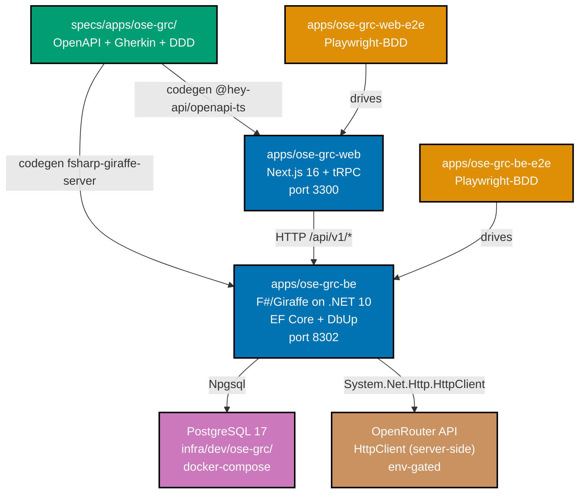

# Tech Docs — ose-grc Bootstrap

## Architecture Overview



Reference materials (read-only):

- **F# baseline** — `ose-primer/apps/crud-be-fsharp-giraffe/` (richer; has auth + CRUD + DB)
- **F# minimal baseline** — prior `apps/organiclever-be/` at commit `c5a7058c8^` (post-migration removed; health-only Giraffe shim) — useful for the `Program.fs` minimal-bootstrap shape and pre-migration `project.json` layout
- **TS baseline** — `apps/organiclever-web/` (current, Next.js 16)
- **E2E baselines** — `apps/organiclever-web-e2e/`, `apps/organiclever-be-e2e/` (current, Playwright-BDD)
- **Contracts baseline** — `specs/apps/organiclever/containers/contracts/`

## Design Decisions

### DD-1: F#/Giraffe on .NET 10 for the backend

**Choice**: F#/Giraffe REST API on .NET 10, mirroring `ose-primer/apps/crud-be-fsharp-giraffe`.

**Rationale**: User-directed (this plan was originally drafted for Python/FastAPI; the user redirected to F#/Giraffe). F# gives discriminated unions for modelling regulatory rules / internal policies / gap items as algebraic types — a natural fit for GRC domain modelling where each "kind" of gap has distinct payloads. Giraffe is a thin HTTP layer over ASP.NET Core; integrates cleanly with EF Core for PostgreSQL persistence.

**Divergence from prior organiclever-be F#**: the prior `organiclever-be` F# shim (pre-Java migration) had health-only with no DB. ose-grc-be wires DB and DbUp migrations from day 0 because GRC documents are persistent server-side state. Package set follows `ose-primer/apps/crud-be-fsharp-giraffe`.

### DD-2: PostgreSQL via EF Core + DbUp

**Choice**: EF Core 10 + Npgsql.EntityFrameworkCore.PostgreSQL 10 for the query path; **DbUp 5.* + dbup-postgresql 5.*** for forward-only migrations applied at startup. Same package set as `ose-primer/apps/crud-be-fsharp-giraffe/src/DemoBeFsgi/DemoBeFsgi.fsproj`.

**Rationale**: GRC needs document persistence (regulatory PDFs, internal SOPs, parsed text, gap reports). PGlite (organiclever-web's local-first choice) cannot host server-side documents shared across users; PostgreSQL is the only realistic choice. EF Core is well-supported in F# via record-type entities. DbUp is the lighter migration tool used in the F# template.

**Bootstrap scope**: one empty `db/migrations/0001_init.sql` (or empty `db/migrations/` directory with `.gitkeep`); production schema lands in feature plans.

### DD-3: Next.js 16 frontend, no PGlite, shared `@open-sharia-enterprise/web-ui`

**Choice**: Mirror `apps/organiclever-web/` Next.js 16 + App Router + TypeScript + tRPC + Tailwind v4 + Vitest + Storybook. **Remove** PGlite — ose-grc-web is a server-first client. **Reuse** the shared component library `libs/web-ui` (workspace name `@open-sharia-enterprise/web-ui`) and design tokens at `libs/web-ui-token` (workspace name `@open-sharia-enterprise/web-ui-token`) — the same libraries `organiclever-web`, `oseplatform-web`, and `ayokoding-web` consume.

**Rationale**: Document storage is server-side (DD-2); FE talks to BE over HTTP via generated TypeScript clients from OpenAPI. Local-first / offline-first is not a GRC requirement. The shared `web-ui` library already provides the CVA + Radix + Tailwind component set (Button, Card, Dialog, Input, Label, Alert, Icon, Sheet, AppHeader, TabBar, SideNav, etc.) plus accessibility-validated patterns — re-implementing per app violates the Simplicity Over Complexity principle and would diverge from cross-app a11y/visual-regression coverage.

**Wiring** (mirror `apps/organiclever-web/`):

- `apps/ose-grc-web/package.json` declares `"@open-sharia-enterprise/web-ui": "*"` and `"@open-sharia-enterprise/web-ui-token": "*"` (npm workspace symlinks resolve them).
- `apps/ose-grc-web/next.config.ts` includes both packages in `transpilePackages: ["@open-sharia-enterprise/web-ui", "@open-sharia-enterprise/web-ui-token"]`.
- `apps/ose-grc-web/src/app/globals.css` imports the **base** tokens via `@import "@open-sharia-enterprise/web-ui-token/src/tokens.css";`. The OrganicLever-specific warm OKLCH palette (`organiclever.css`) is **not** imported. A future plan introduces `ose-grc.css` for GRC-specific theming if needed.
- `apps/ose-grc-web/project.json` lists `"web-ui"` in `implicitDependencies` so `nx affected` re-runs the FE when shared components change.
- Smoke `page.tsx` imports at least one `web-ui` primitive (e.g., `<Button>`) so the wiring is verified end-to-end at bootstrap.

**Component additions to `libs/web-ui`**: none at bootstrap. If GRC needs new shared components later, they go through `swe-ui-maker` and land in `libs/web-ui/src/`, not in `apps/ose-grc-web/`.

**Verification**:

- `grep -r '@electric-sql/pglite' apps/ose-grc-web` returns zero matches (no PGlite).
- `grep -F '@open-sharia-enterprise/web-ui' apps/ose-grc-web/package.json apps/ose-grc-web/next.config.ts` returns at least one hit per file.
- `npx nx graph` shows an edge `ose-grc-web → web-ui` and `ose-grc-web → web-ui-token`.
- `apps/ose-grc-web/src/app/page.tsx` contains an `import { ... } from "@open-sharia-enterprise/web-ui"` statement.

### DD-4: OpenAPI 3.1 as single source of truth for the FE↔BE contract

**Choice**: `specs/apps/ose-grc/containers/contracts/openapi.yaml` is the single contract source. `ose-grc-contracts` Nx project lints + bundles it via `@redocly/cli` and `@stoplight/spectral-cli` (same toolchain as `organiclever-contracts`). Downstream codegen:

| Consumer       | Tool                                       | Generator flag                 | Output path                                                |
| -------------- | ------------------------------------------ | ------------------------------ | ---------------------------------------------------------- |
| `ose-grc-be`   | `npx openapi-generator-cli`                | `-g fsharp-giraffe-server`     | `apps/ose-grc-be/generated-contracts/` (.fs files compiled in fsproj) |
| `ose-grc-web`  | `npx @hey-api/openapi-ts`                  | n/a (TS-native)                | `apps/ose-grc-web/src/generated-contracts/`                |

**Bootstrap scope**: just `GET /api/v1/health` returning `HealthResponse`. Both consumers must successfully generate types from this single endpoint. Additional endpoints (regulatory-source upload, policy upload, gap-report fetch) are added in feature plans.

### DD-5: Four DDD bounded contexts up front

**Choice**: Declare four contexts in `specs/apps/ose-grc/ddd/bounded-contexts.yaml` at bootstrap. Each gets a `specs/apps/ose-grc/ddd/ubiquitous-language/<context>.md` stub.

| Context             | Responsibility (one sentence)                                                                                       | Layers (initial)                                       | Relationships (initial)                              |
| ------------------- | ------------------------------------------------------------------------------------------------------------------- | ------------------------------------------------------ | ---------------------------------------------------- |
| `regulatory-source` | Ingests and stores regulator-published rule documents (PDFs, circulars) with provenance metadata.                   | domain, application, infrastructure                    | Upstream supplier to `gap-analysis`.                 |
| `internal-policy`   | Ingests and stores company-internal documents (SOPs, manuals, procedures) with version + scope metadata.            | domain, application, infrastructure                    | Upstream supplier to `gap-analysis`.                 |
| `gap-analysis`      | Compares a regulatory-source corpus against an internal-policy corpus and emits structured `GapItem` records.       | domain, application, infrastructure, presentation     | Customer of `regulatory-source` and `internal-policy`; customer of `ai-orchestration`. |
| `ai-orchestration`  | Wraps LLM calls (OpenRouter), prompt management, retry/backoff, token-budget accounting. Stateless from the BE side. | domain, application, infrastructure                    | Supplier to `gap-analysis`.                         |

**Bootstrap scope**: YAML entries + `ubiquitous-language/<context>.md` stubs of ~10 lines each, listing canonical terms placeholders. F# folders `src/OseGrcBe/Domain/<Context>.fs` are stubbed empty.

**Future plans** add aggregates, value objects, application services per context.

### DD-6: BDD specs at bootstrap — one feature per side

**Choice**: At bootstrap, write exactly two Gherkin files:

- `specs/apps/ose-grc/behavior/be/gherkin/health.feature` — Scenario: BE health check returns 200.
- `specs/apps/ose-grc/behavior/web/gherkin/smoke.feature` — Scenario: FE home page loads.

**BE consumption**: `ose-grc-be:test:unit` runs xUnit + TickSpec; step files live at `apps/ose-grc-be/tests/OseGrcBe.Tests/Unit/HealthSteps.fs`.

**FE consumption**: `ose-grc-web-e2e:test:e2e` runs Playwright-BDD; step files live at `apps/ose-grc-web-e2e/steps/smoke.steps.ts`.

**spec-coverage validators** (`rhino-cli spec-coverage validate`) must report 100% step-coverage for both `.feature` files.

### DD-7: PR quality gate routing via `lang:fsharp` and `domain:ose-grc` tags

**Choice**: Re-use existing `.github/workflows/pr-quality-gate.yml` detector. Tag each project:

| Project           | Tags                                                                  |
| ----------------- | --------------------------------------------------------------------- |
| `ose-grc-web`     | `type:app`, `platform:nextjs`, `lang:ts`, `domain:ose-grc`            |
| `ose-grc-be`      | `type:app`, `platform:giraffe`, `lang:fsharp`, `domain:ose-grc`       |
| `ose-grc-web-e2e` | `type:e2e`, `platform:playwright`, `lang:ts`, `domain:ose-grc`        |
| `ose-grc-be-e2e`  | `type:e2e`, `platform:playwright`, `lang:ts`, `domain:ose-grc`        |
| `ose-grc-contracts` | `type:lib`, `platform:openapi`, `domain:ose-grc`                    |

The PR-quality-gate `detect` job already routes `lang:fsharp|lang:csharp` → `has-dotnet` → `dotnet` quality-gate job (verified at `.github/workflows/pr-quality-gate.yml`). No new workflow file or detector branch needed.

### DD-8: Dev workflow per product line

**Choice**: Create `.github/workflows/test-and-deploy-ose-grc-web-development.yml` mirroring `test-and-deploy-organiclever-web-development.yml`. Stub the deploy step to a no-op until Vercel project is linked in a later plan.

**Staging + prod workflows** (`test-ose-grc-web-staging.yml`, `deploy-ose-grc-web-to-production.yml`) are scaffolded as stubs (workflow_dispatch only, no scheduled trigger) so the naming convention is established; activation deferred.

### DD-9: doctor wires .NET 10 + local tools

**Choice**: Add `apps/ose-grc-be/global.json` pinning SDK 10.x (mirror `ose-primer/apps/crud-be-fsharp-giraffe/global.json`). Add `apps/ose-grc-be/dotnet-tools.json` declaring `altcover.global` and `fsharp-analyzers` (matching the verified contents of `ose-primer/apps/crud-be-fsharp-giraffe/dotnet-tools.json` — `[Repo-grounded]`, confirmed via `cat ose-primer/apps/crud-be-fsharp-giraffe/dotnet-tools.json`).

**fantomas + fsharplint provisioning**: These are NOT local `dotnet-tools.json` entries in the ose-primer pattern. They are invoked via `DOTNET_ROLL_FORWARD=LatestMajor fantomas --check ...` and `DOTNET_ROLL_FORWARD=LatestMajor dotnet fsharplint lint ...` from the lint target, assuming they are available as global dotnet tools on the worktree machine. Doctor must ensure they are installed globally (see rhino-cli change below).

**Doctor integration — rhino-cli code change REQUIRED**: `apps/rhino-cli/internal/doctor/tools.go` does NOT auto-scan `apps/*/global.json`; it carries a hardcoded path list. `[Repo-grounded]` — `grep -n "global.json\|fsharp-giraffe" apps/rhino-cli/internal/doctor/tools.go` shows:

```
line 37: filepath.Join(repoRoot, "apps", "a-demo-be-fsharp-giraffe", "global.json")
line 35: filepath.Join(repoRoot, "apps", "a-demo-be-python-fastapi", ".python-version")
```

These point at `apps/a-demo-be-*/` paths that **no longer exist in `ose-public`** (the polyglot demo apps were extracted to `ose-primer` on 2026-04-18 per AGENTS.md). The doctor's .NET-SDK lane currently has no live anchor file in `ose-public` at all.

**Action required in this plan**: Delivery Phase 3 includes a step to edit `apps/rhino-cli/internal/doctor/tools.go` so the F# SDK probe anchors on `apps/ose-grc-be/global.json` (replacing the dead `apps/a-demo-be-fsharp-giraffe/global.json` reference). The unit tests at `apps/rhino-cli/internal/doctor/tools_test.go` and `apps/rhino-cli/cmd/doctor_test.go` may need a matching path update.

Plan-level acceptance criterion AC-9 verifies the end-to-end doctor flow on a fresh worktree once this rhino-cli change lands.

### DD-10: OpenRouter integration — placeholder only

**Choice**: At bootstrap, OpenRouter integration is **plumbing**, not behavior. The deliverables:

- `apps/ose-grc-be/.env.example` — keys `OPENROUTER_API_KEY=`, `OPENROUTER_MODEL=openrouter/auto`, `OPENROUTER_BASE_URL=https://openrouter.ai/api/v1`.
- F# settings record `OseGrcBe.AiOrchestration.OpenRouterSettings` in `src/OseGrcBe/Domain/AiOrchestration.fs` with three fields (`apiKey`, `model`, `baseUrl`).
- ASP.NET options binding in `Program.fs` reads from configuration (`OpenRouter:ApiKey`, etc.).
- No actual HTTP client wired; no `HttpClient.PostAsync` call. Feature plan will add Polly + Refit or raw `System.Net.Http.HttpClient`.

**Rationale**: Bootstrap commits to **placement and contract**, not implementation. This keeps the bootstrap diff small and avoids freezing OpenRouter API shape before the first feature plan exercises it.

## File Impact Map

### New directories (created in this plan)

```
apps/
├── ose-grc-web/                    # Full Next.js 16 scaffold mirroring organiclever-web minus PGlite
├── ose-grc-be/                     # Full F#/Giraffe scaffold mirroring crud-be-fsharp-giraffe (DB-enabled)
├── ose-grc-web-e2e/                # Mirror organiclever-web-e2e
└── ose-grc-be-e2e/                 # Mirror organiclever-be-e2e

specs/apps/ose-grc/
├── README.md                        # Top-level spec index, mirroring organiclever README
├── behavior/
│   ├── README.md
│   ├── be/gherkin/health.feature
│   └── web/gherkin/smoke.feature
├── components/                      # Empty + .gitkeep + README stub
├── containers/
│   ├── README.md
│   ├── container.md                 # C4 container diagram stub
│   ├── deployment.md                # Deployment topology stub
│   └── contracts/
│       ├── README.md
│       ├── .spectral.yaml
│       ├── openapi.yaml
│       ├── project.json             # ose-grc-contracts Nx project
│       ├── paths/health.yaml
│       ├── schemas/error.yaml
│       └── schemas/health.yaml
├── ddd/
│   ├── README.md
│   ├── bounded-context-map.md       # Initial Mermaid diagram + relationship table
│   ├── bounded-contexts.yaml        # 4 contexts declared (DD-5)
│   └── ubiquitous-language/
│       ├── README.md
│       ├── regulatory-source.md
│       ├── internal-policy.md
│       ├── gap-analysis.md
│       └── ai-orchestration.md
├── product/                         # Empty + README stub
└── system-context/                  # Empty + README stub (C4 system-context placeholder)

infra/dev/ose-grc/
├── README.md
├── .env.example
├── .gitignore
├── docker-compose.yml               # postgres + ose-grc-be + ose-grc-web
├── docker-compose.ci.yml            # CI overrides
├── Dockerfile.be.dev
└── Dockerfile.fe.dev

.github/workflows/
├── test-and-deploy-ose-grc-web-development.yml
├── test-ose-grc-web-staging.yml      # Stub (workflow_dispatch only)
└── deploy-ose-grc-web-to-production.yml # Stub (workflow_dispatch only)
```

### `apps/ose-grc-be/` structure (mirrors `ose-primer/apps/crud-be-fsharp-giraffe/`)

```
apps/ose-grc-be/
├── src/OseGrcBe/
│   ├── Contracts/ContractWrappers.fs      # CLIMutable wrappers if needed
│   ├── Domain/
│   │   ├── Types.fs                       # Common DUs / value types stubs
│   │   ├── RegulatorySource.fs            # Empty module
│   │   ├── InternalPolicy.fs              # Empty module
│   │   ├── GapAnalysis.fs                 # Empty module
│   │   └── AiOrchestration.fs             # OpenRouterSettings record (DD-10)
│   ├── Infrastructure/
│   │   ├── AppDbContext.fs                # EF Core DbContext with empty DbSet placeholders
│   │   └── Migrations.fs                  # DbUp engine wiring
│   ├── Handlers/HealthHandler.fs          # GET /api/v1/health
│   ├── Program.fs                          # Giraffe HostBuilder; options binding for OpenRouter
│   └── OseGrcBe.fsproj                     # Microsoft.NET.Sdk.Web, net10.0, TreatWarningsAsErrors=true
├── tests/OseGrcBe.Tests/
│   ├── Unit/HealthTests.fs                 # xUnit unit test stub
│   ├── Unit/HealthSteps.fs                 # TickSpec step bindings for health.feature
│   ├── TestFixture.fs                       # WebApplicationFactory + xunit DI
│   ├── State.fs                            # Shared mutable state for TickSpec scenarios
│   └── OseGrcBe.Tests.fsproj                # xunit + TickSpec + AltCover packages
├── db/migrations/.gitkeep                  # DbUp scans this dir
├── generated-contracts/                    # gitignored
├── coverage/                               # gitignored
├── docker-compose.integration.yml          # postgres + test-runner container
├── Dockerfile.integration                  # F# integration test image
├── dotnet-tools.json                       # altcover.global, fsharp-analyzers (fantomas + fsharplint installed globally by doctor)
├── global.json                             # .NET 10 SDK pin
├── fsharplint.json                         # G-Research-equivalent rules
├── .editorconfig
├── .env.example                            # OPENROUTER_API_KEY + DATABASE_URL placeholders
├── .gitignore                              # bin/, obj/, generated-contracts/, coverage/
├── project.json                            # Nx targets (codegen, build, dev, start, test:*, lint, typecheck, spec-coverage)
├── README.md
└── LICENSE
```

### `apps/ose-grc-web/` structure (mirrors `apps/organiclever-web/` minus PGlite)

```
apps/ose-grc-web/
├── src/
│   ├── app/                                # Next.js App Router; thin pages
│   │   ├── layout.tsx
│   │   ├── page.tsx                        # Smoke screen with "ose-grc-web alive" heading
│   │   └── api/                            # tRPC route handler placeholder
│   ├── contexts/                           # Empty per-context folders (regulatory-source/, internal-policy/, gap-analysis/, ai-orchestration/) each with a README stub
│   ├── shared/                             # Cross-context utilities (server-side fetch wrapper)
│   ├── generated-contracts/                # gitignored
│   └── test/                               # Vitest setup
├── public/
├── scripts/                                # No gen-migrations.mjs (no PGlite)
├── .storybook/                             # Mirror organiclever-web
├── .gitignore
├── .dockerignore
├── .npmrc
├── Dockerfile
├── eslint.config.mjs
├── oxlint.json
├── next.config.ts
├── package.json
├── postcss.config.mjs
├── project.json
├── README.md
├── tsconfig.json
└── vitest.config.ts
```

### `apps/ose-grc-web-e2e/` and `apps/ose-grc-be-e2e/` structure

Mirror `organiclever-web-e2e/` and `organiclever-be-e2e/` exactly. Swap project name and spec path:

- `apps/ose-grc-web-e2e/playwright.config.ts` — `WEB_BASE_URL=http://localhost:3300`
- `apps/ose-grc-be-e2e/playwright.config.ts` — `BASE_URL=http://localhost:8302`
- Step files: `apps/ose-grc-*-e2e/steps/smoke.steps.ts` and `apps/ose-grc-*-e2e/steps/health.steps.ts`

### Modified files

- `AGENTS.md` — Apps catalog rows + project structure tree
- `plans/in-progress/README.md` — Add this plan entry
- `.gitignore` (root) — Already covers `generated-contracts/`, `coverage/`, `.env` (verify, don't duplicate)
- `tsconfig.base.json` — No change (Nx project graph picks up new TS projects automatically)
- `nx.json` — No change (no new targetDefaults needed)
- `package.json` (root) — No change (no new top-level dependency required; `@redocly/cli`, `@stoplight/spectral-cli`, `@hey-api/openapi-ts`, `@openapitools/openapi-generator-cli` already pinned)
- `repo-governance/development/infra/nx-targets.md` — Append a row for the F# project in the per-language target table (if such a table exists; otherwise no change — verify before editing)

## Dependencies

- **External packages** (BE, all already present in ose-primer pattern): Giraffe 7, EFCore 10 + Npgsql.EntityFrameworkCore.PostgreSQL 10 + EFCore.NamingConventions 10, FSharp.SystemTextJson 1, dbup-core + dbup-postgresql 5, xunit + TickSpec, AltCover (via dotnet-tools.json), G-Research.FSharp.Analyzers 0.*
- **External packages** (FE): inherited from root `package.json` — Next.js 16, React 19, tRPC, Tailwind v4, Vitest, Storybook, `@open-sharia-enterprise/web-ui`, `@hey-api/openapi-ts`
- **Nx implicit deps**: `ose-grc-web` → `ose-grc-contracts`, `rhino-cli`, `web-ui`, `web-ui-token`; `ose-grc-be` → `ose-grc-contracts`, `rhino-cli`; `ose-grc-web-e2e` → `ose-grc-web`, `ose-grc-be`; `ose-grc-be-e2e` → `ose-grc-be`

## Rollback

This bootstrap is additive and **fully reversible** by `git revert` of the bootstrap commits — no destructive change to existing apps. The only cross-cutting touches are:

- `AGENTS.md` — additive (new rows)
- `.github/workflows/*.yml` (three new files) — additive
- `infra/dev/ose-grc/` — additive
- `specs/apps/ose-grc/` — additive

No edits to `apps/organiclever-*`, `apps/ayokoding-*`, `apps/oseplatform-*`, `apps/wahidyankf-*`, `apps/rhino-cli/`, `libs/`. Rollback is mechanical.

## Open Questions

1. **Vercel project linkage** — When does ose-grc-web get a Vercel project? Deferred; not blocked by this plan.
2. **OpenRouter model default** — `openrouter/auto` is the placeholder. Feature plan should pin a specific model.
3. **Production Postgres provisioning** — Deferred to ops plan; bootstrap is dev-only.
4. **F# analyzers list** — Bootstrap copies the G-Research analyzers list from `crud-be-fsharp-giraffe` verbatim. If any analyzer is flaky on a clean fsproj, remove it in delivery with a `[Judgment call]` note.
