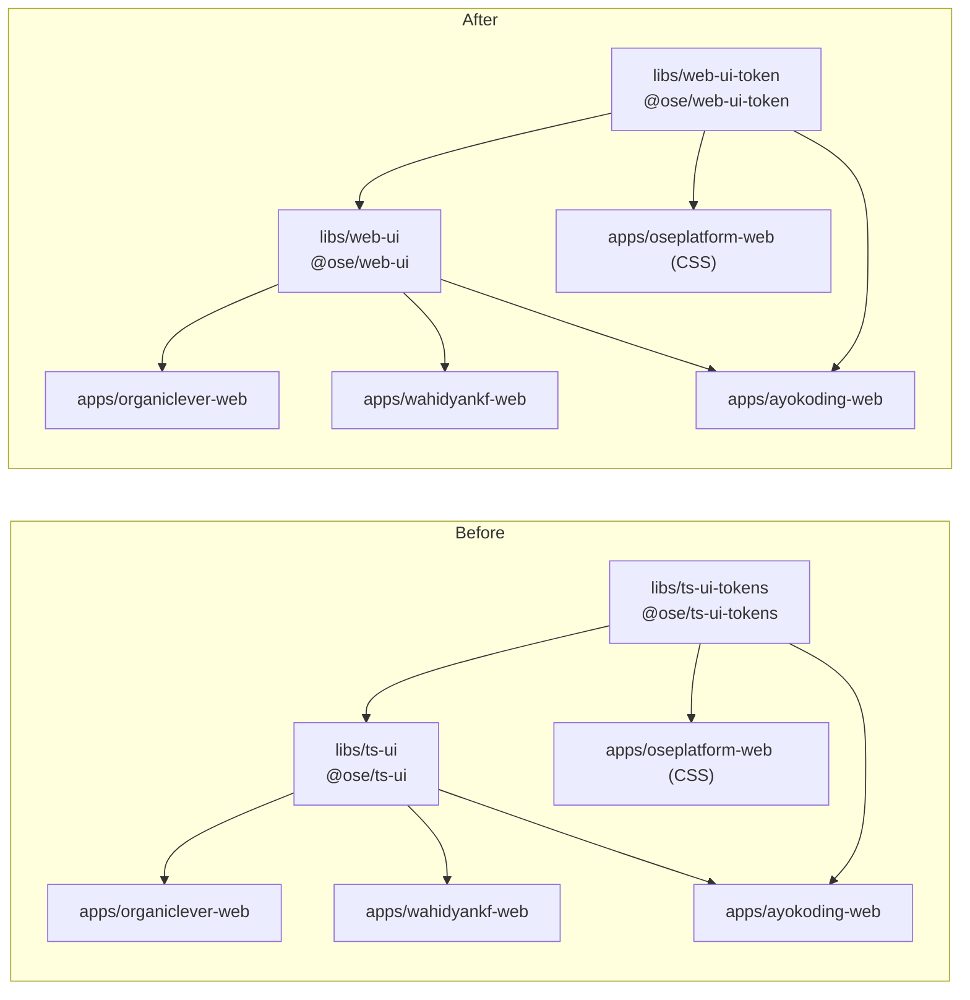

# Technical Documentation — Rename ts-ui Libraries to web-ui

## Architecture

This is a pure mechanical rename with no runtime-architecture changes. The two libraries remain
Nx-managed, TypeScript + CSS, with the same exports, the same source layout, and the same Storybook
setup. Only identifiers change.



## Design Decisions

### DD-1 — Use `git mv` not `mv`

`git mv` preserves rename history in a single index operation. Plain `mv` would produce a delete +
add, losing file history. All directory renames in this plan use `git mv`.

### DD-2 — Singular `web-ui-token` (not `web-ui-tokens`)

The plural `ts-ui-tokens` was inconsistent with the singular naming used elsewhere (e.g.,
`design-token`, not `design-tokens`). The rename opportunity resolves this to `web-ui-token`
(singular) and is applied consistently in the directory name, Nx project name, and npm package name.

### DD-3 — npm install after all renames

`package-lock.json` contains entries keyed by package name. Renaming packages without regenerating
the lockfile leaves stale entries. Run `npm install` after all `package.json` edits to regenerate
the lockfile atomically. Do not run `npm install` after each individual file edit.

### DD-4 — Typecheck as primary gate

This rename produces no new logic; the primary correctness signal is TypeScript's module resolution.
A passing `nx affected -t typecheck` proves all import paths resolve correctly. Test suites are
also run to catch any accidental breakage but are not the primary signal.

### DD-6 — AGENTS.md naming convention is out of scope (deliberate)

`AGENTS.md` documents the lib naming pattern as `ts-[name]` (e.g., `ts-ui`, `ts-ui-tokens`).
After this rename the actual libs will be `web-ui` and `web-ui-token`, following a `web-*`
domain-first pattern instead. The plan does NOT update `AGENTS.md` or the similarly-templated
`docs/how-to/add-new-lib.md` and `docs/reference/monorepo-structure.md`.

_Judgment call:_ The `ts-[name]` convention in `AGENTS.md` reflects a historical pattern from
when all libs were TypeScript. `web-ui` and `web-ui-token` are intentional exceptions adopting
domain-first naming (domain `web`, type `ui` / `ui-token`). Updating the naming convention
documentation is a separate, non-mechanical decision requiring a dedicated plan to decide whether
to standardize on `web-*`, `[domain]-[type]`, or a different scheme. That work is deferred.
A separate plan should address the naming convention documentation once the preferred pattern
is settled.

### DD-5 — Plans directory excluded from grep sweep

The grep command `git grep -r "ts-ui" -- . ':!plans/'` excludes `plans/` because this very plan
document contains the old names as reference material. The plans directory is not executable code
and does not affect builds.

## File Impact Map

All files that contain `ts-ui` or `ts-ui-tokens` references and require updating. Verified by
`git grep -rl "ts-ui" -- .` run on 2026-05-11. [Repo-grounded]

### Lib-Internal Files

| File | Changes needed |
|---|---|
| `libs/ts-ui/project.json` | `name: "ts-ui"` → `"web-ui"`; `sourceRoot: "libs/ts-ui/src"` → `"libs/web-ui/src"`; all `cwd: "libs/ts-ui"` → `"libs/web-ui"`; coverage path in `test:quick` command |
| `libs/ts-ui/package.json` | `name` → `@open-sharia-enterprise/web-ui`; dep `@open-sharia-enterprise/ts-ui-tokens` → `@open-sharia-enterprise/web-ui-token` |
| `libs/ts-ui-tokens/project.json` | `name: "ts-ui-tokens"` → `"web-ui-token"`; `sourceRoot: "libs/ts-ui-tokens/src"` → `"libs/web-ui-token/src"`; all `cwd: "libs/ts-ui-tokens"` → `"libs/web-ui-token"` |
| `libs/ts-ui-tokens/package.json` | `name` → `@open-sharia-enterprise/web-ui-token` |
| `libs/ts-ui/vitest.config.ts` | resolve alias `@open-sharia-enterprise/ts-ui-tokens` → `@open-sharia-enterprise/web-ui-token`; path `../ts-ui-tokens/src` → `../web-ui-token/src` [Repo-grounded] |
| `libs/ts-ui/src/components/**/*.steps.tsx` | 18 files; hardcoded `path.resolve(__dirname, "../../../../../specs/libs/ts-ui/gherkin/...")` → `specs/libs/web-ui/gherkin/...` [Repo-grounded] |
| `libs/ts-ui/README.md` | Prose title `# ts-ui` and all package name references → `web-ui` [Repo-grounded] |
| `libs/ts-ui-tokens/README.md` | Prose title `# ts-ui-tokens` and all `@open-sharia-enterprise/ts-ui-tokens` references → `web-ui-token` [Repo-grounded] |
| `libs/ts-ui-tokens/src/tokens.css` | Doc comment self-reference `@open-sharia-enterprise/ts-ui-tokens` → `@open-sharia-enterprise/web-ui-token` [Repo-grounded] |

Note: After the directory rename these files are accessed at their new paths:
`libs/web-ui/project.json`, `libs/web-ui/package.json`, `libs/web-ui-token/project.json`,
`libs/web-ui-token/package.json`, `libs/web-ui/vitest.config.ts`,
`libs/web-ui/src/components/**/*.steps.tsx`, `libs/web-ui/README.md`,
`libs/web-ui-token/README.md`.

### Storybook Configuration (inside web-ui)

| File | Changes needed |
|---|---|
| `libs/web-ui/.storybook/preview.ts` | Two imports: `@open-sharia-enterprise/ts-ui-tokens/src/tokens.css` → `web-ui-token`; `@open-sharia-enterprise/ts-ui-tokens/src/organiclever.css` → `web-ui-token` |
| `libs/web-ui/.storybook/storybook.css` | One import: `@open-sharia-enterprise/ts-ui-tokens/src/tokens.css` → `web-ui-token` |

### App Consumer Files

#### apps/organiclever-web

| File | Changes needed |
|---|---|
| `apps/organiclever-web/package.json` | dep `@open-sharia-enterprise/ts-ui` → `@open-sharia-enterprise/web-ui` |
| `apps/organiclever-web/project.json` | `implicitDependencies: ["ts-ui"]` → `["web-ui"]` |
| `apps/organiclever-web/next.config.ts` | `transpilePackages` — replace both old names with new names |
| `apps/organiclever-web/src/**/*.tsx` | ~28 files importing `@open-sharia-enterprise/ts-ui` (sed replace) [Repo-grounded — `grep -rl "ts-ui" apps/organiclever-web/src/` on 2026-05-11] |
| `apps/organiclever-web/src/app/globals.css` | `@source "../../../../libs/ts-ui/src/**/*.{ts,tsx}"` → `libs/web-ui/src`; two `@import "@open-sharia-enterprise/ts-ui-tokens/src/..."` → `web-ui-token` |
| `apps/organiclever-web/README.md` | Prose references to `@open-sharia-enterprise/ts-ui` and `nx storybook ts-ui` |
| `apps/organiclever-web/Dockerfile` | `libs/ts-ui/`, `libs/ts-ui-tokens/`, `@open-sharia-enterprise/ts-ui*` paths |

#### apps/wahidyankf-web

| File | Changes needed |
|---|---|
| `apps/wahidyankf-web/package.json` | dep `@open-sharia-enterprise/ts-ui` → `@open-sharia-enterprise/web-ui` |
| `apps/wahidyankf-web/next.config.ts` | `transpilePackages` — replace both old names with new names |
| `apps/wahidyankf-web/src/**/*.tsx` | ~12 files (7 source + 4 unit tests + 1 globals.css) importing `@open-sharia-enterprise/ts-ui` (sed replace) [Repo-grounded] |
| `apps/wahidyankf-web/src/app/globals.css` | `@source "../../../../libs/ts-ui/src/**/*.{ts,tsx}"` → `libs/web-ui/src` [Repo-grounded] |
| `apps/wahidyankf-web/Dockerfile` | `libs/ts-ui/`, `libs/ts-ui-tokens/`, `@open-sharia-enterprise/ts-ui*` paths |

#### apps/ayokoding-web

| File | Changes needed |
|---|---|
| `apps/ayokoding-web/src/**/*.tsx` | ~15 files importing `@open-sharia-enterprise/ts-ui` (sed replace) [Repo-grounded] |
| `apps/ayokoding-web/src/app/globals.css` | `@source "../../../../libs/ts-ui/src/**/*.{ts,tsx}"` → `libs/web-ui/src`; `@import "@open-sharia-enterprise/ts-ui-tokens/src/tokens.css"` → `web-ui-token` [Repo-grounded] |
| `apps/ayokoding-web/Dockerfile` | `libs/ts-ui/`, `libs/ts-ui-tokens/` paths |

#### apps/oseplatform-web

| File | Changes needed |
|---|---|
| `apps/oseplatform-web/src/app/globals.css` | `@source "../../../../libs/ts-ui/src/**/*.{ts,tsx}"` → `libs/web-ui/src`; `@import "@open-sharia-enterprise/ts-ui-tokens/src/tokens.css"` → `web-ui-token` [Repo-grounded] |
| `apps/oseplatform-web/src/contexts/app-shell/presentation/header.tsx` | `@open-sharia-enterprise/ts-ui` imports [Repo-grounded] |
| `apps/oseplatform-web/src/contexts/app-shell/presentation/theme-toggle.tsx` | `@open-sharia-enterprise/ts-ui` imports [Repo-grounded] |
| `apps/oseplatform-web/src/contexts/landing/presentation/hero.tsx` | `@open-sharia-enterprise/ts-ui` imports [Repo-grounded] |
| `apps/oseplatform-web/src/contexts/landing/presentation/social-icons.tsx` | `@open-sharia-enterprise/ts-ui` imports [Repo-grounded] |
| `apps/oseplatform-web/test/unit/fe-steps/accessibility.steps.tsx` | `vi.mock("@open-sharia-enterprise/ts-ui", ...)` [Repo-grounded] |
| `apps/oseplatform-web/test/unit/fe-steps/landing-page.steps.tsx` | `vi.mock("@open-sharia-enterprise/ts-ui", ...)` [Repo-grounded] |
| `apps/oseplatform-web/test/unit/fe-steps/navigation.steps.tsx` | `vi.mock("@open-sharia-enterprise/ts-ui", ...)` [Repo-grounded] |
| `apps/oseplatform-web/test/unit/fe-steps/responsive.steps.tsx` | `vi.mock("@open-sharia-enterprise/ts-ui", ...)` [Repo-grounded] |
| `apps/oseplatform-web/test/unit/fe-steps/theme.steps.tsx` | `vi.mock("@open-sharia-enterprise/ts-ui", ...)` [Repo-grounded] |
| `apps/oseplatform-web/content/updates/2026-04-05-phase-1-week-8-wide-to-learn-narrow-to-ship.md` | Prose references to `ts-ui` [Repo-grounded] |
| `apps/oseplatform-web/content/updates/2026-05-10-phase-1-week-13-local-first-and-repo-split.md` | Prose references to `ts-ui` [Repo-grounded] |
| `apps/oseplatform-web/Dockerfile` | `libs/ts-ui/`, `libs/ts-ui-tokens/` paths |

### Specs

| File | Changes needed |
|---|---|
| `specs/libs/ts-ui/` directory | Rename to `specs/libs/web-ui/` via `git mv` |
| `specs/libs/ts-ui/gherkin/**/*.feature` | 6 feature files contain "ts-ui design system" prose (e.g., `As a developer using the ts-ui design system`); moved by `git mv` but prose must be updated to `web-ui` to avoid AC-8 and AC-9 grep matches [Repo-grounded] |
| `specs/apps/organiclever/components/web/design-system.md` | `@open-sharia-enterprise/ts-ui*` package name references |
| `specs/apps/organiclever/ddd/bounded-context-map.md` | `ts-ui` references |
| `specs/apps/organiclever/ddd/ubiquitous-language/app-shell.md` | `ts-ui` references |
| `specs/apps/wahidyankf/product/overview.md` | `ts-ui` references |

### Governance and Docs

| File | Changes needed |
|---|---|
| `.claude/agents/repo-rules-fixer.md` | References to `ts-ui` or `ts-ui-tokens` |
| `.claude/agents/swe-ui-maker.md` | References to `ts-ui` or `ts-ui-tokens` |
| `.claude/skills/apps-organiclever-web-developing-content/SKILL.md` | References to `ts-ui` |
| `.claude/skills/swe-developing-frontend-ui/reference/component-patterns.md` | References to `ts-ui` |
| `.claude/skills/swe-developing-frontend-ui/reference/design-tokens.md` | References to `ts-ui-tokens` |
| `.claude/skills/swe-developing-frontend-ui/SKILL.md` | References to `ts-ui` |
| `governance/conventions/structure/licensing.md` | References to `ts-ui` |
| `governance/conventions/structure/ose-primer-sync.md` | References to `ts-ui` |
| `governance/development/frontend/design-tokens.md` | References to `ts-ui-tokens` |
| `governance/development/infra/docker-monorepo-builds.md` | References to `ts-ui` |
| `governance/development/infra/nx-targets.md` | References to `ts-ui` |
| `governance/development/quality/three-level-testing-standard.md` | References to `ts-ui` |
| `governance/workflows/ui/ui-quality-gate.md` | References to `ts-ui` |

## Dependencies

No new external dependencies are introduced. Existing dependencies in `libs/ts-ui/package.json`
carry over to `libs/web-ui/package.json` unchanged.

## Testing Strategy

This is a rename, not a feature addition. TDD does not apply in the Red-Green-Refactor sense.
The appropriate gate is:

1. **Typecheck** — proves module resolution works: `nx affected -t typecheck`
2. **Lint** — proves no lint errors introduced: `nx affected -t lint`
3. **Quick tests** — proves no runtime breakage: `nx run-many -t test:quick -p web-ui web-ui-token`
4. **Grep check** — proves completeness: `git grep -r "ts-ui" -- . ':!plans/' ':!generated-reports/' ':!archived/'` returns empty
5. **CI** — final integration gate: GitHub Actions green after push

## Rollback

If the rename causes unexpected breakage:

```bash
# From the worktree (worktrees/ui/)
git reset --hard HEAD~<N>   # where N = number of commits to undo
# OR revert individual commits with git revert
```

The worktree branch (`worktree/ui`) is not published to `origin` until the plan is complete.
Rolling back before push costs nothing.
