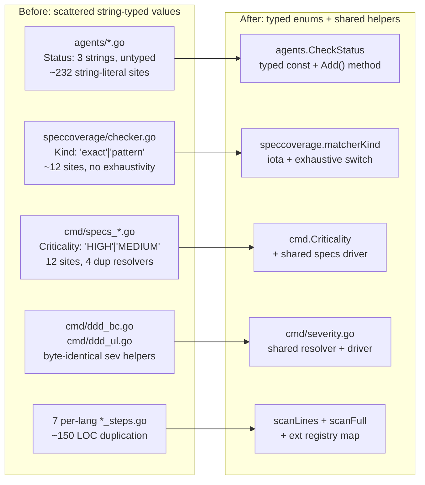

# rhino-cli — DRY + Enum Refactor Pass

**Status**: In Progress
**Scope**: `ose-public` — `apps/rhino-cli`
**Branch**: `worktree/async-rolling-gizmo`
**Worktree path**: `worktrees/async-rolling-gizmo/` (existing; reused)

## Problem

`apps/rhino-cli` is a 14,926-LOC Go CLI that has accreted ~16 distinct
duplication and missing-enum patterns over its lifetime. The duplication is
cosmetic in places (4 spec subcommands sharing one `resolveApps` shape) and
substantive in others (7 per-language step extractor files following the same
"open file → regex → addStep" template). The string-literal "enums" — status
values like `"passed"|"warning"|"failed"`, kind values like `"exact"|"pattern"`,
criticality values like `"HIGH"|"MEDIUM"|"LOW"`, severity values like
`"error"|"warn"` — appear in ~270+ call sites with no compile-time
exhaustivity. A typo today produces a silent runtime bug; a switch missing a
new case today silently falls through to default.

## Goal

A single coordinated refactor pass that:

1. **Tightens types** — replace string-typed pseudo-enums with Go typed enums
   so switches become exhaustive (with explicit `default: panic` where the
   universe of values is closed).
2. **Drops duplication** — consolidate 7 step extractor files, 4 spec
   subcommand drivers, 2 byte-identical severity helpers, and the repeated
   `ValidationResult.PassedChecks++/FailedChecks++` tally pattern.
3. **Migrates legacy compatibility shims** — the `stepMatcher.exact` /
   `stepMatcher.patterns` fields documented as "legacy write-through views"
   exist solely for tests; migrate the tests off them and delete the shims.
4. **Preserves behaviour** — all existing tests pass; no command output
   changes; no Nx target signature changes; coverage stays ≥90% (Go tier).

This is a _refactor_, not a feature change. No new commands, no flag changes,
no new test cases beyond those needed to cover the new helpers.

## What changes (16 items)

Grouped by area. See [tech-docs.md](./tech-docs.md) for the full design of
each item.

**Type-safety wins** (string → sealed-interface sum type per the
`velvety-herding-ullman` baseline pattern: `//sumtype:decl` +
`gochecksumtype` linter enforcement):

- **Item 1** — `speccoverage.matcherKind` — sealed interface with
  variants `kindExact{}`, `kindPattern{}`.
- **Item 2** — `agents.CheckStatus` — sealed interface with variants
  `StatusPassed{}`, `StatusWarning{}`, `StatusFailed{}`.
- **Item 3** — `cmd.Criticality` — sealed interface with variants
  `CriticalityHigh{}`, `CriticalityMedium{}`, `CriticalityLow{}`.
- **Item 4** — `bcregistry.Severity` + `glossary.Severity` — sealed
  interface with variants `SeverityError{}`, `SeverityWarn{}` per
  package.
- **Item 5** — mermaid `Direction` / `ViolationKind` / `WarningKind` —
  already sealed in main (`velvety-herding-ullman`); plan only verifies
  zero `gochecksumtype` violations as part of Phase 12 lint.

**DRY wins** (consolidation):

- **Item 6** — Per-language step extractors → `scanLines` / `scanFull`
  helpers plus ext registry map.
- **Item 7** — `extractScenarioTitles` switch → ext registry map.
- **Item 8** — `ddd_bc` / `ddd_ul` byte-identical helpers → shared
  `cmd/severity.go` + shared `runDddValidator` driver.
- **Item 9** — `specs_validate_*` `resolveXxxApps` × 4 + runE bodies → shared
  resolver + shared driver.
- **Item 10** — `ValidationResult.Add(check)` method replaces 4× duplicated
  tally blocks in `sync_validator.go`.
- **Item 11** — `agents` `passed()` / `failed()` constructor helpers replace
  ~40 verbose `ValidationCheck{...}` literals.
- **Item 12** — `doctor.compareXxx` family — extract `withEmptyOK` decorator
  (4 funcs share the "no requirement → OK" preamble).
- **Item 13** — `doctor.MinimalTools` map → `minimal bool` field on `toolDef`.

**Legacy shim cleanup**:

- **Item 14** — Drop `stepMatcher.exact` and `stepMatcher.patterns` legacy
  fields after migrating tests to the canonical `entries`-only API.

**Cobra-layer DRY**:

- **Item 15** — `agents validate-naming` + `workflows validate-naming` runE
  wrappers → shared `runNamingValidator(label, kind, fn)` driver.
- **Item 16** — `findGitRoot()` + error wrap pattern repeated in 24 cmd files
  → `mustFindGitRoot(cmd)` helper.

## Architecture

## Documents

- [brd.md](./brd.md) — business rationale (maintenance debt, bug class)
- [prd.md](./prd.md) — product requirements + Gherkin acceptance criteria
- [tech-docs.md](./tech-docs.md) — per-item design and rationale
- [delivery.md](./delivery.md) — TDD-shaped delivery checklist

## Risks

- **Risk**: ~270 call-site mechanical edits could hide a regression. **Mitigation**:
  Each phase is preceded by RED tests that cover the contract being changed;
  GREEN must keep `nx run rhino-cli:test:quick` green.
- **Risk**: Test files synthesizing `stepMatcher` directly (item 14) may
  number more than the comment suggests. **Mitigation**: Phase 2 starts with
  an audit grep — if more than ~5 test files touch `.exact` / `.patterns`
  directly, item 14 is split into its own follow-up.
- **Risk**: Coverage drops below 90% if helpers are extracted without their
  own unit tests. **Mitigation**: Each helper extraction phase requires
  matching unit tests in the same commit.
