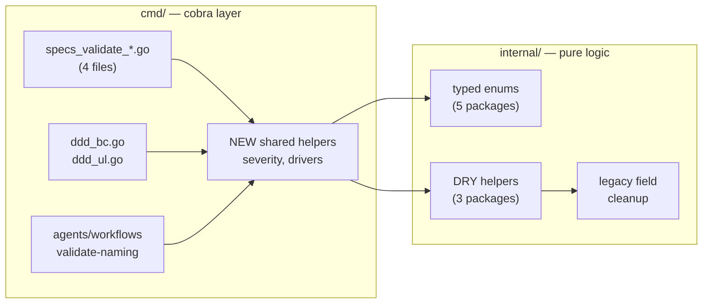

# Tech Docs — rhino-cli DRY + Enum Refactor Pass

## Pattern Baseline (post-`velvety-herding-ullman` rebase)

This plan was rebased onto `origin/main` after the `velvety-herding-ullman`
worktree landed. That worktree introduced the **sealed-interface sum-type**
pattern (`//sumtype:decl` + `gochecksumtype` linter) and converted six
existing enums to it: `doctor.Scope`, `doctor.ToolStatus`,
`mermaid.Direction`, `mermaid.ViolationKind`, `mermaid.WarningKind`, and
`testcoverage.Format`. It also enabled new linters: `errorlint`, `godot`,
`revive (exported + package-comments)`, `exhaustive`, `gochecksumtype`.

This plan adopts the same pattern for every new enum it introduces. See
[Sealed-Interface Sum Types](../../../docs/explanation/software-engineering/programming-languages/golang/design-patterns.md#sealed-interface-sum-types)
for the canonical form.

**Pattern rule for this plan**:

| Item                                               | Pattern                                              | Reason                                                             |
| -------------------------------------------------- | ---------------------------------------------------- | ------------------------------------------------------------------ |
| Items 2, 3, 4 (CheckStatus, Criticality, Severity) | Sealed interface (`//sumtype:decl`)                  | Multi-variant, JSON-serialized, exported across packages           |
| Item 1 (matcherKind)                               | Sealed interface (`//sumtype:decl`)                  | Closed universe; matches repo style; gochecksumtype enforces it    |
| Item 5 (mermaid)                                   | Already sealed in main — verify gochecksumtype clean | No active fix needed; was an exhaustivity-discipline item          |
| Item 13 (Scope filter)                             | Scope already sealed; refactor still needed          | `MinimalTools` map → `toolDef.minimal` field; type-switch on Scope |

**Wire-format rule** (from design-patterns.md): when a sealed-interface type
appears in a JSON-serialized struct, expose a separate `string` wire field
populated from `value.Code()`. Internal type stays the sealed interface.

---

## Architecture Overview

Pre-refactor structure stays. The refactor consolidates patterns
_within_ existing packages — no new packages, no package boundary
changes, no Nx project shape changes.



## Item-by-Item Design

### Item 1: `speccoverage.matcherKind` sealed interface

**File**: `internal/speccoverage/checker.go`

**Before** (lines 35-41):

```go
type stepMatcherEntry struct {
    Kind        string         // "exact" or "pattern"
    ExactText   string         // populated when Kind == "exact"
    Pattern     *regexp.Regexp
    PatternText string
    File        string
}
```

Two callers use string literals:

- `addExactWithOrigin` writes `Kind: "exact"`.
- `addPatternWithOrigin` writes `Kind: "pattern"`.
- `checkOrphanStepImpls` switches `case "exact":` and `case "pattern":`
  with no `default`.
- `reporter.go:78` uses `o.MatcherKind` as a `string` field (already wire
  format) — NO migration needed here. The string value is populated at the
  orphan-collection site via `entry.Kind.Code()`.

**After** (sealed interface per `velvety-herding-ullman` baseline):

```go
//sumtype:decl
type matcherKind interface {
    isMatcherKind()
    Code() string
}

type kindExact struct{}
func (kindExact) isMatcherKind() {}
func (kindExact) Code() string   { return "exact" }

type kindPattern struct{}
func (kindPattern) isMatcherKind() {}
func (kindPattern) Code() string   { return "pattern" }

type stepMatcherEntry struct {
    Kind        matcherKind
    // ... rest unchanged
}
```

**Wire-format note**: `OrphanStepImpl.MatcherKind` (in `types.go`)
serializes to JSON. Preserve the existing JSON output
(`"matcher_kind": "exact"`) by keeping `OrphanStepImpl.MatcherKind` as
`string` and populating it via `entry.Kind.Code()` at the
orphan-collection site. Internal type is `matcherKind`; external (JSON)
type stays `string`.

**Switch contract**: `checkOrphanStepImpls` becomes:

```go
switch e.Kind.(type) {
case kindExact:
    // ...
case kindPattern:
    // ...
}
```

`gochecksumtype` enforces exhaustiveness at lint time; no `default` arm
required (and `gochecksumtype` warns if one is added that swallows future
cases).

### Item 2: `agents.CheckStatus` sealed interface

**File**: `internal/agents/types.go`

**Before**: `ValidationCheck.Status string` with literal `"passed"`,
`"warning"`, `"failed"` at ~232 sites across 5 files.

**After** (sealed interface — matches `doctor.ToolStatus` shape):

```go
//sumtype:decl
type CheckStatus interface {
    isCheckStatus()
    Code() string
}

type StatusPassed struct{}
func (StatusPassed) isCheckStatus() {}
func (StatusPassed) Code() string   { return "passed" }

type StatusWarning struct{}
func (StatusWarning) isCheckStatus() {}
func (StatusWarning) Code() string   { return "warning" }

type StatusFailed struct{}
func (StatusFailed) isCheckStatus() {}
func (StatusFailed) Code() string   { return "failed" }

// ParseCheckStatus converts a CLI/JSON string to a CheckStatus variant.
// Returns false for unknown values.
func ParseCheckStatus(s string) (CheckStatus, bool) {
    switch s {
    case "passed":  return StatusPassed{}, true
    case "warning": return StatusWarning{}, true
    case "failed":  return StatusFailed{}, true
    default:        return nil, false
    }
}

type ValidationCheck struct {
    Name     string
    Status   CheckStatus
    Expected string
    Actual   string
    Message  string
}
```

**JSON wire-format**: existing JSON output emits literal `"status": "passed"`.
Preserve via separate wire-format struct with `Status string` populated
via `check.Status.Code()` at marshal time (same pattern doctor reporter
already uses — see `internal/doctor/reporter.go:105`).

**Migration**: Mechanical replace across 5 internal/agents non-test files.
Each `Status: "passed"` becomes `Status: StatusPassed{}`. Type switches on
status (e.g., in `ValidationResult.Add` — see Item 10) use `.(type)`
exhaustively. Test files migrate too: assertions like
`if check.Status == "passed"` become `_, ok := check.Status.(StatusPassed)`
or compare via `check.Status.Code() == "passed"`.

### Item 3: `cmd.Criticality` sealed interface

**File**: `cmd/specs_validate_tree.go` — defines `SpecFinding`.

**Before**:

```go
type SpecFinding struct {
    Category    string `json:"category"`
    Criticality string `json:"criticality"`
    File        string `json:"file"`
    Evidence    string `json:"evidence"`
    Expected    string `json:"expected"`
}
```

12 string-literal usages across the four `specs_validate_*.go` files.

**After** (sealed interface):

```go
//sumtype:decl
type Criticality interface {
    isCriticality()
    Code() string
}

type CriticalityHigh struct{}
func (CriticalityHigh) isCriticality() {}
func (CriticalityHigh) Code() string   { return "HIGH" }

type CriticalityMedium struct{}
func (CriticalityMedium) isCriticality() {}
func (CriticalityMedium) Code() string   { return "MEDIUM" }

type CriticalityLow struct{}
func (CriticalityLow) isCriticality() {}
func (CriticalityLow) Code() string   { return "LOW" }

type SpecFinding struct {
    Category    string      `json:"category"`
    Criticality Criticality `json:"-"`              // not directly marshalled
    CriticalityCode string  `json:"criticality"`    // wire-format mirror
    File        string      `json:"file"`
    Evidence    string      `json:"evidence"`
    Expected    string      `json:"expected"`
}
```

**Wire-format alternative** (preferred — fewer fields): keep
`Criticality Criticality` and add a `MarshalJSON` method that emits
`{"criticality": code, ...}` via a private wire-format struct. The choice
between the two-field approach and `MarshalJSON` is open in delivery —
prefer whichever produces a smaller diff against the existing JSON
fixture. Run-time behaviour is identical; pick the smaller-diff form.

JSON wire format preserved (`"criticality": "HIGH"`).

### Item 4: `bcregistry.Severity` + `glossary.Severity` sealed interface

**Files**: `internal/bcregistry/types.go`, `internal/glossary/types.go`.

Currently both packages have `Severity string // "error" or "warning"` on
their `Finding` and `ValidateOptions` types.

**After** (sealed interface; defined independently in each package):

```go
//sumtype:decl
type Severity interface {
    isSeverity()
    Code() string
}

type SeverityError struct{}
func (SeverityError) isSeverity() {}
func (SeverityError) Code() string { return "error" }

type SeverityWarn struct{}
func (SeverityWarn) isSeverity() {}
func (SeverityWarn) Code() string { return "warn" }

func ParseSeverity(s string) (Severity, bool) {
    switch s {
    case "error":          return SeverityError{}, true
    case "warn", "warning": return SeverityWarn{}, true
    default:               return nil, false
    }
}
```

The on-disk YAML and CLI flag still accept the strings `"error"` and
`"warn"`; conversion happens at the cmd-layer boundary in `resolveSeverity`
(item 8) which calls `ParseSeverity` and surfaces invalid input as an
error. JSON-emitted findings populate the wire-format string field via
`finding.Severity.Code()`.

### Item 5: Mermaid switch exhaustivity (REVISED — already complete)

**Files**: `internal/mermaid/parser.go`, `internal/mermaid/validator.go`,
`internal/mermaid/reporter.go`.

**Status**: already done by the `velvety-herding-ullman` worktree.
`Direction`, `ViolationKind`, `WarningKind` are sealed interfaces;
`gochecksumtype` enforces exhaustiveness at lint time. No active fix
needed.

**Action in this plan**: confirm `golangci-lint run ./...` reports zero
`gochecksumtype` violations against `internal/mermaid/`. This is a
verify-only step folded into Phase 12.3 lint check; no separate phase
required. If a violation surfaces (e.g., a future contributor adds a new
variant without updating a switch), it is fixed in place — but no
violations are expected at plan start.

### Item 6: Per-language step extractor consolidation

**Files affected**:
`internal/speccoverage/{rust,dart,java,python,elixir,clojure,dotnet}_steps.go`,
`internal/speccoverage/checker.go` (where `extractTSStepTexts`/`extractGoStepTexts`
live).

Two patterns dominate the 9 extractors:

**Pattern A — line-by-line scanner** (Go, Java, Clojure, Elixir, F#, Rust):
open file with `bufio.Scanner`, scan each line, run regexes, dispatch to
`addStepToMatcherWithOrigin` or `addPatternWithOrigin`.

**Pattern B — full-file scanner** (TS, Dart, Python, C#, Rust regex form):
read entire file with `os.ReadFile`, run regexes, dispatch.

**New helpers** in `internal/speccoverage/scan_helpers.go`:

```go
type extractStrategy int

const (
    strategyAddExact extractStrategy = iota
    strategyAddPattern
    strategyAddCucumber  // calls addStepToMatcherWithOrigin
    strategyAddPython    // calls addPythonStepToMatcherWithOrigin
)

type extractRule struct {
    re       *regexp.Regexp
    captures []int           // which capture group indices to try (firstNonEmpty across them)
    strategy extractStrategy
    transform func(string) string  // optional post-processing (e.g., unescape)
}

func scanLines(path string, sm *stepMatcher, rules []extractRule) error {
    f, err := os.Open(path)
    if err != nil {
        return err
    }
    defer f.Close()
    scanner := bufio.NewScanner(f)
    for scanner.Scan() {
        applyRules(scanner.Text(), path, sm, rules)
    }
    return scanner.Err()
}

func scanFull(path string, sm *stepMatcher, rules []extractRule) error {
    content, err := os.ReadFile(path)
    if err != nil {
        return err
    }
    applyRules(string(content), path, sm, rules)
    return nil
}

func applyRules(src, path string, sm *stepMatcher, rules []extractRule) {
    for _, r := range rules {
        for _, m := range r.re.FindAllStringSubmatch(src, -1) {
            text := pickFirstCapture(m, r.captures)
            if r.transform != nil {
                text = r.transform(text)
            }
            switch r.strategy {
            case strategyAddExact:
                addExactDirect(sm, text, path)
            case strategyAddPattern:
                if re, err := regexp.Compile(text); err == nil {
                    sm.addPatternWithOrigin(re, text, path)
                }
            case strategyAddCucumber:
                addStepToMatcherWithOrigin(sm, text, path)
            case strategyAddPython:
                addPythonStepToMatcherWithOrigin(sm, text, path)
            default:
                panic(fmt.Sprintf("unhandled extractStrategy: %v", r.strategy))
            }
        }
    }
}
```

**Per-language file shrinks** to a ruleset declaration:

```go
// rust_steps.go
var rustRules = []extractRule{
    {re: rsStepRegexRe,   captures: []int{1}, strategy: strategyAddPattern},
    {re: rsStepExprRe,    captures: []int{1}, strategy: strategyAddCucumber},
    {re: rsStepLiteralRe, captures: []int{1}, strategy: strategyAddCucumber},
}

func extractRustStepTexts(path string, sm *stepMatcher) error {
    return scanLines(path, sm, rustRules)
}
```

This is the structural shape. Edge cases (C# `""` → `"` unescape, Python
`{{` → `{`, F# regex anchoring `^...$`) are handled via the
`transform` field in `extractRule`.

**Caveat** — F# extractor anchors patterns with `^...$` AFTER
normalization. The simple `strategyAddPattern` doesn't fit; F# gets
either a custom strategy (`strategyAddAnchoredPattern`) or keeps its
own bespoke loop. tech-docs note: prefer custom strategy for symmetry.

### Item 7: Extractor ext registry maps

**Files**: `internal/speccoverage/checker.go`.

**Before** (`extractAllStepTexts`):

```go
switch ext {
case ".ts", ".tsx", ".js", ".jsx":
    return extractTSStepTexts(path, sm)
case ".go":
    return extractGoStepTexts(path, sm)
// ... 8 more cases
}
return nil
```

**After**:

```go
var stepExtractorsByExt = map[string]func(string, *stepMatcher) error{
    ".ts":   extractTSStepTexts,
    ".tsx":  extractTSStepTexts,
    ".js":   extractTSStepTexts,
    ".jsx":  extractTSStepTexts,
    ".go":   extractGoStepTexts,
    ".java": extractJVMStepTexts,
    ".kt":   extractJVMStepTexts,
    ".py":   extractPythonStepTexts,
    ".ex":   extractElixirStepTexts,
    ".exs":  extractElixirStepTexts,
    ".rs":   extractRustStepTexts,
    ".cs":   extractCSharpStepTexts,
    ".fs":   extractFSharpStepTexts,
    ".clj":  extractClojureStepTexts,
    ".dart": extractDartStepTexts,
}

// in extractAllStepTexts walk callback:
if fn, ok := stepExtractorsByExt[ext]; ok {
    return fn(path, sm)
}
return nil
```

Same shape for `extractScenarioTitles` with `var scenarioExtractorsByExt = map[string]func(string) (map[string]bool, error){...}`. Note the
TS-default case in `extractScenarioTitles` (the trailing `default:`
returns the TS extractor) is preserved by an explicit map plus a
fallback for unmapped extensions.

### Item 8: ddd_bc / ddd_ul severity consolidation

**New file**: `cmd/severity.go`.

```go
package cmd

import (
    "fmt"
    "os"
    "strings"
)

const dddSeverityEnvVar = "OSE_RHINO_DDD_SEVERITY"

// resolveSeverity applies the universal precedence: flag > env > default.
func resolveSeverity(flagVal string) string {
    if flagVal != "" {
        return normaliseSeverity(flagVal)
    }
    if env := os.Getenv(dddSeverityEnvVar); env != "" {
        sev := normaliseSeverity(env)
        if sev == "warn" {
            fmt.Fprintln(os.Stderr,
                `WARN: severity downgraded to "warn" via `+dddSeverityEnvVar+` env var`)
        }
        return sev
    }
    return "error"
}

func normaliseSeverity(s string) string {
    switch strings.ToLower(strings.TrimSpace(s)) {
    case "warn", "warning":
        return "warn"
    default:
        return "error"
    }
}
```

`ddd_bc.go` and `ddd_ul.go` delete their copies of `resolveBcSeverity` /
`resolveUlSeverity` / `normaliseSeverity` / `normaliseUlSeverity` and
call `resolveSeverity(bcSeverity)` / `resolveSeverity(ulSeverity)`.

**Optional sub-item**: extract a shared `runDddValidator(label, fn)`
that wraps the find-print-count-error tail (which is also identical in
the two files). Ship in same phase if it doesn't bloat the diff.

### Item 9: specs subcommand consolidation

**New files**:

- `cmd/specs_driver.go` — shared driver.
- `cmd/specs_apps.go` — shared resolvers.

```go
// specs_apps.go
func resolveSpecsAppNames(positional, appsFlag []string) []string {
    if len(positional) > 0 {
        return []string{positional[0]}
    }
    if len(appsFlag) > 0 {
        return append([]string(nil), appsFlag...)
    }
    return append([]string(nil), allowlist.AppsWithDDD...)
}

func resolveSpecsAppFolders(positional, appsFlag []string) []string {
    apps := resolveSpecsAppNames(positional, appsFlag)
    out := make([]string, 0, len(apps))
    for _, a := range apps {
        out = append(out, filepath.Join("specs", "apps", a))
    }
    return out
}

// specs_driver.go
type specsValidator func(repoRoot, target string) []SpecFinding

func runSpecsValidator(cmd *cobra.Command, label string, targets []string, fn specsValidator) error {
    repoRoot, err := mustFindGitRoot(cmd)
    if err != nil {
        return err
    }
    total := 0
    for _, t := range targets {
        findings := fn(repoRoot, t)
        if len(findings) == 0 {
            fmt.Fprintf(cmd.OutOrStdout(), "specs %s: 0 finding(s) for %q\n", label, t)
            continue
        }
        for _, f := range findings {
            fmt.Fprintf(cmd.OutOrStdout(), "%s: %s: %s\n", f.File, f.Criticality, f.Evidence)
        }
        total += len(findings)
    }
    if total > 0 {
        return fmt.Errorf("%d finding(s) found by specs %s", total, label)
    }
    return nil
}
```

**Note on output format**: `validate-tree`, `validate-adoption`,
`validate-links` print `%s: HIGH: %s\n` (hardcoded HIGH).
`validate-counts` prints `%s: %s: %s\n` (uses `f.Criticality`).
The shared driver uses `f.Criticality.Code()` (sealed interface — see
Item 3) — equivalent because all three "HIGH"-printers happen to set
`Criticality: CriticalityHigh{}` already, so output is byte-identical.
**Verify** in Phase 6 with golden file before/after.

### Item 10: ValidationResult.Add helper

**File**: `internal/agents/types.go`.

`Status` is now a sealed interface (see Item 2). The tally uses an
exhaustive type switch which `gochecksumtype` enforces at lint time.

```go
func (r *ValidationResult) Add(check ValidationCheck) {
    r.Checks = append(r.Checks, check)
    switch check.Status.(type) {
    case StatusPassed:
        r.PassedChecks++
    case StatusWarning:
        r.WarningChecks++
    case StatusFailed:
        r.FailedChecks++
    }
    r.TotalChecks++
}
```

`sync_validator.go:22-67` shrinks: 4× duplicated tally blocks become 4×
`result.Add(check)` calls.

### Item 11: agents pass/fail helpers

**File**: `internal/agents/check_helpers.go` (new).

`Status` is the sealed interface from Item 2; constructors set the
appropriate variant.

```go
func passed(name, message string) ValidationCheck {
    return ValidationCheck{Name: name, Status: StatusPassed{}, Message: message}
}

func failed(name, expected, actual, message string) ValidationCheck {
    return ValidationCheck{
        Name:     name,
        Status:   StatusFailed{},
        Expected: expected,
        Actual:   actual,
        Message:  message,
    }
}

func warning(name, expected, actual, message string) ValidationCheck {
    return ValidationCheck{
        Name:     name,
        Status:   StatusWarning{},
        Expected: expected,
        Actual:   actual,
        Message:  message,
    }
}
```

Mechanical replacement in `agent_validator.go` and `skill_validator.go`
where the literal struct shape matches. Where the call site needs a
field the helper doesn't expose (e.g., a Name with formatted args
constructed inline), keep the literal — partial migration is fine.

### Item 12: doctor compare decorator

**File**: `internal/doctor/checker.go`.

`ToolStatus` is a sealed interface in main; `StatusOK{}` etc. are
zero-value struct literals.

```go
type compareFn func(installed, required string) (ToolStatus, string)

func withEmptyOK(f compareFn) compareFn {
    return func(installed, required string) (ToolStatus, string) {
        if required == "" {
            return StatusOK{}, "no version requirement"
        }
        return f(installed, required)
    }
}

// Replace signature of compareExact, compareMajor, compareMajorGTE,
// compareGTE — drop the empty-required preamble inside each.
// At buildToolDefs site, wrap:
//   compare: withEmptyOK(compareExactInner),
```

Pure cosmetic; ~40 LOC saved across the four functions.

### Item 13: doctor MinimalTools removal + scope type-switch

**File**: `internal/doctor/types.go`, `internal/doctor/tools.go`,
`internal/doctor/checker.go`.

`Scope` is already a sealed interface in main (`ScopeFull{}`,
`ScopeMinimal{}` per `velvety-herding-ullman`). What still needs doing:

1. The `MinimalTools` map (`types.go:97-98`) still exists.
2. `toolDef` doesn't have a `minimal` field.
3. `CheckAll`'s scope filter (`checker.go:540`) still keys into the
   `MinimalTools` map by tool name.
4. The scope branch is a sealed-interface type switch already; verify
   `gochecksumtype` exhaustiveness post-refactor.

**Before**:

```go
// types.go
var MinimalTools = map[string]bool{
    "git": true, "volta": true, /* ... */
}

// checker.go (scope filter — currently uses string-keyed lookup):
if _, ok := opts.Scope.(ScopeMinimal); ok {
    filtered := make([]toolDef, 0)
    for _, def := range defs {
        if MinimalTools[def.name] {
            filtered = append(filtered, def)
        }
    }
    defs = filtered
}
```

**After**:

```go
// tools.go — toolDef gains:
type toolDef struct {
    // ... existing fields
    minimal bool
}

// buildToolDefs entries that today appear in MinimalTools mark themselves:
{
    name: "git", binary: "git", /* ... */ minimal: true,
},

// checker.go — exhaustive type switch on the sealed Scope interface:
switch opts.Scope.(type) {
case nil, ScopeFull:
    // all defs (nil = unset CLI flag → defaults to full)
case ScopeMinimal:
    filtered := make([]toolDef, 0)
    for _, def := range defs {
        if def.minimal {
            filtered = append(filtered, def)
        }
    }
    defs = filtered
}
```

`gochecksumtype` enforces every variant is handled; deleting the
`MinimalTools` map removes the parallel out-of-band data. Adding a new
tool to minimal scope is now a single `minimal: true` field assignment
in `buildToolDefs`.

### Item 14: stepMatcher legacy fields removal

**File**: `internal/speccoverage/checker.go`.

**Today**:

```go
type stepMatcher struct {
    entries    []stepMatcherEntry
    exactIndex map[string]int
    exact      map[string]bool   // legacy: write-through
    patterns   []*regexp.Regexp  // legacy: write-through
}
```

**After**:

```go
type stepMatcher struct {
    entries    []stepMatcherEntry
    exactIndex map[string]int  // O(1) exact-text lookup → entries index
}

func (sm *stepMatcher) matches(stepText string) bool {
    normalized := normalizeWS(stepText)
    if _, ok := sm.exactIndex[normalized]; ok {
        return true
    }
    for _, e := range sm.entries {
        if e.Kind == kindPattern && e.Pattern.MatchString(normalized) {
            return true
        }
    }
    return false
}
```

**Test migration**: any test that synthesized a `stepMatcher` by
appending to `.exact` or `.patterns` directly now uses
`addExactWithOrigin` / `addPatternWithOrigin`. Phase 2 audits the count
first — if more than 5 test files do this, item 14 splits to a
follow-up plan and the rest of the refactor proceeds.

### Item 15: Naming validator runE consolidation

**New file**: `cmd/naming_driver.go`.

```go
type namingValidator func(repoRoot string) ([]naming.Violation, error)

func runNamingValidator(cmd *cobra.Command, label, kind string, fn namingValidator) error {
    repoRoot, err := mustFindGitRoot(cmd)
    if err != nil {
        return err
    }
    violations, err := fn(repoRoot)
    if err != nil {
        return fmt.Errorf("validation failed: %w", err)
    }
    if err := writeFormatted(cmd, output, verbose, quiet, outputFuncs{
        text:     func(v, q bool) string { return formatNamingText(label, violations, v, q) },
        json:     func() (string, error) { return formatNamingJSON(kind, violations) },
        markdown: func() string { return formatNamingMarkdown(label, violations) },
    }); err != nil {
        return err
    }
    if len(violations) > 0 {
        return fmt.Errorf("%d naming violation(s) found", len(violations))
    }
    return nil
}
```

`runValidateAgentsNaming` becomes:

```go
return runNamingValidator(cmd, "Agents", "agents", agentsValidateNamingFn)
```

`runValidateWorkflowsNaming` becomes:

```go
return runNamingValidator(cmd, "Workflows", "workflows", workflowsValidateNamingFn)
```

### Item 16: mustFindGitRoot helper

**File**: `cmd/helpers.go`.

```go
func mustFindGitRoot(cmd *cobra.Command) (string, error) {
    repoRoot, err := findGitRoot()
    if err != nil {
        return "", fmt.Errorf("failed to find git repository root: %w", err)
    }
    return repoRoot, nil
}
```

24 cmd files have a 3-line preamble:

```go
repoRoot, err := findGitRoot()
if err != nil {
    return fmt.Errorf("failed to find git repository root: %w", err)
}
```

Becomes:

```go
repoRoot, err := mustFindGitRoot(cmd)
if err != nil {
    return err
}
```

Saves ~50 LOC across the repo. Pure cosmetic.

## Phase Sequencing Rationale

Phases ordered to maximize independence and minimize blast-radius
escalation:

1. **Foundation phases** (items 2, 10, 16) — broad-reach but low-risk
   string→typed-enum + helper extraction. Touches many files
   trivially; high confidence.
2. **Closed-universe phases** (items 1, 4, 5, 13) — small surface,
   compile-time exhaustivity wins.
3. **Code-deletion phases** (items 8, 14) — drops duplicated code.
   Item 14 has the highest risk (test code we don't fully control)
   and goes after audit.
4. **Driver-extraction phases** (items 6, 7, 9, 11, 12, 15) — collapses
   duplicated patterns. These are the highest LOC reduction, all
   medium-risk (test contracts must hold).
5. **Polish phases** (item 3) — Criticality is touched by item 9's
   driver, so Criticality lands in the same phase or immediately
   adjacent.

See `delivery.md` for the canonical phase ordering and TDD shape.

## Testing Strategy

- **Each phase TDD-shaped**: failing test first (where applicable),
  then minimal change to pass, then refactor.
- **Per-phase gate**: `nx run rhino-cli:test:quick` passes between
  phases. If it fails mid-phase, the phase is rolled back and re-planned.
- **Coverage gate**: `rhino-cli test-coverage validate` exits 0 (≥90%).
- **Lint gate**: `nx run rhino-cli:lint` exits 0.
- **Golden-output check** (one-off pre-refactor task in Phase 0):
  capture the current stdout/stderr/exit-code for a representative
  call to each rhino-cli subcommand against fixture data. Compare
  byte-for-byte at end of plan. Fixtures live in `local-temp/` (not
  committed).
- **Behaviour parity check** (item 9): the spec subcommand driver
  consolidation is the highest behaviour-change-risk item. Phase 6
  starts by capturing golden output for `specs validate-tree`,
  `validate-counts`, `validate-links`, `validate-adoption` against a
  known-broken fixture, then re-runs after the driver merges them.
  Output must match.

## Rollback Strategy

Each phase is one git commit. Rollback = `git revert <phase-sha>`.

If a phase introduces a regression caught only by downstream pre-push
hooks (e.g., pre-push in another workspace), the phase is reverted and
re-planned. The plan is structured so reverting any one phase doesn't
break a later phase — phases are ordered by independence specifically
for this property.

## Non-goals

- No new test fixtures beyond those needed to exercise the new
  helpers.
- No changes to the way rhino-cli is installed, distributed, or
  invoked.
- No `ose-primer` propagation in this plan. If propagation is
  warranted post-refactor, it's a separate plan.
- No `governance/` document edits. The conventions reference behaviour
  ("agents must declare a Status field"), not the underlying type.
