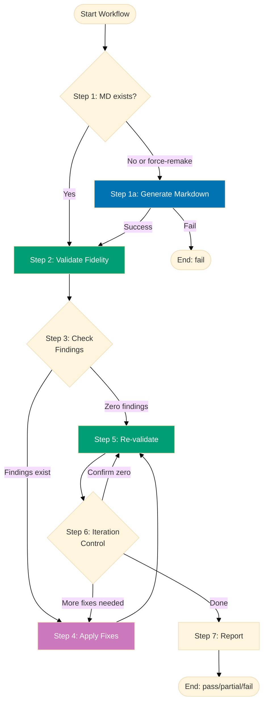

# PDF-to-Markdown Quality Gate Workflow

**Purpose**: Convert a PDF file to a complete, verbatim Markdown representation, then validate
conversion fidelity iteratively until all issues are resolved. The resulting Markdown serves as a
cross-reference source-of-truth proxy for the original PDF.

**When to use**:

- When converting a new PDF document to Markdown for archival or cross-referencing
- After manually editing a PDF-derived Markdown file (verify fidelity was not lost)
- When validating an existing conversion before using it as a reference source
- After a PDF has been updated and the Markdown needs revalidation

This workflow implements the **Maker-Checker-Fixer pattern** for PDF-to-Markdown conversion quality
assurance.

## Execution Mode

**Preferred Mode**: Agent Delegation — invoke `pdf-to-md-maker`, `pdf-to-md-checker`, and
`pdf-to-md-fixer` via the Agent tool with `subagent_type`
(see [Workflow Execution Modes Convention](../meta/execution-modes.md)).

**Fallback Mode**: Manual Orchestration — execute workflow logic directly using Read/Write/Edit/Bash
tools when Agent Delegation is unavailable.

**How to Execute**:

```
User: "Run pdf-to-md quality gate for docs/reference/security/nist-sp-800-53-rev5.pdf"
```

The AI will:

1. Check if Markdown file exists (skip maker if it does, unless force-remake=true)
2. Invoke `pdf-to-md-maker` via the Agent tool (convert PDF → Markdown)
3. Invoke `pdf-to-md-checker` via the Agent tool (validate fidelity, write audit)
4. Invoke `pdf-to-md-fixer` via the Agent tool (read audit, apply fixes)
5. Iterate until zero findings achieved on two consecutive checks
6. Show git status with modified files
7. Wait for user commit approval

**Fallback (Manual Mode)**:

```
User: "Run pdf-to-md quality gate for nist.pdf in manual mode"
```

The AI executes checker and fixer logic directly using Bash (pdftotext) and Read/Write/Edit tools.

## Workflow Overview



## Steps

### 1. Generate Markdown (Conditional)

Convert the PDF to Markdown. Skipped if MD file already exists AND `force-remake=false`.

**Condition**: Run if `md-file` does not exist OR `force-remake=true`

**Agent**: `pdf-to-md-maker`

- **Args**: `pdf-file: {input.pdf-file}, md-file: {input.md-file}`
- **Output**: Markdown file at `{input.md-file}` (or derived default path)

**Success criteria**: Maker completes without error; MD file exists and is non-empty.

**On failure**: Terminate workflow with status `fail`. Common failure causes:

- `pdftotext` (poppler-utils) not installed
- `tesseract` not installed for image-only PDFs
- Source PDF is corrupt or unreadable

**Notes**:

- Text-based PDFs: uses `pdftotext -layout` in 50-page chunks
- Image-only PDFs: uses `pdfimages` + `tesseract` OCR per page; OCR pages tagged `<!-- OCR: page N -->`
- Diagrams/figures: converted to Mermaid stubs or `[FIGURE N: ...]` placeholders
- Default output path: same directory and filename as PDF, `.md` extension
- **Directory creation**: if `md-file` parent directory does not exist, maker runs `mkdir -p`
  before writing — applies to custom output paths; the default path (same dir as PDF) always
  exists and is a no-op
- **Heading level inference**: maker uses `pdftotext -layout` font-size heuristics and section
  numbering depth (e.g. `1.2.3` = H3) to assign the correct `#` depth — title = H1, top-level
  chapters/parts = H2, sections = H3, subsections = H4, sub-subsections = H5
- **Content nesting inference**: list indentation depth from PDF layout output is preserved;
  nested bullets and numbered lists carry the correct nesting level into Markdown

### 2. Validate Fidelity (Sequential)

Validate the Markdown file against the source PDF across all dimensions.

**Agent**: `pdf-to-md-checker`

- **Args**: `pdf-file: {input.pdf-file}, md-file: {input.md-file}, EXECUTION_SCOPE: pdf-to-md`
- **Output**: `{pdf-to-md-report-N}` — fidelity audit report

**Success criteria**: Checker completes and generates audit report.

**On failure**: Terminate workflow with status `fail`.

**Validation dimensions**:

- **Text completeness** — no PDF passages missing from Markdown
- **Text accuracy** — no words changed or incorrectly transcribed
- **Heading level accuracy** — `#` depth of every heading matches the PDF visual hierarchy
  (title = H1, chapter/part = H2, section = H3, subsection = H4, sub-subsection = H5); derived
  from font-size heuristics and section-numbering depth in `pdftotext -layout` output
- **Content nesting accuracy** — list nesting depth and indented block elements match PDF
  structure; nested bullets and numbered lists carry the correct level into Markdown
- **Table integrity** — all tables present with correct data
- **Figure coverage** — every figure has Mermaid or placeholder
- **Mermaid validity** — all Mermaid blocks have valid syntax
- **OCR quality** — image-only pages have acceptable error rate (<10%)
- **Structural order** — sections appear in PDF reading order

**Notes**:

- Processes PDF in 50-page chunks for large documents
- Loads `generated-reports/pdf-to-md__{md-basename}__known-false-positives.md` skip list before validating

### 3. Check for Findings (Sequential)

Analyze audit report to determine if fixes are needed and track convergence progress.

**Condition Check**: Count findings based on mode level in `{step2.outputs.pdf-to-md-report-N}`

**Mode-based counting**:

- **lax**: Count CRITICAL only
- **normal**: Count CRITICAL + HIGH
- **strict**: Count CRITICAL + HIGH + MEDIUM
- **ocd**: Count all levels (CRITICAL, HIGH, MEDIUM, LOW)

**Below-threshold findings**: Reported in audit but don't block success.

**Decision**:

- If threshold-level findings > 0: Proceed to step 4 (reset `consecutive_zero_count` to 0)
- If threshold-level findings = 0: Initialize `consecutive_zero_count` to 1 (this check is the
  first zero); proceed to step 5 (Re-validate) for confirmation re-check (consecutive pass
  requirement)

**Depends on**: Step 2 completion

### 4. Apply Fixes (Sequential, Conditional)

Apply validated fixes from the checker audit report.

**Agent**: `pdf-to-md-fixer`

- **Args**: `report: {step2.outputs.pdf-to-md-report-N}, pdf-file: {input.pdf-file}, md-file: {input.md-file}, mode: {input.mode}`
- **Output**: `{pdf-to-md-fix-report-N}` — fix application report with same UUID chain
- **Condition**: Threshold-level findings > 0 from step 3

**Fix scope by mode**:

- **lax**: Fix CRITICAL only (skip HIGH/MEDIUM/LOW)
- **normal**: Fix CRITICAL + HIGH (skip MEDIUM/LOW)
- **strict**: Fix CRITICAL + HIGH + MEDIUM (skip LOW)
- **ocd**: Fix all levels

**Success criteria**: Fixer completes; fix report generated.

**On failure**: Log errors; proceed to step 5 (Re-validate).

**Notes**:

- Fixer re-validates each finding before applying (prevents false positives)
- HIGH_CONFIDENCE fixes applied automatically
- MEDIUM_CONFIDENCE fixes skipped (flagged for manual review)
- FALSE_POSITIVE findings persisted to `generated-reports/pdf-to-md__{md-basename}__known-false-positives.md`
- Fix report includes changed sections list for scoped re-validation

### 5. Re-validate (Sequential)

Run the checker again to verify fixes resolved issues and no new issues were introduced.

**Agent**: `pdf-to-md-checker`

- **Args**: `pdf-file: {input.pdf-file}, md-file: {input.md-file}, EXECUTION_SCOPE: pdf-to-md,
uuid-chain: {previous-uuid-chain}, fix-report: {step4.outputs.pdf-to-md-fix-report-N}`
- **Output**: `{pdf-to-md-report-N}` — re-validation audit report
- **Depends on**: Step 3 completion (when confirming a first-zero pass) or Step 4 completion
  (when verifying fixes were applied correctly)

**Re-validation mode**: The UUID chain signals re-validation mode to the checker. When called
after Step 4, the fix report provides the changed sections list — checker validates only changed
sections and reuses the iteration 1 full-document scan scope for unchanged sections. When called
directly from Step 3 (zero-findings confirmation path), no fix report is provided and the checker
re-validates the full document.

**Success criteria**: Checker completes and generates re-validation audit report.

**On failure**: Terminate workflow with status `fail`.

**Notes**:

- Loads `generated-reports/pdf-to-md__{md-basename}__known-false-positives.md` skip list before validating
- Scoped re-validation (changed sections only) on iterations where fixes were applied
- Full re-validation when confirming a zero-findings pass with no preceding fix step

### 6. Iteration Control (Sequential)

Determine whether to continue or finalize.

**Logic**:

- Track consecutive_zero_count across iterations (resets to 0 when threshold-level findings > 0,
  increments when = 0)
- If consecutive_zero_count >= 2 AND iterations >= min-iterations (or min not provided): Proceed
  to step 7 (double-zero confirmed — **pass**)
- If consecutive_zero_count >= 2 AND iterations < min-iterations: Loop back to step 5
  (Re-validate to satisfy min-iterations)
- If consecutive_zero_count < 2 AND threshold-level findings = 0: Loop back to step 5
  (confirmation check — no fix needed, just re-verify)
- If threshold-level findings > 0 AND max-iterations provided AND iterations >= max-iterations:
  Proceed to step 7 (**partial**)
- If threshold-level findings > 0 AND (max-iterations not provided OR iterations < max-iterations):
  Loop back to step 4 (Apply Fixes)

**Below-threshold findings**: Reported in audit but don't affect iteration logic.

**Notes**:

- **Consecutive pass requirement**: Zero findings must be confirmed by a second independent check
  before declaring success
- Escalation warning logged at iteration 5 if not converging
- Default max-iterations: 7

### 7. Finalization (Sequential)

Report final status and summary.

**Output**: `{final-status}`, `{iterations-completed}`, `{pdf-to-md-report}`

**Status determination**:

- **pass**: Zero threshold-level findings across all dimensions on 2 consecutive checks
- **partial**: Findings remain after max-iterations; or some fixes require manual intervention
  (e.g., OCR quality disputes)
- **fail**: Technical errors (missing tools, corrupt PDF, empty output)

**Notes**:

- Below-threshold findings reported in final audit but don't prevent success
- Manual intervention cases (e.g., true OCR quality issues) always result in `partial` — re-run
  after manual correction
- Final report includes page coverage, table count, figure count, Mermaid block count

## Termination Criteria

**Success** (`pass`):

- **lax**: Zero CRITICAL findings on 2 consecutive checks (HIGH/MEDIUM/LOW may exist)
- **normal**: Zero CRITICAL/HIGH findings on 2 consecutive checks (MEDIUM/LOW may exist)
- **strict**: Zero CRITICAL/HIGH/MEDIUM findings on 2 consecutive checks (LOW may exist)
- **ocd**: Zero findings at all levels on 2 consecutive checks

**Partial** (`partial`):

- Threshold-level findings remain after max-iterations
- Some findings require manual intervention (OCR quality, ambiguous diagram type)
- Some fixer operations failed

**Failure** (`fail`):

- Required CLI tool not found (`pdftotext`, `tesseract`)
- Source PDF unreadable or corrupt
- Output MD file could not be written

**Note**: Below-threshold findings are reported in final audit but don't prevent success status.
Success requires two consecutive zero-finding validations (consecutive pass requirement).

## Example Usage

### Standard Invocation

```
User: "Run pdf-to-md quality gate for docs/reference/nist-sp-800-53-rev5.pdf"
```

AI will:

- Check if MD exists; skip maker if it does
- Validate fidelity in strict mode (default)
- Fix CRITICAL/HIGH/MEDIUM findings
- Iterate until zero CRITICAL/HIGH/MEDIUM findings on 2 consecutive checks

### Force Regeneration

```
User: "Run pdf-to-md quality gate for nist.pdf with force-remake=true"
```

AI will:

- Re-run maker even if MD already exists (full re-conversion)
- Validate and fix as normal

### Quick Critical-Only Check (Lax Mode)

```
User: "Run pdf-to-md quality gate for nist.pdf in lax mode"
```

AI will:

- Fix CRITICAL findings only
- Report HIGH/MEDIUM/LOW without fixing them
- Success when zero CRITICAL findings on 2 consecutive checks

### Custom Output Path

```
User: "Run pdf-to-md quality gate for /data/source.pdf with md-file=/docs/reference/source.md"
```

AI will:

- Generate Markdown at specified output path
- Validate against PDF source

### With Iteration Bounds

```
User: "Run pdf-to-md quality gate for nist.pdf in normal mode with min-iterations=2 and max-iterations=10"
```

## Iteration Example

```
Iteration 1:
  Maker: PDF → Markdown (847 pages, 23 tables, 45 figures, 12 Mermaid diagrams)
  Checker: 15 findings
    - CRITICAL: 3 missing sections (pages 234-241)
    - HIGH: 5 invalid Mermaid blocks
    - HIGH: 4 missing figure placeholders
    - MEDIUM: 3 heading hierarchy drifts
  Fixer: Applied 12 HIGH_CONFIDENCE fixes; skipped 3 MEDIUM_CONFIDENCE

Iteration 2:
  Re-validate (scoped to changed sections): 2 findings
    - HIGH: 1 Mermaid block still invalid after first fix attempt
    - MEDIUM: 1 heading drift in re-inserted section
  Fixer: Applied 1 fix; 1 MEDIUM skipped
  consecutive_zero_count: 0 (findings > 0 — reset)

Iteration 3:
  Re-validate (scoped): 0 findings
  consecutive_zero_count: 1 (first zero)

Iteration 4 (confirmation):
  Re-validate (scoped): 0 findings
  consecutive_zero_count: 2 ← double-zero confirmed

Result: PASS (4 iterations)
```

## Safety Features

**Infinite Loop Prevention**:

- max-iterations defaults to 7
- Escalation warning at iteration 5

**Convergence Safeguards**:

- Checker loads `generated-reports/pdf-to-md__{md-basename}__known-false-positives.md` at each iteration start
- Fixer persists new FALSE_POSITIVEs to that same file in `generated-reports/`
- Step 5 (Re-validate) uses changed-sections-only scan when called after Step 4 (Apply Fixes)

**False Positive Protection**:

- Fixer re-validates each finding before applying
- FALSE_POSITIVE findings skipped and logged
- Stable key format prevents duplicate skip list entries

**Graceful Degradation**:

- Missing `tesseract` → fail early with install instructions (image-only PDFs)
- Missing `pdftotext` → fail early with install instructions (all PDFs)
- Missing `mmdc` → Mermaid validation falls back to syntax-only inspection

**Manual Intervention Flags**:

- OCR quality disputes: flagged in fix report, not auto-applied
- Ambiguous diagram types: kept as `[FIGURE N: ...]` placeholder

## Tool Dependencies

Build crane-cli and add to PATH:

```bash
npx nx run crane-cli:build                           # builds apps/crane-cli/bin/Release/net10.0/crane
export PATH="$PWD/apps/crane-cli/bin/Release/net10.0:$PATH"
crane --version
```

Install system dependencies:

```bash
brew install tesseract     # OCR for image-only PDFs
brew install jq            # JSON parsing for crane output
```

Verify:

```bash
crane --version
tesseract --version
jq --version
```

## Validation Dimensions Summary

| Dimension                                       | Agent   | crane Command                          | Auto-Fixable                          |
| ----------------------------------------------- | ------- | -------------------------------------- | ------------------------------------- |
| Text completeness (missing sections/paragraphs) | checker | `crane text --check "$PDF" "$MD"`      | Yes (re-extract from PDF)             |
| Text accuracy (wrong words)                     | checker | `crane text --search "$MD" "$SEGMENT"` | Yes (re-extract from PDF)             |
| Heading level accuracy (`#` depth vs PDF)       | checker | `crane heading --check "$PDF" "$MD"`   | Yes (re-derive from layout heuristic) |
| Content nesting accuracy (list/block depth)     | checker | `crane nesting --check "$PDF" "$MD"`   | Yes (re-extract with layout output)   |
| Table integrity (missing/wrong data)            | checker | `crane table --check "$PDF" "$MD"`     | Yes (re-extract from PDF)             |
| Figure coverage (Mermaid or placeholder)        | checker | `crane figure --check "$PDF" "$MD"`    | Yes (add placeholder)                 |
| Mermaid syntax validity                         | checker | `crane mermaid --validate "$MD"`       | Yes (fix syntax)                      |
| OCR quality (gibberish rate)                    | checker | No (manual review)                     |
| Structural order (section sequence)             | checker | Partial (re-ordering risky)            |

## Principles Implemented/Respected

- PASS: **Explicit Over Implicit**: All steps, conditions, and termination criteria are explicit
- PASS: **Automation Over Manual**: Fully automated conversion and fixing (except OCR quality disputes)
- PASS: **Simplicity Over Complexity**: Clear linear flow with mode-based scoping
- PASS: **Reproducibility First**: Deterministic chunk-based PDF processing
- PASS: **No Time Estimates**: Focus on quality outcomes, not duration

## Conventions Implemented/Respected

- **[Workflow Naming Convention](../../conventions/structure/workflow-naming.md)**: `pdf-to-md-quality-gate` follows `<scope>-<type>` pattern
- **[File Naming Convention](../../conventions/structure/file-naming.md)**: Workflow file follows plain name convention
- **[Linking Convention](../../conventions/formatting/linking.md)**: All cross-references use GitHub-compatible markdown with `.md` extensions
- **[Content Quality Principles](../../conventions/writing/quality.md)**: Active voice, proper heading hierarchy, single H1

## Related Workflows

- **Documentation Quality Gate** (`docs-quality-gate`) — Validate Markdown documentation quality
  after PDF conversion
- **Repository Rules Validation** (`repo-rules-quality-gate`) — Validate after new reference
  documents are added

## Related Agents

- [pdf-to-md-maker](../../../.claude/agents/pdf-to-md-maker.md) — Converts PDF to verbatim Markdown
- [pdf-to-md-checker](../../../.claude/agents/pdf-to-md-checker.md) — Validates conversion fidelity
- [pdf-to-md-fixer](../../../.claude/agents/pdf-to-md-fixer.md) — Applies validated fixes
