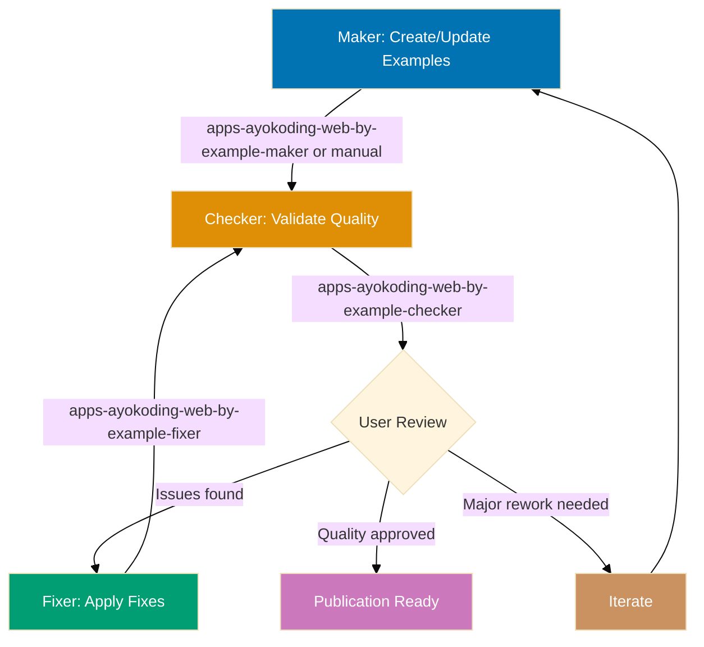
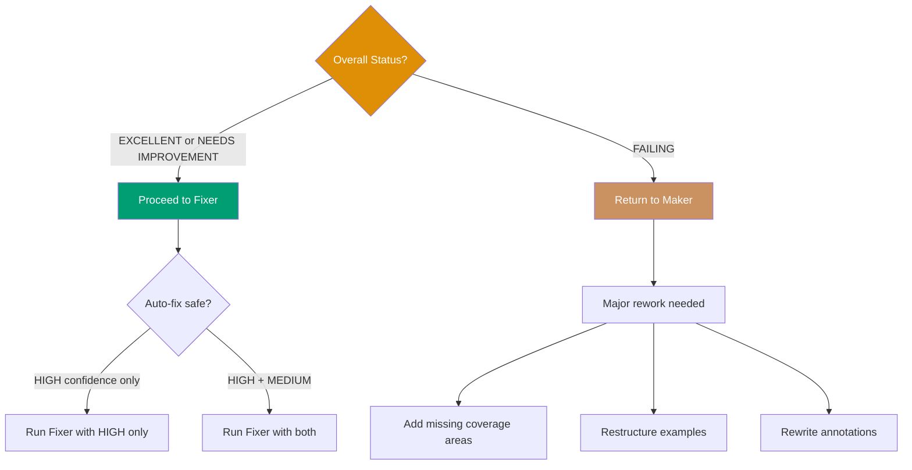
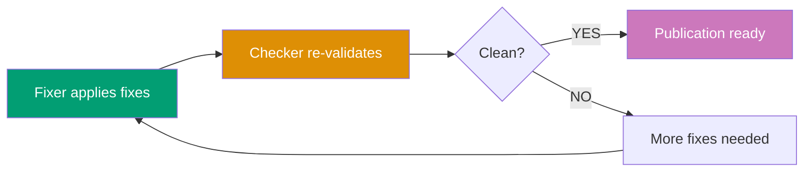

# AyoKoding Content By-Example Quality Gate Workflow

**Purpose**: Validate and improve by-example tutorial quality through iterative checking and fixing until tutorials achieve 95% coverage with 75-90 self-contained, annotated examples.

**When to use**:

- After creating or updating by-example tutorials
- Before publishing by-example content to ayokoding-web
- When migrating tutorials from 90% to 95% coverage standard
- After adding new examples or diagrams to existing tutorials
- Periodically to ensure tutorial quality remains high

This workflow implements the **Maker-Checker-Fixer pattern** to ensure by-example tutorials meet quality standards before publication.

## Execution Mode

**Current Mode**: Manual Orchestration (see [Workflow Execution Modes Convention](../meta/execution-modes.md))

This workflow is currently executed through **manual orchestration** where the AI assistant (Claude Code or OpenCode) follows workflow steps directly using Read/Write/Edit tools. File changes persist to the actual filesystem.

**How to Execute**:

```
User: "Run ayokoding-web by-example quality gate workflow for golang/tutorials/by-example/ in manual mode"
```

The AI will:

1. Execute apps\_\_ayokoding-web\_\_by-example-checker logic directly (validate tutorial, write audit)
2. User reviews audit report and decides on fixes (manual decision point)
3. Execute apps\_\_ayokoding-web\_\_by-example-fixer logic directly (read audit, apply fixes, write fix report)
4. Iterate until EXCELLENT status achieved (zero findings, 75-90 examples, 95% coverage)
5. Show git status with modified files
6. Wait for user commit approval

**Why Manual Mode?**: Task tool (Claude Code) or agent spawning (OpenCode) runs agents in isolated contexts where file changes don't persist. Manual orchestration ensures audit reports and tutorial fixes are actually written to the filesystem. This workflow also includes manual decision points (user review step) unlike fully automated workflows.

## Workflow Overview



## Steps

### 1. Maker - Create/Update Examples (Manual/AI-Assisted)

**Objective**: Create or update by-example tutorial content

**Approaches**:

**Option A: Manual creation** (human author)

- Write examples following [By-Example Tutorial Convention](../../conventions/tutorial/by-example.md)
- Focus on educational value and code quality
- Don't worry about perfect compliance (checker will catch issues)

**Option B: AI-assisted creation** (docs\_\_tutorial-maker or future by-example-maker)

- Use docs\_\_tutorial-maker with by-example specifications
- Generate initial examples based on language/framework
- Human review and refinement

**Outputs**:

- Tutorial files: overview.md, beginner.md, intermediate.md, advanced.md
- 75-90 examples across three levels
- Mermaid diagrams where appropriate
- Educational annotations and comments

**Next step**: Proceed to step 2

### 2. Checker - Validate Quality (Sequential)

**Objective**: Identify gaps and issues against by-example standards

**Agent**: `apps-ayokoding-web-by-example-checker`

**Execution**:

```bash
# Invoke via Task tool
subagent_type: apps-ayokoding-web-by-example-checker
prompt: "Validate apps/ayokoding-web/content/en/learn/software-engineering/programming-language/golang/tutorials/by-example/ for compliance with by-example standards"
```

**Validation areas**:

1. **Coverage and count**: 95% coverage, 75-90 examples
2. **Annotation density**: 1-2.25 comment lines per code line (target: 1-2.25, upper bound: 2.5)
3. **Self-containment**: Copy-paste-runnable within chapter scope
4. **Annotations**: `// =>` notation for outputs and states
5. **Diagrams**: 30-50% frequency, color-blind palette
6. **Format**: Five-part structure (explanation, diagram, code, takeaway, why it matters)
7. **Frontmatter**: Complete and correct

**Outputs**:

- Audit report: `generated-reports/ayokoding-web-by-example__{uuid-chain}__{timestamp}__audit.md`
- Executive summary with overall status
- Detailed findings with confidence levels
- Specific line numbers for issues
- Actionable recommendations

**UUID Chain Tracking**: Checker generates 6-char UUID and writes to `generated-reports/.execution-chain-{scope}` (where scope is derived from tutorial path, e.g., "golang"). See [Temporary Files Convention](../../development/infra/temporary-files.md#uuid-chain-generation) for details.

**Depends on**: Step 1 completion

**Next step**: Proceed to step 3

### 3. User Review (Manual Decision Point)

**Objective**: Human decision on validation findings

**User actions**:

**1. Read audit report** from generated-reports/

**2. Count findings based on mode level** (default: `{input.mode}` or `normal`):

**Strictness-based counting**:

- **lax**: Count CRITICAL only
- **normal**: Count CRITICAL + HIGH
- **strict**: Count CRITICAL + HIGH + MEDIUM
- **ocd**: Count all levels (CRITICAL, HIGH, MEDIUM, LOW)

**Below-threshold findings**: Reported but don't block success

- **lax**: HIGH/MEDIUM/LOW reported, not counted
- **normal**: MEDIUM/LOW reported, not counted
- **strict**: LOW reported, not counted
- **ocd**: All findings counted

**3. Assess overall status**:

- ✅ **EXCELLENT**: Zero threshold-level findings, proceed to fixer for below-threshold issues (optional)
- ⚠️ **NEEDS IMPROVEMENT**: Some threshold-level findings, proceed to fixer for mechanical fixes
- ❌ **FAILING**: Major structural issues, return to maker for rework

**4. Review confidence levels**:

- **HIGH confidence**: Trust findings, approve auto-fix
- **MEDIUM confidence**: Review specific examples, approve if valid
- **FALSE POSITIVE risk**: Decide whether to keep current design or fix

**5. Make decision**:



**Decision matrix**:

| Status            | HIGH Conf Issues | MEDIUM Conf Issues | Action                                 |
| ----------------- | ---------------- | ------------------ | -------------------------------------- |
| EXCELLENT         | 0-5              | 0-10               | Run fixer (all)                        |
| NEEDS IMPROVEMENT | 5-15             | 10-30              | Run fixer (HIGH only or review MEDIUM) |
| FAILING           | 15+              | 30+ or Major gaps  | Return to maker                        |

**Depends on**: Step 2 completion

**Next step**:

- If approved → Proceed to step 4
- If failing → Return to step 1

### 4. Fixer - Apply Validated Fixes (Sequential, Conditional)

**Objective**: Automatically apply safe, validated improvements

**Agent**: `apps-ayokoding-web-by-example-fixer`

**Execution**:

```bash
# Invoke via Task tool with audit report and mode parameter
subagent_type: apps-ayokoding-web-by-example-fixer
prompt: "Apply fixes from generated-reports/ayokoding-web-by-example__a1b2c3__2025-12-25--14-30__audit.md with mode={input.mode}"
```

**Fix application strategy**:

**Fixer respects mode level** (`{input.mode}` from workflow):

- **lax**: Fix CRITICAL only (skip HIGH/MEDIUM/LOW)
- **normal**: Fix CRITICAL + HIGH (skip MEDIUM/LOW)
- **strict**: Fix CRITICAL + HIGH + MEDIUM (skip LOW)
- **ocd**: Fix all levels (CRITICAL, HIGH, MEDIUM, LOW)

**HIGH confidence fixes** (auto-apply within mode scope):

- Add missing imports
- Fix color palette violations
- Add frontmatter fields
- Fix incorrect weights
- Add example numbering

**MEDIUM confidence fixes** (re-validate first, only if mode includes MEDIUM):

- Add `// =>` annotations
- Add missing key takeaways
- Condense verbose explanations
- Add diagrams (verify necessity)

**FALSE POSITIVE risks** (report to user):

- Example count adjustments (requires content creation)
- Diagram frequency changes (requires visual design)
- Self-containment violations (may be intentional pedagogy)

**Outputs**:

- Modified tutorial files with fixes applied
- Fix report: `generated-reports/ayokoding-web-by-example__{uuid-chain}__{timestamp}__fix.md` (uses same UUID chain as source audit)
- List of deferred issues requiring user decision

**Depends on**: Step 3 approval

**Success criteria**: Fixer successfully applies fixes without errors.

**On failure**: Log errors, proceed to re-validation anyway.

**Next step**: Proceed to step 5

### 5. Iteration Control (Sequential)

Determine whether to continue fixing or finalize.

**Logic**:

- Re-run checker (step 2) to get fresh report
- Count findings based on mode level (same as Step 3):
  - **lax**: Count CRITICAL only
  - **normal**: Count CRITICAL + HIGH
  - **strict**: Count CRITICAL + HIGH + MEDIUM
  - **ocd**: Count all levels (CRITICAL, HIGH, MEDIUM, LOW)
- If threshold-level findings = 0 AND iterations >= min-iterations (or min not provided): Proceed to step 6 (Finalization)
- If threshold-level findings = 0 AND iterations < min-iterations: Loop back to step 3 (need more iterations)
- If threshold-level findings > 0 AND max-iterations provided AND iterations >= max-iterations: Proceed to step 6 with status `needs-improvement`
- If threshold-level findings > 0 AND (max-iterations not provided OR iterations < max-iterations): Loop back to step 3

**Below-threshold findings**: Continue to be reported in audit but don't affect iteration logic

**Depends on**: Step 4 completion

**Notes**:

- **Default behavior**: Runs indefinitely until zero threshold-level findings (no max-iterations limit)
- **Optional min-iterations**: Prevents premature termination before sufficient iterations
- **Optional max-iterations**: Prevents infinite loops when explicitly provided
- Each iteration gets fresh validation report
- Tracks iteration count and finding trends
- Below-threshold findings remain visible but don't block convergence

**Iteration diagram**:



### 6. Finalization (Sequential)

Report final status and summary.

**Output**: `{final-status}`, `{iterations-completed}`, `{examples-count}`, `{coverage-percentage}`, final reports

**Status determination**:

- **Excellent** (`excellent`): Zero threshold-level findings after final validation, 75-90 examples, 95% coverage achieved (below-threshold findings may exist and are acceptable)
- **Needs Improvement** (`needs-improvement`): Threshold-level findings remain after max-iterations OR below example/coverage targets
- **Failing** (`failing`): Major structural issues prevent auto-fixing, requires maker rework

**Depends on**: Step 5 completion

## Termination Criteria

**Success** (`excellent`):

- **lax**: Zero CRITICAL findings, 75-90 examples, 95% coverage (HIGH/MEDIUM/LOW may exist)
- **normal**: Zero CRITICAL/HIGH findings, 75-90 examples, 95% coverage (MEDIUM/LOW may exist)
- **strict**: Zero CRITICAL/HIGH/MEDIUM findings, 75-90 examples, 95% coverage (LOW may exist)
- **ocd**: Zero findings at all levels, 75-90 examples, 95% coverage

**Partial** (`needs-improvement`):

- Threshold-level findings remain after max-iterations OR example count/coverage below targets

**Failure** (`failing`):

- Major structural issues require maker rework, auto-fixing not applicable

**Note**: Below-threshold findings are reported in final audit but don't prevent success status.

## Iteration Examples

### Example 1: New By-Example Tutorial (Clean Path)

**Scenario**: Creating Go by-example tutorial from scratch

**Step 1: Maker** (manual creation)

- Author writes 60 examples across 3 levels
- Includes code, some annotations, few diagrams
- Saves to golang/tutorials/by-example/

**Step 2: Checker** (validation)

```bash
apps-ayokoding-web-by-example-checker validates golang by-example
```

**Results**:

- 60 examples (target: 75-90) ⚠️
- Self-containment: 90% ✅
- Annotations: 70% coverage ⚠️
- Diagrams: 20% frequency ⚠️
- Status: **NEEDS IMPROVEMENT**

**Step 3: User Review**

- Reviews audit report
- Approves HIGH confidence fixes
- Approves MEDIUM confidence annotation additions
- Defers diagram additions (will add manually)
- Defers example count increase (needs content planning)

**Step 4: Fixer** (apply fixes)

```bash
apps-ayokoding-web-by-example-fixer applies fixes from audit
```

**Fixes applied**:

- Added 5 missing imports (HIGH)
- Added annotations to meet 1-2.25 comment lines per code line density (target: 1-2.25, upper bound: 2.5) (MEDIUM, re-validated)
- Fixed 3 color violations (HIGH)
- Added 2 missing key takeaways (MEDIUM)

**Step 5: Re-validation**

```bash
apps-ayokoding-web-by-example-checker re-validates
```

**Results**:

- Self-containment: 100% ✅
- Annotations: 95% coverage ✅
- Diagrams: 20% (deferred) ⚠️
- Example count: 60 (deferred) ⚠️
- Status: **EXCELLENT** (remaining issues are user decisions)

**Outcome**: Publication ready with notes to add diagrams and examples incrementally

### Example 2: Updating Existing Tutorial (Issue Path)

**Scenario**: Updating Elixir by-example with new language features

**Step 1: Maker** (add 10 new examples)

- Author adds 10 examples for Elixir 1.17 features
- Brings total to 70 examples
- Focused on code, minimal annotations

**Step 2: Checker**

```bash
apps-ayokoding-web-by-example-checker validates elixir by-example
```

**Results**:

- 70 examples (target: 75-90) ⚠️
- New examples missing imports ❌
- New examples no annotations ❌
- Status: **NEEDS IMPROVEMENT**

**Step 3: User Review**

- Approves all HIGH + MEDIUM fixes
- Wants to add 5-10 more examples later

**Step 4: Fixer**

```bash
apps-ayokoding-web-by-example-fixer applies fixes
```

**Fixes applied**:

- Added 10 missing imports (HIGH)
- Added annotations to meet density target for new examples (MEDIUM)
- Added 3 key takeaways (MEDIUM)

**Step 5: Re-validation**

```bash
apps-ayokoding-web-by-example-checker re-validates
```

**Results**:

- 70 examples ⚠️ (still below target, deferred)
- All other metrics ✅
- Status: **EXCELLENT**

**Outcome**: Published with plan to add 5-10 examples in next iteration

### Example 3: Major Rework (Failing Path)

**Scenario**: Java by-example audit reveals major issues

**Step 1: Checker** (initial validation)

```bash
apps-ayokoding-web-by-example-checker validates java by-example
```

**Results**:

- 45 examples (target: 75-90) ❌ MAJOR GAP
- Coverage: 60% (target: 95%) ❌ MAJOR GAP
- Self-containment: 40% ❌ MAJOR ISSUE
- Status: **FAILING**

**Step 2: User Review**

- Audit shows tutorial not ready for fixer
- Missing 30-45 examples for 95% coverage
- Most examples not self-contained
- Decision: **Return to Maker**

**Step 3: Maker** (major rework)

- Author analyzes missing coverage areas
- Plans 35 new examples across levels
- Rewrites existing examples for self-containment
- Takes 2-3 weeks

**Step 4: Checker** (re-validation after rework)

```bash
apps-ayokoding-web-by-example-checker re-validates
```

**Results**:

- 80 examples ✅
- Coverage: 90% ⚠️ (close to target)
- Self-containment: 85% ⚠️
- Status: **NEEDS IMPROVEMENT**

**Step 5: User Review**

- Much better, proceed to fixer

**Step 6: Fixer** (apply remaining fixes)

- Fixes self-containment issues
- Adds missing annotations

**Step 7: Re-validation**

- Status: **EXCELLENT**

**Outcome**: Published after major rework and iteration

## Strictness Examples

### Example 4: Normal Strictness (Default)

**Scenario**: Standard by-example validation for Go tutorial

**Invocation**:

```
User: "Run ayokoding-web by-example quality gate workflow for golang/tutorials/by-example/ in normal mode"
```

**Checker results**:

- 3 CRITICAL findings (missing imports)
- 5 HIGH findings (color violations, missing frontmatter)
- 8 MEDIUM findings (missing annotations)
- 12 LOW findings (style improvements)

**Fixer behavior**:

- Fixes: 3 CRITICAL + 5 HIGH = 8 fixes applied
- Skips: 8 MEDIUM + 12 LOW = 20 findings reported but not fixed
- Status: `excellent` (zero threshold-level findings, below-threshold findings acceptable)

**Final audit**:

- Zero CRITICAL/HIGH findings ✅
- 8 MEDIUM findings reported (acceptable)
- 12 LOW findings reported (acceptable)

### Example 5: Strict Mode (Pre-Deployment)

**Scenario**: Pre-deployment validation for Elixir tutorial

**Invocation**:

```
User: "Run ayokoding-web by-example quality gate workflow for elixir/tutorials/by-example/ in strict mode"
```

**Checker results**:

- 2 CRITICAL findings
- 4 HIGH findings
- 10 MEDIUM findings
- 15 LOW findings

**Fixer behavior**:

- Fixes: 2 CRITICAL + 4 HIGH + 10 MEDIUM = 16 fixes applied
- Skips: 15 LOW findings reported but not fixed
- Status: `excellent` (zero CRITICAL/HIGH/MEDIUM, LOW findings acceptable)

**Final audit**:

- Zero CRITICAL/HIGH/MEDIUM findings ✅
- 15 LOW findings reported (acceptable)

### Example 6: Very Strict Mode (Comprehensive)

**Scenario**: Comprehensive audit for Java tutorial

**Invocation**:

```
User: "Run ayokoding-web by-example quality gate workflow for java/tutorials/by-example/ in ocd mode with max-iterations=10"
```

**Checker results**:

- 1 CRITICAL finding
- 3 HIGH findings
- 6 MEDIUM findings
- 20 LOW findings

**Fixer behavior**:

- Fixes: 1 CRITICAL + 3 HIGH + 6 MEDIUM + 20 LOW = 30 fixes applied
- Skips: None
- Status: `excellent` (zero findings at all levels)

**Final audit**:

- Zero findings at all levels ✅
- Equivalent to pre-mode parameter behavior

## Workflow Invocation

### Manual Orchestration (Current)

**User triggers workflow execution**:

```
User: "Run ayokoding-web by-example quality gate workflow for golang/tutorials/by-example/ in manual mode"
```

**AI orchestrates all phases**:

1. **Create content** (if needed): User writes examples or uses maker agent
2. **Validate**: Execute apps**ayokoding-web**by-example-checker logic directly
3. **Review**: User reads audit report from generated-reports/
4. **Fix**: Execute apps**ayokoding-web**by-example-fixer logic directly
5. **Re-validate**: Execute checker logic again
6. **Iterate**: Repeat validation-fixing until clean or max-iterations

**With parameters**:

```
User: "Run ayokoding-web by-example quality gate workflow for golang/tutorials/by-example/ in strict mode with max-iterations=10"
```

The AI applies mode-based fixing and iteration limits during execution.

## Safety Features

**Infinite Loop Prevention**:

- Optional max-iterations parameter (no default - runs until zero findings)
- When provided, workflow terminates with `needs-improvement` if limit reached
- Tracks iteration count and finding trends
- Use max-iterations when fix convergence is uncertain

**False Positive Protection**:

- Fixer re-validates findings before applying
- Skips FALSE_POSITIVE findings automatically
- Progressive writing ensures audit history survives

**Error Recovery**:

- Continues to finalization even if fixer partially fails
- Reports which fixes succeeded/failed
- Generates final reports regardless of status

**User Control**:

- Auto-fix-level parameter controls automation degree
- Manual decision points at user review step
- Can abort and return to maker for major rework

## Success Metrics

Track across executions:

- **Average iterations to completion**: How many cycles typically needed for EXCELLENT status
- **Success rate**: Percentage reaching zero findings and coverage targets
- **Common issues**: What problems appear most frequently (imports, annotations, diagrams)
- **Fix success rate**: Percentage of fixes applied without errors
- **Tutorial improvement velocity**: Example count and coverage increase per iteration

## Related Workflows

This workflow is part of the **Tutorial Quality Family**:

- **[Maker-Checker-Fixer Pattern](../../development/pattern/maker-checker-fixer.md)**: General pattern
- **docs-tutorial workflow**: General tutorial validation
- **ayokoding-web-by-example-quality-gate** (this workflow): Specialized for by-example tutorials
- **ayokoding-web workflow**: Hugo content validation

## Notes

- **User-driven**: Requires manual decision points (user review), not fully automated
- **Iterative**: Multiple checker-fixer cycles until quality achieved
- **Bounded**: Max-iterations prevents runaway execution
- **Observable**: Generates detailed audit and fix reports
- **Flexible**: Auto-fix-level parameter controls automation degree
- **Focused**: Specialized for by-example tutorials only (not general tutorials)

**Parallelization**: Currently executes sequentially due to user decision points (maker-checker-fixer pattern). The `max-concurrency` parameter is reserved for future enhancements where validation dimensions could run concurrently after user approval.

## Principles Respected

- ✅ **Explicit Over Implicit**: All steps, decisions, and criteria are explicit
- ✅ **Automation Over Manual**: Automated validation and fixing where safe
- ✅ **Quality Over Speed**: Iterative refinement until excellent
- ✅ **Convention Over Configuration**: Standardized by-example validation criteria
- ✅ **Simplicity Over Complexity**: Clear flow despite maker-checker-fixer complexity
- ✅ **Progressive Disclosure**: Can adjust iteration limits and auto-fix levels

## Related Documentation

- **[By-Example Tutorial Convention](../../conventions/tutorial/by-example.md)**: Quality standards
- **[Maker-Checker-Fixer Pattern](../../development/pattern/maker-checker-fixer.md)**: Workflow pattern
- **[Fixer Confidence Levels](../../development/quality/fixer-confidence-levels.md)**: Confidence assessment
- **[`apps-ayokoding-web-by-example-checker` agent](../../.claude/agents/apps-ayokoding-web-by-example-checker.md)**: Validation agent
- **[`apps-ayokoding-web-by-example-fixer` agent](../../.claude/agents/apps-ayokoding-web-by-example-fixer.md)**: Fixing agent
- **[`apps-ayokoding-web-by-example-maker` agent](../../.claude/agents/apps-ayokoding-web-by-example-maker.md)**: Content creation agent
