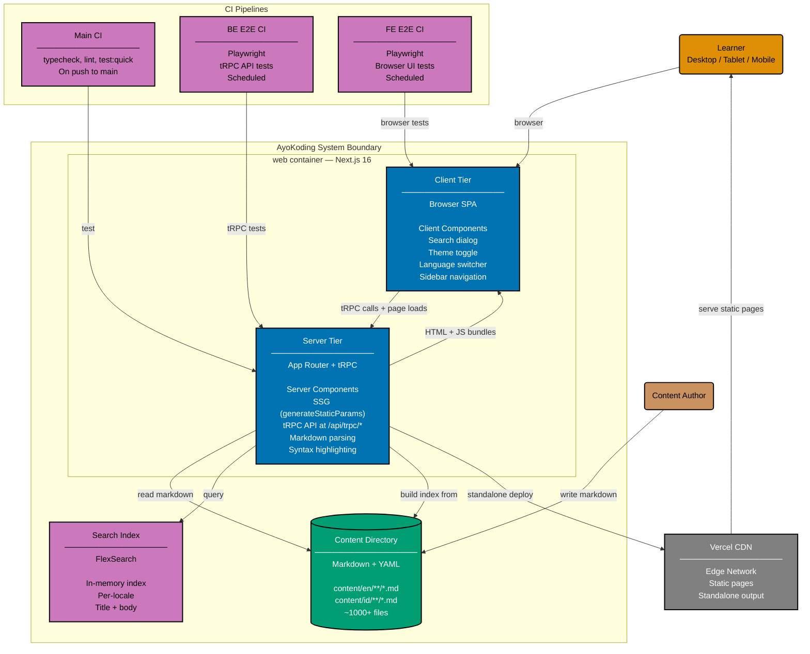

# Container Diagram: AyoKoding Web

Level 2 of the C4 model. Shows the runtime containers inside the AyoKoding system boundary.

## One deployable container

AyoKoding ships **one deployable container**: `web`. This is a single Next.js 16 application that
serves both server-rendered HTML pages (App Router) and the tRPC HTTP API at `/api/trpc/*`.
The Next.js server and the in-browser client are two runtime tiers of the **same** container —
not two containers — because they ship as one Vercel deployment unit.

## Slug-vs-container distinction

The Gherkin behavior tree splits along **API perspective**, not deployable-container boundary:

- `behavior/web/gherkin/` — UI-semantic scenarios (DOM, navigation, accessibility, locale switcher).
- `behavior/api/gherkin/` — tRPC HTTP-semantic scenarios (procedure shapes, error codes,
  locale-scoped responses).

The slug `api` is a **perspective slug**, not a container. There is no separate API container —
tRPC procedures execute inside the same `web` container's Next.js server. The slug exists so
specs can talk about API contract behavior without conflating it with UI behavior.

`organiclever` keeps the legacy slug `be` because `organiclever-be` is a real F#/Giraffe
container. AyoKoding does not have one and never will under the current architecture.

## Out-of-scope legacy slugs

Two `specs/apps/ayokoding/` paths are preserved unchanged in the current spec reshape:

- `cli/gherkin/` — owned by the separate `ayokoding-cli` deployable (Go binary).
- `build-tools/gherkin/` — owned by build-time index-generation scripts (not deployed).

Neither is part of the `web` container. They are documented here only to establish the
boundary; their migration to the five-folder spec format is a separate plan if/when those
deployables grow into independent spec trees.

## Container Details

### web container — Next.js 16

A single Next.js 16 deployment with two runtime tiers and two perspective slugs.

**Server tier** handles:

- **tRPC API** (`/api/trpc/[trpc]`): Procedures for content retrieval, search, navigation,
  i18n, and health.
- **Server Components**: Pages statically generated at build time via `generateStaticParams`.
- **Content pipeline**: gray-matter → unified (remark/rehype) → HTML with syntax highlighting
  (shiki).
- **Search index**: FlexSearch built from all content metadata at startup.

**Client tier** provides:

- **Search dialog**: Full-text search via tRPC call to server-side FlexSearch.
- **Language switcher**: Toggle between EN/ID locales.
- **Theme toggle**: Dark/light mode.
- **Sidebar navigation**: Hierarchical content tree with collapsible sections.
- **Content rendering**: Markdown HTML with code blocks, Mermaid diagrams, callouts.

### Content Directory

- ~1000+ markdown files with YAML frontmatter.
- Organized by locale (`en/`, `id/`) and topic hierarchy.
- Section pages use `_index.md` convention.
- Frontmatter: title, weight, date, description, tags, draft.

## Related

- **Context diagram**: [../system-context/context.md](../system-context/context.md)
- **API perspective component diagram**: [../components/api/component-api.md](../components/api/component-api.md)
- **Web perspective component diagram**: [../components/web/component-web.md](../components/web/component-web.md)
- **Parent**: [ayokoding-web specs](../README.md)
