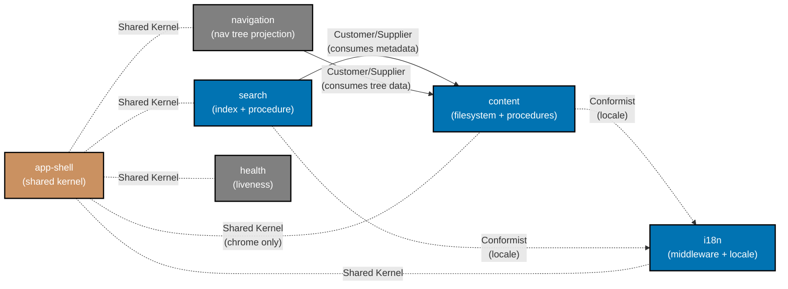

# Bounded-Context Map — ayokoding-web

**Audience:** Engineers, Technical Product/Project Managers

**Authority**: This document is the source of truth for bounded-context boundaries inside
`apps/ayokoding-web`. It complements (does not replace) the platform-wide
[DDD Standards](../../../../docs/explanation/software-engineering/architecture/domain-driven-design-ddd/README.md).

## Summary

`ayokoding-web` is one Nx app holding six bounded contexts. Three own application + infrastructure

- presentation (`content`, `search`, `i18n`); two own application + presentation (`navigation`,
  plus `app-shell` which has presentation only); one is application-only (`health`).
  Cross-context dependencies are explicit and flow only through each context's
  `application/index.ts` — never through `infrastructure/` or `presentation/`.

## Contexts

| Context      | Persistence / IO                                         | Owns                                                                         | Depends on                                       |
| ------------ | -------------------------------------------------------- | ---------------------------------------------------------------------------- | ------------------------------------------------ |
| `app-shell`  | None — pure presentation chrome                          | Header, footer, responsive layout, accessibility wiring, theme toggle        | All contexts (consumed by, but does not call in) |
| `content`    | Filesystem (markdown + frontmatter); in-memory cache     | tRPC content procedures (`getBySlug`, `listChildren`), DTOs, render pipeline | `i18n` (locale parameter)                        |
| `search`     | In-memory FlexSearch index (built from content metadata) | tRPC search procedure (`query`), index, results dropdown                     | `content` (index source), `i18n` (locale)        |
| `i18n`       | Translation files (filesystem); Next.js middleware       | Locale negotiation, middleware, translation lookup, locale switcher UI       | —                                                |
| `navigation` | None — derived from content tree                         | tRPC navigation procedure (`getTree`), nav tree projection, sidebar UI       | `content` (tree data)                            |
| `health`     | None — pure liveness probe                               | tRPC health procedure (`health`)                                             | —                                                |

### Strategic relationships

- `search` → `content` — **Customer/Supplier**. Search consumes content metadata to build its
  index; content publishes the metadata it produces.
- `navigation` → `content` — **Customer/Supplier**. Navigation derives the nav tree from
  content's filesystem hierarchy.
- `content` → `i18n` — **Conformist (downstream)**. Content procedures accept a `locale`
  parameter shaped by `i18n` and use it to scope filesystem reads. Content does not own the
  locale concept.
- `search` → `i18n` — **Conformist (downstream)**. Search procedures accept a `locale` and
  scope index queries to it.
- `app-shell` ↔ all contexts — **Shared Kernel** for layout primitives only. App-shell never
  imports a context's `application/` or `infrastructure/`. Domain contexts never import
  app-shell either.
- `health` — **Independent**. No cross-context coupling.

### Diagram

Legend:

- **Blue** — bounded contexts with infrastructure (filesystem, in-memory index, middleware).
- **Brown** — shared-kernel context (`app-shell`) — owns no domain logic, supplies cross-cutting
  presentation chrome.
- **Gray** — application-only / independent (`navigation`, `health`).
- **Solid arrow** — runtime dependency (caller → callee through `application/index.ts`).
- **Dotted arrow** — conformist relationship (downstream BC accepts upstream's shape).
- **Dotted line** — shared-kernel relationship (chrome only — no application or infrastructure).

## Layer subset rule (Choice B2)

Six BCs declare layer subsets honestly:

- `app-shell` — `[presentation]` only.
- `content`, `search`, `i18n` — full `[application, infrastructure, presentation]` (real
  procedures, real adapters, real UI).
- `navigation` — `[application, presentation]` (the nav tree is computed but there is no
  separate infrastructure beyond what content already exposes).
- `health` — `[application]` only (no UI, no persistence).

`bcregistry/validator.go` enforces the subset on `src/contexts/<bc>/`.

## Multi-perspective gherkin: workaround (registry limitation)

Today's `bcregistry/Context.Gherkin` is a single string. Four BCs span both perspectives
(`content`, `search`, `i18n`, `navigation` each have web-side AND api-side feature files).
The registry can only point at one path.

Workaround applied here: register multi-perspective BCs as
`gherkin: behavior/web/gherkin/<bc>`. This satisfies `ddd bc`'s "directory exists with ≥1
.feature" check using the web side. The api-side feature files (`content-api.feature`,
`search-api.feature`, `i18n-api.feature`, `navigation-api.feature`) live under
`behavior/api/gherkin/<bc>/` but are not validated by `ddd bc` for that BC's `gherkin:` field.

Coverage on the api side is preserved by the `spec-coverage` Nx target (added in Phase 7),
which runs against `behavior/api/gherkin/` independently. Plan
[`bdd-ddd-tooling-gap-fill`](../../../../plans/in-progress/bdd-ddd-tooling-gap-fill/README.md)
fix #11 (`gherkin: []string` schema extension) resolves this limitation properly; once it
ships, the registry can be updated to declare both perspectives' paths per multi-perspective BC.

## Related

- [DDD registry (`bounded-contexts.yaml`)](./bounded-contexts.yaml)
- [Ubiquitous-language glossaries (`ubiquitous-language/`)](./ubiquitous-language/README.md)
- [Behavior — Gherkin scenarios](../behavior/README.md)
- [Components (C4 L3)](../components/README.md)
