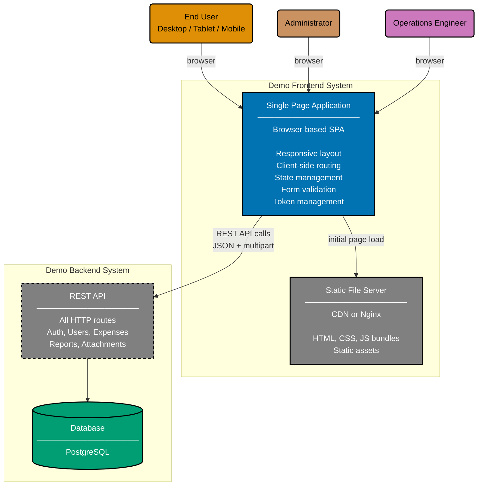

# Container Diagram: Demo Frontend

Level 2 of the C4 model. Shows the runtime containers inside the Demo Frontend system boundary and
how they interact with the Demo Backend.

The SPA runs entirely in the user's browser. Build artifacts are served by a static file server
(CDN, Nginx, or framework dev server). All API calls go to the Demo Backend REST API.

