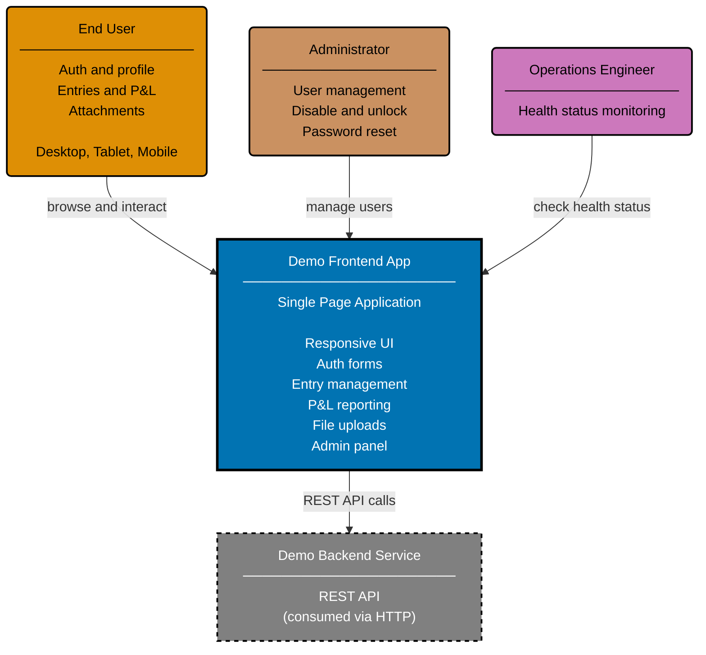

# Context Diagram: Demo Frontend

Level 1 of the C4 model. Shows the Demo Frontend system, the Demo Backend it consumes, and the
three external actors that interact with it.

```mermaid
%% Color Palette: Blue #0173B2 | Orange #DE8F05 | Teal #029E73 | Purple #CC78BC | Brown #CA9161 | Gray #808080
graph TD
    EU("End User<br/>──────────────────<br/>Auth and profile<br/>Entries and P&L<br/>Attachments<br/><br/>Desktop, Tablet, Mobile"):::actor

    ADM("Administrator<br/>──────────────────<br/>User management<br/>Disable and unlock<br/>Password reset"):::actor_admin

    OPS("Operations Engineer<br/>──────────────────<br/>Health status monitoring"):::actor_ops

    FRONTEND["Demo Frontend App<br/>──────────────────────<br/>Single Page Application<br/><br/>Responsive UI<br/>Auth forms<br/>Entry management<br/>P&L reporting<br/>File uploads<br/>Admin panel"]:::system

    BACKEND["Demo Backend Service<br/>──────────────────────<br/>REST API<br/>(consumed via HTTP)"]:::external

    EU -->|"browse and interact"| FRONTEND
    ADM -->|"manage users"| FRONTEND
    OPS -->|"check health status"| FRONTEND

    FRONTEND -->|"REST API calls"| BACKEND

    classDef actor fill:#DE8F05,stroke:#000000,color:#000000,stroke-width:2px
    classDef actor_admin fill:#CA9161,stroke:#000000,color:#000000,stroke-width:2px
    classDef actor_ops fill:#CC78BC,stroke:#000000,color:#000000,stroke-width:2px
    classDef system fill:#0173B2,stroke:#000000,color:#FFFFFF,stroke-width:3px
    classDef external fill:#808080,stroke:#000000,color:#FFFFFF,stroke-width:2px,stroke-dasharray:5 5
```
