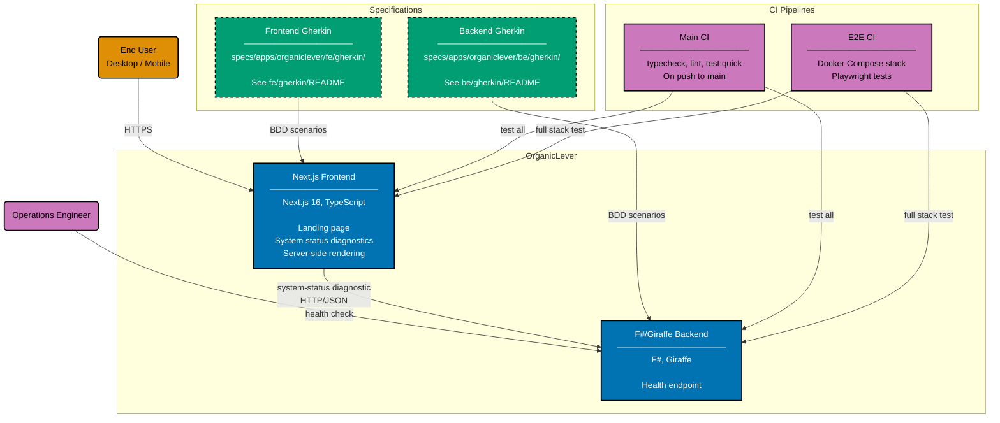

# Container Diagram: OrganicLever

Level 2 of the C4 model. Shows the runtime containers inside the OrganicLever system boundary:
the Next.js 16 frontend (landing site + system-status diagnostic page) and the F#/Giraffe backend
REST API (health endpoint only).

The frontend is a Next.js App Router application. v0 has no authenticated screens, no
client-side state machine, no remote sync — every productivity-tracking feature in the v0
storyboard lives in the user's browser via `localStorage`. The backend exposes only the health
endpoint; future work will add the productivity-tracking API surface.

## Container Implementations

### Backend

| App             | Language | Framework | Database | Coverage |
| --------------- | -------- | --------- | -------- | -------- |
| organiclever-be | F#       | Giraffe   | none     | >= 90%   |

### Frontend

| App              | Language   | Framework  | Coverage |
| ---------------- | ---------- | ---------- | -------- |
| organiclever-web | TypeScript | Next.js 16 | >= 70%   |

## Related

- **Context diagram**: [context.md](./context.md)
- **Backend component diagram**: [component-be.md](./component-be.md)
- **Frontend component diagram**: [component-fe.md](./component-fe.md)
- **Parent**: [organiclever specs](../README.md)
