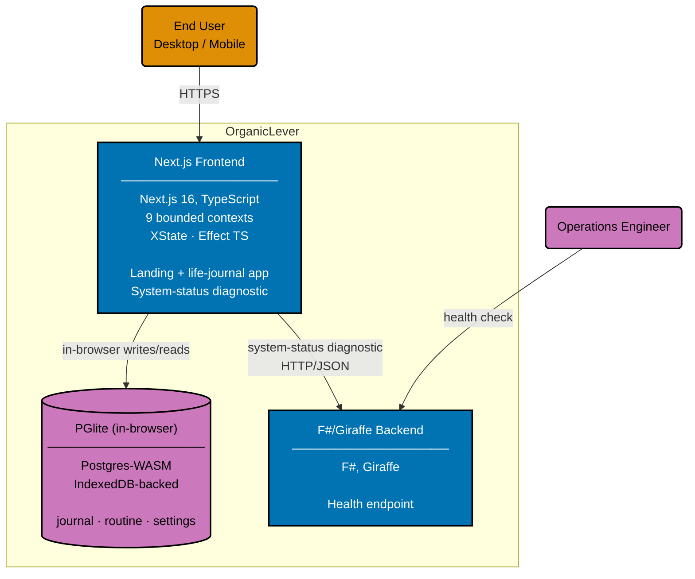

# Container Diagram: OrganicLever

Level 2 of the C4 model. Shows the runtime containers inside the OrganicLever system boundary:
the Next.js 16 frontend (landing site + life-journal app + system-status diagnostic page) and
the F#/Giraffe backend REST API (health endpoint only in v0).

The frontend is a Next.js App Router application structured around DDD bounded contexts. v0 has
no authenticated screens and no remote sync — productivity-tracking data lives in the user's
browser via PGlite (Postgres-WASM, IndexedDB-backed). UI state machines run via XState
(`appMachine` for the navigation shell, `journalMachine` for event-log writes,
`workoutSessionMachine` for active workouts). Effect TS is used in the infrastructure layer to
sequence PGlite operations and the dormant backend-client code. The backend exposes only the
health endpoint; future work will add the productivity-tracking API surface.

## Specifications and CI Pipelines

The Gherkin specs and CI pipelines are not rendered in this diagram (each container is exercised
by both, so adding them would clutter the rank without adding signal). Their wiring:

- **Backend Gherkin** (`specs/apps/organiclever/be/gherkin/`) feeds `organiclever-be` BDD
  scenarios at the `test:unit` and `test:integration` levels.
- **Frontend Gherkin** (`specs/apps/organiclever/web/gherkin/`) feeds `organiclever-web` BDD
  scenarios at the `test:unit` level (organized by bounded context, with `vitest-cucumber`) and
  `organiclever-web-e2e` Playwright scenarios at the `test:e2e` level.
- **DDD enforcement** (`specs/apps/organiclever/ddd/`) is validated by `rhino-cli ddd bc` and
  `rhino-cli ddd ul`, both run as part of `test:quick` for `organiclever-web`.
- **Main CI** runs `typecheck`, `lint`, `test:quick` on push to `main` for both containers.
- **E2E CI** runs the full Docker Compose stack on a twice-daily cron.

## Container Implementations

### Backend

| App             | Language | Framework | Database | Coverage |
| --------------- | -------- | --------- | -------- | -------- |
| organiclever-be | F#       | Giraffe   | none     | >= 90%   |

### Frontend

| App              | Language   | Framework  | Coverage |
| ---------------- | ---------- | ---------- | -------- |
| organiclever-web | TypeScript | Next.js 16 | >= 70%   |

## Related

- **Context diagram**: [context.md](./context.md)
- **Backend component diagram**: [component-be.md](./component-be.md)
- **Frontend component diagram**: [component-fe.md](./component-fe.md)
- **Parent**: [organiclever specs](../README.md)
