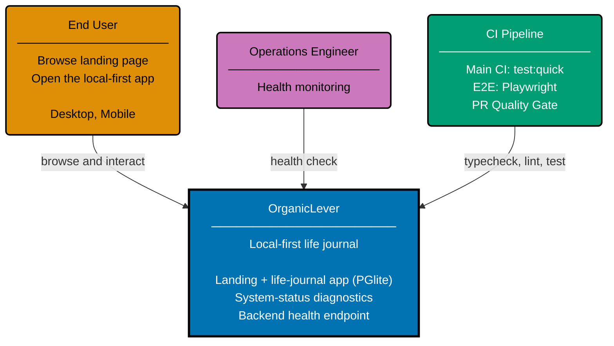

# Context Diagram: OrganicLever

Level 1 of the C4 model. Shows the OrganicLever system as a single boundary with two external
actors. The system contains both the Next.js frontend — a local-first life-journal app
(workout, reading, learning, meal, focus tracking) backed by in-browser PGlite storage — and
the F#/Giraffe backend REST API (health endpoint only in v0; productivity API surface deferred).
v0 has no authenticated screens.

The `specs/apps/organiclever/{be,web}/gherkin/` Gherkin features feed both the Main CI gate
(`test:quick`) and the cron-scheduled E2E pipeline. They are not modeled as a separate actor in
this diagram; see the [Container](./container.md) diagram for spec-to-container wiring.

## Related

- **Container diagram**: [container.md](./container.md)
- **Backend component diagram**: [component-be.md](./component-be.md)
- **Frontend component diagram**: [component-fe.md](./component-fe.md)
- **Parent**: [organiclever specs](../README.md)
