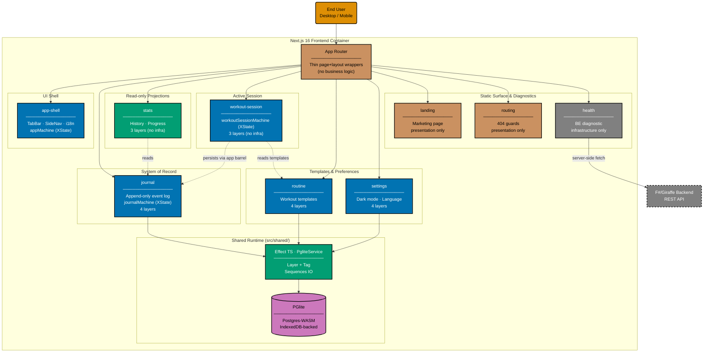

# Component Diagram: Next.js Frontend

Level 3 of the C4 model. Shows the logical components inside the Next.js 16 frontend container.
No authenticated screens today. The frontend is structured around 9 DDD bounded contexts
(`src/contexts/<bc>/{domain,application,infrastructure,presentation}`), with PGlite
(Postgres-WASM, IndexedDB-backed) as the local-first system of record.

## Routes

| Route                 | Owning context(s)   | Notes                            |
| --------------------- | ------------------- | -------------------------------- |
| `/`                   | landing             | Marketing page                   |
| `/app`                | (redirect)          | 308 → `/app/home`                |
| `/app/home`           | app-shell, journal  | Dashboard + quick-log FAB        |
| `/app/history`        | app-shell, stats    | Chronological entry log          |
| `/app/progress`       | app-shell, stats    | Charts and streaks               |
| `/app/settings`       | app-shell, settings | Theme, language, data export     |
| `/app/workout`        | workout-session     | Active workout (TabBar hidden)   |
| `/app/workout/finish` | workout-session     | Post-workout summary             |
| `/app/routines/edit`  | routine             | Routine editor                   |
| `/system/status/be`   | health              | Backend probe (`force-dynamic`)  |
| `/login`, `/profile`  | routing             | 404 stubs (auth not yet shipped) |

## Component Architecture

**Layer rules** (enforced by ESLint `boundaries` at error severity, plus `rhino-cli ddd bc`):

- `domain` ← no project imports
- `application` ← `domain` only
- `infrastructure` ← `domain` + `application` + `@/shared/runtime`
- `presentation` ← `domain` + `application`
- Cross-context: only via the target context's `application/index.ts` or `presentation/index.ts` barrel

## Gherkin Coverage by Bounded Context

Each bounded context owns its Gherkin features under
[`specs/apps/organiclever/behavior/web/gherkin/<bc>/`](../../behavior/web/gherkin/README.md):

| Bounded Context | Features                                       | Count  |
| --------------- | ---------------------------------------------- | ------ |
| app-shell       | `accessibility`, `entry-loggers`, `navigation` | 3      |
| health          | `system-status-be`                             | 1      |
| journal         | `home-screen`, `journal-mechanism`             | 2      |
| landing         | `landing`                                      | 1      |
| routine         | `routine-management`                           | 1      |
| routing         | `app-routes`, `disabled-routes`                | 2      |
| settings        | `dark-mode`, `language`, `settings-screen`     | 3      |
| stats           | `history-screen`, `progress-screen`            | 2      |
| workout-session | `workout-session`                              | 1      |
| **Total**       |                                                | **16** |

## DDD Enforcement

Two `rhino-cli ddd` subcommands run automatically as part of `test:quick`:

- **`rhino-cli ddd bc organiclever`** — verifies every context's `code:`, `glossary:`, and
  `gherkin:` paths exist with the declared layer subfolders, no orphans, relationship symmetry.
- **`rhino-cli ddd ul organiclever`** — verifies every glossary file is well-formed, code
  identifiers in backticks resolve in the BC code path, feature references resolve to real
  `.feature` files, and term collisions across glossaries carry mutual `Forbidden-synonyms`
  cross-links.

Source of truth: [`specs/apps/organiclever/ddd/bounded-contexts.yaml`](../../ddd/bounded-contexts.yaml).

## Testing

| Level              | What                                                 | Coverage |
| ------------------ | ---------------------------------------------------- | -------- |
| `test:unit`        | Per-context steps via `vitest-cucumber`              | >= 70%   |
| `test:integration` | Real filesystem via tmpdir fixtures                  | N/A      |
| `test:e2e`         | Full browser via Playwright (`organiclever-web-e2e`) | N/A      |

## Related

- **Container diagram**: [container.md](../../containers/container.md)
- **Backend component diagram**: [component-be.md](../be/component-be.md)
- **Frontend bounded-context map**: [`ddd/bounded-context-map.md`](../../ddd/bounded-context-map.md)
- **DDD registry**: [`ddd/`](../../ddd/README.md)
- **Frontend gherkin specs**: [`behavior/web/gherkin/`](../../behavior/web/gherkin/README.md)
- **Parent**: [organiclever specs](../../README.md)
