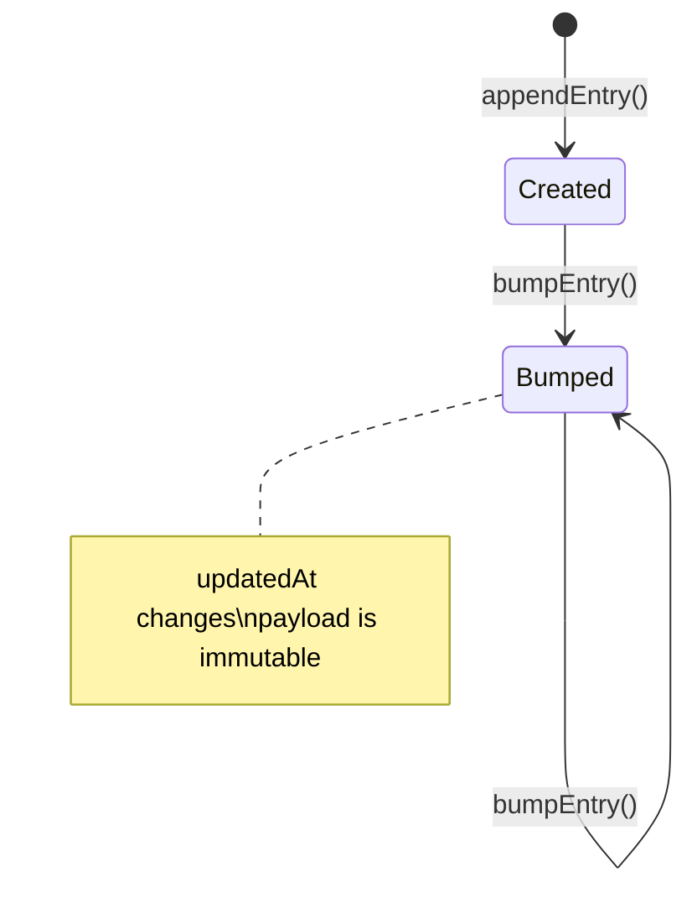
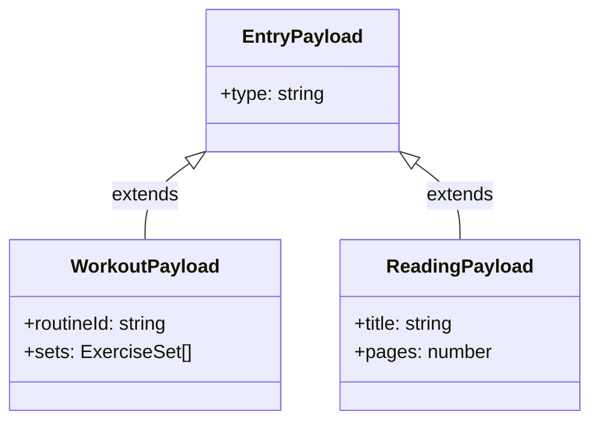

# Ubiquitous Language — journal

**Bounded context**: `journal`
**Maintainer**: organiclever-web team
**Last reviewed**: 2026-05-09
**Audience:** Engineers, Technical Product/Project Managers

## One-line summary

Append-only event log (PGlite-backed) that is the system of record for everything the user
did — workout, reading, learning, meal, focus — modelled as typed payloads on `JournalEvent`
rows.

## Term index

| Term                 | Code identifier(s)                                      | Used in features                                                   |
| -------------------- | ------------------------------------------------------- | ------------------------------------------------------------------ |
| `JournalEvent`       | `JournalEvent` (TS type)                                | `journal/journal-mechanism.feature`                                |
| `Typed payload`      | `EntryPayload`, `WorkoutPayload`, `ReadingPayload`      | `journal/journal-mechanism.feature`                                |
| `Append`             | `appendEntries` (use-case fn)                           | `journal/journal-mechanism.feature`                                |
| `Bump`               | `bumpEntry` (use-case fn)                               | `journal/journal-mechanism.feature`                                |
| `Entry list`         | `listEntries` (use-case fn)                             | `journal/journal-mechanism.feature`, `journal/home-screen.feature` |
| `Empty state`        | `JournalList` (component)                               | `journal/journal-mechanism.feature`                                |
| `Edited line`        | `EntryCard` (component)                                 | `journal/journal-mechanism.feature`                                |
| `Relative timestamp` | `formatRelativeTime` (helper, lives in `shared/utils/`) | `journal/journal-mechanism.feature`                                |

## Terms in detail

### Term: `JournalEvent`

A single, append-only record of something the user did. Carries a typed payload (workout,
reading, etc.), a creation timestamp (`createdAt`), and — after a bump — an updated
timestamp (`updatedAt`). The domain record schema type is `JournalEntry` in
`domain/schema.ts`; "JournalEvent" is the ubiquitous-language name for the same concept.
The XState machine event union also uses `JournalEvent` as a TypeScript type name — that
is an application-layer coincidence, not the domain record.

**Diagram**: The diagram below shows the two states a `JournalEvent` record moves through
after creation: the initial append lands as `Created`, and any subsequent bump transitions
it to `Bumped` where only `updatedAt` changes.

**Code identifier(s)**:
`JournalEntry` — the persistent domain record
(`apps/organiclever-web/src/contexts/journal/domain/schema.ts`).
`JournalEvent` — the XState machine event union
(`apps/organiclever-web/src/contexts/journal/application/journal-machine.ts`).

**Persisted as**: One row in the PGlite `journal_entries` table. Written via
`appendEntries`, re-ordered via `bumpEntry`.

**Used in features**: `journal/journal-mechanism.feature`

**Forbidden synonyms in this context**: "entry" (leaks UI vocabulary); "log entry" (too
generic across bounded contexts); "activity record" (a `stats` term).

**Related**: `Typed payload`, `Append`, `Bump`, `Entry list`

---

### Term: `Typed payload`

The structured body attached to a `JournalEvent`. Each payload type captures
domain-specific data for one user-action category. Payload type is determined at append
time and is immutable after that — a `Bump` only changes `updatedAt`. New payload types
are added to the `typed-payloads` schema module without touching existing records.

**Diagram**: The diagram below shows the payload type hierarchy. All concrete types
extend the common `EntryPayload` discriminated union via the `type` field; two concrete
types ship in v0.

**Code identifier(s)**:
`EntryPayload` — discriminated union base
(`apps/organiclever-web/src/contexts/journal/domain/typed-payloads.ts`).
`WorkoutPayload` — workout-session outcome (same file).
`ReadingPayload` — reading-session outcome (same file).

**Persisted as**: JSON-encoded in the `payload` column of `journal_entries`.

**Used in features**: `journal/journal-mechanism.feature`

**Forbidden synonyms in this context**: "event type" (too vague); "data" (no type
information); "payload type" (reverses word order from domain vocabulary).

**Related**: `JournalEvent`, `Append`

---

### Term: `Append`

The only write operation on the journal. Adds one or more new `JournalEvent` records;
never replaces, updates, or deletes an existing one. The append-only invariant preserves
full history and enables projection-based `stats`. Callers supply an `EntryPayload`;
`appendEntries` handles ID generation, timestamp, and PGlite persistence via Effect TS.

**Code identifier(s)**:
`appendEntries` — Effect-based use-case function
(`apps/organiclever-web/src/contexts/journal/application/index.ts`).

**Used in features**: `journal/journal-mechanism.feature`

**Forbidden synonyms in this context**: "create entry" (implies CRUD — the journal is
not mutable); "write" (too file-system); "save" (implies edit-save round-trip).

**Related**: `JournalEvent`, `Typed payload`, `Bump`

---

### Term: `Bump`

Re-touch an existing `JournalEvent` by updating its `updatedAt` to now, which moves it
to the top of the `Entry list`. The payload is never changed by a bump. Bump communicates
"I did this again just now" without creating a duplicate record. It is distinct from
Append (no new row) and from any notion of edit (content is immutable).

**Code identifier(s)**:
`bumpEntry` — Effect-based use-case function
(`apps/organiclever-web/src/contexts/journal/application/index.ts`).

**Used in features**: `journal/journal-mechanism.feature`

**Forbidden synonyms in this context**: "update" (implies payload mutation); "edit"
(implies content change); "refresh" (network connotation).

**Related**: `JournalEvent`, `Edited line`, `Append`

---

### Term: `Entry list`

The ordered, descending-by-`updatedAt` view over a user's `JournalEvent`s. May be
filtered by type or date range. Derived from PGlite on each read — there is no materialized
list. Consumed by the home screen (recent entries) and history screen (full log).

**Code identifier(s)**:
`listEntries` — Effect-based use-case function
(`apps/organiclever-web/src/contexts/journal/application/index.ts`).

**Used in features**: `journal/journal-mechanism.feature`, `journal/home-screen.feature`

**Forbidden synonyms in this context**: "feed" (social-media connotation); "activity log"
(a `stats` aggregate concept).

**Related**: `JournalEvent`, `Empty state`

---

### Term: `Empty state`

The journal projection when no `JournalEvent`s exist yet for the current user. The
`JournalList` component renders a dedicated empty-state UI (call-to-action to log a first
entry) rather than an empty list. It is a presentation-layer concern; the domain simply
returns an empty array from `listEntries`.

**Code identifier(s)**:
`JournalList` — the React component that owns the empty-state branch
(`apps/organiclever-web/src/contexts/journal/presentation/components/journal-list.tsx`).

**Used in features**: `journal/journal-mechanism.feature`

**Forbidden synonyms in this context**: "no results" (implies a search/filter miss);
"loading state" (a distinct UI phase before data arrives).

**Related**: `Entry list`

---

### Term: `Edited line`

A subtle visual indicator rendered beneath a journal entry card when the entry was bumped
after creation — communicating "you revisited this" without surfacing raw timestamps.
Appears only when `createdAt ≠ updatedAt`. It is a pure presentation detail; the domain
only stores timestamps.

**Code identifier(s)**:
`EntryCard` — the React component that renders the bump indicator
(`apps/organiclever-web/src/contexts/journal/presentation/components/entry-card.tsx`).

**Used in features**: `journal/journal-mechanism.feature`

**Forbidden synonyms in this context**: "last edited" (implies content edit, not a bump);
"modified badge" (too prominent — the indicator is intentionally subtle).

**Related**: `Bump`, `JournalEvent`

---

### Term: `Relative timestamp`

A human-friendly duration string rendered next to a `JournalEvent` to indicate how long
ago it was created or bumped: "just now", "3m ago", "2h ago". Derived from `updatedAt`
versus the current clock. English-only in v0. Lives in `shared/utils/` because it has
no journal-domain dependency — it is a pure formatting function reusable across contexts.

**Code identifier(s)**:
`formatRelativeTime` — pure helper function
(`apps/organiclever-web/src/shared/utils/format-relative-time.ts`).

**Used in features**: `journal/journal-mechanism.feature`

**Forbidden synonyms in this context**: "time ago" (implementation-flavoured); "timestamp
label" (too abstract).

**Related**: `JournalEvent`, `Entry list`

---

## Forbidden synonyms

- "Aggregate" — used by `stats` to mean a derived rollup. Inside `journal`, prefer
  "event" or "record".
