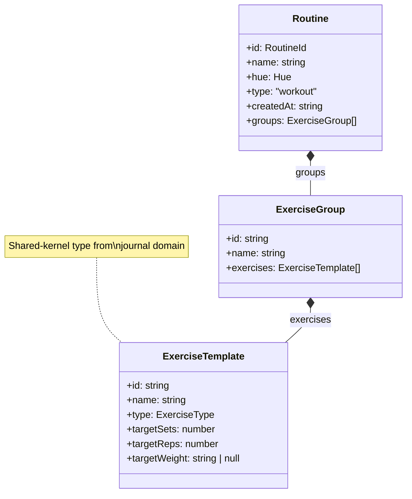

# Ubiquitous Language — routine

**Bounded context**: `routine`
**Maintainer**: organiclever-web team
**Last reviewed**: 2026-05-09
**Audience:** Engineers, Technical Product/Project Managers

## One-line summary

Reusable workout templates the user authors and runs — each `Routine` carries an ordered
list of `ExerciseGroup`s (labeled sets of `ExerciseTemplate`s), with default sets, reps,
and weights the user configured at authoring time.

## Term index

| Term                       | Code identifier(s)                                                      | Used in features                     |
| -------------------------- | ----------------------------------------------------------------------- | ------------------------------------ |
| `Routine`                  | `Routine` (TS type)                                                     | `routine/routine-management.feature` |
| `RoutineExercise`          | `ExerciseGroup` (TS type), `ExerciseTemplate` (TS type, journal domain) | `routine/routine-management.feature` |
| `Default sets/reps/weight` | `targetSets`, `targetReps`, `targetWeight` fields on `ExerciseTemplate` | `routine/routine-management.feature` |
| `Edit Routine`             | `EditRoutineScreen` (component), `routines/edit` (route segment)        | `routine/routine-management.feature` |
| `Routine list`             | `listRoutines` (use-case fn)                                            | `routine/routine-management.feature` |

## Terms in detail

### Term: `Routine`

A named, user-authored workout template. The aggregate root of the `routine` bounded
context. A `Routine` is identified by its `RoutineId`, carries a visual hue for display,
and contains an ordered list of `ExerciseGroup`s. A `Routine` is never executed directly;
it is the template handed off to the `workout-session` context when the user starts a
session.

**Diagram**: The diagram below shows the ownership structure of a `Routine`. A `Routine`
owns one or more `ExerciseGroup`s (named groupings like "Warm-up" or "Main Set"), each of
which owns one or more `ExerciseTemplate`s. `ExerciseTemplate` is a shared-kernel type
authored in the `journal` domain and referenced here by type-only import.

**Code identifier(s)**:
`Routine` — the aggregate root type
(`apps/organiclever-web/src/contexts/routine/domain/types.ts`).
`RoutineId` — branded string alias for `Routine.id` (same file).

**Persisted as**: One row per `Routine` in the PGlite `routines` table, with `groups`
JSON-encoded in the `groups` JSONB column.

**Used in features**: `routine/routine-management.feature`

**Forbidden synonyms in this context**: "Workout" (used by `workout-session` to mean an
active session, not a template); "Plan" (not a domain term in this product); "Template"
(too generic — the domain word is `Routine`).

**Related**: `RoutineExercise`, `Routine list`, `Edit Routine`

---

### Term: `RoutineExercise`

The domain name for the combination of `ExerciseGroup` (a labeled grouping of exercises
inside a `Routine`) and `ExerciseTemplate` (a single exercise entry carrying default
tracking parameters). In practice:

- **`ExerciseGroup`** is a named container (e.g., "Warm-up", "Main Set") holding one or
  more `ExerciseTemplate`s. A `Routine` has `groups: ExerciseGroup[]`.
- **`ExerciseTemplate`** (a shared-kernel type from the `journal` domain) is the
  individual exercise record: name, type (reps / duration / one-off), and all default
  targets.

The ubiquitous language uses `RoutineExercise` as the human-readable stand-in for this
two-level structure to avoid exposing the `ExerciseGroup` / `ExerciseTemplate` code split
in product and design conversations.

**Code identifier(s)**:
`ExerciseGroup` — the labeled grouping type
(`apps/organiclever-web/src/contexts/routine/domain/types.ts`).
`ExerciseTemplate` — the individual exercise schema (shared-kernel)
(`apps/organiclever-web/src/contexts/journal/domain/typed-payloads.ts`).

**Persisted as**: Serialized inside the `groups` JSONB column of the `routines` table.

**Used in features**: `routine/routine-management.feature`

**Forbidden synonyms in this context**: "Exercise" alone (ambiguous — always qualify as
`RoutineExercise` on the template side or `WorkoutExercise` on the session side, which is
owned by `workout-session`).

**Related**: `Routine`, `Default sets/reps/weight`

---

### Term: `Default sets/reps/weight`

The starting values a `RoutineExercise` carries for sets, reps, and weight. The
`workout-session` context reads these as initial suggestions when a workout begins; the
user may override them during the session without changing the `Routine`. Defaults are
stored on `ExerciseTemplate` fields: `targetSets`, `targetReps`, `targetWeight`.

**Code identifier(s)**:
`targetSets: number` — default set count on `ExerciseTemplate`.
`targetReps: number` — default rep count on `ExerciseTemplate`.
`targetWeight: string | null` — default weight (or null if unset) on `ExerciseTemplate`.
All three live in
`apps/organiclever-web/src/contexts/journal/domain/typed-payloads.ts`.

**Persisted as**: Part of the `ExerciseTemplate` objects nested inside `groups` JSONB.

**Used in features**: `routine/routine-management.feature`

**Forbidden synonyms in this context**: "Settings" (owned by the `settings` context);
"Config" (too broad — these are authoring-time exercise defaults, not app-level config).

**Related**: `RoutineExercise`, `Routine`

---

### Term: `Edit Routine`

The dedicated screen at `/app/routines/edit` where the user creates a new `Routine` or
modifies an existing one — naming it, choosing a hue, and adding, removing, or reordering
`ExerciseGroup`s and `ExerciseTemplate`s. Uses `saveRoutine` (upsert) under the hood.
This is a presentation-layer concept; the domain only knows `saveRoutine` and
`deleteRoutine`.

**Code identifier(s)**:
`EditRoutineScreen` — the React component
(`apps/organiclever-web/src/contexts/routine/presentation/components/edit-routine-screen.tsx`).
`routines/edit` — the Next.js route segment
(`apps/organiclever-web/src/app/app/routines/edit/page.tsx`).
`saveRoutine` — the Effect-based use-case (upsert) invoked on save
(`apps/organiclever-web/src/contexts/routine/application/index.ts`).

**Used in features**: `routine/routine-management.feature`

**Forbidden synonyms in this context**: "Routine editor" (UI synonym, acceptable in
design docs but not in Gherkin steps — use "Edit Routine" to match the screen's canonical
name).

**Related**: `Routine`, `Routine list`

---

### Term: `Routine list`

The ordered collection of all `Routine`s persisted for the current user, retrieved via
`listRoutines`. Ordered by `createdAt ASC` in the database query (oldest first). Displayed
on the home screen and as a pre-session selection picker. Owned by the `routine` bounded
context; the `workout-session` context calls `listRoutines` cross-context via the
`application/index.ts` barrel when it needs to present the picker.

**Code identifier(s)**:
`listRoutines` — Effect-based use-case function returning
`ReadonlyArray<Routine>`
(`apps/organiclever-web/src/contexts/routine/application/index.ts`).

**Persisted as**: The PGlite `routines` table (all rows for the current user).

**Used in features**: `routine/routine-management.feature`

**Forbidden synonyms in this context**: "Workout list" (misleads toward active sessions);
"My routines" (informal — use `Routine list` in Gherkin steps).

**Related**: `Routine`, `Edit Routine`

---

## Forbidden synonyms

- "Workout" — `workout-session` owns the concept of an active in-progress session. Inside
  `routine`, prefer "routine" (the template).
- "Exercise" alone — always qualify as `RoutineExercise` (template-side) or
  `WorkoutExercise` (session-side, owned by `workout-session`).
- "Plan" — not a domain term in this product. Use `Routine`.
