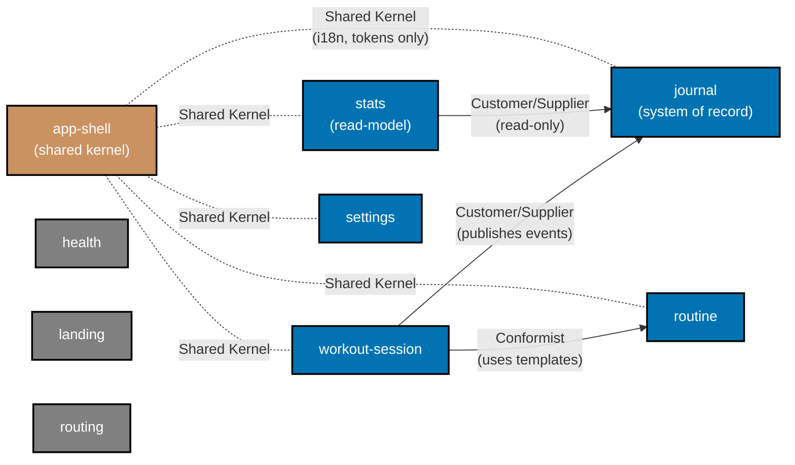

# Bounded-Context Map — organiclever-web

**Audience:** Engineers, Technical Product/Project Managers

**Status**: Complete. See the [DDD adoption plan](../../../../plans/done/2026-05-03__organiclever-adopt-ddd/README.md).
**Authority**: This document is the source of truth for bounded-context boundaries inside `apps/organiclever-web`. It complements (does not replace) the platform-wide [DDD Standards](../../../../docs/explanation/software-engineering/architecture/domain-driven-design-ddd/README.md).

## Summary

`organiclever-web` is one Nx app holding nine bounded contexts. Five own domain logic and persistence (`journal`, `routine`, `workout-session`, `stats`, `settings`); one is a shared kernel for cross-cutting UI concerns (`app-shell`); three are independent surfaces (`health`, `landing`, `routing`). Cross-context dependencies are explicit and flow only through each context's `application/index.ts` — never through `domain/`, `infrastructure/`, or `presentation/`.

## Contexts

| Context           | Persistence                                              | Owns                                                                                                   | Depends on                                         |
| ----------------- | -------------------------------------------------------- | ------------------------------------------------------------------------------------------------------ | -------------------------------------------------- |
| `journal`         | PGlite (Postgres-WASM over IndexedDB), append-only log   | `JournalEvent`, typed payloads, bump operation, event invariants                                       | —                                                  |
| `routine`         | PGlite                                                   | `Routine` template aggregate, exercises, defaults                                                      | —                                                  |
| `workout-session` | xstate v5 FSM, persists outcome through `journal`        | `WorkoutSession` aggregate, transitions (idle/active/finished), invariants ("can only end if started") | `journal` (publishes events), `routine` (consumes) |
| `stats`           | Read-model derived from `journal` (no own store)         | Aggregations, projections, period rollups                                                              | `journal` (read-only)                              |
| `settings`        | PGlite                                                   | Theme, locale, units, preference invariants                                                            | —                                                  |
| `app-shell`       | None (xstate v5 UI shell machine, in-memory)             | i18n, layout, theming primitives, app loggers, navigation skeleton, error boundaries                   | All contexts (consumed by, but does not call into) |
| `health`          | None — calls backend `GET /health` via Effect TS service | BE health-endpoint client, status interpretation                                                       | —                                                  |
| `landing`         | None                                                     | Marketing copy, hero, CTA components                                                                   | —                                                  |
| `routing`         | None                                                     | Disabled-route 404 guards (`/login`, `/profile`)                                                       | —                                                  |

### Strategic relationships

- `workout-session` → `journal` — **Customer/Supplier**. Session asks journal to record outcomes; journal publishes the event types that workout-session writes.
- `stats` → `journal` — **Customer/Supplier** (read-only). Stats derives projections from journal events; never writes back.
- `workout-session` → `routine` — **Conformist**. Session uses routine templates as supplied; never mutates them.
- `app-shell` ↔ all five domain contexts — **Shared Kernel** for i18n keys and design tokens only. App-shell never imports a domain context's `domain/`, `application/`, or `infrastructure/`. Domain contexts never import app-shell either.
- `health`, `landing`, `routing` — **Independent**. No cross-context import in either direction.

### Diagram



Legend:

- **Blue** — domain-owning bounded contexts (own aggregates, invariants, persistence).
- **Brown** — shared-kernel context (`app-shell`) — owns no domain entities, supplies cross-cutting primitives.
- **Gray** — independent surfaces (no cross-context coupling).
- **Solid arrow** — runtime dependency (caller → callee through `application/index.ts`).
- **Dotted line** — shared-kernel relationship (i18n keys, design tokens only — no domain types).

## Cross-check: existing modules → contexts

Every file currently under `src/lib/`, `src/services/`, `src/layers/`, `src/components/`, and `src/app/**` lands in exactly one context. The mapping below is exhaustive — anything not listed is either codegen output (`generated-contracts/`, gitignored) or test infrastructure (`src/test/`, unchanged).

### journal

- `src/lib/journal/journal-store.ts` (+ `.unit.test.ts`, `.int.test.ts`) → `infrastructure/`
- `src/lib/journal/journal-machine.ts` (+ `.unit.test.ts`) → `application/` per [tech-docs § xstate machine placement](../../../../../../plans/done/2026-05-03__organiclever-adopt-ddd/tech-docs.md)
- `src/lib/journal/typed-payloads.ts` (+ `.unit.test.ts`) → `domain/`
- `src/lib/journal/types.ts` → `domain/`
- `src/lib/journal/errors.ts` → `domain/` (or `application/` if error types prove use-case-specific at migration time)
- `src/lib/journal/use-journal.ts` (+ `.unit.test.tsx`) → `presentation/`
- `src/lib/journal/run-migrations.ts` (+ `.unit.test.ts`) → `infrastructure/`
- `src/lib/journal/runtime.ts` (+ `.unit.test.ts`) → `infrastructure/`
- `src/lib/journal/seed.ts` → `infrastructure/`
- `src/lib/journal/schema.ts` (+ `.unit.test.ts`) → `infrastructure/`
- `src/lib/journal/migrations/` → `infrastructure/migrations/`
- `src/lib/journal/gen-migrations-filename.unit.test.ts` → `infrastructure/`
- `src/lib/journal/format-relative-time.ts` (+ `.unit.test.ts`) → `src/shared/utils/` (cross-cutting formatting utility, not journal-specific)
- `src/components/app/journal-list.tsx`, `journal-page.tsx`, `entry-card.tsx`, `add-entry-button.tsx`, `add-entry-sheet.tsx`, `entry-form-sheet.tsx` (+ tests) → `presentation/components/`
- Pages under `src/app/app/home/**` and `src/app/app/history/**` consuming journal → continue to live under `src/app/**`, importing only `journal/presentation/index.ts`

### routine

- `src/lib/journal/routine-store.ts` (+ `.unit.test.ts`) — currently misplaced under `journal/` → `infrastructure/`
- `src/lib/journal/use-routines.ts` (+ `.unit.test.tsx`) — currently misplaced under `journal/` → `presentation/`
- `src/components/app/routine/**` → `presentation/components/`
- `src/app/app/routines/**` — pages stay under `src/app/**`, import `routine/presentation/index.ts`

### workout-session

- `src/lib/workout/workout-machine.ts` (+ `.unit.test.ts`) → `application/` (orchestrating machine, invokes `fromPromise saveWorkout` → journal)
- `src/components/app/workout/**` → `presentation/components/`
- `src/app/app/workout/**` — pages stay under `src/app/**`, import `workout-session/presentation/index.ts`

### stats

- `src/lib/journal/stats.ts` (+ `.unit.test.ts`) — currently misplaced under `journal/` → `domain/` (pure projections) and `application/` (use-cases)
- `src/components/app/history/**` → `presentation/components/`
- `src/components/app/progress/**` → `presentation/components/`

### settings

- `src/lib/journal/settings-store.ts` (+ `.unit.test.ts`) — currently misplaced under `journal/` → `infrastructure/`
- `src/lib/journal/use-settings.ts` (+ `.unit.test.tsx`) — currently misplaced under `journal/` → `presentation/`
- `src/components/app/settings/**` → `presentation/components/`
- `src/app/app/settings/**` — pages stay under `src/app/**`, import `settings/presentation/index.ts`

### app-shell

- `src/lib/i18n/translations.ts` (+ `.unit.test.ts`) → `presentation/`
- `src/lib/i18n/use-t.ts` → `presentation/`
- `src/lib/app/app-machine.ts` (+ `.unit.test.ts`) → `presentation/` per [tech-docs § xstate machine placement](../../../../../../plans/done/2026-05-03__organiclever-adopt-ddd/tech-docs.md) — UI shell machine, no IO
- `src/components/app/app-runtime-context.tsx` → `presentation/`
- `src/components/app/tab-bar.tsx` (+ test) → `presentation/components/`
- `src/components/app/side-nav.tsx` (+ test) → `presentation/components/`
- `src/components/app/overlay-tree.tsx` → `presentation/components/`
- `src/components/app/loggers/**` → `presentation/components/loggers/`
- `src/components/app/home/**` page chrome → `presentation/components/home/` (chrome-only; data-bound parts stay with `journal`/`stats` as appropriate)
- `src/app/layout.tsx` extracted shell parts → `presentation/`

### health

- `src/services/backend-client.ts` → `infrastructure/`
- `src/services/errors.ts` → `infrastructure/` (BE-error types; consumed only by health for now)
- `src/layers/backend-client-live.ts` → `infrastructure/`
- `src/layers/backend-client-test.ts` → `infrastructure/`
- `src/app/system/**` (`/system/status/be` page) → page stays under `src/app/**`, imports `health/presentation/index.ts`

### landing

- `src/components/landing/**` (all seven files) → `presentation/components/`
- `src/app/page.tsx` content → page stays under `src/app/**`, imports `landing/presentation/index.ts`

### routing

- Any `not-found.tsx` and `/login` / `/profile` 404 guards under `src/app/**` → page stubs stay under `src/app/**`, importing `routing/presentation/index.ts` for the shared "disabled route" component

### shared/utils

- `src/lib/utils/fmt.ts` (+ `.unit.test.ts`) → `src/shared/utils/fmt.ts`
- `src/lib/journal/format-relative-time.ts` (+ `.unit.test.ts`) → `src/shared/utils/format-relative-time.ts`

### Out of scope for migration

- `src/generated-contracts/` — codegen output, gitignored, regenerated by `nx run organiclever-web:codegen`.
- `src/test/` — test infrastructure, unchanged.
- `src/app/globals.css`, `src/app/metadata.ts` — Next.js routing-entry concerns, stay under `src/app/`.

## Resolved open questions

- **Q1 — Should `app-shell` be a "supporting subdomain" or a "shared kernel"?**
  Resolution: **shared kernel**. `app-shell` exposes i18n keys and design tokens consumed by every domain context but defines no domain entities, no aggregates, no invariants. The shared-kernel label captures the read-only consumption pattern more precisely than "supporting subdomain". The diagram uses dotted lines to mark this asymmetry.
- **Q2 — Does `home/` need its own bounded context?**
  Resolution: **no**. `home` is presentation-only, aggregating views from `journal` (today's events), `stats` (rolling counters), and `app-shell` (page chrome). Home page content lives under `src/app/app/home/**` and imports `journal/presentation/index.ts` + `stats/presentation/index.ts` + `app-shell/presentation/index.ts`.
- **Q3 — Do we keep `src/components/` for purely presentational primitives (Button, Input)?**
  Resolution: **fold into `app-shell/presentation/components/`**. The shared UI primitives (`Button`, `Input`, etc.) actually live in `libs/ts-ui/` — `src/components/` only holds product-specific composites (TabBar, SideNav, AddEntryButton, EntryCard…). Those are presentational chrome owned by `app-shell` and contain no domain logic. Moving them under `app-shell/presentation/components/` preserves the chrome-vs-domain separation without inventing a new top-level folder.
- **Q4 — Does `journalMachine` graduate from a hybrid loader+orchestrator into a pure aggregate-lifecycle machine?**
  Resolution: **no, keep `journalMachine` in `application/`** as the orchestrating machine that invokes `fromPromise loadEntries` and `fromPromise performMutation`. Splitting it into a pure domain machine + a thin orchestrator costs more than it buys today, since there is no second consumer (BE) modelling the same lifecycle. Revisit only if `organiclever-be` adopts DDD with its own `journal` aggregate and the lifecycle starts diverging.

## Spec reorganization decisions

The Gherkin folder layout under `specs/apps/organiclever/behavior/web/gherkin/` is reorganized from per-route to per-bounded-context. The mapping below is the authority that Phase 9 executes mechanically.

| Current folder | Target folder                                          | Rationale                                                                                                 |
| -------------- | ------------------------------------------------------ | --------------------------------------------------------------------------------------------------------- |
| `app-shell/`   | `app-shell/`                                           | Already context-aligned. Keep.                                                                            |
| `health/`      | `health/`                                              | Already context-aligned. Keep.                                                                            |
| `home/`        | Split: scenarios touching today's events → `journal/`; | `home` is a route, not a context. Each scenario already maps to journal data or to page chrome.           |
|                | scenarios touching page chrome → `app-shell/`          |                                                                                                           |
| `history/`     | `stats/`                                               | History is a stats projection over journal events. Route name disappears; context name takes over.        |
| `journal/`     | `journal/`                                             | Already context-aligned. Keep.                                                                            |
| `landing/`     | `landing/`                                             | Already context-aligned. Keep.                                                                            |
| `layout/`      | `app-shell/`                                           | Layout is shared-kernel chrome.                                                                           |
| `loggers/`     | `app-shell/`                                           | Loggers are app-shell concerns (cross-cutting log surfaces).                                              |
| `progress/`    | `stats/`                                               | Progress charts are stats projections, same family as history.                                            |
| `routine/`     | `routine/`                                             | Already context-aligned. Keep.                                                                            |
| `routing/`     | `routing/`                                             | Already context-aligned. Keep.                                                                            |
| `settings/`    | `settings/`                                            | Already context-aligned. Keep.                                                                            |
| `system/`      | `health/`                                              | `/system/status/be` is the only page; it is a health-context surface. The route name "system" is dropped. |
| `workout/`     | `workout-session/`                                     | Context name is `workout-session` (FSM-aware) rather than the route segment `workout`.                    |

After Phase 9 the target tree is:

```text
specs/apps/organiclever/behavior/web/gherkin/
├── README.md
├── app-shell/         # accessibility, i18n, layout, loggers
├── health/            # backend-health diagnostic page (absorbs old system/)
├── journal/           # journal mechanism, bump, today's events from old home/
├── landing/           # marketing landing
├── routine/           # routine CRUD
├── routing/           # disabled-route guards
├── settings/          # preferences
├── stats/             # progress + history projections
└── workout-session/   # workout FSM scenarios
```

`home/`, `history/`, `progress/`, `system/`, `loggers/`, `layout/` no longer exist as folders. Phase 9 splits `home/` per scenario; the others move wholesale.

## Layer rules (recap)

The full ESLint boundaries config lives in [tech-docs.md § ESLint boundaries](../../../../../../plans/done/2026-05-03__organiclever-adopt-ddd/tech-docs.md). Inward dependency direction:

```text
src/app/**
   └── may import → presentation/index.ts (any context), shared/**
                            │
                            ▼
                    presentation/
                       └── may import → own application/, own domain/ (read-only types), other contexts' presentation/index.ts, shared/**
                            │
                            ▼
                    application/
                       └── may import → own domain/, own infrastructure/ (port interfaces), other contexts' application/index.ts, shared/**
                            │
                            ▼
                    domain/  ←  infrastructure/
                                 └── may import → own domain/, own application/ (port interfaces), shared/**
```

`domain/` is the innermost layer — it imports only its own domain files and `shared/`.

## Enforcement

**Severity: ESLint boundaries (`boundaries/element-types`) at `error` severity** as of Phase 8 of the [DDD adoption plan](../../../../../../plans/done/2026-05-03__organiclever-adopt-ddd/delivery.md). Any forbidden cross-layer or cross-context import fails `nx run organiclever-web:lint` and blocks the pre-push hook + CI.

### Why a separate eslint pass alongside oxlint?

oxlint does not implement `eslint-plugin-boundaries` (the closest rule it ships, `import/no-cycle`, only catches cycles, not directional layer/context boundaries). Replacing oxlint with eslint repo-wide would force re-implementing every oxlint rule under eslint and slow lint significantly. The narrow scope chosen here — eslint enabled only for `apps/organiclever-web` and only for the boundary rule — keeps oxlint authoritative for everything it covers and adds eslint as a focused sidecar.

### Element types and capture groups

The plugin classifies every source file by its physical path:

- `app` — `src/app/**` (Next.js App Router files)
- `shared` — `src/shared/**` (cross-context primitives)
- `domain` / `application` / `infrastructure` / `presentation` — `src/contexts/*/<layer>` (folder mode), capturing the bounded context name as `context`

The capture group lets rules distinguish **own-context layer crossings** (always allowed, e.g. presentation imports its own application/domain/infrastructure) from **cross-context coupling** (allowed only through published `application/` and `presentation/` barrels — and `domain/` for shared-kernel value types).

### Allowed dependency direction

| From layer       | May import                                                                                                                                       |
| ---------------- | ------------------------------------------------------------------------------------------------------------------------------------------------ |
| `app`            | `presentation`, `application`, `shared`                                                                                                          |
| `presentation`   | own-context (any layer), cross-context `presentation` and `application` barrels, `shared`                                                        |
| `application`    | own-context `domain`/`infrastructure`/`application`, cross-context `application` barrels, `shared`                                               |
| `infrastructure` | own-context `domain`/`application`/`infrastructure`, cross-context `domain` (shared-kernel value types like `Hue`, `ExerciseTemplate`), `shared` |
| `domain`         | own-context `domain`, cross-context `domain` (DDD shared kernel), `shared`                                                                       |
| `shared`         | `shared` only                                                                                                                                    |

### Cross-context coupling — the legitimate paths

- `app → presentation/application` (composition root): pages assemble views from many contexts.
- `presentation/application` → other contexts' `presentation`/`application` (consumer/supplier and shared-kernel UI).
- `infrastructure → @/shared/runtime` for the shared `PgliteService` Tag and `StorageUnavailable` / `NotFound` errors. The journal context owns the `PgliteLive` Layer (which runs the journal-schema migrations); routine and settings adapters borrow the published Tag through `shared/runtime` so the boundaries plugin sees `infrastructure → shared` (allowed) instead of cross-context `infrastructure → infrastructure` (forbidden).
- `infrastructure → cross-context domain` for shared-kernel value types (e.g. routine row mapping refers to `Hue` from journal's typed payloads).
- `app-shell/application/seed.ts` — the cross-context bootstrap that pre-populates journal entries, routine templates, and default settings on first launch. Lives in `app-shell/application/` because it is application-layer composition (cross-context `application → application` is the only legitimate cross-context path that crosses use-case boundaries).

### Resolver

`eslint-import-resolver-typescript` is wired via `settings.import/resolver.typescript.project = "./tsconfig.json"` so the `@/...` alias resolves to physical paths and the boundaries plugin classifies cross-context imports correctly. Without the resolver, alias-imported cross-context references would silently slip past the rule.

### Baseline counts (post-Phase 8)

- **Boundary errors**: **0** under severity `error`.
- **Boundary warnings**: **0**.
- **Other lint warnings**: 30 preexisting oxlint a11y warnings (label-has-associated-control, no-static-element-interactions, click-events-have-key-events) + 1 preexisting eslint `no-unused-disable-directive` warning in `workout-session/presentation/components/workout-screen.tsx`. None are boundary-related.

## Related

- [DDD adoption plan README](../../../../../../plans/done/2026-05-03__organiclever-adopt-ddd/README.md)
- [DDD adoption tech-docs](../../../../../../plans/done/2026-05-03__organiclever-adopt-ddd/tech-docs.md)
- [DDD adoption delivery checklist](../../../../../../plans/done/2026-05-03__organiclever-adopt-ddd/delivery.md)
- [DDD Standards (platform-wide)](../../../../../../docs/explanation/software-engineering/architecture/domain-driven-design-ddd/README.md)
- [Three-Level Testing Standard](../../../../../../governance/development/quality/three-level-testing-standard.md)
- [Test-Driven Development Convention](../../../../../../governance/development/workflow/test-driven-development.md)
