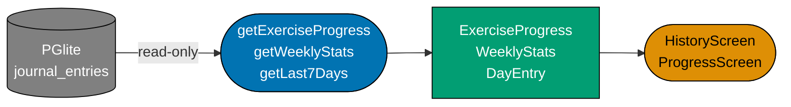

# Ubiquitous Language — stats

**Bounded context**: `stats`
**Maintainer**: organiclever-web team
**Last reviewed**: 2026-05-09
**Audience:** Engineers, Technical Product/Project Managers

## One-line summary

Read-only projections over `JournalEvent`s — daily/weekly/monthly aggregates, streaks,
and progress charts. No persistence of its own; pure derivations from the journal context
via Effect-typed use-cases.

## Term index

| Term            | Code identifier(s)                                                  | Used in features                                |
| --------------- | ------------------------------------------------------------------- | ----------------------------------------------- |
| `Aggregate`     | `getWeeklyStats` (use-case fn), `WeeklyStats` (TS type)             | `stats/*.feature`                               |
| `Projection`    | `ExerciseProgress` (TS type), `DayEntry` (TS type)                  | `stats/*.feature`                               |
| `Period`        | `day` / `week` / `month` (string literal values, no dedicated type) | `stats/*.feature`                               |
| `Streak`        | `computeStreak` (domain fn), `WeekWorkoutRow` (input shape)         | `stats/*.feature`                               |
| `History view`  | `HistoryScreen` (component), `app/history` (route segment)          | `stats/*.feature` (history-flavoured scenarios) |
| `Progress view` | `ProgressScreen` (component), `app/progress` (route segment)        | `stats/*.feature` (progress scenarios)          |

## Terms in detail

### Term: `Aggregate`

A derived rollup over a period — counts, totals, and averages of `JournalEvent`s for a
given window (week, month). `Aggregate` is the general concept; `WeeklyStats` is the
most prominent concrete shape, surfaced on the home and progress screens. All aggregates
are computed on read; none are persisted to PGlite.

**Code identifier(s)**:
`getWeeklyStats` — Effect-based use-case returning `WeeklyStats`
(`apps/organiclever-web/src/contexts/stats/application/stats.ts`).
`WeeklyStats` — the aggregate value type (`workoutsThisWeek: number`, `streak: number`,
`totalMins: number`, `totalSets: number`)
(`apps/organiclever-web/src/contexts/stats/domain/types.ts`).
Also: `getLast7Days` returns `DayEntry[]` (7-day bar-chart data), `getVolume` returns
volume totals, both in the same application file.

**Used in features**: `stats/*.feature`

**Forbidden synonyms in this context**: "Event" (owned by `journal`); "Entry" (used by
`journal`/`routine` — inside `stats` prefer "aggregate row" or "projection row").

**Related**: `Projection`, `Period`, `Streak`

---

### Term: `Projection`

A purely derived view over `JournalEvent`s. Always read-only — never writes back to the
journal. The `stats` bounded context is entirely composed of projections. A `Projection`
maps raw journal data into a shaped type useful for a specific view (e.g., exercise
progress over time, per-day session counts). Two concrete projection types ship today:
`ExerciseProgress` (per-exercise weight/reps trend) and `DayEntry` (per-day session
summary for bar charts).

**Diagram**: The diagram below shows the data-flow shape of a `Projection`. `JournalEvent`
rows are read from PGlite via `journal/application` use-cases; the `stats` application
layer maps them through domain helpers (`computeStreak`, `brzycki1RM`, `parseWeight`)
into typed projection values consumed by the presentation layer.

**Code identifier(s)**:
`ExerciseProgress` — per-exercise progress projection (`routineName: string | null`,
`points: ExerciseProgressPoint[]`)
(`apps/organiclever-web/src/contexts/stats/domain/types.ts`).
`DayEntry` — per-day summary (`date: Date`, `label: string`, `durationMins: number`,
`sessions: number`) (same file).
`getExerciseProgress` — Effect-based use-case returning `ExerciseProgress`
(`apps/organiclever-web/src/contexts/stats/application/stats.ts`).

**Used in features**: `stats/*.feature`

**Forbidden synonyms in this context**: "Append", "bump" (write verbs owned by `journal`
— `stats` never mutates); "Query" (too database-flavoured for domain conversations).

**Related**: `Aggregate`, `History view`, `Progress view`

---

### Term: `Period`

The time window over which an `Aggregate` is computed. Values: `day`, `week`, `month`.
Not a dedicated type in the domain — period is expressed as a string literal in use-case
arguments. The most common period today is `week` (the `WeeklyStats` aggregate uses a
7-day rolling window from PGlite).

**Code identifier(s)**:
`"day"` / `"week"` / `"month"` — literal string values passed as arguments to stats
use-cases in
`apps/organiclever-web/src/contexts/stats/application/stats.ts`.

**Used in features**: `stats/*.feature`

**Forbidden synonyms in this context**: "Timeframe" (too imprecise — the domain word is
`Period`); "Range" (implies start + end, while `Period` is a named granularity).

**Related**: `Aggregate`, `Streak`

---

### Term: `Streak`

A consecutive-qualifying-week count of workout activity. A week "qualifies" if it
contains ≥ 2 workout `JournalEvent`s. The streak walks backwards from the current
Monday-aligned week start; the first non-qualifying week breaks the streak. Displayed on
the home and progress screens as motivation metric.

**Code identifier(s)**:
`computeStreak` — pure domain function taking `WeekWorkoutRow[]` and returning `number`
(`apps/organiclever-web/src/contexts/stats/domain/types.ts`).
`WeekWorkoutRow` — the input shape: `{ week_start: string | Date; workout_count: string
| number }` (same file).
`streak` — the field on `WeeklyStats` returned by `getWeeklyStats` (same file).

**Used in features**: `stats/*.feature`

**Forbidden synonyms in this context**: "Score" (implies a grade, not a time series
count); "Points" (gamification term not used in the domain).

**Related**: `Aggregate`, `Period`

---

### Term: `History view`

The chronological list of `JournalEvent`s rendered by the `/app/history` page. A `stats`
projection (read-only over journal data) — it does not write to the journal. Ordered
newest-first. Allows the user to see a full log of what they have done without exposing
journal write operations.

**Code identifier(s)**:
`HistoryScreen` — the React component
(`apps/organiclever-web/src/contexts/stats/presentation/components/history-screen.tsx`).
`app/history` — the Next.js route segment
(`apps/organiclever-web/src/app/app/history/page.tsx`).

**Used in features**: `stats/*.feature` (history-flavoured scenarios)

**Forbidden synonyms in this context**: "Activity feed" (social-media connotation);
"Journal view" (the journal context owns write operations — the history view is a read
projection, not the journal itself).

**Related**: `Projection`, `Progress view`

---

### Term: `Progress view`

The aggregated chart-and-streak view rendered by the `/app/progress` page. Surfaces
`WeeklyStats`, the 7-day bar chart (`DayEntry[]`), and per-exercise progress trends
(`ExerciseProgress`). Pure projection — never writes. The canonical screen for the user
to understand their long-term workout trend.

**Code identifier(s)**:
`ProgressScreen` — the React component
(`apps/organiclever-web/src/contexts/stats/presentation/components/progress-screen.tsx`).
`app/progress` — the Next.js route segment
(`apps/organiclever-web/src/app/app/progress/page.tsx`).

**Used in features**: `stats/*.feature` (progress scenarios)

**Forbidden synonyms in this context**: "Analytics screen" (too product-analytics;
the UL term is `Progress view`); "Stats screen" (informal — use `Progress view` in
Gherkin steps to match the route name).

**Related**: `Projection`, `Aggregate`, `History view`

---

## Forbidden synonyms

- "Event" — owned by `journal`. Inside `stats`, prefer "aggregate" or "projection".
- "Append", "bump" — write verbs owned by `journal`. Stats never mutates.
- "Entry" — used by `journal`/`routine` with their own meanings. Inside `stats`, prefer
  "aggregate row" or "projection row".
