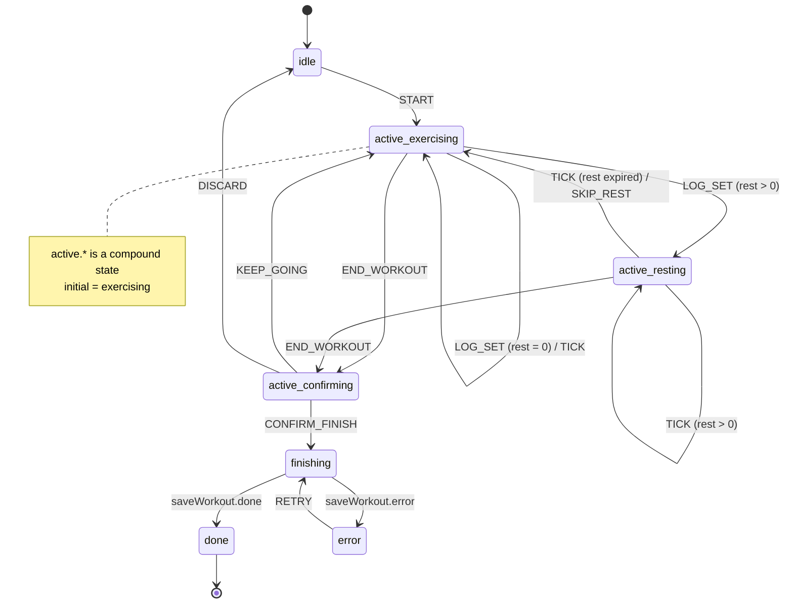

# Ubiquitous Language — workout-session

**Bounded context**: `workout-session`
**Maintainer**: organiclever-web team
**Last reviewed**: 2026-05-09
**Audience:** Engineers, Technical Product/Project Managers

## One-line summary

In-progress workout state machine: lifts a `Routine` template into an active
`WorkoutSession`, tracks set-by-set progress through XState v5 sub-states, and persists
the outcome through the journal context as a `WorkoutPayload` `JournalEvent`.

## Term index

| Term              | Code identifier(s)                                                                            | Used in features                         |
| ----------------- | --------------------------------------------------------------------------------------------- | ---------------------------------------- |
| `WorkoutSession`  | `WorkoutMachineContext` (TS type), `workoutSessionMachine` (XState v5)                        | `workout-session/*.feature`              |
| `Start`           | `START` (machine event type)                                                                  | `workout-session/*.feature`              |
| `Finish`          | `CONFIRM_FINISH` (machine event type), `END_WORKOUT` (intent event)                           | `workout-session/*.feature`              |
| `Workout outcome` | `buildWorkoutEntry` (use-case fn)                                                             | `workout-session/*.feature`, `journal/*` |
| `Set log`         | `ActiveExercise` (type), `LOG_SET` (machine event), `WorkoutMachineContext` (exercises field) | `workout-session/*.feature`              |
| `Workout screen`  | `WorkoutScreen` (component), `workout` (route segment)                                        | `workout-session/*.feature`              |
| `Finish screen`   | `FinishScreen` (component), `workout/finish` (route segment)                                  | `workout-session/*.feature`              |

## Terms in detail

### Term: `WorkoutSession`

The aggregate modelling one in-progress workout. Not a persisted entity — it lives
entirely in the XState v5 machine context (`WorkoutMachineContext`) for the duration of
the session. The machine starts `idle`, transitions into `active` (with three sub-states:
`exercising`, `resting`, `confirming`), then flows through `finishing` (async journal
write) to `done` or `error`. Discarding resets to `idle` without writing to the journal.

**Diagram**: The diagram below shows the top-level states and their transitions. The
`active` compound state has three internal sub-states; `exercising` is the default entry
point. Transitions match the runtime `workoutSessionMachine` exactly.

**Code identifier(s)**:
`WorkoutMachineContext` — the machine context type holding all session state
(`apps/organiclever-web/src/contexts/workout-session/application/workout-machine.ts`).
`workoutSessionMachine` — the XState v5 machine definition (same file).

**Used in features**: `workout-session/*.feature`

**Forbidden synonyms in this context**: "entry" (used by `journal` for a generic event —
inside `workout-session`, prefer "set" for a per-set log entry or "outcome" for the
persisted record); "plan" (not a domain term).

**Related**: `Start`, `Finish`, `Set log`, `Workout screen`

---

### Term: `Start`

The user action that transitions the machine from `idle` to `active.exercising`, loading
a `Routine` and seeding the `Set log` from the routine's `ExerciseGroup`s. After `Start`,
the elapsed-seconds timer begins ticking via `TICK` events fired by the UI on a 1-second
interval.

**Code identifier(s)**:
`START` — the XState machine event type
(`apps/organiclever-web/src/contexts/workout-session/application/workout-machine.ts`,
`WorkoutMachineEvent` union).

**Used in features**: `workout-session/*.feature`

**Forbidden synonyms in this context**: "Begin" or "Launch" — the domain word is `Start`;
Gherkin steps use "start the workout" to match.

**Related**: `WorkoutSession`, `Workout screen`

---

### Term: `Finish`

The two-step user action that ends a `WorkoutSession`. First the user signals intent via
`END_WORKOUT` (entering the `confirming` sub-state); then confirms via `CONFIRM_FINISH`
which triggers the async `finishing` state that calls `buildWorkoutEntry` and persists via
`appendEntries` into the journal. Alternatively the user cancels via `KEEP_GOING`
(returning to `exercising`) or abandons via `DISCARD` (resetting to `idle` without
persisting).

**Code identifier(s)**:
`END_WORKOUT` — the intent event (transition from `exercising`/`resting` → `confirming`)
(`apps/organiclever-web/src/contexts/workout-session/application/workout-machine.ts`).
`CONFIRM_FINISH` — the confirmation event (transition `confirming` → `finishing`, same
file).

**Used in features**: `workout-session/*.feature`

**Forbidden synonyms in this context**: "Complete" (too passive — the UL term is
`Finish`); "Save" (an infrastructure detail, not a domain action visible to the user).

**Related**: `WorkoutSession`, `Workout outcome`, `Finish screen`

---

### Term: `Workout outcome`

The data captured at `Finish` — the `Routine` name, total duration in seconds, and the
full `Set log` (sets completed, reps, weights). Encoded as a `WorkoutPayload` and written
to the journal as a new `JournalEvent` via `appendEntries`. The `buildWorkoutEntry`
function constructs the payload from `WorkoutMachineContext` at the moment `CONFIRM_FINISH`
fires.

**Code identifier(s)**:
`buildWorkoutEntry` — pure function converting `WorkoutMachineContext` → `NewEntryInput`
(`apps/organiclever-web/src/contexts/workout-session/application/workout-machine.ts`).
`WorkoutPayload` — the typed payload schema the outcome is encoded as
(`apps/organiclever-web/src/contexts/journal/domain/typed-payloads.ts`).

**Used in features**: `workout-session/*.feature`, `journal/*`

**Forbidden synonyms in this context**: "result" (too vague — use "outcome"); "log"
(sounds like the per-set `Set log`, not the final persisted record).

**Related**: `Finish`, `Set log`

---

### Term: `Set log`

The accumulating list of completed sets within an active `WorkoutSession`. Each entry
captures the reps, weight, duration, and rest taken for one set. Grows as the user logs
sets via `LOG_SET` events. Becomes the `exercises` array in the `Workout outcome` at
`Finish`. Exists only in machine context during the session — never independently
persisted.

**Code identifier(s)**:
`exercises: ActiveExercise[]` — the field on `WorkoutMachineContext` that stores the
set-by-set progress. `ActiveExercise` extends `ExerciseTemplate` with a `sets:
CompletedSet[]` array
(`apps/organiclever-web/src/contexts/workout-session/application/workout-machine.ts`).
`LOG_SET` — the machine event that appends one `CompletedSet` to the active exercise
(same file).

**Used in features**: `workout-session/*.feature`

**Forbidden synonyms in this context**: "history" (a screen concept in the `stats`
context); "journal" (the cross-context destination — the `Set log` becomes part of a
`JournalEvent` only after `Finish`).

**Related**: `WorkoutSession`, `Workout outcome`

---

### Term: `Workout screen`

The route `/app/workout` rendered during an active `WorkoutSession`. Shows the current
exercise, set-log progress, elapsed time, and a button to end the workout (`END_WORKOUT`).
The machine is mounted at the app layout level; the `WorkoutScreen` component reads from
`WorkoutMachineContext` via the `useActor` hook.

**Code identifier(s)**:
`WorkoutScreen` — the React component
(`apps/organiclever-web/src/contexts/workout-session/presentation/components/workout-screen.tsx`).
`workout` — the Next.js route segment
(`apps/organiclever-web/src/app/app/workout/page.tsx`).

**Used in features**: `workout-session/*.feature`

**Forbidden synonyms in this context**: "Active session page" (too descriptive — the UL
term is `Workout screen`).

**Related**: `WorkoutSession`, `Start`

---

### Term: `Finish screen`

The route `/app/workout/finish` shown after `CONFIRM_FINISH` triggers the `finishing`
state and `done` is reached. Displays the `Workout outcome` summary — duration, exercises
completed, sets/reps/weights logged — before the user navigates back to home.

**Code identifier(s)**:
`FinishScreen` — the React component
(`apps/organiclever-web/src/contexts/workout-session/presentation/components/finish-screen.tsx`).
`workout/finish` — the Next.js route segment
(`apps/organiclever-web/src/app/app/workout/finish/page.tsx`).

**Used in features**: `workout-session/*.feature`

**Forbidden synonyms in this context**: "Summary screen" (too generic); "Done screen"
(informal — the UL term is `Finish screen`).

**Related**: `Finish`, `Workout outcome`

---

## Forbidden synonyms

- "Entry" — used by `journal` for a generic event. Inside `workout-session`, prefer "set"
  (per-set log entry) or "outcome" (the persisted record).
- "Plan" — not a domain term. Use "session" for the active flow, "routine" only when
  explicitly referencing the template the session was lifted from.
