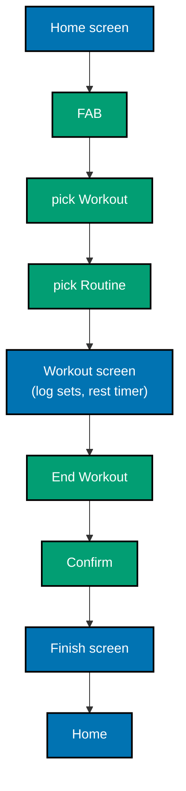
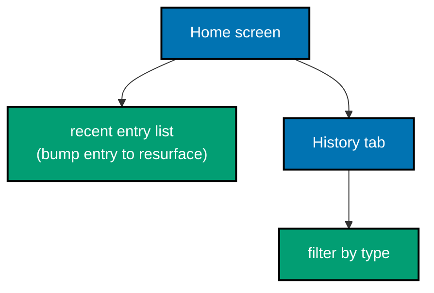

# OrganicLever — Product Overview

**Audience:** Engineers, Technical Product/Project Managers

OrganicLever is a local-first life journal that helps you log what you do — workouts,
reading, learning, meals, focus sessions — and see your progress over time. Everything
stays on your device: no account, no server, no sync. The browser is the database.

## Who it is for

| Persona                    | Need                                            |
| -------------------------- | ----------------------------------------------- |
| **The consistent trainer** | Wants to log workout sets without a bulky app   |
| **The curious learner**    | Tracks reading pages and learning topics weekly |
| **The self-optimizer**     | Reviews a week of data to spot what worked      |

The initial focus is on the consistent trainer. Workout logging is the deepest feature
shipped today; all other entry types (reading, learning, meal, focus) follow the same
append-and-bump pattern but with lighter UIs.

## Ships today

OrganicLever delivers one closed loop today:

1. **Build a routine** — name a workout template, add exercise groups with default sets /
   reps / weight.
2. **Start a session** — pick a routine, log sets one at a time as you go, rest timer
   counts down automatically.
3. **Review your history** — see every logged entry in reverse-chronological order with
   relative timestamps ("3h ago").
4. **Track your streak** — a weekly streak badge appears on the home screen once you hit
   two workouts in a week.

## Deferred

OrganicLever is rolling-release on `main` — items below ship when ready, no version cut.

- **Authentication and accounts** — all data is local; no login flow ships today.
- **Cloud sync** — no server writes; PGlite (Postgres-WASM, IndexedDB-backed) is the
  only storage.
- **Social or sharing features** — private log only.
- **Weight/length unit settings** — kg only today; `lb`/`in` support is placeholdered.
- **Data export and reset** — UI stubs exist in Settings; backend not yet implemented.
- **Progress charts** — the `/app/progress` screen exists but chart data is still
  placeholder.

## Primary user flows

The two flows a user runs most often today:

**Flow A — Log a workout (5–15 min)**

**Flow B — Check recent activity (< 1 min)**

## In plain language

- You log what you did. It remembers. You see it later.
- No account. No subscription. No data leaves your phone.
- The streak badge is the only "game mechanic" today.

## Related

- [System context](../system-context/context.md) — how OrganicLever fits into the
  broader technical landscape
- [Container diagram](../containers/container.md) — web app + backend health diagnostic
- [Behavior specs](../behavior/web/gherkin/README.md) — Gherkin acceptance criteria per
  bounded context
