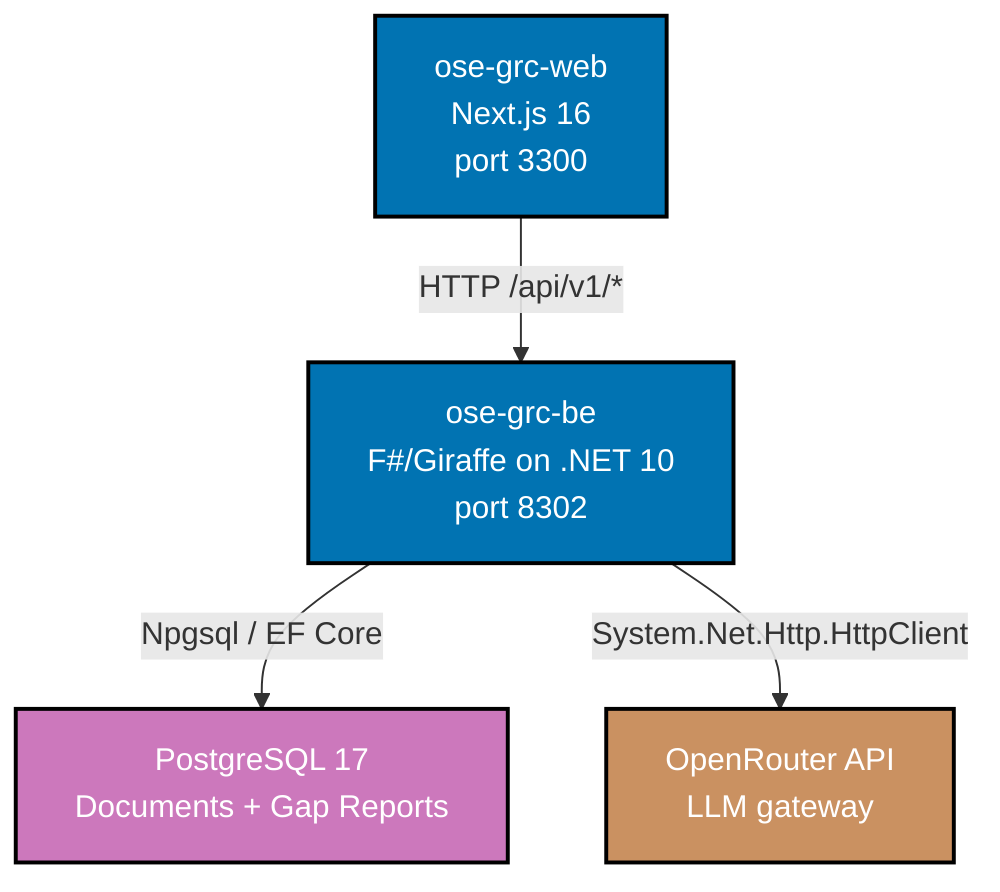

# OSE GRC — Container Diagram (C4 L2)

## Container descriptions

| Container      | Technology             | Port | Purpose                                            |
| -------------- | ---------------------- | ---- | -------------------------------------------------- |
| `ose-grc-web`  | Next.js 16, TypeScript | 3300 | Frontend SPA — document upload UI, gap report view |
| `ose-grc-be`   | F#/Giraffe, .NET 10    | 8302 | REST API — document ingestion, gap analysis engine |
| PostgreSQL 17  | Docker (dev), managed  | 5432 | Persistence for documents, policies, gap reports   |
| OpenRouter API | External HTTP API      | —    | LLM gateway for AI-assisted gap analysis           |
