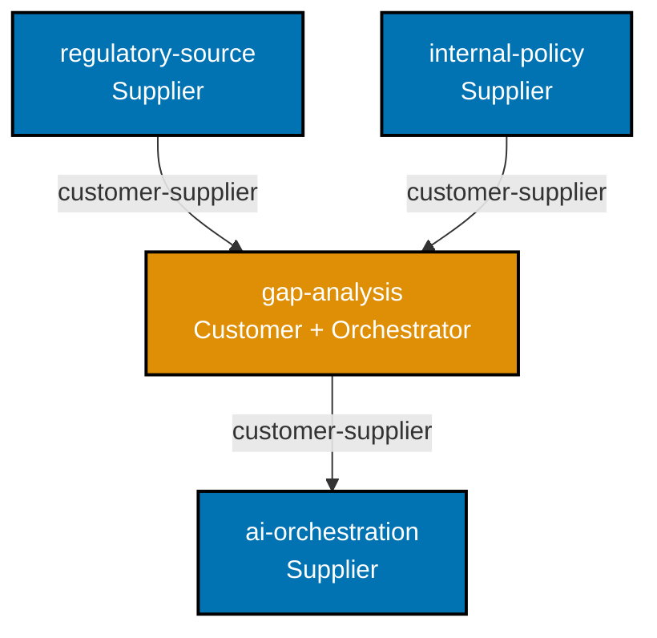

# Bounded Context Map — OSE GRC

Visual map of the four bounded contexts in OSE GRC and their strategic relationships.

## Context Map

## Relationship Table

| Upstream (Supplier) | Downstream (Customer) | Pattern           | Notes                                   |
| ------------------- | --------------------- | ----------------- | --------------------------------------- |
| `regulatory-source` | `gap-analysis`        | customer-supplier | GA reads regulatory corpus              |
| `internal-policy`   | `gap-analysis`        | customer-supplier | GA reads internal policy corpus         |
| `ai-orchestration`  | `gap-analysis`        | customer-supplier | GA calls LLM via AI orchestration layer |

## Context Summaries

| Context             | One-line responsibility                                                          |
| ------------------- | -------------------------------------------------------------------------------- |
| `regulatory-source` | Ingests and stores regulator-published rule documents with provenance metadata   |
| `internal-policy`   | Ingests and stores company-internal documents (SOPs, manuals, procedures)        |
| `gap-analysis`      | Compares regulatory corpus against policy corpus; emits structured `GapItem`s    |
| `ai-orchestration`  | Wraps LLM calls (OpenRouter), prompt management, retry/backoff, token accounting |
