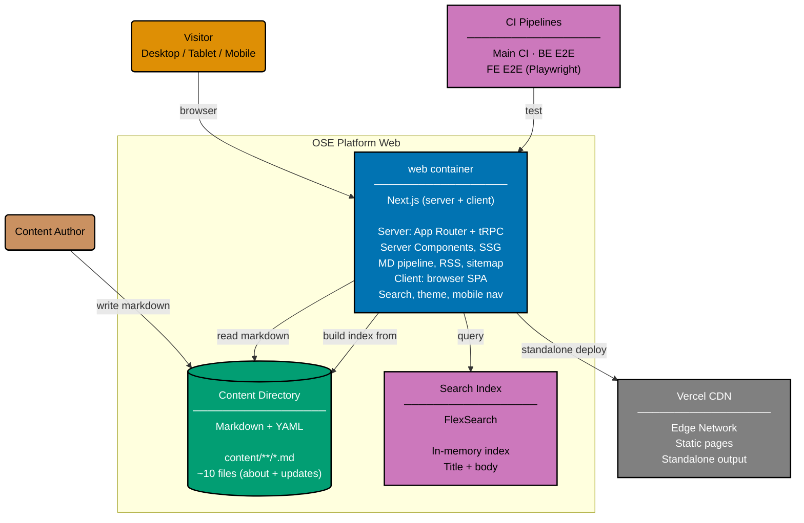

# Container Diagram: OSE Platform Web

Level 2 of the C4 model. Shows the runtime containers inside the OSE Platform Web system
boundary: the Next.js application (server + client), the content directory, the in-memory search
index, and the Vercel hosting platform.

The Next.js app runs as a standalone deployment on Vercel. Content pages are statically generated
at build time via `generateStaticParams`. The search index is built in-memory from content
metadata using FlexSearch.

## Containers (1) and behavior perspectives (2)

`ose-web` deploys as a **single container**, named `web`. The tRPC API runs **inside**
the same Next.js process — there is no separate `ose-web` (no separate backend — deployable. To honour C4 L2's
"container = independently deployable unit" rule, the table below lists exactly one container row.

Behavior is documented from **two perspectives**, captured as Gherkin slugs:

| Perspective slug                | What it covers                                                                                        |
| ------------------------------- | ----------------------------------------------------------------------------------------------------- |
| `web` (`behavior/web/gherkin/`) | UI-semantic scenarios — what the browser renders and how the visitor interacts                        |
| `api` (`behavior/api/gherkin/`) | tRPC HTTP-semantic scenarios — what the tRPC layer returns to a caller (browser, Playwright, scripts) |

The `api` slug is intentionally chosen over `be` to prevent the misreading that there is a separate
backend container. Both perspectives describe the same single `web` container; perspectives slice
behaviour by audience (visitor vs API caller), not by deployable.

| Container | Slug  | Tech                               | Hosting             | Behaviour perspectives        |
| --------- | ----- | ---------------------------------- | ------------------- | ----------------------------- |
| Web       | `web` | Next.js 16 (App Router) + tRPC v11 | Vercel (standalone) | `web` (UI), `api` (tRPC HTTP) |

## Container diagram

## Container Details

### web (Next.js — single deployable)

The single deployable handles both perspectives:

- **Server side** (rendered into the `api` perspective's Gherkin):
  - **tRPC API** (`/api/trpc/[trpc]`): Procedures for content retrieval, search, health
  - **Server Components**: Pages statically generated at build time via `generateStaticParams`
  - **Content pipeline**: gray-matter → unified (remark/rehype) → HTML with shiki syntax highlighting
  - **Search index**: FlexSearch built from all content metadata at startup
  - **RSS feed**: `/feed.xml` generated from update posts
  - **SEO**: `/sitemap.xml` and `/robots.txt` for search engine crawlers
- **Client side** (rendered into the `web` perspective's Gherkin):
  - **Search dialog**: Full-text search via tRPC call to in-process FlexSearch
  - **Theme toggle**: Dark/light mode via next-themes
  - **Mobile navigation**: Hamburger menu for small viewports
  - **Content rendering**: Markdown HTML with code blocks, Mermaid diagrams

### Content Directory

- ~10 markdown files with YAML frontmatter
- About page and update posts
- Frontmatter: title, date, summary, tags, draft

## Related

- **Context diagram**: [context.md](../system-context/context.md)
- **API perspective component diagram**: [component-api.md](../components/api/component-api.md)
- **Web perspective component diagram**: [component-web.md](../components/web/component-web.md)
- **Parent**: [ose-web specs](../README.md)
