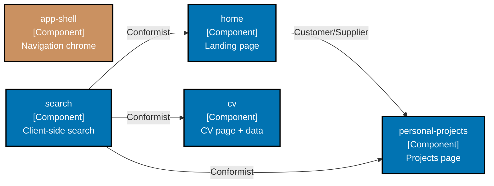

# wahidyankf-web — Web Component Diagram (C4 L3)

**Audience:** Engineers, Technical Product/Project Managers

## Bounded contexts

| BC                  | Layers                        | Code path                              |
| ------------------- | ----------------------------- | -------------------------------------- |
| `app-shell`         | `[presentation]`              | `src/contexts/app-shell/presentation/` |
| `home`              | `[presentation]`              | `src/contexts/home/presentation/`      |
| `cv`                | `[application, presentation]` | `src/contexts/cv/`                     |
| `personal-projects` | `[application, presentation]` | `src/contexts/personal-projects/`      |
| `search`            | `[application, presentation]` | `src/contexts/search/`                 |

## Diagram

## Related

- [DDD registry](../../ddd/bounded-contexts.yaml) — authoritative BC declarations
- [Bounded-context map](../../ddd/bounded-context-map.md) — relationship diagram
