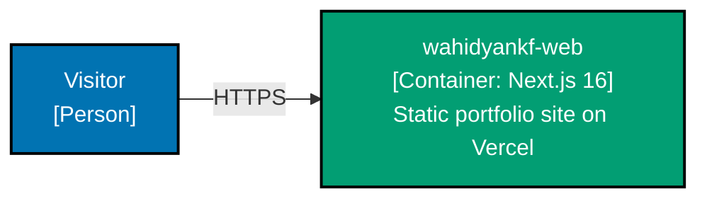

# wahidyankf-web — Container Diagram (C4 L2)

**Audience:** Engineers, Technical Product/Project Managers

## Containers

| Container | Technology | Deployment      | Description                             |
| --------- | ---------- | --------------- | --------------------------------------- |
| `web`     | Next.js 16 | Vercel (static) | Portfolio site — all 5 bounded contexts |

No backend, no database, no message bus. All content is static TypeScript bundled at build time.

## Diagram

## Notes

- No tRPC, no API routes, no server components with data fetching
- Search is client-side (in-memory, built from static data)
- Theme preference is not persisted across sessions
