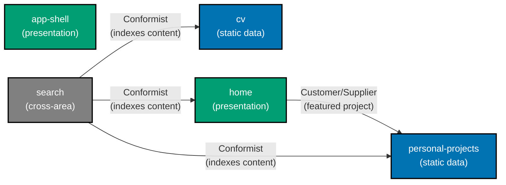

# Bounded-Context Map — wahidyankf-web

**Audience:** Engineers, Technical Product/Project Managers

**Status**: Complete. See the [DDD + specs format plan](../../../../plans/in-progress/wahidyankf-web-ddd-and-specs-format/README.md).
**Authority**: This document is the source of truth for bounded-context boundaries inside
`apps/wahidyankf-web`. It complements (does not replace) the platform-wide
[DDD Standards](../../../../docs/explanation/software-engineering/architecture/domain-driven-design-ddd/README.md).

## Summary

`wahidyankf-web` is one Nx app holding five bounded contexts. Two own domain logic
(`cv`, `personal-projects`); two are pure-presentation surfaces (`app-shell`, `home`); one
is a cross-area search layer (`search`). All content is static — built at compile time with
no backend or database.

## Contexts

| Context             | Persistence    | Owns                                                                | Depends on                                    |
| ------------------- | -------------- | ------------------------------------------------------------------- | --------------------------------------------- |
| `app-shell`         | None           | Navigation bar, theme toggle, responsive layout, accessibility wire | —                                             |
| `home`              | None           | Landing page rendering — hero, top skills, contact links            | `personal-projects` (featured project teaser) |
| `cv`                | None (static)  | CV data model, projection helpers, CV page rendering                | —                                             |
| `personal-projects` | None (static)  | Project records, tech-tag filter logic, projects page rendering     | `home` (supplies featured project data)       |
| `search`            | In-memory only | Search index builder, scoring algorithm, search-input UI            | `home`, `cv`, `personal-projects` (read only) |

## Strategic relationships

- `home` → `personal-projects` — **Customer/Supplier**. Home page shows a featured project
  teaser sourced from personal-projects data; personal-projects supplies that data without
  depending on home in return.
- `search` → `home` — **Conformist**. Search indexes home content as supplied; never
  modifies it.
- `search` → `cv` — **Conformist**. Search indexes CV content as supplied; never modifies
  it.
- `search` → `personal-projects` — **Conformist**. Search indexes project content as
  supplied; never modifies it.
- `app-shell` — **Independent**. Navigation and chrome wrap all pages but own no domain
  entities and are not called into by any context.

## Diagram

Legend:

- **Blue** — data-owning bounded contexts (own static records and projection helpers).
- **Teal** — pure-presentation contexts (no domain entities, render only).
- **Gray** — cross-cutting context (`search`) — reads from all, writes to none.
- **Solid arrow** — runtime dependency (caller → callee through context's `application/`).

## Related

- [bounded-contexts.yaml](./bounded-contexts.yaml) — Machine-readable registry
- [ubiquitous-language/](./ubiquitous-language/README.md) — Per-BC glossaries
