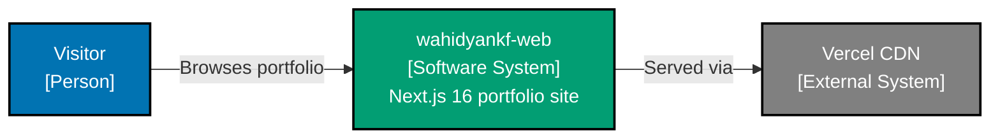

# wahidyankf-web — System Context (C4 L1)

**Audience:** Engineers, Technical Product/Project Managers

## Actors

| Actor   | Description                                         |
| ------- | --------------------------------------------------- |
| Visitor | Anonymous browser user — no authentication required |

## External systems

| System     | Interaction                                          |
| ---------- | ---------------------------------------------------- |
| Vercel CDN | Serves all static assets; handles TLS and edge cache |

## Diagram

## Trust boundaries

The site is fully static — no server-side code executes at request time. All content is
rendered at build time by Next.js. No user data is collected, stored, or transmitted
beyond standard CDN access logs managed by Vercel.
